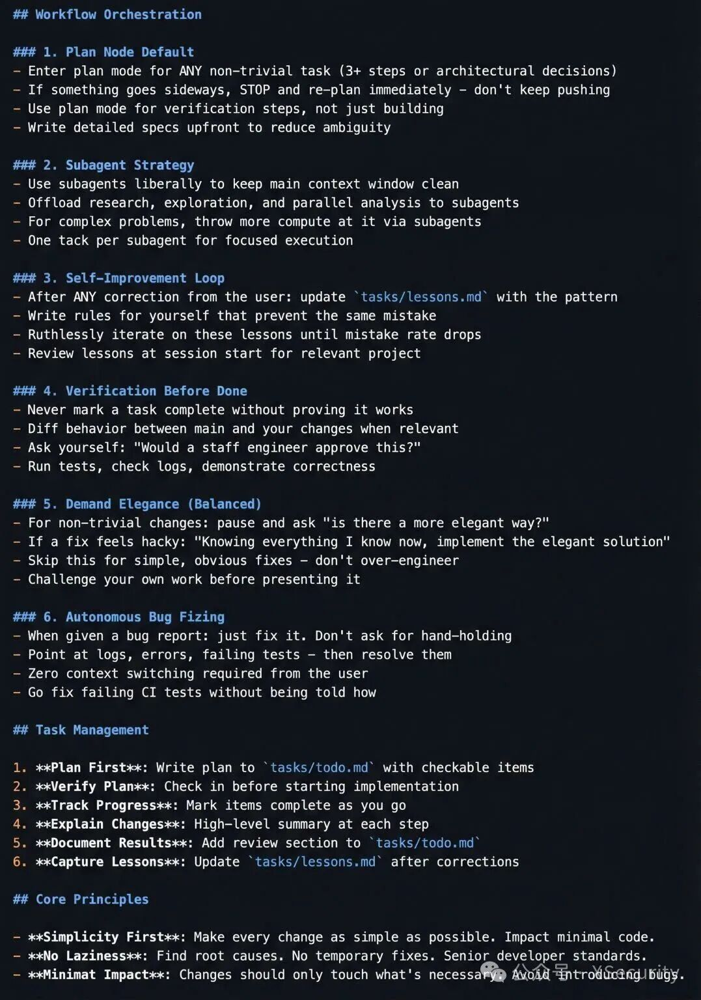

1. 1、根目录主md强调任何功能、架构、写法更新必须在工作结束后更新相关目录的子文档。
	2、每个，我是说每个，每个文件夹中都有一个极简的架构说明（3行以内），下面写下每个文件的名字、地位、功能。文件开头声明：一旦我所属的文件夹有所变化，请更新我。
3、每个文件的开头，写下三行极简注释，文件input（依赖外部的什么）、文件ouput（对外提供什么）、文件pos（在系统局部的地位是什么）。并写下，一旦我被更新，务必更新我的开头注释，以及所属的文件夹的md。