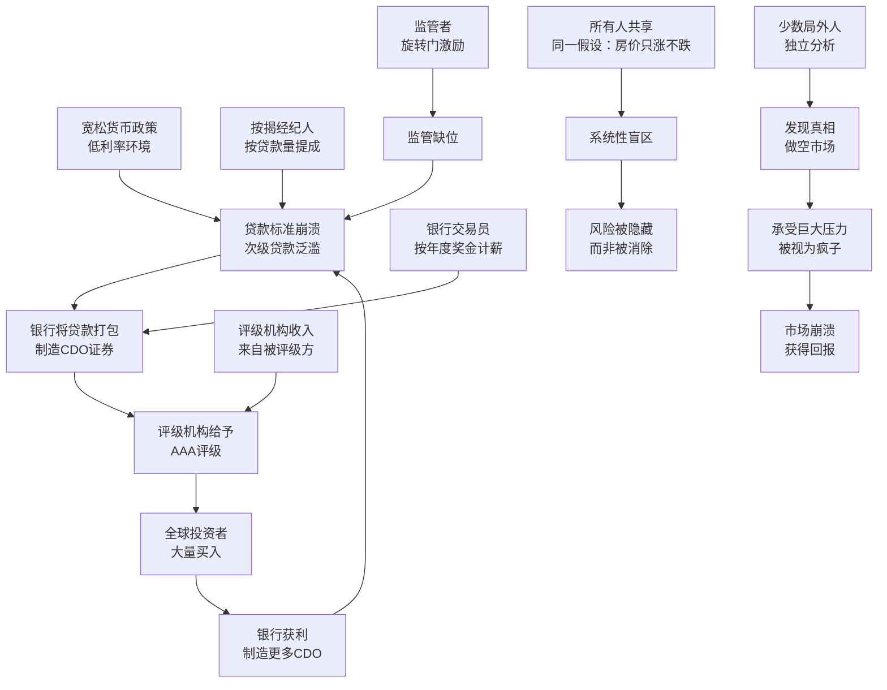

# 《大空头》深度读书笔记

> 2010年出版的《大空头》是迈克尔·刘易斯对2007-2008年美国次贷危机最具洞察力的非虚构叙事。刘易斯没有选择从政府官员或银行CEO的视角讲述这场世纪级灾难——他追踪的是另一群人：那些在整个世界都在狂欢时提前看到了崩溃、敢于与整个市场对赌、并最终从灾难中获利的少数局外人。这个叙事选择本身就是一个深刻的判断：要理解一个系统为什么失败，最有效的方式不是看那些在系统中随波逐流的人，而是看那些站在系统外面、看穿了系统的人。通过迈克尔·伯里、史蒂夫·艾斯曼、格雷格·李普曼、查理·莱德利和杰米·迈等人物的视角，刘易斯层层揭开了一个令人不安的真相：次贷危机不是一场意外，而是一个激励扭曲、认知失明和结构性脆弱共同作用的必然产物。每个个体都在理性地追求自身利益，但这些理性的总和是集体的疯狂。这本书不仅是金融史的杰作，更是一部关于人类如何在系统性的激励下自愿放弃判断力的寓言。

## 这本书要解决什么问题

2008年9月，雷曼兄弟倒闭，全球金融体系几乎崩溃。美国政府不得不动用数千亿美元纳税人资金救助华尔街，失业率飙升至10%，数百万家庭丧失住房，全球经济陷入大萧条以来最严重的衰退。

这场灾难震惊了几乎所有人——包括绝大多数金融专业人士、经济学家和监管者。美联储主席伯南克在2007年初还公开声称次级贷款问题"不太可能蔓延到更广泛的经济"。高盛、摩根士丹利、花旗银行的风险管理团队拥有最先进的数学模型，却没有预见到自家资产负债表上正在酝酿的灾难。

但有一群人预见到了。他们不是监管者，不是央行行长，不是诺贝尔经济学奖得主——他们是几个性格古怪的基金经理、一对默默无闻的年轻人、和一个在华尔街以刺头闻名的分析师。他们从2004年、2005年就开始系统性地做空美国房地产市场，在所有人嘲笑他们的时候坚持自己的判断，最终在市场崩溃时获得了数十亿美元的回报。

刘易斯要回答的核心问题是：这些人是怎么看到别人看不到的东西的？他们的成功说明了什么？更重要的是——为什么整个系统都看不到他们看到的东西？这个"系统性失明"是怎么发生的？

这不是一个纯粹的金融问题。它触及了更根本的议题：在一个高度复杂、高度专业化的现代社会中，认知是如何被制度、激励和群体动力学所塑造——甚至扭曲——的。

要理解刘易斯写这本书的背景，需要知道他自己的经历。1980年代，他在所罗门兄弟公司做债券销售员，亲眼目睹了抵押贷款证券化的早期历史——正是所罗门兄弟在1970年代末率先将住房抵押贷款打包成证券出售，开创了整个MBS（抵押贷款支持证券）市场。刘易斯在1989年出版的《说谎者的扑克牌》中记录了那段经历，并在离开华尔街后成为专职作家。二十年后，当他看到自己曾经见证其诞生的金融工具引发了人类历史上最严重的经济灾难之一时，他有一种独特的冲动去追问：到底哪里出了错？而他追问的方式，不是去采访那些"犯了错的人"，而是去找到那些"看对了的人"——因为理解这些人是如何超越系统的蒙蔽看到真相的，可能比分析系统本身更有价值。

## 核心模型地图

刘易斯在《大空头》中没有使用学术化的框架，但他通过叙事揭示了一个清晰的因果模型：次贷危机不是某个环节的失败，而是整条链条上每个环节的激励都指向同一个方向时产生的系统性灾难。

这个模型的核心逻辑可以归纳为三个层次：

**第一层：产品层面的复杂性陷阱。** 次级贷款本身就是风险极高的资产，但通过CDO打包和分层的技术，这些风险被重新包装成了看似安全的投资产品。复杂性不是解决了风险，而是隐藏了风险。

**第二层：激励层面的系统性扭曲。** 从贷款经纪人到银行到评级机构到监管者，产业链上每个参与者的激励都指向"继续制造更多CDO"。没有人的激励指向"停下来检查风险"。

**第三层：认知层面的群体锁定。** 所有参与者共享同一个假设——房价不会大范围下跌——而这个假设本身从未被严肃质疑。当共识足够强大时，它不再是一个可以检验的假说，而变成了一个不容置疑的信条。

三个层次相互强化：复杂性让风险难以被看到，激励扭曲让人们不愿意去看，群体共识让人们认为没有必要去看。只有同时脱离了这三重锁定的人——不依赖复杂模型而是回归原始数据、不受系统激励约束、不被群体共识所影响——才有可能看到真相。

## 逐层深入

### 一、次级贷款的真相：一切从源头开始腐烂

要理解次贷危机，必须从最底层开始：次级贷款本身。

"次级"（subprime）是一个委婉说法，它的意思是"借款人信用不够好，按正常标准拿不到贷款"。在正常的金融体系中，这些人被拒绝贷款恰恰是风险管理在发挥作用——你还不起钱，银行就不应该借给你。

但从2003年开始，情况发生了根本性变化。美联储在互联网泡沫破裂后将利率降至历史低位，充裕的流动性涌入房地产市场。银行发现了一个暴利生意：把贷款发放出去后立即打包卖给投资银行，自己不承担任何长期风险。既然风险可以转嫁，那为什么不多放点贷款呢？

贷款标准开始急剧恶化。先是出现了"低文档贷款"（low-doc loans）——借款人不需要提供完整的收入证明。然后是"无文档贷款"（no-doc loans）——完全不需要证明你有收入。最后出现了一种被业内戏称为"NINJA贷款"的产品——No Income, No Job, No Assets（没收入、没工作、没资产）——但你照样可以拿到几十万美元的住房贷款。

迈克尔·伯里是第一个系统性地钻进这些贷款文档里的人。他是一个自学成才的投资者，之前是神经外科住院医师，一只眼睛在儿时因为癌症被摘除。他患有阿斯伯格综合征，不擅长社交，但拥有惊人的专注力和数据分析能力。从2004年开始，他花了数月时间逐笔阅读次级抵押贷款的原始文档——每一份贷款的借款人信息、收入状况、还款条件——这是一件枯燥到令人窒息的工作，整个华尔街没有第二个人愿意做。

他发现的东西令他震惊：大量贷款发放给了明显无力偿还的人，而且许多贷款都采用了"可调利率"结构——前两三年利率极低（所谓的"引诱利率"），之后利率会大幅跳升。这意味着，一旦引诱期结束，借款人的月供可能翻倍甚至更多。这些人在引诱利率下就已经勉强度日，利率跳升后必然违约。而利率跳升的时间是可以精确计算的——2007年开始会有一波集中到期。

伯里不需要任何复杂的数学模型。他需要的只是基本的阅读能力和常识。但常识在华尔街是最稀缺的东西。

这里有一个深刻的讽刺：信息不是秘密的。伯里阅读的所有文档都是公开的，任何人都可以获取。高盛、摩根士丹利的分析师有着更好的信息渠道、更强大的研究团队、更多的资源——但他们没有一个人去做伯里做的事情。原因不是能力，而是动机。华尔街的分析师被激励去推荐买入，不是去质疑市场；他们的年终奖取决于交易量和利润，不取决于风险警示的准确性。一个发出"卖出"建议的分析师不会获得奖金——他只会失去客户。

伯里的阿斯伯格综合征在这个背景下有了特殊的意义。他不擅长社交，不善于读懂社会暗示，对群体压力近乎免疫——而这些在社交层面是"缺陷"的特质，在认知层面恰恰变成了优势。当所有人都在说"房价不会跌"时，一个对社会共识天然不敏感的人，更容易把注意力放在数据本身而非数据之上的叙事上。

### 二、CDO炼金术：垃圾如何变成黄金

银行把大量次级贷款发放出去后，面临一个问题：这些贷款风险很高，直接卖给投资者很难。解决方案是"证券化"——把成百上千份贷款打包成一个资产池，然后将这个资产池的现金流切分成不同的"档次"（tranches），按风险高低分层出售。

最底层的"权益级"最先承受损失，风险最高但收益也最高——这通常由对冲基金或投机者持有。中间的"夹层级"次之。最顶层的"优先级"最后承受损失，理论上最安全——这是养老基金、保险公司和外国央行大量购买的部分。

关键的炼金术发生在评级环节。评级机构——穆迪、标普、惠誉——用模型对这些CDO进行评级。他们的模型建立在一个核心假设之上：不同地区的房价走势是不相关的。如果加州的房价跌了，佛罗里达的不一定跌，纽约的不一定跌。所以只要贷款在地域上足够分散，总损失就会被控制在可承受范围内，优先级部分确实是安全的，值得AAA评级。

这个假设在过去几十年里大致成立——因为过去几十年里，房价上涨是由真实的经济基本面驱动的。但到了2003年以后，房价上涨的驱动力变了：它不再是收入增长和人口迁移，而是贷款标准的全面崩溃。当全国各地的贷款标准同时崩溃时，全国各地的违约也会同时发生——地域分散根本起不到任何保护作用。评级模型的核心假设在新的现实面前完全失效了。

更荒谬的是"CDO的CDO"（CDO-squared）的出现。当CDO中最难卖的夹层级卖不出去时，银行把这些夹层级再次打包成新的CDO——在新的CDO中，这些夹层级再次被切分成优先级和劣后级，再次拿到AAA评级。这就像把一群不及格学生的试卷混在一起，重新考一次，然后宣布其中一半人"优秀"。每一层包装都在远离真实风险，每一层评级都在制造安全的幻觉。

还有一种更极端的产物叫"合成CDO"（Synthetic CDO）。传统CDO至少还持有真实的贷款——合成CDO里面连真实贷款都没有，它完全由CDS合约构成，本质上就是一群人对另一群人下注。这意味着，理论上可以对同一批贷款创造出无限多的合成CDO——实际损失可能只有1000亿美元的贷款，但围绕这些贷款的合成CDO可能价值数万亿美元。这就是为什么次贷危机最终的损失远远超过了次级贷款本身的规模——杠杆通过合成CDO被无限放大了。

理解CDO的运作方式，你就理解了为什么这场危机不是某个人的错误，而是一个系统性的错误。没有人的职责是审视全局——每个人只负责自己那一环：按揭经纪人负责拉客户，银行负责打包，评级机构负责评级，投资者负责买入。每一环在隔离状态下看都有其"合理性"，但当你把整条链条串起来看，合理性就变成了荒谬。

### 三、CDS：做空工具的诞生与做空者的入场

如果没有信用违约掉期（CDS），看空者就没有做空的工具，《大空头》的故事也就不会存在。

CDS本质上是一种保险合同。买方定期支付保费，如果标的债券违约，卖方赔偿损失。它最初被设计为对冲工具——你持有一家公司的债券，担心它违约，就买入CDS来对冲风险。但CDS有一个关键特性：你不需要持有标的债券就可以购买CDS。这意味着你可以纯粹出于投机目的买入CDS——本质上就是在做空标的债券。

格雷格·李普曼是德意志银行的交易员，他是最早意识到CDS可以被用来大规模做空次贷市场的华尔街内部人士之一。李普曼的动机不是道德义愤——他是一个精明的交易员，看到了一个定价严重错误的机会。他开始在华尔街四处推销做空次贷的策略，帮助基金经理们理解CDS的运作方式和做空的逻辑。

伯里是最早开始大规模买入CDS的人。2005年，他联系高盛、德意志银行等投行，要求他们为他定制针对特定CDO的CDS。投行的反应是困惑和嘲笑——"你要做空房地产市场？你疯了吗？"但他们还是愿意卖出CDS，因为这对他们来说是"白赚"的保费收入。在他们看来，房地产市场崩溃的概率约等于零，收取保费就是纯利润。

这里有一个关键的不对称性：做空者的损失是有限的（每年支付的保费），但潜在收益是巨大的（如果CDO违约，可以获得面值与市值之差的全部赔偿）。这种"有限损失、无限收益"的结构，正是吸引莱德利和迈等小资金玩家进场的原因——他们用30万美元的小基金，通过CDS撬动了远超自身规模的押注。

### 四、艾斯曼的觉醒：从内部视角看穿骗局

史蒂夫·艾斯曼的故事代表了另一条通往真相的路径。他不是通过阅读文档发现问题的——他是通过和人交谈、亲眼观察行业运作方式来理解真相的。

艾斯曼在华尔街以尖刻和直率著称。他的职业生涯始于为奥本海默公司研究次级贷款企业——这在当时是华尔街最不受重视的角落。正是这个"低端"起点让他对次级贷款行业有了深入的第一手了解。他早在1990年代就写过报告，警告次级贷款行业的欺诈问题。

2006年，艾斯曼和他的团队开始系统性地调查次贷产业链。他们参加了在拉斯维加斯举办的美国证券化论坛——这是CDO行业一年一度的盛会。在那里，他们和CDO交易员、评级机构分析师、贷款经纪人面对面交谈。所见所闻让他们目瞪口呆。

一个故事尤其令艾斯曼印象深刻：一个保姆，没有任何收入证明，拿到了几套房子的贷款。在佛罗里达，一个脱衣舞娘名下有五套房子的抵押贷款。放贷机构完全不关心借款人是否有还款能力，因为贷款会在发放后的几天内被卖给华尔街打包成证券——风险已经转嫁了。

艾斯曼意识到，问题不是某些个人的贪婪或愚蠢——问题是整条产业链的激励结构从根本上就是扭曲的。从放贷机构到投资银行到评级机构，每个人都在做对自己理性的事情，但理性行为的总和是一场正在慢慢展开的灾难。他开始大规模买入CDS，做空次贷市场。

艾斯曼和伯里代表了两种不同的认知路径：伯里是"数据驱动"——通过钻进原始文档来发现真相；艾斯曼是"田野调查"——通过和行业参与者交谈、观察他们的行为来理解系统的运作逻辑。两条路径通向同一个结论：这个系统正在走向崩溃。

### 五、莱德利和迈：常识的力量

查理·莱德利和杰米·迈的故事是整本书中最不可思议的部分。他们不是专业的金融从业者，没有华尔街背景，没有博士学位，甚至没有一个像样的办公室——他们在伯克利的一间车库里运营着一个叫"康沃尔资本"的小基金，管理着不到30万美元。

他们的投资哲学极其简单：寻找那些市场严重低估了极端事件发生概率的机会。他们买入大量便宜的远期期权——那些在正常情况下价值为零、但如果发生极端事件就会价值暴涨的金融工具。他们的逻辑是：市场总是倾向于低估尾部风险，因此做多尾部风险的期权往往被严重低估。

当他们偶然了解到次贷CDS市场时，他们意识到这是一个他们等待已久的机会。CDS的保费相对于潜在回报来说极其便宜——市场对次贷违约的概率几乎定价为零。而他们的常识告诉他们：当任何人都可以毫无门槛地获得贷款时，大量违约只是时间问题。

他们面临的最大障碍不是分析上的不确定性，而是实操上的困难。他们的基金太小，没有在华尔街直接交易CDS的资格。他们通过各种关系联系到了本·霍克特——一个有华尔街经验的人——来帮助他们获得交易渠道。

莱德利和迈的故事揭示了一个深刻的讽刺：在一个充斥着数学博士和量化模型的行业里，最有效的洞察来自最基本的常识。当你把所有复杂的金融工程剥离掉，回到最原始的问题——"这些人能还得起钱吗？"——答案清晰到令人尴尬。

他们的投资回报率是整本书中最惊人的：30万美元变成了超过1.3亿美元，回报超过400倍。这个数字的背后是一个关于市场定价的深刻教训：当一种风险被所有人视为"不可能发生"时，为这种风险投保的价格会极其便宜——而一旦"不可能"变成现实，回报就是天文数字。这不是运气，而是对尾部风险定价的深刻理解：市场总是倾向于低估那些"从未发生过"但并非不可能发生的事件。莱德利和迈的整个投资策略就建立在这个洞察之上——他们专门寻找市场系统性低估极端事件概率的机会。次贷CDS只是其中最成功的一次应用。

### 六、漫长的等待：正确但过早的痛苦

做空者面临的最大挑战不是发现真相，而是等待市场承认真相。

伯里从2005年就开始大量买入CDS，但市场的崩溃直到2007年下半年才真正开始。在这两年多的时间里，他每个月都要支付巨额保费，基金的账面价值持续下降。他的投资者变得越来越焦虑，纷纷要求赎回。伯里不得不用法律手段阻止赎回——他在投资协议中有一个允许暂停赎回的条款（"门"条款），他动用了这个条款来强制留住资金。

这导致了他和投资者之间的全面战争。投资者认为伯里把他们的钱赌在了一个疯狂的押注上，拒绝让他们撤资是一种胁迫。伯里则认为自己正在做的是正确的事情，只是市场还没有反映真相。他的阿斯伯格综合征在此刻既是优势也是劣势——它让他能够无视外界压力坚持自己的判断，但也让他无法有效地与投资者沟通、安抚他们的焦虑。

更令人沮丧的是，即使次贷违约率在2007年初已经开始明显上升，CDO的价格在一段时间内依然没有反映这一现实。原因是多方面的：评级机构迟迟不下调评级，交易所对CDO的估值依赖银行的自我报告而非市场交易价格，华尔街的做市商有动力维持高报价以避免自身资产的减值。

这段经历揭示了一个在投资中极为关键的教训："正确"和"赚钱"之间可能隔着一段漫长的、痛苦的等待。你对基本面的判断可能完全正确，但市场不按基本面运行——至少短期内不会。在等待的过程中，你可能因为资金耗尽、投资者赎回或心理崩溃而被迫退出，永远也看不到自己被证明正确的那一天。凯恩斯那句名言在此得到了最生动的演绎："市场保持非理性的时间可能比你保持偿付能力的时间更长。"

伯里的经历还揭示了对冲基金行业一个深层的悖论。基金经理之所以能做长期、逆向的投资，需要投资者的信任和耐心。但对冲基金的投资者大多是高净值个人和机构，他们期望的是稳定的短期回报——两年连续亏损就足以让他们丧失信心。这意味着最需要长期视角的投资策略，往往最难获得长期资金的支持。伯里本质上是在用一种结构上对他不利的工具（对冲基金的开放式结构）去执行一种需要极长时间跨度的策略（做空一个尚未崩溃的泡沫）。他最终成功了，但成功的代价是彻底毁掉了和投资者之间的关系——他赚了钱，但所有人都恨他，因为他在这个过程中无视了他们的恐惧和需求。

艾斯曼在等待期间的处境稍好一些，因为他的基金结构给了他更多的灵活性。但他也承受了巨大的心理压力。当你每天醒来都面对整个市场在嘲笑你的判断时，维持信念需要的不仅是智力上的确信，更是心理上的韧性。做空不仅是一种金融策略，更是一种心理考验——你必须日复一日地对抗群体的压力，而且在你最终被证明正确之前，你看起来就像一个偏执的失败者。

### 七、评级机构：信任链条上最脆弱的环节

评级机构在次贷危机中扮演了关键角色。没有穆迪、标普和惠誉的AAA评级，CDO就无法卖给全球最大的机构投资者——养老基金、保险公司和外国央行通常被法规要求只能投资于"投资级"证券。评级机构是整个信任链条上的核心节点。

但评级机构的激励结构存在致命缺陷。它们的收入来自被评级的金融机构——银行支付评级费用。这就好比让学生给考试出钱——你觉得分数会客观吗？更糟糕的是，评级业务是寡头垄断的（基本只有三家公司），但在同一笔交易上，银行可以选择把业务给三家中的任何一家。如果穆迪拒绝给某个CDO打AAA评级，银行就把这笔业务给标普或惠誉——谁都不想失去业务。

评级机构的分析师薪资远低于华尔街交易员。最优秀的分析师往往在积累几年经验后就跳槽到投行——去评级那些他们之前在给别人评级的产品。这种"旋转门"进一步侵蚀了评级的独立性。

刘易斯在书中记录了一个令人震惊的细节：穆迪的分析师承认，他们的评级模型从未被更新以反映贷款标准的急剧恶化。模型仍然基于1990年代和2000年代初期的数据——那个时候的借款人质量和2005年、2006年的借款人质量完全不是一回事。但更新模型意味着降低评级，降低评级意味着失去业务。没有人有动力做这件事。

评级机构的故事是整个次贷危机中"激励决定认知"这一主题的最纯粹体现。这些分析师不是笨人——他们中很多人有数学和金融领域的高级学位。他们的失败不是智力上的，而是制度性的。当你的收入取决于你给出某个特定结论，你就很难给出相反的结论——即使证据就在你面前。

这个问题有更深的制度根源。评级机构在美国金融监管体系中拥有准官方地位——SEC（证券交易委员会）将它们认定为"国家认可的统计评级组织"（NRSRO），而大量金融法规要求机构投资者只能持有被NRSRO评为"投资级"的证券。这意味着评级不仅是一种意见，更是一种监管许可证——没有AAA评级的CDO无法进入最大的资本池。这种制度安排把评级机构推上了一个它们实际上无法胜任的位置：它们既是市场的"守门人"，又是市场参与者的付费服务商。当守门人的收入来自那些想通过大门的人时，门就形同虚设。

危机后的调查揭示了更多令人不安的细节。穆迪和标普的内部邮件显示，分析师们私下清楚CDO评级的问题——有人在邮件中写道"即使被奶牛结构化，我们也能给它评级"——但他们的管理层压制了这些担忧，因为CDO评级是一门极其赚钱的生意。结构化金融评级在穆迪收入中的占比从2000年的不到30%增长到2006年的超过50%，利润率远高于传统企业债券评级。失去这块业务意味着公司股价暴跌和大量裁员——在这种压力下，没有哪个管理层会主动引爆炸弹。

### 八、崩溃：当真相无法再被隐藏

2007年春天，次贷违约率开始快速上升。最先出问题的是那些"引诱利率"到期的贷款——月供突然翻倍后，大量借款人立刻违约。随后，即使利率还没到期的贷款也开始出现违约——因为很多借款人本来就买不起那套房子，之前能维持还款只是因为房价上涨让他们可以不断做"再融资"。当房价停止上涨，这条路就走不通了。

但华尔街的反应异常缓慢。2007年6月，两只贝尔斯登旗下的对冲基金因为次贷相关投资巨额亏损而崩溃——这是第一个明确的预警信号。但华尔街的主流叙事仍然是"问题是可控的，会被限制在次贷领域，不会蔓延"。

做空者们在这个阶段经历了极度矛盾的心理。一方面，他们持有的CDS终于开始升值，证明了他们的判断是正确的。另一方面，他们发现即使违约率已经暴涨，CDO的市场报价仍然异常坚挺——华尔街的交易商在人为维持价格，因为一旦CDO被标记为实际市价，整个银行系统的资产负债表就会出现天量窟窿。

2007年8月，法国巴黎银行冻结了旗下三只投资于美国次贷证券的基金，宣布无法确定这些基金的资产价值——这个事件被很多人视为全球金融危机的真正起点。随后的一年里，灾难以多米诺骨牌的方式展开：贝尔斯登倒闭、雷曼兄弟破产、AIG需要850亿美元的政府救助、全球银行间信贷市场冻结。

伯里的基金最终获得了超过700%的回报，为投资者赚取了超过7.5亿美元。莱德利和迈的30万美元变成了超过1.3亿美元。艾斯曼的基金也获得了巨额收益。但当他们参加"庆功"聚会时，气氛并不是欢庆。艾斯曼说他感到的是"空虚"——他赚了钱，但这些钱的背后是数百万失去房子和工作的普通人。伯里则几乎完全退出了公众视野，对华尔街彻底失望。他后来说，这段经历让他意识到，即使你最终被证明是正确的，这个世界也不会因此而感激你。

这场危机的最终代价是惊人的：美国约有900万个家庭失去了住房或面临止赎，失业率从4.4%飙升至10%，全球经济损失估计超过22万亿美元。而那些制造了危机的华尔街银行，在获得了纳税人数千亿美元的救助后，不到两年就恢复了利润和奖金。没有一个华尔街高管因此入狱。这种不对称——风险由全社会承担，利润由少数人享有——正是《大空头》中最令刘易斯愤怒的主题。

做空者赚到的钱从何而来？直接来源是卖出CDS的金融机构——主要是华尔街的投行和AIG这样的保险巨头。AIG之所以卖出了天量的CDS（面值超过5000亿美元），是因为它的金融产品部门认为次贷违约的概率极低——他们把CDS保费视为"白赚"的钱。当违约真的发生时，AIG无力赔付，只能由美国政府出手救助——也就是说，做空者的利润最终有很大一部分来自纳税人的钱。这个事实让道德问题变得更加复杂。

### 九、格雷格·李普曼：系统内部的套利者

格雷格·李普曼的角色在书中比较特殊。他不是伯里那样的局外人，也不是艾斯曼那样的道德批评者——他是华尔街的内部人士，德意志银行的CDO交易员。他看到了做空次贷的机会，并且用自己在华尔街的关系网把这个机会推销给了其他投资者。

李普曼代表了一种不同类型的参与者：他不关心系统是对是错，他关心的是定价是否正确。在他看来，CDS的保费相对于次贷违约的真实概率来说太便宜了——这是一个定价错误，而定价错误就是利润机会。他不是在做道德判断，他是在做套利。

但李普曼的故事也揭示了华尔街内部的荒谬性。他在德意志银行内部推动做空次贷的同时，银行的其他部门还在疯狂制造和销售CDO。左手在做空，右手在做多——同一家银行内部对同一种资产持有完全相反的头寸。这种状况之所以可能存在，是因为大型投行的内部结构高度割裂，不同部门之间的信息和利益不互通。一个部门的亏损可能是另一个部门的利润来源，而没有人从全局角度审视银行整体的风险敞口。

这种内部分裂后来被证明是致命的。当市场崩溃时，银行发现自己的净头寸远比以为的更不利，因为不同部门之间的对冲远没有想象中那么完美。

李普曼的故事还有一个更深层的含义：即使在一个系统性失灵的市场中，利润动机也能产生一种粗暴但有效的"真相发现"功能。李普曼不是因为道德觉醒才推动做空——他是因为看到了定价错误才这样做的。但他的行为客观上帮助传播了关于次贷风险的信息，让更多人开始质疑市场的共识。这说明市场的自我纠正不需要所有参与者都有正确的动机——只需要有足够的人看到利润机会。问题在于，在次贷市场的特殊结构中，这种纠正机制来得太晚、也太慢了：当李普曼开始推销做空策略时，泡沫已经大到即使被刺破也会造成系统性灾难。

李普曼最终成为德意志银行最赚钱的交易员之一，在危机中获得了据报道超过4700万美元的年度奖金。但德意志银行整体在次贷危机中遭受了巨额损失——因为其他部门持有的多头头寸远超李普曼的空头头寸。一个交易员的清醒不能拯救一家银行的集体昏睡。

### 十、道德叙事：灾难获利者的困境

《大空头》最深刻的张力之一在于道德层面。

从纯粹的市场逻辑来看，做空者做了一件有价值的事：他们发现了价格信号中的错误——CDO被高估了——并通过做空来纠正这个错误。做空机制本身是市场自我纠错能力的重要组成部分。如果没有做空的可能性，泡沫会膨胀得更大，最终崩溃造成的损害也会更严重。

但从人文的角度来看，这个逻辑有其令人不安的一面。做空者的利润直接对应着CDO卖方的损失——而CDO的最终持有者往往是退休基金、保险公司和银行，它们的损失最终转嫁给了储户、退休人员和纳税人。艾斯曼在获利后的空虚感不是矫情——它反映了一个真实的道德困境：你可以在技术上是正确的、在法律上是无辜的，但你仍然从他人的灾难中获益了。

刘易斯自己也没有在这个问题上给出清晰的道德判断。他的呈现是复杂的：做空者不是危机的制造者（真正的制造者是那些创造和销售有毒产品的人），但他们也不是无辜的旁观者——他们主动选择了从灾难中获利。这种道德模糊性正是这本书最引人深思的地方之一。

更深层的问题是：一个需要灾难才能被纠正的系统，本身就是有病的。做空者的存在暴露了一个事实——常规的纠错机制（监管、审计、评级）全部失灵了。如果这些机制正常运作，泡沫不会膨胀到需要崩溃来纠正的程度，做空者也就无利可图。做空者的巨额利润，本身就是系统失败的度量衡。

伯里在危机后写了一篇令人深思的文章，他说他最痛苦的发现不是华尔街的贪婪——那是预料之中的——而是当他试图向SEC和其他监管者报告他发现的问题时，没有人理睬他。在一个正常运作的系统中，像伯里这样的预警者应该被认真对待；但在一个所有人的激励都指向"保持现状"的系统中，预警者反而被视为威胁。系统不仅看不到问题，它还会主动排斥那些指出问题的人。

这里还有一个更大的伦理问题值得思考。伯里、艾斯曼和莱德利们选择了做空——从灾难中获利。但他们也有另一个选择：公开预警，试图引起公众和监管者的注意，阻止灾难的发生。他们没有选择这条路，部分原因是他们知道这不会起作用——市场的力量远大于任何个人的声音——部分原因是公开预警会削弱他们做空的利润。这个选择是可以理解的，但它也说明了市场纠错机制的一个根本局限：市场奖励的是从错误中获利，而不是纠正错误本身。

## 叙事技巧与写作手法

刘易斯之所以能把一个极其复杂的金融事件讲成一本引人入胜的畅销书，在于他的几个关键叙事选择。

第一，以人物驱动叙事而非以概念驱动叙事。CDO、CDS、MBS这些金融术语本身是抽象的、枯燥的，但当它们通过伯里逐笔阅读贷款文档的画面、艾斯曼在拉斯维加斯论坛上和CDO销售员对质的场景、莱德利和迈在车库里兴奋地计算潜在回报的情节来呈现时，抽象的概念就有了肉身。读者跟随人物的情感——困惑、愤怒、孤独、恐惧、最终的释然——来理解金融危机的内在逻辑。

第二，善于运用类比和幽默。他把CDO比作"掺了毒药的香肠"——肉本身可能没问题，但谁知道制作过程中加了什么。他把CDO-squared比作"用狗屎做的狗屎"。这些粗糙但有效的比喻让最复杂的金融工程变得一目了然。

第三，保持新闻记者的节制。他对华尔街的批判立场是明确的，但他没有把做空者简单英雄化，也没有把银行家简单妖魔化。他呈现的是一个灰色的世界——每个人都在激励结构的驱动下做出"理性"选择，但这些理性选择的总和是灾难。这种"理解但不原谅"的叙事姿态，让这本书超越了简单的道德控诉，成为一部真正的诊断报告。

第四，他巧妙地处理了专业知识的门槛问题。次贷危机涉及大量专业的金融术语和复杂的产品结构，对于大多数读者来说这些内容本来是难以消化的。刘易斯的策略是"逐步引入"——他不是在开头一口气解释所有金融概念，而是在每个概念第一次出现在故事中时，通过具体的场景和人物的反应来呈现。当伯里第一次接触CDO时，读者和伯里一起了解这个产品；当艾斯曼在拉斯维加斯论坛上第一次听到"合成CDO"这个词时，读者和他一样困惑和震惊。这种"与人物同步学习"的叙事策略，让最晦涩的金融知识变得容易吸收。

第五，刘易斯对时间线的处理非常精准。他不是按时间顺序平铺直叙，而是在不同人物的故事线之间交叉切换，制造悬念和节奏感。当一条故事线推进到关键时刻时，他会切换到另一条线，让读者在多条线的交织中逐步看到全景。这种结构不仅增强了可读性，也在形式上呼应了主题——每个做空者都只看到了拼图的一部分，只有把他们的视角拼在一起，真相才完整地呈现。

## 与其他危机叙事的对话

《大空头》可以与几部重要著作形成有价值的对话。

与安德鲁·罗斯·索尔金的《大而不倒》相比：《大而不倒》聚焦于2008年9月雷曼兄弟倒闭后的紧急救市行动，视角是财政部长鲍尔森、美联储主席伯南克、纽约联储主席盖特纳等顶层决策者。它讲的是"灾难发生后如何灭火"。《大空头》讲的是"灾难发生前为什么没有人灭火"。两本书的视角互补——一个自上而下，一个自下而上；一个关注权力，一个关注认知。合在一起，构成了对这场危机最完整的叙事。

与纳西姆·塔勒布的《黑天鹅》相比：塔勒布从哲学和概率论的角度论证了为什么极端事件被系统性低估——人类的认知本能倾向于忽略尾部风险，用过去的经验来预测未来，把随机性误认为因果性。《大空头》提供了塔勒布理论的完美案例研究：伯里和莱德利本质上就是塔勒布所说的"反脆弱"投资者——他们通过承受小的确定性损失（CDS保费）来押注大的不确定性收益（市场崩溃时的赔付）。

与海曼·明斯基的"金融不稳定假说"相比：明斯基在1960年代就提出，金融系统的稳定会内生地产生不稳定——当市场长期平稳时，参与者会逐渐放松警惕、加大杠杆，从"对冲型融资"（用经营收入还本付息）转向"投机型融资"（只还利息不还本金）再转向"庞氏型融资"（连利息都还不起，完全依赖资产升值）。次贷危机就是明斯基理论的教科书级验证——2003-2006年房价的持续上涨让所有人都觉得安全，贷款标准因此持续恶化，直到整个系统变成一座建在沙滩上的摩天大楼。

与查尔斯·金德尔伯格的《疯狂、恐慌与崩溃》相比：金德尔伯格在这部经典中梳理了几百年来金融泡沫的共同模式——信用扩张、投机狂潮、内部人获利退出、外部冲击、恐慌与崩溃。次贷危机完美地重复了这个古老的模式，只是金融工具更加复杂、波及范围更加全球化。金德尔伯格式的分析会让你意识到一个令人沮丧的事实：人类在金融领域犯的错误有着惊人的重复性。从1637年荷兰的郁金香泡沫到1720年英国的南海泡沫，从1929年的大崩溃到2000年的科技泡沫，再到2008年的次贷危机——每次的金融工具不同，但背后的人性弱点完全相同：贪婪、从众、短视、和对"这次不一样"的永恒信念。

与罗伯特·席勒的工作相比：席勒是行为金融学的先驱，他的《非理性繁荣》在2000年互联网泡沫破裂前就准确预警了科技股泡沫，而在第二版中他又加入了对房地产市场的警告——同样被证明是正确的。席勒的理论框架——"叙事经济学"——为理解《大空头》提供了一个重要视角：泡沫不仅是价格现象，更是叙事现象。"房价只会涨不会跌"这个叙事在2000年代中期像病毒一样传播，它不仅影响了投资者的行为，也塑造了评级机构的模型假设和监管者的判断。当一个叙事足够强大时，它会自我实现——更多人买房推高房价，上涨的房价又强化了"只涨不跌"的叙事——直到现实的重力最终将叙事粉碎。

## 对投资者和管理者的深层启示

### 对投资者

第一，独立验证是最被低估的投资能力。伯里的成功不来自更好的信息——所有次贷文档都是公开的。他的优势在于愿意做"脏活"——阅读成千上万份枯燥的原始文档，而不是依赖评级机构的概括。在信息过剩的时代，真正稀缺的不是信息，而是独立处理和判断信息的意愿。

第二，理解你不理解的东西的风险。当你无法解释一个投资产品的风险来源时，这不意味着风险不存在——恰恰相反，它意味着你正在承担你无法量化的风险。CDO的复杂性不是设计上的必要，很大程度上是刻意制造的——复杂性让卖方能够隐藏风险、让买方无法独立评估。这个教训适用于任何领域：当复杂性服务于透明度时它是好的，当复杂性掩盖了透明度时它是危险的。

第三，对"从未发生过"保持警惕。"历史上从未大范围下跌"不是房价不会下跌的证据——它可能只是说明你的历史样本太短，或者过去驱动上涨的因素已经改变。在投资中，最危险的情况是：你以为历史在告诉你未来是安全的，但实际上历史的条件已经不再适用。

### 对管理者

第一，审计你组织的激励结构。如果你的销售团队只按销量提成而不承担客户满意度或产品质量的后果，你就在复制次贷产业链的激励结构——鼓励短期行为，无视长期风险。真正有效的激励设计应该让每个人分担他们行为的长期后果。

第二，复杂性不是免费的。每增加一层复杂性——无论是产品设计、组织架构还是流程——都会增加信息损失和理解障碍。当你的产品或流程复杂到你自己都无法完全理解时，你不是在展示精密，你是在制造看不见的风险。

第三，制度性地保护异见者。艾斯曼在华尔街之所以能看到别人看不到的问题，部分原因是他的性格让他不在乎别人的看法。但你不能指望每个有洞察力的人都碰巧有这种性格。管理者需要主动创造一个异见可以安全表达的环境——不是口头上鼓励"挑战权威"，而是在制度上保障提出不同意见的人不会受到惩罚。一个具体的做法是设立"红队"制度——专门指定一组人来挑战组织的主流判断，他们的职责就是找到共识中的漏洞。

第四，警惕"发起-分销"模式的变体。次贷危机的核心制度缺陷之一是风险与责任的分离——放贷的人不承担违约风险，打包的人不承担产品质量的后果。在你的业务中，是否存在类似的"责任链断裂"？当一个人或部门可以把自己行为的后果完全转嫁给其他人时，问题就在酝酿了。

第五，不要把模型当作真相。次贷危机中最讽刺的一点是：那些拥有最精密风险模型的机构——高盛、摩根、花旗——遭受了最大的损失。而伯里的"模型"只是阅读原始文档加上基本的算术。模型是简化的现实，而简化总会遗漏什么。当你的决策完全依赖模型而不回归原始数据时，你就把模型的盲区变成了自己的盲区。真正危险的不是没有模型，而是对模型的盲目信任。

## 批判性反思

《大空头》是一部杰作，但有几个值得指出的局限。

第一，幸存者偏差是全书最大的盲点。刘易斯选择的都是最终成功的做空者。但我们不知道有多少人做出了类似的判断却在等待中失败了——因为时机判断错误、因为资金不足、因为投资者撤退。伯里在2005-2007年的煎熬只是因为他最终成功了才显得壮烈；如果他没有成功，同样的经历就会被叙述为一个固执的基金经理把投资者的钱赌光了。

第二，刘易斯倾向于把问题归因于个人层面的贪婪和愚蠢，而对制度层面的深层原因讨论不够。为什么美国的金融监管体系如此碎片化？为什么评级机构被赋予了准垄断的法律地位？为什么银行的资本充足率要求如此宽松？这些制度设计问题比"银行家太贪婪"更加根本，但在书中着墨不多。

第三，书中对"去监管化"的历史背景讨论不足。1999年《格拉斯-斯蒂格尔法案》的废除打破了商业银行和投资银行之间的防火墙，2000年《商品期货现代化法案》明确将CDS和其他场外衍生品排除在监管之外——这些政策选择为次贷危机创造了制度条件。刘易斯虽然暗示了这些背景，但没有给予足够的分析篇幅。

第四，刘易斯对做空者的呈现虽然不是简单的英雄化，但叙事的同情心仍然明显倾斜在做空者一边。读者很容易忘记，这些人并没有试图阻止危机——他们选择了从危机中获利。这个选择在道德上并非无可指摘，即使在法律上是完全合法的。

第五，这本书几乎没有讨论危机的全球维度。次贷危机之所以演变为全球金融危机，一个关键原因是这些有毒的CDO被大量销售给了欧洲和亚洲的投资者。德国的地方银行、挪威的养老基金、冰岛的银行——它们为什么会买入大量美国次级贷款相关的证券？这背后有一个关于全球资本流动和储蓄过剩的更大叙事，但刘易斯的书完全聚焦于美国国内视角，忽略了危机的跨国传导机制。

第六，关于危机后的改革，刘易斯在书中着墨甚少。2010年通过的《多德-弗兰克法案》试图解决一些造成危机的制度性问题——包括设立消费者金融保护局、限制银行自营交易（"沃尔克规则"）、对衍生品市场引入更多监管。但这些改革是否足够？《大空头》出版后的十多年里，这个问题一直是金融监管领域的热门争论。很多批评者认为改革不够深入——银行仍然"大到不能倒"，评级机构的商业模式没有根本改变，影子银行体系继续膨胀。如果《大空头》有续集的话，它可能要讲述的是：一个社会如何在经历了如此惨痛的教训之后，仍然未能从根本上修复导致灾难的制度性缺陷。

## 延伸阅读

《黑天鹅》（纳西姆·塔勒布）：从认识论和概率论的角度解释为什么人类系统性地低估极端事件的可能性。与《大空头》的案例形成完美的理论-实践互补。

《大而不倒》（安德鲁·罗斯·索尔金）：聚焦于雷曼倒闭后美国政府的紧急救市行动，从权力高层的视角补全了《大空头》的叙事。

《说谎者的扑克牌》（迈克尔·刘易斯）：刘易斯的成名作，讲述1980年代所罗门兄弟公司的债券交易文化。读完之后你会发现，次贷危机的种子在几十年前就已经播下。

《疯狂、恐慌与崩溃》（查尔斯·金德尔伯格）：梳理了几百年来金融泡沫的共同模式，让你看到次贷危机不是新鲜事——人类在金融领域犯的错误有着惊人的重复性。

《这次不一样：八百年金融危机史》（卡门·莱因哈特、肯尼斯·罗格夫）：用大量历史数据证明，金融危机是一个反复出现的现象，而每次危机前人们都认为"这次不一样"——这正是《大空头》中那些拒绝相信房价会跌的人所犯的错误。

《非理性繁荣》（罗伯特·席勒）：从行为经济学的角度分析资产泡沫的形成和破裂机制，提供了理解群体狂热的理论框架。席勒是极少数在危机前就发出警告的主流经济学家之一，他因在资产定价领域的贡献获得了2013年诺贝尔经济学奖。

《金融炼金术》（乔治·索罗斯）：索罗斯的"反身性"理论——市场参与者的认知和市场本身之间存在双向反馈——为理解泡沫的形成提供了另一个有力的理论框架。在次贷泡沫中，"房价上涨"的预期导致更多人买房，更多人买房又推高了房价，验证了"房价上涨"的预期——这正是反身性在发挥作用。当反身性循环最终逆转时，崩溃同样是自我强化的。
