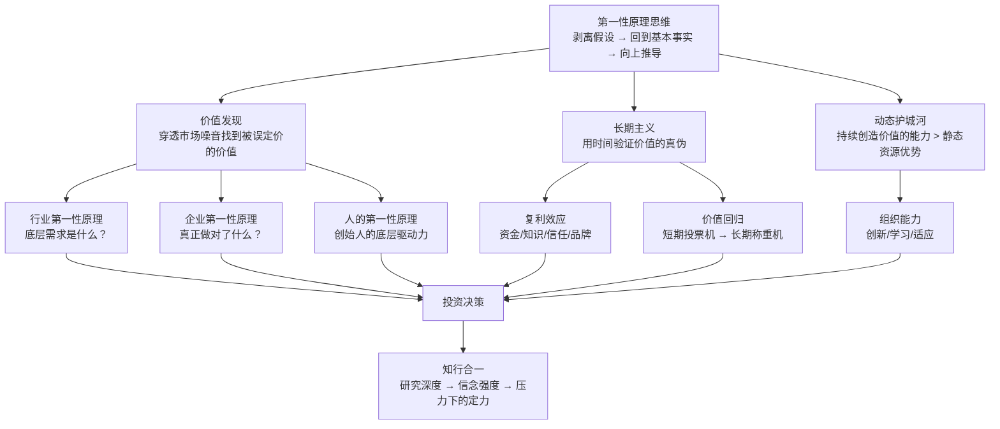

# 《第一性原理》深度读书笔记

> 高瓴资本创始人张磊将一个源自亚里士多德的哲学概念带入投资实战，系统论证了一套从"剥离假设、回到基本事实"出发的决策方法论。全书的核心主张是：绝大多数人的决策建立在"别人怎么做"的类比之上，这种方式安全但平庸；要获得超额回报，必须回到最基本的事实——用户需求、技术底线、商业本质——从那里向上重新推导。这套方法论在投资中体现为"长期主义"与"动态护城河"，在人生中体现为从自身底层特质出发做选择，最终指向一个难以回避的问题：知道正确的做法是一回事，在压力下坚持正确的做法是完全另一回事。

## 这本书要解决什么问题

张磊写这本书的背景是：他创办的高瓴资本管理规模达数千亿美元，投资了腾讯、京东、百度、美团、格力等一批中国商业史上最重要的企业。但张磊不满足于讲"我投了什么"的故事，他试图回答一个更根本的问题：**在充满不确定性的世界里，如何找到决策的基石？**

他的观察是：绝大多数人的决策建立在"类比思维"之上。别人这么做了、行业惯例是这样、专家建议是那样——于是我也那样做。这种方式效率高、风险低，但有一个致命问题：你永远在别人画好的框架里思考，你的判断永远是二手的。在投资中，如果你和所有人想的一样，你就只能获得市场的平均回报。而超额回报——高瓴赖以成名的那种回报——只能来自独立于市场共识的原创判断。

张磊给出的替代方案叫做"第一性原理思维"：把所有既有假设全部扔掉，回到最基本的事实——用户到底需要什么？物理和经济的底线在哪里？——从这些不可压缩的事实出发，重新构建自己的判断。

"第一性原理"最早来自亚里士多德。他认为，每个系统都有一个最基本的命题，它不能被违背，也不能从其他命题推导出来。在现代商业语境中，这个概念被埃隆·马斯克重新带火。马斯克创办SpaceX时发现火箭每次发射要几亿美元。传统做法是和现有供应商讨价还价，但马斯克做了一件不同的事：火箭是由铝、钛、铜、碳纤维组成的，这些材料在大宗商品市场上值多少钱？答案是火箭总成本的2%。那98%的溢价来自哪里？来自整个供应链的低效和传统航天承包商的垄断利润。从这个分析出发，马斯克决定自己造零部件，最终把火箭成本降低了一个数量级。

张磊把这个思维方式带入投资领域。大多数投资者做决策依赖的是"共识"——市场怎么看、分析师怎么说、过去的数据怎么样。但共识往往是滞后的，因为它建立在历史数据和当前情绪之上，而非对未来的深度判断。张磊认为，只有穿透共识，回到用户需求和商业本质的基本事实，才有可能获得别人看不到的投资机会。

在投资哲学的谱系中，张磊承认自己深受巴菲特和芒格影响。巴菲特的"以合理价格买入伟大公司"和芒格的"多元思维模型"是他的起点。但张磊做了两个重要修正：第一，巴菲特的核心投资领域是消费和金融，这些行业变化相对缓慢，"静态护城河"可以持续数十年；但在中国科技和互联网领域，变化速度快得多，需要一种"动态护城河"的概念。第二，巴菲特强调"能力圈"——只投资你理解的东西，但张磊主张能力圈本身应该持续扩展，因为在中国这样的快速变化环境中，固守既有能力圈可能意味着错过最大的机会。

## 核心模型地图

张磊的体系建立在三个相互支撑的核心概念之上。

**第一个概念是"第一性原理思维"**——这是整个体系的方法论基础。它不是一种直觉或天赋，而是一套可操作的分析流程：列出所有假设→逐一质疑每个假设→剥离到最底层的不可压缩的事实→从事实向上重新推导判断。这个流程的价值在于，它强迫你脱离"大家都这么认为"的舒适区，进入"事实到底是什么"的深水区。困难在于，大脑天生偏好类比——因为类比省力、快速、减少焦虑，而从底层重新推导痛苦、耗时、充满不确定性。

**第二个概念是"价值发现"**——这是第一性原理思维在投资中的直接应用。大多数投资者看的是"二阶信息"：股价走势、市盈率对比、分析师评级。张磊主张直接看"一阶事实"：这家企业为用户创造了什么价值？这个价值能不能持续？创造这个价值的壁垒是什么？当你穿透二阶信息看到一阶事实时，你就有可能发现市场尚未定价的机会——要么是市场低估了某种价值，要么是高估了某种风险。

**第三个概念是"长期主义"与"动态护城河"**——这是对"如何把价值发现变成实际回报"的回答。长期主义意味着用时间来验证你的判断——短期市场充满噪音，但长期来看价格一定回归价值。动态护城河意味着你投资的不是某个时点上的优势，而是持续创造价值的能力——因为在技术快速变化的时代，任何静态优势都可能被颠覆。

这三个概念不是并列的，而是层层递进的：第一性原理思维是底层方法论→价值发现是方法论的应用输出→长期主义和动态护城河是将发现转化为回报的路径→知行合一是贯穿始终的执行挑战。缺少任何一层，整个体系就不完整。

## 逐层深入

### 第一层：类比思维的陷阱——为什么大多数人注定平庸

张磊对两种思维方式的区分是全书的逻辑起点。

**类比思维**的运作方式是：看到A和B相似，A的结果是X，所以B的结果也可能是X。别人做电商赚钱了，我也做电商。行业平均利润率是15%，所以我们的目标也是15%。历史上每次出现这种技术指标形态，股价都涨了，所以这次也会涨。这种思维方式的优势是速度快、认知负荷低、降低了决策的心理压力。但它有三个根本缺陷。

第一个缺陷是**原创性为零**。你的判断完全依赖于你模仿的对象是否正确。如果行业老大的策略本身就有问题呢？如果历史规律在新环境下不再适用呢？类比思维让你永远是跟随者，永远不可能领先。在投资中，跟随共识只能获得平均回报——因为共识已经被定价了。超额回报只存在于共识还没有到达的地方。

第二个缺陷是**看不到变化**。类比思维的基础是"过去和未来相似"，但当环境发生根本性变化时，这个假设就失效了。柯达在胶片时代的所有成功经验在数码时代都变成了包袱。诺基亚在功能机时代的规模优势在智能机时代毫无意义。模仿者是最脆弱的，因为他们不知道自己模仿的是什么——他们复制了行为但不理解底层逻辑，所以无法判断什么变化会使模仿失效。

第三个缺陷是**把惯性当成真理**。行业"常识"往往只是历史惯性的积累。"火箭就是很贵"——这是一个事实还是一个惯性？马斯克发现，如果你把火箭拆解成原材料，它只值售价的2%。剩下98%是供应链低效、一次性使用设计和传统承包商的垄断利润。这些不是物理定律，而是可以被改变的制度安排。但类比思维不会让你做这种拆解，因为它的起点是"现状就是合理的"。

**第一性原理思维**的运作方式完全不同。它不关心别人怎么做，不关心历史上发生了什么，只关心一个问题：最底层的事实是什么？用户的不可压缩的需求是什么？物理和经济的硬约束在哪里？从这些事实出发，结论是什么？

张磊用了一个日常生活的例子来说明。你去市场买菜，看到西红柿10块一斤。类比思维的反应是：隔壁摊也卖10块，那就是这个价。第一性原理的反应是：西红柿的种植成本多少？运输成本多少？摊位租金分摊多少？合理利润多少？当你算完发现成本只有3块时，你就知道10块里有7块是可以被优化或挑战的空间。这个例子当然是简化的，但它揭示了一个基本逻辑：**不接受价格的表面数字，而是去理解价格背后的成本结构**。

但张磊也承认，第一性原理思维有一个高门槛：它需要极深的行业理解。马斯克能质疑火箭成本，是因为他真的懂材料科学、制造工艺和供应链管理。不懂的人去"从第一性原理出发"，大概率是把无知包装成独立思考。这个警告非常重要——第一性原理不是"不听专家的话"，而是"自己也成为专家之后，从基本事实出发形成判断"。

### 第二层：长期主义——为什么时间是最好的验证者

在张磊的框架里，"长期主义"不是一个模糊的人生信条，而是第一性原理思维在时间维度上的延伸。它的逻辑链条是：如果你通过第一性原理分析得出了一个独立于市场共识的判断，那么短期内市场可能不认同你（因为市场还在跟着共识走），但长期来看，如果你的分析是正确的，价格终将回归价值。所以，长期主义的核心不是"买了不卖"，而是"基于深度分析做出判断后，有耐心等待判断被验证"。

张磊为长期主义提供了三个底层支撑。

**第一个支撑是复利效应。** 这不仅仅是资金的复利。张磊把复利的概念扩展到了多个维度：知识复利——你今天学到的东西会成为明天学习的基础，越积累越快；信任复利——你和客户、合作伙伴之间的信任关系会随着时间加深，信任降低交易成本；品牌复利——品牌认知是慢慢积累的，但一旦建立就有巨大的惯性。所有这些复利曲线都有一个共同特征：前期增长极慢，后期指数爆发。这意味着，如果你在前期因为看不到结果就放弃，你永远享受不到后期的爆发。竹子前四年几乎不长——地面上只有几厘米，但它在地下建立庞大的根系；到第五年，它在六周内长到30米高。大多数人在前四年就放弃了。

**第二个支撑是价值回归。** 格雷厄姆的名言：短期市场是投票机，长期市场是称重机。短期内，股价受情绪、热点、资金流驱动，可以和真实价值严重偏离。2000年互联网泡沫时，没有收入的公司估值几十亿美元；2008年金融危机时，优质资产被恐慌性抛售到远低于内在价值的价格。但长期来看，这些偏离都被修正了。如果你能准确判断价值——这就是第一性原理分析的作用——那么时间就是你最强大的同盟。

**第三个支撑是护城河的构建需要时间。** 品牌认知、网络效应、规模经济、用户习惯——所有真正有价值的竞争壁垒都不是一夜建成的。京东自建物流花了十年时间和巨额资金，但一旦建成，它就成了其他电商平台无法复制的优势。这个过程中，短期财务报表是"难看"的——大额亏损、现金流出。但如果你通过第一性原理分析理解了"自建物流最终会成为不可替代的壁垒"这个逻辑，你就应该有耐心等待这个壁垒被建成。

长期主义听起来简单，实践起来极其困难。张磊自己也承认这一点。困难来自三个方面：

首先是**外部压力**。如果你管理的是别人的钱（基金经理的常态），你的投资人通常按季度或年度评估你。如果你的持仓在一两年内表现不好，即使你的长期判断是正确的，你可能在判断被验证之前就被赎回或解雇。这就是为什么高瓴资本刻意构建了长期资本结构——LP（有限合伙人）的锁定期很长，给了张磊等待的时间。

其次是**认知偏差**。人类大脑在演化过程中形成了各种"快捷方式"，在日常生活中通常是有用的，但在投资中往往是有害的。损失厌恶让你在股价下跌时恐慌卖出（"再跌下去就全没了"）；锚定效应让你被买入价格束缚（"等回到成本价我就卖"）；确认偏差让你只看支持自己判断的信息而忽略反面证据。这些偏差在压力下会被放大。

第三是**短期激励的扭曲**。大多数投资机构的激励结构按年度设计——年度收益决定奖金。这意味着基金经理有强烈的动机追逐短期热点（"今年能涨的"），而非深度研究长期价值（"五年后才能体现的"）。制度的短视导致了行为的短视。

张磊对此的应对策略是双管齐下：制度设计（长期资本结构消除了外部压力的大部分）和个人修炼（阅读、反思、保持理性独立）。但他也坦承，即使做到了这些，在最极端的市场环境下保持定力仍然是一种对人性的考验。

这里有一个重要的边界条件需要指出："做时间的朋友"的前提是你有时间。高瓴管理的是长期资本，可以承受三到五年甚至更长的等待期。但一个普通投资者如果三年后需要这笔钱来买房或者付孩子学费，他就没有"做时间的朋友"的资格。长期主义的策略对资金属性有明确的要求，不加区分地鼓吹长期主义是不负责任的。

### 第三层：价值发现——穿透噪音找到真正的价值

张磊的投资方法论的核心是：用第一性原理找到被市场误定价的价值。

市场为什么会误定价？因为大多数参与者在用类比思维——看股价走势、比较市盈率、听分析师报告。这些都是"二阶信息"——别人加工过的信息。二阶信息已经被市场消化了，所以基于二阶信息做判断，你不可能跑赢市场。要发现市场还没有定价的机会，你必须直接触达"一阶事实"——用户真实的需求、企业真实的能力、行业真实的趋势。

张磊从三个维度展开价值分析：

**行业的第一性原理：这个行业存在的根本原因是什么？** 任何行业的存在都是因为它满足了用户的某种底层需求。零售业的底层需求是"让消费者以最低的交易成本获得想要的商品"。这个需求不会消失，但满足它的形式会不断变化——从百货商店到超市到电商到社区团购。投资零售业，不应该关注今天谁的GMV最高，而应该关注谁在朝着"更低交易成本"的方向进化最快。

教育行业的底层需求是"让人高效获得知识和技能"。医疗行业的底层需求是"用最低成本恢复和维持健康"。每个行业都有自己的第一性原理——找到它，你就找到了判断行业趋势的锚点。形式和载体会变，但底层需求不变。那些最终胜出的企业，一定是最接近满足底层需求的企业。

**企业的第一性原理：剥离掉品牌光环、行业红利、运气成分，这家企业真正做对了什么？** 很多企业的成功表面上看是品牌强大、营销到位，但如果你剥离这些表层因素，真正的驱动力往往是某种组织能力或结构性优势。

高瓴早期投资京东是最典型的案例。当时京东不赚钱、自建物流疯狂烧钱、被很多人看衰。类比思维会说："电商应该轻资产，京东这么重，不对——看看eBay和淘宝，平台模式才是正道。"但张磊做了第一性原理分析：中国电商的核心痛点是什么？是假货横行和物流体验差。用户最底层的需求是正品保障和快速配送。自建物流虽然短期烧钱，但它直接解决了这两个核心痛点——自营意味着品质可控，自建物流意味着配送时效可控。这是用短期的"错"（财务亏损）换长期的"对"（不可复制的竞争壁垒）。

**人的第一性原理：创始人的底层驱动力是什么？** 张磊认为，在长期投资的语境下，创始人的内在驱动力是比商业模式更重要的变量。追求财富的人在赚到足够多的钱后会懈怠——"够了，该享受了"。追求权力的人会被内部政治消耗精力——精力从产品转向了争斗。只有被使命驱动的人——"这件事不做睡不着觉"——才能支撑十年、二十年尺度上的持续投入和进化。

张磊评估创始人时关注的不是"他说了什么"，而是"他在什么情况下做了什么"。关键时刻的选择比平时的言论更能揭示一个人的底层驱动力。危机中是选择保护短期利润还是坚持长期正确的事？有退路时是选择安逸还是继续冒险？

高瓴的研究方法论也值得展开。张磊反复强调，第一性原理思维不是空想，它需要极致的研究深度来支撑。高瓴的研究方式包括四个层面：

**全景式研究**——不只研究一家公司，而是研究整个产业链：上游供应商、下游客户、直接竞争对手、潜在替代品、互补品。只有理解了整个生态，才能判断一家公司在生态中的位置和价值。

**跨时间维度研究**——追溯历史理解"为什么走到了今天"，同时向前推演"未来可能的格局"。历史告诉你规律，推演帮你预判变化。很多投资者只看当下的数据，但当下只是历史趋势线上的一个点——你需要理解这条线的方向和斜率。

**一手信息获取**——书面材料是二手信息，一手信息来自与行业专家、创始人、一线员工、甚至竞争对手的深度对话。财报能告诉你过去发生了什么，但真正重要的洞察——"接下来会发生什么"——往往不会写在财报里。

**逆向思维验证**——每个结论都要问"在什么情况下会错？"这个习惯不是为了否定自己，而是为了识别真正的风险点。如果你无法说出自己的判断在什么情况下会失败，你就还不够理解这个判断。

研究深度为什么至关重要？因为它直接决定了你的信念强度。投资中最难的不是买入，而是持有——当股价跌了50%、所有分析师都看空、媒体充满负面报道时，你还能不能坚持？浅层的了解撑不起深层的信念。如果你只是因为"看好这个赛道"而买入，稍有风吹草动就会动摇。如果你通过深度研究真正理解了这家企业的价值创造机制和竞争壁垒，你才能在别人恐惧时保持清醒、在别人贪婪时保持克制。

### 第四层：动态护城河——从"我有什么"到"我能持续做什么"

传统的护城河理论来自巴菲特，强调企业要有竞争壁垒。巴菲特时代的典型护城河是相对静态的：可口可乐的品牌认知——几十年积累，几乎不可能被复制；铁路的特许经营权——物理上的垄断，别人建不了平行铁路；信用卡的网络效应——越多人用越有价值，后来者很难追赶。这些优势一旦建立，就能持续很长时间。

但张磊观察到，在技术变革加速的时代，静态护城河正在被快速填平。柯达拥有品牌和大量专利，但数码相机颠覆了整个胶片产业；诺基亚拥有全球最大的手机销售网络和供应链规模优势，但触屏智能手机重新定义了"手机是什么"；报纸拥有百年品牌和读者忠诚度，但互联网让信息的分发成本接近于零。在这些案例中，原本看似坚不可摧的护城河在几年内就被填平了。

张磊因此提出了"动态护城河"的概念。静态护城河的逻辑是"我有什么别人没有"——我有专利、我有品牌、我有规模。动态护城河的逻辑是"我能持续做到什么别人做不到"——不是我现在比你强，而是我有持续变强的能力。

亚马逊是动态护城河的典型。贝佐斯每年给股东的信都在讲"Day 1"——永远把自己当成创业公司。亚马逊的护城河不是电商业务（这个中国的阿里巴巴和京东都能做），而是不断发现新增长点并快速执行的组织能力。从线上书店到电商平台到云计算（AWS）到智能音箱（Echo/Alexa）到流媒体（Prime Video），每次进入新赛道都能建立领先地位。这种"持续开辟新战场并获胜"的能力，才是真正无法被复制的。

动态护城河的核心要素有三个：

**持续创新的能力**——不只是研发投入（很多企业投入很大但产出很少），而是组织文化对试错的包容、对新想法的开放、对失败的宽容。创新不是某个天才的灵光一闪，而是组织系统性地产生和筛选新想法的能力。

**组织学习的速度**——面对新的市场信息，企业能多快地把新知识转化为行动？有些企业的决策链条长、信息传递损耗大、行动迟缓；有些企业能在几周内把前线的信号转化为战略调整。在变化加速的时代，学习速度可能是最重要的竞争优势。

**适应变化的弹性**——当行业发生根本性变化时，企业能不能快速调整方向？Netflix从邮寄DVD到流媒体的转型是一个经典案例——它在DVD业务还在盈利时就果断投入流媒体，虽然短期牺牲了利润，但最终建立了全新的竞争壁垒。

张磊在中国的投资实践体现了这种动态护城河的判断。高瓴投资腾讯，不是因为QQ或微信本身（产品可以被模仿），而是因为腾讯展现了一种"在每个新时代都能找到新增长引擎"的组织能力——从PC端社交到移动端社交到游戏到金融到云服务，每次转型都成功了。高瓴投资格力，也不只是因为格力当时的市场地位，而是因为格力在制造能力和供应链管理上展现了持续优化的组织纪律。

但这里有一个需要注意的识别陷阱：很多企业会把"研发投入高"等同于"有动态护城河"。但研发投入是输入，能不能转化为有效的产品和商业模式才是输出。关注输出（新产品、新市场、新收入来源），而非输入（研发费用绝对值或占比）。

### 第五层：价值投资的中国语境

张磊把价值投资带入中国市场，但他也做了重要的本土化调整。他承认格雷厄姆和巴菲特的经典理论不能直接照搬。中国市场有三个独特性：

**第一，变化更快。** 中国过去四十年的变化速度是美国两百年的压缩版。在这样的环境下，"持有伟大公司三十年"可能不适用，因为三十年后整个行业可能都不存在了。这要求投资者不仅要判断"这家公司现在好不好"，还要判断"这家公司能不能在未来的多次变革中持续进化"。

**第二，成长空间更大。** 中国企业的成长潜力经常被用美国市场的标准低估。一家看起来市盈率很高的公司，如果能保持高增长十年，回头看可能是便宜的。高瓴早期投资京东时，按当时的利润率计算估值很贵，但如果你预判到京东未来的收入增长和利润率改善，那个价格就是合理的。

**第三，政策影响更大。** 中国市场受政策影响比成熟市场更显著。教育行业的"双减"政策、互联网平台的反垄断监管、房地产行业的调控——这些政策变化可以在短时间内根本性地改变一个行业的商业逻辑。这既是风险也是机会：风险在于政策不确定性增加了判断的难度；机会在于政策导致的恐慌性抛售可能创造远低于内在价值的买入机会。

因此，张磊的投资风格可以概括为"成长型价值投资"——不是买便宜的公司（格雷厄姆式），也不是买伟大的公司然后永远持有（巴菲特式），而是买能够持续成长的公司，在它们的价值被市场低估时买入，用时间等待价值的释放。

### 第六层：人生选择——从自身出发的推导

张磊把第一性原理从投资延伸到人生决策，这是全书的最后一层。他的核心主张是：不要因为别人在做而做，不要因为看起来赚钱而做，而是回到你自己最底层的特质、热情和能力，从那里向上推导。

**选择做自己热爱的事。** 热爱是持久努力的燃料。长期来看，你能在一件事上坚持多久，取决于你有多热爱它。那些"为了赚钱而做的事"，在赚到钱之后往往会停滞；那些"睡觉都在想的事"，才能支撑你度过看不到回报的岁月。

**选择和优秀的人在一起。** 张磊认为"与谁同行比去向何方更重要"。你周围人的平均水平，很大程度上决定了你的天花板。优秀的同伴能拉高你的标准、拓展你的认知、在困难时提供支持。

**选择做有长期积累的事。** 避免"每天从零开始"的工作。优先选择知识、技能、声誉、关系能复利积累的方向。今天做的事，应该让明天的你比今天更强，而不是每天都在消耗存量。

张磊还把"知行合一"的讨论从投资延伸到人生。知道第一性原理不难，难的是在关键时刻坚持用它。他区分了三个层次：知道——理解概念，这是最容易的；相信——通过实践建立信念，需要时间积累；做到——在最困难的时刻仍然坚持，这是最稀缺的。就像你知道锻炼有益健康（知道），你通过阅读医学文献理解了运动的生理机制（相信），但你在下雨天、加班后、情绪低落时仍然坚持去锑步（做到）——价值不在于你能在舒适的环境里谈论正确的事，而在于你能在困难的环境里践行正确的事。

### 第七层：与其他投资哲学的对话

**与巴菲特的对话。** 张磊深受巴菲特影响，但有两个关键发展。第一，巴菲特强调"以合理价格买入伟大公司"，张磊修正为"以合理价格买入能持续成长的公司"。前者更静态（判断一个时点上的伟大），后者更动态（判断持续成长的能力）。第二，巴菲特的能力圈主要在消费和金融，张磊把这套方法论扩展到了科技和互联网——这需要更多的前瞻性判断，也意味着更高的风险。

**与芒格的对话。** 芒格强调"多元思维模型"——用来自不同学科的框架交叉验证同一个问题。张磊的方法与此有共鸣——他的研究方法论也强调从多个维度（行业、企业、人、政策）交叉分析。但张磊更强调从这些维度中找到一个"不可压缩的核心"，而非维持多个并行框架。

**与索罗斯的对话。** 索罗斯的投资哲学强调"市场永远是错的"——利用市场的反身性和情绪偏差获利。张磊与此有共鸣——他也相信市场在短期内经常犯错。但方向不同：索罗斯侧重于发现和利用市场的错误，张磊侧重于理解正确的价值，然后等待市场纠错。索罗斯是"猎人"——寻找市场的破绽并主动出击；张磊是"农夫"——耕种正确的价值并等待时间的收获。

**与彼得·林奇的对话。** 林奇强调"投资你了解的"。张磊同意这个原则但有补充：了解不只是"熟悉"，而是能从第一性原理解释。很多人以为自己了解一个行业，其实只是熟悉表面现象——他们知道行业的术语、知道主要玩家、知道最近的新闻，但不理解底层逻辑——这个行业为什么存在？价值创造的真正机制是什么？如果技术发生根本变化，这个行业会怎样？

## 批判性反思

《第一性原理》的价值在于它把一个哲学概念具象化为投资方法论，并用高瓴的实际投资案例来支撑。但它有几个需要认真对待的局限：

**幸存者偏差。** 张磊是一个成功的投资人，他的方法论看起来很有说服力。但这是否意味着任何人用同样的方法论都能成功？也许还有很多同样声称从第一性原理出发的投资者，他们失败了，但没有写书的机会。成功案例不等于方法论的普适性证明。

**事后归因。** 书中的投资案例——京东、腾讯、百度——都是已经被时间证明的成功投资。用第一性原理解释一个已经成功的投资是容易的，但在决策时点上识别第一性原理是困难的。书中的分析更像是事后的合理化叙事，而非决策时的真实思考过程。一个诚实的问题是：在这些成功案例之外，高瓴是否也有用同样方法论做出的失败投资？如果有，失败的原因是什么？方法论本身是否需要修正？

**概念的模糊性。** "第一性原理"是一个有力但也容易被滥用的概念。什么算第一性原理？谁来判定你找到的是真正的第一性原理，而不是你以为的第一性原理？两个同样声称从第一性原理出发的人，可能得出完全相反的结论——那谁对？这个概念没有提供足够的判定标准来区分真正的底层分析和包装成底层分析的臆断。

**对执行难度的轻描淡写。** 书中承认知行合一很难，但给出的解决方案（"制度设计和个人修炼"）相对笼统。对一个管理自己的钱的普通投资者来说，他没有高瓴那样的长期资本结构，没有专业的研究团队，也没有张磊几十年的投资经验，他如何实践这套方法论？这个关键问题书中没有充分回答。

**中国市场特殊历史阶段的影响。** 高瓴的核心成功案例集中在中国互联网爆发的黄金期——人口红利、移动互联网渗透率快速提升、监管相对宽松。这些结构性利好不再存在时（平台监管收紧、经济增速放缓、地缘政治不确定性增加），同样的方法论是否还能产生同样的结果？书中对此没有充分讨论。

## 延伸阅读

**《价值》（张磊）**——张磊的另一本著作，比《第一性原理》更侧重于具体的投资案例和投资实践。如果说《第一性原理》是"道"，《价值》更接近"术"。两本书合在一起，才能完整理解张磊的投资体系。

**《穷查理宝典》（查理·芒格）**——芒格的思想集，强调"多元思维模型"——从心理学、数学、物理学、生物学等多个学科借用框架来分析问题。与张磊强调的"回到底层事实"形成互补：张磊更强调纵向的深度（剥离到最底层），芒格更强调横向的广度（用多个框架交叉验证）。

**《从0到1》（彼得·蒂尔）**——蒂尔的核心理念与第一性原理高度一致："竞争是失败者的游戏，真正的创新是从0到1。"蒂尔从创业者的角度阐述了如何发现独特的商业机会——他关注的不是"已经存在的市场中谁能赢"，而是"有没有别人还没有看到的新市场"。

**《反脆弱》（纳西姆·塔勒布）**——塔勒布的框架与张磊的长期主义有一个有趣的对话。张磊的策略是"判断正确的价值然后等待"，塔勒布的策略是"不试图预测未来，而是构建一个能从不确定性中获益的系统"。前者需要对价值有极高的判断准确度，后者需要对下行风险有极好的控制能力。两种策略的适用场景不同，但可以互补。

**《创新者的窘境》（克莱顿·克里斯坦森）**——克里斯坦森的"颠覆性创新"理论可以被视为"为什么静态护城河会失效"的系统性解释。领先企业被颠覆，不是因为它们做错了什么，而是因为它们做对了一切——在现有客户、现有技术轨道上持续优化——但在此过程中忽略了来自低端市场的新技术路线。这个理论是理解"动态护城河"为什么重要的最好注脚。

**《思考，快与慢》（丹尼尔·卡尼曼）**——卡尼曼对人类认知偏差的系统性研究，可以帮助你理解为什么"知行合一"如此困难。张磊说认知偏差会在压力下放大，卡尼曼告诉你具体有哪些偏差、它们如何运作、以及有限的应对策略。
