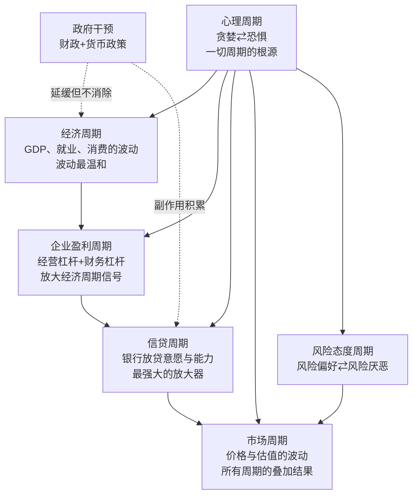

# 《周期》深度读书笔记

> 2018年出版的《周期》是投资大师霍华德·马克斯数十年周期思考的系统总结。马克斯从一个看似简单的问题出发——既然市场的未来不可预测，投资者还能做什么？他的答案是：不要预测周期何时转向，而要学会判断"我们现在在周期的什么位置"。全书构建了一个多层周期叠加的分析框架：经济周期提供基础波动，企业盈利周期通过杠杆效应放大信号，信贷周期作为"超级放大器"将波动推向极端，而贯穿一切的心理周期和风险态度周期是所有市场起伏的最终源头。马克斯不是理论经济学家，而是一个经历了半个世纪市场起落的实践者。他管理的橡树资本以投资不良债务闻名——这种资产的最佳买入时机恰恰出现在信贷周期的最低谷，这意味着马克斯的整个盈利模式都建立在"周期必然回归"的信念之上。当一个人用几百亿美元押注一个理念时，他对这个理念的理解往往比纯粹的学者更加深刻和具体。这本书出版于美股长牛末期，当时"周期已死"的论调甚嚣尘上。马克斯写作此书，不仅是要系统阐述自己的周期哲学，更是要在市场最得意的时刻发出警告：历史上每一次"这次不一样"的信念，最终都以同样的方式被证伪。两年后，新冠疫情引发的市场暴跌证明了他的判断。

## 这本书要解决什么问题

2018年，全球股市已经经历了将近十年的牛市。标普500从2009年的低点翻了三倍以上，美国失业率降至数十年低位，科技公司的利润连年创新高。在这个背景下，一种危险的信念悄然蔓延：周期已经被驯服了。央行的政策工具——特别是量化宽松——似乎有能力永远托底市场；低利率环境看起来可以无限延续；技术创新将持续推动生产力增长。"这次不一样"不再是少数人的信念，而是成为了市场的共识。

马克斯在这个时刻出版《周期》，是在向这种共识宣战。他要回答的核心问题是：**周期真的可以被消除吗？如果不能，投资者应该如何理解和应对周期？**

他的回答可以概括为三个层次的判断：

第一，周期是永恒的。驱动周期的根本力量是人类心理——贪婪与恐惧的交替、从众与遗忘的本能——而人性不会因为技术进步或政策创新而改变。只要有人参与的市场，就会有周期。

第二，周期是不可预测的。没有任何方法能够准确预测转折点何时到来，这次的振幅有多大，以及持续多长时间。任何声称能够精确预测周期的人，要么是在自欺，要么是在欺人。

第三，周期是可定位的。虽然你不知道"何时"转折，但你可以判断"现在在哪里"。通过观察一系列情绪和市场信号，你可以判断当前市场情绪偏向乐观还是悲观的极端，然后据此调整自己的风险敞口。

在投资思想的谱系中，马克斯属于价值投资的传统，但他的独特贡献在于把行为金融学的洞察融入了价值投资的框架。他不像格雷厄姆那样纯粹聚焦于内在价值与价格的偏差，也不像技术分析者那样试图从价格图表中预测走势，而是把注意力放在一个大多数人忽视的维度上——市场情绪在周期中的位置。这个位置虽然不能告诉你明天会发生什么，但它能告诉你当前的风险回报比是否对你有利。

值得注意的是，马克斯的周期观与海曼·明斯基的"金融不稳定假说"高度吻合——明斯基认为金融稳定性本身会催生不稳定，因为长期的稳定让人们变得大胆、增加杠杆、忽视风险，最终导致危机。这种"稳定产生不稳定"的悖论贯穿了马克斯全书的分析。

## 核心模型地图

马克斯在书中构建了一个多层周期叠加的分析框架，理解这个框架是把握全书的关键。

**最底层是经济周期。** 经济的长期增长由人口和生产率决定，相对稳定。但短期内，经济会围绕长期趋势上下波动，形成扩张与收缩的交替。在成熟经济体中，经济周期的波动幅度其实相对温和——美国经济衰退期间，GDP下降幅度通常在2-4%左右。经济周期是所有其他周期的"地基"。

**第二层是企业盈利周期。** 由于经营杠杆和财务杠杆的存在，企业盈利的波动幅度会显著大于GDP的波动。一个简单的例子：一家公司有100元收入，60元可变成本，30元固定成本，利润10元。如果收入因经济下滑减少10%变成90元，可变成本同比例降到54元，固定成本仍然是30元，利润变成6元——收入下降10%，利润下降了40%。如果公司还有债务负担（财务杠杆），波动会被进一步放大。所以GDP下降3%，企业盈利可能下降20-30%。

**第三层是信贷周期。** 马克斯特别强调这个周期，称之为"最重要的周期"。信贷周期的核心机制是正反馈循环：经济向好时，银行放松贷款标准，信贷扩张推高资产价格，上涨的资产价格支撑更多信贷——循环自我强化。反转时，违约出现，银行收紧，信贷萎缩，资产被迫出售，价格下跌，更多违约——同样自我强化。这个正反馈机制使得信贷周期成为所有周期中波动最剧烈的一个。

**第四层是心理周期与风险态度周期。** 马克斯认为这是最重要的一层，因为它驱动了其他所有周期。人类的贪婪与恐惧交替主导市场情绪，风险容忍度在两个极端之间摆动。当乐观占据主导，投资者愿意为风险资产支付更高价格，信贷标准放松，经济和市场向上运行；当恐惧蔓延，即使是优质资产也无人问津，信贷紧缩，经济和市场转向下行。

**最上层是市场周期。** 它是以上所有周期叠加的结果。市场价格的波动远大于基本面的波动，因为价格不仅反映了盈利的变化，更反映了情绪和风险态度的剧烈摆动。理解了这个叠加结构，才能理解为什么市场会走向如此极端——以及为什么极端状态终将回归。

**此外还有政府干预。** 央行和财政政策可以影响周期的节奏——降息延长扩张期，加息给过热经济降温，财政刺激在衰退时托底。但马克斯的核心观点是：政策只能延缓周期，不能消除周期。而且每一次干预都积累副作用——低利率催生资产泡沫，财政刺激增加政府债务——这些副作用可能在未来某个周期中集中爆发。

## 逐层深入

### 一、钟摆与均值回归：周期的根本性质

马克斯用"钟摆"来描述市场运动的本质特征，这个比喻虽然简单，却蕴含了丰富的内涵。

想象一个物理钟摆的运动轨迹：它大部分时间都在向一个方向或另一个方向运动，在垂直中点的停留时间极短——事实上，钟摆"经过"中点而非"停留"在中点。市场也是如此：它很少处于"合理估值"的状态，大部分时间不是被高估就是被低估。"合理"只是钟摆摆过的一个瞬间，不是一个稳定的停泊点。

这个观察看似平淡，实际上颠覆了一个普遍假设。很多投资者——以及很多经济学模型——假设市场的"正常状态"是均衡，偏离均衡只是暂时的扰动。马克斯的观点恰恰相反：偏离才是常态，均衡反而是罕见的例外。如果你总是在等待市场"回归正常"之后再做决策，你可能永远也等不到。

钟摆到达极端位置后，有一种力量把它拉回来——这就是均值回归。高于平均的收益率最终会回归平均，低于平均的收益率也是如此。异常状态不可持续，因为推动异常状态的条件本身就包含着反转的种子：价格越高，潜在买家越少；信贷越宽松，潜在违约越多；乐观越极端，失望的落差越大。

但马克斯特别警告了均值回归的三个陷阱，这些陷阱让无数投资者在"正确"的方向上亏了钱。

**第一个陷阱：时间不确定。** 钟摆会回来，但不知道什么时候。市场可以在极端状态停留数年，让你的逆向操作看起来愚蠢而代价高昂。正如凯恩斯所说："市场保持非理性的时间可能比你保持偿付能力的时间更长。"很多对冲基金在2005-2006年就开始做空美国房地产市场，逻辑完全正确，但在危机真正爆发之前他们中的很多已经因为持续亏损而被迫平仓。

**第二个陷阱：极端可以变得更极端。** 在回归之前，钟摆可能先摆得更远。1999年的纳斯达克泡沫中，很多经验丰富的价值投资者在指数5000点时认为市场已经严重高估，但指数最终涨到了5048点才见顶。做空的人在"正确"的方向上先亏了一大笔，然后才开始赚钱——如果他们还撑得住的话。

**第三个陷阱：均值本身在变化。** 历史平均PE是15倍，但这不意味着未来的"正常"PE也是15倍。利率环境、经济结构、投资者构成、会计准则的变化都可能改变"正常"的标准。用静态的历史平均来判断当前是否"异常"，可能导致严重的误判。

### 二、经济周期与企业盈利周期：层层放大的链条

经济周期是最基础的周期，但它的波动幅度其实相对温和。战后美国经济衰退期间，GDP的下降幅度通常在2-4%左右——这个数字本身并不惊人。真正剧烈波动的是建立在经济周期之上的其他周期，特别是企业盈利周期。

企业盈利周期之所以波动远大于经济周期，核心原因是杠杆效应。

经营杠杆来自固定成本的存在。假设一家公司有100元收入，60元可变成本（随收入变化），30元固定成本（厂房、管理人员等不随收入变化），利润10元。当收入增长10%到110元时，可变成本增长到66元，固定成本不变仍是30元，利润变成14元——增长了40%。反过来，收入下降10%到90元时，可变成本降到54元，固定成本不变，利润变成6元——下降了40%。

这就是经营杠杆的放大效应：收入变化10%，利润变化40%。放大倍数取决于固定成本占总成本的比例——固定成本比例越高，放大效应越大。这解释了为什么重资产行业（钢铁、航空、电信）的盈利波动特别剧烈。

财务杠杆进一步放大了这种波动。如果公司还有债务利息要支付，那么利润的波动会在经营杠杆的基础上被再次放大。一家高负债的公司在经济上行期利润增速惊人，但在下行期也可能迅速由盈转亏甚至破产。

两层杠杆叠加的结果是：GDP波动2-3%，企业收入波动5-10%，企业利润波动20-30%，而股价——因为还要叠加情绪和估值的变化——可能波动40-50%。一次温和的经济衰退在传导到股市时已经被放大了十几倍。理解这个放大链条，你就能理解为什么股市的波动远大于"基本面"所能解释的范围。

马克斯的洞察是：大部分投资者只关注最上层的波动（股价涨跌），却不理解这些波动是如何从底层逐级放大上来的。如果你理解了这个结构，你就不会对市场的"过度反应"感到惊讶——那不是过度反应，那是杠杆结构下的正常反应。

### 三、信贷周期：最强大的放大器

如果说企业盈利周期是经济周期的放大器，那么信贷周期就是所有周期的"超级放大器"。马克斯把专门的篇幅留给信贷周期，称之为"最重要的周期"。这不仅是因为信贷周期的波动幅度最大，更因为它的正反馈特性使它具有自我强化和自我实现的力量。

信贷周期的扩张期是这样运作的：经济向好，企业盈利增长，违约率下降。银行看到这些"好数据"，认为风险降低了，开始放松贷款标准——降低首付要求、降低利率、接受更差的借款人。更多的信贷意味着更多的资金追逐资产，资产价格上涨。上涨的资产价格使借款人的抵押品增值，可以获得更多贷款。更多贷款意味着更多资金继续推高资产价格——正反馈循环形成。

在这个阶段，一切看起来都很美好。贷款没有违约（因为资产价格在涨，借款人可以通过再融资还贷），银行利润丰厚，监管者看不到明显的风险，投资者赚得盆满钵满。正是这种"繁荣"积累了最终崩溃的条件——因为贷款标准的持续降低意味着越来越多的贷款被发放给了实际上无力偿还的借款人。

当反转来临，同样的正反馈机制在相反的方向上运作：违约开始出现，资产价格下跌，抵押品价值缩水，银行急忙收紧标准，信贷萎缩，更多资产被迫出售（因为借款人无法再融资），价格进一步下跌，更多违约——恶性循环形成。

马克斯用2008年金融危机来说明信贷周期的全部威力。危机的根源可以追溯到信贷周期的极端宽松期：美联储在互联网泡沫后将利率降至1%，低利率环境下银行大幅放松房贷标准，次级贷款（发放给信用资质差的借款人）从边缘产品变成主流产品。由于华尔街把这些贷款打包成复杂的证券化产品（MBS、CDO）并分销给全球投资者，风险被分散的同时也被掩盖了。当房价开始下跌，整个链条崩溃：违约激增，MBS价值暴跌，持有MBS的金融机构出现巨额亏损，信贷急剧收缩，经济陷入自大萧条以来最严重的衰退。

马克斯从这个案例中提炼出的核心洞见是：在信贷周期中，最大的风险来源不是借款人，而是贷款人。是贷款人在宽松时期的轻率行为——降低标准、追逐量和利润、忽视风险——埋下了危机的种子。监控贷款标准的变化，比监控借款人的还款能力更重要，因为前者是因，后者是果。

信贷周期还有一个容易被忽视的特征：它具有自我欺骗的性质。在扩张期，所有的统计数据都"证明"风险在降低——违约率处于历史低位，银行利润丰厚，借款人的资产负债表看起来很健康。但这些"好数据"恰恰是危机正在积累的证据——违约率低是因为资产价格在涨（借款人可以通过再融资还贷），银行利润高是因为贷款量在疯狂增长，资产负债表好看是因为抵押品被泡沫推高了价值。当泡沫破裂，这些看似安全的指标会在一夜之间全面恶化。

这就是为什么马克斯特别强调要关注"过程"而非"结果"。仅仅看到低违约率就认为信贷环境健康，就像仅仅看到一个人在没有安全绳的情况下走钢丝还没有掉下来就认为他是安全的——目前的结果正常，不代表过程是审慎的。真正需要关注的是贷款标准本身：首付比例要求是否在下降？借款人的收入验证是否在放松？贷款条款中的保护性约定是否在被取消？这些才是判断信贷周期位置的领先指标。

### 四、心理周期：一切周期的终极驱动力

马克斯在分析了经济周期、盈利周期和信贷周期之后，把最核心的位置留给了心理周期。他的论点是：经济基本面的变化是缓慢而渐进的，但投资者对基本面的解读和反应可以在很短时间内从一个极端跳到另一个极端。正是这种心理的剧烈摆动，而非基本面本身的变化，驱动了市场周期的大部分波动。

心理周期的两个极端有着截然不同的特征。

在乐观极端，贪婪成为主导情绪。投资者相信好消息会永远持续，坏消息只是"暂时的调整"。"这次不一样"成为流行叙事——也许是"互联网改变了一切"（1999年），也许是"房价永远不会在全国范围内下跌"（2006年），也许是"央行不会让市场下跌"（2019年）。"害怕错过"（FOMO）取代了"害怕损失"成为主要的心理驱动力——人们不是在分析风险和回报，而是在焦虑自己错过了赚钱的机会。在这个状态下，风险被系统性地低估，价格被推到不可持续的水平。

在悲观极端，恐惧成为主导情绪。投资者相信坏消息会永远持续，好消息只是"死猫跳"。末日叙事流行——"金融系统将要崩溃"、"经济将永远衰退"、"这是百年一遇的危机"。"害怕损失"压倒一切，人们不计代价地抛售资产，即使是基本面完全健康的公司也遭到抛售。在这个状态下，风险被系统性地高估，价格被压到远低于内在价值的水平。

从众心理是心理周期的放大器。人类是社会性动物，有强烈的从众倾向——特别是在不确定的环境中。当周围的人都在赚钱时，你很难坐在场外；当周围的人都在恐慌时，你很难保持冷静。从众让牛市中的每个人都成为买家，把价格推得更高；让熊市中的每个人都成为卖家，把价格压得更低。从众心理使得集体行为远比个体行为更加极端。

短期记忆是另一个关键因素。投资者有一种选择性遗忘的倾向：在牛市顶部，忘记了过去的崩盘有多么惨烈；在熊市底部，忘记了过去的复苏有多么强劲。这种遗忘使得每一次周期都好像是"第一次"——投资者重复着同样的错误，仿佛历史从未发生过。马克斯引用马克·吐温的话来概括这种现象："历史不会重复，但会押韵。"每一次周期的细节不同，但人性驱动的基本模式始终如一。

马克斯还讨论了"叙事"在心理周期中的关键作用。每一次泡沫都有一个引人入胜的故事来支撑它：1990年代末是"互联网将改变一切"，2000年代中期是"房价永远不会在全国范围内下跌"，2020-2021年是"数字化革命加速，新经济完全取代旧经济"。这些叙事之所以危险，不是因为它们完全错误——互联网确实改变了世界，房价在大部分时间确实在上涨，数字化确实在加速——而是因为它们被用来为不可持续的价格水平做辩护。一个正确的大趋势不等于在任何价格买入都是合理的。1999年买入亚马逊的投资者对趋势的判断完全正确，但如果他在泡沫顶部买入，需要等待将近十年才能回本。

每一次熊市也有自己的叙事：2008年是"金融系统将要崩溃"，2020年初是"疫情将导致大萧条级别的衰退"。这些叙事同样包含了部分真相——金融系统确实受到了严重冲击，疫情确实造成了巨大的经济损失——但它们被极端化后，催生了过度的恐慌和抛售，创造了极好的买入机会。

叙事的力量在于它给情绪提供了"合理化"的外衣。没有人愿意承认自己是因为贪婪而追高，或因为恐惧而割肉。但如果有一个看起来很有说服力的故事来解释"为什么这次真的不一样"或"为什么这次真的完了"，投资者就可以把自己的情绪化行为包装成理性决策。识别这种"叙事驱动的自我欺骗"，是抵抗心理周期裹挟的重要能力。

### 五、风险态度周期：最反直觉的洞察

风险态度周期与心理周期紧密相连，但马克斯把它单独拿出来讨论，因为它包含了全书最反直觉的洞察。

传统认知是：当市场波动大、坏消息多的时候风险高，反之风险低。马克斯的观点截然相反：真正的高风险时期不是在人们感到危险的时候，而是在人们感到安全的时候。

这个悖论的逻辑是这样的：当所有人都感到安全时，他们愿意为风险资产支付更高的价格，接受更低的风险补偿。风险资产的价格因此被推到高位，风险溢价被压缩到极低水平。在这个状态下，资产价格已经充分反映了——甚至过度反映了——乐观的预期，上涨空间有限而下跌空间巨大。任何不及预期的消息都可能引发剧烈的调整。这才是客观上风险最高的时刻。

反过来，当所有人都感到恐惧时，他们不惜代价地抛售风险资产，要求极高的风险补偿才愿意持有。风险资产的价格被压到极低水平，风险溢价飙升。在这个状态下，资产价格已经充分反映了——甚至过度反映了——悲观的预期，下跌空间有限而上涨空间巨大。任何稍好于预期的消息都可能引发强劲的反弹。这才是客观上风险最低的时刻。

马克斯用信贷市场的数据来量化这个现象。垃圾债券（高收益债券）与国债之间的利差是衡量风险态度的直观指标。当利差处于历史低位（如2007年的不到300个基点），说明投资者对违约风险过于轻视，愿意以微薄的额外收益承担高风险——这通常出现在周期顶部。当利差处于历史高位（如2008年底的超过2000个基点），说明投资者极度恐惧，即使是质量不错的公司债券也被当作垃圾抛售——这通常出现在周期底部。

这个洞察的实践意义极其重要：如果你能在利差极低的时候认识到"现在风险实际上很高"，在利差极高的时候认识到"现在风险实际上很低"，你就拥有了大多数投资者不具备的优势。

马克斯进一步解释了这个悖论背后的机制。在周期的上升期，一系列自我强化的动态推低了风险溢价：好的业绩吸引更多资金流入风险资产；新资金的涌入推高了价格，创造了更好的业绩数据；更好的业绩进一步吸引资金——正反馈循环。在这个过程中，实际的风险在持续积累（因为价格越来越高，偏离价值越来越远），但感知的风险在持续下降（因为波动率低、回报高、没有坏消息）。这就是"安全感产生真正危险"的微观机制。

反过来，在周期的下降期：亏损导致资金撤出风险资产；资金的撤出压低了价格，创造了更大的亏损；更大的亏损进一步加速资金撤出——另一个方向的正反馈。在这个过程中，实际的风险在持续下降（因为价格越来越低，安全边际越来越大），但感知的风险在持续上升（因为波动率高、亏损大、坏消息不断）。这就是"恐惧创造真正安全"的微观机制。

理解了这个机制，你就能明白为什么马克斯如此强调"逆向"思维——不是因为逆向是一种性格偏好，而是因为在极端时刻，逆向恰恰是更符合客观风险回报比的理性选择。大多数投资者之所以做不到逆向，不是因为他们不聪明，而是因为他们的直觉——把感知的风险当作实际的风险——在极端时刻系统性地误导了他们。

### 六、市场周期：所有力量的叠加

市场周期是经济周期、盈利周期、信贷周期、心理周期和风险态度周期共同作用的最终结果。理解这一点至关重要：股票价格的波动不仅反映基本面的变化，更反映情绪和预期的变化。事实上，在短期内，情绪驱动的价格变化远大于基本面驱动的价格变化。

马克斯用一个简洁的框架来说明市场价格的构成：市场价格 = 基本面 x 心理/情绪。基本面（盈利、现金流）的变化是相对缓慢和可预测的，但心理/情绪乘数的变化是剧烈和不可预测的。在牛市顶部，不仅盈利在高位（经济周期和盈利周期的作用），而且情绪乘数也在高位（心理周期的作用）——两者叠加把价格推到极端。在熊市底部，盈利在低位，情绪乘数也在低位——两者叠加把价格压到另一个极端。

正因如此，市场的波动幅度远大于任何单一周期所能解释的。一次温和的经济衰退（GDP下降3%）可能在传导过程中被层层放大：企业盈利下降20-30%（经营杠杆和财务杠杆），信贷收缩加剧（正反馈循环），投资者恐慌抛售（心理极端化），最终股市可能下跌40-50%。

马克斯总结了市场周期极端状态的识别信号。这些信号不是精确的买卖指标，而是帮助你判断"大致在哪里"的参照系：

接近顶部时：几乎所有人都乐观；风险被完全忽视，"这次不一样"的说法流行；高杠杆普遍存在；新投资者大量涌入；IPO市场火爆、质量参差不齐；媒体充满牛市故事和造富神话；创新金融产品涌现（往往是为了让更多人加杠杆）。

接近底部时：几乎所有人都悲观；风险被过度强调，"永远不会好转"的说法流行；去杠杆化正在进行；投资者大量撤离；IPO市场冻结；媒体充满末日预言；优质资产以白菜价出售但无人问津。

但马克斯反复强调：这些信号只能帮你判断"大致方向"，不能帮你预测"精确时机"。市场在顶部和底部都可以停留很长时间，极端可以变得更极端。使用这些信号的正确方式是调整风险敞口的倾斜方向，而不是试图精确择时。

### 七、政府干预：延缓但不消除周期

近几十年来，央行和政府的角色在周期管理中越来越突出。降息刺激借贷和消费，加息抑制过热，财政刺激在衰退时托底需求。这些政策工具确实可以影响周期的节奏。

但马克斯的核心观点是：政策只能延缓周期，不能消除周期。而且，每一次干预都会积累副作用。

低利率可以延长扩张期，但副作用是催生资产泡沫和过度借贷。当利率长期处于低位时，投资者被迫承担更多风险以获取收益——因为国债和储蓄的回报率低到无法满足退休金、保险公司和捐赠基金的收益需求。这种"追逐收益"的行为把大量资金推向了高风险资产——高收益债券、杠杆贷款、私募股权、新兴市场债务——压低了这些资产的风险溢价。与此同时，信贷标准被持续压低，因为银行在低利率环境中需要通过增加贷款量来维持利润。这恰恰为下一次危机积累了条件。

2008年危机后长达十年的超低利率政策推高了几乎所有资产的价格，但也让市场变得更加脆弱——当利率最终开始正常化时（2022年），长期被压抑的风险集中释放。那些在低利率环境下看起来"安全"的投资（长久期债券、高估值成长股、高杠杆房地产）突然变成了最危险的资产。

财政刺激可以在衰退时托底，但代价是政府债务的持续积累。当债务达到一定水平，政府在下一次危机中的应对空间就会受到限制。2020年新冠危机后的大规模财政刺激虽然避免了经济崩溃，但也带来了几十年来最严重的通胀——这迫使央行在2022年急剧加息，又引发了新的市场调整。

马克斯还指出了政策干预的一个深层悖论：成功的干预反而会削弱市场的自我纠正能力。如果投资者相信央行会在每次下跌时救市（所谓的"央行看跌期权"），他们就会承担更多风险——因为下跌的代价似乎被保险了。但这种道德风险会导致更大的泡沫，最终当央行的工具失效或副作用爆发时，调整会更加剧烈。

马克斯的结论是：不要相信"央行不会让市场下跌"的说法。央行可以推迟痛苦，但不能消除痛苦。而且，推迟本身往往会让最终的痛苦更加剧烈——因为更长的繁荣期积累了更多的过剩和更大的泡沫。

### 八、逆向投资：理论上简单，实践上困难

马克斯的投资哲学的核心是逆向操作：在别人恐惧时增加风险敞口，在别人贪婪时减少风险敞口。这个原则与巴菲特的名言如出一辙，但马克斯对它的分析更加系统和深入。

逆向投资有效的根本原因是极端定价。在市场极端乐观时，所有好消息都已经反映在了价格中，价格甚至已经反映了尚未发生的好消息。在这种状态下，只有坏消息——或者好消息不及预期——才能引发价格变化，而这个变化的方向只能是向下的。在市场极端悲观时，情况完全反转：所有坏消息都已经反映在了价格中，只有好消息——或者坏消息不如预期那么糟——才能引发变化，而这个变化的方向只能是向上的。

换句话说，在极端时刻，市场预期是不对称的。这种不对称性是逆向投资者的优势来源——他们在概率对自己有利的时候下注。

但马克斯也坦诚地分析了逆向投资的巨大困难：

**时间成本。** 即使你的判断方向正确，市场可能需要很长时间才能证明你对。在等待的过程中，你必须承受账面亏损、客户的质疑、同行的嘲笑——这些压力足以摧毁大多数人的信念。

**职业风险。** 对于专业基金经理来说，逆向操作面临的不仅是投资风险，还有职业风险。如果你在别人都赚钱的时候保持谨慎，你的业绩会落后于同行，客户可能会赎回资金。"与错误的大众站在一起"在短期内比"孤独地正确"更安全——至少你不会因为和大家犯同样的错而被开除。

**心理难度。** 逆向操作要求你在感觉最不舒服的时候行动。在底部买入时，所有新闻都是坏消息，所有专家都在预测进一步下跌，你的每一次买入可能立刻浮亏。在顶部卖出时，市场还在上涨，你卖出的每一笔资产在卖出后可能继续上涨。这种感觉和赌场里"正在赢钱时离开牌桌"一样痛苦。

马克斯的建议是：有效的逆向投资需要三个前提条件——独立思考的能力（不被从众心理裹挟）、足够的资本缓冲（能够承受短期亏损而不被迫出局）、以及等待回归的耐心（时间是逆向投资者最重要的盟友）。如果你不具备这三个条件，不要轻易尝试逆向操作——否则你可能在"正确"的方向上破产。

### 九、周期定位的实用框架

马克斯在全书最后提供了一个判断周期位置的实用框架，这可能是本书对普通投资者最直接有用的部分。

他强调，判断周期位置不是精确的科学，而是一种"模糊的正确"。你不需要准确地知道"我们在周期的第几个月"，你只需要判断一个大致的方向：当前市场情绪是偏向乐观还是偏向悲观？偏离的程度是温和的还是极端的？

他建议从多个维度同时观察：

**情绪维度。** 媒体报道的基调是乐观还是悲观？身边的人在讨论投资收益还是投资亏损？投资者信心调查的读数处于历史的什么位置？

**估值维度。** 股市整体的PE（市盈率）、PB（市净率）相对于历史均值是高还是低？债券市场的信用利差相对于历史均值是宽还是窄？

**信贷维度。** 银行的放贷标准是在放松还是收紧？新增贷款的量是在增长还是萎缩？金融创新产品是在增加还是减少？

**行为维度。** 资金在流入还是流出风险资产？IPO市场是火爆还是冷淡？新基金的发行数量和募集规模处于什么水平？杠杆率是在上升还是下降？

当这些维度的信号大部分指向同一个方向时，你可以对周期位置有一个比较可靠的判断。但马克斯也提醒：即使判断了位置，也不要试图精确择时。正确的做法是渐进式地调整风险敞口——在信号偏向乐观极端时逐步降低风险，在信号偏向悲观极端时逐步增加风险。

基于周期位置的行动框架可以概括为一张简明的表格：

在极度乐观的时期：大幅降低风险敞口，卖出最高估值的资产，保持较高的现金储备，准备好错过继续上涨——因为回避可能的损失比追逐额外的收益更重要。

在温和乐观的时期：适度降低风险敞口，避免追逐最热门的资产，保持警惕但不必恐慌。

在中性时期：维持正常的仓位和风险水平，按照长期计划操作。

在温和悲观的时期：适度增加风险敞口，开始关注被低估的优质资产，但分批建仓，保留应对进一步下跌的余地。

在极度悲观的时期：积极增加风险敞口，大举买入被严重低估的资产，着眼长期价值，准备承受短期继续下跌的可能——因为在底部附近，长期回报的期望值是最高的。

### 十、控制你能控制的

马克斯在全书最后回到了一个朴素但深刻的原则：专注于你能控制的事情，接受你不能控制的事情。

投资中有太多你无法控制的变量：宏观经济的走向、央行的政策决定、地缘政治事件、技术的突破或挫折、自然灾害和疫情。试图预测和控制这些变量是徒劳的，但很多投资者把大量的时间和精力花在了这些事情上。

马克斯认为，投资者应该把精力集中在能够控制的决策上：选择什么资产、为资产支付什么价格、在投资组合中承担多少总体风险、以及根据周期位置如何调整这个风险。

这种"控制你能控制的"哲学本身就体现了马克斯对周期的根本态度：谦逊。他不认为自己——或者任何人——有能力预测市场的未来。他认为成功的投资者不是那些预测最准确的人，而是那些最善于管理风险和保持纪律的人。

成功的周期应对需要四种品质：谦逊，承认自己的认知有限，不对未来做过于确定的假设；准备，为各种可能的情景——包括最坏的情景——做好预案；耐心，不在没有明确机会的时候勉强出手，等待周期提供的真正机会；纪律，在情绪最极端、压力最大的时候仍然能够执行预定的计划。

## 预测与现实

《周期》出版于2018年。几年后的市场发展在多个层面上验证了马克斯的判断。

**"周期不会消失"被有力验证。** 2020年初，新冠疫情引发了市场的剧烈下跌——标普500在短短一个月内下跌了34%。然后是史无前例的财政和货币刺激推动了V型反弹，2021年的市场进入了狂热状态（meme股票、加密货币、SPAC的泡沫），接着2022年因通胀飙升和利率急升导致了全面熊市。短短三年内，市场完成了一个完整的周期——从恐慌到狂热再到调整。

**"极端状态是暂时的"被清晰证明。** 2021年的市场狂热完美展示了马克斯描述的顶部信号：新投资者大量涌入（Robinhood用户激增）、不盈利的公司通过SPAC上市、加密货币和NFT被疯狂炒作、"这次不一样"的叙事遍地开花。2022年的均值回归让这些"新范式"资产大幅缩水——很多SPAC和加密项目损失了80-90%的价值。

**"信贷周期会回归"被利率正常化证实。** 2022-2023年的加息周期结束了长达十余年的低利率环境，迫使投资者重新认识信贷成本和信贷风险。那些在低利率时期过度借贷的公司和个人开始感受到压力。

**"政策干预有副作用"也得到了验证。** 2020年的大规模刺激虽然避免了经济崩溃，但直接导致了2021-2022年几十年来最严重的通胀。通胀迫使央行加息，加息又导致了2022年的市场调整。马克斯关于"政策延缓但不消除周期，且副作用会在未来爆发"的判断得到了教科书级别的印证。

## 不同学派怎么说

马克斯的周期观并非没有争议。

**有效市场假说的质疑。** 如果周期位置是可以识别的，为什么这种信息不会被迅速交易掉？尤金·法玛等有效市场假说的支持者会认为，任何系统性的规律都会被聪明资金迅速利用，从而消失。如果均值回归是可靠的，它早就被套利消除了。马克斯的回应是：均值回归在长期确实存在，但在短期被心理因素扭曲。即使你知道均值回归会发生，你也不知道"何时"发生——这种时间上的不确定性使得套利变得困难且有风险。更根本的是，心理偏差不是可以被"交易掉"的——只要人类还在做投资决策，贪婪和恐惧就会持续驱动周期。

**技术分析者的不同路径。** 技术分析者也关注周期和市场规律，但他们的方法是通过历史价格模式来预测未来转折点——比如艾略特波浪理论声称能够预测市场波动的精确序列。马克斯明确反对这种预测能力。他认为周期的存在是确定的，但具体的时间和幅度是不可预测的。他关注的是"位置"——你在概率分布的哪一端——而不是"转折点"——市场何时见顶或见底。

**现代货币理论（MMT）的挑战。** MMT的支持者认为，在主权货币体系下，政府有能力通过无限印钞来永久支撑经济和市场，周期可以被政策工具彻底驯服。马克斯显然不同意这种观点——2022年的通胀风暴表明，无限印钞的代价是不可忽视的。政策工具有其边界，超越边界的使用会带来新的问题。

**行为金融学的支持。** 丹尼尔·卡尼曼、理查德·塞勒等行为金融学家的研究为马克斯的观点提供了学术支撑。前景理论表明人类系统性地高估损失、低估收益；过度自信和确认偏差导致投资者在错误的方向上越走越远；羊群效应（从众行为）的实验证据与马克斯对心理周期的描述高度吻合。马克斯不是一个学者，但他从50年的实践中得出的结论与学术研究的发现高度一致——这种"实践与理论的会合"增强了他论点的可信度。

## 本书的局限与批评

尽管马克斯的周期框架极具洞察力，但它并非没有缺陷和局限。

**周期判断的主观性。** 马克斯提供了判断周期位置的信号和框架，但具体判断仍然相当主观。2019年初，市场经历了2018年底的大幅下跌，有人认为是底部机会，有人认为是更大跌幅的开始。两种判断都可以用马克斯的框架来支撑。马克斯自己也承认，他的方法不是精确的仪器，而是大致的方向感。但"大致的方向感"在实际投资决策中能提供多大帮助，见仁见智。

**时机问题依然悬而未决。** 马克斯反复强调"不要试图精确择时"，但他的建议——在乐观时减仓、在悲观时加仓——本质上仍然是一种择时。只不过他追求的是"模糊的正确"而非"精确的正确"。问题在于，"模糊的正确"在实践中仍然面临巨大挑战：你可能在2018年判断美股已经处于周期高位（按照马克斯的信号框架，很多指标确实指向高位），但如果你在那时大幅减仓，你会在2019年全年和2020年下半年的继续上涨中踏空。即使最终2020年3月的暴跌证明了你的方向正确，但如果你没有在3月底精确加仓，你的最终回报可能还不如一直持有。

**不良债务领域的特殊性。** 马克斯的投资经验主要来自不良债务领域——这是一个非常特殊的资产类别。不良债务的价格在危机中可以跌到面值的20-30%，但只要公司最终能够重组成功（而非彻底清算），投资者就能获得丰厚的回报。这种"买入极端恐慌中的资产"的策略在不良债务领域效果显著，因为债券有面值保底、有利息支付、有法律优先权。但这些特征在股票市场上不完全适用——一只股票可以跌到零，而且不会"到期兑付"。将不良债务领域的经验直接搬到股票或其他资产类别，需要额外的调整和修正。

**对结构性变化的讨论不足。** 马克斯的核心论点是"周期永恒，因为人性不变"。但市场的结构确实在发生深刻的变化：被动投资的兴起改变了资金的流向模式（指数基金不做主动的周期判断）；算法交易和高频交易加快了价格调整的速度；央行的角色从"最后贷款人"扩展到了"市场支撑者"；全球化使各国周期更加同步化。这些结构性变化是否会改变周期的形态和幅度？马克斯在书中对此的讨论相对简略。

**2020年后的新现实。** 新冠疫情后的市场表现提出了一些马克斯框架难以完全解释的现象。2020年3月的暴跌仅持续了一个月就被V型反弹逆转——这种速度在历史上极为罕见，主要归因于史无前例的政策干预力度。这是否意味着在足够强大的政策工具面前，传统的周期节奏会被根本性地改变？马克斯可能会说这只是"延缓"而非"消除"——2022年的调整似乎支持了这个观点。但如果央行在每次下跌时都能迅速兜底，周期的形态是否已经永久性地改变了？这个问题在2018年出版的书中还没有被充分考量。

## 对你意味着什么

马克斯的周期框架对不同类型的投资者有不同层面的启示。

**对于个人投资者。** 最重要的启示不是学会预测周期（那是不可能的），而是建立"周期意识"——时刻提醒自己：当前的市场环境不会永远持续。当你在牛市中感觉"赚钱太容易"的时候，提醒自己钟摆已经摆到了乐观的一端，继续上涨的空间在缩小。当你在熊市中感觉"一切都完了"的时候，提醒自己钟摆已经摆到了悲观的一端，长期回报的期望值正在增加。

具体的做法包括：定期（每月或每季度）检查一组周期指标——市场估值水平（PE、PB相对于历史均值）、信贷利差（高收益债券与国债的利差）、投资者情绪指标（如恐惧与贪婪指数）、以及身边的定性观察（媒体的语调、朋友同事是否在讨论投资）。不需要精确的分析，只需要一个大致的判断：当前市场情绪是偏向哪个方向，偏离程度如何。

保持现金储备是周期应对中被严重低估的策略。在牛市中持有现金看起来是"浪费"——因为现金的回报远低于上涨的资产。但现金的真正价值不在于它的回报率，而在于它赋予你在极端悲观时期"有能力行动"的自由。如果你在2020年3月满仓运行，即使你判断出那是底部机会，你也没有资金去把握。现金储备不是闲置资源，而是"期权"——以牛市中的机会成本为代价，换取在熊市中逆向操作的能力。

**对于专业投资者。** 马克斯的框架提供了一个系统性的风险管理工具。通过持续监控情绪、估值、信贷和行为四个维度的信号，你可以对周期位置保持动态的评估，并据此调整投资组合的风险预算。这不是择时——择时追求的是精确的买卖点，而周期定位追求的是风险暴露的方向性倾斜。

在周期高位（信号偏向乐观极端）时：降低投资组合的整体beta，减少对信贷敏感型资产的暴露，增加防御性配置，提高现金比例。不是完全清仓——因为你不知道顶部在哪里——而是逐步倾斜。

在周期低位（信号偏向悲观极端）时：增加投资组合的整体beta，增加对被低估的周期性资产的暴露，降低现金比例，分批买入。不是一次性全仓——因为底部可能还没到——而是在恐慌中逐步建仓。

**对于所有人。** 最深层的启示可能是关于谦逊和纪律的。市场的未来是不可知的，但人性是相对恒定的。只要你能在别人疯狂的时候保持清醒，在别人绝望的时候保持勇气，你就已经拥有了大多数投资者不具备的优势——即使你在其他方面完全平庸。

周期思维的价值不仅限于投资。它提醒你：任何极端状态都是不可持续的——无论是经济繁荣、行业热潮、还是个人的顺境和逆境。理解这一点不会让你避免所有损失或抓住所有机会，但它会让你在起伏中保持一种更加平和和理性的心态——而这种心态本身就是长期成功的重要基础。

## 延伸阅读

《投资最重要的事》是马克斯的前一部著作，系统阐述了他的整体投资哲学。《周期》是其中周期思想的深度展开。两本书搭配阅读，可以看到马克斯的周期观如何嵌入到他更广泛的投资框架中——价值评估、风险管理、逆向思维、市场效率的局限。

《非理性繁荣》是诺贝尔经济学奖得主罗伯特·席勒的代表作，从学术角度研究市场泡沫和投资者心理。席勒用大量数据证明了市场的过度波动无法用基本面的变化来解释，只能用投资者心理的系统性偏差来理解。他的"叙事经济学"概念可以帮助你理解马克斯所描述的心理周期是如何形成和传播的——流行叙事（如"房价永远不会跌"）像病毒一样在人群中传播，塑造了集体的信念和行为。

《这次不一样》是莱因哈特和罗格夫的金融危机史研究，覆盖了800年间66个国家的数据。这本书从更长的历史维度验证了马克斯关于"周期永恒"的观点——在800年的历史中，金融危机反复发生，每一次危机前都有人声称"这次不一样"，但结局总是相似的。

《随机漫步的傻瓜》和《黑天鹅》是纳西姆·塔勒布关于不确定性和尾部风险的著作。塔勒布的核心观点——我们系统性地低估了极端事件的概率——与马克斯关于周期不可预测性的论述高度互补。马克斯告诉你周期存在但不可精确预测，塔勒布则解释了为什么精确预测从根本上就是不可能的。

《动物精神》是诺贝尔奖得主阿克洛夫和席勒合著的行为经济学著作，深入分析了信心、公平感、腐败、货币幻觉和叙事如何影响经济决策。它为马克斯所描述的心理周期提供了更系统的理论框架。
