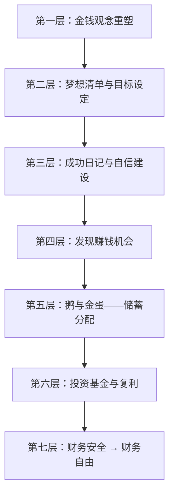

# 《小狗钱钱》深度读书笔记

> 1999年出版的《小狗钱钱》是欧洲最畅销的理财启蒙书之一。博多·舍费尔用一个12岁女孩和一只会说话的拉布拉多犬的童话故事，构建了一套完整的个人理财操作系统——从修复你和金钱的关系开始，到设定梦想、建立自信、增加收入、合理分配、投资增值，最终实现财务自由。这本书的颠覆性不在于它提出了多么深奥的投资理论，而在于它证明了一件事：理财的核心原则简单到一个孩子就能理解和执行，而大多数成年人终其一生在财务上挣扎，不是因为这些原则太难，而是因为从来没有人教过他们。舍费尔的写作动机来自亲身经历：他26岁时负债累累濒临破产，通过学习理财知识在30岁前实现财务自由。这让他深刻认识到，财务教育是学校体系中最大的缺失之一——学校教数学、物理、历史，但不教你如何管理自己的钱。孩子们长大后面对金钱问题毫无准备，重复父母的财务错误，代际传递着错误的金钱观念和财务习惯。所以他选择了童话故事的形式来传递理财知识：主人公吉娅只有12岁，她的老师是一只叫"钱钱"的狗。这个设定既能吸引儿童读者，又能让成年人放下戒备——毕竟，承认自己在理财上是零基础这件事，对很多人来说比承认自己不懂量子物理还要难为情。在个人理财类书籍的谱系中，《小狗钱钱》的定位是"零基础入门"。如果说罗伯特·清崎的《穷爸爸，富爸爸》是面向成年人的理财思维革命，那《小狗钱钱》就是更温和、更务实、更系统化的入门版本。它的独特价值在于：不仅告诉你"为什么要理财"，还手把手教你"第一步具体怎么做"。

## 这本书要解决什么问题

1999年，德国理财教育家博多·舍费尔出版了这本《小狗钱钱》（德文原名 *Ein Hund namens Money*）。他想解决的问题很简单，也很普遍：为什么大多数人终其一生都在为钱发愁，却从来没有人教过他们如何与金钱相处？

学校教数学、物理、历史，但不教你如何管理自己的钱。父母可能自己也不会理财，只能传递一些模糊甚至错误的金钱观念——"钱是万恶之源""有钱人都是坏人""我们这种普通人不可能有钱"。舍费尔认为，正是这些从小被灌输的负面信念，成为人们理财道路上最大的障碍。它们不是知识层面的障碍，而是心理层面的——你潜意识里相信"有钱是不好的"，你的行为就会不自觉地让自己远离财富。

这个问题不仅存在于德国。在全球范围内，个人理财教育的缺失是一个普遍现象。2008年金融危机暴露了一个令人震惊的事实：大量成年人连信用卡利息的计算方式都不理解，却已经背负了沉重的消费性债务。OECD的调查显示，即使在发达国家，仍有相当比例的成年人不理解通胀、复利和风险分散这些基本的金融概念。舍费尔在1999年就看到了这个问题，并选择从最根本的地方入手——不是教投资技巧，而是先帮助读者修复与金钱的关系，建立基本的财务认知框架。

在个人理财书籍的版图中，《小狗钱钱》占据的是"第一本理财书"的位置。它假设读者对理财一无所知，甚至对金钱怀有负面情绪。它的任务是完成从"零"到"一"的跨越——让一个完全不懂理财的人建立起基本的框架和行动习惯。这个定位决定了它的风格和深度：简单、具体、可操作，但也必然意味着对复杂现实的简化。

如果把个人理财类书籍按照"入门深度"排列，大致可以形成这样一个序列：《小狗钱钱》处于最基础的一端，用故事和比喻建立基本框架；《穷爸爸，富爸爸》处于中间位置，用更激进的方式挑战传统的收入思维；《巴比伦最富有的人》用古代寓言重述类似的原则；再往上是《漫步华尔街》这样的投资实务书籍，提供真正可以执行的投资策略。舍费尔清楚地知道自己的书处于这个序列的哪个位置——他不试图面面俱到，而是专注于做好一件事：帮读者完成理财认知的第一次觉醒。正因为他有意控制了内容的深度和复杂度，这本书才能做到它的同类竞品做不到的事情：让一个对理财完全没有概念的人在读完之后，立刻知道自己应该做什么、能够做什么、以及为什么要这样做。

## 核心模型地图

舍费尔整本书的知识体系可以提炼为一个"理财金字塔"，从底层到顶层共七层，每一层都是下一层的基础：

这个金字塔的精妙之处在于每一层都是下一层的前提条件：

- 没有正确的金钱观念，你不会去设定财务目标
- 没有清晰的目标，你不会产生行动的动力
- 没有自信，你不敢迈出赚钱的第一步
- 没有收入来源，储蓄无从谈起
- 没有储蓄习惯，投资无法开始
- 没有投资增值，财务自由永远只是幻想

很多人上来就想学"投资技巧"——该买什么股票、什么时候入场、哪个基金好——却忽略了前面五层的建设。结果往往是：赚了钱因为缺乏储蓄习惯而花掉，亏了钱因为缺乏自信而恐慌撤退，或者根本不敢开始因为潜意识里觉得"有钱是不好的"。舍费尔的贡献在于还原了理财的完整路径，而不是只展示路径的终点。

## 逐层深入

### 第一层：金钱观念的重塑——理财之前，先和金钱和解

故事开篇，吉娅的家庭正面临典型的财务危机。父母买了超出偿还能力的房子，信用卡债务不断累积，收入的大部分用于偿还各种贷款利息。家里的氛围是焦虑和争吵——关于钱的争吵。在这种环境中长大的吉娅，对金钱的感受是恐惧和困惑。

钱钱帮助吉娅做的第一件事，不是教她怎么赚钱，而是帮她检视对金钱的信念。在吉娅的世界里——也是很多人的世界里——存在着一些根深蒂固的错误观念：

"金钱是万恶之源。"这句话让人对财富产生负罪感。如果你内心深处相信金钱是"恶"的，那么拥有很多钱就意味着你是一个"恶人"。为了维持自己的道德自我形象，你会无意识地排斥财富。

"有钱人都是坏人。"这种偏见把"富有"和"不道德"画上了等号，让人回避变得富有——因为不想成为自己鄙视的那种人。

"谈钱是庸俗的。"这种社会禁忌阻止了对金钱的理性讨论和学习。如果连谈论金钱都是庸俗的，那学习理财就更是一种"掉价"的行为了。

这些信念不是人们自己想出来的，而是来自成长环境中的"心理编程"。父母、老师、社会文化不断重复的关于金钱的消极信念，在人的潜意识中形成了"金钱负罪感"——你一方面想要钱，另一方面又觉得想要钱是不对的。

这种内部矛盾导致了一种隐蔽的自我破坏行为：你可能在财务状况好转时突然无意识地大量消费，把自己拉回"正常"（也就是穷）的状态。行为经济学家称这种现象为"金钱温度计"——每个人内心对自己"应该有多少钱"有一个设定点，当实际财务状况偏离这个设定点太远时（无论是更穷还是更富），人会不自觉地做出调整行为让自己回到"正常"水平。

舍费尔的核心论点是：金钱本身是中性的工具。一把刀可以做饭也可以伤人——刀本身没有善恶，使用者的意图才有。同样，金钱可以用来做慈善、改善生活、帮助他人，也可以用于挥霍和剥削——决定因素是持有者的品格，而不是金钱本身。

金钱不能直接带来幸福，但金钱问题会直接带来不幸。财务压力是家庭冲突的主要来源之一，也是个人焦虑和抑郁的重要触发因素。研究数据显示，在家庭离婚案例中，财务问题是排名前三的导火索之一。解决财务问题不能保证你幸福，但可以消除一个重要的不幸来源。想要消除这个不幸来源，是完全正当的。

舍费尔在这一层的贡献常常被低估。很多理财书直接从"如何存钱""如何投资"开始讲起，假设读者已经在心理上准备好了要变得富有。但现实是，大量的读者在潜意识层面还没有解决"我该不该有钱"这个问题。如果一个人内心深处认为"有钱是不好的"，那么无论你教他多少投资技巧，他都会在某个环节自我破坏。舍费尔从观念入手，是真正理解了理财教育的痛点。

### 第二层：梦想清单与目标具象化——把模糊的"想要钱"变成清晰的行动指令

在帮吉娅修复了与金钱的关系之后，钱钱给她的第一个具体任务不是"去赚钱"，而是"写下你最想要的10样东西"。

这个任务看起来简单，实际上直击了一个关键问题：大多数人从未认真想过自己到底想要什么。他们模糊地觉得"想要更多钱"，但这个愿望太抽象了，大脑无法将其转化为行动指令。你对着"想要更多钱"这五个字，根本不知道下一步该做什么。但如果你的目标是"三年内存到5万块去日本旅行"，你立刻可以开始计算：每月需要存多少？从哪里可以省出这笔钱？有没有额外赚钱的机会？

钱钱要求吉娅从10个愿望中选出最重要的3个，并为每一个制作"梦想相册"——用图片将愿望视觉化。吉娅选择的三个目标是：一台笔记本电脑、去美国旅行、帮助父母还清债务。

为什么只选三个？这背后有三个原因。第一，专注：追求太多目标会分散精力，什么都做不好。心理学研究表明，人的认知资源是有限的，同时追求过多目标会导致"目标冲突"，反而降低对每个目标的投入。第二，可行：三个目标足够雄心勃勃，又不至于让人望而却步。如果你只有一个目标，万一受阻就容易放弃；如果有十个目标，你连从哪个开始都不知道。第三，平衡：三个目标可以覆盖不同维度——物质的（电脑）、体验的（旅行）、利他的（帮父母还债）。

"梦想相册"利用了可视化的心理学原理。具体的图像比抽象的文字更能激发情感和动力。你说"我想去美国"和你每天看到金门大桥、时代广场的照片，对大脑的刺激强度完全不同。定期翻看梦想相册可以持续维持动力——它把遥远的目标拉近到了"每天可以看到"的距离。

这个方法背后的学术支撑是目标设定理论（Locke & Latham的研究）：具体且有挑战性的目标比模糊的"尽力而为"能带来更好的表现。但舍费尔没有深入讨论的一个问题是：如何确保你的梦想真的是你自己的？如果你选定的梦想是社会标准灌输给你的"成功"——大房子、豪车、名牌包——你可能会花大量精力追逐一个实现后并不让你快乐的目标。这是梦想清单方法的一个潜在盲区。

赚钱不是目的，实现梦想才是目的。金钱是通往你真正想要的生活的工具。当你把"赚钱"和"具体的梦想"连接起来时，你的动力会完全不同。

值得一提的是，梦想清单方法在后来的积极心理学研究中得到了广泛的佐证。哈佛大学的一项经典追踪研究发现，那些在青年时期写下了明确人生目标的人，在二十年后的收入和职业成就上显著高于没有明确目标的人。当然，相关关系不等于因果关系——能够写下明确目标的人可能本身就具有某些有利特质。但至少可以说，目标设定这个行为本身是有积极效应的。

舍费尔还强调了一个容易被忽视的细节：你需要每天看你的梦想相册，而不是做完一次就放在抽屉里。这种持续的视觉刺激有助于在潜意识层面"重新编程"——你的大脑会逐渐从"这是不可能的幻想"转变为"这是我正在走向的现实"。当然，这种方法的边界是：光看图片不行动，目标永远不会实现。梦想相册是动力的来源，不是魔法。

### 第三层：成功日记——自信是理财能力的底层操作系统

钱钱给吉娅的第二个任务是：每天写"成功日记"——每天记录至少5件自己做成功的事情，不管多小。不是大事件，而是任何你做得好的事：今天做了一道好菜、帮同学解答了一个问题、跑步比昨天多跑了100米、读完了一个章节。

为什么这件看似与理财无关的事情会出现在一本理财书里？因为舍费尔认为，理财能力的最大障碍往往不是知识不足，而是自信不足。很多人不敢开始投资——"我又不懂金融"。不敢争取加薪——"我哪有那个资格"。不敢创业——"我这种人做什么生意"。这些退缩行为的根源不是能力问题，而是信念问题：他们不相信自己有能力做好。

人类大脑有一种"消极偏差"——负面事件在记忆中的权重远大于正面事件。进化心理学解释说，这是因为在远古环境中，记住危险（哪里有蛇、哪个部落有敌意）比记住好事（哪里的水果好吃）更有利于生存。但在现代社会，这种偏差让人对自己形成过于消极的评价。你可能做了十件好事，但只要犯了一个错误，就会整天想着那个错误。成功日记的作用是人为纠正这种偏差，让大脑也开始关注自己的优势和成就。

这与心理学家班杜拉的"自我效能感"理论高度一致。自我效能感是指一个人对自己能够成功完成某项任务的信心。班杜拉的研究表明，自我效能感的最强来源是"掌握经验"——也就是通过回忆和确认过去的成功来增强对未来成功的信心。成功日记本质上就是一种低成本、高回报的自我效能感训练工具。

成功日记的应用范围远不止理财。在任何你想要建立新能力的领域——学外语、健身、写作、社交——每天记录"小成功"都能有效地建立正向循环：记录成功 → 自信增加 → 尝试更多 → 更多成功 → 更多记录。关键是不要等到有大成就才记录，微小的进步也值得记录。而且必须长期坚持——钱钱强调至少坚持几个月才能看到效果。

有一个常见的反对意见是："这不就是自欺欺人吗？如果我客观上做得不好，硬说自己成功有什么用？"舍费尔的回答是：成功日记不是让你忽视缺点，而是让你的自我评估变得更加平衡。大多数人的问题不是"过度自信"，而是"严重低估自己"。成功日记的目标不是把你变成一个盲目乐观的人，而是把你从"只看到失败"的极端拉向"既看到失败也看到成功"的中间地带。当你的自我评估更加平衡时，你做出的决策也会更加理性——既不会因为盲目乐观而冒不必要的险，也不会因为过度悲观而错过应该抓住的机会。

从实际操作层面看，成功日记还有一个隐含的好处：它培养了一种"反思习惯"。每天花几分钟回顾当天发生了什么、自己做了什么，这种反思能力本身就是一种宝贵的元技能。很多人过着"自动驾驶"的生活——每天重复同样的行为模式，从不停下来审视自己的轨迹。成功日记强迫你每天至少暂停一次，看看自己走到了哪里。

### 第四层：发现赚钱机会——赚钱的本质是为他人创造价值

有了正确的金钱观、清晰的目标和足够的自信之后，吉娅面临一个实际问题：钱从哪里来？

钱钱没有说"去找一份工作"，而是引导吉娅思考三个问题：

1. 你喜欢做什么？
2. 你擅长做什么？
3. 别人需要什么？

当这三个问题的答案重叠时，你就找到了你的"赚钱甜蜜点"。吉娅想起自己很擅长和狗打交道，邻居们工作忙没时间遛狗——于是她开始了遛狗服务。从一条狗开始，逐步扩展到多条狗。后来她还教另一个女孩一起遛狗，实现了简单的"业务规模化"。

这个方法本质上是日本"ikigai"（生活意义）概念在理财领域的简化应用：找到你热爱的、你擅长的、世界需要的和你能被支付报酬的交集。舍费尔简化为三个问题，让12岁的孩子也能理解和使用。

钱钱通过这个故事传达了一个核心观点：赚钱的本质是发现别人的需求并用你的能力来满足它。不是你想卖什么，而是别人需要什么。解决的问题越大、解决得越好，获得的报酬就越多。

吉娅的例子还说明了几个重要的道理。第一，赚钱机会往往就在身边，不需要去远方寻找。第二，你不需要等到成年、等到有学历、等到"准备好"才能开始——只要愿意观察周围人的需求，赚钱随时可以开始。第三，从小事做起，先证明自己，再逐步扩展。

当然，吉娅的遛狗生意是一个理想化的创业案例——市场需求明确、启动成本为零、没有竞争对手、客户主动上门。现实中的创业远比这复杂：你需要面对竞争、定价困难、客户流失、现金流紧张等一系列问题。但作为"第一次赚钱"的教学案例，它的简单性恰恰是优势——它让读者相信"赚钱没有那么难"，从而迈出第一步。而迈出第一步，往往是整个理财旅程中最难的一步。

舍费尔在这个故事中还隐含了一个重要的商业原则：从最小的可行方案开始，而不是等到一切完美再行动。吉娅没有先做市场调研、写商业计划书、申请营业执照——她就是开始帮邻居遛狗了。这种"先做起来再说"的态度，在后来的精益创业方法论中被系统化为"最小可行产品"的概念。对于理财新手来说，最重要的不是找到最完美的赚钱方式，而是让自己经历一次"用自己的能力赚到钱"的完整过程。这个过程本身就是对成功日记最有力的补充——它为你的"我能行"提供了最直接的证据。

吉娅后来教莫尼卡一起遛狗的情节也值得注意。这是舍费尔在暗示一个更深层的商业概念：从"出卖自己的时间"到"建立系统"。当你只是一个人遛狗时，你的收入受限于你的时间和精力。当你开始教别人遛狗并从中分成时，你就建立了一个简单的商业系统——你的收入不再完全依赖于你个人的劳动时间。这个从"为钱工作"到"让系统为你工作"的转变，是整个理财旅程中的一个关键跃迁，也是后面投资章节的铺垫。

### 第五层：鹅与金蛋——储蓄是财富积累的第一原则

这是全书最著名的比喻，也是舍费尔对"先支付自己"原则最精彩的诠释。

钱钱给吉娅讲了一个寓言：一个农夫养了一只鹅，有一天发现鹅下了一颗金蛋。此后每天鹅都下一颗金蛋。农夫越来越贪心，想一次性得到所有金蛋，于是杀了鹅——结果鹅肚子里什么也没有，再也没有金蛋了。

在这个比喻中：鹅就是你的本金/储蓄，金蛋就是本金产生的利息/收益。核心原则是：永远不要杀掉你的鹅。也就是说，永远不要花掉你的本金，只花利息和收益。"鹅"越大，"金蛋"越多。

舍费尔用这个故事推导出一个具体的收入分配法则：

- **50%** 存入"鹅"账户——这笔钱永远不能花，只能用于投资，让它不断长大
- **40%** 存入梦想储蓄罐——为具体的短期和中期目标存钱
- **10%** 用于日常零花——满足当下的消费需求

这个50-40-10的分配法则，本质上是"先支付自己"原则的少年版表达。在个人理财领域，"先支付自己"是一个被反复强调的核心理念——它的意思是：在你的收入用于支付任何其他东西（房租、水电、娱乐）之前，先把一部分划入储蓄/投资账户。与《穷爸爸，富爸爸》中清崎强调的同一原则相比，舍费尔的版本更具体——他给出了明确的比例，而且用"不能杀鹅"这个形象来建立心理防线，防止你在冲动消费时挪用投资本金。

50%的储蓄率对很多人来说可能过高，特别是对于收入刚够维持生活的家庭。这是一个教学用的理想化比例，不是放之四海皆准的铁律。你需要根据实际收入水平和生活成本来调整。但核心原则不变：无论收入多少，永远先留一部分给"鹅"，再安排其他支出。

舍费尔用这个比喻传达了一个很多成年人终其一生都没领悟的道理：财富积累的第一原则不是"赚更多"，而是"留住一部分"。很多高收入者同样是月光族——收入高但支出更高，永远没有"鹅"。原因是经济学中所说的"生活方式通胀"：你的消费欲望会随着收入增长而增长。除非你在赚到钱的第一时间就把一部分"藏起来"——在它还没来得及被消费欲望盯上之前。

"鹅的故事"之所以如此有效，是因为它利用了一个心理学现象：损失厌恶。人们对失去一样东西的痛苦，大约是得到同样东西的快乐的两倍。当你把一笔钱定义为"我的鹅"时，花掉它的心理成本就变得很高——它不再是一笔普通的存款，而是一个有名字、有身份的"活物"。杀掉自己的鹅比花掉一笔存款要难得多。这就是为什么比喻的力量如此强大——它不是在教你一个抽象的理财原则，而是在你的心理防线上安装了一个具体的、形象的、有情感重量的"拦路虎"。

这个分配法则还有一个容易被忽视的优势：它的自动化特性。舍费尔建议的是一种"自动转账"机制——每次收到钱，第一件事就是按比例把它分到不同的账户里。这意味着你不需要每次都做一个"要不要存钱"的决定（因为每次做决定都消耗意志力），而是只需做一次决定（设置自动转账），然后让系统替你执行。行为经济学家理查德·泰勒后来提出的"助推"理论和"默认选项"概念，本质上就是同一个思路：当正确的行为被设计成默认选项时，人们更有可能做出正确的选择。

### 第六层：投资基金与复利——让金钱替你工作

当吉娅通过遛狗积累了一些储蓄之后，故事中出场了一个关键人物——金先生，一位富有的老人。金先生向吉娅介绍了投资基金的概念：基金就是把很多人的钱汇集在一起，由专业的基金经理来投资股票市场。

金先生给出了几个关键的投资原则：

**分散投资**：不要把所有钱放在一只股票或一个市场里。一只股票可能暴涨也可能暴跌，但一个包含几十甚至几百只股票的基金，整体表现会稳定得多。这利用了统计学中的"大数定律"——单个事件的结果不可预测，但大量事件的平均结果是可以预测的。

**长期持有**：短期市场波动不可预测，任何人告诉你明天股市会涨还是跌，都是在猜测。但长期来看，股票市场整体趋势是上涨的——因为它反映的是人类经济活动的整体增长。建议至少持有10年以上。

**定期定额**：每月固定投入一笔钱到基金中。这种策略利用了"成本平均法"——当市场高位时你买到的份额少，低位时买到的份额多，长期下来平均成本被拉低。更重要的是，定期定额消除了"择时焦虑"——你不需要判断什么时候该买什么时候该卖，每月固定投入即可。

**复利效应**：金先生用具体的数字向吉娅展示了复利的力量。如果你每月投资100欧元，年收益12%：10年后约23000欧元，20年后约98000欧元，40年后约1180000欧元。注意最后20年的收益远超前20年——这就是复利的本质特征：增长不是线性的，而是指数级的。越到后面增速越快，前提是你从不中断、从不"杀鹅"。

72法则是一个简单而有力的直觉计算工具：用72除以年收益率，就是资金翻倍所需的年数。年收益6%——12年翻倍；年收益8%——9年翻倍；年收益12%——6年翻倍。这个法则虽然是近似值，但对于快速理解复利的威力非常有用。

舍费尔在投资建议上做了一个重要选择——他没有教吉娅选个股，而是推荐基金。这反映了被动投资哲学的立场：对于普通人来说，试图通过选股来超越市场是不明智的，因为你在和专业的、拥有更多信息和更快交易速度的机构投资者竞争。你应该把钱投入到追踪市场整体表现的基金中，然后让时间和复利替你工作。

投资不是赌博。赌博是把钱押在不确定的短期结果上，期望靠运气获利。投资是把钱放在长期来看大概率增长的资产上，靠时间和复利获利。关键区别在于两个维度：时间（短期vs长期）和分散程度（集中vs分散）。

这里值得展开讨论一下为什么"长期持有"如此重要。短期市场波动主要由情绪驱动——恐惧、贪婪、恐慌、从众——这些情绪是不可预测的。但长期市场走势主要由基本面驱动——企业的利润增长、技术进步带来的生产力提升、人口增长带来的需求扩张。只要人类社会在整体上是进步的（更多的人在工作、更好的技术在被开发），股票市场的长期趋势就是上涨的。当然，"长期"到底是多长？历史数据表明，如果你持有一个分散化的股票基金超过15年，出现亏损的概率接近于零——即使你在最糟糕的时间点买入（比如2007年金融危机前的最高点）。但如果持有期只有1-3年，亏损的概率就相当高了。这就是为什么舍费尔建议"至少持有10年以上"。

还有一个舍费尔没有展开但值得注意的概念：投资中最大的敌人不是市场下跌，而是你自己的情绪。行为金融学的大量研究表明，普通投资者因为在市场高点恐慌卖出、在低点错过反弹而损失的收益，远远超过他们因为选错基金而损失的收益。所以"定期定额、长期持有、不因短期波动而改变策略"这三条看似简单的原则，实际上是在对抗人性中最根深蒂固的弱点——恐惧和贪婪。能够做到这三条的人，不需要任何高深的投资知识，就已经跑赢了大多数试图"择时"和"选股"的人。

### 第七层：债务——复利的阴暗面

吉娅的父母在故事中代表了一种典型的家庭财务困境：为了"看起来过得好"而过度借贷。他们买了超出承受能力的房子，使用多张信用卡消费，收入的大部分用于偿还贷款利息。他们不是收入低——他们是支出太高，而且用借贷来填补支出和收入之间的缺口。

钱钱和金先生帮助吉娅理解了债务的本质：债务是反向复利。当复利为你工作时（投资），你的财富指数级增长。当复利对你工作时（负债），你的债务也指数级增长。信用卡年利率通常在15%-20%之间，而投资回报率通常在5%-12%之间。这意味着还清高利率债务本身就是一种高回报的"投资"——你每还掉1块钱18%利率的信用卡债务，就等于获得了18%的无风险收益。

金先生给吉娅父母的建议可以总结为四点：

第一，立即停止借新债——停止伤口继续流血。第二，尽可能降低每月生活支出——增加可用于还债的资金。第三，用多余的钱优先偿还利率最高的债务——这在数学上是最优策略。第四，即使在还债期间也要保留一小部分钱给"鹅"——因为如果完全没有储蓄，任何突发事件（生病、失业、车坏了）都会让你再次陷入借债循环。

这里有一个重要的区分：舍费尔讨论的主要是消费性债务。并非所有债务都是坏的。投资性债务（如合理的房贷用于出租房产、教育贷款用于提升收入能力）在利率合理且预期回报高于利息成本时，是合理的金融工具。但对于理财初学者，先建立"消费性债务是有害的"这个认知是正确的优先级。

负债消费是用"未来的自己"来补贴"现在的自己"。你今天刷信用卡买的东西，要用未来几个月甚至几年的收入来偿还，而且还要加上利息。这是一种对未来自我的剥削——你把未来的选择权和自由度抵押给了当下的消费欲望。

从更宏观的视角看，吉娅父母的故事也折射了一个在全球范围内不断加剧的社会现象：消费主义文化对普通家庭的侵蚀。广告无处不在地告诉你"你值得拥有更好的"——更大的房子、更新的车、更贵的衣服——而信用卡和消费贷款让你可以在还没赚到钱的情况下就"拥有"这些东西。这种"先享受后付款"的消费模式表面上是在提升生活质量，实际上是在透支未来的自由。当你的每月收入大部分都用于还贷和还信用卡时，你实际上已经成了债务的奴隶——你不是在为自己工作，而是在为银行工作。

舍费尔通过吉娅父母的故事温和地传达了一个尖锐的信息：真正的财务自律不是"能买却不买"的苦行，而是"清楚地知道什么是自己真正想要的，什么是被广告和社会压力制造的虚假需求"。当你有了梦想清单——你真正想要的三件事——你就有了一个过滤器：每次消费前问自己，"这笔支出在帮我靠近我的三个梦想吗？"如果答案是否定的，那它可能就是一种不必要的消费。

### 第八层：72小时法则——行动力的秘密

钱钱提出了一条关键法则：当你决定做一件事时，你必须在72小时内迈出第一步，否则你很可能永远不会去做。

这条法则背后的心理学机制是：人的动力是一条衰减曲线。在你刚产生一个想法的那一刻，你的热情和动力是最高的。随着时间推移，日常琐事、惰性、恐惧和"再想想"会逐步消磨你的意志力。72小时大约是一个临界点——如果你在这个窗口内没有采取任何行动，那个想法就会被归档到"有朝一日再说"的心理文件夹里，而那个文件夹几乎从来不被打开。

这不是说你需要在72小时内完成整件事。而是说你需要迈出第一步——哪怕是很小的一步。想开一个储蓄账户？72小时内至少去银行网站看看。想开始写成功日记？今天晚上就写第一篇。想学习投资？72小时内至少买一本相关的书或听一集播客。

行动比完美更重要。一个不完美的行动胜过一个完美的计划。大多数人的理财计划死在了"我明天再开始"这句话上。而"明天"是一个永远不会到来的日子。

需要注意的是，72小时法则适用于低风险、低成本的行动——开账户、设置自动转账、买一本书、报名一门课。对于高风险、高成本的决策——买房、创业、大额投资——72小时内应该做的是"开始研究"，而不是"立即执行"。冲动和行动力是不同的东西。

72小时法则的另一个应用场景是在你读完一本书或听完一场讲座之后。你有没有过这样的体验：刚读完一本理财书，感到非常兴奋，决心要改变自己的财务状况——然后三天过去了，你的生活没有任何变化，那份兴奋也慢慢消退了？这就是72小时法则在起作用（或者说，在你没有利用它的时候起反作用）。解决方法很简单：在阅读或听讲的过程中，随时记录下"我读完之后要做的第一件事"，然后在结束后的72小时内把它完成。这件事不需要很大——开一个储蓄账户、下载一个记账应用、把这个月的支出列出来——关键是让它成为一个行动，而不仅仅是一个想法。

从更深层来看，72小时法则反映了舍费尔整本书的一个核心教育理念：知识不等于行动，行动不等于结果，但没有行动就一定没有结果。很多人陷入了"学习理财"的陷阱——不断地读书、看视频、听播客，觉得自己在"为理财做准备"，但实际上他们只是在用学习来逃避行动。真正的理财不是发生在书本里的，而是发生在你的银行账户里的。

### 第九层：导师与投资俱乐部——你需要同行者

书中的金先生和陶穆太太是吉娅的导师。他们不仅传授理财知识，更在精神上支持和鼓励她。吉娅和朋友们还组建了一个"投资俱乐部"——几个孩子定期见面，一起学习、讨论、共同做投资决策。

导师的价值不仅在于传授知识，更在于缩短试错周期。没有导师，你可能需要10年才能领悟的道理，有了导师可能6个月就明白了。但舍费尔也暗示了一个重要前提：你必须先证明自己值得被指导。吉娅之所以得到金先生的帮助，是因为她先帮金先生照看房子和宠物——她先创造了价值，然后获得了回报。

投资俱乐部的设计体现了另一个重要原则：你的财务行为深受社交环境影响。行为经济学研究表明，人的储蓄和消费行为会显著受到同伴的影响。如果你周围的人都在超前消费、攀比物质、嘲笑储蓄，你很难独自逆流而上。反过来，如果你加入了一个定期讨论理财、分享投资心得、互相督促储蓄的群体，你的财务行为会显著改善。

你的财务水平很大程度上是你最常来往的五个人的平均值。如果你想改善自己的财务状况，一个有效的策略是主动进入财务状况更好的人的社交圈——不是去攀附，而是去学习他们的思维方式和行为习惯。

这个原则在现代社会有了新的表现形式。在社交媒体时代，你的"财务同伴"不仅包括线下的朋友和同事，还包括你在线上关注的人。如果你的社交媒体首页满是炫富、名牌和奢侈生活方式的内容，你的消费欲望会不知不觉地被拉高。反过来，如果你关注的是分享理财知识、讨论投资策略、倡导理性消费的内容创作者，你的财务意识会逐渐提升。舍费尔在1999年写这本书时还没有社交媒体，但他提出的"环境塑造行为"这个原则在数字时代变得更加重要了。

金先生在书中的角色还暗示了另一个要点：好的导师不会替你做决定，而是帮助你建立做决定的能力。金先生没有直接告诉吉娅"买这只基金"，而是教她理解基金的原理、复利的机制、风险分散的逻辑，让她能够自己做出明智的投资决策。这种"授人以渔"的教育方式，是《小狗钱钱》整本书的教学理念——它不是一份具体的投资操作手册，而是一个帮你建立理财思维框架的启蒙读物。

### 第十层：从财务安全到财务自由——两个阶段的路径

钱钱在整个故事中区分了两个层次的财务目标：

**财务安全**是第一阶段——即使失去了工作或收入来源，你也能维持基本生活一段时间。实现财务安全需要：6-12个月的生活费作为应急基金、没有高利率消费性债务、有基本的保险保障（医疗保险、意外保险）。这个阶段的目标不是"变富"，而是"不怕穷"——建立一个安全垫，让任何意外都不会把你推入财务深渊。

**财务自由**是第二阶段——被动收入（投资收益、租金收入等）超过生活支出，你不需要为了钱而工作。这是一个更高的目标，需要足够大的"鹅"，"金蛋"能覆盖日常开销，最好还有多元化的收入来源。

舍费尔强调的顺序是：先安全，后自由。太多人在没有安全垫的情况下追求高风险高回报——比如借钱炒股、把全部积蓄投入一个创业项目——一次挫折就全盘皆输，甚至比起步前更糟。有了安全垫，你可以更从容地追求更大的目标——因为即使失败了，你也不会失去一切。

这个"先安全后自由"的策略在FIRE（Financial Independence, Retire Early）运动中得到了更详细的发展。FIRE运动的参与者通常以40%-70%的储蓄率为目标，通过十到二十年的高强度储蓄和投资，在40岁或50岁之前实现财务独立。舍费尔在1999年就提出了类似的理念框架，只是没有给它一个专门的名字。

值得强调的是，财务自由并不意味着"从此不再工作"。舍费尔对财务自由的定义是"你不再需要为钱而工作"——注意关键词是"为钱"。当你的被动收入覆盖了生活支出之后，你仍然可以工作，但这时你工作的动力是兴趣、意义和热情，而不是生存压力。你可以选择做你真正想做的事情，而不是被迫做能付账单的事情。这种自由度的转变，对人的心理健康和生活满意度有着巨大的影响。

舍费尔也暗示了一个现实：通往财务自由的道路是漫长的，需要十年甚至数十年的持续努力。这不是一个"快速致富"的方案——恰恰相反，它是一个"慢慢变富"的方案。那些承诺"三个月翻倍""一年财务自由"的投资方案，几乎可以确定是骗局。真正有效的路径是枯燥的：持续储蓄、定期投资、长期持有、不折腾。这种"慢"不是缺点，而是特征——复利需要时间来发挥威力，而时间是你现在就可以开始投入的最宝贵的资源。

## 预测与现实

舍费尔在1999年出版此书时的一些核心理念，与之后二十多年的现实对照：

| 舍费尔的理念 | 后续验证 |
|-------------|---------|
| 投资基金是普通人最好的投资方式 | **高度验证**。指数基金的崛起（如先锋基金）证实了被动投资对普通人的优越性。大量研究表明，长期来看绝大多数主动管理型基金跑不赢指数 |
| 复利是财富增长的引擎 | **永恒验证**。数学规律不会改变 |
| 消费性债务是财务毁灭的根源 | **广泛验证**。2008年金融危机的根源之一就是过度消费信贷，次贷危机就是这个原则在宏观层面的验证 |
| 财商教育的缺失是普遍问题 | **持续验证**。多国开始将理财教育纳入学校课程，但进展缓慢 |
| 12%年回报率的假设 | **需要修正**。全球股票市场长期实际年化回报约5%-7%（扣除通胀后），用更保守的回报率做财务规划更稳妥 |
| 储蓄50%收入的目标 | **理想化但方向正确**。FIRE运动的参与者确实以40%-70%储蓄率为目标，但对大多数人来说需要根据实际情况调整 |
| 成功日记能提升自信 | **心理学验证**。积极心理学领域的大量研究支持了"关注优势和成就"对提升自我效能感的效果 |

关于12%回报率的假设需要特别说明：这个数字在1990年代的语境下——全球股市处于高速增长期——虽然乐观但并非完全不合理。然而以更长的历史维度看，全球股票市场的长期年化名义回报率大约在8%-10%之间，扣除通胀后的实际回报率约5%-7%。读者在做个人财务规划时，应该使用更保守的回报率假设（如6%-8%），以避免过度乐观带来的失望。

舍费尔推荐基金而非个股的投资建议在后续几十年中得到了更强的验证。但他没有充分讨论的一个关键问题是：基金的管理费对长期回报的侵蚀。一个年管理费1.5%的主动管理型基金和一个年管理费0.1%的指数基金，30年下来的回报差异是惊人的。约翰·博格（先锋基金创始人）后来用大量数据证明了这一点。对于今天的读者，一个更精确的投资建议是：选择低成本的广基指数基金，定期定额，长期持有。

## 不同视角的评价

**支持者认为**：
- 舍费尔用最简单的语言传达了最重要的理财原则，这是一种了不起的教育能力。很多成年人读了无数本投资书仍然不敢迈出第一步，而一本"给孩子写的书"反而让他们行动了
- "成功日记"和"鹅的故事"是极其有效的教学工具，因为它们利用了故事和隐喻的力量。人类大脑天生更擅长记住故事而非抽象概念
- 本书的操作性极强——读完后你确切地知道第一步该做什么，不会陷入"道理都懂但不知道从何开始"的困境
- 先修复金钱观念再教投资技巧的顺序设计非常合理，击中了大多数理财教育忽视的盲区

**批评者认为**：
- 书中的投资建议过于简化，缺乏对风险的充分讨论。投资基金不是"把钱放进去就会长大"这么简单——市场崩盘、基金清算、长期低迷期都是真实的可能性
- 12%的年回报率假设过于乐观，可能给读者不切实际的期望。如果有人基于12%的回报率做退休规划，最终可能面临严重的资金不足
- "每个人都能变富"的叙事可能忽略了结构性的经济不平等——出生阶层、地区差异、系统性歧视等因素对一个人的财务命运有巨大影响，不是"改变观念+写成功日记"就能克服的
- 吉娅的创业故事过于理想化——市场需求现成、没有竞争、没有真正的挫折。真实的创业充满了不确定性和失败
- 书中没有讨论税收对投资回报的影响，也没有讨论通胀对储蓄购买力的侵蚀

**平衡的看法**：把《小狗钱钱》当作理财旅程的"第一本书"，而不是"唯一一本书"。它最大的价值在于帮助你完成从"零"到"一"的跨越——从完全不懂理财、甚至恐惧理财，到建立基本的理财框架和行动习惯。当你完成了这个跨越之后，你需要更深入、更专业的学习来完善你的知识体系。它播下了种子，但花园还需要你持续浇灌。

还有一个值得探讨的问题：这本书出版于1999年，在过去二十多年里全球经济环境发生了巨大变化——互联网泡沫、2008年金融危机、欧债危机、新冠疫情、全球通胀——这些变化是否影响了书中建议的有效性？答案是：书中的核心原则（正确的金钱观、目标设定、储蓄习惯、分散投资、长期持有）不受具体时代背景影响，因为它们是基于人性和数学规律的，这些不会随着经济周期而改变。但具体的操作建议（如12%的回报率假设、50%的储蓄比例、具体的基金选择方式）需要读者根据当下的市场环境做调整。

另一个批评者的观点涉及文化差异。这本书诞生于德国，一个有着深厚储蓄文化传统的国家。德国人的储蓄率在欧洲名列前茅，"节俭"在德语文化中被视为美德。舍费尔的储蓄建议对于本来就有储蓄习惯的德国人来说是锦上添花，但对于生活在消费主义更加盛行的文化环境中的读者来说，可能需要更大的心理转变才能执行。不同国家的税收制度、金融产品可及性、社会保障体系也会影响具体的理财策略——比如在中国，公积金和社保的存在意味着你的储蓄比例可以和书中建议的不同；在美国，401k和IRA等退休账户的税收优惠使得投资策略有所不同。但再次强调，这些是"操作层面"的差异，"原则层面"的建议（先存再花、分散投资、长期持有）是跨文化普遍适用的。

## 延伸阅读

《财务自由之路》（博多·舍费尔）：同一作者的成人进阶版。如果说《小狗钱钱》是理财的幼儿园，这本书就是小学。它用更系统、更详细的方式重新阐述了同样的核心原则，并增加了更多关于投资策略和心态管理的内容。适合读完《小狗钱钱》想要进一步深入的读者。

《穷爸爸，富爸爸》（罗伯特·清崎）：理财思维的另一种启蒙路径。清崎更激进、更具颠覆性——他直接攻击"好好读书、找份好工作"的传统路径，强调资产和负债的区分、被动收入的重要性。与舍费尔的温和路线形成有趣的对比：舍费尔说"先存钱再投资"，清崎说"先让钱为你工作"。两本书互补阅读效果最佳。

《巴比伦最富有的人》（乔治·克拉森）：与《小狗钱钱》理念一脉相承的经典之作。用古巴比伦的寓言故事讲述"先支付自己""让金钱为你工作""寻求专业建议"等同样的核心原则。如果你喜欢《小狗钱钱》的故事化风格，这本书会让你感到亲切。

《漫步华尔街》（伯顿·马尔基尔）：当你准备从理财入门走向真正的投资实践时，这本书提供了指数基金投资的学术基础。马尔基尔用大量数据论证了为什么绝大多数主动投资策略长期跑不赢市场指数，以及为什么低成本指数基金是普通投资者最理性的选择。

《思考，快与慢》（丹尼尔·卡尼曼）：如果你对舍费尔提到的那些心理偏差（消极偏差、冲动消费、过度自信等）感兴趣，这本行为经济学经典会带你深入理解人类决策的非理性本质——以及如何利用这种理解来做出更好的财务决策。

《有钱人和你想的不一样》（T. 哈维·艾克）：如果你对舍费尔关于"金钱心理编程"的讨论感兴趣，这本书从更心理学的角度深入探讨了"金钱蓝图"的概念——你对金钱的潜意识信念如何决定了你的财务命运，以及如何重新设定这些信念。

最后需要说明的是，《小狗钱钱》是一本值得在不同人生阶段反复阅读的书。第一次读它时，你可能会被它的简单性所打动，觉得"原来理财就这么简单"。几年之后再读，当你已经有了一些理财经验和投资经历之后，你可能会更深刻地理解某些建议——比如"永远不要杀掉你的鹅"这句话，在你第一次经历市场大跌、强烈想要卖出止损的时候，会获得完全不同的重量。十年之后再读，当你可能已经实现了某种程度的财务安全之后，你可能会开始思考舍费尔没有展开的更深层问题：金钱自由之后，什么才是真正让你幸福的生活？一本好的入门书的标志不是它回答了所有问题，而是它帮你提出了正确的问题，并给了你足够的基础去自己寻找答案。《小狗钱钱》正是这样一本书。
