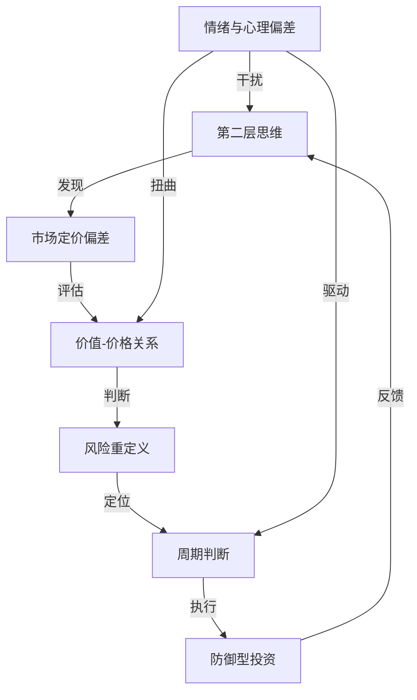

# 《投资最重要的事》深度读书笔记

> 橡树资本创始人霍华德·马克斯用20个章节回答了一个投资者最该思考却最容易忽略的问题：决定投资成败的，究竟是分析能力还是思维方式？他的结论是后者。这本书不教你选股，不教你择时，而是拆解投资中那些"看不见的变量"——第二层思维、风险的真实面目、周期的位置感、价格与价值的微妙关系、以及人类情绪如何系统性地制造错误。马克斯的核心命题是：**投资成功的关键不在于"买到好东西"，而在于"买得好"**——以低于内在价值的价格买入，同时确保即使判断出错也不会出局。巴菲特评价这本书"难得一见的有用"，因为它触及的不是投资的"术"，而是投资的"道"。

## 这本书要解决什么经济问题

投资书籍市场从不缺少关于"怎么选股"和"怎么看盘"的教程，但马克斯要回应的是一个更根本的困惑：**为什么那些聪明人、那些拥有最好信息和分析工具的人，在投资中照样会犯灾难性的错误？**

2000年科技泡沫破裂，2008年全球金融海啸——每一次危机之前，华尔街最优秀的分析师都在发布看涨报告，最大的金融机构都在加大风险敞口。问题显然不在于信息不足或分析能力不够，而在于**思维方式本身存在系统性缺陷**。投资者不是缺少数据，而是缺少正确处理数据的思维框架；不是缺少聪明才智，而是缺少与聪明才智匹配的情绪纪律。

马克斯的核心主张是：投资中最重要的事不是一件事，而是一组相互关联的思维习惯。但如果非要抓住一个根本点，那就是——你必须学会与市场共识保持恰当距离。不是为了逆向而逆向，而是因为只有**非共识且正确的判断**才能带来超额收益。

马克斯创办的橡树资本管理规模超过1500亿美元，以投资不良债务和困境资产闻名。这意味着他的盈利模式建立在"别人恐惧时买入"的基础之上——他比大多数投资者更需要理解风险和周期，因为他的投资对象本身就是危机的产物。他的"投资备忘录"自1990年代起在业界广泛传阅，巴菲特曾公开说"每次收到马克斯的备忘录，我做的第一件事就是打开阅读"。本书正是这些备忘录中核心思想的系统化整理。

在投资思想谱系中，马克斯属于价值投资阵营，但他的位置与其他价值投资者有明显区别。格雷厄姆（《聪明的投资者》作者）建立了价值投资的定量框架——通过财务分析计算内在价值，以折扣价买入。巴菲特和芒格在此基础上扩展了"品质"维度——不仅要便宜，还要好。马克斯的独特贡献则在于引入了第三个维度：**投资者的集体心理如何系统性地创造和摧毁投资机会**。他不像格雷厄姆那样只关注资产负债表上的数字，也不像量化投资者那样依赖历史数据建模，而是聚焦于市场参与者的情绪状态和行为模式——因为正是这些"软"因素决定了价格何时偏离价值、偏离多远、以及何时回归。

## 核心模型地图

马克斯在书中构建了一个环环相扣的投资思维框架。这个框架不是一套机械的操作流程，而是一组相互支撑的思维模型。理解它们之间的关系比理解每个模型本身更重要。

**第一个模型是"第二层思维"。** 它的核心假设是：市场价格反映了所有投资者的集体预期，因此你的判断要创造价值，必须在某个关键维度上不同于共识且比共识更正确。这个模型推导出一个操作性很强的结论：**仅仅判断正确是不够的，你的判断还必须与主流不同**。如果你和绝大多数人看法一致，即使你是对的，这个正确判断已经体现在当前价格里了，你只能得到平均回报。超额收益只能来自那些"非共识且正确"的判断。

**第二个模型是"价值-价格关系"。** 它假设每项资产都有一个虽然难以精确计算但可以被合理估算的内在价值，而市场价格围绕内在价值上下波动。短期内，情绪、资金流和叙事可以让价格大幅偏离价值；长期看，价值是价格的引力中心。这个模型推导出一个核心操作原则：投资的本质不是"买好东西"，而是"买得好"——以足够低于价值的价格买入，以确保即使你的估值有偏差，仍然有利可图。

**第三个模型是"风险重定义"。** 它否定了学术界将风险等同于波动率的定义，转而将真正的投资风险定义为永久性资本损失的可能性。这个看似简单的定义变换带来了深远的推论：**风险在市场繁荣时静默积累，在市场恐慌时集中释放**——因为高价格本身就是风险的来源（压缩了安全边际），而低价格本身就是安全的来源（扩大了安全边际）。这意味着传统风险指标在最需要发出警告的时候反而最安静，在最应该给出"安全"信号的时候反而叫得最响。

**第四个模型是"周期定位"。** 它假设市场在贪婪与恐惧之间钟摆式运动，这种运动由人性驱动、不可消除。投资者虽然无法预测转折点（精确的顶部和底部），但可以通过观察参与者的行为和心理状态来判断"当前在周期的哪个位置"——是接近极端乐观还是极端悲观。这个判断决定了你应该进攻（增加风险敞口）还是防守（降低风险敞口）。

**第五个模型是"防御型投资"。** 它建立在一个数学不对称性之上：亏损的伤害大于同等幅度盈利的收益（亏50%需要赚100%才能回本）。因此投资组合的构建应该以"避免灾难性损失"为首要目标，而非"最大化潜在收益"。这不是保守，而是对复利数学的尊重——活得久比跑得快更重要。

这五个模型不是独立的工具箱，而是一条完整的决策链条：用**第二层思维**发现市场定价可能存在的错误 → 用**价值-价格关系**评估这个错误有多大、机会有多好 → 用**风险重定义**框架判断如果你错了下行空间有多大 → 用**周期定位**决定当前应该多积极还是多谨慎 → 用**防御型投资**方法论构建一个在各种场景下都能存活的组合。这五步构成了马克斯完整的投资决策过程。

## 逐层深入

### 一、第二层思维：为什么大多数"正确"的判断不赚钱

马克斯创造的"第二层思维"概念是全书最具影响力的贡献之一。它回答了一个让很多聪明投资者困惑的问题：我的分析明明是对的，为什么没赚到钱？

第一层思维是直线型的判断，从信息到结论只有一步：

- "这是一家好公司，买入。"
- "经济即将衰退，股市要跌，卖出。"
- "通胀上升，买入黄金。"
- "这个行业在高速增长，买入龙头股。"

第二层思维则在信息和行动之间加入了一个关键中间步骤——考虑"市场已经怎么想了"：

- "这是一家好公司，但所有人都知道它好，股价已经充分反映甚至过度反映了好消息。现在买入的风险回报比并不理想——大量好消息已经被定价，而一点点坏消息就可能引发下跌。"
- "经济即将衰退，所有人都在恐慌抛售，股价已经跌到假设经济会崩溃的水平。如果衰退只是温和的而非灾难性的，股价反而有巨大的上行空间——因为市场已经按照最坏情况定价了。"

为什么这种区分如此重要？根本原因在于市场定价的本质。市场价格不是某个客观的衡量标准，而是所有参与者的集体预期的即时汇总。在一个充分竞争的市场中，大量聪明人都在分析同样的信息——公司财报、行业数据、宏观经济指标。如果你的分析和结论跟他们一样，这些分析的价值已经体现在当前价格里了。你买在这个价格上，只能得到平均回报。

要获取超额收益，你的判断必须在某个维度上**不同于共识且比共识更正确**。这两个条件缺一不可。只是不同于共识但判断错误，你会亏钱。只是判断正确但与共识一致，你赚不到超额回报。这就是为什么投资如此困难——你不仅要做出正确的判断，还要做出大多数人没有做出的正确判断。

2008年秋天提供了一个极具说服力的实战案例。雷曼兄弟破产后，整个信用债市场陷入恐慌。第一层思维的反应是显而易见的："金融系统正在崩溃，卖掉一切风险资产，保全资本。"这个判断在当时看起来完全合理——金融机构接连倒闭，信用市场冻结，世界确实在经历一场严重的危机。

第二层思维的反应则需要多走几步："金融系统确实在经历严重压力，但市场已经在按照'金融末日'的剧本定价了。投资级债券的收益率飙升到违约率远高于历史最差水平才能合理化的地步。如果情况'只是'很糟而不是世界末日——政府出手救市的概率极高，因为放任金融系统崩溃的政治和经济代价不可承受——那么大量被恐慌性抛售的优质债券将以极低的价格回归合理估值。"马克斯的橡树资本正是在2008年秋天完成了公司历史上最大规模的投资部署——在短短几周内投出了超过60亿美元。

这个案例清楚地展示了第二层思维的核心机制：**不是简单地判断"经济好不好"或"公司好不好"，而是判断"当前价格相对于现实有多大偏差"**。在2008年秋天，经济确实很糟，但价格隐含的预期比"很糟"还要糟得多——价格在预期末日，而现实只是严重的衰退。这个差距就是超额收益的来源。

马克斯特别强调一个容易被误解的要点：**第二层思维不等于简单的逆向操作**。它不是说市场涨你就做空、市场跌你就买入。有时候市场的共识是完全正确的——不是所有下跌都是买入机会，不是所有上涨都是泡沫。关键不是方向上的"反着来"，而是深度上的"多想一层"。你需要系统性地评估：当前价格反映了什么样的预期？这些预期是否合理？有什么信息或可能性是市场忽视的？只有在深入分析后确信市场犯了重大错误，才值得下注——而且，你还要给自己留出"如果我才是错的那个人"的退路。

第二层思维还有一个重要的认识论含义：它暗示了一种根本性的谦逊。如果你的判断和市场一致，要么市场已经正确定价了（你买不到便宜货），要么你和市场一起犯了同样的错误。无论哪种情况，你都没有优势。认识到这一点是成为更好投资者的起点——不是因为你比别人聪明，而是因为你比别人更清楚"在什么情况下我可能是错的"。

### 二、价值与价格：投资的基本等式

马克斯把投资还原为一个本质动作：**以低于内在价值的价格买入资产**。

这个定义看起来简单得近乎陈词滥调，但它实际上颠覆了大多数人对投资的理解方式。普通投资者的习惯思路是先判断"这是不是好公司/好行业/好趋势"，然后决定买不买。马克斯说，这只完成了一半的工作——而且是比较容易的那一半。一家公司好不好是一个问题，当前价格是否便宜是另一个完全不同的问题——而后者才是决定投资成败的关键变量。

**好公司不等于好投资。** 这是马克斯最核心的洞察之一。如果你在2000年初以100倍市盈率买入思科——当时被公认为全球最伟大的科技公司之一——即使思科后来的经营没有变差（事实上它继续盈利并成长了），你也要等到2020年代才勉强回本——整整二十年——因为买入价格太贵了。2000年的思科是好公司吗？无疑是。但它是好投资吗？对于在高位买入的人来说，绝对不是。

反过来的逻辑同样成立。2009年初，金融危机的恐慌中，很多公司的股票跌到了荒谬的低位。一些公司的市值甚至低于其持有的现金余额——市场在给这些公司的业务定价为负。这些公司中很多质量平平，甚至面临真实的经营困难。但如果你以足够便宜的价格买入，获得的回报是惊人的——不是因为这些公司变伟大了，而是因为价格从"反映末日"回归到了"反映困难但非末日"。

马克斯常说一句话来概括这个洞察：**"没有任何资产好到不能被过高的价格毁掉，也没有任何资产差到不能被足够低的价格拯救。"** 分析公司质量是证券分析师的工作，判断价格是否低于价值才是投资者的核心工作。

当然，要利用价格与价值的偏差，你首先得有能力评估价值。马克斯承认估值是困难的——内在价值不像价格那样能在屏幕上看到，它是一个基于假设、判断和不完全信息的估算结果。但这不意味着应该放弃估值，转而追逐趋势或故事。他给出了三个实用的估值原则：

**第一，用区间而非点位来思考价值。** 不要说"这家公司值100元"，而要说"它大概值80到120元之间"。这种思维方式迫使你承认估值的不精确性，也让你在做买入决策时有一个更诚实的参照系——如果你觉得价值在80到120之间，而价格是50，你有较高的信心认为它被低估了；如果价格是85，你就没什么把握了。

**第二，要求足够的安全边际。** 如果你估计一家公司值100元，不要在90元买入——那只有10%的安全边际，你的估值只要偏差超过10%就会亏钱。要等到60元或50元，给自己40-50%的缓冲。安全边际不是对收益的牺牲，而是对你自身估值能力局限性的保险。你越不确定，就需要越大的安全边际。

**第三，关注相对价值。** 即使你无法精确判断某项资产的绝对内在价值，你通常也可以判断两个类似资产之间哪个相对更贵、哪个相对更便宜。比较估值法虽然不能告诉你"值多少"，但能告诉你"哪个更划算"——而这在实践中往往就足够了。

马克斯还讨论了一个更深层的问题：如果大多数人都知道"买得好"很重要，为什么实际上很少有人做到？他的回答是：**因为最好的买入机会几乎总是出现在让人最不舒服的时刻**。当一家公司遭遇困境、行业前景黯淡、媒体充斥着负面报道的时候——这恰恰是价格最可能低于价值的时候。但在那个时刻，你需要面对的不是"分析是否正确"的智力挑战，而是"我敢不敢在恐慌中买入"的情绪挑战。这就把我们带到了马克斯框架的下一个层面——风险。

### 三、风险的真实面目：为什么传统指标在关键时刻失灵

这是全书最深刻也最具原创性的部分。马克斯对风险的重新定义不仅挑战了学术界的金融理论，也改变了很多专业投资者看待世界的方式。

学术界对风险有一个精确的定义：**波动率**——价格变动的标准差。按这个标准，一只价格剧烈震荡的股票比价格平稳的股票"风险更高"。这个定义之所以在学术界流行，是因为它可以被精确计算、可以被数学建模、可以被放进优化公式。但马克斯认为，这个定义抓住了一个表面特征而忽略了风险的本质。

考虑这个例子：一只股票从100元跌到50元，然后涨回100元。按波动率定义，这是一只"高风险"的股票——价格变动很大。但如果你全程持有，你的实际损失是零。与此同时，另一家公司的股价从100元缓慢、平稳地跌到10元（公司逐步走向破产），波动率并不特别高——每天只跌一点点——但你损失了90%的本金。哪只股票的风险更高？按学术定义是前者，按常识是后者。

马克斯的风险定义是：**真正的投资风险是永久性资本损失的可能性**，而不是短期价格波动的幅度。暂时的价格下跌不是风险（只要你有能力和意愿持有），永久性地失去你的钱才是风险。这个区分至关重要，因为它改变了你评估风险的整个方式——你不再关注"价格会波动多少"，而开始关注"在最坏情况下我会永久性地亏多少"。

这个重新定义带来了三个反直觉但极其重要的推论：

**风险在繁荣时期积累。** 当市场一片大好、人人乐观、价格持续上涨时，发生了什么？传统风险指标（波动率、信用利差、VIX恐慌指数）全部显示"低风险"——因为价格平稳上涨，波动很小。但马克斯指出，这恰恰是真正风险最高的时刻。为什么？因为高价格压缩了未来的回报空间——买入价越高，未来的潜在回报越低，潜在亏损越大。同时，乐观情绪让投资者放松了对风险的警惕，愿意接受更低的风险溢价、愿意使用更高的杠杆、愿意持有质量更差的资产。风险就这样在繁荣中一层一层地积累起来。2006-2007年，所有传统风险指标都显示全球金融市场"稳定性极高"——信用利差处于历史低位、波动率极低、银行盈利创纪录——但那正是史上最大金融危机的前夜。

**风险在恐慌时期释放。** 当市场崩溃、人人悲观、价格暴跌时，传统风险指标全部尖叫"高风险"——波动率飙升、信用利差暴走、VIX突破天际。但马克斯指出，低价格意味着更大的回报空间（买入价越低，未来回报越高），悲观情绪意味着坏消息已经被充分甚至过度定价（价格已经反映了最坏的预期，任何"没那么坏"的消息都是正面惊喜）。2009年3月，所有风险指标都显示"极度危险"——波动率创历史新高、信用市场几乎冻结——但那是标准普尔500指数十年大牛市的起点，从底部到2019年上涨了超过400%。

**风险无法事后验证。** 这是马克斯关于风险最精微的洞察。一笔投资赚了钱，不代表它"没有风险"——可能只是运气好，避开了低概率但后果严重的不利事件。一笔投资亏了钱，不代表决策是错的——可能只是遇到了不可预见的极端事件。你永远无法通过单一结果来判断决策质量，因为你看到的只是无数可能结果中实际发生的那一个。

马克斯用一个著名的思想实验来说明这个观点：假设有人用一把左轮手枪（6个弹巢中有1颗子弹）玩俄罗斯轮盘赌，赌注是100万美元。他扣下扳机，活了下来，赚了100万。你会说他做了一个"好决策"吗？从结果看，这是一个"成功"的决策——他赚了100万，没有任何损失。但决策的质量显然是糟糕的——他有1/6的概率死亡。关键在于：**决策质量只能通过过程来评估，不能通过单一结果来评估。** 投资中大量的"成功案例"都有类似的性质——结果好不代表过程好，赚了钱不代表风险管理做得好。

马克斯进一步指出，这个认识论上的困难让风险管理变成了一项"看不见的"技能。一个优秀的风险管理者，如果他的风险管理做得很好——避开了可能的灾难、保护了下行——你看到的结果可能只是"平庸的回报"。你无法看到那些没有发生的灾难。相反，一个无视风险的投机者在牛市中可能赚得盆满钵满，看起来像个天才。只有当潮水退去——熊市到来时——你才能看到"谁在裸泳"。

基于这些认知，马克斯提出了一套实用的风险管理思维方式：不要用波动率来衡量风险，要思考"最坏情况下会永久性亏损多少以及被迫出局的概率有多大"；在市场乐观时提高警觉（因为真正的风险正在积累），在市场悲观时保持勇气（因为真正的风险正在释放）；永远为意外做准备——不是预测具体会发生什么（这不可能），而是确保无论发生什么你都不会被永久性地清出市场。

### 四、周期的力量：人性为什么制造钟摆

马克斯花了大量篇幅讨论市场周期，这个主题后来被他在专著《周期》中做了更深入的展开。在《投资最重要的事》中，他的核心论证是：**周期是不可消除的，因为它的驱动力是不可改变的人性。**

市场为什么会有周期？最根本的原因不是经济基本面的波动——虽然经济确实有周期——而是投资者情绪的极端摆动系统性地放大了基本面波动。

考虑一个完整的周期过程：

当经济开始好转，企业盈利上升，投资者变得乐观。乐观情绪带来几个自我强化的效应：更多人开始买入股票（因为预期上涨），买入推高价格，上涨的价格进一步强化乐观情绪（"你看，涨了吧"），更多原本观望的人也被吸引入场——正反馈循环启动。在这个过程中，投资者对风险的容忍度不断提高：他们愿意接受更低的风险溢价、愿意使用更高的杠杆、愿意买入质量更差的资产。信贷条件变得宽松，因为银行也被乐观情绪感染。媒体开始渲染"新经济"、"这次不一样"的叙事。

但乐观最终会走向极端：价格被推到远超基本面能支撑的高度，估值变得荒谬，投资者的行为越来越像投机者（不是基于价值判断买入，而是基于"还会继续涨"的预期买入）。在这个状态下，系统变得极其脆弱——任何微小的负面信号——一个不及预期的经济数据、一家公司的盈利预警、甚至一个意外的政治事件——都可能触发逆转。

逆转一旦开始，同样的正反馈循环反向运作：恐惧取代贪婪。价格下跌引发恐慌，恐慌导致抛售，抛售导致价格进一步下跌。杠杆在上涨时是放大器，在下跌时是毁灭器——当资产价格跌破保证金要求时，投资者被迫在最坏的时机卖出，进一步压低价格。银行收紧信贷，企业融资困难，实体经济也被拖累。媒体的叙事从"新纪元"变成了"末日降临"。

直到悲观走向极端——价格跌到远低于基本面、所有能卖的人都已经卖了（或者被迫卖了）、市场中只剩下那些有现金和勇气的少数人——新一轮周期才开始酝酿。

马克斯用了一个精妙的比喻：**市场就像一个钟摆，在极端乐观和极端悲观之间摆动。** 值得注意的是，**钟摆大部分时间不在中点（合理估值），而是在向一端或另一端运动的途中**。它在中点只有一个瞬间就越过去了。理解这一点，你就理解了为什么市场很少处于"合理估值"的状态——大部分时间它要么高估要么低估，而且正在向更极端的方向运动。

马克斯强调，你不需要精确预测周期的转折点——这几乎不可能做到，因为没有任何指标能可靠地告诉你"今天就是顶部/底部"。但你需要对"我们现在处于周期的什么位置"有大致的判断。判断方法不是看图表或经济模型（这些在极端时刻往往失灵），而是观察投资者的行为和心理状态：

- 媒体在渲染"新纪元"还是在警告"末日"？
- 投资者是不计风险地追逐高收益，还是恐慌地逃向现金和国债？
- 垃圾公司也能轻松上市和融资，还是只有最优质的公司才能发债？
- 新基金发行供不应求，还是无人问津？
- 你周围不懂投资的人是在兴奋地讨论股票，还是发誓再也不碰股市？

这些"软"信号比任何量化指标都更能告诉你周期的位置。当所有信号都指向"极度乐观/狂热"，你应该变得更加谨慎——不一定要清仓，但至少要降低风险敞口、提高持仓质量、保留更多现金。当所有信号都指向"极度悲观/恐慌"，你应该变得更加积极——这正是你一直在等待的便宜货大甩卖。

但马克斯也坦诚地承认，逆周期行动在理论上清晰，在实践中痛苦。当所有人都在赚钱而你保持谨慎时，你看起来像个胆小鬼，你的客户和同事都在质疑你。当所有人都在亏钱而你在买入时，你看起来像个疯子，你无法确定底部是否已经到来。更糟糕的是，凯恩斯的警告始终悬在头上："市场保持非理性的时间可能比你保持偿付能力的时间更长。"

这就是为什么逆向投资需要的不仅是智力上的洞察力，还有：**耐心**（可能要等很长时间才能被证明正确）、**勇气**（在最让人恐惧的时刻出手）、以及**制度保障**（你的资金来源不能依赖短期业绩考核——如果你的客户在你最需要坚持的时候撤资，你就完了）。马克斯在橡树资本的做法是使用"锁定"结构的基金——投资者不能随时赎回，这给了他在市场恐慌时买入而不用担心被迫卖出的自由。

### 五、防御型投资：为什么少输比多赢更重要

马克斯明确把自己定位为"防御型投资者"。这个立场不是性格偏好或风格选择，而是基于一个冷酷的数学事实和一个深刻的策略洞察。

数学事实是：**亏损与盈利在数学上是不对称的。** 如果你先亏损50%，然后盈利50%，你并没有回本——你只剩下75%。为什么？因为如果你有100元亏了50%变成50元，然后赚50%只是50元的50%即25元，50+25=75元。要从50%的亏损中完全恢复，你需要100%的盈利——翻一倍。

这种不对称性随着亏损幅度增大而急剧加剧：亏10%需要赚11%恢复，亏30%需要赚43%，亏50%需要赚100%，亏75%需要赚300%，亏90%需要赚900%。结论是：**一次灾难性的亏损可以抹杀多年甚至十多年的积累。** 在复利的世界里，这意味着避免大额亏损比追求大额盈利在数学上更有价值。

马克斯用了一个足球队的类比来使这个抽象的数学变得直观：一支策略是"不丢球"的球队，单场比赛可能只赢1-0，看起来远不如那些4-3获胜的球队精彩刺激。但在一个完整赛季中，少输球的球队往往赢得联赛冠军——因为它很少输球。投资也是如此：那些在好年份表现平平（比如赚15%而不是赚30%）但在坏年份显著少亏（比如亏5%而不是亏30%）的投资者，在一个完整周期（十年或更长）后的总回报往往大幅领先那些大起大落的投资者。

防御型投资不是简单的"低仓位"或"只买债券"。马克斯将它定义为一套系统性的方法论：

**安全边际。** 只在价格显著低于你对价值的估计时买入，为你的判断错误留下足够的缓冲空间。如果你估计一家公司值100元，以50元买入给你50%的安全边际——即使你高估了价值30%（实际只值70元），你在50元买入仍然有利可图。安全边际不是保守，而是对自身认知能力局限性的理性承认。

**分散投资。** 不是"不把鸡蛋放在一个篮子里"的老生常谈，而是一个更精确的原则：确保你的任何单一错误决策都不会致命。马克斯不是不犯错——他承认自己经常犯错——但他确保每一次犯错的后果都在组合能承受的范围内。分散投资的价值不是消除错误，而是让错误的代价可控。

**压力测试。** 每笔投资都要问一个不舒服的问题："如果我错了会怎样？" 不只是想"我可能错了"，而是具体评估："如果这家公司的盈利下降50%，或者行业遭遇根本性变革，或者遇到我完全没预料到的黑天鹅，这笔投资会亏多少？这个亏损在我的整体组合中有多大影响？我能承受吗？" 如果答案是"承受不了"，那不管机会看起来多有吸引力，你都不应该做这笔投资——至少不应该用这么大的仓位。

**避免杠杆。** 杠杆是将暂时亏损变为永久亏损的头号杀手。在没有杠杆的情况下，价格下跌只是纸面亏损——只要你不卖，你有机会等待价格回升。但有了杠杆，当价格跌破保证金要求时，你会被迫在最坏的时机卖出——这就把暂时的价格下跌变成了实实在在的永久性资本损失。而且，迫卖通常发生在市场最恐慌的时刻——恰恰是资产价格最低、未来回报最高的时候。杠杆在好年份放大收益，在坏年份夺走你的一切。

**保持流动性。** 在市场恐慌时，手里有现金的人是国王。最好的买入机会出现在别人被迫卖出的时候——而如果你自己也因为缺乏流动性而被迫卖出，你就是那个给别人提供便宜货的人。保持适度的现金储备意味着你在别人最需要卖出时有能力买入，而不是相反。

防御型投资有一个让人不舒服的悖论：**它的价值在牛市中无法被看见。** 当市场连续上涨时，防御型投资者跑输那些全仓杠杆进攻的人——而且可能连续好几年跑输。在这个过程中，你会反复被质疑：为什么这么保守？为什么不加杠杆？为什么持有这么多现金？别人都赚了30%你只赚了12%？

但当熊市到来——它一定会到来——防御的价值会以不成比例的方式显现。假设在一个五年周期中，进攻型投资者前四年每年赚25%，第五年亏50%；防御型投资者前四年每年赚15%，第五年亏10%。最终结果是：进攻型投资者的复合回报是 1.25^4 x 0.5 = 1.22（总回报22%），防御型投资者的复合回报是 1.15^4 x 0.9 = 1.57（总回报57%）。防御型投资者的回报是进攻型的两倍多——尽管他在四个好年份都"跑输"了。这就是不对称数学的力量。

### 六、投资中的心理陷阱：进化的遗产如何在市场中反噬

马克斯列举了一系列系统性的心理偏差。这些偏差不是个别人的缺点或性格弱点，而是全人类共有的认知特征——它们是数百万年进化的产物，在人类的日常生存中非常有用，但在金融市场的环境中系统性地产生有害的决策。

**过度自信。** 人类大脑天然倾向于高估自己的预测能力和判断准确度。在投资中，这表现为对自己的分析"太确定"，不给判断错误留下足够余地。一个投资者可能说"我确信这家公司明年盈利会增长30%"，但如果你追问他愿意以什么赔率打赌，他的信心往往会大幅缩水。马克斯的建议是：永远用概率分布而非确定性来思考投资判断。不要说"市场一定会涨"，而要说"市场上涨的概率可能是60%，但下跌的场景我也需要准备——而且我要确保即使在40%的不利场景中也能存活"。

**从众。** 当所有人都在买入某只股票时，你很难做到不买。进化把"和群体保持一致"这个本能深深编码进了我们的基因——在远古时代，离开群体独自行动意味着面对掠食者时没有保护，几乎等于死亡。但在投资中，从众的后果恰恰是反过来的：当所有人都在买入时，价格已经被推到了高位，你在这个时候买入意味着承担了最大的风险；当所有人都在卖出时，价格跌到了低位，你在这个时候卖出意味着锁定了最大的损失。从众的投资者注定在高点买入、低点卖出——这是亏损的完美配方。

**贪婪与恐惧的不对称。** 丹尼尔·卡尼曼和阿莫斯·特沃斯基的前景理论告诉我们，同等金额的亏损带来的心理痛苦大约是同等金额盈利带来的心理快乐的两倍。这种不对称导致投资者在面对亏损时过度恐惧——要么在恐慌中割肉（在最低点卖出，锁定亏损），要么完全冻住不动（拒绝承认亏损，死守一个已经基本面恶化的投资），两种反应都不是理性的。同时，在面对盈利时又太急于落袋为安——过早卖出那些正在上涨的赢家，因为害怕"到手的利润飞了"。结果是：投资者倾向于持有输家太久（不愿意承认错误）、卖出赢家太快（不敢让利润奔跑）。

**短视损失厌恶。** 投资者过度关注短期波动，忽视长期趋势。一笔长期看好的投资在短期内下跌10%、20%甚至30%是完全正常的——因为市场充满噪音，短期价格受到无数随机因素的影响。但如果你每天查看净值，每次看到红色数字就感到焦虑，你最终很可能在一个暂时的低点卖出，错过后续的回升。马克斯的观点是：如果你的投资框架是以"年"为单位的，那么每天查看净值不仅没有意义，还会积极地损害你的决策质量——因为你是在用最差的信息（日间波动）来做最重要的决定（是否持有）。

**锚定效应。** 投资者的心理会锚定在某个"参考价格"上——通常是自己的买入价或资产的近期高点。如果你以100元买入一只股票，当它跌到80元时你觉得"亏了20%"，当它涨到120元时你觉得"赚了20%"。但市场完全不在乎你的买入价。一只股票是否值得持有，唯一相关的问题是：当前价格与内在价值的关系如何？如果当前价格低于内在价值，不管你是以更高还是更低的价格买入的，持有都是合理的。如果当前价格高于内在价值，即使你还在亏损中，卖出可能也是正确的。把决策锚定在买入价上，等于让一个完全随机的历史事件（你恰好买入的时点）影响你当前的理性判断。

### 七、运气与技能：在噪音中识别信号

马克斯在书中用了相当篇幅讨论一个被大多数投资者忽略的问题：你的投资业绩中有多少来自技能，有多少来自运气？

这不是一个学术问题，而是一个关系到你如何评估自己和他人投资能力的核心问题。短期内——一年甚至三到五年——运气的影响可能大于技能。一个平庸的投资者可能因为恰好赶上了一波大牛市或押对了一个热门板块而业绩出色。一个优秀的投资者可能因为遭遇了一个不可预见的黑天鹅事件或所在行业恰好遇到逆风而业绩糟糕。如果你只看短期业绩排名来选择基金经理或评估投资策略，你基本上是在看随机噪音而不是真实信号。

马克斯指出，真正判断投资能力的方式需要两个条件：**看风险调整后的收益**（不是绝对回报，而是为获得这个回报承担了多大风险），**看一个完整市场周期**（通常7-10年）的表现。一个基金经理如果在牛市中赚了40%但在熊市中亏了50%，他的长期复合回报可能远不如一个在牛市中只赚了15%但在熊市中只亏了10%的人。

马克斯提出了一个精妙的标准来识别真正的投资能力：**优秀的投资者不是在好年份赚得最多的人，而是在坏年份亏得最少的人。** 在牛市中赚钱不能证明你有能力——因为几乎所有人都在赚钱，你可能只是恰好赶上了好时候。但在熊市中少亏——当大多数人都在遭受巨大损失时你的亏损明显较小——这才说明你的风险管理能力和投资判断确实高于平均水平。

这个标准还有一个实践性很强的推论：如果你想评估一个基金经理的能力，不要只看他最好年份的表现（可能只是运气），要重点看他在2008年、2020年3月或2022年这样的市场压力期的表现。在暴风雨中还能站住脚的人，才是你可以信赖的船长。

## 预测与现实

《投资最重要的事》初版于2011年，增订版加入了多位知名投资者的点评。十余年过去了，我们可以检验马克斯的一些核心观点。

**被充分验证的：**

"周期不会消失"——2020年新冠疫情引发的暴跌、2021年全球货币和财政刺激推动的资产狂热、2022年通胀飙升和加息导致的全面回调，完美演绎了马克斯描述的周期摆动。在短短三年内市场就走完了恐慌-狂热-回归的完整循环，而且速度之快超出了大多数人的预期。

"风险在繁荣时积累"——2021年的市场狂热期间，meme股票（散户在社交媒体上炒作的股票）、SPAC（空白支票公司）、加密货币全线暴涨。传统风险指标显示"一切正常"——波动率不高、信用利差稳定。但这些"低风险"指标掩盖了正在积累的巨大风险。2022年的全面崩塌证明了马克斯的判断：最"安全"的时刻实际上积累了最大的隐性风险。很多在2021年被吹捧为"革命性"的投资——某些加密货币、NFT、没有盈利的成长股——在2022年损失了70-90%的价值。

"好公司不等于好投资"——2021年底以极高估值买入的优质科技公司提供了教科书级的案例。一些SaaS（软件即服务）公司在2021年底的估值达到了30-50倍营收。这些公司确实是好公司——高增长、强竞争力、优秀管理团队——但价格实在太贵了。2022年，尽管大多数公司的基本面并未恶化，股价普遍下跌60-80%。问题不在公司，而在价格。

**值得继续观察的：**

马克斯对被动投资（指数基金）的隐忧。随着越来越多的资金流入指数基金——它们不进行个股分析，只是按权重买入指数成分股——市场的价格发现功能是否正在被削弱？如果越来越少的资本在做主动的定价工作，市场效率是否会下降，定价错误是否会增加？这个问题至今仍在发酵，答案尚不确定。

人工智能对投资决策的影响。马克斯的框架假设市场的定价偏差主要来自人类的心理偏差。如果越来越多的交易由算法和AI执行——它们没有恐惧和贪婪——市场的行为模式是否会改变？马克斯在更近期的备忘录中对此有所讨论，但《投资最重要的事》写作时这个问题还不突出。

防御型投资在利率环境变化中的表现。2010-2021年的超低利率时代对防御型投资者极不友好——当现金收益为零、债券收益微薄时，"保持流动性"的机会成本很高，进攻型投资者大幅跑赢。2022年之后利率正常化重新验证了防御的价值，但未来利率走向仍不确定，这个问题对防御型策略的有效性有重大影响。

## 不同学派怎么说

**有效市场假说支持者的挑战。** 以尤金·法玛为代表的有效市场学派认为：如果市场定价错误是可以被系统性识别的，套利者早就会利用这些错误并将其消除。长期来看，没有人能持续战胜市场，因为所有可获得的信息都已经被反映在价格中了。马克斯的回应有两个层面：首先，他承认市场在大多数时候确实是相当有效的——容易发现的定价错误确实很快就会被套利掉。但他认为，在极端情绪驱动的时刻——市场恐慌或市场狂热的顶峰——定价会出现持续而显著的偏差。其次，即使你识别了定价错误，利用它也需要极大的勇气、耐心和资金稳定性——大多数投资者在极端时刻做不到逆向行动——所以机会才持续存在。正是因为利用这些机会太过痛苦，它们才不会被轻易套利掉。

**量化投资者的不同路径。** 文艺复兴科技的西蒙斯、AQR的克利夫·阿斯内斯等量化投资者试图用数学模型系统性地捕捉市场中的规律和异常。他们的方法论与马克斯截然不同：马克斯依赖主观判断、经验直觉和定性分析，量化投资者依赖统计规律、因子模型和算法执行。马克斯对量化方法持开放但审慎的态度——他承认量化方法在某些领域（如利用动量效应、价值因子、低波动异象）确实有效，但他认为数学模型无法捕捉那些"从未发生过"的极端情景，因为模型是基于历史数据训练的。2020年3月的流动性危机中，很多量化策略遭受了严重损失，部分印证了马克斯的这一担忧——模型在它没见过的极端条件下会失灵。

**成长投资者的异议。** 以菲利普·费雪为起源、由科技投资者发扬的成长投资派认为：对于真正优秀的公司——那些能持续以20%甚至30%速度增长的公司——"价格过高"这个概念需要重新审视。因为如果一家公司的盈利在未来十年增长十倍，今天看似"昂贵"的价格在十年后可能显得极其便宜。亚马逊在2010年看起来总是"太贵了"，但如果你因为价格太高而不买，你错过了十倍的涨幅。马克斯并不否认成长的价值，但他坚持两个立场：第一，能持续高速增长十年以上的公司极其罕见——大多数被市场预期会高速增长的公司最终让人失望。第二，即使公司确实能高速增长，为增长支付的价格也必须有上限——而市场在乐观时期往往把这个上限推到荒谬的高度。2021年大量高估值成长股的暴跌证明，成长投资者在判断"增长的可持续性"和"应该为增长支付多少"这两个问题上经常犯错。

**动量投资者的反驳。** 趋势跟踪策略的实践者认为，市场有短期动量效应——过去上涨的资产倾向于继续上涨，过去下跌的资产倾向于继续下跌——而"追涨杀跌"在严格的止损和仓位管理框架下是一种可行且有利可图的策略。马克斯不否认动量效应的存在（它有大量学术研究支持），但他的整个哲学与追逐趋势根本对立：他认为在价格已经大幅上涨后买入，你得到的是更高的价格和更小的安全边际——本质上是在承担更大的风险换取更小的潜在回报。他的类比是：动量投资者在加速列车上跳上车，赌它还会继续加速；价值投资者在列车停在站台时上车，等它重新出发。前者在好的时候赚得更快，但在列车突然刹车时摔得更惨。

**行为金融学的补充。** 理查德·塞勒、罗伯特·席勒等行为金融学家的研究为马克斯的很多直觉提供了学术支撑。马克斯关于投资者情绪如何扭曲价格、关于从众心理的力量、关于过度自信和锚定效应的论述，都与行为金融学的实证发现高度一致。但行为金融学家与马克斯之间有一个微妙的分歧：学者们通常认为行为偏差是可以被系统性利用的（通过设计去偏差策略或量化行为因子），而马克斯更悲观一些——他认为这些偏差虽然可以被识别，但识别它们和克服它们是两回事。你可以完美地理解从众心理的危害，但当所有人都在恐慌性卖出的时候，你的肾上腺素照样会飙升，你的手照样会颤抖。

## 对你意味着什么

马克斯的思想对不同类型的读者有不同层次的实践启示。

**对于个人投资者：**

重新校准你的预期。如果你期望每年赚20%以上，你几乎必然要承担过高的风险，或者被不诚实的人所骗。长期来看，全球股票市场的年化回报大约在7-10%之间。这不是悲观——这是现实。设定合理的预期是理性投资的第一步，也是最容易被忽视的一步。

学会读懂市场的情绪温度。你不需要精确判断"顶部在哪里"或"底部在哪里"，但你可以通过观察周围人的行为来判断周期的大致位置。当出租车司机开始推荐股票、当"这次不一样"成为流行说法、当你最不懂投资的朋友也在兴奋地讨论收益——这些都是周期接近顶部的信号。此时应该降低风险敞口而非增加。反过来，当媒体充斥着末日预言、当身边的人发誓再也不碰股市——这往往是最好的买入时机。

为你不知道的事情留出空间。真正的风险管理不是预测"会出什么事"（这不可能），而是承认"不知道会出什么事"，然后确保无论发生什么你都不会被永久性地清出市场。具体而言：避免使用杠杆、保持适度分散、持有一定比例的现金或高流动性资产、确保你不会在最坏的时机被迫卖出。

降低查看投资账户的频率。马克斯的投资框架是以"年"为单位思考的，而不是以"天"为单位。越频繁地查看短期波动，越容易做出情绪化的决策。每天看净值的人比每季度看净值的人更容易在恐慌中卖出、在狂热中追高。

**对于专业投资者：**

接受"大致正确"远好于"精确但经常出错"。你不需要买在最低点、卖在最高点。你不需要精确计算出内在价值的小数点后两位。你只需要在价格显著低于价值时有勇气买入，在价格显著高于价值时有纪律卖出。投资中"大致正确的方向"比"精确但方向搞错"有价值得多——这也是为什么马克斯强调用区间而非点位来思考价值。

建立容许逆向操作的制度。如果你的资金来源会在短期业绩不佳时撤资，你就永远无法真正实践逆周期投资。马克斯之所以能在2008年大举买入，不仅因为他的判断正确，更因为他的基金结构——锁定期足够长的封闭式基金——允许他这样做。如果你管理的是每天可赎回的开放式基金，你在市场恐慌时可能面临赎回潮，被迫在最低点卖出——这是制度层面对逆向投资的根本性约束。

区分真正的投资能力和运气。不要因为一两年的好业绩而过度自信，也不要因为一两年的差业绩而轻易改变已经深思熟虑的策略。评估投资能力要看风险调整后收益，要看完整周期的表现，要重点关注压力期（熊市、危机）的表现而非顺风期的表现。

## 延伸阅读

- 《周期》 - 霍华德·马克斯 - 这是马克斯将本书中关于周期的讨论做了全面深化的专著。如果你对市场周期的驱动机制、识别方法和应对策略想要更深入的理解，这本书是必读的。两本书搭配阅读能获得完整的马克斯投资哲学。

- 《聪明的投资者》 - 本杰明·格雷厄姆 - 价值投资的奠基之作，马克斯的"安全边际"思想直接继承自格雷厄姆。但两人的侧重不同：格雷厄姆更偏重定量分析（如何计算内在价值），马克斯更偏重思维方式（如何正确处理不确定性和情绪）。

- 《随机漫步的傻瓜》 - 纳西姆·塔勒布 - 塔勒布对随机性和不确定性的思考与马克斯高度互补。马克斯讲的是"如何在不确定性中做好决策"，塔勒布讲的是"不确定性本身有多么容易被低估"。两人都强调谦逊——承认你不知道的远多于你知道的。

- 《穷查理宝典》 - 查理·芒格 - 芒格的多学科思维框架与马克斯的第二层思维有深层共鸣：两者都在强调，投资中真正的优势来自比别人想得更深、更广。芒格的"反向思维"——"告诉我我将死在哪里，我就不去那里"——和马克斯的防御型投资哲学异曲同工。

- 《思考，快与慢》 - 丹尼尔·卡尼曼 - 如果你想深入理解马克斯在"心理陷阱"部分讨论的那些认知偏差的科学基础，卡尼曼这本书是最佳起点。它解释了为什么人类的大脑天然倾向于犯那些在投资中代价高昂的错误。
