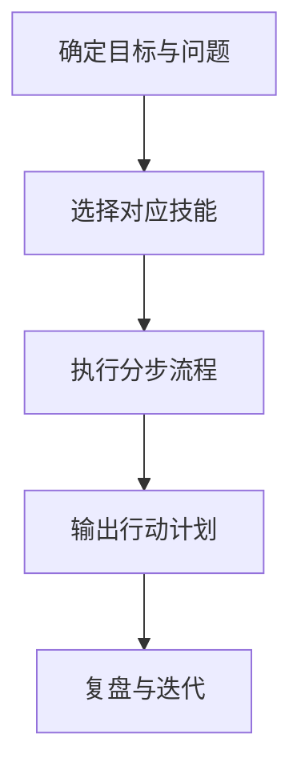

# SEO 技能清单（marketingskills）

本文件夹收录来自 marketingskills 的 SEO 相关技能中文拆解版，包含触发意图、结构解读、适用场景与分步使用方法。

## 技能分类

### 核心 SEO

1. seo-audit
2. programmatic-seo
3. schema-markup
4. competitor-alternatives
5. free-tool-strategy

### SEO 相关（非主技能）

6. marketing-ideas
7. marketing-psychology
8. popup-cro
9. copywriting

## 快速使用

> [!tip] 快速定位
> - 技术与站内诊断：`seo-audit.skill.md`
> - 批量页面策略：`programmatic-seo.skill.md`
> - 结构化数据：`schema-markup.skill.md`
> - 竞品对比页：`competitor-alternatives.skill.md`
> - 免费工具获链路：`free-tool-strategy.skill.md`

## 流程概览

