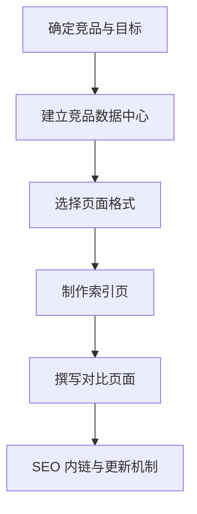

# competitor-alternatives

来源: /Users/wzb/obsidian/marketingskills/skills/competitor-alternatives/SKILL.md

## 技能触发（prompt 意图）

- 竞品对比页或替代页: “vs page”、“alternative page”、“X vs Y”、“X alternative”。

## 一句话范围

创建可排名且可转化的竞品对比页面，强调诚实、深入与结构化。

## 流程概览

## Prompt 结构深度解读

1. 初始评估
   - 了解自身产品、竞争格局与目标。
2. 核心原则
   - 诚实对比、深入解释、帮助决策、模块化数据。
3. 页面格式（4 类）
   - 竞品替代（单数）
   - 竞品替代（复数）
   - 你 vs 竞品
   - 竞品 A vs 竞品 B
4. 索引页
   - 作为对比内容的 hub 页，提升 SEO 发现。
5. 内容架构
   - 集中维护竞品数据，复用到所有页面。
6. 章节模板
   - TL;DR、段落对比、功能、定价、支持、适用人群、迁移、口碑。
7. 研究流程
   - 试用、价格验证、评论挖掘、客户访谈。
8. SEO 考量
   - 关键词意图、内链、FAQ schema。
9. 输出格式
   - 竞品数据文件 + 页面内容 + 页面规划。

> [!tip] 适用场景
> - “我们要做 Notion alternative 页面。”
> - “需要 /vs/ 竞品对比页。”
> - “构建比较页索引页以获取 SEO 流量。”

## 使用方式（分步）

1. 确定竞品与目标
   - 选出 3-5 个竞品并按搜索需求排序。
2. 建立竞品数据中心
   - 统一维护价格、功能、优缺点。
3. 选择页面格式
   - 明确 4 类格式中的优先级。
4. 先做索引页
   - 创建 hub 页，形成内链枢纽。
5. 按模板写内容
   - TL;DR、分维度对比、定价、支持、迁移、口碑。
6. 应用 SEO 策略
   - 关键词意图、内链、FAQ schema。
7. 维护机制
   - 季度检查价格，年度全面更新。

## 输出期望

- 竞品数据文件（YAML）。
- 完整页面内容（含 meta、表格、CTA）。
- 页面优先级规划清单。

## 常见误区

- 夸大/误导对比。
- 只做表格无解释。
- 缺乏更新流程。

## 适合搭配的技能

- programmatic-seo: 批量扩展对比页。
- seo-audit: 上线后优化。
- schema-markup: FAQ 或对比 schema。
