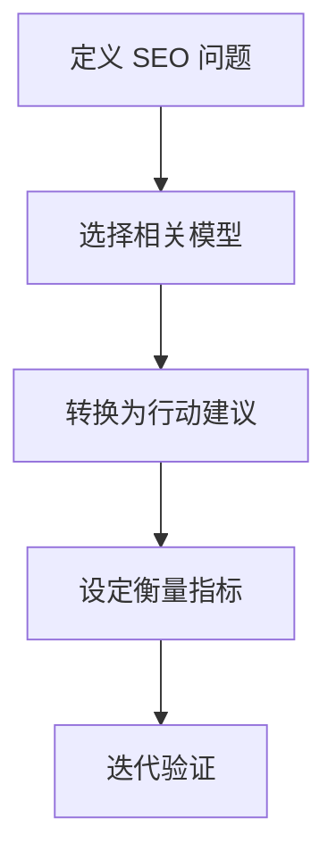

# marketing-psychology

来源: /Users/wzb/obsidian/marketingskills/skills/marketing-psychology/SKILL.md

## 技能触发（prompt 意图）

- 用户希望用心理学、心智模型或行为科学解释营销与决策。

## 一句话范围

用心智模型指导营销决策，并映射到 SEO 的长期增长与复利。

## 流程概览

## Prompt 结构深度解读

1. 使用方式
   - 选模型、解释心理机制、落地营销应用、确保合规与伦理。
2. 模型库
   - 基础思考、购买心理、说服、定价、设计、增长扩张。
3. 快速参考
   - 典型问题与对应模型。
4. 追问清单
   - 明确目标行为、旅程阶段与阻碍。
5. 相关技能
   - page-cro、copywriting、popup-cro、ab-test-setup。

> [!tip] 适用场景
> - “SEO 增长停滞，该从哪里下手？”
> - “如何理解内容增长的复利效应？”
> - “哪些心智模型适合有机增长？”

## 使用方式（分步）

1. 定义 SEO 问题
   - 例如流量平台期、内容扩张、转化下降。
2. 选择合适模型
   - 约束理论、80/20、反馈循环、复利。
3. 转化为行动
   - 找瓶颈、聚焦高杠杆页面、构建闭环。
4. 伦理执行
   - 避免操控性做法，优先用户价值。
5. 衡量与迭代
   - 以指标验证假设，必要时做实验。

## 输出期望

- 3-5 个模型与 SEO 问题的一一映射。
- 清晰的行动建议与可衡量的下一步。

## 常见误区

- 把模型当口号，不做诊断。
- 只优化局部指标，忽视真实瓶颈。

## 适合搭配的技能

- seo-audit: 定位具体技术瓶颈。
- programmatic-seo: 循环验证后再规模化。
- analytics-tracking: 衡量复利效应。
