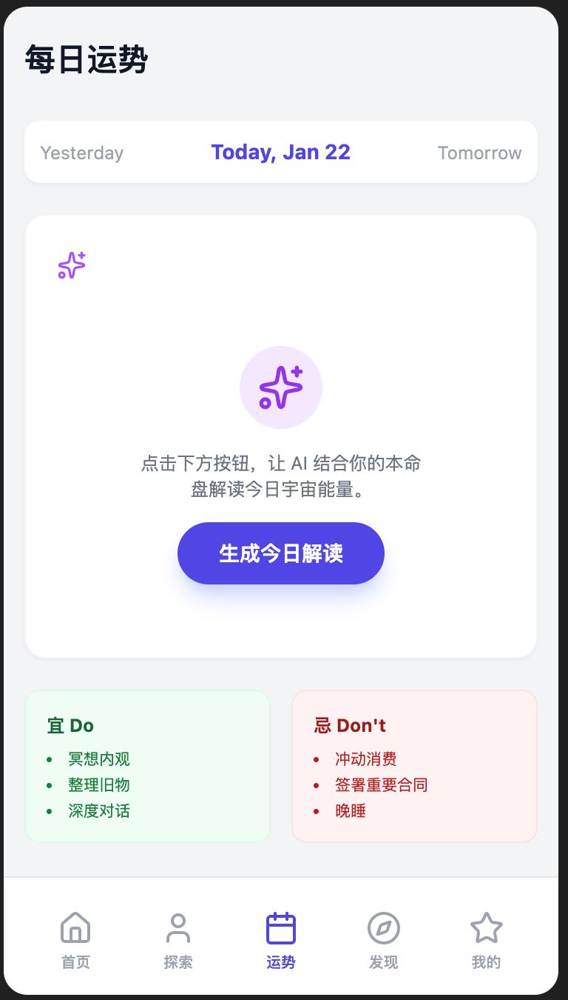
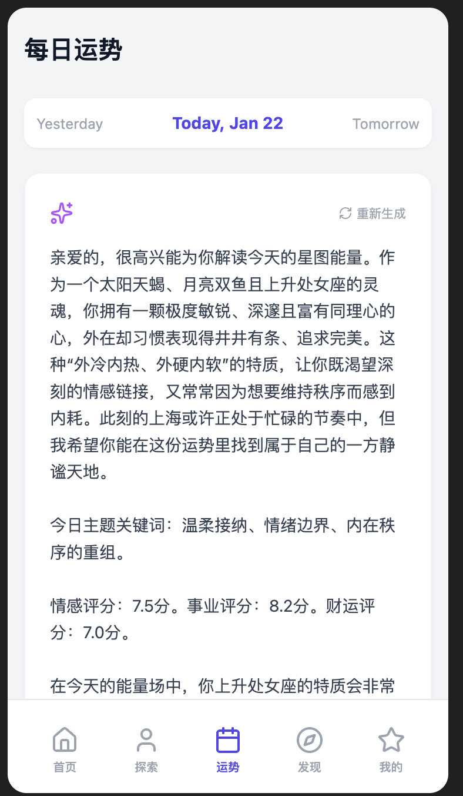

1. 思路一
	1. copy一份项目，然后通过Claude生成一份修改意见prd，然后构筑plan
	2. 通过GLM 4.7 ultrawork构筑，持续1天
	3. 完成项目很一般，尤其在界面交互方面非常差
2. 思路二
	1. 使用Claude根据oracle生成一份完整的prd
	```
	    AstroMind 心理占星 - 微信小程序版 PRD 文档                                    
                                                                                
  文档信息                                                                      
  ┌──────────┬────────────────────────┐                                         
  │   项目   │          内容          │                                         
  ├──────────┼────────────────────────┤                                         
  │ 产品名称 │ 星智 AstroMind（暂定） │                                         
  ├──────────┼────────────────────────┤                                         
  │ 版本     │ V1.0                   │                                         
  ├──────────┼────────────────────────┤                                         
  │ 目标平台 │ 微信小程序             │                                         
  ├──────────┼────────────────────────┤                                         
  │ 目标市场 │ 中国大陆               │                                         
  ├──────────┼────────────────────────┤                                         
  │ 基于项目 │ Oracle (Astromind AI)  │                                         
  ├──────────┼────────────────────────┤                                         
  │ 文档日期 │ 2026-01-22             │                                         
  └──────────┴────────────────────────┘                                         
  ---                                                                           
  一、产品概述                                                                  
                                                                                
  1.1 产品定位                                                                  
                                                                                
  星智 AstroMind 是一款基于心理占星学的智能分析小程序，结合 AI                  
  技术为用户提供个性化的本命盘解读、每日运势、双人合盘、占星问答等服务。产品融合
  认知行为疗法（CBT）理念，帮助用户进行自我探索与情绪管理。                     
                                                                                
  1.2 目标用户                                                                  
  用户群体: 占星爱好者                                                          
  特征: 18-35岁，女性为主，对星座文化感兴趣                                     
  核心需求: 深度本命盘解读、专业占星知识                                        
  ────────────────────────────────────────                                      
  用户群体: 情感咨询者                                                          
  特征: 有情感困惑，希望了解关系匹配度                                          
  核心需求: 双人合盘、关系分析                                                  
  ────────────────────────────────────────                                      
  用户群体: 自我探索者                                                          
  特征: 关注心理健康，追求个人成长                                              
  核心需求: 心理维度分析、CBT日记                                               
  ────────────────────────────────────────                                      
  用户群体: 日常运势用户                                                        
  特征: 轻度用户，每日查看运势                                                  
  核心需求: 简洁的每日运势推送                                                  
  1.3 核心价值主张                                                              
                                                                                
  1. 专业性 - 基于瑞士星历库（Swiss Ephemeris）的精准占星计算                   
  2. 智能化 - AI 驱动的个性化解读，非模板化内容                                 
  3. 心理学融合 - 结合荣格心理学与 CBT 认知行为疗法                             
  4. 本土化 - 针对中国用户的语言习惯与文化适配                                  
                                                                                
  ---                                                                           
  二、功能架构                                                                  
                                                                                
  2.1 功能模块总览                                                              
                                                                                
  星智 AstroMind                                                                
  ├── 首页 Tab                                                                  
  │   ├── 今日运势卡片                                                          
  │   ├── 快捷入口（本命盘/合盘/问答）                                          
  │   └── 推荐内容                                                              
  │                                                                             
  ├── 探索自我 Tab                                                              
  │   ├── 本命盘总览                                                            
  │   ├── 核心画像（太阳/月亮/上升）                                            
  │   ├── 心理维度（12维度雷达图）                                              
  │   ├── 人生课题                                                              
  │   └── 技术附录（行星/相位/宫位表）                                          
  │                                                                             
  ├── 每日运势 Tab                                                              
  │   ├── 今日剧本                                                              
  │   ├── 行运星象详情                                                          
  │   ├── 宜忌建议                                                              
  │   └── 历史运势回顾                                                          
  │                                                                             
  ├── 发现 Tab                                                                  
  │   ├── 双人合盘                                                              
  │   ├── 星象问答                                                              
  │   ├── 心理占星百科                                                          
  │   ├── CBT 情绪日记                                                          
  │   └── Synthetica 工具                                                       
  │                                                                             
  └── 我的 Tab                                                                  
      ├── 用户档案管理                                                          
      ├── 订阅与积分                                                            
      ├── 我的报告                                                              
      ├── 设置                                                                  
      └── 关于与帮助                                                            
                                                                                
  2.2 功能优先级矩阵                                                            
  ┌─────────────────┬────────┬─────┬──────┬──────┐                              
  │    功能模块     │ 优先级 │ MVP │ V1.1 │ V1.2 │                              
  ├─────────────────┼────────┼─────┼──────┼──────┤                              
  │ 本命盘解读      │ P0     │ ✅  │ -    │ -    │                              
  ├─────────────────┼────────┼─────┼──────┼──────┤                              
  │ 每日运势        │ P0     │ ✅  │ -    │ -    │                              
  ├─────────────────┼────────┼─────┼──────┼──────┤                              
  │ 用户认证        │ P0     │ ✅  │ -    │ -    │                              
  ├─────────────────┼────────┼─────┼──────┼──────┤                              
  │ 微信支付        │ P0     │ ✅  │ -    │ -    │                              
  ├─────────────────┼────────┼─────┼──────┼──────┤                              
  │ 双人合盘        │ P1     │ ✅  │ -    │ -    │                              
  ├─────────────────┼────────┼─────┼──────┼──────┤                              
  │ 星象问答        │ P1     │ ✅  │ -    │ -    │                              
  ├─────────────────┼────────┼─────┼──────┼──────┤                              
  │ 心理占星百科    │ P1     │ ✅  │ -    │ -    │                              
  ├─────────────────┼────────┼─────┼──────┼──────┤                              
  │ CBT 情绪日记    │ P2     │ -   │ ✅   │ -    │                              
  ├─────────────────┼────────┼─────┼──────┼──────┤                              
  │ Synthetica 工具 │ P2     │ -   │ ✅   │ -    │                              
  ├─────────────────┼────────┼─────┼──────┼──────┤                              
  │ 社交分享        │ P2     │ -   │ ✅   │ -    │                              
  ├─────────────────┼────────┼─────┼──────┼──────┤                              
  │ 运势推送        │ P2     │ -   │ -    │ ✅   │                              
  ├─────────────────┼────────┼─────┼──────┼──────┤                              
  │ 小程序订阅消息  │ P3     │ -   │ -    │ ✅   │                              
  └─────────────────┴────────┴─────┴──────┴──────┘                              
  ---                                                                           
  三、详细功能规格                                                              
                                                                                
  3.1 用户认证模块                                                              
                                                                                
  3.1.1 登录方式                                                                
  ┌──────────────┬────────────────────────────────┬────────┐                    
  │   登录方式   │              说明              │ 优先级 │                    
  ├──────────────┼────────────────────────────────┼────────┤                    
  │ 微信授权登录 │ 一键获取微信头像、昵称、openid │ P0     │                    
  ├──────────────┼────────────────────────────────┼────────┤                    
  │ 手机号登录   │ 微信手机号快捷登录组件         │ P1     │                    
  ├──────────────┼────────────────────────────────┼────────┤                    
  │ 游客模式     │ 限制功能，引导注册             │ P0     │                    
  └──────────────┴────────────────────────────────┴────────┘                    
  3.1.2 用户数据模型                                                            
                                                                                
  interface WechatUser {                                                        
    id: string;                    // 用户唯一ID                                
    openid: string;                // 微信 openid                               
    unionid?: string;              // 微信 unionid（多平台打通）                
    nickname: string;              // 昵称                                      
    avatar: string;                // 头像URL                                   
    phone?: string;                // 手机号（可选）                            
                                                                                
    // 出生档案                                                                 
    birthProfile: {                                                             
      birthDate: string;           // 出生日期 YYYY-MM-DD                       
      birthTime?: string;          // 出生时间 HH:mm（可选）                    
      birthCity: string;           // 出生城市                                  
      province?: string;           // 省份                                      
      lat: number;                 // 纬度                                      
      lon: number;                 // 经度                                      
      timezone: string;            // 时区                                      
      accuracyLevel: 'exact' | 'time_unknown' | 'approximate';                  
    };                                                                          
                                                                                
    // 偏好设置                                                                 
    preferences: {                                                              
      language: 'zh-CN';           // 固定中文                                  
      notifications: boolean;      // 是否接收通知                              
      theme: 'light' | 'dark' | 'auto';                                         
    };                                                                          
                                                                                
    // 账户状态                                                                 
    trialEndsAt?: string;          // 试用期结束时间                            
    createdAt: string;                                                          
    updatedAt: string;                                                          
  }                                                                             
                                                                                
  3.1.3 登录流程                                                                
                                                                                
  用户打开小程序                                                                
      ↓                                                                         
  检查本地登录态（wx.checkSession）                                             
      ↓                                                                         
  [有效] → 静默登录 → 进入首页                                                  
  [无效] → 显示登录引导页                                                       
      ↓                                                                         
  用户点击「微信登录」                                                          
      ↓                                                                         
  wx.login() 获取 code                                                          
      ↓                                                                         
  调用后端 /api/auth/wechat                                                     
      ↓                                                                         
  后端换取 openid/session_key                                                   
      ↓                                                                         
  创建/更新用户 → 返回 token                                                    
      ↓                                                                         
  前端存储 token → 进入首页                                                     
                                                                                
  ---                                                                           
  3.2 本命盘解读模块                                                            
                                                                                
  3.2.1 功能描述                                                                
                                                                                
  基于用户出生信息，计算完整本命盘并提供 AI 驱动的个性化解读。                  
                                                                                
  3.2.2 子功能列表                                                              
  ┌────────────┬────────────────────────────┬──────────────────────────┐        
  │   子功能   │            描述            │           权限           │        
  ├────────────┼────────────────────────────┼──────────────────────────┤        
  │ 本命盘总览 │ 星盘可视化 + 核心特质概述  │ 免费                     │        
  ├────────────┼────────────────────────────┼──────────────────────────┤        
  │ 核心画像   │ 太阳/月亮/上升三大核心解读 │ 免费                     │        
  ├────────────┼────────────────────────────┼──────────────────────────┤        
  │ 心理维度   │ 12维度雷达图 + 详细解读    │ 部分免费，深度解锁需付费 │        
  ├────────────┼────────────────────────────┼──────────────────────────┤        
  │ 人生课题   │ 北交点/南交点/凯龙星解读   │ 付费                     │        
  ├────────────┼────────────────────────────┼──────────────────────────┤        
  │ 行星详解   │ 10大行星逐一解读           │ 部分免费                 │        
  ├────────────┼────────────────────────────┼──────────────────────────┤        
  │ 相位分析   │ 主要相位关系解读           │ 付费                     │        
  ├────────────┼────────────────────────────┼──────────────────────────┤        
  │ 宫位分析   │ 12宫位详细解读             │ 付费                     │        
  ├────────────┼────────────────────────────┼──────────────────────────┤        
  │ 技术附录   │ 行星表/相位表/宫位表       │ 免费                     │        
  └────────────┴────────────────────────────┴──────────────────────────┘        
  3.2.3 出生信息录入                                                            
                                                                                
  必填字段：                                                                    
  - 出生日期（年/月/日选择器）                                                  
  - 出生城市（城市搜索选择器，支持拼音/汉字）                                   
                                                                                
  选填字段：                                                                    
  - 出生时间（时/分选择器）                                                     
  - 时间精确度（精确/大概/不知道）                                              
                                                                                
  城市选择器规格：                                                              
  interface CitySearchResult {                                                  
    name: string;           // 城市名（中文）                                   
    province: string;       // 省份                                             
    lat: number;            // 纬度                                             
    lon: number;            // 经度                                             
    timezone: string;       // 时区（中国统一 Asia/Shanghai）                   
  }                                                                             
                                                                                
  // 搜索接口                                                                   
  GET /api/geo/search?q={keyword}&country=CN                                    
                                                                                
  3.2.4 星盘可视化                                                              
                                                                                
  展示元素：                                                                    
  - 12星座环（外圈）                                                            
  - 12宫位环（内圈）                                                            
  - 行星符号与度数                                                              
  - 相位连线（主要相位）                                                        
  - 上升点/天顶标记                                                             
                                                                                
  交互：                                                                        
  - 点击行星 → 弹出行星详情卡片                                                 
  - 点击相位线 → 弹出相位解读                                                   
  - 双指缩放查看细节                                                            
                                                                                
  3.2.5 心理维度雷达图                                                          
                                                                                
  12个维度：                                                                    
  ┌──────────┬────────────────┬──────────────────┐                              
  │   维度   │      英文      │     计算依据     │                              
  ├──────────┼────────────────┼──────────────────┤                              
  │ 自我认同 │ Identity       │ 太阳、第一宫     │                              
  ├──────────┼────────────────┼──────────────────┤                              
  │ 情感需求 │ Emotional      │ 月亮、第四宫     │                              
  ├──────────┼────────────────┼──────────────────┤                              
  │ 沟通表达 │ Communication  │ 水星、第三宫     │                              
  ├──────────┼────────────────┼──────────────────┤                              
  │ 爱与关系 │ Love           │ 金星、第七宫     │                              
  ├──────────┼────────────────┼──────────────────┤                              
  │ 行动力   │ Action         │ 火星、第一宫     │                              
  ├──────────┼────────────────┼──────────────────┤                              
  │ 扩展成长 │ Growth         │ 木星、第九宫     │                              
  ├──────────┼────────────────┼──────────────────┤                              
  │ 责任边界 │ Responsibility │ 土星、第十宫     │                              
  ├──────────┼────────────────┼──────────────────┤                              
  │ 创新突破 │ Innovation     │ 天王星、第十一宫 │                              
  ├──────────┼────────────────┼──────────────────┤                              
  │ 直觉灵性 │ Intuition      │ 海王星、第十二宫 │                              
  ├──────────┼────────────────┼──────────────────┤                              
  │ 转化重生 │ Transformation │ 冥王星、第八宫   │                              
  ├──────────┼────────────────┼──────────────────┤                              
  │ 疗愈课题 │ Healing        │ 凯龙星           │                              
  ├──────────┼────────────────┼──────────────────┤                              
  │ 命运方向 │ Destiny        │ 北交点           │                              
  └──────────┴────────────────┴──────────────────┘                              
  权限控制：                                                                    
  - 免费用户：查看雷达图 + 2个维度详解                                          
  - 付费用户：全部12个维度详解                                                  
                                                                                
  ---                                                                           
  3.3 每日运势模块                                                              
                                                                                
  3.3.1 功能描述                                                                
                                                                                
  基于用户本命盘与当日行运，生成个性化每日运势。                                
                                                                                
  3.3.2 子功能列表                                                              
  ┌──────────┬──────────────────────────┬──────┐                                
  │  子功能  │           描述           │ 权限 │                                
  ├──────────┼──────────────────────────┼──────┤                                
  │ 运势概览 │ 今日整体运势评分与关键词 │ 免费 │                                
  ├──────────┼──────────────────────────┼──────┤                                
  │ 今日剧本 │ AI 生成的今日故事化描述  │ 付费 │                                
  ├──────────┼──────────────────────────┼──────┤                                
  │ 行运详情 │ 当日重要行运相位解读     │ 付费 │                                
  ├──────────┼──────────────────────────┼──────┤                                
  │ 宜忌建议 │ 今日适宜/不宜事项        │ 免费 │                                
  ├──────────┼──────────────────────────┼──────┤                                
  │ 幸运元素 │ 幸运颜色/数字/方位       │ 免费 │                                
  ├──────────┼──────────────────────────┼──────┤                                
  │ 历史回顾 │ 过去7天运势记录          │ 免费 │                                
  └──────────┴──────────────────────────┴──────┘                                
  3.3.3 运势数据结构                                                            
                                                                                
  interface DailyForecast {                                                     
    date: string;                    // 日期                                    
    overallScore: number;            // 整体评分 1-100                          
                                                                                
    // 分项评分                                                                 
    scores: {                                                                   
      love: number;                  // 爱情运                                  
      career: number;                // 事业运                                  
      wealth: number;                // 财运                                    
      health: number;                // 健康运                                  
    };                                                                          
                                                                                
    // 关键词标签                                                               
    keywords: string[];              // 如：["突破", "机遇", "谨慎"]            
                                                                                
    // 今日剧本（付费）                                                         
    script?: {                                                                  
      title: string;                                                            
      content: string;                                                          
    };                                                                          
                                                                                
    // 行运详情（付费）                                                         
    transits?: TransitDetail[];                                                 
                                                                                
    // 宜忌                                                                     
    suggestions: {                                                              
      do: string[];                  // 宜                                      
      dont: string[];                // 忌                                      
    };                                                                          
                                                                                
    // 幸运元素                                                                 
    lucky: {                                                                    
      color: string;                                                            
      number: number;                                                           
      direction: string;                                                        
    };                                                                          
  }                                                                             
                                                                                
  3.3.4 运势推送（V1.2）                                                        
                                                                                
  推送时机：                                                                    
  - 每日早8点推送当日运势摘要                                                   
  - 重要星象日额外提醒                                                          
                                                                                
  推送方式：                                                                    
  - 微信订阅消息（需用户授权）                                                  
  - 小程序服务通知                                                              
                                                                                
  ---                                                                           
  3.4 双人合盘模块                                                              
                                                                                
  3.4.1 功能描述                                                                
                                                                                
  分析两人星盘的相互关系，提供关系匹配度与相处建议。                            
                                                                                
  3.4.2 合盘类型                                                                
  ┌────────┬───────────┬──────────────────────┐                                 
  │  类型  │   英文    │         描述         │                                 
  ├────────┼───────────┼──────────────────────┤                                 
  │ 比较盘 │ Synastry  │ 两人行星相互相位分析 │                                 
  ├────────┼───────────┼──────────────────────┤                                 
  │ 组合盘 │ Composite │ 两人中点合成的关系盘 │                                 
  ├────────┼───────────┼──────────────────────┤                                 
  │ 时空盘 │ Davison   │ 两人出生时空中点盘   │                                 
  └────────┴───────────┴──────────────────────┘                                 
  3.4.3 分析维度                                                                
  ┌────────────┬──────────────────┬──────┐                                      
  │    维度    │       描述       │ 权重 │                                      
  ├────────────┼──────────────────┼──────┤                                      
  │ 整体契合度 │ 综合匹配评分     │ -    │                                      
  ├────────────┼──────────────────┼──────┤                                      
  │ 情感连接   │ 月亮、金星相位   │ 25%  │                                      
  ├────────────┼──────────────────┼──────┤                                      
  │ 沟通理解   │ 水星相位         │ 20%  │                                      
  ├────────────┼──────────────────┼──────┤                                      
  │ 激情吸引   │ 火星、冥王星相位 │ 20%  │                                      
  ├────────────┼──────────────────┼──────┤                                      
  │ 长期稳定   │ 土星相位         │ 20%  │                                      
  ├────────────┼──────────────────┼──────┤                                      
  │ 成长支持   │ 木星、北交点相位 │ 15%  │                                      
  └────────────┴──────────────────┴──────┘                                      
  3.4.4 档案管理                                                                
                                                                                
  interface SynastryProfile {                                                   
    id: string;                                                                 
    name: string;                    // 对方昵称                                
    relationship: RelationType;      // 关系类型                                
    birthProfile: BirthProfile;      // 出生信息                                
    createdAt: string;                                                          
  }                                                                             
                                                                                
  type RelationType =                                                           
    | 'romantic'      // 恋人                                                   
    | 'spouse'        // 配偶                                                   
    | 'friend'        // 朋友                                                   
    | 'family'        // 家人                                                   
    | 'colleague'     // 同事                                                   
    | 'other';        // 其他                                                   
                                                                                
  3.4.5 权限与定价                                                              
  ┌──────────┬─────────────┬──────────────┐                                     
  │ 用户类型 │  免费额度   │   付费价格   │                                     
  ├──────────┼─────────────┼──────────────┤                                     
  │ 游客     │ 0次         │ -            │                                     
  ├──────────┼─────────────┼──────────────┤                                     
  │ 注册用户 │ 3次（永久） │ 30积分/次    │                                     
  ├──────────┼─────────────┼──────────────┤                                     
  │ 订阅用户 │ 每周2次     │ 包含在订阅内 │                                     
  └──────────┴─────────────┴──────────────┘                                     
  ---                                                                           
  3.5 星象问答模块                                                              
                                                                                
  3.5.1 功能描述                                                                
                                                                                
  用户输入占星相关问题，AI 结合用户本命盘给出个性化解答。                       
                                                                                
  3.5.2 问题分类                                                                
  ┌──────────┬────────────────────────┐                                         
  │   分类   │        示例问题        │                                         
  ├──────────┼────────────────────────┤                                         
  │ 性格特质 │ 我为什么总是容易焦虑？ │                                         
  ├──────────┼────────────────────────┤                                         
  │ 感情关系 │ 我适合什么类型的伴侣？ │                                         
  ├──────────┼────────────────────────┤                                         
  │ 事业发展 │ 我适合创业还是打工？   │                                         
  ├──────────┼────────────────────────┤                                         
  │ 时机选择 │ 最近适合跳槽吗？       │                                         
  ├──────────┼────────────────────────┤                                         
  │ 人际关系 │ 如何改善和父母的关系？ │                                         
  ├──────────┼────────────────────────┤                                         
  │ 自我成长 │ 我的人生课题是什么？   │                                         
  └──────────┴────────────────────────┘                                         
  3.5.3 问答流程                                                                
                                                                                
  用户输入问题                                                                  
      ↓                                                                         
  选择问题分类（可选）                                                          
      ↓                                                                         
  权限检查                                                                      
      ↓                                                                         
  [无权限] → 弹出付费引导                                                       
  [有权限] → 继续                                                               
      ↓                                                                         
  后端处理：                                                                    
    1. 获取用户本命盘                                                           
    2. 计算当前行运（如涉及时机）                                               
    3. 构建 Prompt                                                              
    4. 调用 AI 生成回答                                                         
      ↓                                                                         
  返回答案 + 相关星盘数据                                                       
      ↓                                                                         
  展示答案 + 可视化辅助                                                         
                                                                                
  3.5.4 权限与定价                                                              
  ┌──────────┬──────────┬──────────────┐                                        
  │ 用户类型 │ 免费额度 │   付费价格   │                                        
  ├──────────┼──────────┼──────────────┤                                        
  │ 游客     │ 0次      │ -            │                                        
  ├──────────┼──────────┼──────────────┤                                        
  │ 注册用户 │ 每周2次  │ 20积分/次    │                                        
  ├──────────┼──────────┼──────────────┤                                        
  │ 订阅用户 │ 每周5次  │ 包含在订阅内 │                                        
  └──────────┴──────────┴──────────────┘                                        
  ---                                                                           
  3.6 心理占星百科模块                                                          
                                                                                
  3.6.1 功能描述                                                                
                                                                                
  提供系统化的心理占星知识库，包括行星、星座、宫位、相位等基础概念，以及经典占星
  书籍解读。                                                                    
                                                                                
  3.6.2 内容分类                                                                
  ┌──────────┬───────────┬────────────────┐                                     
  │   分类   │   英文    │ 条目数（预估） │                                     
  ├──────────┼───────────┼────────────────┤                                     
  │ 行星     │ Planets   │ 10+            │                                     
  ├──────────┼───────────┼────────────────┤                                     
  │ 星座     │ Signs     │ 12             │                                     
  ├──────────┼───────────┼────────────────┤                                     
  │ 宫位     │ Houses    │ 12             │                                     
  ├──────────┼───────────┼────────────────┤                                     
  │ 相位     │ Aspects   │ 10+            │                                     
  ├──────────┼───────────┼────────────────┤                                     
  │ 概念     │ Concepts  │ 50+            │                                     
  ├──────────┼───────────┼────────────────┤                                     
  │ 小行星   │ Asteroids │ 10+            │                                     
  ├──────────┼───────────┼────────────────┤                                     
  │ 敏感点   │ Angles    │ 4              │                                     
  ├──────────┼───────────┼────────────────┤                                     
  │ 特殊点   │ Points    │ 5+             │                                     
  ├──────────┼───────────┼────────────────┤                                     
  │ 经典书籍 │ Classics  │ 10+            │                                     
  └──────────┴───────────┴────────────────┘                                     
  3.6.3 内容结构                                                                
                                                                                
  interface WikiItem {                                                          
    id: string;                                                                 
    type: WikiItemType;                                                         
    title: string;                   // 标题                                    
    subtitle?: string;               // 副标题                                  
    symbol?: string;                 // 符号                                    
    keywords: string[];              // 关键词                                  
    summary: string;                 // 摘要                                    
    content: string;                 // 正文（Markdown）                        
    relatedItems: string[];          // 相关条目ID                              
                                                                                
    // 元数据                                                                   
    difficulty: 'beginner' | 'intermediate' | 'advanced';                       
    readTime: number;                // 阅读时长（分钟）                        
    viewCount: number;               // 浏览量                                  
  }                                                                             
                                                                                
  interface WikiClassic {                                                       
    id: string;                                                                 
    title: string;                   // 书名                                    
    author: string;                  // 作者                                    
    coverImage: string;              // 封面图                                  
    introduction: string;            // 简介                                    
    chapters: WikiChapter[];         // 章节列表                                
    tags: string[];                                                             
  }                                                                             
                                                                                
  3.6.4 搜索功能                                                                
                                                                                
  - 支持标题、关键词、正文全文搜索                                              
  - 支持按分类筛选                                                              
  - 支持按难度筛选                                                              
  - 搜索结果高亮显示                                                            
                                                                                
  ---                                                                           
  3.7 CBT 情绪日记模块（V1.1）                                                  
                                                                                
  3.7.1 功能描述                                                                
                                                                                
  基于认知行为疗法（CBT）的情绪记录与分析工具，帮助用户识别和调整负面思维模式。 
                                                                                
  3.7.2 日记流程（6步工作表）                                                   
  ┌──────┬──────────┬───────────────────────────────┐                           
  │ 步骤 │   名称   │             描述              │                           
  ├──────┼──────────┼───────────────────────────────┤                           
  │ 1    │ 情境描述 │ 记录触发情绪的具体事件        │                           
  ├──────┼──────────┼───────────────────────────────┤                           
  │ 2    │ 情绪识别 │ 选择情绪类型并评估强度(1-100) │                           
  ├──────┼──────────┼───────────────────────────────┤                           
  │ 3    │ 自动思维 │ 记录脑海中自动浮现的想法      │                           
  ├──────┼──────────┼───────────────────────────────┤                           
  │ 4    │ 核心思维 │ 识别最困扰的那个想法          │                           
  ├──────┼──────────┼───────────────────────────────┤                           
  │ 5    │ 证据收集 │ 列出支持和反对该想法的证据    │                           
  ├──────┼──────────┼───────────────────────────────┤                           
  │ 6    │ 平衡思维 │ 形成更平衡、理性的新想法      │                           
  └──────┴──────────┴───────────────────────────────┘                           
  3.7.3 情绪类型                                                                
                                                                                
  const MOOD_CATEGORIES = {                                                     
    negative: [                                                                 
      { id: 'anxious', name: '焦虑', emoji: '😰' },                             
      { id: 'sad', name: '悲伤', emoji: '😢' },                                 
      { id: 'angry', name: '愤怒', emoji: '😠' },                               
      { id: 'frustrated', name: '沮丧', emoji: '😤' },                          
      { id: 'guilty', name: '内疚', emoji: '😔' },                              
      { id: 'ashamed', name: '羞耻', emoji: '😳' },                             
      { id: 'lonely', name: '孤独', emoji: '🥺' },                              
      { id: 'hopeless', name: '绝望', emoji: '😞' },                            
    ],                                                                          
    positive: [                                                                 
      { id: 'happy', name: '快乐', emoji: '😊' },                               
      { id: 'calm', name: '平静', emoji: '😌' },                                
      { id: 'grateful', name: '感恩', emoji: '🙏' },                            
      { id: 'confident', name: '自信', emoji: '💪' },                           
      { id: 'hopeful', name: '希望', emoji: '🌟' },                             
    ]                                                                           
  };                                                                            
                                                                                
  3.7.4 AI 分析功能                                                             
                                                                                
  - 结合用户本命盘特质分析情绪模式                                              
  - 识别认知扭曲类型                                                            
  - 提供个性化的应对建议                                                        
  - 月度情绪趋势报告（付费）                                                    
                                                                                
  3.7.5 数据存储                                                                
                                                                                
  interface CBTRecord {                                                         
    id: string;                                                                 
    userId: string;                                                             
    timestamp: number;                                                          
                                                                                
    // 6步内容                                                                  
    situation: string;                                                          
    moods: Array<{                                                              
      id: string;                                                               
      name: string;                                                             
      initialIntensity: number;      // 初始强度                                
      finalIntensity?: number;       // 完成后强度                              
    }>;                                                                         
    automaticThoughts: string[];                                                
    hotThought: string;                                                         
    evidenceFor: string[];                                                      
    evidenceAgainst: string[];                                                  
    balancedThoughts: Array<{                                                   
      text: string;                                                             
      belief: number;                // 相信程度 0-100                          
    }>;                                                                         
                                                                                
    // AI 分析结果                                                              
    analysis?: {                                                                
      cognitiveDistortions: string[];                                           
      astroInsights: string;                                                    
      suggestions: string[];                                                    
    };                                                                          
  }                                                                             
                                                                                
  ---                                                                           
  3.8 Synthetica 工具模块（V1.1）                                               
                                                                                
  3.8.1 功能描述                                                                
                                                                                
  行星+星座+宫位+相位的组合解读工具，用户可自由选择组合获取 AI 解读。           
                                                                                
  3.8.2 选择流程                                                                
                                                                                
  选择行星（必选）                                                              
      ↓                                                                         
  选择星座（必选）                                                              
      ↓                                                                         
  选择宫位（可选）                                                              
      ↓                                                                         
  选择上下文（必选）                                                            
      ↓                                                                         
  选择相位行星（可选）                                                          
      ↓                                                                         
  生成解读                                                                      
                                                                                
  3.8.3 上下文类型                                                              
  ┌──────────┬─────────┬──────────────────────┐                                 
  │  上下文  │  英文   │         描述         │                                 
  ├──────────┼─────────┼──────────────────────┤                                 
  │ 爱情关系 │ Love    │ 感情、婚姻、亲密关系 │                                 
  ├──────────┼─────────┼──────────────────────┤                                 
  │ 事业发展 │ Career  │ 工作、职业、成就     │                                 
  ├──────────┼─────────┼──────────────────────┤                                 
  │ 自我认知 │ Self    │ 性格、身份、自我表达 │                                 
  ├──────────┼─────────┼──────────────────────┤                                 
  │ 心灵疗愈 │ Healing │ 创伤、成长、转化     │                                 
  ├──────────┼─────────┼──────────────────────┤                                 
  │ 时机选择 │ Timing  │ 行运、周期、决策     │                                 
  ├──────────┼─────────┼──────────────────────┤                                 
  │ 人际社交 │ Social  │ 友谊、合作、社群     │                                 
  └──────────┴─────────┴──────────────────────┘                                 
  3.8.4 权限与定价                                                              
  ┌──────────┬──────────┬──────────────┐                                        
  │ 用户类型 │ 免费额度 │   付费价格   │                                        
  ├──────────┼──────────┼──────────────┤                                        
  │ 注册用户 │ 每天1次  │ 10积分/次    │                                        
  ├──────────┼──────────┼──────────────┤                                        
  │ 订阅用户 │ 每天3次  │ 包含在订阅内 │                                        
  └──────────┴──────────┴──────────────┘                                        
  ---                                                                           
  四、支付与权益系统                                                            
                                                                                
  4.1 支付方式                                                                  
  ┌──────────┬──────────────────────┬────────┐                                  
  │ 支付方式 │         说明         │ 优先级 │                                  
  ├──────────┼──────────────────────┼────────┤                                  
  │ 微信支付 │ 小程序内支付         │ P0     │                                  
  ├──────────┼──────────────────────┼────────┤                                  
  │ 苹果内购 │ iOS 虚拟商品（如需） │ P2     │                                  
  └──────────┴──────────────────────┴────────┘                                  
  4.2 商品类型                                                                  
                                                                                
  4.2.1 订阅方案                                                                
  ┌──────────┬─────────────────────┬───────────────────────┐                    
  │   方案   │        价格         │         权益          │                    
  ├──────────┼─────────────────────┼───────────────────────┤                    
  │ 月度订阅 │ ¥68/月              │ 全功能解锁 + 每周额度 │                    
  ├──────────┼─────────────────────┼───────────────────────┤                    
  │ 年度订阅 │ ¥548/年（¥45.7/月） │ 同上 + 节省20%        │                    
  ├──────────┼─────────────────────┼───────────────────────┤                    
  │ 连续包月 │ ¥58/月              │ 自动续费优惠          │                    
  └──────────┴─────────────────────┴───────────────────────┘                    
  4.2.2 订阅权益详情                                                            
                                                                                
  interface SubscriptionBenefits {                                              
    // 功能解锁                                                                 
    unlockAllDimensions: true;       // 全部心理维度                            
    unlockAllCoreThemes: true;       // 全部核心主题                            
    unlockDailyScript: true;         // 今日剧本                                
    unlockDailyTransit: true;        // 行运详情                                
    unlockCBTStats: true;            // CBT 统计                                
                                                                                
    // 使用额度                                                                 
    askWeekly: 5;                    // 问答每周5次                             
    synastryWeekly: 2;               // 合盘每周2次                             
    syntheticaDaily: 3;              // Synthetica每天3次                       
  }                                                                             
                                                                                
  4.2.3 积分包                                                                  
  ┌─────────┬──────┬────────────┐                                               
  │ 积分包  │ 价格 │    单价    │                                               
  ├─────────┼──────┼────────────┤                                               
  │ 50积分  │ ¥30  │ ¥0.6/积分  │                                               
  ├─────────┼──────┼────────────┤                                               
  │ 120积分 │ ¥68  │ ¥0.57/积分 │                                               
  ├─────────┼──────┼────────────┤                                               
  │ 300积分 │ ¥158 │ ¥0.53/积分 │                                               
  ├─────────┼──────┼────────────┤                                               
  │ 600积分 │ ¥298 │ ¥0.50/积分 │                                               
  └─────────┴──────┴────────────┘                                               
  4.2.4 单项购买                                                                
  ┌──────────────────────┬──────────┬────────────────┐                          
  │         功能         │ 积分消耗 │     有效期     │                          
  ├──────────────────────┼──────────┼────────────────┤                          
  │ 心理维度解锁（单个） │ 10积分   │ 永久           │                          
  ├──────────────────────┼──────────┼────────────────┤                          
  │ 核心主题解锁（单个） │ 10积分   │ 永久           │                          
  ├──────────────────────┼──────────┼────────────────┤                          
  │ 今日剧本             │ 10积分   │ 当日           │                          
  ├──────────────────────┼──────────┼────────────────┤                          
  │ 行运详情             │ 10积分   │ 当日           │                          
  ├──────────────────────┼──────────┼────────────────┤                          
  │ 合盘完整版           │ 30积分   │ 永久（该组合） │                          
  ├──────────────────────┼──────────┼────────────────┤                          
  │ 问答单次             │ 20积分   │ 单次           │                          
  ├──────────────────────┼──────────┼────────────────┤                          
  │ CBT月度统计          │ 20积分   │ 当月           │                          
  ├──────────────────────┼──────────┼────────────────┤                          
  │ Synthetica单次       │ 10积分   │ 单次           │                          
  └──────────────────────┴──────────┴────────────────┘                          
  4.3 权益数据模型                                                              
                                                                                
  interface UserEntitlements {                                                  
    // 基础状态                                                                 
    isSubscriber: boolean;                                                      
    subscriptionPlan?: 'monthly' | 'yearly';                                    
    subscriptionEndsAt?: string;                                                
    credits: number;                 // 积分余额                                
                                                                                
    // 问答额度                                                                 
    ask: {                                                                      
      freeLeft: number;              // 免费剩余                                
      subscriptionLeft: number;      // 订阅剩余                                
      purchasedLeft: number;         // 购买剩余                                
      resetAt: string;               // 重置时间                                
    };                                                                          
                                                                                
    // 合盘额度                                                                 
    synastry: {                                                                 
      freeLeft: number;                                                         
      subscriptionLeft: number;                                                 
      resetAt: string;                                                          
    };                                                                          
                                                                                
    // Synthetica 额度                                                          
    synthetica: {                                                               
      freeLeft: number;                                                         
      subscriptionLeft: number;                                                 
      purchasedLeft: number;                                                    
      resetAt: string;                                                          
    };                                                                          
                                                                                
    // 已购买功能                                                               
    purchasedFeatures: {                                                        
      dimensions: string[];          // 已解锁维度ID                            
      coreThemes: string[];          // 已解锁主题ID                            
      synastryHashes: string[];      // 已解锁合盘                    
	3. 使用aistudio生成初版界面，然后再进行细化
	4. 界面表现非常不错。后续细化内容
	


	5.细调界面的表现
