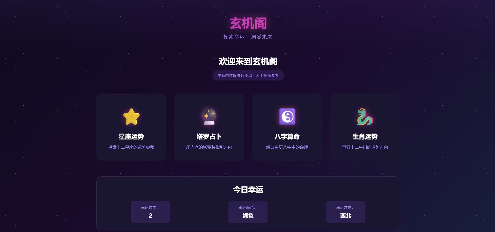

# 一个不会写代码的产品经理,用30天做出占星网站

凌晨两点,我盯着屏幕上刚生成的网站。

四个占卜网站。一句话。四分钟。$4美金。

我记得上个月还在想,要不要找个外包团队报个价,预算准备了小几万。

现在...一杯瑞幸的钱?

这个故事,要从一个月前说起。

---

## 序幕:那个"卧槽"的瞬间

说实话,点开Claude Code的时候,我心里是虚的。

产品经理嘛,代码水平约等于零。能看懂HTML标签什么意思就不错了,让我写?for循环都得百度。

但我还是试了一下。

我输入:"帮我做一个塔罗牌占卜网站。"

然后...它就开始自己写代码了。

HTML、CSS、JavaScript,一行一行往外蹦。我甚至来不及看清楚它在干什么,界面就出来了。

能点击,能用,还挺好看。

那个瞬间,我脑子里只有两个字:**卧槽。**

不是"哇好厉害"那种惊叹,是"这也太简单了吧"的震惊。

我后来算了一下,按这个速度,做个复杂点的网站,撑死几百块。

而老板上个月刚批了一个月薪两万多的HC让你招前端...

这心理落差,属实有点大。

但那个瞬间我也意识到一件事:**AI编程,可能真的不是噱头。**

---

## 一、关于AI编程,我学到的三个真相

### 1. AI不是魔法,它只是把"实现"变简单了

很多人(包括一个月前的我)对AI编程有个误解:
以为只要告诉AI你要什么,它就能完美地做出来。

**不是这样的。**

AI能帮你写代码,但它帮不了你想清楚:
- 你到底要做什么
- 核心功能是什么  
- 用户体验该怎么设计
- 哪些功能该先做,哪些该后做

> [!IMPORTANT] 核心观点
> **产品思维、用户理解、优先级判断,这些AI帮不了你。**
> 它只是把"我知道要做什么,但不知道怎么实现"这件事,变简单了。

### 2. 工具的天花板,就是你的天花板

我一开始用中转站版的Claude Code,想着"能用就行"。
结果浪费了至少两周时间。

满血版的Opus上线之后,我才发现:**很多我以为是"AI编程的极限",其实只是工具本身的极限。**

| 工具版本 | 表现 |
| :--- | :--- |
| **中转站Sonnet** | 上下文记忆短, 稳定性差, debug能力一般 |
| **满血Opus + Codex** | 能记住整个项目的逻辑, 稳定不降智, bug修复能力强 |

同样的需求,中转站可能要改10次,Opus改3次就搞定。
**省工具的钱,最后都变成了自己的时间成本。**

我现在的原则:**一开始就上最好的工具。** 别想着"先用免费的试试水",那只会让你怀疑AI编程到底行不行。

### 3. 第一版一定是屎山,接受这个事实

我第一次做的时候,想一次性做完美。结果一周后,代码乱成一团,改一个地方,三个地方报错。
最后全删了,从头来。

现在回头看,这是必经之路。
**没有人第一次就能做对。**

区别只在于:
- 接受这个事实,快速迭代
- 还是死磕完美,最后崩溃

我选前者。

---

## 二、我踩过的五个大坑

### 坑1:工具选择困难症

重新开始之后,我进入了一段"疯狂换工具"的时期。

- **Claude Code中转站**: 薛定谔的智商。
- **Gemini**: 最气人。自嗨式重构,完全不在一个频道。
- **AI Studio**: 生成前端UI快,但后端逻辑只会写TODO。

**转折点:** 狠心开了Claude Code Opus + Codex X-High。
用上之后我才明白什么叫工具差距:
- **上下文理解**: Opus能记住三天前写的API,Sonnet会问"API在哪?"
- **Debug能力**: Codex能精准定位bug。
- **稳定性**: 没有降智,没有自嗨,就是稳。

> [!TIP] 避坑指南
> **一开始就用最好的工具,别省钱。你浪费的时间比省的钱贵多了。**

### 坑2:性能优化,一个还没填完的大坑

代码能跑了,新问题来了:**AI生成内容太慢。**

- **第一版**: 用户点"生成",转圈30秒。
- **第二版**: 拆成小prompt。快了,但**风格不一致**。
- **第三版**: 两层架构。5秒+9秒=14秒,还是慢。
- **第四版**: 试了RAG。看脸,有时候反而更慢。
- **第五版(当前)**: **并行+渐进式加载**。前端先显示星盘图,内容一段段流式显示。

**这个坑,还在填。**

### 坑3:代码混乱,比代码量更恐怖

命名混乱、文件结构混乱。改个文案要找半天。

**解决办法:** 提前定好代码规范。
1. **命名**: 大驼峰组件,小驼峰函数
2. **结构**: 按功能模块分文件夹
3. **注释**: 每个文件开头必须说明用途

然后每次提醒AI:"按我之前的规范来。"

### 坑4:功能陷阱,什么都想做

当功能实现变简单,你会不自觉地堆功能。本命盘、运势、合盘、百科...
一个月下来,功能密密麻麻,重点全无。

> [!WARNING] 深度反思
> **功能多≠产品好。** 用户可能只用20%的功能,剩下80%都是我自嗨。
> **教训:克制,克制,再克制。**

### 坑5:支付,卡了半个月的天坑

支付不是接个API那么简单,涉及订单系统、会员权限、退款逻辑等。
AI能帮我写代码,但选哪个支付方案,它帮不了我。

---

## 三、如果重来,我会这么做

### 方法论1:工具选择
- **最佳组合**: Claude Code Opus + Codex X-High
- **辅助工具**: Google AI Studio(生成架构图)
- **核心逻辑**: **工具稳定性 > 功能丰富度**

### 方法论2:开发流程
- **提前定规范**: 命名、结构、注释。
- **先画架构图**: 知道全局再施工。
- **接受"推倒重来"**: 每次重写代码质量都会上台阶。

### 方法论3:产品思维
- **控制功能数量**: 只做3个核心功能(本命、运势、合盘)。
- **提前考虑性能**: 架构设计时就考虑Prompt拆分和并行。
- **商业决策靠自己**: 支付、定价、合规,这些AI帮不了你。

---

## 四、那些让我破防和振奋的瞬间

- **破防时刻**: Claude 陷入"我找到了!完美解决!"的报错死循环。
- **振奋时刻**: 老板试了测试网站说:"**好准啊!我对你很有信心!**"
  做产品最大的成就感,就是别人真的觉得有用。

> [!NOTE] 最终形态
> **[这里插入:最终版网站截图]**

---

## 五、给想尝试AI编程的你

1. **心态**: AI不是魔法,第一版一定是屎山,推倒重来不丢人。
2. **工具**: 直接上最好的。Claude Code Opus + Codex 是首选。
3. **规范**: 提前定规范,先画架构图。
4. **克制**: 专注核心价值,别堆平庸的功能。
5. **商业**: 支付和合规决策得自己做。

---

## 写在最后

30天,从0代码基础到网站上线。

回头看,我唯一后悔的是:**转AI转得太晚了。**

AI编程不是未来,**它已经是现在了。**
作为产品经理,我们不需要成为专业程序员,但我们可以成为"能动手实现想法"的产品经理。

这种感觉,真的很爽。

---

*写于第30天的深夜*  
*转AI,可能是我做过最正确的决定之一*

*– 赛博帕鲁PM*

---

**如果这篇对你有启发,点个赞让我知道~**  
**后面会继续更新踩坑实录,包括:**
- 性能优化的详细方案
- 支付接入的完整流程
- prompt架构的迭代过程

---

## 相关链接
- [[../写作工具/从内容创作者到内容导演]] - 关于AI工作流的思考
- [[../写作工具/内容prompt]] - 内容分析框架
- [[AI辅助开发]] - 更多开发技巧

---
## 标签
#AI编程 #产品经理 #创业实录 #Claude #开发流程 #效率工具 #占星网站