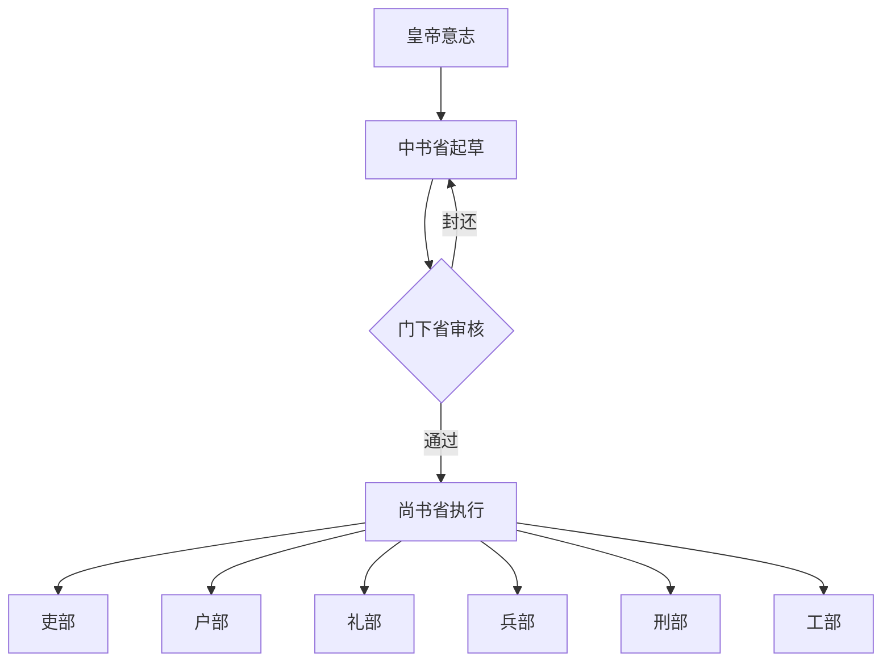
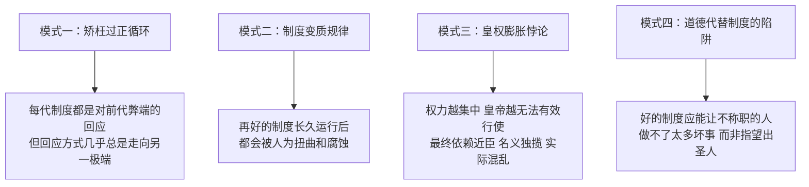

# 《中国历代政治得失》深度读书笔记

> [!abstract] 全书速览
> 这是一部以极精练的篇幅勾勒中国两千年政治制度演变的小书，却回应了一个大问题：中国传统政治究竟是不是"两千年封建专制"？钱穆以汉、唐、宋、明、清五代为样本，从政府组织、选举考试、经济赋税、兵役制度四个维度，描绘出一幅制度演变的全景图。他的核心发现是：中国政治有其内在的理性和演进逻辑，从汉唐的分权制衡到明清的皇权独大，是一个逐渐退化的过程，而非从头到尾的黑暗。==相权逐步萎缩、皇权逐步膨胀==——理解这个过程的来龙去脉，才能公正评价中国传统政治的真正得失。

## 历史坐标

1952年，钱穆在台北讲了五次课，题目就是"中国历代政治得失"。这五次讲演后来整理成书，成为理解中国政治传统的经典入门读物。

这本书诞生于一个特殊的历史时刻。彼时"封建专制"的定性已成主流话语，知识界对中国传统政治多持否定态度。钱穆不满于这种"一概抹杀"的做法，他认为这既不符合历史事实，也无助于中国的未来发展。在他看来，==一个民族如果彻底否定自己的制度遗产，就像一个人抹掉自己的全部记忆，必然无所适从==。

钱穆的史学立场可以概括为"同情的理解"。他不是要为传统辩护，而是要把每个制度放回它产生的历史情境中去评判。一个制度在当时是否合理？它解决了什么问题？后来为什么不行了？用这种方法看历史，会看到一个远比"两千年专制"复杂得多的图景。

钱穆（1895-1990）与陈寅恪、吕思勉、陈垣并称"史学四大家"。他出身江苏无锡乡村教师家庭，几乎完全靠自学成才。1949年赴港创办新亚书院，后半生致力于中华文化的传承。这部小书的独特价值在于：它既不是通史式的面面俱到，也不是断代史的深入一点，而是抓住"制度"这条主线，串起两千年的变化。

---

## 全书叙事线

全书以时间为经，以制度为纬。钱穆选择汉、唐、宋、明、清五个朝代，不是随意为之，而是因为它们各自代表了中国政治制度演变的关键节点。

**汉代**是制度的奠基期。秦朝开创的郡县制和皇帝制度在这里稳定下来，但同时发展出一套限制皇权的宰相制度。皇帝与宰相分掌"皇室"与"政府"，形成双轨并行的格局。这不是西方意义上的"分权"，但确实存在权力的制衡。

**唐代**把这套制衡发展到顶峰。三省六部制让"拟旨—审核—执行"分属不同机构，任何一道命令都要经过中书省起草、门下省审核、尚书省执行。皇帝的意志要落地，必须过这三道关。这是中国政治制度设计的高峰。

**宋代**是一个转折。五代十国的军阀乱政让宋朝君臣都患上了"前朝恐惧症"。于是拼命削弱武将、分散相权，矫枉过正地走向另一个极端——政府虽然稳定了，但也虚弱了。

**明代**是制度的断裂。朱元璋废除宰相，皇帝直接管理六部，等于一人独揽全部行政权力。原本平衡的皇权—相权格局被彻底打破。后来的皇帝精力不济时太监必然擅权，内阁制度畸形发展，有相之实而无相之权。

**清代**则是皇权专制的极端化。满族以少数民族入主中原，对汉族士大夫抱有根深蒂固的不信任。制度设计处处以防范臣下为首要考量，军机处的设立更是把决策权完全收归皇帝个人。至此，中国传统政治中曾经存在过的制衡机制消失殆尽。

从汉到清，这条线索非常清晰：==相权逐步萎缩，皇权逐步膨胀==。汉唐的"共治"格局演变为明清的"独裁"格局。这不是简单的"专制"两字能概括的，而是一个漫长的、可以追溯原因的历史过程。

---

## 关键转折深度解读

### 转折一：汉代——"皇室"与"政府"的分离

> [!note] 背景
> 秦始皇创立皇帝制度，但秦朝二世而亡，没来得及解决一个根本问题：皇帝的权力边界在哪里？

汉代的回答是：皇帝管"皇室"，宰相管"政府"。这两个系统各有各的财务、各有各的属官，在制度上是分开的。

具体来说，==皇帝的私产归"少府"管理，而国家税收归"大司农"管理==。皇帝花钱要从少府出，不能随意动用国库。宰相则是政府的首脑，有开府建制的权力，政府官员的任命要经过宰相。

更关键的是，宰相有"封驳"的权力。皇帝的诏书如果宰相认为不合适，可以不执行，退回去。这不是制度外的"死谏"，而是制度内的正常程序。

这套设计的底层逻辑是什么？钱穆认为，==汉代人把"皇位"和"政权"做了区分==。皇位是世袭的、私的；政权是公的，应该由有能力的人来掌握。皇帝是国家的象征，宰相才是实际的行政首脑。

汉代还建立了打破贵族垄断的"察举"制度：各郡国定期推荐人才，标准包括德行（孝廉）和能力（茂才），推荐者对被推荐者的表现负连带责任。这套机制极大扩展了政府人才来源，但后期沦为世家大族垄断的工具。

> [!tip] 核心洞察
> 任何长治久安的政治，都需要在最高权力和实际执行之间设置缓冲带。汉代的创造性贡献，就是用"宰相"这个角色来充当缓冲。如果没有这套设计，皇帝的每一个念头都直接变成政令，没有任何审议和纠错的空间。

### 转折二：唐代——三省制的制度巅峰

> [!tip] 核心洞察
> 唐代把汉代的宰相一分为三，看似削弱相权，实际上是把制衡机制精细化了。

唐代的三省六部制是这样运作的：

- **中书省**：负责起草诏令。皇帝有想法，要先跟中书省商量，由中书省拟成正式文书。
- **门下省**：负责审核。中书省起草的诏令送到门下省，如果门下省认为不妥，可以"封还"，打回去重拟。
- **尚书省**：负责执行。只有经过中书起草、门下审核的诏令，才能交给尚书省的六部去执行。

这套设计的精妙之处在于：==任何一道政令都不是某一个人说了算==。即使是皇帝的意志，也要经过"提案—审核—执行"三个环节，每个环节都有制度化的否决权。

更值得注意的是，中书、门下两省的长官合称"同中书门下平章事"，这就是唐代的宰相。唐代实行的是**集体宰相制**，不是一个人，而是一个班子在政事堂集体决策。皇帝一般不参加，尊重行政系统的独立运作。

> [!example] 制度运作的实例
> 唐太宗曾绕过门下省直接下诏，被魏征指出这样做会让门下省失去意义。唐太宗接受了批评，恢复了正常程序。这说明唐代君臣都认同这套制度的价值——制度的约束力不仅来自条文本身，还来自整个政治文化对规则的尊重。

唐代科举成为选拔官员的主要渠道，理论上向所有人开放，促进了社会流动。但门第观念仍存，考试偏重文学，与行政能力脱节。

府兵制（兵农合一）前期高效，后期瓦解转为募兵制，将领与士兵形成私人依附，最终导致安史之乱和藩镇割据。==安史之乱不仅是一次军事叛乱，更是军事制度变质的总爆发==。

**这个制度后来怎么变质的？** 政事堂权力越来越大，三省反而沦为执行机构。加上皇帝频繁给中下级官员加"同平章事"头衔，真正的宰相越来越多、也就越来越不值钱了。制度再精密，长久运行后都可能被人为扭曲。

### 转折三：宋代——矫枉过正的削弱

> [!warning] 历史教训
> 对前朝弊端的过度反应，往往制造出新的弊端。

五代十国是中国历史上最混乱的时期之一。武将跋扈，天子如走马灯般更换，"兵强马壮者为天子"成了不成文的规矩。宋太祖赵匡胤就是这样从后周的禁军统帅变成皇帝的。

正因为亲身经历过武将乱政，宋代对武将的防范到了极端程度。==禁军分成三个系统互相牵制，统兵的将领不能调兵，调兵的枢密院不能统兵==。结果军队战斗力大打折扣，对外战争几乎没赢过。

对文官系统，宋代同样以分权削弱为策略。把宰相的权力一分为三：政务归中书，军务归枢密院，财务归三司。宰相不能管军、不能管钱，权力大大缩小。

> [!warning] 制衡与分散的区别
> 钱穆指出了一个关键区分：==唐代是"权力制衡"——权力受约束但负责人仍有权力也有责任；宋代是"权力分散"——谁也没有足够的权力去推动任何事，也没有人需要为任何事负全责==。如果说唐代的制衡在决策环节，宋代的制衡在监督环节。只是监督太强、执行太弱，并非良好的制度平衡。

宋代科举更公平规范（糊名制、誊录制），但带来冗官问题。财政上"取之尽锱铢，用之如泥沙"——收入高（商业税、专卖收入），支出更高（冗官、冗兵、岁币），始终入不敷出。

王安石变法试图解决这些困境，方向正确但执行出了问题，加上反对派激烈阻挠，功亏一篑。==王安石变法的失败不是一个人的失败，而是整个制度缺乏自我更新能力的证明==。

宋代的根本困境：制度设计的出发点是"防弊"而非"兴利"。避免了唐代的藩镇问题，却陷入了"积贫积弱"的更深困局。

### 转折四：明代——相权的彻底消亡

明初的一件大事，改变了中国政治的基本格局：==洪武十三年（1380年），朱元璋废除宰相制度==。

理由是宰相胡惟庸谋反。但更深层的原因是朱元璋对皇权的极度执着。他是历史上唯一一个从乞丐起家的开国皇帝，对任何可能分享权力的制度安排都高度警惕。

废除宰相后，皇帝直接管理六部。这带来一个现实问题：全国的政务量太大，任何人都处理不过来。朱元璋精力过人，勉强能应付。但他的后代就不行了。

于是出现了两个"替代品"：

一是**内阁**。内阁大学士本来只是皇帝的秘书，帮忙处理文书。但因为皇帝处理不过来，内阁的"票拟"权力越来越大，实际上承担了部分决策功能。但内阁始终没有宰相的名分和法定权力，行事要看皇帝脸色，地位极不稳定。

二是**太监**。皇帝不愿把权力给外臣，就让身边的太监来代劳。司礼监的"批红"权使太监获得了巨大的政治影响力。明代太监乱政——王振、刘瑾、魏忠贤——根子就在废相。

> [!example] 一个类比
> 这就像一家公司，老板不信任职业经理人，废除了CEO职位，自己直接管所有部门。老板精力不济时，要么秘书越权，要么家里人插手，企业治理必然混乱。正常的权力通道被切断了，权力就必然从非正常的渠道泄漏出来。

锦衣卫、东厂、西厂等特务机构直接对皇帝负责，可以逮捕审讯任何人，不受正常司法程序约束。科举僵化为八股文，选拔出的是最善于模仿、最不敢独立思考的人。

> [!warning] 钱穆的判断
> 宰相制度有它的问题，权臣擅政的风险确实存在。但这是可以通过制度调整来纠正的。==废除宰相是把婴儿和洗澡水一起泼掉——消灭了问题也消灭了解决问题的机制==。明代才真正可以称为"专制"，而且是最坏形态的专制。

### 转折五：清代——专制的极端化

清代的政治制度带有强烈的**部族特色**。满族以百万之众统治亿万汉人，这种人口比例决定了清朝政治的核心关切：==如何保证满人对权力的垄断==。

几个关键制度安排体现了这一点：

**军机处**：雍正年间设立，名义上是处理西北军务的临时机构，实际上取代了内阁的决策地位。军机处的特点是：完全听命于皇帝，没有独立决策权，办事不留档案，官员随时可被替换。这是皇权独裁的最高效工具。遇到勤政皇帝效率高，遇到怠政皇帝就停滞——效率建立在个人而非制度基础上。

**满汉双轨制**：重要职位满汉双配，实权在满人。八旗子弟不从事生产，由国家供养。

**密折制度**：官员可以直接向皇帝密报，绕过正常行政渠道。结果是官员互相监视告密，正常的集体讨论被个人的秘密报告取代，政治氛围极其压抑。

**文字狱**：从康熙到乾隆持续近百年，目的是在整个知识阶层中制造恐惧。长期后果是知识分子失去了独立思考政治问题的能力和勇气。

> [!warning] 制度缺失与有意为恶
> 钱穆做了一个关键区分：==如果说明代是"制度缺失"——一时昏聩废了宰相，清代则是"有意为恶"——处心积虑地要把专制推到极端==。制度设计不是为了国家治理的效率，而是为了维护满族的统治地位。当西方冲击到来时，清朝的应变能力极弱——没有分权制衡的传统可以恢复，没有独立的士大夫群体可以承担转型责任。

---

## 历史的模式

从这五个朝代的演变中，可以提炼出几条规律：

**模式一：制度都有"时代的意义"**

每个制度在其产生时都是对当时问题的回应。汉代分权是回应秦朝个人独裁的教训；宋代削武是回应五代武人乱政的教训；明代废相是回应元末权臣乱政的恐惧。

但问题在于，==回应的方式往往矫枉过正==。对前朝弊端的过度反应，会制造出新的弊端。宋代怕武将，结果养出了一个虚弱的政府；明代怕相权，结果养出了太监乱政。

**模式二：制度会"变质"**

再好的制度，长久运行后都会僵化、变质。唐代的三省制最初设计精良，但后来政事堂独大、宰相泛滥，制度的平衡就被打破了。

==制度变质的根本原因是人事==。制度是死的，人是活的。时间长了，人们总能找到绕过制度的办法，或者把制度变成谋取私利的工具。好的制度不仅需要好的设计，还需要内置的"自我更新"机制。中国传统制度恰恰缺乏这种自我更新的能力。

**模式三：皇权与相权的此消彼长**

从汉到清，有一条清晰的主线：==相权不断削弱，皇权不断膨胀==。汉代的宰相可以封驳诏书，明清的内阁大学士只是皇帝的秘书。

这个趋势的背后是一个悖论：皇帝想要更多的权力，但一个人的精力总是有限的。权力越集中，皇帝越无法有效行使权力，最后不得不依赖身边的近臣（内阁或太监）。结果是：名义上皇帝大权独揽，实际上政务运转混乱。

**模式四：用道德代替制度是危险的**

钱穆特别强调，宋明理学家喜欢讲"正心诚意"，把治国的希望寄托在君主的道德修养上。但如果制度不健全，道德是靠不住的。

==好的制度应该能让不称职的人做不了太多坏事，而不是指望每个当权者都是圣人==。这一点，从汉唐的经验可以看出来：不是因为汉唐皇帝特别道德高尚，而是因为制度设计留出了制衡的空间。

---

## 作者的史学方法

钱穆的研究方法可以概括为"制度史"的进路。他不是按人物、事件来叙述历史，而是按制度来分析历史。

每个朝代他都从四个维度入手：
- 政府组织（皇权与相权的关系）
- 选举考试（人才如何进入政府）
- 经济赋税（钱从哪里来、花到哪里去）
- 兵役制度（军事力量如何组织）

这种方法的优点是系统性强，能够看出制度演变的脉络。缺点是可能过于强调制度的"设计"，而忽略制度在实际运行中的复杂性——地方社会、商人阶层、民间宗教、家族网络这些非正式的制度和权力结构在他的分析中基本缺席。

> [!warning] 对钱穆的批评
> 一些学者认为，钱穆对传统政治过于美化。他强调汉唐的"分权制衡"，但那种制衡的力度和西方的三权分立不可同日而语。皇帝要破坏规则，没有任何力量能真正阻止他。
>
> 另一些学者认为，钱穆对清代的评价有时代情绪的影响。作为一个经历过国族危机的知识分子，他对满清的厌恶可能影响了学术判断。"新清史"学派指出，清朝在治理多民族帝国方面有其独特的制度创新（如理藩院体系、多语言行政等），不能简单地用"部族政权的压迫"来概括。

这些批评有一定道理，但不应该掩盖这本书的价值。钱穆提供了一个看待传统政治的新视角：==不是简单地"肯定"或"否定"，而是进入历史情境去理解制度的来龙去脉==。这种方法本身就是有益的。

---

## 以史鉴今

读这本书，对理解当下有几点具体帮助：

**第一，警惕"一刀切"的历史判断。** "两千年封建专制"是一个过于简单的标签。真实的历史是复杂的、演变的、有得有失的。任何把历史简化为一个口号的做法，都值得怀疑。

**第二，理解制度变革的难度。** 制度不是拍脑袋想出来的，每一个制度都是对前代问题的回应。想改变一个制度，首先要理解它为什么会变成现在这样。否则改革很容易矫枉过正，制造出新的问题。

**第三，重视制度设计中的制衡。** 权力需要制衡，这是汉唐经验的核心启示。不是因为人性本恶，而是因为没有制衡的权力必然腐化。==好的制度设计应该假定人会犯错，然后设置纠错机制==。

**第四，避免用道德代替制度。** 寄望于出一个好领导来解决所有问题，是政治不成熟的表现。领导人会更替，道德修养参差不齐，唯有制度是可以持续的。

**第五，关注制度的自我更新能力。** 再好的制度也会在运行中变质。关键不在于设计出一套"完美"的制度，而在于制度是否有发现偏差、自我纠正的内置机制。中国传统政治最大的遗憾，就是缺乏这种自我更新的能力。

---

## 延伸阅读

- [[《万历十五年》]]：黄仁宇的名著，可以视为对明代制度困境的微观案例研究。钱穆讲的是制度设计的宏观脉络，黄仁宇讲的是制度下人的微观挣扎。两本书对照阅读效果极佳。
- [[《叫魂》]]：孔飞力的研究展示了清代专制体制在面对危机时的实际运作方式，可以和钱穆对清代的分析互相参照。
- [[《国史大纲》]]：钱穆的通史著作，是这本小书的扩展版。如果《政治得失》让你产生了兴趣，《国史大纲》可以提供更完整的图景。其序言中关于"对本国历史应有温情与敬意"的论述，是理解钱穆史学立场的关键文本。
- [[《中国大历史》]]：黄仁宇从"大历史观"出发重新审视中国历史，与钱穆的制度史视角形成有益的对话。
