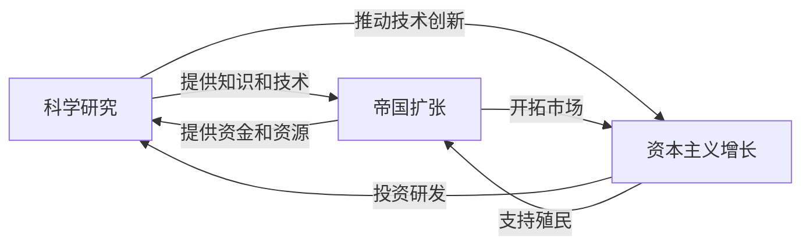

# 《人类简史》深度读书笔记

> [!abstract] 全书速览
> 这是一部野心极大的作品：用一本书讲述从七万年前到今天的整个人类历史。赫拉利的核心命题是——人类之所以能统治地球，不是因为个体更强壮或更聪明，而是因为我们是唯一能够**大规模灵活合作**的物种。而这种合作能力的基础，是一项独特的认知本领：创造并相信==虚构的故事==。国家、宗教、金钱、人权、公司法人，这些全都是想象的产物。它们不存在于物理世界中，但正是这些"共同的想象"让数百万陌生人能够协同行动。

## 历史坐标

《人类简史：从动物到上帝》由以色列历史学家尤瓦尔·诺亚·赫拉利于2011年以希伯来文出版，2014年英文版面世后迅速席卷全球，被翻译成六十多种语言，成为二十一世纪最具影响力的历史类畅销书之一。赫拉利是耶路撒冷希伯来大学历史系教授，博士论文研究的是中世纪战争回忆录——一个极其专业化的领域。但这本书标志着他从专业历史学家向公共知识分子的转型。

你需要先理解这本书的定位：这不是一部严格意义上的学术著作，而是一部**跨学科综合叙事**。它横跨进化生物学、考古学、人类学、历史学、经济学、心理学和哲学等多个领域。赫拉利的角色更接近一位"知识整合者"而非某个领域的原创研究者。他的贡献在于将大量分散的学科知识编织成一条连贯的叙事线——这既是本书的最大优势，也是它最大的争议来源。

> [!note] 知识谱系
> 这本书与贾雷德·戴蒙德的[[《枪炮、病菌与钢铁》]]构成对话关系——戴蒙德侧重地理与环境决定论，赫拉利侧重认知与文化建构。它也与理查德·道金斯的[[《自私的基因》]]在"文化基因"概念上有延续——赫拉利将"虚构故事"视为人类最强大的文化基因。赫拉利选择的切入角度是"认知能力"：不是枪炮和钢铁让人类征服世界，而是虚构故事赋予的合作能力让人类建造了枪炮和钢铁。

## 全书叙事线

全书可以提炼为**四大革命**构成的递进结构：


赫拉利的叙事起点是一个容易被忽视的事实：在约七万年前之前，智人只是一种普通的非洲猿类，对生态环境的影响并不比水母或萤火虫大多少。地球上同时存在着好几种人类——尼安德特人、直立人、弗洛里斯人等。然后，某种变化发生了。智人突然获得了前所未有的竞争优势，开始走出非洲，在几万年内遍布全球，并在这个过程中导致了其他人类物种的灭绝。赫拉利将这次跃迁称为"认知革命"。

约一万两千年前，另一个关键转折发生：农业革命。人类从采集者变成农民，这看似是进步，赫拉利却给出了一个颠覆性的判断——农业革命可能是"史上最大的骗局"。它让总人口急剧增加，却让每个个体的生活质量下降。

随着农业社会的扩张，人类需要越来越复杂的"想象的秩序"来维持大规模合作。金钱、帝国、宗教——这三种力量逐渐将分散的人类群体融合为越来越大的整体。赫拉利认为，从长时段来看，人类历史的大趋势是走向统一——尽管过程中充满了暴力和压迫。

最后，约五百年前，科学革命开启了人类历史的加速度。它的核心创新不是某个具体发现，而是一种认识论的根本转变：==承认自己的无知==。科学、帝国主义和资本主义形成了正反馈循环，将人类推向前所未有的力量——以及前所未有的危险。

## 关键转折深度解读

### 第一个转折：认知革命——虚构的力量

大约七万年前，智人的认知能力发生了质变。但关键突破不仅仅是语言本身——很多动物都有交流系统——而是一种全新的语言功能：**讨论根本不存在的事物的能力**。

> [!tip] 核心洞察
> 你可以告诉同伴"河边有一头狮子"（事实性信息），但更重要的是，你可以说"我们部落的守护神是一头狮子"（虚构）。这种能力使得智人可以创造共享的神话，而共享的神话使得大规模合作成为可能。

英国人类学家罗宾·邓巴的研究表明，灵长类动物的社交群体规模与其大脑新皮层的大小正相关。对于智人来说，不借助任何"虚构故事"的情况下，社交群体的自然上限大约是**一百五十人**——这就是著名的"邓巴数"。超过这个数字，仅靠个人关系维系的群体就会崩溃。

但智人打破了这个限制。通过虚构的故事。你不认识你国家的每一个公民，但你们都"相信"同一面国旗、同一部宪法、同一种货币。这种共同的信念——而不是血缘或个人关系——将数百万陌生人凝聚在一起。

> [!example] 操作系统类比
> 蚂蚁的合作靠的是硬件（基因编程），黑猩猩的合作靠的是个人关系（社交软件1.0，最多管理几十个对象）。智人发明了"虚构故事"这个操作系统（社交软件2.0），它可以让任意数量的用户接入同一个网络——只要他们都"安装"了同一个故事。更厉害的是，这个操作系统还能升级：你不需要等待基因突变（要几万年），只需要换一个故事（可能几年甚至几天）。文化进化取代了生物进化，成为变革的主要驱动力。

这也解释了为什么尼安德特人灭绝了。他们的大脑不比智人小，甚至可能更大。但他们似乎缺乏创造复杂虚构故事的能力。没有共同的神话，他们的群体规模受限于邓巴数。当数百个智人组成的部落联盟与几十个尼安德特人的小群体竞争时，结果是注定的。

> [!warning] 证据等级提醒
> "认知革命"的确切机制目前仍有争议。赫拉利将其描述为一次相对突然的变化，但许多古人类学家倾向于认为这是一个更渐进的过程。化石和考古记录显示，行为现代性的标志在非洲出现的时间跨度很长，而不是在某个时间点突然出现。赫拉利的"七万年前突变"说法是一种叙事简化。

### 第二个转折：农业革命——史上最大骗局？

大约一万两千年前，在"新月沃地"区域，人类开始驯化小麦、大麦等谷物，以及山羊、绵羊等动物。

赫拉利的挑衅性论点是：农业革命不是人类的进步，而是**史上最大的骗局**。

他的论证逻辑：采集者的生活并不像你想象的那么糟——食物更多元、工作时间更短、骨骼更健康。农业使总人口增加，但个体生活质量反而下降。赫拉利做了一个修辞性反转："不是人类驯化了小麦，而是小麦驯化了人类。"

> [!example] 连锁店困境
> 想象你开了一家小餐馆，每天工作六小时，下午有空钓鱼。然后你决定扩张开连锁店。十年后五十家分店，每天工作十六小时，压力巨大，无法回头——因为五百个员工依赖你的连锁店生存。这就是农业革命对人类做的事情。

关键区分：自然选择不优化"幸福"，它优化的是==繁殖成功率==。农业降低了个体生活质量，但大幅提高了人口承载能力。这揭示了一个贯穿全书的根本张力：进化成功不等于个体幸福。

### 第三个转折：想象的秩序——金钱、帝国与宗教

农业革命后，人类社会规模远超邓巴数。解决方案是创造越来越复杂的**想象的秩序**。

赫拉利以《汉谟拉比法典》和美国《独立宣言》为对比：两者都声称阐述普世正义原则，但内容截然不同。赫拉利的观点是——这两套体系都不是"客观真理"，都是想象的秩序。

> [!note] 重要区分
> 赫拉利说"人权是虚构的故事"时，意思不是"人权不重要"，而是说人权没有生物学基础——它是文化建构。但"文化建构"不等于"不真实"。语言也是文化建构，你不会因此说语言"不真实"。

**金钱**是人类有史以来最成功的虚构故事，也是最具包容性的信任体系。它像一种"通用翻译器"，把一切价值翻译成统一的数字。宗教、民族主义都有排他性，但金钱不在乎你是谁。

**帝国**是文化统一的第二大引擎。你不能简单地将帝国视为"纯粹的邪恶"——当今世界的许多文化、语言、法律都是帝国遗产的产物。

**宗教**（赫拉利的宽泛定义：建立在超人类秩序信仰之上的规范和价值观系统）的演变脉络清晰：泛灵论 → 多神教 → 一神教 → 现代意识形态。现代意识形态虽自称"世俗"，但在功能上与传统宗教并无二致。

### 第四个转折：科学革命——承认无知

约五百年前的认识论根本转变。科学革命的核心：我们不知道一切，过去认为知道的可能是错的，但可以通过观察和实验获取新知识。

科学、帝国主义和资本主义形成了紧密的共生关系：



信贷的本质是对未来的信任——科学革命提供了这种信任的基础。形成正反馈循环：科学进步 → 技术创新 → 经济增长 → 更多资金投入科学。

全书最后的追问：科学革命让人类获得了前所未有的力量，但我们更幸福了吗？心理学研究表明，主观幸福感主要受基因基线和社会比较影响。赫拉利引入佛教视角：痛苦来自渴望，而渴望永无止境。

## 历史的模式

**模式一：虚构-合作-统治循环**

这是全书最核心的发现：

```
虚构故事（想象的秩序）
    → 大规模灵活合作（超越邓巴数）
        → 物种层面的统治力
            → 需要更复杂的秩序来管理
                → 新的虚构故事……
```

**模式二：进化成功与个体幸福的脱钩**

从驯化小麦的农民到现代白领，人类在物种层面的"成功"与个体层面的幸福之间存在根本脱钩。自然选择优化的是基因传播，不是你的快乐。

**模式三：奢侈品陷阱**

一旦采用新技术或新生活方式就无法回头。农业使人口增长，增长的人口使回归采集变得不可能。今天同样如此：电子邮件本应节省时间，结果你花更多时间处理邮件。

**模式四：互为主体性的力量**

| 现实层次 | 定义 | 例子 |
|---------|------|------|
| 客观现实 | 独立于人类信念而存在 | 引力、放射性衰变 |
| 主观现实 | 取决于个人的信念和感受 | 你个人的疼痛感 |
| 互为主体现实 | 取决于大量个体的共同信念 | 金钱、国家、人权、公司 |

人类生活中最重要的那些东西——法律、宗教、经济体系——几乎全部属于==互为主体现实==。

## 作者的史学方法

赫拉利采用的是**大历史**（Big History）的叙事方法，试图用极长的时间跨度审视人类全部历程。优势在于跨学科整合能力和出色的叙事天赋。

> [!warning] 主要学术争议
> - "认知革命"的"突变"说法被许多古人类学家认为过于简化
> - "农业是骗局"的论断虽然引人深思，但"骗局"的修辞性表达在逻辑上存在问题
> - 关于欧洲崛起原因的解释面临多种替代性理论的挑战
> - 赫拉利有时以客观姿态表达个人价值判断，读者需要分辨事实与立场

这些批评是合理的。但赫拉利的目标不是为专家写学术论文，而是为普通读者提供一个思考人类历史的宏观框架。重要的是你作为读者保持审慎，将这本书视为思考的起点而非终点。

## 以史鉴今

> [!tip] 认知升级清单
> - **识别"想象的秩序"**：在日常生活中辨认哪些属于"互为主体现实"——公司、品牌、国家、金钱、法律。当你看到一则广告试图让你相信某个品牌"代表"某种生活方式时，意识到这就是一个虚构故事在试图"安装"到你的头脑中
> - **警惕"进步叙事"**：更高GDP、更强技术不等于更多幸福。更高的薪水、更大的房子不一定等于更好的生活
> - **理解叙事战争**：人类天生被"故事"驱动，在信息时代，谁掌握了故事，谁就掌握了权力
> - **为未来巨变做准备**：基因编辑、人工智能可能根本性改变智人物种本身，力量与智慧的失衡是这个时代最大的风险

## 延伸阅读

- [[《枪炮、病菌与钢铁》]] - 贾雷德·戴蒙德：与本书构成互补，侧重地理和环境因素如何塑造文明差异
- [[《自私的基因》]] - 理查德·道金斯：理解赫拉利"虚构故事"理论的基因层面根基，"文化基因"概念的原始出处
- [[《未来简史》]] - 尤瓦尔·赫拉利：将《人类简史》的框架延伸到未来，探讨数据主义、生物技术和人工智能如何重塑人类命运
