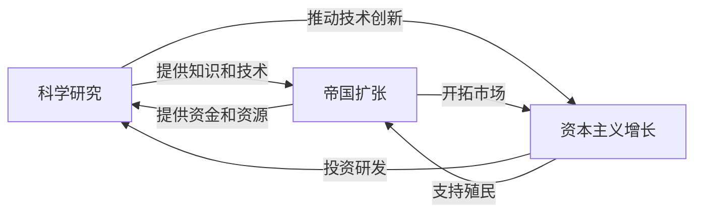

# 《人类简史》深度读书笔记

> [!abstract] 全书速览
> 七万年前，智人不过是一种普通的非洲猿类，对地球生态的影响力不比水母大多少。今天，这个物种站在了食物链的顶端，拥有改造甚至毁灭整颗星球的能力。赫拉利追问的核心问题是：凭什么是我们？答案不是更大的肌肉或更锋利的牙齿，甚至不是更大的大脑——而是一项独一无二的认知能力：==创造并相信虚构的故事==。国家、宗教、金钱、人权、公司法人，全都是想象的产物，不存在于物理世界的任何角落。但正是这些共同的想象，让数百万素不相识的陌生人能够协同行动，建造金字塔、发射火箭、运转全球经济。全书从认知革命讲到科学革命，从采集部落讲到硅谷实验室，最终指向一个令人不安的追问：获得了神一样力量的智人，真的知道自己想要什么吗？

## 历史坐标

《人类简史：从动物到上帝》由以色列历史学家尤瓦尔·诺亚·赫拉利于2011年以希伯来文出版，2014年英文版面世后迅速席卷全球，被翻译成六十多种语言，成为二十一世纪最具影响力的历史类畅销书之一。赫拉利是耶路撒冷希伯来大学历史系教授，博士论文研究的是中世纪战争回忆录——一个极其专业的领域。这本书标志着他从专业学者向公共知识分子的转型。

> [!note] 定位
> 这不是一部严格的学术著作，而是一部跨学科综合叙事，横跨进化生物学、考古学、人类学、历史学、经济学、心理学和哲学。赫拉利的角色更像"知识整合者"而非原创研究者——他将大量分散的学科知识编织成一条连贯的叙事线。这既是本书最大的优势，也是最大的争议来源。

在知识谱系上，这本书与贾雷德·戴蒙德的[[《枪炮、病菌与钢铁》]]构成对话——戴蒙德侧重地理与环境决定论，赫拉利侧重认知与文化建构。它也与理查德·道金斯的[[《自私的基因》]]在"文化基因"概念上有延续。赫拉利选择的切入角度是：不是枪炮和钢铁让人类征服世界，而是==虚构故事赋予的合作能力==让人类建造了枪炮和钢铁。

出版时的时代背景值得注意。2011年前后，全球化正处于微妙的转折点——金融危机余波未平，社交媒体正在重塑信息传播方式，人们对"人类到底怎么走到今天的"这个根本问题产生了强烈的追问需求。赫拉利恰好在这个节点提供了一个宏大而易于理解的答案框架。

## 全书叙事线

全书以四大革命构成递进结构：

叙事的起点是一个容易被忽视的事实：七万年前，地球上同时生活着好几种人类——尼安德特人、直立人、弗洛里斯人。然后某种变化发生了，智人获得了前所未有的竞争优势，走出非洲，在几万年内遍布全球，其他人类物种逐一灭绝。赫拉利将这次跃迁称为"认知革命"。

这里有一个值得停下来想的对比：大约一百五十万年前，直立人已经会使用火和石器，但在随后的一百万年里，他们的工具几乎没有变化。同一种石器，一百万年纹丝不动。智人则完全不同——从认知革命开始，技术变革的速度就呈加速趋势。

约一万两千年前，另一个关键转折发生：农业革命。人类从采集者变成农民，看似进步，赫拉利却给出颠覆性判断——这可能是"史上最大的骗局"。总人口急剧增加，每个个体的生活质量却下降了。

随着农业社会的扩张，人类需要越来越复杂的"想象的秩序"来维持大规模合作。金钱、帝国、宗教——这三种力量逐渐将分散的人类群体融合为越来越大的整体。从长时段看，人类历史的大趋势是走向统一——尽管过程中充满暴力和压迫。

约五百年前，科学革命开启了加速度。核心创新不是某个具体发现，而是一种认识论的根本转变：==承认自己的无知==。科学、帝国主义和资本主义形成正反馈循环，将人类推向前所未有的力量——以及前所未有的危险。

## 关键转折深度解读

### 第一个转折：认知革命——虚构的力量

大约七万年前，智人的认知能力发生了质变。关键突破不仅仅是语言本身——很多动物都有交流系统——而是一种全新的语言功能：==讨论根本不存在的事物的能力==。

> [!tip] 核心洞察
> 你可以告诉同伴"河边有一头狮子"——事实性信息，绿猴也能发出类似的警报叫声。但你还可以说"我们部落的守护神是一头狮子"——这是虚构，只有智人做得到。这种能力使智人可以创造共享的神话，而共享的神话使大规模合作成为可能。

英国人类学家罗宾·邓巴的研究表明，灵长类动物的社交群体规模与大脑新皮层大小正相关。不借助任何"虚构故事"，智人社交群体的自然上限大约是一百五十人——著名的"邓巴数"。超过这个数字，仅靠个人关系维系的群体就会崩溃。两个人之间是一条关系线，五个人之间是十条，一百五十人之间是一万多条——大脑处理不过来。

但智人打破了这个限制。你不认识你国家的每一个公民，但你们都"相信"同一面国旗、同一部宪法、同一种货币。这种共同的信念——而不是血缘或个人关系——将数百万陌生人凝聚在一起。

> [!example] 操作系统类比
> 蚂蚁的合作靠硬件（基因编程），黑猩猩的合作靠个人关系（社交软件1.0，最多管理几十个对象）。智人发明了"虚构故事"这个操作系统（社交软件2.0），可以让任意数量的用户接入同一个网络——只要都"安装"了同一个故事。更厉害的是，这个系统还能升级：不需要等基因突变（要几万年），只需要换一个故事（可能几年甚至几天）。文化进化取代了生物进化，成为变革的主要驱动力。

这也解释了尼安德特人为什么灭绝。他们的大脑不比智人小，甚至可能更大，但似乎缺乏创造复杂虚构故事的能力。没有共同的神话，群体规模受限于邓巴数。当数百个智人组成的部落联盟与几十个尼安德特人的小群体竞争时，结果是注定的。

考古证据给这场竞争提供了有意思的细节。在以色列的卡夫扎洞穴和斯虎尔洞穴，考古学家发现了约十万年前的智人遗骸——他们比尼安德特人更早到达中东，但后来又被"赶"了回去。在认知革命之前，智人在竞争中并不占优势。是什么让天平在七万年前发生了逆转？赫拉利的答案是：认知革命赋予了智人组织大规模合作的能力。想象两支军队的对决——一边是独立作战的精锐小队，另一边是有统一指挥和分工协作的大军。个体战斗力或许相当，但组织层面的差距决定了胜负。

如果认知革命没有发生，地球上至今可能仍然生活着好几种人类，就像今天仍有好几种猿类。不会有城市、帝国、宗教和科学，每个人类物种都在自己的生态位里默默生存。

> [!warning] 证据的复杂性
> "认知革命"的确切机制仍有争议。赫拉利将其描述为一次相对突然的变化，但许多古人类学家倾向于认为这是更渐进的过程。南非布隆博斯洞穴出土的刻画赭石碎片距今约七万七千年，是最早的抽象思维证据之一，但同一地区还发现了距今约十万年的穿孔贝壳装饰品——暗示象征性思维的出现远比"七万年前突变"更加漫长和渐进。

### 第二个转折：农业革命——史上最大的骗局？

大约一万两千年前，在"新月沃地"区域，人类开始驯化小麦、大麦等谷物和山羊、绵羊等动物。赫拉利的挑衅性论点是：农业革命不是进步，而是==史上最大的骗局==。

论证从三个层面展开。首先，采集者的生活并不像你想象的那么糟。现代研究喀拉哈里沙漠桑人等采集社会显示，他们平均每天只花三到六小时获取食物，剩余时间用于社交、休息和娱乐，食物种类也比农民多元得多。其次，考古学家对比早期农业定居点和采集者营地的骨骼遗存，发现早期农民平均身高更矮、牙齿蛀洞更多、骨骼应力标记更明显——这些是硬证据。第三，赫拉利做了一个精彩的修辞性反转："不是人类驯化了小麦，而是小麦驯化了人类。"从小麦的角度看，这种不起眼的中东野草变成了地球上种植面积最大的植物——堪称进化史上最成功的物种。而人类则从自由的采集者变成了"小麦的仆人"——弯腰劳作、清除杂草、挑水灌溉。

> [!example] 连锁店困境
> 想象你开了一家小餐馆，每天工作六小时，下午有空钓鱼。然后你决定扩张。十年后五十家分店，每天工作十六小时，压力巨大，无法回头——因为五百个员工依赖你的连锁店生存。这就是农业革命对人类做的事。

这里有一个关键区分：自然选择不优化"幸福"，它优化的是==繁殖成功率==。农业降低了个体生活质量，但大幅提高了人口承载能力。这揭示了贯穿全书的根本张力：进化成功不等于个体幸福。

农业还催生了社会不平等的制度化。采集社会通常相对平等——浆果和野兔肉放不了多久就腐烂，能囤积多少？但农业产生了可储存的剩余粮食，谁控制粮仓谁就拥有权力。社会阶层、税收、国王、官僚机构的出现几乎不可避免。人类历史上绝大多数压迫制度——从古埃及法老的劳役到中世纪农奴制——都植根于农业革命创造的剩余分配结构。

当然，称之为"骗局"在逻辑上有问题——"骗局"暗示有一个"骗子"，而进化是无意识过程。赫拉利对采集生活的浪漫化也受到批评——现代采集社会已被边缘化到最贫瘠的生态位，不能代表史前采集者的真实条件。尽管如此，核心洞见仍然有效：你不应该自动将历史变革视为"进步"。

### 第三个转折：想象的秩序——金钱、帝国与宗教

农业革命后，人类社会规模远超邓巴数。解决方案是创造越来越复杂的"想象的秩序"。

赫拉利以《汉谟拉比法典》（约公元前1776年）和美国《独立宣言》（1776年）为对比：两者都声称阐述普世正义原则，内容却截然不同——汉谟拉比法典认为等级制度是神圣的自然秩序，独立宣言声称"人人生而平等"。赫拉利的观点是：两套体系都不是客观真理，都是想象的秩序，只不过你碰巧生活在接受第二种故事的文化中。

> [!note] 重要区分
> 说"人权是虚构的故事"不是说人权不重要，而是说它没有生物学基础——它是文化建构。但文化建构不等于不真实。语言也是文化建构，你不会因此说语言"不真实"。

**金钱**是人类最成功的虚构故事，也是最具包容性的信任体系。它像一种"通用翻译器"，把一切价值翻译成统一的数字。金钱的历史就是信任演化史：从大麦货币到银块到纸币再到电子数字，物质基础不断减弱，集体信任不断增强。金钱不在乎信仰、肤色或文化——基督徒和穆斯林可能在宗教上势不两立，但都愿意接受美元。公元一世纪的罗马金币在印度次大陆被大量发现，说明跨文明的贸易网络两千年前就已相当发达。

**帝国**是文化统一的第二大引擎。赫拉利提出一个让人不舒服的观点：你不能简单地将帝国视为"纯粹的邪恶"。当今世界的许多文化、语言、法律都是帝国遗产。许多"本土文化"实际上是前一个帝国的遗产。文化不是封闭的容器，而是不断吸纳新支流的河流，帝国往往是最大的那条支流。

**宗教**的演变脉络清晰：泛灵论 → 多神教 → 一神教 → 现代意识形态。赫拉利对宗教的定义很宽泛：建立在超人类秩序信仰之上的规范和价值观系统。现代意识形态虽自称"世俗"，但在功能上与传统宗教并无二致——都提供超越个人的秩序叙事，都要求信徒的忠诚和奉献，都有自己的圣地、仪式和殉道者。

### 第四个转折：科学革命——承认无知

约五百年前，欧洲发生了认识论的根本转变。在此之前，几乎所有文化都相信重要问题的答案已经存在——在神圣经典中、在古代智者的著作中。

科学革命带来全新态度：我们不知道一切，过去认为知道的很多东西可能是错的，但可以通过观察和实验获取新知识。赫拉利用一个具体例子说明：1774年库克船长航行太平洋时带上了天文学家和植物学家——以前的远洋航行只为征服和贸易，为什么带科学家？因为英国海军认识到，"我们不知道的"可能比"我们已知的"更有价值。

科学、帝国主义和资本主义形成了紧密共生关系：

信贷的本质是对未来的信任，科学革命提供了这种信任的基础。正反馈循环由此形成：科学进步 → 技术创新 → 经济增长 → 更多资金投入科学。

"经济增长"作为社会核心目标是晚近的观念。科学革命之前，几乎所有社会都假设经济是零和博弈。现代经济建立在对未来的集体信心之上——全球流通的货币总量远超实际商品价值，差额就是"信用"，本质上是对未来增长的赌注。如果所有人突然失去信心，整个信用体系就会崩溃——这正是2008年金融危机的简化版解释。

全书最后抛出追问：科学革命让人类获得了前所未有的力量，但我们更幸福了吗？心理学研究表明，主观幸福感主要受基因基线和社会比较影响。赫拉利引入佛教视角：痛苦来自渴望，而渴望永无止境。解决方案不是满足更多渴望，而是学会不渴望。

## 历史的模式

从全书叙事中可以提炼出几个跨越时代的规律性模式。

**虚构-合作-统治循环。** 这是全书最核心的发现。虚构故事使大规模灵活合作成为可能，合作带来物种层面的统治力，统治力的扩大需要更复杂的秩序来管理，催生新的虚构故事。认知革命创造了共享神话，农业革命催生了宗教和法典，帝国创造了统一的文化叙事，科学革命催生了资本主义和民族主义。每一轮循环都将合作规模推向更高层级。

**进化成功与个体幸福的脱钩。** 从驯化小麦的农民到现代白领，物种层面的"成功"与个体的幸福之间存在根本脱钩。自然选择优化的是基因传播，不是你的快乐。GDP不断增长，抑郁症发病率也在上升——这不是巧合，而是这个古老模式的当代延续。你的大脑充满了让祖先更好繁殖的神经回路，而不是让你更快乐的神经回路。

**奢侈品陷阱。** 一旦采用新技术就无法回头——农业使人口增长，增长的人口使回归采集变得不可能。今天同样如此：电子邮件本应节省时间，结果你花更多时间处理邮件；汽车让出行更快，但通勤距离也更远了。昨天的奢侈品变成今天的必需品，今天的便利变成明天的束缚。

**互为主体性的力量。** 赫拉利区分了三种现实：

| 现实层次 | 定义 | 例子 |
|---------|------|------|
| 客观现实 | 独立于人类信念而存在 | 引力、放射性衰变 |
| 主观现实 | 取决于个人的信念和感受 | 你个人的疼痛感 |
| 互为主体现实 | 取决于大量个体的共同信念 | 金钱、国家、人权、公司 |

人类生活中最重要的那些东西——法律、宗教、经济体系——几乎全部属于==互为主体现实==。理解这一点，你就拿到了理解人类文明的一把钥匙：改变世界最有效的方式，往往不是改变物理环境，而是改变人们共同相信的故事。

**统一化的长期趋势。** 尽管历史充满分裂和冲突，从长时段看大趋势是融合和统一。几万年前地球上有成千上万个互不接触的部落，今天几乎所有人都生活在同一个政治经济体系中。金钱、帝国和宗教是推动这一趋势的三大引擎。

## 作者的史学方法

赫拉利采用"大历史"叙事方法，试图用极长的时间跨度审视人类全部历程。优势在于跨学科整合能力和出色的叙事天赋。

> [!warning] 主要学术争议
> - "认知革命"的"突变"说法被许多古人类学家认为过于简化，考古证据显示行为现代性的出现时间跨度很长
> - "农业是骗局"忽略了农业带来的知识积累和社会组织进步，"骗局"在逻辑上存在问题——进化是无意识过程，没有"骗子"
> - 倾向于选择支持其大叙事的证据，对不符合的证据着墨较少
> - 有时以客观姿态表达个人价值判断，如对农业革命的负面评价、对自由人文主义的怀疑态度
> - 跨学科的代价：在进化生物学和考古学领域存在事实错误或对研究的误读

这些批评是合理的。但赫拉利的目标不是为专家写学术论文，而是为普通读者提供思考人类历史的宏观框架。重要的是你保持审慎，将这本书视为思考的起点而非终点。

## 以史鉴今

> [!tip] 认知升级清单
> - **识别"想象的秩序"**：在日常生活中辨认哪些属于"互为主体现实"——公司、品牌、国家、金钱、法律。当广告试图让你相信某个品牌"代表"某种生活方式时，意识到这就是一个虚构故事在试图"安装"到你的头脑中。"男人就应该怎样""成功就应该是什么样子"——追问：这是客观事实，还是某个想象的秩序在施加影响？
> - **警惕"进步叙事"**：更高GDP、更强技术不等于更多幸福。每一次"升级"都可能是新的奢侈品陷阱，让你在物质上更富有，在时间和自由上更贫穷
> - **理解叙事的力量**：人类天生被"故事"驱动。在信息时代，谁掌握了叙事谁就掌握了权力。这适用于政治宣传，也适用于商业营销和社交媒体算法。你是选择相信哪些故事的人，还是被故事选择的人？
> - **为未来巨变做准备**：基因编辑、人工智能可能根本性改变智人物种本身。力量与智慧的失衡，是这个时代最大的风险

## 延伸阅读

- [[《枪炮、病菌与钢铁》]] - 贾雷德·戴蒙德：侧重地理和环境因素如何塑造文明差异，与本书构成互补视角
- [[《自私的基因》]] - 理查德·道金斯：理解赫拉利"虚构故事"理论的基因层面根基，"文化基因"概念的原始出处
- [[《未来简史》]] - 尤瓦尔·赫拉利：将本书框架延伸到未来，探讨数据主义、生物技术和人工智能如何重塑人类命运
- [[《全球通史》]] - 斯塔夫里阿诺斯：从更传统的史学视角提供大尺度全景叙事，与赫拉利的创新性解读形成对照
