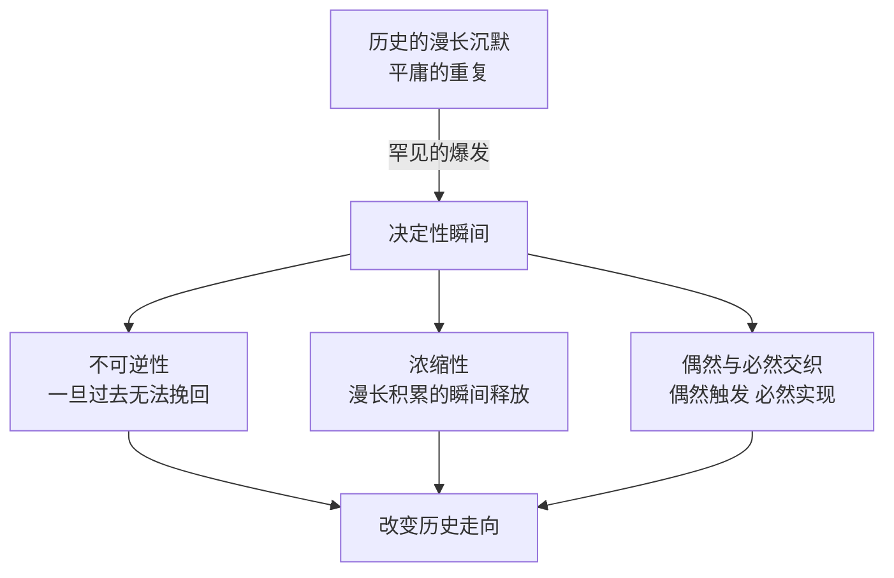
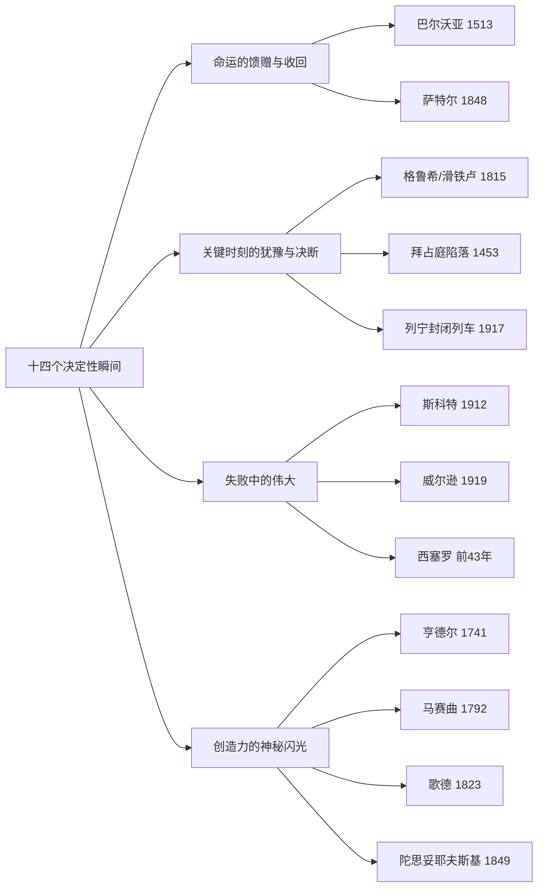
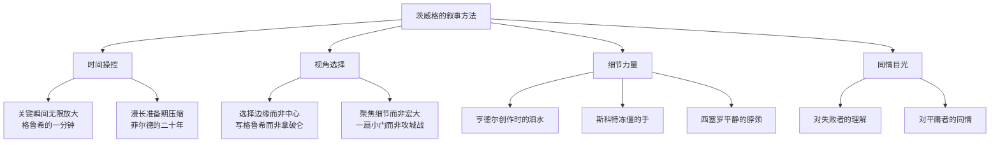
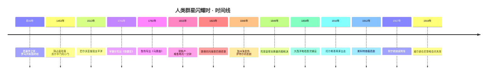

# 《人类群星闪耀时》深度读书笔记

> [!abstract] 全书速览
> 茨威格选取了人类历史上十四个决定性瞬间，用文学家的笔触重新讲述。这些瞬间有的只持续一分钟（格鲁希在滑铁卢的犹豫），有的浓缩于一扇被遗忘的小门（拜占庭的陷落），有的是绝境中的自我救赎（亨德尔写出《弥赛亚》）。茨威格的核心信念是：==历史并非均匀流淌，大多数时候不过是平庸的重复，但在某些罕见的瞬间，一个决定、一个行动、一次犹豫，就能永久改变人类的命运==。这本书不是严谨的史学著作，而是一个亲历了欧洲文明崩塌的作家，对命运、选择和人性的深情沉思。

---

## 历史坐标

斯蒂芬·茨威格（1881-1942），奥地利犹太裔作家，出生于维也纳一个富裕家庭，成长于欧洲文明的黄金时代。《人类群星闪耀时》初版于1927年，收录5篇历史特写，后经多次增补扩展至14篇。

> [!note] 理解作者的命运
> 茨威格亲历了两次世界大战对欧洲文明的摧毁——第一次世界大战摧毁了他熟悉的旧秩序，纳粹崛起让他失去祖国，第二次世界大战让他彻底失去对人类文明的信心。1942年，他在巴西流亡地与妻子双双自杀，遗言写道："我的精神家园欧洲已经毁灭了。"他笔下关于命运无常、理想幻灭和失败中的尊严的书写，同时也是他自己灵魂的自画像。

茨威格在文学谱系中属于"传记文学"的大师行列。他不是严谨的历史学家，而是用文学手法处理历史题材的艺术家。这决定了这本书的特质：价值不在于历史考证的准确，而在于对人类命运感的深刻捕捉。在茨威格之前，历史传记要么追求客观记录，要么服务于道德教化。茨威格开创了一种新的可能：把历史当作戏剧来写，把历史人物当作命运的承载者来理解，把历史事件当作人性极端状态的展示台。这种写法影响了后来无数的历史通俗写作者。

---

## 核心框架：决定性瞬间

茨威格的历史哲学可以用一个结构来呈现：

> [!tip] 核心洞见
> 历史是真正的诗人和戏剧家，但它不总是在创作。大部分时间里只是单调的记录。只有在某些瞬间，它才爆发出惊人的创造力——==把无数因果链条压缩到一个点上，让一个人的一个决定承载千钧之重==。

---

## 十四个瞬间的主题谱系

### 命运的馈赠与收回

**巴尔沃亚发现太平洋（1513年）**——巴尔沃亚是一个在西班牙因债务缠身的亡命徒，藏在木桶里偷渡到美洲。他不是贵族出身的探险家，不是受国王资助的航海家，只是一个走投无路的逃犯。但命运给了这个无赖一个非凡的机会：率领一百九十人的探险队穿越巴拿马地峡，寻找印第安人传说中的"南海"。穿越地峡的旅程极为艰苦——热带雨林、毒蛇猛兽、敌对土著、潮湿闷热的瘴气，二十五天的丛林挣扎。但当他独自爬上最后一座山峰，看到另一片浩瀚大洋在阳光下闪耀时，他跪下亲吻土地，泪流满面。这是欧洲人第一次看到太平洋。这个发现证明了美洲是独立大陆，在它的另一边还有一片全新的大洋。人类对地球的认知在这一刻发生了根本性的改变。仅仅几年后，麦哲伦就沿着这个发现的线索完成了环球航行。

但命运没有在荣耀中收场。巴尔沃亚很快被政敌佩德拉里亚斯陷害，以叛国罪被斩首。那些在后方安享权力的官僚嫉妒他的荣耀，捏造了罪名。发现太平洋的英雄死于卑鄙的政治阴谋。==命运给予的和命运收回的一样无情==。茨威格通过这个故事传达了贯穿全书的信念：伟大与卑微之间的界限远没有我们想象的那样分明。一个逃债的无赖可以完成改变人类认知的壮举，而一个发现新大洋的英雄可以像罪犯一样被处死。

**黄金国的发现（1848年）**——萨特尔是一个勤恳的农场主，拥有大片肥沃的土地、成群的牲畜、完善的农庄。他的工人在土地上发现了金子——这本应让他成为世界上最富有的人。但淘金热摧毁了他的一切。数万淘金者蜂拥而至，践踏农场、偷走牲畜、占据土地，对他的产权毫不在意。法律在疯狂面前形同虚设。他在法庭上打了无数场官司，最终穷困潦倒，在华盛顿国会台阶上乞讨公道，成为一个疯疯癫癫的老人。

> [!warning] 命运的讽刺
> 萨特尔的故事是茨威格笔下最具讽刺意味的一篇。一个人拥有了人类梦寐以求的东西——脚下的黄金——却恰恰因此失去了一切。黄金从他的土地上涌出，流向了全世界，唯独没有流向他自己。更深层的意味是：加州淘金热催生了美国西部大开发，改变了世界经济格局。==进步总是有代价的，而代价往往由最不该承受的人来支付==。一个人的毁灭成为一个国家崛起的序曲。

### 关键时刻的犹豫与决断

**拜占庭的陷落（1453年）**——千年帝国的毁灭不是因为正面城墙被攻破，而是因为凯尔卡门——一扇被遗忘的小门。守城者在混乱中忘记锁上它，土耳其士兵从这里涌入城内。

> [!tip] 深层洞察
> 在看似牢不可破的堡垒中，总有那么一扇被忽视的门。帝国的倾覆、文明的更替，往往不在正面，而在某个被忽视的角落。拜占庭的陷落还推动了希腊学者西迁意大利，成为==文艺复兴的重要推动力——一个文明的死亡成为另一个时代的序曲==。

**滑铁卢的一分钟（1815年）**——这是茨威格最著名的篇章。1815年6月18日，拿破仑与威灵顿在滑铁卢对峙。拿破仑把三分之一的军队交给格鲁希元帅，命令他追击普鲁士军，阻止他们与威灵顿会合。关键时刻，格鲁希和军官们正在一户农家吃早餐，远处传来隆隆炮声——那是滑铁卢主战场的方向。副官热拉尔将军恳求他放弃追击，立即率军赶往炮声方向。

但格鲁希犹豫了。拿破仑的命令是追击普鲁士军，他没有收到改变行动方向的新命令。服从命令还是相信直觉？在那一分钟里，格鲁希选择了服从。他继续追击已不见踪影的普鲁士军。这一分钟决定了一切——普鲁士军不是在撤退，他们绕了个弯正以急行军赶往滑铁卢。当他们杀入战场，拿破仑大败，帝国崩溃，欧洲历史改写。

> [!example] 茨威格的同情
> "格鲁希是一个正派、可靠、勇敢的人，但他只是一个普通人。他缺乏的是在决定性时刻超越自我的能力。"格鲁希不是坏将军，甚至不是平庸的将军——他只是一个"正常"的将军。但历史在那个瞬间需要的是一个非凡的将军。==命运把普通人推上需要非凡决断的位置，然后因为他们的普通而惩罚他们。在命运的十字路口，服从规则的美德可能变成致命的弱点。==

**封闭的列车（1917年）**——1917年4月，流亡瑞士十七年的列宁乘坐一列"封闭的列车"穿越德国返回俄国。德国当局允许他通过，是希望他能在俄国制造混乱，削弱协约国的力量。列车被称为"封闭的"——列宁和他的同志不能下车、不能与德国人接触，德国人害怕革命的"细菌"感染自己的国民。这是一个充满讽刺的瞬间：德国人以为自己在玩一场精明的地缘政治博弈，利用一个危险分子搅乱敌人后方。他们完全不知道自己正在运送的是一颗将改变整个世界的炸弹。几个月后十月革命爆发，改变了俄国、改变了世界、改变了整个二十世纪的进程。==历史的重大转折往往发生在最不起眼的时刻==。那些自以为在操纵棋局的人，完全没有意识到他们正在释放什么样的力量。

### 失败中的伟大

**斯科特的悲剧（1912年）**——1912年1月，英国探险家斯科特率队经过两个多月的艰苦跋涉终于到达南极点，却发现挪威人阿蒙森的旗帜已经插在那里——阿蒙森比他早到了三十五天。失望是毁灭性的，但真正的悲剧还在后面。返程中暴风雪、食物短缺、冻伤和体力衰竭一步步吞噬着队伍。队员奥茨意识到自己拖累了同伴，在暴风雪中走出帐篷，说了一句："我出去走走，可能要过一会儿才回来。"他再也没有回来。斯科特和最后两名队友在距补给站仅十一英里处被暴风雪困住，活活冻死。他的最后日记写了很多信——给妻子、给母亲、给国家——没有一句抱怨，没有一句后悔，只是平静地告别。

> [!quote] 斯科特的最后文字
> "这些粗糙的笔记和我们的尸体会告诉这个故事。"

==失败也可以是伟大的——斯科特在绝境中展现的勇气和尊严，比任何胜利都更打动人心==。茨威格的判断是：斯科特没有赢得竞赛，但他赢得了不朽。他的悲剧唤起的崇敬不亚于阿蒙森的成功。

**威尔逊的失败（1919年）**——1919年1月，美国总统威尔逊带着"十四点计划"来到巴黎和会。当他的轮船驶入法国港口时，数十万欧洲人涌上街头欢迎——他们把这个大洋彼岸的总统当作救世主。但威尔逊遇到了英国首相劳合·乔治和法国总理克里蒙梭的算计：他们要惩罚德国、瓜分战利品。威尔逊的理想主义在冷酷的现实政治面前节节败退。凡尔赛条约的苛刻条款——巨额赔款、领土割让——埋下了二战的种子。

更大的悲剧在回国后：国会拒绝批准他一手创建的国际联盟。他为之奋斗的一切在自己的国家遭到否定。威尔逊在挫败中中风，在最后几年成为半瘫痪的幽灵，眼看自己预见的灾难一步步逼近。

> [!warning] 被时代辜负的先知
> ==正确的想法出现在错误的时间，可能比错误的想法更加悲剧==。威尔逊来到巴黎时被当作救世主欢迎，离开时已被嘲笑为天真。但二十年后第二次世界大战的爆发证明了他的远见——联合国的诞生正是他国际联盟理念的延续。只是这个证明来得太晚、太惨烈了。

**西塞罗的最后时刻（公元前43年）**——凯撒遇刺后的罗马陷入权力真空。西塞罗是共和国最后的捍卫者，用他最锋利的修辞武器——系列演说《反腓力辟》——攻击安东尼的专权野心。但历史的潮流不可逆转。屋大维和安东尼达成"三头同盟"，西塞罗被列入公敌名单。他知道死亡将至，朋友劝他逃跑，但他选择不逃。当刺客找到他时，他平静地伸出脖子："砍吧，你熟练的话。"

西塞罗可以逃跑、躲藏、苟活。但他知道逃跑只能延长生命，却会毁掉他作为共和国捍卫者的全部意义。他输给了历史的潮流，但没有输给自己的信念。他的死标志着罗马共和国的终结，但他的文字和精神跨越两千年，至今仍在影响西方政治思想。

### 创造力的神秘闪光

**亨德尔的复活（1741年）**——六十岁的亨德尔遭遇人生最低谷：中风导致半身不遂，债台高筑，创作枯竭，曾经追捧他的伦敦观众已将他遗忘。但在一个夏天的夜晚，诗人詹宁斯送来一份清唱剧脚本《弥赛亚》。亨德尔读到歌词时灵感如闪电击中。接下来二十四天他近乎疯狂地创作：足不出户，废寝忘食，泪流满面。

> [!tip] 创造力的本质
> 创造力是神秘的——它可以在最意想不到的时刻、以最不可思议的方式复活。亨德尔在绝境中找回了创造力的火焰。当他写完最后一个音符，泪流满面地喃喃："我以为我看到了整个天堂，还有上帝本人。"这不是宗教的虔诚，而是创造的极致狂喜——一个艺术家在完成一生最伟大作品时的近乎神圣的体验。《弥赛亚》成为巴洛克音乐的巅峰，至今在全世界演出。

**马赛曲的诞生（1792年）**——1792年法国向奥地利宣战，斯特拉斯堡市长请求驻军上尉鲁热·德·利尔为军队写一首战歌。鲁热在那个夜晚写出了《莱茵军团战歌》——后来被称为《马赛曲》。茨威格反复强调：鲁热此前此后都是平庸的人，其他作品默默无闻，一生碌碌无为。但那一个夜晚，天才短暂降临。这首歌像野火一样传遍法国，成为革命号角，至今是法国国歌。

茨威格的解释是：==创造力有时不属于个人，而属于时代==。大革命需要一首歌来表达自己，它通过鲁热的手完成了这件事。鲁热只是一个媒介。==天才不一定是持续的状态，也可能是瞬间的闪光。一个人一生中可能只有一个闪光时刻，但那就够了==。

**歌德的暮年爱情（1823年）**——七十四岁的歌德在捷克温泉小镇玛丽恩巴德遇到十九岁的乌尔丽克。他陷入疯狂的爱情，向她求婚，被婉拒。在离开的马车上写下《玛丽恩巴德悲歌》——被认为是他最伟大的抒情诗之一。据说写完后他把自己关在房间里，整整一周不见任何人。当他再次出现时已经平静了——不是因为忘记了乌尔丽克，而是因为他把痛苦变成了艺术。

这不是老人可笑的迷恋，而是生命力的最后燃烧。==活着，就意味着仍然能够被深深触动==。他把痛苦变成了艺术——这是创造者的特权：把个人的苦难转化为人类共同的遗产。

**陀思妥耶夫斯基的假枪决（1849年）**——1849年12月22日，二十八岁的陀思妥耶夫斯基因参与别林斯基小组的政治活动被判死刑。在彼得堡的谢苗诺夫广场上，他和其他囚犯被蒙上眼睛，绑在行刑柱上，听到装填子弹的声音。死亡近在咫尺。然后，赦免令被宣读了——这是沙皇尼古拉一世精心设计的心理酷刑：让囚犯经历死亡的全部恐惧，在最后一刻赦免为苦役，以此彰显"皇恩浩荡"。在那几分钟里，整个人生在眼前闪过，对存在、死亡、生命意义的认知被彻底重塑。茨威格认为，他在那几分钟里看到了生命的赤裸本质——那种只有在死亡的阴影下才能显现的、无可逃避的本质。

这个瞬间改变了他的一切。此后的[[《罪与罚》]][[《白痴》]][[《卡拉马佐夫兄弟》]]都带着那个瞬间的深深烙印。他对存在、罪恶、救赎的全部思考都源于站在枪口前的那几分钟——那个发现太过强烈，以至于他用余生的全部写作来消化它。==极端的经历可以催生深刻的洞见==——有些认知无法通过阅读获得，只能通过经历。

**大西洋电缆（1858年）**——美国商人赛勒斯·菲尔德产生了一个疯狂想法：在大西洋底铺设电报电缆。他不是科学家也不是工程师，只是一个执着到近乎偏执的商人。从1854年到1858年经历无数次失败：电缆断裂、资金链断裂、合作伙伴退出。1858年第一条电缆铺设成功，但只工作几周就失灵。他从英雄变为骗子——人们说他浪费数百万美元，说他是疯子。但菲尔德的回应只有一个：继续。又花八年，1866年永久性电缆终于铺设成功。

> [!example] 坚持的力量
> ==伟大的成就需要超常的坚持。菲尔德不是天才，只是一个不肯放弃的普通人==。当第一条电缆失败时，他从荣誉到耻辱骤然坠落。但这次坠落教会了他：荣誉是脆弱的，只有信念是坚实的。八年后再次成功时，他知道了荣誉的虚幻，也知道了坚持的真正价值。

**托尔斯泰的出走（1910年）**——八十二岁的列夫·托尔斯泰在一个深夜离家出走，离开他的庄园——那里有他的财富、声望、家庭和一切世俗成就。他想成为朝圣者，像普通农民一样生活，实践他几十年来宣扬的信念：简朴、非暴力、精神自由。但他的身体无法支撑这个梦想，几天后病倒在阿斯塔波沃的一个小火车站，很快去世。

死在一个小火车站的站长室——这个场景本身就是深刻的隐喻：一个伟大的灵魂离开华丽的庄园后，死在最普通、最卑微的地方。但对托尔斯泰来说，这也许正是他想要的结局——不是作为一个贵族和大作家死去，而是作为一个追寻真理的普通人死去。他用生命的最后行动证明了：他的信仰不只是写在纸上的漂亮话，而是可以用生命践行的真理。==即使在生命的尽头，人仍然可以选择忠于信念==。

---

## 贯穿全书的深层主题

### 个体与命运的不对称

茨威格笔下反复出现的一个模式：普通人被命运推到超出其能力范围的位置。格鲁希是正常的将军，但命运需要非凡的将军。鲁热是平庸的上尉，但时代需要通过他写出一首改变国家命运的歌。菲尔德不是工程天才，但技术进步需要通过他的坚持来实现。

> [!note] 双重含义
> 这种"不对称"既包含英雄主义的普遍化——==伟大不是少数人的专利，在命运的召唤面前每个人都有可能被点燃==——也包含深刻的悲悯：被命运选中的人往往并没有准备好。格鲁希被惩罚不是因为做了错事，而是因为在错误的时刻不够伟大。这种惩罚的不公正性，正是茨威格同情的来源。

### 创造与毁灭的共生

十四个故事中，创造和毁灭往往是同一枚硬币的两面：

- 拜占庭的陷落（毁灭）推动了文艺复兴（创造）
- 淘金热摧毁了萨特尔（毁灭），催生了美国西部（创造）
- 陀思妥耶夫斯基经历假枪决的心理毁灭，获得了文学创造的源泉
- 歌德在爱情中遭受拒绝的痛苦，正是写出不朽诗作的原料

> [!warning] 进步的代价
> 茨威格似乎在暗示：==历史进步总是有代价的，而代价往往由最不该承受的人来支付==。萨特尔为美国西部大开发付出了个人毁灭的代价，拜占庭臣民为文艺复兴付出了国破家亡的代价。这是一种带着悲伤的历史观——它承认进步，但拒绝粉饰进步的代价。

### 时间的不可逆与选择的庄严

"不可逆性"是茨威格反复强调的概念，含义比"过去无法挽回"更深。他认为决定性瞬间的本质就在于不可逆——正是因为不能重来，它才具有千钧之重。如果格鲁希可以重新选择，如果守城者可以回去锁门，那这些瞬间就失去了悲剧力量。

不可逆性也赋予了失败者特殊的尊严。斯科特的失败之所以感人，正是因为它是最终的——没有第二次机会。西塞罗的死之所以庄严，正是因为不可挽回——他选择了面对而非逃避，这个选择一旦做出就不能撤销。==正是不可逆性让选择变得庄重，让人在命运面前的姿态具有了永恒的意义==。

### 先知与时代的错位

茨威格对"不合时宜的正确"有特殊的敏感。威尔逊看到了世界需要国际合作与集体安全，但1919年的世界还没有准备好。菲尔德的第一条大西洋电缆不是理念的失败，而是技术尚未成熟。托尔斯泰的简朴生活理想至今仍是人类面临的深刻问题。

> [!tip] 最深刻的悲剧
> ==历史上最深刻的悲剧不是错误战胜了正确，而是正确出现在了错误的时间。==这个洞察与茨威格自己的命运深深共鸣——他对欧洲和平与文明的信仰并没有错，只是这个信仰在两次世界大战面前为时过早。

---

## 与其他历史著作的对话

**与年鉴学派的对比**。布罗代尔关注"长时段"——地理环境、人口变迁、经济结构这些缓慢演变的深层力量。在他看来，个人决定不过是大海表面的浪花。茨威格恰恰相反——他关注最短的时段，历史中最极端、最浓缩、最具个人色彩的瞬间。两种视角各有洞见也各有盲区，完整的历史理解需要同时容纳两者。

**与托尔斯泰的分歧**。有趣的是，茨威格选择了托尔斯泰作为主角之一，但两人的历史观根本不同。托尔斯泰在[[《战争与和平》]]中主张历史不是由英雄推动的，拿破仑和库图佐夫不过是历史潮流的工具。而茨威格整本书都在论证个人选择的决定性力量。这种分歧本身就是史学最古老的争论之一。

**与修昔底德的联系**。茨威格对命运无常的关注可以追溯到古希腊历史学传统。修昔底德记述伯罗奔尼撒战争时，同样关注关键决策如何导致不可逆后果——雅典远征西西里如何毁灭了一个帝国。两者共同点是对"不可逆性"的敏感，以及对人在命运面前有限性的清醒认识。

**与卡莱尔的英雄史观**。英国历史学家托马斯·卡莱尔在《论英雄和英雄崇拜》中提出了最纯粹的英雄史观：历史就是伟人的传记。茨威格和卡莱尔有相似之处——都关注个体在历史中的决定性作用——但有一个根本区别。卡莱尔笔下的英雄是自觉的、主动的、超凡的人物。茨威格笔下的"英雄"大多是被动的、偶然的、普通的人——他们不是选择了历史，而是被历史选择了。格鲁希不想成为决定拿破仑命运的人，鲁热不想成为法国国歌的作者。茨威格的英雄观比卡莱尔更民主，也更悲悯。

---

## 茨威格的叙事技艺

茨威格不是在写历史，而是在写戏剧。他的核心技巧是**时间的压缩与扩展**——关键瞬间被无限放大，而漫长的准备期被压缩为背景。他总是选择**最出人意料的视角**——写滑铁卢不写拿破仑而写格鲁希，写拜占庭陷落不写攻城战而写一扇小门。他对**细节的捕捉**令人惊叹——亨德尔的泪水、斯科特的笔迹、西塞罗的平静，这些细节把抽象的"历史"还原为具体的"人"。

最重要的是他的==同情目光==：对失败者不谴责只理解，对平庸者不嘲笑只悲悯。这源自他的人文主义信念——每个人都在自己的局限中尽力而为，不能用成败来定义价值。

茨威格的语言还有一种罕见的诗意。他不只是在记录事件，而是在创造情感体验。读他描写巴尔沃亚发现太平洋的段落，你能感受到敬畏和狂喜；读他描写斯科特最后日记的段落，你能感受到绝望中的平静。这种语言风格也是这本书能够跨越时代的重要原因——学术著作会因新发现而过时，但文学作品的感染力是永恒的。

---

## 阅读的边界

> [!warning] 需要注意的局限

**历史准确性**：茨威格是作家而非历史学家。凯尔卡门的细节在不同文献中有不同记载，格鲁希的决策过程比书中呈现的更加复杂。应当作历史文学而非历史研究来读。

**英雄史观偏向**：聚焦个人的决定性作用，可能忽视结构性因素。滑铁卢的结果真的取决于格鲁希一人吗？从马克思到布罗代尔的结构主义史学传统会给出不同答案。==个人选择与结构力量谁更重要，是永恒的史学争论，茨威格明显倾向前者==。

**欧洲中心主义**：十四个瞬间几乎全部来自西方世界。人类历史上的"群星闪耀时"远不止这些，这是时代和文化背景的局限。

**浪漫化倾向**：对英雄主义有近乎浪漫的偏爱。斯科特的失败也有自身决策失误的因素，威尔逊的失败也与他刚愎自用的性格相关。茨威格为叙事动人牺牲了部分复杂性。

---

## 茨威格与他的时代

回头看这本书，最动人的阅读方式是将它视为茨威格自己灵魂的写照。他选择的十四个故事几乎都呼应着他自己的处境：

- 写**威尔逊的失败**——也许是在投射自己对欧洲和平梦想的幻灭
- 写**斯科特在绝境中的尊严**——也许是在想象自己面对文明终结时应如何自处
- 写**托尔斯泰的精神追寻**——也许是在写自己流亡中寻找精神家园的渴望

> [!quote] 茨威格的遗言（1942年）
> "我的精神家园欧洲已经毁灭了。在这个我已经不属于的世界里继续活下去，对我来说已经没有意义。"

这段遗言与书中关于失败者的尊严、关于理想主义者被时代碾碎的叙事，形成了令人心碎的互文。==这本书不只是关于历史，也是关于茨威格自己——一个深受时代创伤的人对人类命运的最后沉思==。

---

## 以史鉴今

### 识别你生活中的"凯尔卡门"

看似牢不可破的系统中总有被忽视的薄弱点。无论是组织管理还是个人项目，致命的漏洞往往不在最显眼的地方，而在那些"理所当然"的角落。拜占庭的正面城墙坚不可摧，但一扇被遗忘的小门就足以让千年帝国陷落。

在你的工作和生活中也是如此。你可能把所有精力放在了最大的风险上——竞争对手、市场变化、技术迭代——却忽略了一个被搁置的内部问题、一段未维护的关键关系、一个"总会有人处理"的流程漏洞。茨威格的故事提醒你：灾难往往不来自你正面防备的方向，而来自你理所当然地忽视的角落。

### 面对"格鲁希时刻"的准备

当你处于需要做出重大抉择的时刻——服从既有规则还是相信自己的判断——记住格鲁希的教训：在决定性瞬间，谨小慎微的遵从可能比冒险的决断代价更大。

格鲁希的问题不在于他不够勇敢，而在于他把服从命令看得高于独立判断。在日常工作中，服从规则通常是正确的策略。但在那些极端的、非常规的时刻——当你的直觉告诉你情况已经根本改变，而旧规则不再适用——你需要有勇气做出自己的判断，并承担由此产生的责任。关键不在于你是否会犯错，而在于你是否敢于承担责任。

### 重新理解失败

不是所有失败都因为能力不足。有时候只是正确的想法出现在了错误的时间。威尔逊的国际联盟理念并没有错——联合国的诞生证明了这一点——只是1919年的世界还没有准备好。菲尔德的第一条大西洋电缆失败了，不是因为理念错误，而是因为技术尚未成熟。

用这个视角审视你自己经历过的某些挫折，也许会发现不同的意义。也许你提出了一个正确但超前的商业方案，也许你坚持了一个正确但不合时宜的立场。失败不一定意味着你错了——它可能只意味着时机还没到。

### 坚持与放弃的辩证

菲尔德的故事和萨特尔的故事构成了一对有趣的对比。菲尔德花二十年坚持铺设电缆，最终成功——坚持创造了奇迹。但萨特尔花了后半辈子在国会台阶上乞讨公道，最终穷困而死——坚持变成了徒劳。如何区分值得坚持的信念和应该放弃的执念？茨威格没有给出明确答案，但他的故事暗示了一点：区别在于你坚持的是一个不断被现实验证的方向（菲尔德的电缆技术在进步），还是一个已经被现实否决的诉求（萨特尔的产权在无政府状态下毫无意义）。

### 创造力的启示

亨德尔和鲁热的故事对所有从事创造性工作的人都有启示：突破性的创造往往不是稳定输出的结果，而是在特定条件下的爆发。如果你正在经历创造力的枯竭，不要绝望——亨德尔在六十岁、在人生最低谷时写出了他最伟大的作品。如果你曾经有过一个闪光的时刻但此后归于平淡，不要否定那个时刻的价值——鲁热一生只有一个闪光时刻，但那就够了。

痛苦、挫折和绝境往往是创造力最强大的催化剂。歌德把爱情的痛苦变成了诗歌，陀思妥耶夫斯基把死亡的恐惧变成了文学。茨威格的故事提醒你：不要浪费你的痛苦——它可能是你最宝贵的创造原料。

---

## 十四个瞬间的时间线

---

## 核心洞见总结

> [!abstract] 十个核心洞见

1. ==历史不是均匀流淌的==——大部分时间是平庸的重复，只有少数瞬间具有决定性意义
2. ==命运的转折往往系于微小的偶然==——一扇未关的门、一分钟的犹豫
3. ==任何人都可能成为历史的主角==——命运不看资历，只看你在那个瞬间的选择
4. ==服从规则的美德可能变成致命弱点==——关键时刻需要超越常规的独立决断
5. ==天才可能只是瞬间的闪光==——一个人一生中可能只有一个伟大时刻，但那就够了
6. ==失败也可以是伟大的==——斯科特的悲剧唤起的崇敬不亚于阿蒙森的成功
7. ==正确的想法出现在错误的时间是悲剧==——威尔逊被时代辜负
8. ==极端的经历可以催生深刻的洞见==——陀思妥耶夫斯基的假枪决改变了文学史
9. ==伟大的成就需要超常的坚持==——菲尔德花了二十年铺设大西洋电缆
10. ==即使在生命的尽头，人仍然可以选择忠于信念==——托尔斯泰的出走

---

## 这本书为什么至今仍值得读

《人类群星闪耀时》出版近一百年来持续被翻译和阅读。一本历史准确性受到质疑、英雄史观受到挑战的书，为什么没有过时？

> [!note] 超越知识的感受
> 茨威格提供的不是知识，而是感受。他让你"感受到"历史的重量——那些决定性瞬间的紧张、不可逆的压力、命运的无常和人在命运面前的渺小与尊严。历史学家告诉你发生了什么，茨威格让你体验那些事件降临在具体的人身上时是什么感觉。

更深的原因在于：茨威格触及的主题——偶然与必然、个人与命运、成功与失败、创造与毁灭——是永恒的人类主题。它们不会因为时代的变迁而过时。任何时代的读者都能在格鲁希的犹豫中看到自己面对抉择时的影子，在斯科特的日记中体会到对失败的重新理解，在亨德尔的复活中获得对创造力的信心，在威尔逊的悲剧中感受到正确与时机之间的永恒张力。茨威格证明了最好的历史写作不是让人获得信息，而是让人获得体验——穿越时空站在那些当事人身边，感受他们的恐惧、犹豫、狂喜和绝望。

==这本书最终传达的是一种态度——面对命运的不可预知和不可逆转，人唯一能做的就是在自己的瞬间里做出无悔的选择。==

---

## 延伸阅读

- [[《昨日的世界》]]：茨威格的自传，记录了他亲历的欧洲文明从巅峰到毁灭的全过程，是理解《人类群星闪耀时》的最佳背景。两本书合在一起才是理解茨威格的完整图景
- [[《一个陌生女人的来信》]]：茨威格最著名的小说，同样关注命运的不可逆和极端心理。和历史特写对照阅读，可以看到茨威格始终在追问同一个问题
- [[《三大师传》]]：茨威格为巴尔扎克、狄更斯、陀思妥耶夫斯基写的传记，展现了他分析创造性天才的独特视角
- [[《历史的教训》]]：威尔·杜兰特对历史规律的反思，提供更结构化的历史视角，与茨威格对个体命运的关注形成对照
- [[《枪炮、病菌与钢铁》]]：从结构性因素解释历史走向，是对茨威格英雄史观最有力的补充。戴蒙德认为决定历史的不是个人选择，而是大陆的形状和病菌的传播

---

> [!quote] 写在最后
> 这本书改变认知的地方在于：它让你意识到历史不是匀速流淌的——大部分时间是沉默的，只有极少数瞬间承载了全部的重量。而在那些瞬间中，被推上舞台的往往是普通人，命运对他们的要求远超他们的准备。茨威格用他对命运的敬畏和对人性的同情，写下了十四个这样的瞬间。读完这本书，你会用不同的眼光看待历史中的每一个选择、每一次犹豫、每一个看似微不足道的细节——因为你知道，在某个你意想不到的时刻，一个微小的决定可能改变一切，而且永远不能重来。
