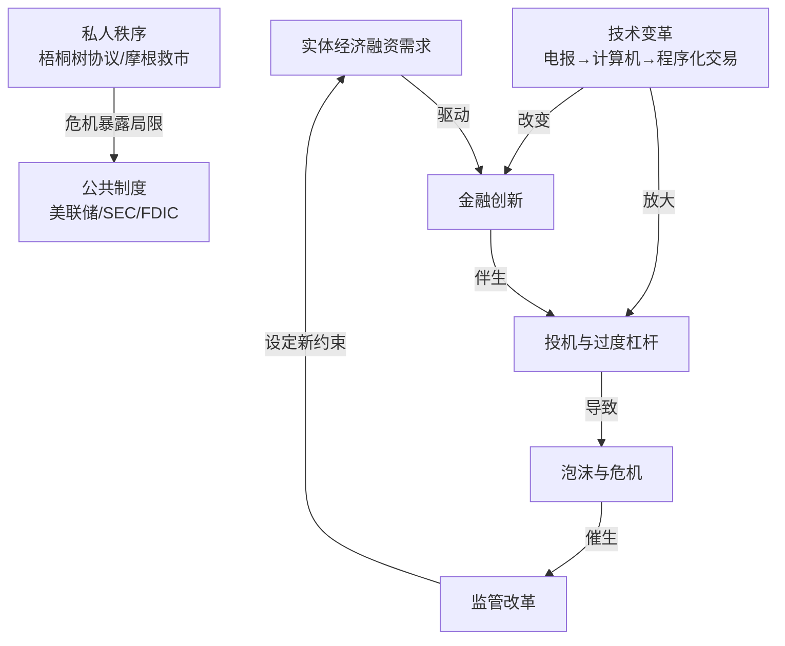
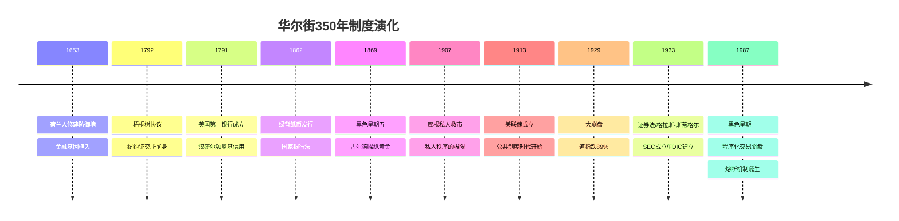
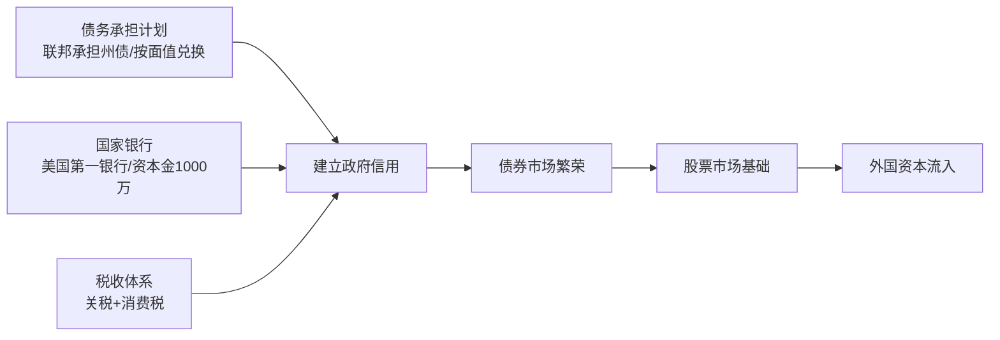
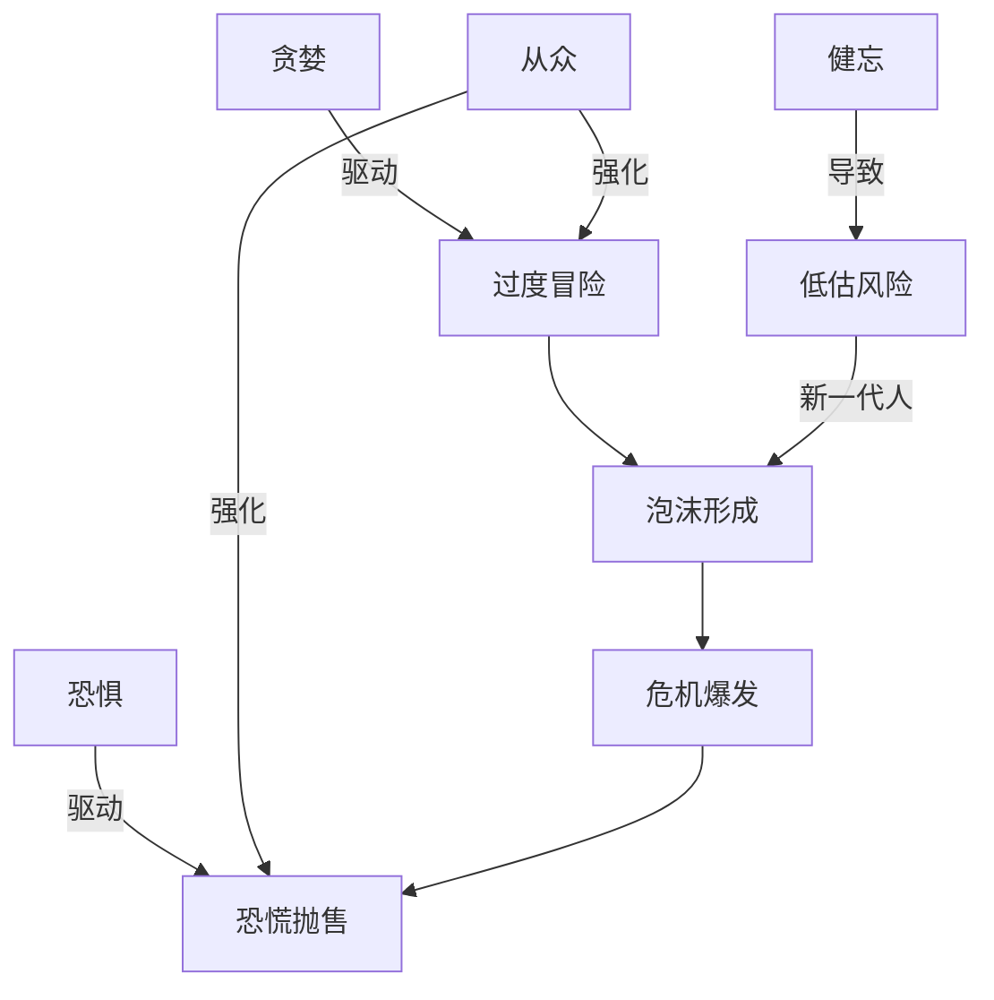

# 《伟大的博弈》深度读书笔记

> [!abstract] 全书速览
> 这是一部华尔街350年的编年史。戈登从1653年荷兰人在曼哈顿修建防御墙讲起，追溯美国资本市场从无到有、从混乱到秩序的完整历程。全书的核心主线是：==经济需求驱动金融创新，创新伴生投机与危机，危机催生监管改革，改革又为下一轮创新设定约束条件——这个螺旋式上升的过程构成了华尔街的全部历史==。人性中的贪婪、恐惧和健忘是这个循环的永恒动力，而制度的演化是限制其破坏力的唯一手段。读完这本书，你会明白一个基本事实：今天市场上发生的一切，历史上都发生过；而人性从未改变。

## 这本书要解决什么问题

华尔街是怎么来的？它经历了什么？为什么它会变成今天这个样子？戈登要讲述的，是美国资本市场如何从一群投机者在梧桐树下的交易，发展成全球最大、最有影响力的金融市场。在这个过程中，无数人物登场——有远见的制度设计者、无所顾忌的投机者、权倾一时的私人银行家、狂热的散户群体、迟到的监管者——他们的故事构成了这部金融史诗。

> [!note] 作者定位
> 约翰·斯蒂尔·戈登不是经济学家，而是商业史记者。他长期为《美国遗产》杂志撰稿，以将复杂经济史讲述为引人入胜的故事著称。这既是他的优势（不被学派预设束缚，能以讲故事者的直觉捕捉学术论文中容易忽略的细节和人性维度），也是他的局限（分析框架相对朴素，对深层结构性因素处理不够系统）。本书在金融史谱系中的位置：不如[[《疯狂、惊恐和崩溃》]]那样有理论深度，不如《摩根财团》那样在单个主题上挖掘细致，但提供了一个无可替代的全景视角——让你在一本书里看到华尔街完整的演化轨迹。

## 核心分析框架

三条相互嵌套的分析线索：

- **"需求—创新—危机—监管"的螺旋**：每个历史阶段都遵循这个逻辑。螺旋不断上升——每次循环后市场更大、工具更复杂、监管更完善，但新的脆弱点也在生成。金融市场的演化不是线性进步，而是螺旋式过程：同样的问题在不同层面反复出现，但每次出现时背景和复杂性都有所不同
- **"私人秩序"向"公共制度"的渐进转型**：从梧桐树协议到摩根救市，再到美联储和SEC。但转型从未完成——影子银行和场外衍生品证明，制度覆盖范围总是滞后于创新速度。私人秩序和公共制度不是简单替代关系，而是持续张力——公共制度提供基本框架，框架缝隙中私人秩序（行业惯例、声誉机制）仍发挥重要作用
- **技术变革对市场结构的重塑**：每一次技术革命都改变了信息传播速度、交易执行方式和参与者构成。技术是中性的，但它放大人性中已有的倾向——电报加速了价格发现也加速了恐慌传染，计算机提高了效率也在1987年制造了程序化交易崩盘。速度越快，留给人类理性思考和纠偏的时间就越少

> [!tip] 核心洞察
> 理解这个嵌套结构比记住任何单一历史事件都更重要。==华尔街的进步不是靠人性的改善，而是靠制度的演化——而制度演化的唯一动力，几乎总是危机。==

## 华尔街演化时间线

## 历史的六个关键阶段

### 第一阶段：荷兰遗产与金融基因（1650s-1790s）

> [!note] 华尔街的诞生
> "华尔街"名字来自1653年荷兰人修建的防御木墙。讽刺的是，这道墙从未发挥军事作用——英国人从海上进攻，荷兰人不战而降。但荷兰人带来了比一道墙重要得多的东西：现代金融市场的几乎所有核心工具。

17世纪的荷兰是全球金融创新的中心。这个小国之所以成为世界头号贸易强国，很大程度上是因为它率先发展出了将风险分散和资本汇聚的金融技术。荷兰人带来的金融遗产包括：

- **荷兰东印度公司**（1602年）——世界第一家股份公司，创造了公开发售股票的概念，让成千上万个素不相识的投资者可以共同为一个巨大的商业冒险提供资金
- **阿姆斯特丹证券交易所**（1611年）——第一个正式的证券交易场所，为股票提供了流动性，大大降低了投资门槛
- **金融工具**——卖空、期权、期货等概念和实践，甚至1637年的"郁金香狂热"——人类第一个有据可查的投机泡沫——也发生在荷兰

当荷兰殖民者来到新阿姆斯特丹时，他们带来的不只是贸易技能，还有整套金融文化。1664年英国人接管后改名纽约，但这些金融基因融入了纽约的商业传统中——这解释了为什么纽约而不是波士顿或费城最终成为了美国的金融中心。早期的金融活动在咖啡馆（尤其是通廷咖啡馆）进行，交易粗糙、不透明，欺诈是家常便饭。

1792年，24位经纪人在华尔街68号梧桐树下签署"梧桐树协议"——约定相互优先交易、收取固定佣金。这是纽约证券交易所的前身。

> [!warning] 制度演化的起点
> 梧桐树协议本质上是一个卡特尔协议，目的是垄断交易和保护利润。但它客观上创造了有组织的交易场所，降低了交易对手风险，提高了流动性。==金融制度的演化往往不是由高尚动机驱动的，而是由自利行为在特定条件下的自发组织。==但也不要过于浪漫化这种自发秩序：梧桐树协议同时也是垄断工具，固定佣金制度持续了近两百年直到1975年才被废除。自利行为可以产生有益的制度，但这些制度往往同时服务于创造者的私利——这种双重性贯穿了华尔街的整个历史。

### 第二阶段：汉密尔顿的金融革命（1780s-1800s）

独立战争后的美国面临严峻财政危机：约8000万美元战争债务、没有统一货币（各州自行发行信用低下的纸币）、联邦政府几乎没有税收来源。在邦联条例下，联邦政府连强制征税的权力都没有——独立战争本身就是因反对英国征税而打起来的，新政府在征税问题上面临巨大政治障碍。第一任财政部长汉密尔顿面对的根本问题是：**如何为一个新生国家建立金融信用？**没有信用就没有借贷，没有借贷政府就无法运转，新生的共和国就可能夭折。这不是学术问题，而是生死存亡的问题。

汉密尔顿提出了三大支柱：

> [!example] 信用的代价
> 大量战争债券已被投机者以面值10-15%收购，按面值兑换意味着投机者获得六到十倍暴利，而那些在困难时期被迫廉价出售债券的退伍军人什么都得不到。杰斐逊和麦迪逊认为极不公平，主张区分原始持有者和投机者，给予不同兑换条件。
>
> 但汉密尔顿的逻辑不在于公平，而在于信用：如果政府开始区分"好的"和"坏的"持有者，那么未来任何人购买政府债券时都要担心自己会被归入"坏的"一类——债券的流动性和可信度就会受到根本损害。债券之所以有价值，正是因为它可以在二级市场上自由买卖——不管谁持有它，政府都按同一个条件兑换。破坏这个原则就是破坏债券市场的基础。==建立政府信用比追究公平更重要。==短期的不公平是建立长期信用的必要代价。

**第二个支柱是国家银行。**1791年成立的美国第一银行资本金为1000万美元，作为财政部的代理银行、政府资金的保管人和信贷来源。它还可以发行银行券，在一定程度上解决了货币混乱的问题。但第一银行的成立同样充满争议——杰斐逊认为宪法没有授权联邦政府建立银行，这是对州权的侵犯。汉密尔顿通过对宪法"必要和适当条款"的广义解释赢得了这场辩论。

**第三个支柱是税收体系。**通过关税和消费税（包括引发了"威士忌叛乱"的酒税）为偿债提供收入来源。在没有现金经济的边疆地区，威士忌实际上充当了货币角色，酒税因此引发了西部农民的强烈反对。华盛顿总统亲自率领军队镇压了叛乱——这本身就是联邦政府权威的一次关键性展示。

汉密尔顿方案的效果立竿见影：美国政府债券价格从面值的15-20%迅速上涨到面值甚至溢价。荷兰和英国投资者开始大量购买美国债券——外国资本的流入为美国经济发展提供了急需的资金。债券市场的繁荣为股票市场铺平了道路——当投资者在债券市场上建立了交易习惯和信任之后，转向风险更高的股票市场就成为自然的下一步。

> [!note] 两种国家愿景的碰撞
> 汉密尔顿 vs 杰斐逊的分歧不仅是政策层面的——它反映了两种截然不同的国家愿景：杰斐逊设想以自耕农为基础的农业共和国，警惕城市、工业和金融的力量；汉密尔顿设想以工商业为引擎的现代经济体，金融市场是将储蓄转化为投资的关键机制。历史证明汉密尔顿的愿景更接近现实，但杰斐逊对金融权力过度集中的警告从未完全过时——从镀金时代的"强盗大亨"到2008年的"大而不能倒"，这种张力贯穿了整部华尔街历史，也贯穿了美国的政治史。

这段历史提供了一个深刻的制度设计洞察：==信用不是自然生成的，它需要被刻意建立，而且建立信用的过程往往需要支付道德上令人不舒服的代价。==汉密尔顿明知让投机者获利不公平，但他选择了信用优先——没有信用就没有市场，没有市场就没有经济增长，没有经济增长则公平就是空谈。这个原则在今天的新兴市场国家依然具有现实意义。

### 南北战争：现代金融的催化剂（1860s）

> [!note] 战争的金融遗产
> 南北战争在美国金融史上的意义常常被低估。战争的巨大融资需求——联邦政府需要筹集约34亿美元——推动了一系列金融创新，极大扩展了华尔街的规模和影响力。

杰伊·库克领导的政府债券销售运动是美国第一次大规模公共证券营销。他创造性地将债券销售从金融精英圈子扩展到普通公众——在全国各地雇佣数千名代理人，在报纸上大做广告，将购买战争债券与爱国主义捆绑。这不仅成功筹集了资金，更在数百万普通美国人心中播下了投资证券的意识——这些人在战后自然成为股票市场的潜在参与者。

战争还催生了1862年的《法律货币法》和国家银行法。联邦政府第一次发行了全国统一的纸币（"绿背纸币"），并建立了国家银行体系来取代此前混乱的州立银行券。虽然这个体系在货币供给弹性方面存在缺陷（为后来多次金融恐慌埋下伏笔），但它是朝着建立统一国内金融市场迈出的关键一步。

> [!tip] 战争与铁路的连接
> ==战争期间建立的金融基础设施——全国性的债券市场、统一的货币、广泛的投资意识——恰好为战后铁路的大规模融资提供了条件。==没有战争期间的金融发展，铁路融资的规模不可能达到后来的水平。历史事件之间的因果链条，往往比表面看到的更加紧密。

### 第三阶段：铁路时代与"强盗大亨"（1840s-1900s）

铁路是19世纪美国的"互联网"——最大的投资主题、最大的资本消耗器和最大的投机对象。一条主要铁路线的建设成本动辄数千万美元（联合太平洋铁路超过1亿美元），远超任何个人承受能力，只能通过向公众发行股票和债券融资。华尔街由此从债券市场扩展为股票市场，到1850年代铁路股票占据交易所的绝对主导地位。

但铁路融资的爆发式增长发生在监管真空中——没有联邦证券法、没有信息披露要求、没有对市场操纵的有效约束、会计标准几乎不存在。在这个环境中崛起的"强盗大亨"：

- **范德比尔特**：从航运转铁路，控制纽约中央铁路——既是投机者也是经营者，改善铁路运营效率、降低票价。在"强盗大亨"中最接近真正企业家。去世时留下约1亿美元遗产
- **杰伊·古尔德**：对经营企业几乎没兴趣，专注于金融操纵获利。操纵黄金市场导致1869年"黑色星期五"（黄金从130美元飙升到162美元后崩盘），控制伊利铁路期间通过会计操纵、非法发行新股、贿赂政客等手段牟利
- **吉姆·菲斯克**：古尔德的合伙人，以奢靡和戏剧性手段著称
- **丹尼尔·德鲁**：从牛贩子变成投机者，以欺诈手段闻名

> [!warning] 伊利铁路战争——丛林法则的缩影
> 范德比尔特试图在公开市场收购伊利铁路，古尔德等人让伊利铁路发行大量新股卖给他——买多少印多少，无限稀释。范德比尔特获得法院禁令，古尔德等人带着600万美元现金连夜逃往新泽西州（纽约法院管辖权不及于此），在泽西城旅馆建立临时"总部"并雇佣武装保安。双方在纽约州议会展开大规模贿赂竞赛——古尔德亲自带着装满现金的旅行箱在奥尔巴尼旅馆走廊向议员分发，最终成功推动议会通过法案追溯性地使伊利铁路发行新股合法化。
>
> ==当经济增长速度远超制度建设速度时，市场不会自动产生秩序，而只会产生丛林法则。==法官可以被收买，议员可以被贿赂，股东权益可以被肆意侵犯。市场"自律"不过是一个幻觉——这个教训在每一次监管放松时都被重新验证。

> [!tip] 混乱中的效率
> 但也要注意这个故事的另一面：即便在如此混乱的环境中，铁路还是建成了。到19世纪末美国拥有世界上最庞大的铁路网。这说明金融市场的价值不依赖于参与者的道德品质——资本仍然被引导到了经济需要的地方。只是代价远高于必要水平：大量资源浪费在操纵、欺诈和法律纠纷上。更好的制度可以降低这个代价，但不能消除金融市场固有的张力：创新和投机总是伴随出现的。

### 第四阶段：J.P.摩根与私人秩序的极限（1890s-1910s）

摩根在联邦储备系统建立前充当了美国非官方的央行行长——不通过法律授权，而是通过个人财富、声望和意志力。他的权力建立在一个独特的历史空白上：安德鲁·杰克逊1836年关闭美国第二银行后，美国就没有了中央银行——而经济规模已远超政府管理能力。

摩根的影响力基础：他的银行承销了大量铁路和工业企业证券；合伙人担任数十家大公司董事形成"董事连锁"网络；在没有信用评级机构的时代，"摩根参与"本身就是信用背书。

**1893年恐慌**：美国财政部黄金储备告急，摩根组织私人银团向财政部出售350万盎司黄金——用私人力量弥补公共制度缺陷。

**1907年恐慌**——摩根权力的巅峰和其模式的终极暴露：

> [!example] 一个人的救市
> 尼克博克信托公司倒闭引发连锁反应——挤兑蔓延到多家信托公司和银行。70岁的摩根在麦迪逊大道的图书馆里召集华尔街所有主要银行家。他让合伙人逐一审查困难机构的账簿，判断哪些基本健全（值得救）、哪些资不抵债（应该倒）。他组织银行家出资设立救援基金，向面临挤兑但基本健全的机构提供流动性。他甚至把不愿出资的银行家锁在图书馆里——锁上门，拿走钥匙——直到凌晨四点所有人签字同意出资。他还说服财政部将公共资金存入困难银行，说服纽约市政府推迟一笔关键融资需求。

恐慌得到控制。但一个问题无法回避：==一个1.31亿人口的工业大国——当时世界最大经济体——其金融稳定取决于一个70岁老人的判断力、意愿和身体状况。==如果摩根已经去世？判断失误？出于私利不救某些机构？下一次危机规模超过他所能调动的资源？

> [!tip] 个人 vs 制度
> 摩根的故事揭示了一个关于制度的深刻洞察：**个人英雄可以在短期内弥补制度缺陷，但个人解决方案永远不能替代制度解决方案。**制度的优势不在于比个人更聪明——摩根这样的天才可能比任何官僚机构都更准确。制度的优势在于它的持续性和非人格性：它不会生病、不会死亡、不会被私利腐蚀，可以通过规则和程序将决策从个人判断中分离出来。
>
> 1907年摩根成功了，但摩根模式本身就是一个系统性风险。1912年国会调查"金融托拉斯"时，摩根承认美国需要一个中央银行。1913年美联储成立——==制度的回应不是奖励摩根，而是建立一个不依赖摩根的系统。==

### 第五阶段：1929年大崩盘与制度重建（1920s-1930s）

1920年代是美国历史上充满矛盾的十年。一方面，汽车、收音机、电影、家用电器正在从根本上改变美国人的生活方式——这是真实的经济进步。另一方面，乐观情绪蔓延到金融市场，演变成与基本面严重脱节的投机狂热。

道指从1921年约60点涨到1929年9月约380点——八年涨五倍以上。两个危险特征：

1. **杠杆滥用**：保证金只需10%（10倍杠杆），10%下跌即可让全部本金归零。强制平仓又压低股价触发更多追加保证金通知，形成恶性循环
2. **投资信托层层套嵌**：信托A持有信托B股票，B持有C，C持有实际企业——每层都用杠杆，层层放大泡沫。高盛推出的"高盛交易公司"杠杆结构之复杂即使在今天看来也令人瞠目

> [!warning] "这次不一样"
> 耶鲁大学的欧文·费雪——当时最著名的经济学家——在崩盘前几周宣布："股票价格已经达到了一个看似永久的高台阶。"这句话成为金融史上最著名的错误预测之一。费雪本人也在崩盘中损失了大部分个人财富。
>
> 经济学家罗杰·巴布森在1929年9月预测了崩盘，但被市场嘲笑为"乌鸦嘴"。

1929年10月崩盘 → 道指到1932年从381点跌至41点（-89%）→ 约9000家银行倒闭 → 失业率25% → GDP下降30%

**1929年崩盘 vs 1907年恐慌的关键区别**：1907年摩根解决的是流动性危机（健全机构的暂时资金短缺），1929年的问题是估值泡沫（资产价格远高于内在价值）。==流动性可以注入，但泡沫无法用资金来维持——你可以给口渴的人喝水，但不能给气球不断充气。==摩根银行合伙人惠特尼在交易所公开买入蓝筹股的救市行动只暂时稳定了市场，10月28日和29日的暴跌无人能阻止。

大萧条催生的监管框架：

| 法规 | 年份 | 核心内容 | 针对的问题 |
|------|------|----------|-----------|
| 证券法 | 1933 | 新证券发行须注册和信息披露 | 信息不对称——"阳光是最好的消毒剂" |
| 证券交易法 | 1934 | 设立SEC监管二级市场；保证金从10%提高到50%+ | 监管缺位、过度杠杆 |
| [[格拉斯-斯蒂格尔法案]] | 1933 | 商业银行与投资银行分离；建立FDIC | 银行混业经营风险、银行挤兑 |

> [!note] SEC的第一任主席
> SEC首任主席是约瑟夫·肯尼迪——一个在1920年代大肆投机获利的人。罗斯福选他的理由据说是："需要一个盗贼来抓盗贼。"联邦存款保险被许多经济史学家视为大萧条时代最重要的单项金融改革——它从根源上消除了银行挤兑：当存款人知道存款有政府担保，就没理由恐慌性取款。

> [!warning] 后视镜式监管
> 这些改革几乎全部"向后看"——每一项都针对上一次危机暴露的具体问题。证券法针对信息不披露，SEC针对监管缺位，格拉斯-斯蒂格尔针对银行混业经营，保证金规则针对过度杠杆。它们无法预见衍生品、资产证券化、信用违约掉期、高频交易。==这种"后视镜式"监管是制度演化的固有局限——制度只能对已经发生的问题做出反应==，这也解释了为什么金融危机永远不会被彻底"预防"——下一次危机几乎必然来自上一套监管的盲区。

### 第六阶段：现代华尔街——机构化与金融创新（1950s-1990s）

**机构投资者的崛起**：

战后的静默结构性变革改变了华尔街面貌。驱动力来自三方面：

- **养老基金**：企业养老金制度普及（1950年代通用汽车等大公司率先建立），大量退休储蓄需要投资，养老基金成为最大的机构买家
- **共同基金**：1924年第一只现代开放式共同基金成立，但真正爆发式增长在战后。为普通人提供专业管理和分散投资
- **保险公司**：需要将保费收入长期投资以支付未来索赔

到1990年代机构投资者持有美国股票60%以上。带来了更专业的分析和更多流动性，但也带来了新问题——短期业绩考核压力使基金经理追求短期表现而非长期价值。更危险的是：当大量机构同时采用相似策略和风险模型时，"羊群效应"可能比散户时代更严重——因为机构管理的资金量远大于散户。

**垃圾债券的两面性**：

米尔肯在德雷克赛尔·伯纳姆·兰伯特公司工作期间，通过对大量历史数据研究得出违反直觉的结论：足够分散的垃圾债券组合，扣除违约损失后的回报率仍显著高于高等级债券——市场系统性高估了低评级债券的违约风险。

这个发现为无法获得投资级评级的中小企业开辟了融资渠道，在一定程度上打破了大企业的资本市场垄断。垃圾债券还为杠杆收购（LBO）提供弹药——在收购威胁下管理层不得不更关注股东利益。

> [!warning] 过度使用的代价
> 储蓄贷款协会（本应保守的住房贷款机构）在监管放松后大量购买垃圾债券追求高回报。债券市场出问题后储贷机构大面积倒闭，纳税人买单超过1500亿美元。米尔肯因证券欺诈入狱（判处十年，服刑22个月），被处以6亿美元罚款。垃圾债券从有用的金融工具变成贪婪和过度冒险的象征。

> [!example] 1987年黑色星期一
> 道指单日暴跌508点（22.6%）——至今仍是美国股市最大单日跌幅。"投资组合保险"（计算机自动卖出期货对冲风险）在大量机构同时使用时形成恶性正反馈：==卖出导致下跌 → 下跌触发更多卖出 → 更多卖出导致更大下跌。==
>
> 设计来管理风险的策略反而制造了更大的风险——这是典型的"合成谬误"：个体层面合理的行为在总体层面产生灾难性后果。
>
> 但与1929年不同，1987年崩盘没有引发大萧条——市场几个月内恢复。这说明1930年代建立的制度框架（联邦存款保险、美联储最后贷款人角色）确实阻止了金融恐慌向实体经济传导。催生了"熔断机制"——又一次制度对技术变革的事后追赶。

## 危机的模式比较

| 维度 | 1907年恐慌 | 1929年崩盘 | 1987年黑色星期一 | 2008年次贷危机 |
|------|-----------|-----------|----------------|--------------|
| 危机性质 | 流动性危机 | 估值泡沫+杠杆 | 技术放大的恐慌 | 创新工具+杠杆+监管失败 |
| 核心问题 | 信托公司挤兑 | 保证金过度杠杆 | 程序化交易正反馈 | 资产证券化+信用评级失真 |
| 救市者 | 摩根（私人） | 银行团（失败） | 美联储（注入流动性） | 美联储+财政部（公共资金） |
| 制度回应 | 美联储（1913） | SEC/FDIC/格拉斯-斯蒂格尔 | 熔断机制 | 多德-弗兰克法案 |
| 恢复时间 | 数周 | 25年（道指到1954年才恢复） | 数月 | 约5年 |
| 核心教训 | 不能依赖个人英雄 | 自由市场不能自我监管 | 技术放大人性弱点 | 监管滞后于创新 |

> [!tip] 模式识别
> 从这个比较表中可以看出，每次危机的具体形态不同，但底层逻辑惊人一致：==创新走在监管前面，杠杆放大了风险，人性弱点在缺乏约束时充分暴露==。区别在于每次危机的规模更大、工具更复杂、牵连范围更广——因为每次危机之间的繁荣期积累了更多的复杂性和相互依赖性。

## 人性的四个常量

- **贪婪**：对财富的渴望驱动人们承担远超理性范围的风险。贪婪本身不是问题——对利润的追求是市场运作的基本动力。问题在于贪婪+杠杆=系统性风险：一个人用杠杆赌博是他自己的事；一百万人同时用杠杆赌博，任何一个群体的失败都可能通过金融网络的连锁反应威胁整个系统
- **恐惧**：贪婪的镜像。当所有人同时想卖出，买方消失，价格不是缓慢下降而是瞬间崩溃——这就是为什么金融危机中的下跌总比上涨快得多。1907年银行挤兑、1929年股市崩盘、1987年黑色星期一——每次都是恐惧在流动性枯竭中的急剧放大
- **健忘**：新一代没有亲历上一次危机，纸上的教训远不如切肤之痛有震慑力。1920年代投机者没经历1907年恐慌的恐怖，2000年代次贷产品设计者没亲历大萧条。==危机之间间隔越长，记忆越淡，下一次危机规模往往越大==——因为长期繁荣中积累的杠杆和自满越来越多
- **从众**：基金经理知道，跟大家一起犯错不会被炒掉（"没有人因为买入了IBM而被解雇"）；独自站在对立面而短期内未被验证，职业生涯可能结束。这种不对称激励使得逆向投资在理论上有吸引力，在实践中极其困难

> [!tip] 常量与变量
> ==人性是常量，制度是变量。==在荷兰郁金香泡沫中和在2000年互联网泡沫中，人性的表现形式几乎一模一样。改变的是制度：更好的信息披露减少信息不对称，中央银行提供最后贷款人防止流动性危机演变为偿付危机，存款保险消除银行挤兑根源，熔断机制给恐慌中的市场一个冷静机会。制度不能消除人性弱点，但可以限制其破坏程度。制度进化的动力几乎总是来自足够惨烈的危机。

## 预测与现实验证

戈登1999年完成本书后的两场危机完美印证了他的历史模式：

**2000年科技泡沫**：真正的技术革命（互联网）→ 不切实际的乐观 → 投机涌入 → 估值脱离基本面（很多公司没有收入甚至没有可行商业模式但市值数十亿）→ "这次不一样"（旧的估值标准不适用于"新经济"）→ 纳斯达克从2000年3月5048点跌至2002年10月约1114点（-78%）→ 数万亿美元市值蒸发

**2008年次贷危机**：金融创新（资产证券化、信用违约掉期、担保债务凭证）→ 过度冒险（银行将次级抵押贷款打包成复杂证券产品）→ 评级机构给予AAA评级（利益冲突：收入来自被评级机构）→ 监管滞后（格拉斯-斯蒂格尔法案1999年被废除；衍生品市场基本不受监管；格林斯潘时代过度放任）→ 高杠杆金融结构崩塌 → 大规模政府救助——这一次的"摩根"是美联储主席伯南克和财政部长保尔森，使用的不是私人资金而是数万亿纳税人的钱

> [!warning] 历史的韵脚
> 这两场危机再次证明：==危机推动改革==（2002年萨班斯-奥克斯利法案针对安然等公司的会计欺诈；2010年多德-弗兰克法案针对系统性风险和"大而不能倒"），而每一代人都认为自己不会重蹈覆辙。

## 不同视角的补充

戈登从市场内部视角讲述华尔街历史，但其他分析角度可以提供有益的补充：

> [!note] 制度经济学视角（诺斯）
> 追问为什么美国能建立让金融市场相对良好运作的制度，而其他国家不能。产权保护、合同执行、独立司法、稳定政治环境——这些制度基础设施是华尔街发展的前提条件。戈登隐含了这些条件但未充分展开——他把注意力放在了制度演化的过程上（从无监管到有监管），但对制度为什么能够演化这个更根本的问题关注不足。很多国家经历了同样严重的金融危机，但并没有产生同样有效的制度回应——这需要制度经济学的视角来解释。

> [!note] 政治经济学视角
> 金融监管不只是技术问题，更是权力博弈的结果。每一项监管法规的通过都涉及强大利益集团之间的博弈。华尔街游说力量、政治捐款、"旋转门"（监管者与被监管者间的人员流动）深刻影响监管方向和力度。格拉斯-斯蒂格尔法案1999年被废除，部分因为金融业持续数十年的游说——花旗集团、摩根大通等金融巨头投入数亿美元游说资金来推动混业经营解禁。==监管松紧的钟摆不只是对经济形势的反应，更是政治力量对比变化的结果。==

> [!note] 行为金融学视角（席勒、卡尼曼）
> 为"人性不变"提供更精确的分析工具——过度自信（人们系统性高估自己的判断能力）、损失厌恶（损失100元的痛苦大于获得100元的快乐）、锚定效应（判断过度依赖于最先接触的信息）、群体极化（群体讨论会让个体观点变得更极端）——这些认知偏差不是笼统的"贪婪""恐惧"，而是有可研究量化的心理机制。理解这些机制不能消除它们的影响，但可以帮助你在一定程度上识别和抵御它们。

> [!note] 全球史视角
> 华尔街的发展不是孤立的美国故事，而是全球金融体系演化的一部分。伦敦金融城在19世纪和20世纪初是全球金融中心，华尔街的崛起与两次世界大战期间国际金融权力从伦敦向纽约转移密切相关——一战使美国从债务国变债权国，二战后布雷顿森林体系确立美元的世界货币地位。忽略这个全球背景，就像在真空中讨论一棵树的成长而不考虑它所处的森林和气候。

## 这本书的边界

> [!warning] 需要注意的局限

**美国中心主义**：几乎完全聚焦于华尔街。国际资本流动、汇率制度演变、跨境金融危机传导——这些全球金融体系的互动在书中基本缺席。华尔街从伦敦手中接过全球金融中心地位的过程，以及美元霸权对华尔街发展的深刻影响，都未得到充分讨论。

**叙事性大于分析性**：戈登是讲故事的高手，但对"为什么历史会这样发展"的结构性解释不够深入。制度经济学、政治经济学、行为金融学——这些维度在书中都有所涉及但未充分展开。他呈现了"发生了什么"，但对"为什么会这样发生"以及"为什么美国而非其他国家发展出了这样的金融体系"这类更深层的问题缺少系统回答。

**时间局限**：写于1999年，未涵盖2000年互联网泡沫和2008年次贷危机——恰好是书中历史模式的最新印证。更没有涵盖2010年代之后的高频交易、加密货币、被动投资革命等新发展。

**普通人视角的缺失**：戈登的叙事以金融精英为中心——银行家、投机者、监管者。普通人在金融市场中的遭遇——作为储户、作为养老金持有者、作为金融危机的间接受害者——在书中处于边缘位置。这种精英视角使得本书对金融市场的社会代价关注不足。

## 对你意味着什么

读《伟大的博弈》最大的收获不是记住历史事件的日期和名字，而是获得一种识别历史模式的能力。

- 看到市场"新范式"叙事时（区块链、AI概念股等），回想1920年代和1990年代末：==新技术的真实价值和围绕新技术的投机狂热是两回事==——前者往往被低估（互联网最终确实改变了世界，只是不是通过Pets.com），后者同样被低估（泡沫规模和持续时间几乎总超过理性观察者的预期）
- 听到"这次不一样"时，用历史维度评估——有时确实不一样（汽车取代马车），但在投机泡沫中的含义通常是"基本面改善所以任何估值都合理"——这个推论几乎从来都是错的。技术可以是真实的，商业模式可以是可行的，但这不意味着任何价格都合理。即使是最好的公司，买入价格也不能太离谱
- 观察监管周期：==监管总是在危机后收紧、在繁荣时放松==。危机时公众愤怒推动改革，繁荣时利益集团游说推动放松。如果你看到监管正在放松、创新在加速、杠杆在上升、"这次不一样"的声音在增多——很可能处于螺旋的上升段，而上升段之后必然是下降段。理解这个钟摆不是为了精确预测拐点（几乎没人能做到），而是为了在亢奋中保持警觉
- 信用是所有经济活动的基础设施——汉密尔顿不惜让投机者获利也要建立政府信用。无论对国家、企业还是个人，建立信用需要漫长时间和持续投入，摧毁它只需一次背叛。这个原则的普遍性远超金融领域
- 区分流动性危机和估值泡沫——1907年摩根解决的是流动性危机，1929年面对的是估值泡沫。流动性危机可以通过注入资金解决，估值泡沫则不能。判断当前市场处于哪种状态，是做出正确应对的前提

## 延伸阅读

- [[《门口的野蛮人》]]：1980年代杠杆收购经典案例，是本书中垃圾债券和公司控制权之争的生动注脚
- [[《大空头》]]：2008年次贷危机的故事，戈登笔下历史模式在21世纪的最新重演
- [[《这次不一样》]]：莱因哈特和罗格夫用八百年跨国数据验证了戈登通过叙事呈现的周期规律
- [[《非理性繁荣》]]：席勒从行为金融学角度分析泡沫心理机制，为"人性不变"提供更精确的科学解释
- [[《大而不倒》]]：2008年金融危机的详细纪实，是戈登笔下1907年摩根救市故事在21世纪的对应物——这一次"摩根"是美联储和财政部
- [[《漫步华尔街》]]：如果你想了解如何在这个市场中投资，马尔基尔的这本书是很好的起点
