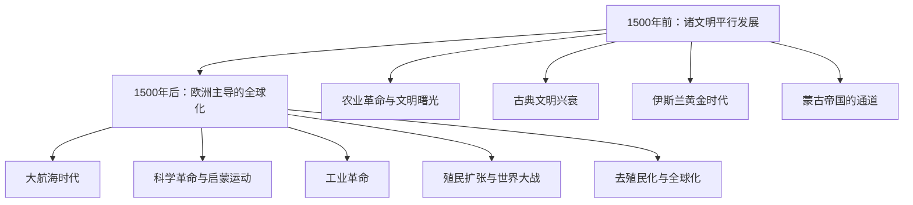

# 《全球通史》深度读书笔记

> [!abstract] 全书速览
> 这是一部真正意义上的"全球"通史——不是以欧洲为中心附带讨论其他文明，而是从月球上俯瞰地球的视角，平等审视每一个文明的兴衰。斯塔夫里阿诺斯的核心主张是：理解人类历史，不能只看某一个文明的故事，而要看==各文明之间的互动==如何推动了历史的进程。**1500年**是分水岭——在此之前各文明平行发展，在此之后欧洲的扩张将全世界卷入了一个相互关联的整体。

## 历史坐标

《全球通史》由美国历史学家斯塔夫里阿诺斯于1970年首次出版，多次修订后成为全球史教育的标准教材。他是加州大学圣迭戈分校教授，一生致力于用全球视角取代以西方为中心的传统史学。

> [!note] 知识谱系
> 这本书与[[《西方的兴起》]]（威廉·麦克尼尔）形成对话——麦克尼尔也强调文明间互动，但叙事仍有西方中心痕迹。与[[《人类简史》]]（赫拉利）相比，斯塔夫里阿诺斯更均衡全面但缺乏锐利的核心命题。与[[《枪炮、病菌与钢铁》]]（戴蒙德）相比，他的解释更多元而非聚焦单一因素。

## 全书叙事线

全书以1500年为分水岭：

斯塔夫里阿诺斯反复追问：为什么1500年后的全球化由欧洲主导？他的回答是多因素交汇——地理、技术、制度、思想和偶然的复杂互动。

## 关键转折深度解读

### 第一个转折：农业革命——多中心起源

约一万年前，新月沃地、中国、中美洲等地**独立地**开始驯化动植物。农业带来定居→财产积累→社会分层→行政管理→文字和法律。

> [!tip] 核心洞察
> 最早的文明往往不在最舒适的地方：两河流域洪水无常，埃及依赖尼罗河泛滥。==环境的挑战而非安逸，激发了组织能力和技术创新。==

### 第二个转折：古典文明的兴衰与跨文明接触

希腊-罗马、波斯、印度、中国秦汉——各自达到辉煌。丝绸之路和印度洋贸易网络是早期跨文明交流的通道。

> [!warning] 帝国衰落的模式
> 帝国在达到扩张极限后，面临行政成本上升、边境防御压力增大、内部矛盾激化的困境。罗马和中国的朝代更替都遵循这一循环。

### 第三个转折：伊斯兰黄金时代与蒙古通道

> [!note] 被低估的文明桥梁
> 欧洲的"黑暗时代"恰恰是伊斯兰世界的**黄金时代**。阿拉伯学者保存了希腊经典，发展了代数学、光学和医学。阿拉伯数字（源于印度）传入欧洲，彻底改变了数学。蒙古帝国则创造了最广阔的陆上交流网络——火药、印刷术、指南针可能通过"蒙古和平"从中国传到欧洲。

==欧洲不是凭空崛起的——它站在了伊斯兰世界和蒙古网络的肩膀上。==

### 第四个转折：1500年——分水岭

欧洲主导全球化的多因素分析：

| 因素 | 具体内容 |
|------|---------|
| 地理 | 靠近大西洋，面向美洲 |
| 政治碎片化 | 数十个竞争国家→创新激励 |
| 思想 | 文艺复兴、科学革命打破知识垄断 |
| 经济 | 资本主义萌芽提供动力 |

### 第五个转折：工业革命——指数级鸿沟

> [!warning] 历史的断裂
> 1500年时欧洲与中国、印度的差距可以弥合。工业革命后，差距变成**指数级**的。殖民主义从根本上扭曲了被殖民社会的发展轨迹，遗留问题至今仍在塑造全球不平等。

### 第六个转折：二十世纪——旧秩序的崩溃

两次大战标志着欧洲主导的旧秩序崩溃。去殖民化改变了政治版图，但殖民遗留的边界纷争、族群矛盾和经济依附继续困扰新独立国家。

## 历史的模式

**技术扩散决定文明格局。** 能否接触到其他文明的技术和思想，往往比自身创造力更能决定发展水平。

**中心-边缘关系的流动性。** "世界中心"不断转移：两河流域→埃及→希腊→罗马→伊斯兰世界→中国→西欧。没有永恒的中心。

**帝国的扩张-崩溃循环。** 过度扩张→行政成本上升→边境难守→内部矛盾→衰落。

> [!tip] "落后的优势"
> 中世纪欧洲因为"落后"于伊斯兰和中国，反而没有形成僵化的体制惯性，更容易接受新技术。==领先者的制度惯性可能成为创新的阻碍。==

## 作者的史学方法

最大贡献是**"全球史视角"**——坚持任何文明的历史都不能孤立理解，必须放在全球互动框架中考察。这在1970年代具有开创性。

> [!warning] 局限
> - 虽然力图去中心化，1500年后叙述仍不可避免以欧洲为主线
> - 作为教科书式通史，深度有所牺牲
> - 缺乏像赫拉利或戴蒙德那样令人印象深刻的核心命题

## 以史鉴今

> [!tip] 现实应用
> - **全球视角看问题**：任何地方性事件都可能有全球性原因和后果
> - **警惕"永恒中心"幻觉**：西方主导从长时段看只是暂时现象
> - **理解不平等的历史根源**：从地理差异到殖民遗产到工业革命鸿沟
> - **"落后的优势"**：后来者可以直接采用最新方法跳过中间阶段（如发展中国家跳过固定电话直接进入移动互联网）

## 延伸阅读

- [[《西方的兴起》]] - 威廉·麦克尼尔：全球史另一部经典，更强调文明间互动推动历史进步
- [[《人类简史》]] - 尤瓦尔·赫拉利：更具概念性和颠覆性的人类历史叙事
- [[《地中海与菲利普二世时代的地中海世界》]] - 费尔南·布罗代尔：另一种全球史方法——以地理区域为中心考察长时段结构
