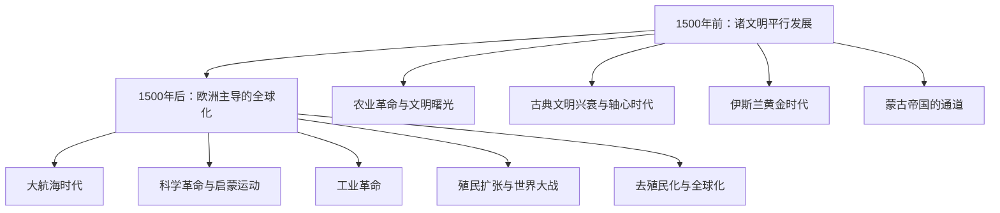

# 《全球通史》深度读书笔记

> [!abstract] 全书速览
> 这是一部真正意义上的"全球"通史——不是以欧洲为中心附带讨论其他文明，而是从月球上俯瞰地球的视角，平等审视每一个文明的兴衰。斯塔夫里阿诺斯的核心主张是：理解人类历史，不能只看某一个文明的故事，而要看==各文明之间的互动==如何推动了历史的进程。**1500年**是分水岭——在此之前各文明平行发展，在此之后欧洲的扩张将全世界卷入了一个相互关联的整体。

## 历史坐标

《全球通史》由美国历史学家斯塔夫里阿诺斯于1970年首次出版，多次修订后成为全球史教育的标准教材。他是加州大学圣迭戈分校教授，一生致力于用全球视角取代以西方为中心的传统史学。"月球视角"不仅是学术创新，也是一种道德立场。在1970年代冷战高潮的美国学术界，这是需要勇气的。

> [!note] 知识谱系
> 这本书与[[《西方的兴起》]]（威廉·麦克尼尔）形成对话——麦克尼尔也强调文明间互动，但叙事仍有西方中心痕迹。与[[《人类简史》]]（赫拉利）相比，斯塔夫里阿诺斯更均衡全面但缺乏锐利的核心命题。与[[《枪炮、病菌与钢铁》]]（戴蒙德）相比，他的解释更多元而非聚焦单一因素。

## 全书叙事线

全书以1500年为分水岭：

为什么选1500年？在此之前，一个欧洲人、一个中国人和一个阿兹特克人各自对世界的了解基本局限于自己的文明圈。此后，哥伦布和达·伽马的航行第一次将隔绝的各大陆连在一起。

## 关键转折深度解读

### 第一个转折：农业革命——多中心起源

约一万年前，新月沃地、中国、中美洲等地**独立地**开始驯化动植物。多中心起源直接挑战种族主义解释。农业带来定居→财产积累→社会分层→行政管理→文字和法律。

> [!tip] 核心洞察
> 最早的文明往往不在最舒适的地方：两河流域洪水无常，埃及依赖尼罗河泛滥。==环境的挑战而非安逸，激发了组织能力和技术创新。==两河流域的洪水迫使人们发展灌溉和大规模水利合作——文明在应对挑战中诞生。

各大文明展现了各自的辉煌：苏美尔的楔形文字、埃及的金字塔、哈拉帕的城市规划（摩亨佐-达罗的排水系统在同时代领先）、中国的青铜和甲骨文。

### 第二个转折：古典文明的兴衰与跨文明接触

希腊-罗马、波斯、印度、中国秦汉——各自达到辉煌。令人惊讶的平行性：亚里士多德、孔子、佛陀几乎是同时代人——雅斯贝尔斯所谓的"轴心时代"。

丝绸之路和印度洋贸易网络是跨文明交流的通道，但接触仍然有限。公元97年东汉使者甘英差一点到达罗马帝国——如果成功，东西方直接接触可能提前一千多年。

> [!warning] 帝国衰落的模式
> 帝国在达到扩张极限后，面临行政成本上升、边境防御压力增大、内部矛盾激化。罗马帝国不是被蛮族"征服"的——蛮族入侵只是给已经病入膏肓的帝国最后一击。这个模式在中国朝代更替中也反复出现。

### 第三个转折：伊斯兰黄金时代与蒙古通道

> [!note] 被低估的文明桥梁
> 欧洲的"黑暗时代"恰恰是伊斯兰世界的**黄金时代**。阿拉伯学者保存了希腊经典，发展了代数学（"algebra"来自阿拉伯语）、光学和医学。伊本·西那的《医典》在欧洲被用作教科书数百年。如果没有阿拉伯学者的保存和翻译，欧洲文艺复兴可能根本不会发生——没有素材可以"复兴"。

阿拉伯数字（源于印度）和十进制、零的概念通过伊斯兰世界传入欧洲。蒙古帝国虽带来破坏（巴格达1258年沦陷），但也创造了最广阔的陆上交流网络——火药、印刷术、指南针可能通过"蒙古和平"从中国传到欧洲。

==欧洲不是凭空崛起的——它站在了伊斯兰世界和蒙古网络的肩膀上。==

### 第四个转折：1500年——分水岭

欧洲主导全球化的多因素分析：

| 因素 | 具体内容 |
|------|---------|
| 地理 | 靠近大西洋，面向美洲 |
| 政治碎片化 | 数十个竞争国家→创新激励（葡萄牙太小不投资海上力量就被边缘化） |
| 思想 | 文艺复兴、宗教改革打破知识垄断 |
| 经济 | 资本主义萌芽、产权保护激励长期投资 |

### 第五个转折：工业革命——指数级鸿沟

为什么发生在英国？煤铁资源、海外贸易资本、圈地运动劳动力、专利制度，以及来自印度廉价棉布的竞争压力。

> [!warning] 历史的断裂
> 1500年时欧洲与中国、印度的差距可以弥合。工业革命后，差距变成**指数级**的。1840年鸦片战争是典型——工业革命在军事技术上制造了无法逾越的鸿沟。殖民主义从根本上扭曲了被殖民社会的发展轨迹——殖民者按自己利益组织经济（种植园、资源开采、单一作物依赖）。

### 第六个转折：二十世纪——旧秩序的崩溃

两次大战是欧洲竞争逻辑的极端化——竞争是双刃剑。一战摧毁四个帝国，二战造成史上最大规模破坏。去殖民化改变政治版图，但殖民遗留的人为边界至今是冲突根源。

## 历史的模式

**技术扩散决定文明格局。** 能否接触到其他文明的技术和思想，往往比自身创造力更能决定发展水平。地理上孤立的文明即使有杰出创新能力，也因无法获取外部知识而发展受限。

**中心-边缘关系的流动性。** "世界中心"不断转移：两河流域→埃及→希腊→罗马→伊斯兰世界→中国→西欧。没有永恒的中心。

**帝国的扩张-崩溃循环。** 过度扩张→行政成本上升→边境难守→内部矛盾→衰落。

> [!tip] "落后的优势"
> 中世纪欧洲因为"落后"于伊斯兰和中国，反而没有僵化的体制惯性，更容易接受新技术。中国的科举制度是伟大成就，但也固化了"创新等于更精确解读经典"的思维。==领先者的制度惯性可能成为创新的阻碍。==最先工业化的英国被后发的德国和美国赶超——后者直接采用最新技术。

**全球化的不可逆性。** 五百年历史表明全球化总体趋势不可逆——尽管有波折。当下的"去全球化"趋势可能是阶段性调整，而非方向逆转。

## 作者的史学方法

最大贡献是**"全球史视角"**——坚持任何文明的历史都不能孤立理解，必须放在全球互动框架中考察。这在1970年代具有开创性。

> [!warning] 局限
> - 虽然力图去中心化，1500年后叙述仍不可避免以欧洲为主线
> - 作为教科书式通史，深度有所牺牲
> - 缺乏像赫拉利或戴蒙德那样令人印象深刻的核心命题——读完赫拉利记住"虚构的故事"，读完戴蒙德记住"地理决定论"，读完斯塔夫里阿诺斯记住的是一幅完整但不那么锐利的全景画

## 以史鉴今

> [!tip] 现实应用
> - **全球视角看问题**：看到中东冲突新闻，追问这些国家边界是谁画的、经济结构如何形成——这会引向殖民主义和冷战遗产
> - **警惕"永恒中心"幻觉**：西方主导从长时段看只是暂时现象
> - **理解不平等的历史根源**：从地理差异到殖民遗产到工业革命鸿沟
> - **"落后的优势"**：后来者可以直接采用最新方法跳过中间阶段（发展中国家跳过固定电话直接进入移动互联网）。新创公司没有历史包袱，可直接采用最先进技术

## 延伸阅读

- [[《西方的兴起》]] - 威廉·麦克尼尔：全球史另一部经典，更强调文明间互动推动历史进步
- [[《人类简史》]] - 尤瓦尔·赫拉利：更具概念性和颠覆性的人类历史叙事
- [[《枪炮、病菌与钢铁》]] - 贾雷德·戴蒙德：从地理环境角度提供单一但有力的解释框架
- [[《地中海与菲利普二世时代的地中海世界》]] - 费尔南·布罗代尔：另一种全球史方法——以地理区域为中心考察长时段结构
