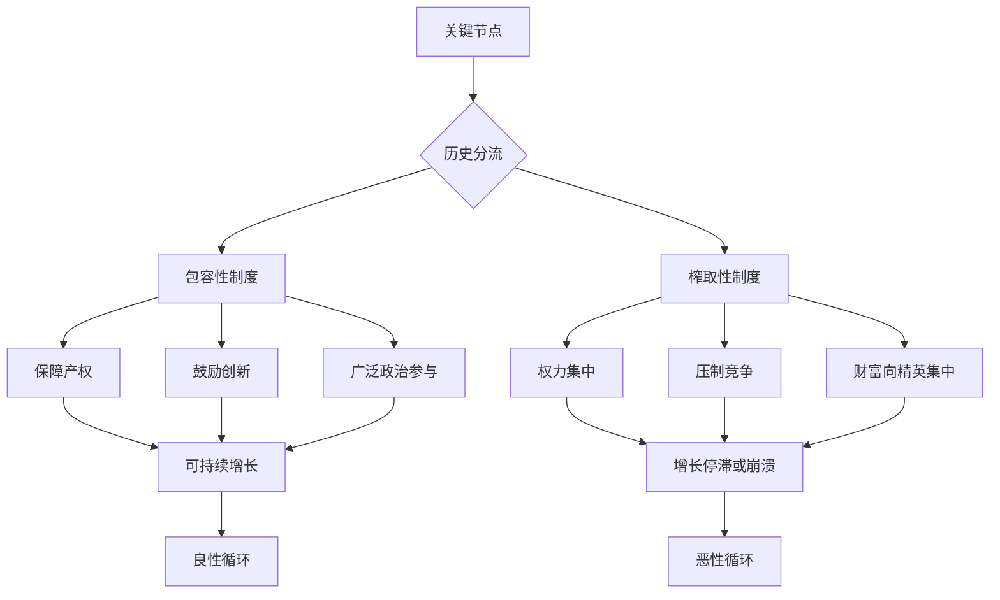

# 《国家为什么会失败》深度读书笔记

> [!abstract] 全书速览
> 为什么有的国家富裕、有的国家贫穷？阿西莫格鲁和罗宾逊给出了一个直击要害的答案：==制度==。他们将制度分为两种——"包容性制度"保障产权、鼓励创新、允许广泛的经济和政治参与；"榨取性制度"将权力和财富集中在少数精英手中，压制大多数人的经济活力。通过横跨数百年、覆盖数十个国家的案例分析，两位作者论证了一个核心命题：国家的贫富差距不是由地理、文化或无知造成的，而是由制度选择造成的。制度是人为的产物，它源于历史中的关键节点——那些微小的偶然因素在特定的权力格局下被放大，最终将国家推上完全不同的发展轨道。2024年，阿西莫格鲁与罗宾逊因"对制度如何形成以及制度如何影响国家繁荣的研究"获得诺贝尔经济学奖。

## 历史坐标

《国家为什么会失败：权力、繁荣与贫穷的根源》（Why Nations Fail: The Origins of Power, Prosperity, and Poverty）由土耳其裔美国经济学家德隆·阿西莫格鲁和英国政治学家詹姆斯·A·罗宾逊于2012年出版。阿西莫格鲁是麻省理工学院经济学教授，罗宾逊是芝加哥大学政治学教授，两人自1990年代起长期合作，在制度经济学领域发表了大量开创性论文。

这本书诞生于一个学术辩论的战场。长久以来，解释国家贫富差距有三个主流理论：地理假说（热带气候和热带疾病拖累发展）、文化假说（新教伦理促进资本主义）、无知假说（穷国的统治者不知道正确的经济政策）。阿西莫格鲁和罗宾逊认为这三个假说都不成立，真正的答案在于制度。

> [!note] 知识谱系
> 这本书与贾雷德·戴蒙德的[[《枪炮、病菌与钢铁》]]形成直接的学术辩论——戴蒙德强调地理环境是终极因，阿西莫格鲁和罗宾逊则反驳说地理无法解释同一环境下的巨大差异（如韩国与朝鲜）。在经济学内部，它继承了道格拉斯·诺斯的新制度经济学传统，将制度视为经济增长的核心变量。它也回应了杰弗里·萨克斯的地理决定论和塞缪尔·亨廷顿的文化决定论。2024年诺贝尔经济学奖的颁发，标志着"制度决定论"在学术辩论中取得了阶段性胜利。

## 全书叙事线

全书的核心论证围绕一对概念展开：

==包容性制度==（inclusive institutions）的核心是多元化和集中化的结合——政治权力广泛分配而非被少数人垄断，同时国家有足够的能力维持秩序、执行契约。在这种制度下，经济活动向所有人开放，产权得到保障，创新得到奖励。

==榨取性制度==（extractive institutions）的核心是少数精英控制政治权力，并利用这种权力从社会其余成员那里攫取资源。在这种制度下，大多数人缺乏投资和创新的激励，因为他们的收益随时可能被掌权者夺走。

两位作者强调，经济制度和政治制度是相互强化的。包容性政治制度催生包容性经济制度，反之亦然。这种相互强化产生了"良性循环"或"恶性循环"——一旦走上某条轨道，就很难偏离。而将国家推上不同轨道的，往往是历史中的"关键节点"——那些制度可能发生根本性变化的时刻。

## 关键转折深度解读

### 第一个转折：诺加利斯——一条街道，两个世界

打开这本书，你首先看到的是一个令人震撼的画面：美国亚利桑那州的诺加利斯和墨西哥索诺拉州的诺加利斯，一道围栏将同一座城市分为两半。北边的居民平均收入约三万美元，大多数成年人读完了高中，公共卫生和基础设施运转正常，犯罪率可控。围栏南边，平均收入只有北边的三分之一，许多青少年辍学，婴儿死亡率更高，腐败和犯罪猖獗。

同样的地理环境，同样的气候，同样的文化根源——两个诺加利斯的居民很多人还有亲戚住在围栏另一边。你无法用地理来解释这种差距，也无法用文化来解释——围栏两侧的人说着同样的西班牙语和英语，吃着同样的食物，听着同样的音乐。唯一不同的是制度：美国的法治、产权保护、民主问责制度，与墨西哥长期以来的寡头政治、腐败和产权不安全形成了鲜明对比。

> [!tip] 核心洞察
> 诺加利斯案例的力量在于它几乎完美地排除了竞争性解释。如果地理决定了发展，为什么同一纬度、同一气候的两个城市有如此大的差距？如果文化决定了发展，为什么同一文化群体被制度边界分开后走向了不同命运？制度是剩下的唯一解释变量。

这个开场案例不是孤例。韩国和朝鲜，一个民族被三八线切成两个国家，七十多年后人均收入相差二十倍以上。东德和西德，同一个民族被铁幕分隔四十年，经济差距巨大。博茨瓦纳和刚果，同在非洲，前者建立了相对包容的制度而繁荣稳定，后者陷入榨取性制度而长期动荡贫困。

### 第二个转折：英国光荣革命——现代繁荣的起源

如果要追溯世界上第一个真正的包容性制度是如何诞生的，你需要回到1688年的英国。

在光荣革命之前，英国的政治权力集中在国王手中。斯图亚特王朝的国王们试图建立绝对君主制——随意征税、授予垄断权给亲信、干预司法。这是典型的榨取性制度。查理一世因此引发了内战，最终被送上了断头台。但克伦威尔的共和国同样走向了个人独裁。复辟之后的詹姆斯二世又试图重建绝对王权。

1688年，议会邀请荷兰的威廉入主英国，詹姆斯二世出逃。这就是"光荣革命"——几乎没有流血，但制度发生了根本性转变。1689年的《权利法案》确立了议会至上的原则：国王不得未经议会同意征税，不得干预司法，不得维持常备军。

> [!warning] 关键细节
> 光荣革命之所以产生包容性制度，不是因为议会里的人比国王更善良。恰恰相反，议会里的商人和地主追求的是自己的利益。但关键在于==权力的多元化==——没有任何一个群体能够垄断权力。商人需要保护产权，地主需要稳定的法律环境，新兴工业资本家需要打破垄断进入市场。他们之间的博弈和妥协，客观上创造了一个保护广泛利益的制度框架。

光荣革命之后，英国发生了什么？产权保障鼓励了投资，垄断权的废除打开了竞争的大门，专利制度保护了发明创造。1760年代开始的工业革命不是偶然的——它是制度变革的直接后果。詹姆斯·瓦特能够改良蒸汽机并从中获利，是因为专利制度保护了他的发明；理查德·阿克莱特能够建立纺织工厂，是因为产权安全使大规模投资变得可行。

如果回到一百年前，假设光荣革命没有发生，斯图亚特王朝建立了法国式的绝对君主制——英国很可能不会爆发工业革命。不是因为英国人的技术天赋消失了，而是因为在榨取性制度下，创新的收益会被权力者拿走，没有人有动力冒险投资。

### 第三个转折：大西洋贸易与制度分流

为什么光荣革命发生在英国而非西班牙或法国？这涉及一段更长的历史因果链。

阿西莫格鲁和罗宾逊追溯到大西洋贸易的兴起。1500年之后，跨大西洋贸易为欧洲带来了巨大的财富。但同样的贸易机会在不同国家产生了完全不同的制度后果。

在西班牙，美洲的金银直接流入国王的金库，强化了绝对王权。国王用这些财富供养军队，不需要向议会妥协。西班牙的"黄金诅咒"——巨额财富非但没有推动经济发展，反而巩固了榨取性制度。

在英国，大西洋贸易造就了一个强大的商人阶层。这些商人不依附于国王——他们的财富来自自己的贸易网络，不是国王的恩赐。他们有独立的经济基础，因此有能力也有意愿挑战王权。到了十七世纪中叶，这个商人阶层已经强大到足以支持议会对抗国王。

> [!note] 反事实推演
> 如果英国的制度初始条件和西班牙完全相同——如果英国国王像西班牙国王那样完全控制了贸易收益——大西洋贸易只会强化绝对王权，光荣革命就不可能发生。==同样的外部冲击（大西洋贸易），在不同的初始制度条件下，产生了截然相反的结果。==这就是"关键节点"理论的精髓：历史的转折不是命中注定的，它取决于外部冲击与既有制度格局的互动。

法国走了一条中间道路。大西洋贸易也壮大了法国的商人阶层，但法国的绝对王权更加牢固。直到1789年法国大革命，才以暴力方式打破了旧制度——但革命的混乱也导致了拿破仑的独裁，法国的制度演化比英国多走了一百年的弯路。

### 第四个转折：殖民遗产的长长影子

两位作者提出了一个极具洞察力的论点：殖民者在不同地区建立了截然不同的制度，而这些制度的影响延续至今。

在人口稀少且疾病致命的地方（如西非、刚果），殖民者不愿定居，他们建立的是纯粹的==榨取性制度==——目的只是尽可能多地攫取资源运回母国。比利时国王利奥波德二世统治下的刚果，整个国家变成了一个橡胶种植园，原住民被强迫劳动，完不成配额就被砍掉手。这种极端的榨取性制度在殖民者离开后并没有消失——接手的本土精英继续使用同样的制度为自己服务。蒙博托统治下的扎伊尔（今刚果民主共和国）几乎完美复制了殖民时期的榨取模式。

在殖民者大量定居的地方（如北美、澳大利亚），他们需要为自己建立保障产权和法治的制度。他们不愿意建立一个自己也会被压迫的制度。因此，定居型殖民地往往发展出了相对包容的制度——不是出于善意，而是出于自利。

> [!tip] "命运逆转"现象
> 阿西莫格鲁和罗宾逊发现了一个惊人的模式：==1500年时最富裕的殖民地区，今天往往最贫穷；1500年时最贫穷的地区，今天往往最富裕。==阿兹特克帝国和印加帝国曾是美洲最繁荣的文明，今天的墨西哥和秘鲁却远不如当年"荒凉"的北美。原因是：在人口稠密、文明发达的地区，殖民者可以利用既有的榨取性制度（如印加帝国的强制劳动体系"米塔"），直接把原住民变成劳动力。在人口稀少的北美，殖民者没有现成的榨取对象，只能吸引移民来自愿劳动——这就需要提供土地、自由和法治。

秘鲁的"米塔"制度特别值得细看。印加帝国有一套强制劳动制度，要求每个社区轮流派人为国家服劳役。西班牙殖民者接管了这个制度，用它来强迫原住民在波托西银矿劳动。几个世纪过去了，今天的秘鲁，那些当年处于米塔制度覆盖范围内的地区，经济发展水平仍然显著低于未被覆盖的地区。一个五百年前的制度安排，至今仍在塑造经济现实。

### 第五个转折：博茨瓦纳——非洲的例外

几乎所有关于非洲贫穷的讨论都倾向于给出一个笼统的解释——地理、文化、殖民遗产。但博茨瓦纳的存在打破了这种叙事。

1966年独立时，博茨瓦纳是世界上最贫穷的国家之一，全国只有十二公里的柏油路。六十年后，它是非洲人均收入最高的国家之一，经济增长率在过去几十年持续领先全球。

阿西莫格鲁和罗宾逊的解释是：博茨瓦纳独立时保留了相对包容的部落制度——茨瓦纳人的传统政治体制有一定程度的协商和参与机制，酋长的权力受到长老会议和部落大会的制约。独立后的领导人塞雷策·卡马和继任者选择在这个基础上建设现代民主制度和法治体系，而不是像许多非洲国家的领导人那样建立一党独裁。

> [!note] 对比的力量
> 同在非洲，博茨瓦纳与津巴布韦的对比极具说服力。两国地理条件相似，独立时间接近。但穆加贝在津巴布韦建立了典型的榨取性制度——没收白人农场分给亲信、镇压反对派、操纵选举、纵容腐败。结果是经济崩溃、恶性通货膨胀。博茨瓦纳建立了包容性制度——产权保护、民主选举、反腐机制。结果是持续增长。同一大陆，同一时期，不同制度选择，天壤之别的结果。

博茨瓦纳的故事也说明了一个微妙的问题：包容性制度不一定需要从西方"进口"，它可以从本土的政治传统中生长出来。关键不在于制度的形式是否"西方化"，而在于制度是否能实现权力的多元化和对权力的约束。

### 第六个转折：榨取性增长的天花板

阿西莫格鲁和罗宾逊承认一个看似矛盾的现象：榨取性制度在短期内也能实现经济增长。苏联从1930年代到1960年代经历了惊人的工业化，一度让西方观察者相信计划经济优于市场经济。

苏联的增长是怎么实现的？通过国家力量将资源从农业强制转移到工业——大规模征收农产品、强制集体化、将农村劳动力赶入工厂和矿山。这是典型的榨取性增长：不是通过提高效率和创新来增长，而是通过把已有的资源从一个地方搬到另一个地方。

这种增长有一个==天花板==。当所有能搬运的资源都已经搬运完毕，当所有农民都已经进了工厂，增长就会停滞。因为榨取性制度不鼓励创新——创新意味着"创造性破坏"，意味着旧产业被新产业替代，意味着既有的权力格局可能被打破。掌权者不愿冒这个险。

> [!warning] 创造性破坏的政治经济学
> 这是全书最深刻的洞察之一。经济增长的长期引擎是技术创新，而技术创新必然伴随"创造性破坏"。蒸汽机淘汰了手工纺织，汽车淘汰了马车，互联网淘汰了实体书店。每一次创造性破坏都会伤害既有的利益集团——手工纺织工人、马车夫、书店老板。在包容性制度下，创造性破坏虽然痛苦，但无法被阻止，因为没有任何一个利益集团有足够的政治权力来否决它。在榨取性制度下，掌权者有能力也有意愿阻止任何威胁其地位的创新。

奥斯曼帝国禁止印刷术长达数百年——不是因为不知道印刷术的存在，而是因为宗教精英阶层担心印刷术会削弱他们对知识的垄断。俄国沙皇长期抵制铁路建设——不是因为不知道铁路的好处，而是因为担心铁路会让农奴和工人流动起来，威胁社会控制。奥匈帝国的弗朗茨·约瑟夫皇帝在十九世纪中叶拒绝在帝国境内建设铁路网络，因为他担心铁路会帮助革命者更快地集结。

## 历史的模式

**制度的自我强化。** 包容性制度创造"良性循环"——产权保障带来投资，投资带来增长，增长扩大中产阶级，中产阶级要求更多政治参与，更多参与进一步巩固包容性制度。榨取性制度创造"恶性循环"——权力集中导致财富集中，财富集中强化权力集中，掌权者利用权力阻止任何可能削弱自身地位的变革。

**关键节点的偶然性。** 历史不是命中注定的。光荣革命可能不会发生；如果西班牙的无敌舰队在1588年击败了英国，整个历史轨迹就会不同。制度变迁往往发生在"关键节点"——外部冲击（瘟疫、贸易、战争）与既有制度格局互动的时刻。同样的冲击在不同制度条件下产生不同结果。黑死病在西欧削弱了农奴制（因为劳动力稀缺，农民有了谈判筹码），在东欧却强化了农奴制（因为地主有足够的政治权力压制农民的诉求）。

**榨取性增长有天花板。** 通过资源搬运实现的增长终将耗尽。只有创新驱动的增长才能持续，而创新需要包容性制度提供的激励和保护。

**殖民制度的路径依赖。** 几百年前殖民者的制度选择至今仍在影响发展轨迹。制度一旦建立，就会产生自我强化的路径依赖效应，打破它需要巨大的政治能量。

**创造性破坏是增长的代价。** 长期繁荣需要容忍创造性破坏——这对既得利益者是威胁，对社会整体是进步。包容性制度的核心优势就是让创造性破坏成为可能。

## 作者的史学方法

阿西莫格鲁和罗宾逊的研究方法以比较历史分析为核心。他们大量使用"自然实验"——寻找历史中那些几乎完美的控制实验。诺加利斯两侧、韩国与朝鲜、东德与西德，这些案例的力量在于它们几乎排除了地理和文化因素，使制度成为唯一的解释变量。

他们也运用计量经济学方法来验证因果关系。阿西莫格鲁最著名的学术论文之一使用了"殖民者死亡率"作为工具变量——在殖民者死亡率高的地方（疟疾等疾病致命），殖民者不愿定居，建立了榨取性制度；在殖民者死亡率低的地方，殖民者大量定居，建立了相对包容的制度。通过这个工具变量，他们试图证明制度对经济发展的因果效应。

> [!warning] 主要学术争议
> - **制度的内生性问题**：批评者指出，"好制度带来繁荣"和"繁荣催生好制度"之间可能存在反向因果。到底是包容性制度导致了经济增长，还是经济增长为建立包容性制度创造了条件？
> - **概念过于宽泛**："包容性"和"榨取性"的二分法可能过于简化。现实中的制度是一个光谱，很多国家处于两个极端之间的模糊地带——比如新加坡，政治上相当集权，经济上却高度包容
> - **对文化因素的低估**：马克斯·韦伯强调的新教伦理、儒家文化对经济行为的影响，在这本书中几乎被完全忽略
> - **对地理因素的过度否定**：虽然地理不能解释诺加利斯的差距，但它可能通过影响疾病环境、农业潜力等间接塑造制度演化的路径
> - **可操作性不足**：如果关键节点是偶然的，制度变革的药方是什么？"建立包容性制度"的建议过于笼统

## 以史鉴今

> [!tip] 实用思考工具
> - **用制度视角审视发展问题**：当你看到一个国家或地区的贫穷时，先问"那里的制度保护产权吗？允许竞争吗？权力是否受到约束？"而非简单归因于地理或文化
> - **理解"增长的天花板"**：榨取性增长可以很快但不可持续。这个规律适用于国家、企业和个人——如果增长依赖于资源搬运而非真正的效率提升和创新，天花板终将到来
> - **警惕利益集团对创新的阻挠**：当一项新技术出现时，总有人试图阻止它——不是因为技术不好，而是因为它威胁了既有利益。识别这种阻力的本质，有助于你理解为什么有些明显有利的改革迟迟无法推进
> - **制度比个人重要**：好的制度能让普通人做出好的决策，坏的制度能让优秀的人做出坏的决策。无论是国家治理还是组织管理，制度设计往往比选对领导人更根本
> - **路径依赖无处不在**：今天的困局往往根源于很久以前的选择。理解这一点不是为了宿命论，而是为了意识到打破路径依赖需要多大的能量和决心

## 延伸阅读

- [[《枪炮、病菌与钢铁》]] - 贾雷德·戴蒙德：地理决定论的代表作，与制度决定论形成直接学术辩论
- [[《历史的教训》]] - 威尔·杜兰特：从更宏观的文明视角审视历史的规律
- [[《万历十五年》]] - 黄仁宇：从微观案例揭示制度僵化如何导致一个帝国的衰落
- [[《中国历代政治得失》]] - 钱穆：从中国政治制度的演变理解制度与国运的关系
- [[《全球通史》]] - 斯塔夫里阿诺斯：在更广的时间尺度上理解制度演化的全球背景
