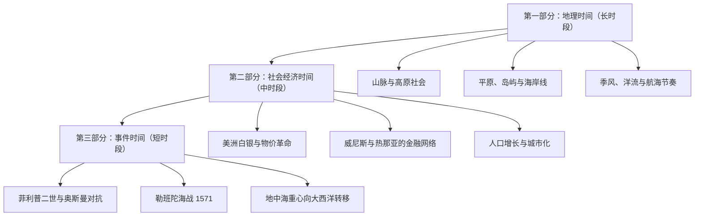

# 《地中海与菲利普二世时代的地中海世界》深度读书笔记

> [!abstract] 全书速览
> 这不是一部关于菲利普二世的传记，也不是一部传统的地中海政治史。布罗代尔做了一件前所未有的事：他把地中海当作一个活的有机体来写，从山脉、季风和洋流写起，穿过商路、城市和帝国的兴衰，最后才落到国王和将军的决策上。他的核心主张是——==真正塑造历史的力量不是伟人的意志，而是地理环境的长期制约、经济周期的缓慢脉动，以及普通人日复一日的生存选择==。那些被传统史学浓墨重彩书写的战争与外交，在布罗代尔看来只是大海表面的浪花，而真正的潮汐在深处涌动。

## 历史坐标

费尔南·布罗代尔是二十世纪最具影响力的历史学家之一，法国年鉴学派的第二代领军人物。这本书的写作本身就是一段传奇：布罗代尔在二战期间作为法军军官被德国俘虏，在战俘营中凭借惊人的记忆力——没有笔记、没有档案——完成了这部巨著的初稿。1949年正式出版后，它不仅奠定了布罗代尔在学术界的地位，更彻底改变了人们理解历史的方式。

> [!note] 史学革命
> 布罗代尔的革命性在于他的==时间观==。传统历史以事件为单位——某年某月某日，某王打了某场仗。布罗代尔提出了**三层时间结构**：最底层是"长时段"（地理、气候，以世纪为单位变化）；中间层是"中时段"（经济周期、社会结构，以几十年为单位波动）；最表层是"短时段"（政治事件、战争，如新闻般转瞬即逝）。他的洞见是：越是深层的力量，对历史的塑造作用越大。

这个三层结构直接挑战了以兰克为代表的德国实证史学传统——后者认为历史的核心是政治事件和伟人决策，历史学家的任务是"如实呈现"档案中记录的事件。布罗代尔不否认事件的重要性，但他坚持认为：如果你不理解地中海的季风模式、山地社会的生存逻辑和十六世纪的白银流动，你就无法真正理解菲利普二世为什么做了那些决策——以及为什么那些决策最终都无法改变地中海世界的命运。

> [!note] 知识谱系
> 布罗代尔继承了年鉴学派创始人马克·布洛赫和吕西安·费弗尔的跨学科精神。但他走得更远——布洛赫和费弗尔以中世纪法国为主要对象，布罗代尔则把整个地中海世界作为统一的历史空间。这种以海洋为中心的"总体史"写法，后来深刻影响了全球史——[[《全球通史》]]在方法论上就受益于布罗代尔的启发。

## 全书叙事线

全书分为三大部分，对应三层时间结构，像剥洋葱一样从最深处写到最表层。

第一部分讲地中海的"身体"——它的地理。布罗代尔从山脉写起，因为地中海世界首先是一个被山脉环绕的世界。阿尔卑斯山、比利牛斯山、阿特拉斯山、托罗斯山——这些山脉不仅是地理屏障，更是独特文明的孵化器。山地社会贫穷、封闭、自给自足，它们向平原和海岸输出过剩人口——牧羊人、雇佣兵、海盗、移民。然后是平原和岛屿，是海岸线和港口，是季风和洋流。地中海的航行受制于季节——冬天几乎不可能出海，夏天的航线取决于风向。这意味着贸易、战争乃至外交都有一个自然的节奏，国王们必须在这个节奏中行动。

第二部分讲地中海的"循环系统"——经济和社会。十六世纪的地中海是一个被白银和胡椒驱动的世界。美洲白银通过西班牙涌入地中海，推高了物价，改变了财富分配。威尼斯和热那亚是金融心脏。人口增长、物价革命、城市化、农村贫困化——这些缓慢但不可逆的趋势，才是塑造十六世纪地中海面貌的真正力量。

第三部分终于来到"事件"——菲利普二世的政治和军事决策。西班牙与奥斯曼在地中海的对抗是主线。1571年的勒班陀海战是叙事高潮。但布罗代尔用冷静的笔触指出：地中海的两极对峙最终不是被某场决定性战役终结的，而是因为两个帝国的注意力都转向了别处。

## 关键转折深度解读

### 三层时间：一种全新的历史视觉

布罗代尔最深刻的贡献不是某个具体的历史发现，而是他提供了一种看待历史的全新方式。想象你站在海边：你看到的浪花一个接一个地涌上沙滩又退去——这是事件，是国王的战争和条约。但如果你观察得更久，你会注意到潮汐的涨落——这是经济周期、社会变迁，以几十年为单位运动。而如果你能像地质学家那样思考，你还会意识到海岸线本身也在变化——这是地理环境的长时段力量，以世纪甚至千年为单位塑造着一切。

> [!tip] 核心洞察
> 传统历史学家研究浪花。布罗代尔说：如果你不理解潮汐和海岸线，你就无法理解浪花为什么在这里出现。==具体的事件是偶然的，但产生事件的结构是必然的。==

菲利普二世为什么在1571年发动勒班陀海战？传统回答追溯外交谈判、教皇斡旋、威尼斯求援。布罗代尔不否认这些，但他追问更深的问题：为什么十六世纪的地中海必然出现基督教世界与伊斯兰世界的大规模对抗？因为两个正在扩张的帝国——哈布斯堡和奥斯曼——不可避免地要在地中海争夺霸权。而两个帝国的扩张本身，又根植于十五到十六世纪欧亚大陆的人口增长和经济扩张。

这个框架后来影响了整个社会科学——沃勒斯坦的"世界体系理论"、[[《全球通史》]]的宏观视角，都能看到布罗代尔的影子。

### 地中海作为统一空间：山脉、海洋与文明的节奏

布罗代尔做的第二件革命性的事，是把地中海从一个"分隔"欧洲和非洲、基督教和伊斯兰的边界，重新定义为一个"连接"不同文明的统一空间。

在布罗代尔之前，大多数历史学家把地中海当作一条分界线。布罗代尔说：不对。如果你看看地中海沿岸的日常生活——种植的作物、吃的食物、穿的衣服、建筑的风格、航海的技术——你会发现北岸和南岸的相似之处远多于差异。一个西西里农民和一个突尼斯农民的日常生活，比一个西西里农民和一个巴伐利亚农民的生活更加相似。==橄榄油、葡萄酒和小麦构成了整个地中海世界共同的饮食基础。==

> [!tip] 深层含义
> 文明的边界不是由政治和宗教决定的，而是由==地理和气候==决定的。地中海世界是一个气候共同体、生态共同体，在此基础上才有了贸易共同体和文化共同体。政治边界和宗教分野是这个共同体的表面裂痕，而非深层结构。

这种"以海洋为中心"的历史写法后来催生了一个完整的学术领域——海洋史。从地中海史到大西洋史、印度洋史、太平洋史，历史学家开始意识到：海洋不是文明的边缘，而是文明的中心。

### 菲利普二世与奥斯曼帝国：注定无果的对抗

十六世纪下半叶的地中海是两个超级大国的角斗场。西边是菲利普二世的西班牙帝国——控制着伊比利亚半岛、意大利南部、西西里、撒丁岛和美洲殖民地。东边是奥斯曼帝国——控制着巴尔干半岛、安纳托利亚、叙利亚、埃及和北非大部分海岸。

布罗代尔用大量篇幅描述了这场对抗的日常面貌：不是一场戏剧性的决战，而是无数次小规模的袭扰、封锁和反封锁。海盗——无论穆斯林还是基督徒——是对抗的常态。北非的巴巴里海盗袭击意大利和西班牙海岸，掳走居民卖为奴隶。基督教方面的马耳他骑士团和西班牙私掠船对穆斯林商船做着同样的事。

> [!warning] 帝国的极限
> 两个帝国都太大了，以至于无法集中全部力量用于地中海。菲利普二世同时面对尼德兰叛乱、英格兰威胁、法国敌意。奥斯曼帝国则在东方与波斯萨法维王朝反复交战。对抗的结局不是一方的胜利，而是双方的筋疲力尽。

### 勒班陀海战（1571）：辉煌而无用的胜利

1571年10月7日，基督教联合舰队在希腊西海岸的勒班陀海域击败了奥斯曼舰队。双方共投入近五百艘战舰和超过十五万人。在当时的基督教世界，这场胜利被视为上帝的恩赐，教皇庇护五世将10月7日定为"玫瑰圣母节"。

> [!warning] 胜利的悖论
> 布罗代尔冷静指出：这场"伟大的胜利"几乎没有改变任何东西。胜利后基督教联盟迅速瓦解——威尼斯单独与奥斯曼媾和，西班牙忙于尼德兰事务。奥斯曼在一年内重建了舰队。==单一事件——无论多么壮观——很少能改变历史的深层走向。==地中海格局不是被一场海战改变的，而是被两个帝国各自内部的经济困境和战略转移慢慢侵蚀的。

如果勒班陀海战没有发生，或者奥斯曼赢了，地中海格局会有根本性不同吗？布罗代尔的回答倾向于否定。双方都已到了扩张极限，无论战役结果如何，两极对峙都将逐渐冷却——不是因为哪一方获胜，而是因为双方资源都被消耗殆尽了。

### 威尼斯与热那亚：地中海的两种金融模式

> [!example] 两种经济路径
> 威尼斯是贸易霸主——国家组织的"穆达"商船队定期往返东方港口，购买香料和丝绸。热那亚在被威尼斯击败于东地中海贸易后，转向了金融业，成为西班牙帝国事实上的财务总管。菲利普二世打仗需要钱，热那亚银行家充当中间人：提供贷款支付军饷，从美洲白银到达中收回本金和利息。

布罗代尔从这两个城市的命运中提炼出一个深层规律：==贸易霸权和金融霸权往往不在同一个地方==。贸易需要实体商品流动、港口设施和航海技术。金融则是更抽象的东西——需要信任、信息网络和对风险的精确计算。威尼斯代表前者巅峰，热那亚代表后者崛起。这个从贸易到金融的转型，后来在阿姆斯特丹和伦敦一再重演。

菲利普二世在1557年、1575年和1596年三次宣布国家破产——每次都因无力偿还热那亚银行家的贷款。一个控制半个欧洲和整个美洲的帝国，竟在一个小城市国家的银行家面前三次低头。权力的逻辑和金钱的逻辑不是同一回事。

### 海盗与边境社会：地中海的灰色地带

布罗代尔把海盗视为理解地中海世界的一把钥匙。海盗在地中海不是边缘现象，而是一种结构性的存在。基督教世界和伊斯兰世界之间的漫长边境地带是一个充满暴力和机会的灰色地带。

海盗是贫困的产物。地中海沿岸的山地社会——无论是卡比利亚的柏柏尔人还是达尔马提亚的斯拉夫人——都面临同样的困境：贫瘠的土地养不活过多的人口。你可以摧毁一支海盗舰队，但你无法消除产生海盗的社会条件。

> [!tip] 身份的流动
> 在边境地带，身份不是固定的，而是流动的、可协商的。一个被俘的基督徒水手可能改宗伊斯兰教成为穆斯林海盗船长。海盗船上往往是多种族、多宗教的混合体。法国——一个基督教王国——长期与奥斯曼帝国保持同盟。==边境不是一条线，而是一个地带——两边的人在其中创造出既不完全属于这边、也不完全属于那边的独特生活方式。==

## 历史的模式

地理环境对人类社会的制约力远比通常认为的要强大和持久。地中海的季风模式决定了航海节奏，山脉分布决定了贸易路线和政治边界，气候条件决定了农作物和饮食方式。政治家可以签订条约，将军可以赢得战役，但他们无法改变季风的方向。这个规律在今天依然成立——全球变暖对海平面、农业和人口分布的影响，可能比任何政治决策更深刻地塑造二十一世纪的历史。

经济周期的力量往往被低估。十六世纪地中海经历了"物价革命"——美洲白银推高了物价，拥有土地和商品的人变富了，靠固定收入生活的人变穷了。这场物价革命不是任何人计划或控制的，但它对社会的改变比任何战争都深刻。

> [!warning] 帝国过度扩张的模式
> 帝国的扩张总有极限——这个极限往往不是被敌人设定的，而是被自身的后勤和财政能力设定的。每一次成功的征服都增加了需要防守的边境线，直到防御成本超过征服收益。这个模式在[[《罗马人的故事》]]描述的罗马帝国中也反复出现。

世界经济中心的转移是缓慢但不可逆的。十六世纪末，地中海经济中心正向大西洋转移。威尼斯和热那亚的衰落、阿姆斯特丹和伦敦的崛起——这不是一夜之间发生的，而是一个多世纪的缓慢过渡。布罗代尔描述的地中海世界正处在这个过渡的关键时期。

## 作者的史学方法

布罗代尔的"总体史"方法——试图将地理、经济、社会、文化和政治整合为统一叙事——在雄心上无与伦比。没有几个历史学家能在同一本书中同时讨论季风模式、白银流通、农民生活和海军战略。

> [!warning] 局限与争议
> - 三层时间结构虽然优雅，但可能==过度贬低了事件和个人的作用==——菲利普二世在书中几乎成了被深层力量摆布的木偶
> - 大量依赖西班牙和意大利档案，对奥斯曼一方资料使用相对不足
> - 有时可能夸大了地中海世界的统一性——南欧天主教世界和北非伊斯兰世界在社会结构和法律制度上差异仍然巨大

尽管有这些局限，布罗代尔的方法论遗产不可动摇。他教会了一代又一代历史学家：不要只盯着表面的事件，要看到事件背后的结构；不要只听国王说了什么，要看农民吃了什么；不要只画政治地图，还要画贸易路线和人口流动的地图。

## 以史鉴今

> [!tip] 布罗代尔式的当代分析
> 当你看到国际新闻中的突发事件——一场战争、一次政变、一项贸易协定——试着用三层时间来分析。比如中东动荡，表面是政治事件和军事冲突（短时段），背后是石油经济的结构性问题和人口增长的就业压力（中时段），更深处是干旱气候、水资源稀缺和部落社会结构的历史遗产（长时段）。

布罗代尔对边境社会的描写也有当代映射。今天的美墨边境、地中海移民路线、东南亚跨境社会——都展现出类似特征：身份的流动性、灰色经济的繁荣、国家权力的有限性。边境不是一条线，而是一个地带。

地中海从世界中心到边缘的衰落，也为今天的地缘政治变局提供了参照。经济重心的转移是缓慢的，但一旦启动就很难逆转。十六世纪末大西洋取代地中海的过程，和今天太平洋经济圈崛起的过程，在结构上有相似之处。

## 延伸阅读

- [[《全球通史》]] - 斯塔夫里阿诺斯：从更宏观的尺度运用类似的全球视角，如果说布罗代尔是地中海的"总体史"，斯塔夫里阿诺斯就是全人类的"总体史"
- [[《罗马人的故事》]] - 盐野七生：对地中海古典时代的详细描写，可以作为理解布罗代尔"长时段"的具体补充
- [[《伟大的海》]] - 大卫·阿布拉菲亚：从布罗代尔遗产出发，将地中海故事从史前讲到二十一世纪
