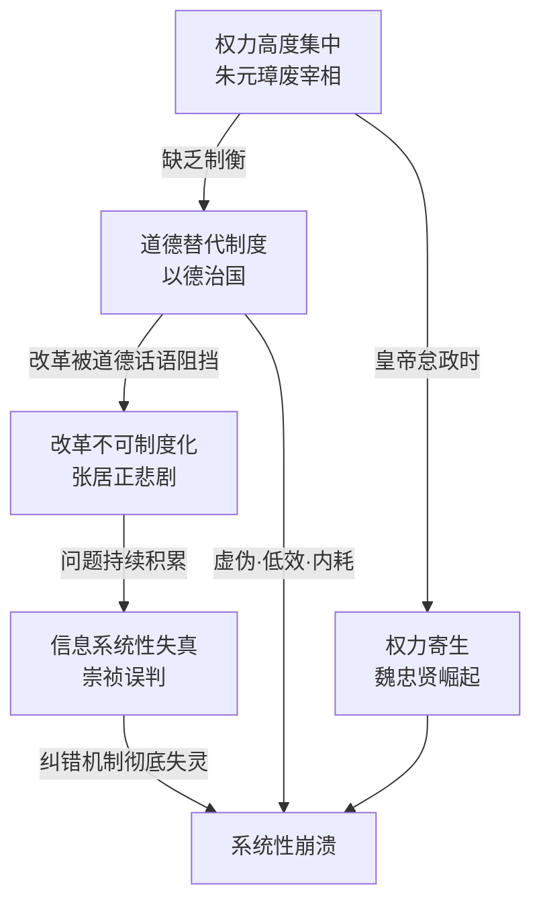
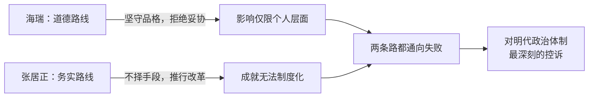
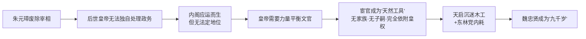
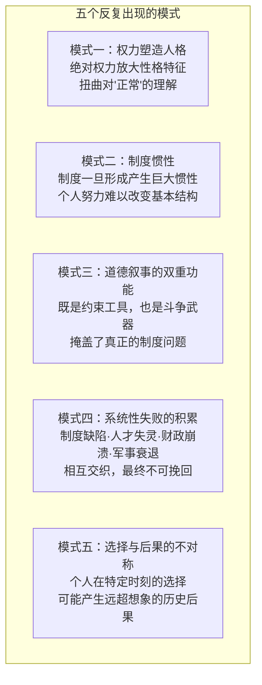

# 《大明王朝的七张面孔》深度读书笔记

> [!abstract] 全书速览
> 张宏杰以七个历史人物为切入点——朱元璋、朱棣、海瑞、张居正、魏忠贤、崇祯、吴三桂——勾勒出大明王朝276年的兴衰轨迹。这不是一部传统的帝王将相史，而是一部关于==制度如何扭曲人性、人性又如何反噬制度==的深度剖析。七个人物代表了专制体制下七种典型命运，共同拼出一幅专制王朝从建立到崩溃的全景病理图。核心论点：明朝的灭亡不是某个昏君或奸臣造成的，而是制度设计本身就包含了自我毁灭的逻辑——权力越集中系统越脆弱，道德越被强调虚伪越泛滥，改革越依赖个人成果越短命。

---

## 历史坐标与写作框架

《大明王朝的七张面孔》是历史学者张宏杰的代表作，初版于2006年。张宏杰以"大众历史写作"著称，方法论有两个显著特点：==用现代心理学视角分析历史人物的行为动机==，以及==从个体命运中提炼制度性教训==。

选择明朝作为分析对象有其特殊意义。明朝是中国专制集权发展到顶峰的时代——废除宰相制度、设立锦衣卫和东厂西厂、八股取士、海禁政策——使得皇权达到了前所未有的集中程度。同时明朝也是一个充满悖论的时代：它有最严密的控制体系，却以最混乱的方式崩溃；它有最严苛的道德标准，却培育出最虚伪的政治文化。

七个人物的选取构成了一部"==王朝生命周期=="的完整叙事：朱元璋和朱棣代表建立与巩固，海瑞和张居正代表体制内两种应对路线（道德坚守与务实改革），魏忠贤代表皇权的畸形寄生物，崇祯代表体制的最终崩溃，吴三桂代表旧秩序瓦解后个体的选择困境。

---

## 核心分析框架

> [!tip] 四大制度命题
> 1. **权力集中的脆弱性悖论**：权力越集中，系统越脆弱。帝国运转完全取决于皇帝一人——遇到工作狂能运转，遇到怠政者则瘫痪
> 2. **道德主义的制度性失灵**：以道德代替制度，导致虚伪（人人演戏）、低效（标准模糊）、内耗（无休止的道德竞赛）
> 3. **改革的制度性不可能**："祖制"神圣化堵死了制度更新通道，改革只能依赖个人权威，而个人权威无法传承
> 4. **信息的制度性扭曲**：每个信息传递者都有自己的动机，真实信息被层层过滤，皇帝处理的是大量失真信息

---

## 七张面孔逐层解读

### 第一张面孔：朱元璋——恐惧铸造的制度基因

朱元璋出身赤贫，亲眼目睹父母兄弟饿死，当过和尚做过乞丐。这种==创伤性记忆==塑造了他的世界观：世界是危险的，人是不可信的，只有绝对的控制才能保证安全。获得最高权力后，这种心理特质被无限放大——他的暴政不是性格缺陷的简单放大，而是==早年创伤与绝对权力结合==的必然产物。

朱元璋的四项核心制度工程：
- **废除宰相**：洪武十三年（1380年）诛杀宰相胡惟庸后永久废除宰相制。消灭了皇权之外唯一合法的行政权力中心，此后皇帝必须亲自处理所有政务——据记载朱元璋每天批阅奏章二百多件，处理国事四百多件。他做到了，但后代几乎不可能维持这种工作强度
- **建立特务体系**：锦衣卫直接对皇帝负责、绕过正常司法程序。后来又设东厂（宦官主管），形成锦衣卫监视百官、东厂监视锦衣卫的层层嵌套恐惧网络。设计意图是让所有人都活在被监视的恐惧中
- **大规模政治清洗**："胡惟庸案""蓝玉案"前后持续十余年，株连超四万人。打击对象涵盖了开国功臣中几乎所有有独立势力基础的人物。这是"预防性恐怖"——在他们还没有反叛之前就被消灭
- **僵化社会控制**：严格户籍制度把所有人口按职业分为军户、民户、匠户等，世代不得更改。农民固定在土地上，工匠固定在作坊中。甚至规定了不同等级穿什么衣服、住多大房子。设计意图是让社会彻底静止

> [!warning] 制度遗产的核心问题
> 朱元璋为了解决一个问题（防止威胁皇权），制造了更多问题。废相导致后世皇帝要么累死要么怠政；分封藩王本意拱卫皇室却导致靖难之役和巨大宗室财政负担（到明末宗室人口膨胀到数十万人，供养费用占财政收入极大比例）；户籍制度限制社会流动阻碍商业发展；海禁政策切断对外交流使中国在大航海时代落后于西方。更根本的是，==他把"祖制"神圣化，不允许后人修改——堵死了制度自我更新的通道。一个不能进化的制度只能僵化和衰败==。整个明朝后来二百多年的历史，本质上就是在回答一个问题：当这套以恐惧为驱动力的制度遇到它无法处理的情况时，会发生什么？

---

### 第二张面孔：朱棣——武力无法购买合法性

朱棣通过"靖难之役"推翻侄子建文帝，夺取皇位。在儒家伦理体系中，这是==以臣犯君、破坏嫡长子继承制==的双重违反——朱元璋的长子朱标早逝后，皇位传给朱标之子建文帝，这是"祖制"规定的合法传承，朱棣推翻它等于同时违反了儒家伦理和父亲的遗训。这构成了他终生无法洗刷的原罪。

朱棣的三套应对策略：
- **暴力清洗**：方孝孺因拒绝起草即位诏书被灭十族（在传统九族之外加上学生和朋友），株连八百余人。建文帝的忠臣只有两条路：投降效忠或被消灭。极端暴力的目的不仅是消灭反对者，更是向所有人发出信号——质疑新朝合法性的代价是毁灭性的
- **历史篡改**：命人重修《太祖实录》，大规模篡改朱元璋时代的记录。把自己塑造为朱元璋最器重的儿子，暗示朱元璋本来就想传位给他；甚至篡改生母记录，把生母从一个地位不高的妃子改为嫡母马皇后。这些篡改后来被史学研究逐一揭穿
- **功绩补偿**：五次亲征蒙古维护北方安全、派郑和七下西洋展示帝国国际影响力、迁都北京奠定此后五百年都城格局、编纂[[《永乐大典》]]创造中国古代最大百科全书——用宏大功业获取"绩效合法性"

朱棣的心理特征：终生活在合法性焦虑中，对任何质疑其统治正当性的言论极度敏感；通过不断的军事行动和建设工程证明自己的能力；对建文帝下落始终耿耿于怀（郑和下西洋的目的之一据说就是寻找建文帝）。

> [!note] 合法性困境的普遍性
> ==合法性不是可以用武力购买的商品==。暴力可以夺取权力，但无法制造认同。篡位者越是努力证明自己配得上这个位置，就越是暴露出他需要证明——而真正拥有天然合法性的人是不需要证明的。这个困境是结构性的，不是个人努力可以解决的。朱棣的子孙后来把"靖难之役"塑造为正当，但知识分子群体心中始终保留着对建文帝的同情——这种隐秘记忆本身就说明了暴力在建构合法性方面的局限。

---

### 第三张面孔：海瑞——道德洁癖不是制度药方

海瑞是中国历史上"清官"形象的典型代表。他的清廉达到了极端程度：身为二品大员，死后同僚凑钱才办了丧事。他的勇气同样惊人：上《治安疏》痛批嘉靖皇帝沉迷修道、荒废朝政，提前给自己买好棺材做好了被处死的准备。嘉靖大怒将他投入大牢，但又不舍得杀这个"真敢说话的人"。但张宏杰的分析远不止赞美——他指向了道德完美主义在制度层面的==无效性和潜在危害==。

> [!example] 海瑞的三重困境
> 1. **个人道德无法替代制度建设**：海瑞把明代一切问题归结为官员道德败坏，认为只要人人清廉天下就太平。但明代的困境是系统性的——税收制度不合理（以实物为主，中间环节层层盘剥）、地方治理资源严重不足（地方官府常年缺编缺钱）、司法缺乏独立性（地方官同时扮演行政长官和法官）。这些问题不是提高道德水平就能解决的。海瑞用个人道德对抗结构性问题，好比用体温计治疗发烧——你能准确测量温度，但你不能降低温度
> 2. **道德偏见扭曲司法公正**："凡穷人与富人打官司，不管事实如何，先偏向穷人"——这在情感上容易获得同情，但从根本上违背了司法基本原则：正义应基于事实和法律，而非基于当事人身份。穷人也可能撒谎，富人也可能受冤。当一个法官公开宣布根据当事人经济地位而非案件事实判案时，法律的可预期性就被摧毁了
> 3. **道德标准强加于人**：海瑞的道德标准不仅约束自己，更强加于所有人。他与几乎所有同僚关系极为紧张，每到一处，当地官员系统就陷入瘫痪——不是因为他做了积极的改革，而是因为没人敢在他面前正常工作。在他眼中，同僚们拿正常俸禄加补贴就是"贪婪"，为人处世讲究人情就是"堕落"

海瑞的深层历史意义：他是一个"症状"而非"药方"。他的存在本身就证明了制度的失败。==一个需要圣人才能维持基本公正的制度，本身就是不健康的。==健康的制度应该有机制让普通人也能公正行事，而不是期待每个岗位上都坐着一个海瑞。他好比在一条污水河里拼命保持自身清洁的人——他的清洁是真实的、值得敬佩的，但他并没有净化河水。

---

### 第四张面孔：张居正——改革者的结构性困境

海瑞与张居正构成了本书思想深度最高的一组对比——==道德路线 vs. 务实路线==，两条路都通向失败。

张居正任首辅十年（1572-1582）的改革成效：
- **考成法**：明代官员考核长期以"德行"为主，考核变成了虚伪的道德表演。张居正为每项政务设定明确完成期限和量化标准，逾期不完成者直接受罚。这是在以道德为评价标准的系统中强行引入效能标准——本质上是一场官僚体系的管理革命
- **一条鞭法**：明代税收制度极其复杂，各种名目的赋税加上地方官自行加征，形成农民根本无法理解的税负体系。张居正把所有赋税合并为单一白银税——征收简单、标准明确、中间盘剥大大减少，农民实际负担大幅减轻
- **清丈土地**：明代中期后大量土地被士绅隐瞒不报逃避赋税，税基严重萎缩。张居正下令全国重新丈量土地，把隐瞒的土地纳入税基——正面挑战了整个文官集团核心利益基础
- **整顿边防**：重用戚继光等名将，给予充分军事指挥权，加强边防建设。北方边境获得了相对安定。说明一个简单道理：专业的人做专业的事，比道德教化有效得多

改革效果显著：国库存银从不足百万两增至超过六百万两，帝国出现短暂中兴气象。但张居正的改革方式充满争议——他压制言路不允许批评、排斥异己把反对派调离权力中心、与太后和太监冯保结成政治同盟绕过正常决策程序、在父亲去世时拒绝回乡守孝（"夺情"事件）引发轩然大波。这些做法在当时的政治伦理中都属于严重越线。

> [!warning] 改革者的不可能定律
> ==不使用威权手段，改革无法推行——来自既得利益集团的阻力太大了；使用威权手段，身后必被清算——违背制度规则就为反弹提供了口实。==这不是张居正个人能力的缺陷，而是制度本身设置的陷阱。在一个把"祖制"神圣化、把道德置于效能之上、缺乏合法改革通道的制度中，任何改革者都会陷入同样的困境。
>
> 果然，张居正死后两年被清算：万历皇帝追夺所有官爵荣誉、抄没全部家产、家属或饿死或流放。改革也被逐步废弃——考成法取消，一条鞭法执行力度大减，清丈出来的土地又被隐瞒。帝国在短暂中兴后重新滑向衰退。根本原因：==改革成果依赖个人权威维持，没有被制度化——一旦这个人不在了，成果就像沙滩上的城堡一样崩塌。==

---

### 第五张面孔：魏忠贤——制度漏洞的寄生物

魏忠贤是明代乃至中国历史上权势最盛的宦官。天启年间（1621-1627）他被称为"九千岁"，权倾朝野，各地官员纷纷为他建造生祠。但他的崛起不是偶然的个人投机，而是==明代政治结构中深层漏洞被极端利用==的结果。

制度漏洞的逻辑链条：

天启皇帝朱由校对朝政毫无兴趣，把几乎所有精力投入木工技艺，政务全部交给最信任的太监魏忠贤。同时朝廷内部东林党与非东林党激烈党争为魏忠贤提供了可乘之机——他与非东林党势力结盟，以打击东林党为名把持整个朝政。

魏忠贤的权力技术：控制信息（东厂遍布全国的特务网络，掌握官员一举一动）→ 控制人事（通过对皇帝的影响力决定官员升迁任免）→ 制造恐怖（杨涟、左光斗等东林党人被施以酷刑致死）→ 构建效忠网络（利益输送在官僚系统中培植亲信）。

> [!note] 超越道德谴责的制度追问
> 魏忠贤当然是一个坏人，但把明朝后期的政治黑暗全部归咎于他是简单化的。==阉人专权是皇权专制的畸形产物，而非皇权专制的原因。==真正的问题：一个制度如果允许文盲太监获得最高权力，那制度本身就是有病的。换一个皇帝、换一个太监，在同样的制度条件下类似故事还会重演——事实上明代历史中类似的宦官专权案例反复出现（王振、刘瑾），正好验证了这一点。
>
> 精英内耗的代价同样深刻——当朝堂上所有人忙着互相攻击时，真正的威胁被系统性忽视。东林党和非东林党争得你死我活，却让一个文盲太监成了最大赢家。党争消耗了帝国最后的政治能量，而真正的敌人——后金——正在东北崛起。==当一个组织的精英阶层把全部注意力放在内部斗争上时，外部的致命威胁往往正在不知不觉中积累。==

---

### 第六张面孔：崇祯——好人不一定能做好事

崇祯皇帝朱由检在明朝十六个皇帝中是一个特殊存在：他是亡国之君，却不是昏庸无道的暴君。他勤于政事（每天批阅奏章到深夜）、生活简朴（衣服打了补丁还在穿）、志向远大（始终想要中兴大明）。但正是这样一个"想做好皇帝"的人，眼睁睁看着帝国灭亡。他的悲剧迫使我们追问：==个人品质与历史结果之间到底是什么关系？==

他的==性格缺陷在危机中被致命放大==：

- **急躁多疑**：即位初迅速铲除魏忠贤集团展现了果断，但随后表现出极度急躁——对任何问题都要求立即见效，不能容忍政策需要时间显效。在位十七年换五十个内阁大学士，平均任期仅四个月，没有任何政策能得到持续执行。最典型的案例是袁崇焕——这位当时最能打的边防将领被以"通敌"罪名凌迟处死，实际上崇祯中了皇太极的反间计，但猜疑性格使他宁可杀错也不放过
- **刚愎与软弱交替**：崇祯十七年（1644年），李自成大军逼近北京。多位大臣建议迁都南京——南京有完整行政机构、长江天险可守、江南财赋可用。这几乎是唯一理性选择。但崇祯担心背上"弃祖宗社稷"的骂名，迟迟不肯决断。他希望大臣"主动"建议南迁以便"被迫"接受，但没有大臣愿意背这个黑锅。这场"你先说、我才同意"的博弈耗尽了最后的时间窗口
- **责任外推**：遗言"诸臣误朕，朕非亡国之君，臣乃亡国之臣"，始终认为帝国的问题出在大臣而非自己。但正是他的用人方式（频繁换人、无法信任）导致人才流失，正是他的决策风格（急躁、反复、推卸）导致政策混乱。他在主战与主和之间反复摇摆，使前线将领无所适从；他把和谈密使陈新甲推出做替罪羊处死，从此无人敢替他承担和谈的政治风险

> [!example] CEO式的理解
> 想象一个CEO：每天加班到深夜，但不信任高管、频繁换团队、事事过问却不给执行时间、出了问题全怪下属。这样的企业会走向成功吗？==个人品质与组织成效之间不存在简单的对应关系==——勤勉让他干预了所有事情，多疑让他破坏了所有信任，理想让他无法接受必须做出的妥协。一个有理想但缺乏管理智慧的领导者，可能比一个庸碌但知人善任的领导者造成更大损害。

崇祯面临的客观困境确实近乎无解：财政崩溃（宗室供养、边防开支、赈灾支出三重压力），军事陷入两线作战（北方后金和内部农民起义同时爆发），自然灾害连绵不断（明末小冰期带来旱灾、蝗灾、瘟疫），制度惯性使任何改革都极其困难。即使换一个更有能力的皇帝，明朝能否存活也是大问题。但崇祯的性格缺陷无疑加速了崩溃——他错杀了最能打的将领，错失了南迁的最后机会，消耗了本可以团结起来的官僚集团的最后信心。

---

### 第七张面孔：吴三桂——利益理性与道德责任的裂痕

吴三桂是七张面孔中最后一张，也是道德判断最复杂的一张。前六张面孔处理的是"在制度内的命运"，吴三桂的故事则发生在制度崩塌之后——当旧秩序已经瓦解，个人必须在废墟上做出影响深远的选择时会发生什么？

1644年三月，李自成攻陷北京，崇祯自缢。此时吴三桂率关宁铁骑驻守山海关，面临不可能的选择：一边是李自成（已夺取北京、扣押了吴父吴襄、"追赃助饷"政策严重得罪旧官僚阶层），一边是多尔衮率领的清军（军事实力明显优于农民军、招降策略灵活、给降将优厚待遇和保留兵权的承诺）。传统的"冲冠一怒为红颜"叙事（李自成大将刘宗敏霸占吴三桂爱妾陈圆圆）把复杂的政治决策简化为情感冲动，==掩盖了更深层的多重利益计算==。

> [!warning] 理性选择不等于道德正确
> 从理性选择角度看，吴三桂选择了在当时看来更有利于自身生存的方案——这是可以理解的。但==理性选择不等于道德正确==。他的选择导致满清入主中原，带来"扬州十日""嘉定三屠"等惨绝人寰的屠杀，以及此后数百年的"剃发令"和文化压迫。==一个人在特定时刻基于有限信息和个人利益做出的理性计算，产生了远超他想象的历史后果。==

吴三桂后半生充满历史的讽刺。他被清朝封为平西王，镇守云南，度过三十年富贵。但他并没有获得内心安宁。康熙年间朝廷推行削藩，直接威胁到他的利益和安全。他于是起兵反清，打出"兴明讨虏"的旗号——但没有人相信他真的是为了复兴明朝。投靠清朝是为利益，起兵反清还是为利益，最终兵败身死。他一生追逐利益，却失去了一切。

核心问题：==在国家危亡的关键时刻，个人利益与集体命运之间该如何权衡？==我们是否有权要求一个人为集体利益牺牲自己的利益？如果有，这种要求的边界在哪里？吴三桂不是天生的叛徒或恶人，而是在不可能的处境中试图保全自身的普通人——只不过他的位置使得"普通选择"产生了非普通的后果。他的故事提醒我们，历史不是由圣人和恶人创造的，而是由无数在困境中做出选择的普通人创造的。对这些选择的道德评判必须考虑当事人面临的具体处境，但也不能因此取消道德评判本身——因为选择是有后果的，而有些后果大到一个人必须为之承担历史责任。

---

## 历史模式提炼

**模式一：权力与人格的相互塑造。** 权力不仅是一种资源，更是一种改变人格的力量。朱元璋获得权力后变得更加多疑和残暴，朱棣的篡位经历让他终生活在合法性焦虑中，魏忠贤在权力高峰上越来越狂妄自大。权力放大了这些人原有的性格特征，同时也改变了他们感知现实的方式——==当你可以随意决定他人的生死时，你对"正常"的理解就会被扭曲==。

**模式二：制度惯性与个人的无力。** 七个人物中大多数都试图改变现状——朱元璋试图建立"完美"制度，张居正试图改革积弊，崇祯试图挽救危局。但他们都失败了。制度一旦形成就产生巨大惯性——发展出自己的利益网络、运作逻辑和自我保护机制。个人努力可以暂时改变制度运作方式，但很难改变基本结构。如果变革没有被嵌入制度结构本身，它就只是一段短暂的"例外"，终将被惯性拉回原来的轨道。

**模式三：道德叙事的工具化。** 道德在明代政治中既是==约束工具，也是斗争武器==。皇帝用道德约束官员（"忠君"是最高义务），官员用道德约束皇帝（"直谏"被塑造为英雄标志），官员之间用道德互相攻击（弹劾奏章几乎全以"道德败坏"为由）。道德叙事的泛滥使真正的问题——制度缺陷、利益冲突、能力不足——被掩盖。所有问题都被转化为"道德问题"，而道德问题的解决方案永远是"提高道德水平"——这当然无效，因为问题的根源不在道德。

**模式四：系统性失败的累积。** 明朝灭亡不是单一事件导致的，而是==多重失败在长时间内的累积==。制度缺陷（皇权过度集中）、人才选拔失灵（八股取士培养善于考试而非善于治理的人）、财政崩溃（土地兼并、宗室开支、军事负担三重压力）、军事衰退（卫所制度瓦解使明军战斗力急剧下降）——这些问题相互交织、相互加强。税基萎缩导致军费不足，军费不足导致边防空虚，边防空虚导致外患加剧，形成不断恶化的死循环。

**模式五：个人选择与历史后果的不对称。** 吴三桂的故事最清楚地展示了这种不对称：一个人在特定时刻基于有限信息做出的选择，可能产生远超他想象的历史后果。这种不对称是历史的常态——大多数时候我们做出选择时并不知道这个选择会产生多大的后果。意识到选择的潜在重量，尤其是在关键岔路口，是做出负责任决策的前提。

---

## 不同视角的对话

> [!note] 主要的竞争性解释框架
> - **黄仁宇"大历史"视角**（[[《万历十五年》]]）：同样强调制度的决定性作用，核心概念是"数目字管理"的缺失。与张宏杰的区别在于：黄仁宇更关注宏观制度结构，张宏杰更关注制度如何作用于具体个人心理
> - **传统道德史观**：张宏杰明确要反对的靶子。传统叙事把兴衰归结为个人品德——明君则兴、昏君则衰。张宏杰的反驳：如果问题是品德造成的，为什么品德不同的人会陷入相似困境？
> - **马克思主义史学**：从阶级分析角度解释明亡——土地兼并导致农民起义。捕捉到了张宏杰较少涉及的经济基础问题，但倾向于忽视制度设计和个人心理的独立作用
> - **钱穆"制度传统"视角**（[[《中国历代政治得失》]]）：认为不能用现代标准苛责古代制度，强调"理解"而非"评判"。可以平衡张宏杰的批判性立场
> - **比较政治学视角**（[[《国家为什么会失败》]]）：其"包容性制度 vs. 汲取性制度"区分与张宏杰分析高度吻合——明代是"汲取性制度"的典型案例

---

## 方法论评估

> [!note] 心理学视角的优势与局限
> **优势一：打开理解历史人物的新维度。** 传统史学倾向于对历史人物做道德评判——好人做好事，坏人做坏事。张宏杰的心理分析方法追问"他为什么这样做"——不是为了替历史人物开脱，而是为了理解行为背后的逻辑。朱元璋的暴政、朱棣的焦虑、海瑞的偏执、崇祯的多疑，都可以从心理角度得到更深层的解释。更重要的是，恐惧、焦虑、偏执这些心理特征是跨时代的，理解它们在历史中的表现，能帮助我们识别它们在当代的变体。
>
> **优势二：制度视角的普遍性。** 张宏杰不满足于讲述七个人的故事——他要从故事中提炼关于制度运作的普遍规律。权力集中的脆弱性、道德主义的低效、改革的制度性障碍、信息的系统性扭曲——这些教训不仅适用于明代，也适用于任何面临类似制度问题的组织和社会。
>
> **局限一：心理分析容易==滑向决定论==。** 把朱元璋的暴政归因于童年创伤时，有把一切行为都从个人心理中找原因的风险。但暴政不仅来自心理因素，也来自制度因素（不受约束的权力）和环境因素（确实需要建立秩序的混乱局面）。好的历史分析应该在心理因素和结构因素之间保持平衡。
>
> **局限二：选择性叙事。** 七个人物的选取决定了以政治史和人物史为主的框架。明代的经济史（白银流入、商业繁荣与危机）、社会史（城市文化、底层生活）、思想史（王阳明心学、李贽异端）在本书中着墨不多。如果换一组人物——加入王阳明、利玛窦、李贽——看到的明代面貌可能很不一样。
>
> **局限三：批判可能过于绝对。** 张宏杰强调制度的缺陷和失败，较少讨论这些制度在特定历史条件下的合理性。废除宰相确实导致后世诸多问题，但在朱元璋面临的具体情境中——开国功臣拥兵自重、相权威胁皇权——这个决策并非完全不可理解。钱穆在[[《中国历代政治得失》]]中对此有更审慎的处理。

---

## 以史鉴今

> [!tip] 跨时代的制度启示
>
> **关于权力与制衡**：朱元璋和朱棣的故事提醒我们，==权力需要制度性约束==。不是因为掌权者必然是坏人，而是因为不受约束的权力会扭曲任何人的判断。如果一个组织的所有重大决策都依赖于一个人——无论这个人多么能干——那么当这个人做出错误判断、或被疲劳和信息过载压垮时，整个组织就会陷入危机。好的组织设计应该在关键节点上有冗余和制衡，使系统不会因任何一个节点的失灵而崩溃。
>
> **关于改革与制度化**：张居正的悲剧说明，==改革必须被制度化才能持续==。改革者最重要的工作不是推动变革本身，而是让变革成果活过自己——固化为不依赖任何特定个人就能运转的规则和程序。一个部门负责人推动了流程优化，但如果这个优化完全依赖他个人的推动力——他走后团队退回旧方式——那改革就是失败的。
>
> **关于道德与法治**：海瑞的故事揭示了==道德主义的局限==。一个社会不能依赖"好人"来保证公正，必须建立让"普通人"也能公正行事的制度框架。出了问题时，追问的不仅是"谁做了坏事"，更应该是"什么制度设计允许或激励了坏事的发生"。用道德谴责代替制度分析，既无法解决当前问题，也无法防止问题再次发生。
>
> **关于信息与决策**：崇祯的失败部分源于==信息失真==。在任何组织中，最高决策者都面临信息被过滤和扭曲的风险——下属可能报喜不报忧，复杂现实可能被简化为易于消化的叙事。好的决策需要制度化的机制保障信息多元性和真实性——鼓励向上级传递坏消息、定期进行独立审计。崇祯的另一个教训：==一个不信任任何人的领导者最终会被所有人抛弃==——领导者的猜疑最终成了自我实现的预言。
>
> **关于精英内耗**：魏忠贤崛起的背景是东林党和非东林党的无休止内斗。当一个组织的核心团队把全部精力放在内部争斗上——无论这些争斗包裹着多么高尚的理由——真正的外部威胁就在被忽视中积累。
>
> **关于个人选择与责任**：吴三桂的困境提醒我们，在某些关键时刻，==个人选择可能产生远超个人生命范围的后果==。大多数时候我们的选择是轻的，选错了可以改正。但偶尔我们会面临重大的不可逆选择，仅根据眼前利益计算是不够的——我们需要把可能的长期后果也纳入考量。意识到这种责任，是做出负责任决策的前提。

---

## 延伸阅读

**深入明代历史**：
- [[《万历十五年》]]（黄仁宇）：从"数目字管理"缺失的角度分析明代制度困境，与本书形成有益对话。黄仁宇关注的是明代缺乏现代化的财政和行政管理技术，使帝国无法在制度层面解决税收、预算和效率问题。两书的共同人物是海瑞和张居正，对比阅读可见不同分析视角如何照亮同一人物的不同侧面——黄仁宇更关注宏观制度结构，张宏杰更关注制度如何作用于具体的个人心理
- [[《明朝那些事儿》]]（当年明月）：更通俗、更具娱乐性的明史叙事，涵盖了更完整的明代历史面貌。适合在读完张宏杰后想了解七张面孔之外的重要人物和事件的读者
- [[《南明史》]]（顾诚）：学术性更强，详细记录明朝灭亡全过程，包括吴三桂引清兵入关后南方各政权的抵抗与失败。叙述更冷静、学术化，可以补充张宏杰较为主观和文学化的写法

**制度分析的理论资源**：
- [[《国家为什么会失败》]]（阿西莫格鲁、罗宾逊）：其"包容性制度 vs. 汲取性制度"框架与本书高度吻合——明代是"汲取性制度"的典型案例，制度设计目标是最大化皇帝对社会的控制而非为社会成员创造机会。汲取性制度可以短期内创造高度控制力，但长期必然走向衰败
- [[《中国历代政治得失》]]（钱穆）：更宏观和更同情的视角。钱穆认为不能用现代标准苛责古代制度，每个时代的制度都有其历史合理性。理解一个制度为什么被创建、它在当时解决了什么问题，是评判其长期效果的前提。可以平衡张宏杰的批判性立场

**人性与权力的分析**：
- [[《路西法效应》]]（津巴多）：斯坦福监狱实验揭示了与张宏杰的分析高度呼应的结论——把普通人放进扭曲的权力结构中，他们的行为也会被扭曲。"好人"在"坏系统"中做出"坏事"，不是因为本性邪恶，而是情境重新定义了他们对"正常"的认知
- [[《乌合之众》]]（勒庞）：分析群体心理如何使个人在群体中失去独立判断力。有助于理解明代政治中的集体行为——为什么整个官僚集团会向魏忠贤屈服，为什么党争会发展到你死我活的地步

---

> [!abstract] 最终反思
> 大明王朝的七张面孔，是七个被制度扭曲的灵魂。他们中有开国雄主，有篡位者，有清官，有改革家，有阉人，有亡国之君，有降将。他们每个人都在自己的位置上挣扎、选择、承担后果。
>
> 朱元璋用恐惧铸造了一套精密的控制机器，却没有为这台机器安装纠错装置。朱棣用武力夺取了权力，却终生无法用武力获得认同。海瑞用一生证明了个人品格无法替代制度建设。张居正用十年证明了在不允许改革的制度中，改革者只能以自身的毁灭为代价换取短暂的成效。魏忠贤的崛起证明了制度漏洞比个人恶行更值得警惕。崇祯的悲剧证明了好人未必能做好事。吴三桂的选择证明了理性计算不等于道德正确。
>
> 他们的故事告诉我们：==历史不是抽象的制度演变，而是具体的人在具体的困境中做出的具体选择的累积。==理解这些选择背后的逻辑——恐惧驱动的控制、合法性焦虑下的补偿、道德洁癖的无力、务实改革的悲壮、寄生权力的猖獗、性格缺陷的放大、利益理性的冷酷——我们才能真正理解历史，以及我们自己。
