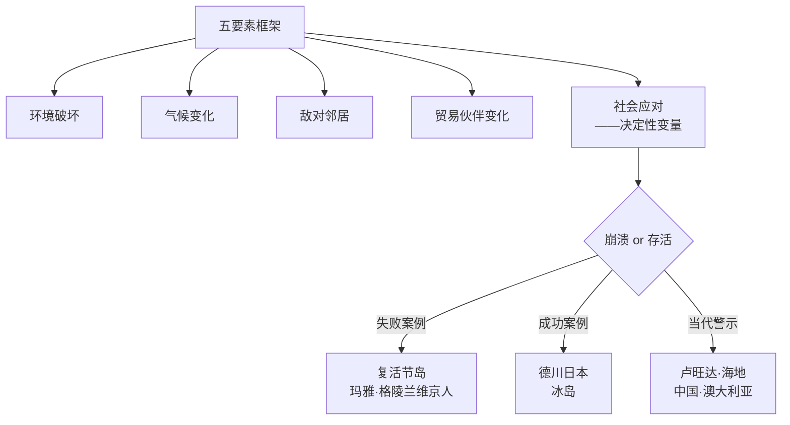
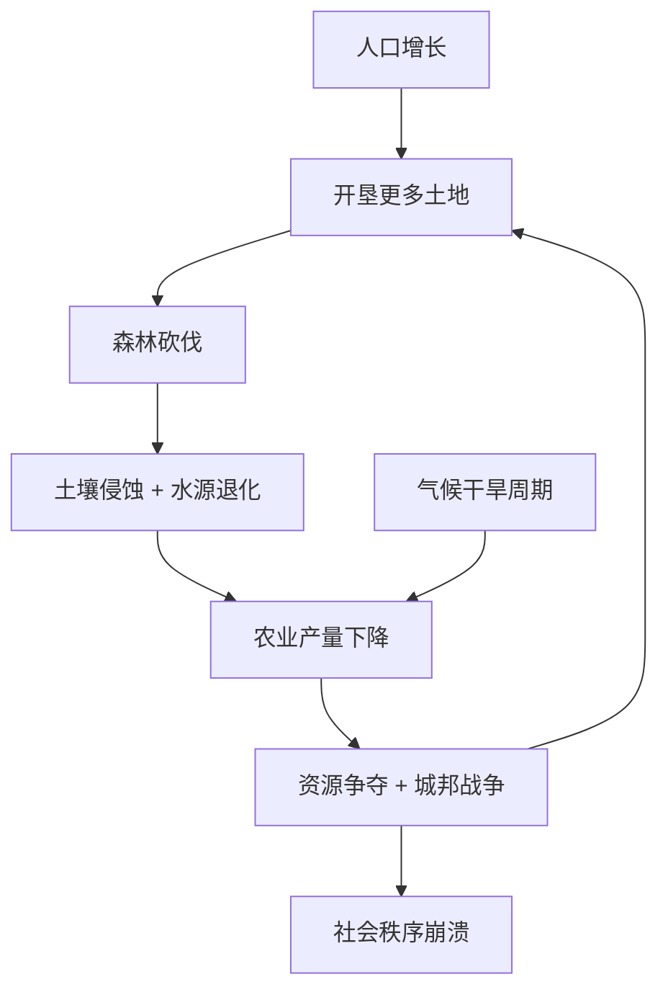
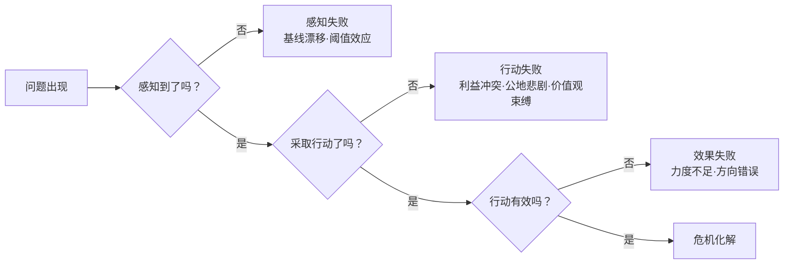

# 《崩溃》深度读书笔记

> [!abstract] 全书速览
> 为什么有些社会在繁荣的顶点突然瓦解，而另一些却在更恶劣的条件下存续了数百年？贾雷德·戴蒙德在[[《枪炮、病菌与钢铁》]]之后，把目光从文明的兴起转向了文明的消亡。《崩溃：社会如何选择成败兴亡》不是一部末日预言，而是一次跨越数千年、横跨五大洲的诊断——他拆解了从复活节岛到格陵兰维京殖民地、从卢旺达到现代蒙大拿的十余个案例，试图回答一个让人不安的问题：当一个社会走向自我毁灭时，究竟是"不能"还是"不愿"做出改变？戴蒙德提出了一个五要素框架——环境破坏、气候变化、敌对邻居、贸易伙伴的变化、社会对问题的回应——来解释社会崩溃的深层逻辑。这本书最令人警醒之处在于，它不只是在讲过去，而是在问你——今天的世界，正在走哪条路？

## 历史坐标

《崩溃》出版于2005年，是戴蒙德继1997年普利策奖获奖作品[[《枪炮、病菌与钢铁》]]之后的姊妹篇。如果说前一本书追问的是"为什么是欧亚大陆而非其他大陆的人征服了世界"，那么《崩溃》追问的方向恰好相反：为什么曾经强大的社会会走向灭亡？

戴蒙德的学术身份本身就很独特。他是加州大学洛杉矶分校的地理学教授，但他的学术生涯横跨生理学、演化生物学、生物地理学和环境史。这种跨学科的背景决定了他看待历史的方式——他不是从政治事件或伟人的角度来讲历史，而是从生态系统、地理环境和资源约束的角度来讲。在他眼里，一个社会的兴衰首先是一个生态学问题。

这种视角在2005年的出版背景下格外切中时代。21世纪初，气候变化的科学共识正在形成，环境问题从边缘议题走向主流讨论。戴蒙德选择用历史上真实发生过的社会崩溃来为当代敲响警钟——如果你想知道环境退化最终会导致什么后果，不必等到未来，历史已经给出了答案。你不需要去想象一个假设的末日场景，你只需要去看看复活节岛和格陵兰的维京殖民地发生了什么。

> [!note] 知识谱系
> 他的叙事角度是比较史学与环境史的结合。他不讲单一社会的兴衰史，而是同时展开多个案例进行横向对比，追问同样的核心问题：为什么面对相似的环境压力，有些社会崩溃了而有些没有？他的立场处于两种简单化叙事之间——他既拒绝环境决定论（认为地理决定一切），也拒绝人类例外论（认为技术可以无限制地超越环境约束）。他的核心主张是：环境设定了约束条件，但在这些约束条件内，==社会的选择——政治制度、文化价值观、经济利益结构、信息反馈机制——才是决定成败的关键变量==。这本书与[[《历史的教训》]]从文明周期视角审视兴衰形成互补，与阿西莫格鲁和罗宾逊的[[《国家为什么会失败》]]构成学术对话——后者强调制度而非环境是决定性因素。

## 全书叙事线

《崩溃》的叙事结构像一座精心搭建的阶梯，从近到远，再从远到近，最终把所有线索汇聚到一个指向当下的结论。

戴蒙德用蒙大拿州作为开场。蒙大拿不是什么遥远的失落文明，而是美国本土一个看起来风景如画的地方。但在这片美景之下，你会看到矿业污染、森林退化、水资源争夺和经济转型的困境。用一个读者可能去过或听过的地方做引子，戴蒙德的意思很明确：崩溃不是别人的故事，它就在你身边。蒙大拿的比特维尔河谷曾经是美国最富饶的农牧区之一，但到21世纪初，这里面临着森林火灾频率不断增加（因为过去一个世纪的防火政策反而导致了可燃物的大量积累）、土壤盐碱化和矿业遗留的有毒废物、水资源争夺、外来物种入侵、人口增长带来的开发压力。每一个问题单独看都不是致命的，但它们叠加在一起形成了一个复杂的压力系统。

然后，他把你带入历史深处。全书的核心部分是一系列详细的案例研究，大致可以分为两组："崩溃组"和"存续组"。崩溃组包括复活节岛、皮特凯恩岛和亨德森岛、安纳萨齐印第安人、玛雅文明，以及格陵兰的维京殖民地——这些社会在不同的时间和地点，因为不同的具体原因，走向了相同的终局。存续组则包括新几内亚高地、蒂科皮亚岛、德川时代的日本和冰岛——它们面对的环境压力并不比崩溃组小，却找到了可持续的应对方式。

在铺陈完这些案例之后，戴蒙德把目光转向现代世界。他讨论了卢旺达大屠杀背后的人口与环境因素、海地与多米尼加共和国同处一座岛屿却命运迥异的对比、中国和澳大利亚面临的环境挑战，以及大企业在环境问题中的双面角色。最后一部分，他提出了完整的五要素分析框架和决策失败链条，并把它们应用于当代全球环境危机，追问：现代社会是否也在重复古代社会的错误？

> [!tip] 核心区分
> 戴蒙德区分了崩溃的"条件"和"原因"。前四个因素（环境破坏、气候变化、敌对邻居、贸易伙伴变化）是条件——它们增加风险但不决定命运。==第五个因素（社会应对）才是原因——同样的环境压力下，不同社会因应对方式不同而走向截然不同的结局。==

全书的逻辑线可以浓缩为一句话：先让你看到崩溃真实发生过，再让你看到崩溃不是必然的（因为有些社会成功避免了），最后问你——知道了这些，我们要怎么选？

## 关键转折深度解读

### 复活节岛：一座孤岛上的自我毁灭

复活节岛的故事是整本书最具象征意义的案例，也是戴蒙德反复引用的核心隐喻。他把这座岛视为人类社会自我毁灭的"纯净实验"——因为它极度偏远，外部因素（敌对邻居、贸易伙伴变化）几乎不存在，所有崩溃因素都来自内部。

当波利尼西亚人大约在公元900年到达这座太平洋上距最近有人居住岛屿约2000公里的孤岛时，他们发现了一片被亚热带森林覆盖的土地。岛上有一种现已灭绝的大型棕榈树，高达25米，是世界上最大的棕榈品种之一。最初几百年，人口和文化蓬勃发展。至少十二个部落各自控制一个楔形区域，从海岸延伸到内陆，竞相建造巨型石像——摩艾。最大的高达10米、重达82吨。建造和运输这些石像需要大量木材制作滚木、杠杆和绳索。

花粉记录清楚地显示了崩溃的过程：大型棕榈树的花粉比例从最初的丰富逐渐降低，到大约公元1400至1600年间几乎消失。如果你试着想象森林消失后的连锁反应，你会发现它是如此致命——没有大树就无法建造远洋独木舟，切断了深海捕鱼的能力（考古遗址中的鱼骨比例从早期的丰富骤降至晚期几乎为零）；没有树木覆盖的土壤暴露在风雨中，侵蚀加剧，农业产量下降；没有木材可用作燃料，岛民不得不烧草和甘蔗渣；最致命的是，没有木材就无法建造可以离岛的大型船只——岛民成了自己创造的灾难中的囚徒。

到17世纪，社会秩序彻底瓦解。部落间战争频发，石像被推倒作为对敌对部落的羞辱。人口从巅峰期大约15000人暴跌至2000-3000人。考古证据中出现了大量人骨上的切割痕迹，暗示人相食的现象。1722年荷兰探险家罗格文到达时，看到的是一个支离破碎的社会——穿着破烂的居民住在洞穴里，残留的石像有的已被推倒，无人再建造新的。

戴蒙德通过这个案例提出了一个让人夜不能寐的问题：当最后一棵树被砍倒的时候，砍树的人在想什么？

> [!tip] 三个深层机制
> **公地悲剧**：森林是所有部落共享的资源，但没有任何机制来协调砍伐行为。每个部落的理性选择是尽可能多地使用木材来建造更大的石像，因为如果自己不用，别的部落也会用掉。==这种"个体理性、集体灾难"的结构，在当今的全球碳排放、远洋渔业和地下水开采中你都能看到。==
>
> **代际遗忘**：森林消失历时约500年，大约20代人。对每一代人来说，岛上的景观变化在他们的生命周期内可能并不显著。他们的"正常"就是出生时看到的样子。没有人有全岛曾经森林密布的记忆。
>
> **精英利益锁定**：建造石像的传统赋予了祭司和酋长阶层权力和地位。即便环境退化已经开始，这些精英也没有动力改变——因为改变意味着削弱自己的权力基础。

> [!warning] 学术争议
> 不过你需要知道，这个叙事后来受到了一些考古学家的质疑。Terry Hunt和Carl Lipo等学者提出了不同的解释：复活节岛的森林退化主要是波利尼西亚鼠（随殖民者到来的入侵物种）啃食棕榈种子的结果，而非人类过度砍伐。人口崩溃更多是欧洲人带来的疾病和奴隶贸易的结果，而非生态崩溃。这场学术争论至今没有定论，但它提醒你，戴蒙德讲述的故事虽然引人深思，但未必是唯一正确的版本。

### 格陵兰维京人：在错误的时间坚持错误的身份

如果复活节岛的故事是关于资源耗竭的，那格陵兰维京殖民地的故事则是关于文化执念如何杀死一个社会。这是全书分析最详尽的案例，也是戴蒙德认为最具启示意义的一个——因为维京人的灭亡有一个直接的对照组：在同一地区、同一时期、面对同样的环境挑战，因纽特人不仅生存下来，而且蓬勃发展。

公元985年前后，"红色"埃里克因犯杀人罪被冰岛流放，率领一批移民到达格陵兰西南部的峡湾地区。他给这块冰雪覆盖的土地取了个诱人的名字——"绿色之地"（Greenland），这可能是历史上最早的房地产虚假广告之一。在鼎盛时期，殖民地拥有约5000人口、两个定居区、一座主教座堂和多座教堂，和与欧洲的贸易往来——主要出口海象牙、毛皮和北极熊皮，换取铁器、教堂用品和其他必需品。

戴蒙德的分析集中在一个关键困境上：维京人身处北极边缘的严酷环境中，身边就有因纽特人——一个完美适应了这种环境的民族。因纽特人用海豹皮制成的皮划艇在冰冷的海水中猎杀海豹和鲸鱼，穿着多层海豹皮和驯鹿皮制作的高度隔热衣物，用狗拉雪橇进行远距离运输。他们的整个生存策略都围绕海洋资源展开。

| 维度 | 维京人 | 因纽特人 |
|------|--------|----------|
| 食物来源 | 畜牧为主（牛、羊） | 海洋哺乳动物为主（海豹、弓头鲸） |
| 技术 | 欧洲畜牧和石砌建筑技术 | 皮划艇、鱼叉、冰上呼吸孔狩猎、狗拉雪橇 |
| 服装 | 编织毛衣 | 多层海豹皮和驯鹿皮隔热衣物 |
| 信仰 | 天主教，建造教堂 | 因纽特传统信仰 |
| 对彼此的态度 | 称因纽特人为"skraelings"（野蛮人） | 极少与维京人交流 |
| 结果 | 15世纪完全消亡 | 繁荣发展至今 |

但维京人拒绝向因纽特人学习。在考古证据中，维京人的遗址几乎没有鱼骨——这在一个临海社会中简直不可思议。格陵兰周围海域的鱼类资源极为丰富，冰岛和挪威的维京人都是活跃的渔民，但格陵兰维京人似乎不吃鱼。两个社会在格陵兰共存了至少200年，但考古记录中几乎没有技术交流的证据。北欧萨迦文学中关于因纽特人的描述充满了蔑视。

他们坚持养牛养羊，像在挪威和冰岛一样，即便格陵兰的草场远比北欧贫瘠。他们把有限的资源用于建造欧式教堂。他们投入大量人力去猎捕海象——不是为了吃，而是因为海象牙是他们与欧洲贸易的主要商品，用来换取他们心心念念的欧洲奢侈品和教堂用品。

14世纪气候进入"小冰期"，格陵兰变得更加寒冷。维京人的畜牧业本来就在生存边缘，气候恶化使情况更加严峻。同时，欧洲市场上海象牙被非洲象牙取代，贸易收入下降。与欧洲的航运联系变得越来越不规则，最终完全断裂。到15世纪中期，最后一批维京人消失了。考古学家在维京人最后的定居点发现了骨骼显示严重营养不良的证据，牲畜的骨骼也表明它们在临死前被饲喂了异常的食物。

> [!tip] 核心洞察——认知锁死
> 这个案例的深刻之处在于它揭示了一种比资源匮乏更致命的东西：==认知锁死==。维京人不是"不能"适应——因纽特人证明了在同样的环境中可以生活得很好。他们是"不愿"适应。他们的欧洲基督教身份认同是如此强烈，以至于宁可饿死也不愿意像"野蛮人"那样生活。放弃他们的生活方式不仅意味着技能的转换，更意味着身份的瓦解——不再是"自己人"了。
>
> 如果你把这个逻辑放到更大的历史和现实中，你会发现它到处都是。当一个组织、一个企业、一个国家说"这不是我们做事的方式"时，它可能正在重演格陵兰维京人的剧本。

### 玛雅文明：帝国的生态超载与末日狂欢

玛雅文明是中美洲最辉煌的古代文明之一——独立发明了零的概念，天文历法的精确度令人惊叹，金字塔和宫殿建筑至今令人叹为观止。然而，在公元9世纪，南部低地的大量城市在几十年内被遗弃在丛林之中。

玛雅低地表面看起来是丰饶的热带丛林，实际上生态系统极其脆弱。薄薄的表土覆盖在石灰岩基底上，一旦森林被清除，雨水直接冲刷裸露的表土，几年之内就可能流失殆尽。降雨的高度季节性意味着旱季水资源严重依赖蓄水设施。与尼罗河或两河流域不同，这里没有大型河流提供灌溉和肥沃的冲积土。

> [!warning] "末日狂欢"现象
> 考古证据揭示了一个让人深思的细节：在崩溃前的最后几十年里，玛雅贵族建造了比以往任何时期都更加奢华的宫殿和纪念碑。这种"末日狂欢"——在危机加剧时反而加倍投入传统的权力展示——在复活节岛晚期的石像建造中也呈现了类似的规模升级。==当精英阶层感受到权力受到威胁时，他们的反应不是改变策略，而是加倍努力维护传统==——用更大的建筑、更隆重的仪式来强化正在动摇的社会秩序。面对威胁时加倍维护传统比改变策略在心理上更容易——它满足了"掌控感"的需要，即使这种掌控是虚幻的。

值得注意的是，并非所有玛雅地区都崩溃了。尤卡坦半岛北部的一些城市在南部崩溃后继续繁荣了数百年——更好的水资源条件（天然溶洞提供了稳定水源）、更广泛的对外贸易网络、以及可能存在的制度差异，都发挥了作用。这个对比再次强化了戴蒙德的核心论点：环境压力不是决定论的，社会应对方式至关重要。

### 海地与多米尼加：同一座岛上的两种命运

伊斯帕尼奥拉岛是加勒比海上第二大岛，被一条国界线分成两个国家：西边是海地，东边是多米尼加共和国。从卫星照片上看，这条国界线清晰得令人震惊——西边几乎是光秃秃的，东边则保留了大片绿色森林。

戴蒙德用这个案例来论证：即使在相似的地理和气候条件下，不同的政策选择也会导致截然不同的环境和社会结果。两国的起点确实不完全相同——海地的西部气候较干燥、地形更崎岖，法国殖民者对海地的开发也比西班牙对多米尼加的更加高压。但自然条件的差异远不足以解释两国今天的巨大分歧。

多米尼加共和国在独裁者特鲁希略执政期间（1930-1961），虽然政治上残暴，但出于个人经济利益和对木材资源的垄断心理，建立了一定的森林保护制度。他的继任者巴拉格尔更进一步，在1960年代末推行了严格的森林保护政策，禁止商业伐木，建立了国家公园体系。这些政策不全是出于环保理想——其中有独裁者巩固权力的算计——但客观上保住了大面积森林，后来还发展出了生态旅游，形成了保护森林的经济激励。

海地则经历了持续的政治动荡，缺乏能够执行长期政策的稳定政府。贫穷人口对薪柴和木炭的需求不断蚕食剩余的林地。森林消失后土壤侵蚀加剧，农业产量下降，贫困加深——形成了一个向下的恶性循环。到21世纪初，海地的森林覆盖率已不足2%。

> [!note] 学术补充
> 一些学者批评戴蒙德在这里的分析过于简化。殖民历史的不同（法国vs西班牙殖民模式）、独立方式的不同（海地的奴隶革命vs多米尼加的和平独立）、国际关系的差异（美国对两国的不同态度）等因素也发挥了巨大作用。把差异主要归因于环境管理，可能忽略了更深层的政治经济结构。==同样的岛屿，不同的选择，不同的命运——但"选择"背后的结构性约束也不应被忽视。==

### 卢旺达：当人口压力遇上族群裂痕

1994年的卢旺达大屠杀是20世纪最黑暗的事件之一——在大约100天里，估计有80万到100万图西族及温和派胡图族人被杀害。主流解释通常聚焦于族群仇恨和政治操弄——这当然是核心因素。但戴蒙德提出了一个补充性的视角：人口压力和环境退化是暴力的催化剂。

到1990年代初，卢旺达已经是非洲人口密度最高的国家之一——大约每平方公里300人，与荷兰相当，但荷兰有现代农业技术和工业经济，卢旺达没有。人均可耕地面积已经小到难以维持一个家庭的基本生存。年轻男性看不到获得土地和建立家庭的前景。

戴蒙德援引了一个特别有说服力的证据：在一些地区，暴力不仅发生在胡图族和图西族之间，也发生在同族群内部——一些凶手杀害的是自己的胡图族邻居，动机是夺取对方的土地。而在人口密度较低、土地压力较小的地区（即使族群构成相似），暴力的程度也明显较低。

> [!warning] 争议与边界
> ==环境压力不是原因，但它是乘数。==这个分析引发了相当大的争议。批评者认为戴蒙德低估了政治因素的决定性作用——大屠杀是被精心策划和组织的政治行为，不是资源争夺的自然结果。把环境因素引入大屠杀的分析框架，有可能为施暴者提供"开脱"的借口。这是一个严肃的批评，值得你在阅读时保持警觉。

### 德川日本：一个社会如何在悬崖边转身

在一系列令人压抑的崩溃叙事之后，德川时代的日本（1603-1867）是全书最振奋人心的案例。

16世纪日本经历了严重的森林退化——战国时代的城堡建设（日本城堡是全木结构，一座大型城堡需消耗数千立方米上等木材）、造船、城市扩张和农业开垦消耗了大量森林。到17世纪早期，许多地区的森林已经严重退化，洪水和山体滑坡日益频繁。如果按照复活节岛的剧本发展下去，日本完全可能陷入严重的生态危机。

> [!example] 五项核心政策
> 1. **产权明确化**：将森林所有权分配给藩主和村庄——当没有人拥有森林时也没有人有动力保护它
> 2. **砍伐管制**：严格的伐木许可制度，限制可砍伐的树种、数量和地点，违规者面临严厉惩罚
> 3. **主动造林**：发展精细林学知识——根据海拔、坡度、朝向和土壤类型选择适宜树种和种植密度，到18世纪林学达到极高水平
> 4. **替代资源开发**：推广煤炭替代木材燃料，开发竹子等替代建材
> 5. **需求侧管理**：限制建筑规模和用材标准，减少木材消费需求

如果你想理解日本为什么能成功，戴蒙德分析了几个关键条件。中央集权的政治结构使长期政策的制定和执行成为可能——德川幕府不需要面对选举压力，你可以把它想象为一个不用担心连任的CEO，可以做对公司长期有利但短期痛苦的决定。岛国的地理使监管相对容易。长达260年的和平期消除了军事消耗（城堡建设、造船、武器制造大幅减少）。高识字率便于政策传播。日本文化传统中对自然的敬畏和审美——体现在园林、茶道、花道等实践中——为环境保护提供了价值观层面的支撑。

但你不能简单地把这个案例浪漫化。德川时代的森林保护伴随着严格的社会等级制度和个人自由的极大限制。普通农民不得随意使用山林资源，违规者可能被处死。这是一种自上而下的强制性可持续——有效，但代价高昂。

> [!tip] 对比启示
> 冰岛则提供了另一个正面案例，但逻辑路径不同。冰岛没有中央集权政府，它的环境恢复主要依靠社区层面的自我约束和习惯法。==成功的环境管理不存在唯一的制度模式——中央集权和社区自治都可以奏效，关键在于制度能否有效协调个体行为、将外部性内化、并维持长期视野。==复活节岛和德川日本都是岛国，都面临森林退化——差异不在环境，而在制度。

## 历史的模式

当你把这些散落在不同时空的案例放在一起看，会浮现出几个反复出现的模式。

**爬行性常态与基线漂移。** 环境退化几乎从来不是一夜之间发生的。变化是如此缓慢，以至于每一代人都把自己出生时的环境状态当作"正常"。你的祖父记得河里有鱼的时候，你的父亲记得河水还算干净的时候，而你只记得一条污浊的河流——但对你来说，这就是它一直以来的样子。戴蒙德称之为"风景失忆症"。正是这种认知陷阱，使得社会在环境退化的过程中迟迟不会发出警报。复杂系统往往在临界点之前表现出迷惑性的稳定——一切看起来正常，直到突然崩溃。一个湖泊可以在承受越来越多的营养物污染的同时保持清澈，直到某一天突然变绿（藻类大爆发），而回到清澈状态所需消除的污染物远多于导致变绿所需增加的。这种非线性的阈值效应，使得预测和预防变得极其困难。

**精英与大众的利益分离。** 在很多崩溃案例中，当环境危机加深时，社会精英阶层往往是最后受到影响的。他们控制着最好的土地、最多的资源、最坚固的住所。这意味着有能力做出决策的人恰恰是最感受不到危机的人。在复活节岛，石像的建造一直持续到森林几乎消失殆尽。在玛雅文明中，贵族的宫殿和神庙在崩溃前夕仍在扩建。当决策者被自己的特权隔绝于后果之外时，灾难性的决策几乎是注定的。更微妙的是，==精英并不一定是有意识地选择牺牲社会利益——他们的世界观被自身的利益位置所塑造==。一个依赖森林贸易为生的木材商人，自然倾向于低估森林退化的严重性和高估森林再生的能力。你的利益决定了你的注意力朝向哪里，而注意力决定了你看到什么"事实"。

**沉没成本的致命惯性。** 格陵兰维京人在他们的欧式农牧生活方式上投入了几百年的积累。要放弃这一切去学因纽特人的生活方式，不仅意味着技能的转换，更意味着身份的瓦解。这种"我们已经在这条路上走了太远，不能回头"的心理，在历史中反复出现。它不仅适用于古代社会，也适用于今天的化石能源经济——当数万亿美元的基础设施、数百万个就业岗位、整个国家的经济结构都建立在化石燃料之上时，"转型"的口号说起来容易，做起来极难。

**公地悲剧和集体行动困境。** 从复活节岛的森林到当今的全球碳排放，每当资源是共享的、损害是外部化的，个体理性就会导向集体灾难。渔民知道过度捕捞的后果，但单方面减少捕捞量只会让自己吃亏。全球碳排放是当代最大规模的公地悲剧：每个国家都知道气候变化的风险，但单方面减排在经济上不划算。解决公地悲剧只有三种路径：==私有化==（使所有者有动力保护自己的财产）、==外部监管==（政府强制执行使用限制）、或==社区自治==（群体内部建立规则和相互监督机制）。没有哪一种方案是万能的，关键在于匹配具体的情境。你在工作和生活中遇到的很多协调问题——团队中的"搭便车"、跨部门的资源争夺、小区的公共设施维护——本质上都是公地悲剧的变体，同样需要从这三种路径中选择。

**成功逆转的关键条件。** 那些成功避免崩溃的社会有一些共同特征：它们能够感知到环境变化（信息传递有效）；决策者的利益与社会整体利益基本一致（而非分离）；它们愿意重新审视自己的核心做法（而非固守传统）；它们有足够强大的制度来执行长期政策（而非只顾眼前）。成功不需要所有条件同时满足，但需要在关键时刻做出正确的判断。而且制度形式不唯一——中央集权的德川日本和社区自治的冰岛都成功了，关键不在形式，在于制度能否有效协调个体行为、将外部性内化。

## 作者的史学方法

戴蒙德的研究方法是跨学科的比较环境史。他综合运用考古学证据（花粉分析、骨骼化石、碳14测年）、生态学数据（森林覆盖率变化、物种灭绝记录）、人类学田野调查（他在新几内亚有数十年的研究经验）、气候学（理解气候波动的时间和影响）以及现代统计数据来构建论证。

他最核心的方法论工具是五要素框架和"自然实验"。他把面对相似挑战的不同社会放在一起对比——波利尼西亚群岛、海地与多米尼加、维京人与因纽特人——以识别导致不同结果的关键变量。同时，他用决策失败链（感知失败、监测失败、行动失败、效果失败）来解释为什么社会在本可以自救的窗口期内做出了错误决策。

这种方法的优势是显而易见的——它提供了一个系统性的分析工具，使得不同时空的案例可以在同一个框架下进行比较。当你看到相同环境中一个社会崩溃、另一个存活，你很难不得出"应对方式是关键"的结论。对你来说，这个框架的实用价值在于它可以迁移到任何需要分析组织或社会困境的场景中。

> [!warning] 主要学术争议
> - **环境还原论倾向**：一些历史学家认为戴蒙德过于强调环境因素，相对忽视了政治制度、经济结构、意识形态和权力关系的独立作用
> - **确认偏差风险**：他选择的崩溃案例大多是环境因素突出的案例，这自然会强化"环境因素至关重要"的结论
> - **案例解读的简化**：对具体案例的解读有时会简化复杂的学术争论以适应叙事框架，复活节岛就是典型
> - **时间尺度跳跃**：从古代小型社会（一座163平方公里的孤岛）中提炼出的规律，能在多大程度上适用于现代全球化社会？
> - **政治生态学批评**：海地的环境退化不仅是政策选择的结果，更是殖民历史、不平等的国际贸易和外债压力的产物
> - ==但核心价值不受影响：五要素框架和决策失败分析，即使在细节上需要修正，仍然是帮助你理解社会自毁选择的最系统的分析工具之一==

## 以史鉴今

读完这本书，你很难不带着一种不安感审视当下的世界。

戴蒙德识别出的那些崩溃模式——爬行性常态、精英与后果的隔离、沉没成本的惯性、对问题的否认——在今天的全球环境危机中几乎一一对应。气候变化的讨论中，"温水煮青蛙"的比喻之所以被反复使用，就是因为它精确描述了爬行性常态的陷阱。化石能源行业的游说力量，与复活节岛上那些不愿停止建造石像的精英之间，存在着令人不安的结构性相似。

但这本书也给了你理由保持谨慎的乐观。德川日本的案例证明，一个社会可以在生态灾难的边缘悬崖勒马。冰岛的经验表明，如果管理得当，即使是脆弱的生态系统也可以支撑人类社会数百年。关键不在于环境压力是否存在——它总是存在的——而在于社会如何回应。这对你来说意味着：你所在的组织、你所关注的社会议题，都不是注定要走向失败的。

二十年过去了，戴蒙德最核心的判断——当代世界面临的环境挑战比大多数人认为的更严重、更紧迫——得到了强有力的支持。气候变化的速度和影响已超过了他2005年时的大多数预期。全球物种灭绝速率持续加速。水资源压力在多个地区不断恶化。他可能低估了可再生能源技术进步的速度——太阳能和风电成本下降了90%以上——但他对"技术能否赶上退化速度"的追问仍然有效。技术进步是真实的，环境退化也在继续，两者之间的赛跑尚未分出胜负。这本书真正的力量不在于预测某个具体的灾难，而在于它给了你一套可以反复使用的分析工具，帮助你理解为什么社会——以及你所在的组织——有时候会眼睁睁地走向自我毁灭。

> [!tip] 实用分析工具
> - **五要素诊断**：当你看到一个社会、一个组织甚至一个行业面临困境时，分别检查环境压力、外部变化、竞争威胁、依赖关系和应对能力——结构化思考比笼统判断有用得多
> - **识别"格陵兰陷阱"**：当组织面对变革时追问——我们有没有因为身份认同或文化惯性而拒绝学习明显更好的做法？最大的阻力往往来自从现状中获益最多、且身份认同与现状深度绑定的人。==改变策略相对容易，改变身份极其困难==
> - **警惕基线漂移**：你认为"正常"的环境、工作、生活状态，可能只是你这一代人的记忆基线——试着用更长的时间跨度审视趋势而非只关注短期波动
> - **精英-社会利益对齐**：精英的利益与社会的利益不一致时，指望精英自发改变是天真的——需要制度设计来对齐激励
> - **公地悲剧三解法**：私有化、监管或社区自治——不存在唯一正确答案，关键在于匹配具体情境
> - **识别"末日狂欢"**：面对威胁时加倍投入旧模式是常见的心理反应——识别这种模式是避免"崩溃前加速"的第一步
> - **核心信息**：==崩溃不是不可避免的命运，而是一系列可识别、可预防的决策失败的累积结果。== 但前提是，你必须在还有选择余地的时候就开始行动。等到最后一棵树被砍倒，一切就太晚了。戴蒙德留给你的问题是：你的社会、你的组织，正在做出什么样的选择？你是在走德川日本的路，还是在走复活节岛的路？

## 延伸阅读

- [[《枪炮、病菌与钢铁》]] - 贾雷德·戴蒙德：姊妹篇，一本讲"为什么起来"，一本讲"为什么倒下"，对照阅读效果最佳
- [[《历史的教训》]] - 威尔·杜兰特：从更宏观的文明周期视角审视兴衰模式，与环境分析视角互补
- [[《国家为什么会失败》]] - 阿西莫格鲁、罗宾逊：制度视角解释国家成败，与戴蒙德的环境视角形成有价值的学术对话——制度和环境谁更重要？更好的问题可能是：它们如何互动？
- [[《人类简史》]] - 尤瓦尔·赫拉利：侧重认知与文化建构维度，为人类社会命运提供另一个解释框架
- [[《全球通史》]] - 斯塔夫里阿诺斯：从传统编年史角度覆盖全球视野，与戴蒙德的主题式分析形成方法对照
