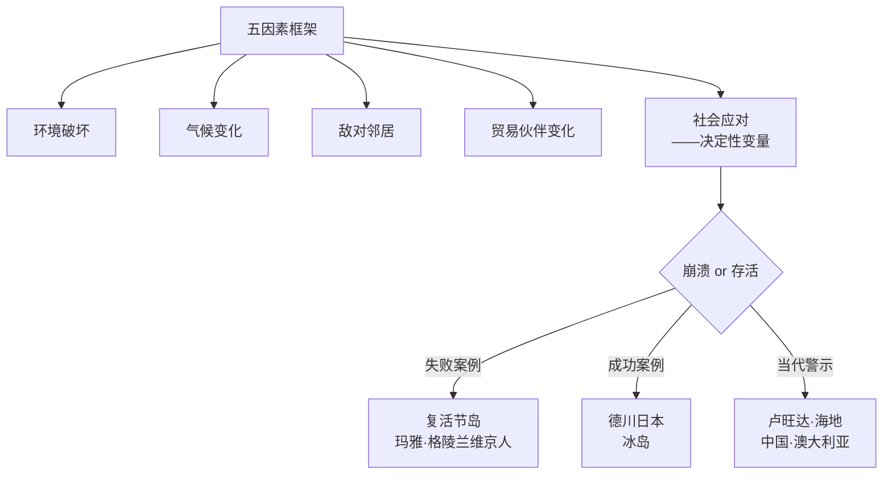
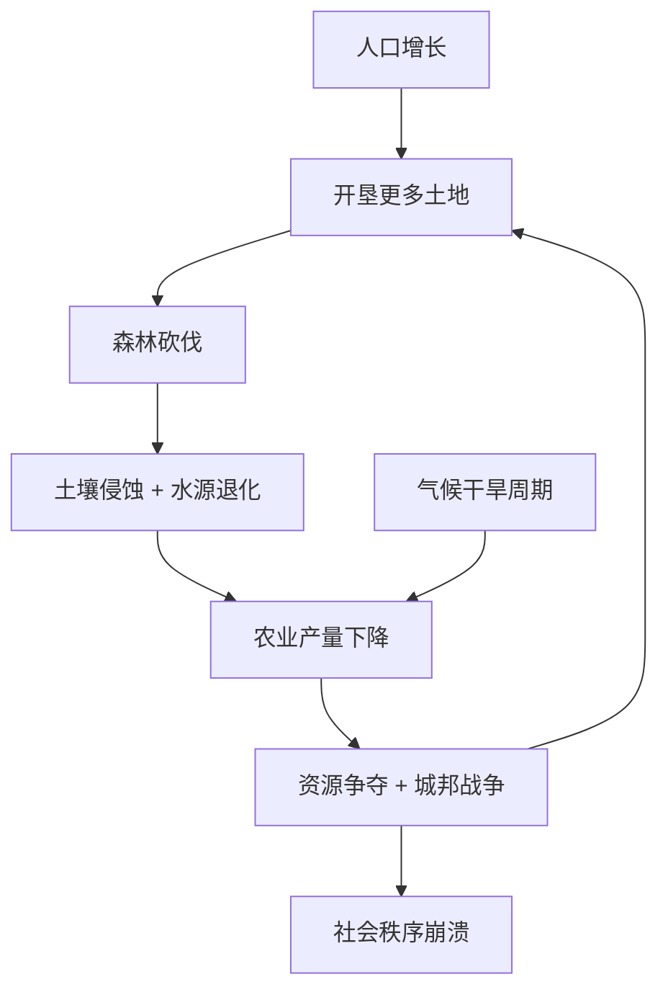
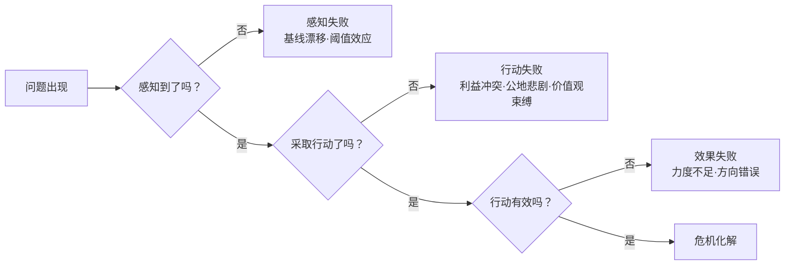

# 《崩溃》深度读书笔记

> [!abstract] 全书速览
> 为什么一些曾经繁荣昌盛的人类社会最终走向自我毁灭？戴蒙德通过系统比较古今十余个社会的兴衰命运，论证了一个核心命题：==社会崩溃不是环境决定的宿命，而是社会面对环境压力时做出的选择的结果==。他构建了一个五因素分析框架——环境破坏、气候变化、敌对邻居、贸易伙伴变化和社会应对——来诊断崩溃的条件和原因。同样遭遇森林退化，复活节岛走向毁灭而德川日本成功逆转，差别不在环境，在于社会如何回应。

## 历史坐标

《崩溃：社会如何选择成败兴亡》由加州大学洛杉矶分校地理学教授贾雷德·戴蒙德于2005年出版。戴蒙德兼具进化生物学、生理学和生物地理学的跨学科背景，1997年凭借[[《枪炮、病菌与钢铁》]]获普利策奖。写作动机来自他在新几内亚数十年的田野观察和对蒙大拿州环境退化的亲身体验——他发现无论古今，人类社会面对环境危机时表现出惊人的相似模式。

如果说[[《枪炮、病菌与钢铁》]]回答的是"为什么某些社会获得了征服的能力"，《崩溃》回答的是硬币的另一面——"为什么拥有这种能力的社会有时会自我瓦解"。戴蒙德的立场处于两种简单化叙事之间：他既拒绝环境决定论（认为地理决定一切），也拒绝人类例外论（认为技术可以无限制地超越环境约束）。他的核心主张是：环境设定了约束条件，但在这些约束条件内，社会的选择——政治制度、文化价值观、经济利益结构、信息反馈机制——才是决定成败的关键变量。

> [!note] 知识谱系
> 这本书与[[《历史的教训》]]从文明周期视角审视兴衰形成互补。它与阿西莫格鲁和罗宾逊的[[《国家为什么会失败》]]构成学术对话——后者强调制度而非环境是决定性因素。在环境史领域，它承接了阿尔弗雷德·克罗斯比的《生态帝国主义》传统，但超越了前辈：不仅分析环境如何影响社会，更追问社会为什么在面对明确警告时仍然做出自毁决策。这后一个问题——==决策失败的机制==——是《崩溃》最独特也最有价值的贡献。

## 全书叙事线

全书的论证沿着一条清晰的线索展开：先建立分析框架，再用案例检验框架，最后将历史教训投射到当代。

> [!tip] 核心区分
> 戴蒙德区分了崩溃的"条件"和"原因"。前四个因素（环境破坏、气候变化、敌对邻居、贸易伙伴变化）是条件——它们增加风险但不决定命运。==第五个因素（社会应对）才是原因——同样的环境压力下，不同社会因应对方式不同而走向截然不同的结局。==

戴蒙德的分析体系建立在两个嵌套的模型之上。五因素框架诊断"崩溃发生的条件"，决策失败链解释"崩溃为什么没被阻止"。前者关注环境和外部压力，后者关注社会内部的认知、利益和制度障碍。理解这个结构很重要——如果你只看到环境压力而忽略了决策机制，你就会陷入环境决定论的窠臼；如果你只关注决策过程而忽略了环境约束，你就会高估人类意志的力量。

## 关键转折深度解读

### 第一个转折：复活节岛——孤立社会的自毁实验

复活节岛（拉帕努伊）是地球上最偏远的有人居住岛屿之一，距最近的有人岛屿皮特凯恩约2000公里。戴蒙德将其视为人类社会自我毁灭的"纯净实验"——因为这个岛屿极度偏远，外部因素（敌对邻居、贸易伙伴变化）几乎不存在，所有的崩溃因素都来自内部决策。

波利尼西亚人约公元900年到达时，岛上覆盖茂密的亚热带森林，以一种现已灭绝的大型棕榈树为主，高达25米，是世界上最大的棕榈品种之一。最初几百年人口和文化蓬勃发展。至少十二个部落控制岛上不同的楔形区域（从海岸延伸到内陆），竞相建造巨型石像（摩艾）以彰显权力——最大的高达10米、重达82吨。建造和运输这些石像需要大量组织协调能力和资源投入：木材制作滚木和绳索，大量人力搬运和竖立。到15世纪，花粉分析清楚显示大型棕榈树的花粉比例从最初的丰富逐渐降低，最终几乎消失——森林被砍伐殆尽。

> [!example] 森林消失的连锁反应
> 1. 无法建造远洋独木舟 → 切断深海捕鱼能力（考古遗址中鱼骨比例从早期丰富骤降至晚期几乎为零——深海鱼类特别是海豚曾是蛋白质的主要来源）
> 2. 土壤暴露在风雨中 → 侵蚀加剧 → 农业产量下降
> 3. 没有木材可用作燃料 → 不得不烧草和甘蔗渣，甚至在土坑中用石头蓄热替代明火
> 4. 无法建造离岛船只 → 岛民成了自己创造的灾难中的囚徒——与复活节岛的孤立性叠加，这意味着他们没有"逃生出口"

到17世纪社会秩序彻底瓦解。部落间战争频发，石像被推倒作为对敌对部落的羞辱。人口从巅峰期大约15000人暴跌至2000-3000人，考古证据中大量人骨上的切割痕迹暗示人相食。1722年荷兰探险家罗格文到达时看到的是一个支离破碎的社会——穿着破烂的居民住在洞穴里，残留的石像有的已被推倒，无人再建造新的。复活节岛的教训对今天的意义极为直接：我们正在对全球资源做复活节岛人对森林做的事，区别只在于地球不是孤岛——但在宇宙尺度上，它事实上就是。

> [!tip] 三个深层机制
> **公地悲剧**：森林是共享资源，没有机制协调砍伐行为。每个部落的理性选择是尽可能多地使用木材——==这种"个体理性、集体灾难"的结构在当今的全球碳排放、远洋渔业和地下水开采中一模一样==。
>
> **代际遗忘**（滑动基线综合征）：森林消失历时约500年、约20代人。每一代都把眼前景观视为"正常状态"——没有人记得岛上曾经森林密布。你今天觉得天空的能见度"正常"，可能只是因为你没见过工业化之前清澈到可以看见银河的夜空。
>
> **精英利益锁定**：建造石像的传统赋予祭司和酋长权力和地位。即便环境退化已开始，精英也没有动力改变——改变意味着削弱自己的权力基础。

> [!warning] 学术争议
> 考古学家亨特和利波提出替代叙事：森林消失可能主要由波利尼西亚人带来的老鼠造成（吃掉棕榈树种子阻止再生），而非单纯的人类砍伐。巅峰人口可能远低于15000人。这不否定公地悲剧的分析框架，但提醒我们具体因果链可能更复杂。

### 第二个转折：格陵兰维京人——文化身份的致命代价

格陵兰维京人的案例是全书分析最详尽、也是戴蒙德认为最具启示意义的案例。因为与复活节岛不同，维京人的灭亡有一个直接的对照组——在同一地区、同一时期、面对同样的环境挑战，因纽特人不仅生存下来，而且蓬勃发展。这意味着格陵兰的环境不是"不可能生存"，而是维京人的应对策略出了根本性的问题。

约公元985年，埃里克·红发因犯杀人罪被冰岛流放，率领一批移民到达格陵兰西南部的峡湾地区。他给这块冰雪覆盖的土地取了个诱人的名字——"绿色之地"（Greenland），这可能是历史上最早的房地产虚假广告之一。格陵兰西南部确实有一些可以放牧的绿地，但条件比挪威和冰岛严苛得多——生长季极短，牧草产量低且不稳定，冬季漫长严酷。殖民地在巅峰时期拥有约5000人口，分为两个定居区。他们建立了教堂（包括一座主教座堂）、牧场，养殖牛、羊、山羊和少量马匹。他们与欧洲保持贸易联系，主要出口海象牙、毛皮和北极熊皮，换取铁器、教堂用品和其他必需品。

| 维度 | 维京人 | 因纽特人 |
|------|--------|----------|
| 食物来源 | 畜牧为主（牛、羊） | 海洋哺乳动物为主（海豹、弓头鲸） |
| 技术 | 欧洲畜牧和石砌建筑技术 | 皮划艇、鱼叉、冰上呼吸孔狩猎、狗拉雪橇 |
| 服装 | 编织毛衣 | 多层海豹皮和驯鹿皮隔热衣物 |
| 信仰 | 天主教，建造教堂 | 因纽特传统信仰 |
| 对彼此的态度 | 称因纽特人为"skraelings"（野蛮人） | 极少与维京人交流 |
| 结果 | 15世纪完全消亡 | 繁荣发展至今 |

> [!tip] 核心洞察——"鱼骨之谜"
> 考古证据显示维京人遗址中几乎没有鱼骨——尽管格陵兰周围海域鱼类极其丰富，冰岛和挪威的维京人都是活跃的渔民。他们还拒绝向因纽特人学习任何生存技能——两个社会共存至少200年，考古记录中几乎没有技术交流证据。==维京人不是不聪明，不是不勇敢，他们只是无法接受"像野蛮人一样生活"——选择了身份而非生存。==

14世纪气候进入"小冰期"，畜牧业本就在生存边缘，气候恶化雪上加霜。同时欧洲市场上海象牙被非洲象牙取代，贸易收入下降，与欧洲航运联系最终完全断裂。考古学家在最后的定居点发现了骨骼显示严重营养不良的证据。

> [!note] 现代意义
> 每个社会都有"核心叙事"——关于"我们是谁"的故事。当这个叙事与生存需要冲突时，==放弃叙事在心理上等同于放弃自我==。格陵兰维京人的选择不是愚蠢，而是深刻的——他们选择了身份而非生存。追问：我们自己的社会有没有类似的"不可谈判的身份"正在阻碍必要的适应？"持续经济增长"是否是当代的"养牛养羊建教堂"？

### 第三个转折：德川日本——制度能力的胜利

16世纪日本经历严重森林退化——战国时代城堡建设（日本城堡是全木结构，一座大型城堡需数千立方米上等木材）、造船、燃料需求和农业扩张几乎耗尽森林。到17世纪早期许多地区森林严重退化，洪水和山体滑坡日益频繁。

德川幕府从17世纪中叶开始系统性逆转：

> [!example] 五项核心政策
> 1. **产权明确化**：将森林所有权分配给藩主和村庄——产权明确是解决公地悲剧的经典制度手段，当没有人拥有森林时也没有人有动力保护它
> 2. **砍伐管制**：严格的伐木许可制度，限制可砍伐的树种、数量和地点，某些藩违者可处死刑
> 3. **主动造林**：发展精细林学知识——根据海拔、坡度、朝向和土壤类型选择适宜树种和种植密度，到18世纪林学达到极高水平
> 4. **替代资源开发**：推广煤炭替代木材燃料，开发竹子和其他材料替代建材
> 5. **需求侧管理**：限制建筑规模和用材标准，减少木材消费需求

> [!note] 成功条件的多维分析
> - **政治结构**：中央集权使长期政策的制定和执行成为可能——不需要面对选举压力
> - **地理条件**：岛国地理使监管相对容易，非法砍伐和走私木材的难度高于大陆国家
> - **和平红利**：260年和平期（1603-1868）消除了巨大的军事开支——城堡建设、造船、武器制造大幅减少
> - **信息传播**：德川时代识字率在全球领先，政策法规能有效传达到基层
> - **文化支撑**：园林、茶道、花道等文化实践中对自然的敬畏和审美提供了价值观层面的支撑

> [!tip] 对比启示
> 复活节岛和德川日本都是岛国，都面临森林退化。==差异不在环境，而在制度==：复活节岛缺乏协调公地利用的有效制度，德川日本建立了精密的管理体系。冰岛则通过社区自治（而非中央集权）实现了环境恢复——成功的环境管理不存在唯一的制度模式，关键在于制度能否有效协调个体行为、将外部性内化、并维持长期视野。

### 第四个转折：玛雅文明——帝国的生态超载

玛雅文明在数学上独立发明了零的概念，天文历法精确度惊人，金字塔建筑至今令人叹为观止。但这个文明在公元9世纪经历了戏剧性崩溃——南部低地大量城市在几十年内被遗弃。

玛雅低地表面丰饶，实际生态极脆弱：薄表土覆盖石灰岩基底，一旦清除森林就迅速流失。降雨高度季节性，旱季水资源严重依赖蓄水设施。与尼罗河或两河流域不同，没有大型河流提供灌溉和肥沃冲积土。

> [!warning] "末日狂欢"现象
> 崩溃前最后几十年，玛雅贵族建造了比以往更奢华的宫殿和纪念碑——==当精英感到权力受威胁时，反应不是改变策略，而是加倍维护传统==。这种模式在复活节岛晚期也呈现了类似的石像规模升级。可能的心理机制：面对威胁时，加倍维护传统比改变策略在心理上更容易——它满足了"掌控感"的需要，即使这种掌控是虚幻的。

值得注意的是，并非所有玛雅地区都崩溃了。尤卡坦半岛北部城市在南部崩溃后继续繁荣数百年——更好的水资源条件（天然溶洞提供稳定水源）、更广泛的对外贸易网络（与中部墨西哥高原的联系）、以及可能存在的制度差异。这个对比再次强化了戴蒙德的核心论点：环境压力不是决定论的，社会应对方式至关重要。

### 波利尼西亚群岛与安纳萨齐人

戴蒙德利用波利尼西亚群岛作为一组"自然实验"。约在公元前1200年至公元1200年间，波利尼西亚人从同一文化母体出发，向太平洋各岛屿扩散——携带相似的语言、技术、农作物和社会组织形式，但定居的岛屿在面积、气候、地形和资源上千差万别。结果，这些文化基因相同的群体演化出了截然不同的社会形态：新西兰发展出人口众多的毛利文明，查塔姆群岛的莫里奥里人退回采集狩猎和平主义文化，夏威夷产生了波利尼西亚群岛中最复杂的原始国家。唯一变量是环境——==这是对种族优劣论的有力科学反驳==。

美国西南部的安纳萨齐人（今称"祖先普韦布洛人"）在查科峡谷建造了包含超过600个房间的多层建筑群，到13世纪完全遗弃。原因是多重压力叠加：森林砍伐（最近的木材来源距峡谷超过75公里）、降雨模式不利变化、土壤退化。查科峡谷的独特之处在于展示了"贸易依赖"的脆弱性——它的繁荣高度依赖贸易网络的正常运转，当环境压力导致网络萎缩时，作为中心节点的查科峡谷受打击最重。这与现代全球化经济中的供应链脆弱性有着结构性的相似。

### 第五个转折：当代警示——相同模式的全球化版本

**卢旺达**：1994年大屠杀通常归因于胡图族与图西族的民族仇恨，但戴蒙德揭示了被忽视的环境维度。卢旺达是非洲人口密度最高的国家之一——约每平方公里300人，与荷兰相当，但荷兰有现代农业技术和工业经济。人均可耕地面积已小到难以维持一个家庭的基本生存。暴力不仅发生在族群之间，也发生在胡图族内部——一些凶手杀害的是自己的胡图族邻居，动机是夺取土地。人口密度较低的地区暴力程度明显较低。==环境压力不直接导致屠杀，但创造了使屠杀成为可能的条件。==

**海地vs多米尼加**：共享伊斯帕尼奥拉岛，卫星图像上两国边界清晰可见——多米尼加一侧森林覆盖，海地一侧光秃山坡。两国起点不完全相同（海地西部更干燥、法国殖民更高压），但自然条件差异远不足以解释今天的巨大分歧。多米尼加在特鲁希略独裁时期实施了森林保护（将森林视为个人财产），后来发展生态旅游形成经济激励。海地政治动荡缺乏长期治理，贫困人口砍伐森林制造木炭，森林消失后土壤侵蚀加剧，农业下降，贫困加深——向下的恶性循环。==同样的岛屿，不同的选择，不同的命运。==

**大企业的双面角色**：戴蒙德专章分析了现代商业企业在环境问题中的角色，避免了"企业都是恶人"和"市场会自动解决一切"两种简单化立场。通过对雪佛龙在巴布亚新几内亚库图布油田的案例研究，他发现一家大型石油公司在偏远热带雨林中自愿采取了超过法律要求的环境保护标准——油田周围的森林保存完好，水质监测严格。原因不是道德高尚，而是多重理性考量：过去在厄瓜多尔的环境诉讼导致天价赔偿教训深刻，良好的环境记录有助于获取新的开采权，恶劣的环境表现影响品牌和股价，高标准的工作环境有助于吸引技术人才，在部落势力强大的地方社区关系是运营前提。但在监管薄弱、信息不透明、短期利润压力巨大的情况下，企业也可能成为严重的环境破坏者。==企业行为根本上取决于激励结构——期望靠道德自觉保护环境是天真的，但通过正确的政策设计可以让环境保护成为理性选择。==

**戴蒙德识别的十二类当代环境问题**：

> [!example] 十二类问题一览
> 1. 自然栖息地的破坏和转化
> 2. 野生食物资源（特别是鱼类和海洋生物）的过度利用
> 3. 生物多样性丧失
> 4. 土壤退化（侵蚀、盐碱化、肥力下降）
> 5. 不可再生资源的消耗接近极限
> 6. 淡水资源的短缺和不当使用
> 7. 光合作用的上限——地球通过光合作用产生的生物量有限，人类已占用很大比例
> 8. 有毒化学物质的累积
> 9. 外来物种对本地生态系统的破坏
> 10. 大气中温室气体的累积和气候变化
> 11. 人口增长
> 12. 人均消费和环境影响的增加

前八类在古代崩溃案例中都曾出现，后四类是现代特有的或达到了前所未有的规模。更关键的是，这十二个问题不是相互独立的——它们形成了一个互相强化的网络。人口增长推动栖息地破坏，栖息地破坏导致生物多样性丧失，生物多样性丧失削弱生态系统弹性，弹性降低使生态系统更容易在气候变化冲击下崩溃。这种系统性的互锁使得"解决一个问题"远不如看起来那么有效。

## 决策失败的完整分析

> [!example] 四类失败机制详解
> **感知失败**：复杂系统在临界点前表现出迷惑性的稳定——一个湖泊可以在承受越来越多污染的同时保持清澈，直到某天突然变绿（藻类大爆发），而回到清澈所需消除的污染远多于导致变绿所需增加的。人类认知进化来应对即时的、具体的威胁，而不是缓慢的、抽象的退化。渐进变化跨越多代人，每代人都把当前状态当基线（"滑动基线综合征"）。人们倾向于记住异常年份而非趋势——一场严重干旱引起警觉，但接下来几年"正常"降雨让警觉消退，即使"正常"本身已经在长期下降。
>
> **利益冲突**：==决策精英往往与后果隔离，短期利益与社会长期利益存在结构性矛盾==。精英不一定有意牺牲社会利益——他们的世界观被利益位置塑造：依赖森林贸易的木材商人自然倾向于低估森林退化的严重性。古代酋长维护石像传统，现代能源公司游说阻止气候立法——结构相同。更微妙的是，利益不仅是经济的，也是心理的——一个在旧体制中获得地位的人，其自我价值感与旧体制的存续紧密绑定。
>
> **集体行动困境**：公地悲剧和囚徒困境使个体缺乏行动动力——渔民知道过度捕捞的后果，但单方面减少只会让自己的份额被别人拿走。全球碳排放是当代最大规模的公地悲剧。解决路径只有三种：==私有化==（使所有者有动力保护自己的财产）、==外部监管==（政府强制执行使用限制）、==社区自治==（群体内部建立规则和相互监督）。
>
> **价值观束缚**：需要改变的行为与核心身份认同深度绑定——接受改变等于否定自我。格陵兰维京人宁可消亡也不愿"像野蛮人一样生活"。"经济增长是好的"这个价值观如此深入当代社会的核心认同，任何可能降低GDP的环境政策都面临本能抵制——即使"持续增长"的物质基础从物理学上讲不可持续。
>
> **效果失败**：即便行动了也可能方向错误——蒙大拿州过去一个世纪的防火政策扑灭每场小火，结果可燃物积累一百年，为后来的灾难性大火创造了条件。"做点什么"并不总是比"什么都不做"好。

> [!note] 短期主义的制度根源
> 民主政治周期通常4-5年，但环境问题的因果链往往跨越数十年。政客有强烈激励把问题推给下一届——==解决问题的成本是当下的、具体的，而收益是未来的、分散的==。即使非民主体制，领导者也有自己的短期考量。德川日本的成功恰恰因为幕府不需要面对选举压力——这引出一个令人不安的问题：在需要长期视野的环境问题上，民主制度是否存在结构性弱点？

## 历史的模式

**公地悲剧的普遍性。** 从复活节岛的森林到当今的全球碳排放，每当资源是共享的、损害是外部化的，个体理性就会导向集体灾难。解决方案只有三种：私有化（德川日本的产权明确化）、监管（伐木许可制度）、或社区自治（冰岛的习惯法）。没有哪种方案是万能的，关键在于匹配具体情境。

**代际遗忘的危险。** 每一代人都把出生时的状态视为"正常"。环境退化因此被系统性地低估——没有长期监测数据，社会对真实退化规模是无知的。对抗代际遗忘需要建立制度化的长期监测和记录系统。

**"末日狂欢"规律。** 崩溃前夕，精英阶层往往加倍投入传统的权力展示——更大的石像、更奢华的宫殿。面对威胁时加倍维护传统比改变策略在心理上更容易。在组织层面，一个销售下滑的公司更猛烈地推销旧产品而非开发新产品，遵循的是同样的心理逻辑。

**成功逆转的条件。** 制度执行力、长期视野、价值观的灵活性、准确的信息反馈——缺少任何一项，成功概率大幅降低。但制度模式不唯一：中央集权（德川日本）和社区自治（冰岛）都可以成功。关键不在形式，在于制度能否有效协调个体行为、将外部性内化、维持长期视野。

**身份认同的双面性。** 强烈的文化认同既是社会凝聚力的来源，也可能成为适应性变革的最大障碍。关键在于一个社会能否==在保持核心身份的同时灵活调整具体实践==——这是格陵兰维京人做不到而德川日本做到了的事。

**"过冲与崩溃"的非线性动态。** 系统先是超出承载力（过冲），然后急剧回落（崩溃）。在过冲阶段，一切看起来正常甚至繁荣——这正是最危险的时刻，因为资源存量正在被耗尽但尚未显现。当下降加速到可以感知时，存量可能已低到无法恢复。

## 预测与现实

戴蒙德在书中对当代环境问题的未来走向做出了带有条件的预测。二十年过去了可以初步评估：

> [!example] 验证中的判断
> - 气候变化的速度和影响已经超过了戴蒙德2005年时的大多数预期——全球平均温度上升加速、极端天气频率增加、冰川融化加速
> - 全球物种灭绝速率持续加速，约100万个物种面临灭绝威胁
> - 水资源压力在中东、南亚和非洲萨赫勒地区不断恶化——叙利亚内战的背景中包含严重旱灾和农业崩溃
> - 海洋过度捕捞在许多海域已到鱼群无法恢复的程度

> [!note] 需要修正的判断
> - 戴蒙德可能低估了可再生能源技术进步的速度——太阳能和风电成本下降了90%以上
> - 但他对"技术能否赶上退化速度"的追问仍然有效——技术进步是真实的，环境退化也在继续，赛跑尚未分出胜负
> - 2005年全球化似乎不可逆转，但近年的贸易战、疫情和地缘政治冲突表明"第四因素"（贸易伙伴变化）的相关性可能比最初认为的更大
> - 社交媒体和虚假信息的传播使公众对环境科学的信任度下降，政治极化使政策共识更加困难——==信息环境的退化正在成为实体环境退化的推手==

## 不同学科怎么说

- **制度经济学**（阿西莫格鲁、罗宾逊）：强调制度而非环境是决定性因素——"包容性制度"保护产权鼓励创新，"汲取性制度"让少数人攫取多数人资源。复活节岛的崩溃不仅是环境问题，更是缺乏能约束精英行为的包容性制度。从这个视角看，戴蒙德的"第五因素"（社会应对）本质上就是制度问题
- **进化心理学**：为戴蒙德的"决策失败"分析提供了生物学基础。人类大脑进化来应对即时的、具体的威胁（猛兽、火灾、洪水），而不是缓慢的、抽象的退化——气候变化在心理上对人类"不自然"。==我们的认知硬件是为石器时代设计的，但面对的是工业时代的问题==
- **系统动力学**（梅多斯《增长的极限》）：用计算机模型展示了资源消耗与人口增长的正反馈循环如何导致"过冲与崩溃"模式——系统先超出承载力，然后急剧回落。为戴蒙德的案例分析提供了定量框架。2004年更新版显示过去30年的实际数据与最初的"标准运行"场景惊人吻合
- **政治生态学**：批评戴蒙德忽视了全球权力关系和结构性不公。海地的环境退化不仅是政策选择的结果，更是殖民历史、不平等国际贸易和外债压力的产物。发展中国家的环境退化往往与发达国家的消费模式密切相关——砍伐热带雨林是为了种植出口到欧美市场的大豆和棕榈油。将海地的环境问题归因于"政策选择"可能掩盖了更深层的结构性原因
- **环境史学派**（麦克尼尔《太阳底下的新鲜事》）：接受戴蒙德的基本框架，但指出20世纪的环境变化在规模和速度上都是前所未有的——古代案例的可比性需要谨慎对待

## 作者的史学方法

跨学科综合方法，融合考古学、生态学、气候学、人类学、政治学、经济学和古花粉学。大量使用比较方法和"自然实验"——将面对相似挑战的不同社会放在一起对比以识别关键变量（波利尼西亚群岛、海地与多米尼加、维京人与因纽特人）。

比较方法的价值在于说服力——当你看到相同环境中一个社会崩溃、另一个存活，很难不得出"应对方式是关键"的结论。局限在于"控制变量"永远不如实验室严格。

> [!warning] 主要学术争议
> - **环境还原论倾向**：可能低估了政治权力、意识形态和经济制度的独立作用——玛雅崩溃可能更多与城邦战争有关
> - **复活节岛细节争议**：鼠害可能是森林消失的主因而非人类砍伐，人口估算存在较大不确定性
> - **"崩溃"定义模糊**：人口减少30%和90%性质不同，有些后来恢复了（冰岛），将它们归入同一范畴可能掩盖重要差异
> - **时间尺度跳跃**：将数千年跨度的古代崩溃类比数十年跨度的现代问题，古代社会的信息传播速度、技术能力和全球连通性与现代社会完全不同
> - **但核心价值不受影响**：五因素框架和决策失败分析，即使在细节上需要修正，仍是理解社会自毁选择的最系统工具

## 以史鉴今

> [!tip] 实用分析工具
> - **五因素诊断**：面对任何社会或组织困境，分别检查环境压力、外部变化、竞争威胁、依赖关系和应对能力——结构化思考比笼统判断有用得多。这个框架的应用范围远超环境问题——它适用于任何组织面对渐进的、结构性的、需要集体行动来应对的挑战
> - **识别"格陵兰陷阱"**：当团队或组织面对变革时追问——我们有没有因为身份认同或文化惯性而拒绝学习明显更好的做法？变革阻力往往不是来自不理解变革的人，而是来自从现状中获益最多、且身份认同与现状深度绑定的人。一个传统媒体的资深编辑抵制数字转型，不是因为不懂数字媒体，而是因为数字媒体意味着他几十年积累的纸媒专业技能正在贬值——==改变策略相对容易，改变身份极其困难==
> - **警惕基线漂移**：你认为"正常"的环境、工作、生活状态，可能只是你这一代人的记忆基线——建立个人的"长期监测系统"，记录关键指标的趋势而非只关注短期波动。你的父母可能记得更清澈的河流和更繁茂的田野，你的孩子可能会把当前被你认为"退化"的状态视为"正常"
> - **精英-社会利益对齐**：精英的利益与社会的利益不一致时，指望精英自发改变是天真的——需要制度设计来对齐激励。精英并不一定有意识地选择牺牲社会利益——他们的世界观被自身的利益位置所塑造，认知偏差使他们真诚地相信维持现状对所有人都好
> - **公地悲剧三解法**：私有化、监管或社区自治——不存在唯一正确答案，关键在于匹配具体情境。团队中的"搭便车"问题、跨部门的资源争夺、国际气候谈判——都是公地悲剧的变体
> - **识别"末日狂欢"**：面对威胁时加倍投入旧模式（更猛烈推销旧产品而非开发新品、面对挑战时更执着地证明旧技能的价值而非学习新技能）是常见的心理反应——识别这种模式是避免"崩溃前加速"的第一步
> - **核心信息**：==崩溃不是宿命，是选择——但选择的窗口不会永远敞开==。德川日本在危机尚可控时行动，复活节岛在还有选择时没有做出选择。最紧迫的问题不是"我们有没有能力应对"——答案是肯定的——而是"我们会不会在窗口关闭之前采取行动"

## 延伸阅读

- [[《枪炮、病菌与钢铁》]] - 贾雷德·戴蒙德：姊妹篇，解释地理如何决定各大陆文明不平等发展，合在一起构成戴蒙德对人类文明命运的完整思考
- [[《历史的教训》]] - 威尔·杜兰特：从更宏观的文明周期视角审视兴衰模式，与环境分析视角互补
- [[《国家为什么会失败》]] - 阿西莫格鲁、罗宾逊：制度视角解释国家成败，强调"包容性制度"与"汲取性制度"的区分，与戴蒙德的环境视角形成有价值的学术对话
- [[《人类简史》]] - 尤瓦尔·赫拉利：侧重认知与文化建构维度，为人类社会命运提供另一个解释框架
- [[《全球通史》]] - 斯塔夫里阿诺斯：从传统编年史角度覆盖全球视野，与戴蒙德的主题式分析形成方法对照
- [[《未来简史》]] - 尤瓦尔·赫拉利：将人类面临的长期挑战从历史延伸到未来，讨论技术进步能否帮助人类避免崩溃
