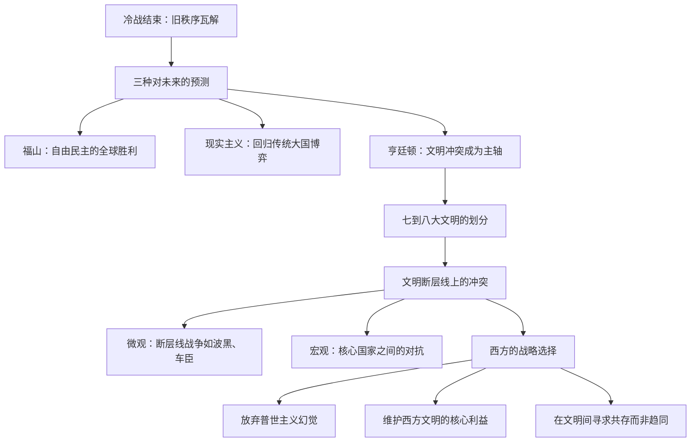

# 《文明的冲突》深度读书笔记

> [!abstract] 全书速览
> 1993年冷战刚刚落幕，弗朗西斯·福山宣告"历史的终结"——自由民主制度将成为人类政治的最终形态。塞缪尔·亨廷顿不同意。他在这本书中提出了一个冷硬的替代预言：==后冷战世界的根本冲突不再是意识形态之争或经济利益之争，而是文明之间的冲突==。他将全球划分为七到八大文明——西方、中华、日本、印度、伊斯兰、东正教、拉美和可能的非洲文明——认为未来的战争和对抗将主要沿着这些文明的"断层线"展开。这个论断在提出时备受争议，但此后三十年间从巴尔干到中东到亚太的一系列事态发展，不断迫使人们重新审视他的框架。亨廷顿最终的警告是：**西方文明不是"普世文明"，而是一种独特的文明**，试图将自身价值观强加于整个世界不仅不会成功，反而会激发其他文明的激烈抵抗。

## 历史坐标

《文明的冲突与世界秩序的重建》（*The Clash of Civilizations and the Remaking of World Order*）由哈佛大学政治学教授塞缪尔·亨廷顿于1996年出版，脱胎于他1993年在《外交事务》杂志上发表的同名论文。那篇论文甫一刊出就引发了冷战结束以来国际关系学界最激烈的一场论战——据《外交事务》编辑部统计，它引发的回应文章数量在该刊物近百年历史中名列前茅。

> [!note] 知识谱系
> 亨廷顿的论述与几个重要的知识传统形成直接对话。他明确反对[[《历史的终结与最后的人》]]（弗朗西斯·福山）中的乐观主义——福山认为冷战终结标志着自由民主的最终胜利，亨廷顿认为这是危险的幻觉。他的文明分类深受阿诺尔德·汤因比《历史研究》的影响，但在分析框架上更接近国际关系中的现实主义传统。他与[[《全球通史》]]（斯塔夫里阿诺斯）共享一个基本判断——世界不能用单一文明的尺度来衡量——但得出了更加悲观的结论。

亨廷顿的学术身份值得注意。他不是一个象牙塔里的纯理论家，而是长期参与美国外交政策制定的学者——曾在卡特政府国家安全委员会任职，与布热津斯基关系密切。这种"学者-政策顾问"的双重身份使得这本书从一开始就不只是学术讨论，而是对美国外交战略的直接干预。他写作的核心动机是警告美国的政策精英：不要以为冷战结束就意味着全球趋同，文化和文明的力量正在重新塑造世界秩序，而西方如果不调整自己的战略姿态，将付出沉重代价。

## 全书叙事线

亨廷顿的论证从一个历史断裂点开始：1989年柏林墙倒塌、1991年苏联解体。冷战期间，世界被简化为两个超级大国主导的意识形态阵营。这个框架在苏联解体后失效了，但惯性思维使得西方精英们急于用新的简单模型来替代它——"历史终结论"就是最受欢迎的替代品。

亨廷顿首先论证为什么意识形态和经济利益不再是国际政治的主要驱动力。他的观点是：冷战是西方文明内部意识形态斗争的最后一章——资本主义和共产主义都是西方思想的产物。这场内战结束后，非西方文明开始重新确认自身的文化身份，而不是向西方模式趋同。然后他转向文明冲突的具体表现：巴尔干的种族清洗、中东的宗教极端主义、亚洲价值观的崛起。最终，他提出了一套政策建议：西方应该收缩战线，停止试图改造其他文明，转而巩固自身的文明核心——因为"普世主义"的推行恰恰是激发文明冲突的最大催化剂。

## 关键转折深度解读

### 第一个转折：文明取代意识形态成为身份认同的核心

冷战期间，一个人在国际政治中的身份首先由他的意识形态阵营决定——你是"自由世界"的人还是"社会主义阵营"的人。苏联解体后，这套分类系统失效了。一个土耳其人、一个印度尼西亚人、一个波斯尼亚穆斯林——他们不再需要被纳入"资本主义vs共产主义"的框架来理解。那么，他们是谁？

> [!tip] 核心洞察
> 亨廷顿观察到，冷战后的世界出现了一种全球性的"身份回归"运动：人们开始用文化和宗教而非意识形态来定义自己。伊斯兰复兴运动在从北非到东南亚的广阔弧线上蓬勃发展。亚洲国家——特别是新加坡的李光耀和马来西亚的马哈蒂尔——公开挑战"西方价值观等于普世价值观"的假设，提出"亚洲价值观"作为替代。东正教的俄罗斯开始重新从拜占庭传统中寻找自身定位。==当意识形态的外衣被脱去，文明的底色重新显露出来。==

这个论断最有力的证据之一来自前南斯拉夫的解体。铁托时代的南斯拉夫在共产主义意识形态的粘合下维持了统一。意识形态失效后，天主教的克罗地亚人、东正教的塞尔维亚人和穆斯林的波斯尼亚人之间的文明断层线立刻浮现——而且这些断层线几乎完美地重现了数百年前奥斯曼帝国与哈布斯堡帝国的边界。

> [!warning] 反事实推演
> 如果冷战不是以苏联的突然解体而是以缓慢的制度融合告终，亨廷顿的预测还会成立吗？这是一个值得思考的问题。他可能会辩称，文明认同始终潜伏在意识形态外壳之下——冷战结束只是移除了遮蔽物。但另一种可能是：苏联的突然崩溃制造了一个身份真空，文明认同并非"自然回归"，而是在特定政治条件下被精英们重新建构起来的。

### 第二个转折：伊斯兰文明的"血腥边界"

亨廷顿提出了全书最具争议性的论断之一：==伊斯兰文明的边界是"血腥的"==。他统计了冷战后的武装冲突，发现穆斯林国家和社群卷入冲突的频率明显高于其他文明——从波斯尼亚到车臣，从克什米尔到菲律宾南部，从巴勒斯坦到苏丹，从阿尔及利亚到印度尼西亚的亚齐。

> [!tip] 核心洞察
> 亨廷顿试图解释这一现象的原因：伊斯兰世界在地理上与更多的文明相毗邻（西方、东正教、印度、中华、非洲），因此接触面——也就是潜在的摩擦面——更大。伊斯兰世界缺乏一个类似于西方之于法德关系、中国之于东亚的"核心国家"来维持区域秩序。人口膨胀——特别是大量年轻男性的过剩——制造了社会不稳定。以及，伊斯兰教和基督教作为两大普世主义宗教，在历史上就有长达一千多年的竞争关系。

这个论断引发了巨大的反弹。批评者指出亨廷顿将"伊斯兰"作为一个整体来讨论，忽略了逊尼派与什叶派之间、阿拉伯世界与非阿拉伯穆斯林世界之间、世俗化程度截然不同的土耳其与沙特之间的巨大差异。爱德华·萨义德直接将亨廷顿的论述称为"无知的冲突"——认为它本质上是在为西方对伊斯兰世界的偏见提供学术包装。

> [!warning] 争议如实呈现
> 亨廷顿的统计方法也受到质疑。穆斯林国家卷入冲突的高频率，可能反映的不是"文明性质"，而是这些国家恰好位于冷战期间超级大国代理人战争最集中的地带（中东、阿富汗、非洲之角），以及殖民时代遗留的人为边界和民族分裂。换言之，是历史和地缘因素，而非文明本质，在驱动冲突。

### 第三个转折："西方vs其余"与中华文明的崛起

亨廷顿预见到的第二条主要冲突轴线是西方文明与中华文明之间的结构性对抗。他在1990年代中期就预判，随着中国经济和军事实力的增长，中国将越来越不愿意接受美国主导的国际秩序——不是因为中国"邪恶"，而是因为任何崛起的文明都会寻求与自身实力相匹配的国际地位和话语权。

> [!tip] 核心洞察
> 亨廷顿特别指出了一种可能的"儒伊联盟"——中华文明与伊斯兰文明在反对西方霸权这一点上形成临时的利益合流。他举的具体例子包括中国向伊朗和巴基斯坦转让军事技术。这个判断在当时看起来颇为夸张，但此后二十多年中国与伊朗、巴基斯坦关系的发展轨迹，确实在一定程度上呼应了这一分析框架。

亨廷顿对中华文明的分析有一个敏锐的观察：中国的崛起与19世纪德国崛起的不同之处在于，德国是在西方文明内部崛起——挑战的是权力分配而非价值体系。中国的崛起则携带着一整套不同于西方的文明传统——对国家权威的理解、对个人与集体关系的定义、对国际秩序的想象——这使得中美之间的结构性摩擦比美苏冷战更难用简单的意识形态对立来框定，也更难通过意识形态的一方胜出来"解决"。

### 第四个转折：现代化不等于西方化

> [!tip] 核心洞察
> ==亨廷顿全书最重要的知识贡献之一，是系统性地拆解了"现代化=西方化"这个根深蒂固的等式。== 他指出，非西方社会完全可以在经济和技术上实现现代化，同时在文化和价值观上拒绝西方模式。日本是第一个证明这一点的国家——它在明治维新后全面引进西方技术和制度，但始终保持了独特的文明身份。新加坡、马来西亚和后来的中国进一步强化了这一模式。

这个论断的深层含义是对西方启蒙运动以来的一个核心信念的挑战：进步是线性的，所有社会在发展的道路上最终会趋同于西方模式。亨廷顿说，这是西方人的自恋式投射。现代化是所有文明都在经历的过程，但现代化的终点不是所有文明变成西方的翻版——而是各文明用自身的文化资源来消化和改造现代性。

一个反事实问题值得思考：如果互联网和全球化确实在推动价值观趋同，亨廷顿就错了。但如果同一批技术被不同文明用来强化自身的文化认同——社交媒体助力了阿拉伯之春，也助力了伊斯兰国的招募；互联网让中国的防火长城成为可能，也让日本的流行文化传遍全球——那么技术的全球化恰恰在加速文化的多元化，而非趋同化。亨廷顿写作时还无法预见社交媒体的爆发，但这一发展似乎更支持他的判断而非福山的乐观。

### 第五个转折："断层线战争"的机制

亨廷顿区分了两种文明冲突。"核心国家冲突"发生在各文明最强大的国家之间——比如美国与中国、俄罗斯与西方之间的战略博弈。"断层线战争"则发生在不同文明混居的接触地带——波斯尼亚、高加索、克什米尔、巴勒斯坦。

> [!tip] 核心洞察
> 断层线战争有一种独特的升级机制：本地冲突会吸引各文明的"亲族国家"介入。波斯尼亚战争中，东正教的塞尔维亚得到了俄罗斯的同情和支持，穆斯林的波斯尼亚得到了伊斯兰国家的援助，天主教的克罗地亚得到了德国和梵蒂冈的偏袒。==一个看似局部的民族冲突，通过文明亲缘关系的传导，有可能升级为文明集团之间的大规模对抗。==

这个分析框架在此后的中东局势中反复得到呼应。叙利亚内战从2011年开始就呈现出典型的断层线战争特征：逊尼派叛军得到沙特和土耳其的支持，阿拉维派（什叶派分支）政府得到伊朗和俄罗斯的支持，库尔德人得到美国的有限支持。冲突的本地根源是政治压迫和经济不满，但其升级和持续在很大程度上是因为各方背后的文明亲族的介入。

## 历史的模式

亨廷顿的分析框架揭示了几个在长时段历史中反复出现的模式。

**权力转移期的文明自觉。** 当一个文明的相对实力上升时，它会开始重新确认和强调自身的文化独特性——这不是偶然的民族主义情绪，而是与实力变化同步的结构性现象。19世纪末的日本在明治维新的西化浪潮中很快出现了"日本特殊论"的反弹。20世纪末亚洲经济起飞后出现的"亚洲价值观"论述遵循了同样的模式。中国近年来"文化自信"话语的兴起，也符合这一规律。==经济增长不会消解文明身份，反而会强化它。==

**"核心国家"效应。** 一个文明是否拥有一个被广泛认可的核心国家，深刻影响着该文明区域的稳定性。西方有美国（以及区域内的法德轴心），中华文明有中国，东正教文明有俄罗斯，印度文明有印度。这些文明区域虽然存在紧张，但核心国家的存在提供了一种秩序维持机制。相比之下，伊斯兰文明和非洲文明缺乏公认的核心国家，区域内的冲突因此更难调解。

**普世主义的悖论。** 历史上每一个处于权力顶峰的文明——从罗马帝国到阿拔斯王朝到大英帝国——都倾向于将自身的特殊价值包装为"普世价值"并向外推广。但这种推广几乎总是激发其他文明的抵抗，最终反而加速了推广者自身权力的衰落。亨廷顿认为当代西方正在重演这一模式：将人权、民主、自由市场视为"放之四海而皆准"的标准，并通过经济制裁和军事干预来推行，结果是催生了越来越强大的反西方联盟。

## 作者的史学方法

亨廷顿的方法论是典型的政治学宏观比较分析——他在文明级别上寻找模式，用大量的历史案例和统计数据来支撑论证。他的文明分类框架主要依据宗教传统（这也是为什么"日本文明"被单列出来——它虽然与中华文明共享儒家元素，但在宗教和社会组织上有独特性）。

> [!warning] 局限
> - 亨廷顿对"文明"的定义偏向于静态和本质主义——他倾向于将文明视为拥有固定内核的实体，而忽略了文明内部的流动性和多元性。一个土耳其的世俗知识分子和一个阿富汗山区的塔利班战士被归入同一个"伊斯兰文明"，这种归类的解释力是有限的
> - 国家内部的冲突——阶级、性别、代际——被系统性地忽略了。美国国内红州与蓝州的文化战争，可能比美国与中华文明之间的冲突更能解释当代美国政治
> - 经济利益作为独立变量被低估了。许多被他解读为"文明冲突"的案例——比如中美贸易摩擦——至少同样可以用经济竞争来解释

亨廷顿的核心史料是冷战后十余年的国际政治事件，辅以历史上文明互动的长时段案例。他的统计分析（比如穆斯林国家卷入冲突的频率）方法上相对粗糙，后来的定量政治学研究对此提出了修正。但他的定性判断——文明认同在冷战后国际政治中的重要性上升——获得了相当广泛的学术认可，即使许多学者在具体论述上与他分歧很大。

## 以史鉴今

> [!tip] 现实应用
> - **看待国际新闻的镜头**：当你看到中美在南海或台湾问题上的对峙、俄乌战争中东正教文明与西方文明的裂痕、中东冲突中逊尼派与什叶派的对立，亨廷顿的框架提供了一个有用的（虽然不完整的）分析起点——这些冲突的动力源不仅仅是领土或资源，还包括深层的文明认同
> - **警惕"历史终结"式的乐观主义**：每一代人都倾向于认为自己生活在一个"新时代"，历史的旧规律不再适用。亨廷顿提醒你，文化和宗教的力量比意识形态更加持久，它们不会因为全球化或技术进步而消失
> - **理解"现代化不等于西方化"**：这个洞察对理解当代世界至关重要。中国、印度、土耳其等国的现代化进程正在证明，经济发展可以走出与西方截然不同的文化路径
> - **对自身文明偏见的反思**：亨廷顿最终的信息不是"文明冲突不可避免"，而是"如果你不理解其他文明的逻辑，冲突就不可避免"。真正的危险不在于文明之间的差异，而在于对差异的无知和傲慢

## 延伸阅读

- [[《历史的终结与最后的人》]] - 弗朗西斯·福山：亨廷顿最直接的论战对手，提供了截然相反的后冷战世界预测
- [[《东方主义》]] - 爱德华·萨义德：对西方建构"东方"话语的深刻剖析，从根本上挑战了亨廷顿式的文明分类
- [[《全球通史》]] - 斯塔夫里阿诺斯：用全球视角看文明互动的经典之作，比亨廷顿更均衡也更乐观
- [[《大国政治的悲剧》]] - 约翰·米尔斯海默：进攻性现实主义对大国冲突的分析，与亨廷顿的"文明范式"形成互补
- [[《枪炮、病菌与钢铁》]] - 贾雷德·戴蒙德：从地理和生物因素解释文明差异的形成，为亨廷顿的文明分类提供了更深层的背景