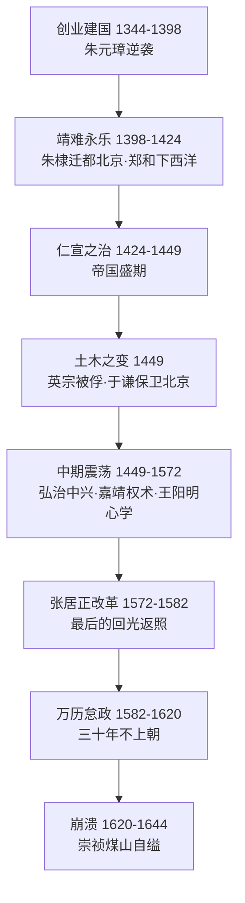

# 《明朝那些事儿》深度读书笔记

> [!abstract] 全书速览
> 这是一部用白话文讲述明朝三百年历史的作品，从1344年朱元璋出生写到1644年崇祯煤山自缢。当年明月的笔下没有纯粹的英雄或恶棍，只有在权力、理想与命运的夹缝中挣扎的真实的人。这不仅是帝王将相的编年史，更是一部关于==人性幽深与历史复杂==的长篇叙事。

## 历史坐标

明朝（1368-1644）是中国最后一个由汉人建立的大一统王朝。这三百年恰好覆盖了欧洲从中世纪走向大航海时代的关键时段——当郑和的舰队在印度洋驰骋时，哥伦布还没有出生；当明朝灭亡时，英国的清教徒革命刚刚爆发。

当年明月（石悦）于2006年在天涯论坛连载，成书七卷，销量超千万册。在他之前，中国的大众历史写作要么是枯燥的教科书体，要么是戏说历史的野狐禅。他开创了一种新可能——用严肃的史料基础加生动的现代白话，让普通读者走进历史的纵深。

> [!note] 时代张力
> 明朝的迷人之处在于：火器普及、商品经济繁荣、市民阶层崛起、思想百家争鸣——一个正在深刻变化的社会，遇上一个越来越僵化的帝国体制。这种张力是全书最大的叙事动力。

当年明月的史学立场是"以人为本"，对历史人物保持温和而锐利的同理心：理解朱元璋的残忍背后是童年的饥饿，看到严嵩的狡诈背后是权力游戏中的求生本能。"成功只有一个——按照自己的方式，去度过人生。"

> [!note] 知识谱系
> 与[[《万历十五年》]]（黄仁宇）形成互补——前者像显微镜聚焦制度困境，后者像广角镜展现全景叙事。与[[《中国历代政治得失》]]（钱穆）对读，可获得制度层面的解释框架。

## 全书叙事线

核心问题：一个帝国如何从无到有、从盛到衰、从衰到亡？

元末乱世中朱元璋在十七天内失去父母和大哥，被迫出家当和尚又当了三年乞丐。1352年加入红巾军，亲自发掘徐达、常遇春、刘基等人，击败陈友谅、张士诚后北伐建明朝。朱元璋建立高度集权体制，废丞相、设锦衣卫，胡惟庸案牵连三万余人，蓝玉案一万五千人。朱棣以八百人起兵靖难夺位，派郑和七下西洋（宝船长约一百二十米，哥伦布旗舰只有二十五米）。土木堡之变后于谦力挽狂澜。嘉靖帝不上朝却通过密疏遥控朝政，严嵩是替他背黑锅的工具。张居正十年改革是回光返照，死后被清算。万历"国本之争"中被文官施压十几年，三十年不上朝报复系统。崇祯十七岁扳倒魏忠贤，却陷入加税逼反的恶性循环，最终煤山自缢。

## 关键转折深度解读

### 第一个转折：鄱阳湖之战（1363）

朱元璋二十万对陈友谅六十万。陈友谅控制长江中游富庶地区，拥有巨型楼船舰队，船体包铁，远看像移动的城堡。

> [!tip] 核心洞察
> 朱元璋利用小船灵活性以火攻焚毁笨重舰队——选择鄱阳湖而非长江主航道让大船优势大打折扣。陈友谅在巡视时被流矢射杀，==六十万人的命运被一支流箭改写==。朱元璋旗舰搁浅时亲临前线死战——领导力在生死关头是你愿不愿意站在最危险的地方。

战役持续三十六天。此后消灭张士诚，徐达、常遇春北伐不到一年攻入大都。个人判断力和意志力在关键时刻决定数百年走向——但胜利中巨大的偶然成分同样不可忽视。

### 第二个转折：废丞相（1380）

> [!warning] 制度的连锁反应
> 宰相制度从秦始皇开始存在一千六百年。朱元璋借胡惟庸案（牵连三万余人，"谋反"可能只是借口）废除这个千年制度平衡。他一天批阅两百多份奏章、处理四百多件政事——后来的皇帝不可能维持。权力真空被内阁"票拟"和太监"批红"**畸形填补**。明朝几乎所有重大政治危机——王振导致土木堡之变、刘瑾专横、魏忠贤祸国——都追溯到废丞相后的权力结构畸形。==每个为解决当前问题而设计的制度，都可能在未来制造新问题。==

### 第三个转折：土木堡之变（1449）

太监王振怂恿英宗亲征，为炫耀让大军路过家乡蔚州，又担心踩坏庄稼临时改道。二十万精锐覆没，皇帝被俘。军户制度下士兵待遇极差大量逃亡，将领吃空饷，实际战斗力远低于纸面。

> [!example] 于谦的悲剧
> 他力排南迁之议——"建议南迁者，当斩！"拥立代宗让也先手中的人质失去价值，亲自督战德胜门外击退瓦剌。他下令关闭所有城门，断绝了自己的退路。英宗复位后他被处死——"不杀于谦，复位无名。"抄家时家中只有一间锁着的房间：代宗赐的蟒袍和宝剑，完好未用。==一个人的勇气改变了一个帝国的命运——但帝国没有善待这个人。==

### 第四个转折：王阳明龙场悟道（1508）

少年王阳明对着竹子"格"了七天七夜想格出天理，把自己格病了。后被贬到贵州龙场蛮荒之地，仆人全病倒，他住山洞为自己准备石棺。绝境中悟出=="知行合一"==——知道却不去做，就是不真的知道。

> [!tip] 思想的深度
> 心学打破了朱熹理学（官方意识形态和科举标准答案）对道德权威的垄断，给普通人自信：你内心的良知就是最可靠的指南。王阳明三十五天平定宁王之乱——用智谋击败准备十年的叛王，证明知行合一不是空谈。心学传到日本影响明治维新，东乡平八郎的印章刻着"一生伏首拜阳明"。

孔子颠沛流离写《春秋》，司马迁受宫刑成《史记》——最深刻的突破往往在困境中被逼出来。

### 第五个转折：张居正改革（1572-1582）

> [!warning] 强人改革的脆弱性
> 张居正面对的帝国：土地被权贵兼并但享有免税特权，国库日益空虚，北有蒙古、东南有倭寇、西南有土司叛乱。他推行考成法逼官员做事，一条鞭法简化税制推动白银货币化，清丈全国土地查出被隐匿的数百万顷，起用戚继光、李成梁稳定边防。但他靠**个人权威**推动变革——压制言论、对万历严加管教（万历说最多的词是"恐惧"）。他一死，万历清算一切，长子被迫自杀，家属十几人在抄家中饿死。==如果改革成果不能从个人意志转化为制度保障，它迟早随改革者离去而消散。==

### 第六个转折：崇祯之死（1644）

崇祯十七岁用三个月扳倒魏忠贤。但帝国陷入恶性循环：需要军费→加税→逼反更多人→需要更多军费。十七年换五十个首辅（平均任期四个月）。杀了袁崇焕——皇太极的反间计。

| 崇祯的困境 | 具体表现 |
|-----------|---------|
| 财政崩溃 | 国库空虚，军饷拖欠数月甚至数年 |
| 天灾 | 北方连年大旱，陕西人相食 |
| 信任危机 | 十七年换五十个首辅，大臣不敢建言 |
| 恶性循环 | 加税→逼反→需更多军费→再加税 |

李自成攻入北京前夜，崇祯敲景阳钟召百官无人应。煤山自缢，遗言"朕非亡国之君，臣皆亡国之臣"。死时三十三岁。

## 历史的模式

**皇权-文官-宦官三角博弈。** 贯穿三百年的核心权力动力学。皇帝强势时都被压制，皇帝怠政时文官和宦官激烈争斗，文官独大时皇帝和宦官联手反弹。这个三角关系的不稳定性让每朝政治生态取决于三方力量的偶然配比。

**理想主义者的宿命。** 于谦被冤杀，王阳明一生不得认可，海瑞被官场孤立（同事怕接触他暴露灰色收入），袁崇焕被凌迟。你的清廉让别人显得腐败，你的正直让别人显得卑劣——坚持原则意味着得罪太多人。

**改革的困境。** 改革需要集中权力来推动，但集中的权力本身就是改革要解决的问题。张居正压制言论来推动开放的税制改革——这种内在矛盾使改革天然不可持续。

**帝国的老化。** 科举从选才变成禁锢思想，藩王制度从镇边变成财政黑洞（明末宗室几十万人全靠国库），卫所军制从精锐变成纸上谈兵。

## 作者的史学方法

用小说式叙事手法呈现正史记载，史料基础是《明史》《明实录》，核心史实严谨但细节有文学加工。他让无数从不看历史书的读者对历史产生兴趣——这个影响的广度不亚于任何一部学术著作。

> [!warning] 局限
> - 文学性强但分析性不足，对制度、经济、社会结构分析薄弱
> - 明朝中后期大量美洲白银通过马尼拉流入中国深刻改变了货币体系和商业格局，当年明月几乎未涉及
> - 以政治史和人物史为主，经济史和社会史是短板
> - "以人为本"有时过度强调个人因素而低估结构性因素和自然因素（小冰河期旱灾）

## 以史鉴今

> [!tip] 现实启发
> - **理解权力真实运作**：不是善恶之争，而是利益和规则的博弈——追问"这个人为什么能在这个位置上待这么久？谁需要他？"
> - **警惕制度老化**：当组织规则越来越多、效率越来越低、谁也不敢改变时，它可能正在经历"明朝式老化"
> - **改革需要制度化**：强人推动的变革如果不能转化为制度保障，注定短暂
> - **多疑是领导者最致命的弱点**：不信任任何人→最终没人为你效力
> - **在不完美中保持理想**：即使在最黑暗的环境中，也有人选择做正确的事

## 延伸阅读

- [[《万历十五年》]] - 黄仁宇：从一个年份深度分析明朝制度困境，如果你觉得当年明月缺少制度分析，黄仁宇会补上这一课
- [[《中国历代政治得失》]] - 钱穆：从制度角度为理解书中权力斗争提供解释框架
- [[《大明王朝的七张面孔》]] - 张宏杰：以七个人物为切入点，更注重人物心理分析
