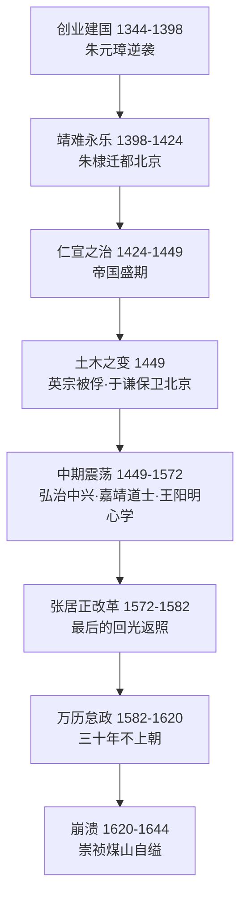

# 《明朝那些事儿》深度读书笔记

> [!abstract] 全书速览
> 这是一部用白话文讲述明朝三百年历史的作品，从1344年朱元璋出生写到1644年崇祯煤山自缢。当年明月的笔下没有纯粹的英雄或恶棍，只有在权力、理想与命运的夹缝中挣扎的真实的人。这不仅是帝王将相的编年史，更是一部关于==人性幽深与历史复杂==的长篇叙事。

## 历史坐标

明朝（1368-1644）是中国最后一个由汉人建立的大一统王朝。当年明月（石悦）于2006年在天涯论坛连载，成书七卷，销量超千万册。

> [!note] 时代张力
> 明朝的迷人之处在于：火器普及、商品经济繁荣、市民阶层崛起、思想百家争鸣——一个正在深刻变化的社会，遇上一个越来越僵化的帝国体制。这种张力是全书最大的叙事动力。

当年明月的史学立场是"以人为本"，对历史人物保持温和而锐利的同理心：理解朱元璋的残忍背后是童年的饥饿，看到严嵩的狡诈背后是权力游戏中的求生本能。

## 全书叙事线

核心问题：一个帝国如何从无到有、从盛到衰、从衰到亡？

## 关键转折深度解读

### 第一个转折：鄱阳湖之战（1363）

朱元璋二十万对陈友谅六十万，以小船火攻焚毁巨型舰队，陈友谅被流矢射杀。

> [!tip] 核心洞察
> 在群雄逐鹿的关键时刻，个人的判断力和意志力往往决定数百年的走向——但也别忘了朱元璋胜利中巨大的偶然成分。

### 第二个转折：废丞相（1380）

> [!warning] 制度的连锁反应
> 朱元璋废除千年宰相制，解决了权臣威胁。但后来的皇帝不可能都像他一样精力充沛——权力真空被内阁和太监**畸形填补**。每个为解决当前问题而设计的制度，都可能在未来制造新问题。

### 第三个转折：土木堡之变（1449）

英宗被俘，二十万精锐覆没。于谦力排南迁之议保卫北京——但英宗复位后他被处死。

> [!example] 于谦的悲剧
> 一个人的勇气改变了一个帝国的命运——但这个帝国却没有善待这个人。在帝制政治中，忠诚和能力不是保命的护身符。

### 第四个转折：王阳明龙场悟道（1508）

被贬谪到贵州的王阳明悟出=="知行合一"==——知道却不去做，就是不真的知道。心学打破了知识精英对道德权威的垄断，给普通人一种自信：你内心的良知就是最可靠的指南。

### 第五个转折：张居正改革（1572-1582）

> [!warning] 强人改革的脆弱性
> 张居正十年改革让帝国焕发生机，但他靠**个人权威**而非制度保障推动变革。他一死，万历帝清算一切，改革成果迅速消散。==纯靠强人的改革注定短暂。==

### 第六个转折：崇祯之死（1644）

崇祯不是昏君——他勤政、节俭、有抱负。但多疑急躁，十七年换五十个首辅，杀了袁崇焕。帝国积重难返，财政枯竭、军队腐败、党争不息、天灾频仍。

## 历史的模式

**皇权-文官-宦官三角博弈。** 贯穿三百年的核心权力动力学。皇帝强势时都被压制，皇帝怠政时文官和宦官激烈争斗，文官独大时皇帝和宦官联手反弹。

**理想主义者的宿命。** 于谦、王阳明、海瑞、袁崇焕——最令人敬佩的人物往往最悲剧。在以权力斗争为核心逻辑的体制中，坚持原则意味着得罪太多人。

**改革的困境。** 改革需要集中权力来推动，但集中的权力本身就是改革要解决的问题之一。

**帝国的老化。** 制度日益僵化，利益集团日益固化，改革空间日益缩小——到崇祯时代，帝国就像运转了三百年的老机器。

## 作者的史学方法

用小说式叙事手法呈现正史记载，史料基础是《明史》《明实录》，核心史实严谨但细节有文学加工。

> [!warning] 局限
> - 文学性强但分析性不足，对制度、经济、社会结构分析薄弱
> - 以政治史和人物史为主，经济史和社会史是短板
> - "以人为本"有时过度强调个人因素而低估结构性因素

## 以史鉴今

> [!tip] 现实启发
> - **理解权力真实运作**：不是善恶之争，而是利益和规则的博弈
> - **警惕制度老化**：再好的制度都有保质期
> - **改革需要制度化**：强人推动的变革如果不能制度化，注定短暂
> - **在不完美中保持理想**：即使在最黑暗的环境中，也有人选择做正确的事

## 延伸阅读

- [[《万历十五年》]] - 黄仁宇：从一个年份深度分析明朝制度困境，与本书形成互补
- [[《中国历代政治得失》]] - 钱穆：从制度角度为理解书中权力斗争提供解释框架
- [[《大明王朝的七张面孔》]] - 张宏杰：以七个人物为切入点，更注重人物心理分析
