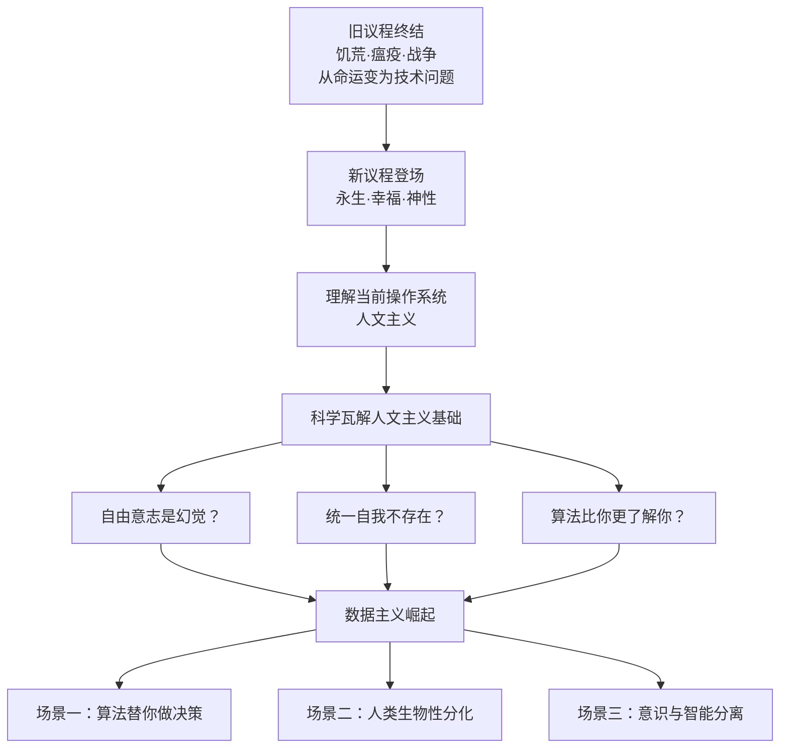

# 《未来简史》深度读书笔记

> [!abstract] 全书速览
> 如果说[[《人类简史》]]回答的是"我们怎么走到今天"，那么《未来简史》追问的是一个更令人不安的问题：接下来会发生什么？赫拉利的核心论证链条是——人类已经基本征服了饥荒、瘟疫和战争这三大历史宿敌，21世纪的新议程将是追求==永生、幸福和神性==。但通往这些目标的道路上，支撑现代文明运行的人文主义叙事正在被科学自身瓦解：自由意志可能只是幻觉，统一的自我可能并不存在，算法可能比你更了解你自己。一种以数据流为终极价值的新世界观——==数据主义==——正在悄然崛起。这本书的价值不在于其预测的准确性，而在于它提出了一个你必须正视的问题：当我们获得了重塑自身物种的力量，我们到底想变成什么？

## 历史坐标

《未来简史：从智人到神人》（Homo Deus: A Brief History of Tomorrow）由尤瓦尔·赫拉利于2015年以希伯来文出版，2016年英文版面世后再次引爆全球阅读热潮。如果说2011年的[[《人类简史》]]让赫拉利成为全球最炙手可热的公共知识分子之一，《未来简史》则将他的影响力推至顶峰——这本书直接影响了硅谷科技圈对人工智能伦理的讨论方式，甚至被多国政府官员列为政策思考的参考读物。

你需要理解这本书的写作动机。赫拉利在[[《人类简史》]]末尾抛出了一个悬而未决的问题：科学革命给了人类前所未有的力量，但我们真的知道自己想要什么吗？《未来简史》就是对这个问题的全面展开。它不是一本预测未来的书——赫拉利自己反复强调这一点——而是一本通过审视历史趋势来勾勒"可能性"的书。它的目标不是告诉你未来一定会怎样，而是让你意识到哪些可能性正在酝酿，以便你能参与塑造未来而不是被动接受。

> [!note] 知识谱系
> 这本书与多条思想线索交汇。它延续了[[《人类简史》]]的"虚构故事"理论框架，同时大量吸收了雷·库兹韦尔关于技术加速的"奇点"理论、丹尼尔·丹尼特关于意识能否被算法取代的哲学思辨、以及尼克·波斯特洛姆对超级智能风险的分析。赫拉利的独特贡献在于将这些散落在不同领域的讨论整合成了一个连贯的历史-哲学叙事，并且锚定在一个关键判断上：==人文主义作为现代社会的操作系统，正在面临来自生物科学和信息科学的双重挑战==。

在思想谱系的更远处，赫拉利的问题意识承接了尼采"上帝已死"之后人类面临的价值真空、海德格尔对技术本质的追问、以及汉娜·阿伦特对人类处境的反思。赫拉利用历史学家的长时段视角，把这些看似分散的问题串联成了一条连贯的叙事线。

这本书出版于人工智能热潮重新爆发的前夜——AlphaGo在2016年击败李世石，深度学习开始进入公众视野，CRISPR基因编辑技术实现突破。赫拉利的讨论在那个时间点显得既超前又切中要害。而在此后几年里，ChatGPT等大语言模型的出现让他书中的许多讨论变得更加紧迫和真实。

## 全书叙事线

> [!note] 结构概览
> 全书沿着一条三段式逻辑推进：旧议程的终结（人类征服了三大宿敌）→ 当前操作系统的解剖（人文主义如何支撑现代文明）→ 操作系统的漏洞与新系统的崛起（科学瓦解人文主义基础，数据主义兴起）



第一步，赫拉利带你回顾人类的历史成就。在几千年的历史中，饥荒、瘟疫和战争是困扰人类的三大难题。虽然它们今天仍然存在，但已经从不可控的自然力量变成了可管理的挑战。一个反直觉的数据让你看清这个变化的程度：全球死于营养过剩的人已经多于死于营养不足的人，死于自杀的人多于死于战争、犯罪和恐怖主义的总和。当旧议程基本完成后，新议程是什么？赫拉利的回答是：追求永生、幸福和神性——也就是把人类升级为"神人"（Homo Deus）。

第二步，赫拉利深入分析了让现代社会运转的底层操作系统：人文主义。人文主义的核心信条是，人类体验是宇宙中最重要的东西，人的感受、欲望和选择是一切价值和意义的终极来源。你去投票、去消费、去恋爱，所有这些行为背后的逻辑都建立在一个假设上——你内心的感受是真实的、重要的，而且你是了解自己内心感受的最佳权威。赫拉利将人文主义拆解为三个分支：自由人文主义（强调个人自由和选择权）、社会人文主义（强调集体福祉）和进化人文主义（强调适者生存的优胜逻辑）。二十世纪的意识形态大战——自由主义vs共产主义vs法西斯主义——本质上是人文主义三个分支之间的内战。冷战结束后，自由人文主义取得了压倒性胜利。

第三步，赫拉利抛出全书最核心的论证：生物科学和信息科学的进展正在动摇自由人文主义的两大根基。第一根支柱是"自由意志"——生物学研究越来越表明，你的选择、情感和欲望都是生化算法的产物。第二根支柱是"个体性"——如果外部算法比你更了解你自己，那么"倾听你的内心"就不再是最好的建议。当这两根支柱被抽掉时，一种全新的世界观——数据主义——可能取而代之。

全书最后，赫拉利没有给出确定的结论。他留下了三个问题让你持续思考：生物体真的只是算法吗？智能和意识，哪个更有价值？当无意识但高度智能的算法比我们更了解我们自己时，社会、政治和日常生活将会怎样？

## 关键转折深度解读

### 第一个转折：旧议程的终结——人类征服了饥荒、瘟疫和战争

赫拉利在全书开篇提出了一个大胆的判断：困扰人类数千年的三大杀手正在失去其威胁性。这不是说它们已经消失，而是说它们的性质发生了根本变化——从不可抗拒的天灾变成了可以管理的挑战。

先看饥荒。在过去几千年里，饥荒是人类最恐惧的杀手。法国在1692到1694年之间因饥荒死亡约280万人，占当时总人口的15%。但到了今天，全球死于营养过剩（肥胖及其引发的疾病）的人数已经超过了死于营养不足的人数。2010年的数据显示，饥荒和营养不良导致约100万人死亡，而肥胖导致约300万人死亡。==糖比火药杀死了更多的人==——这个事实在历史上前所未有。当然，饥荒仍然存在于某些地区，但几乎所有现代饥荒都是政治原因造成的，而不是技术上无法解决的。

再看瘟疫。中世纪的黑死病在十四世纪杀死了欧洲大约三分之一到二分之一的人口。1918年的西班牙大流感在不到一年内夺走了5000万到1亿人的生命。但到了二十一世纪初，疫苗、抗生素和公共卫生体系构成了强大的防线。2014年的埃博拉疫情最终的死亡人数约为11000人——在人类历史的瘟疫谱系中只是一个小数字。当然，2020年的新冠疫情在赫拉利写完此书之后爆发，某种程度上既验证了他的判断——人类以创纪录速度开发出了疫苗——也暴露了全球协调能力的不足。

战争的情况同样引人注目。2012年，全球约56万人死于暴力，其中约12万人死于战争，约50万人死于犯罪，而约80万人死于自杀。自杀的人数超过了战争和犯罪的总和。在古代农业社会，暴力致死率约占总死亡率的15%；二十世纪降到了5%；二十一世纪降到了约1%。战争在今天依然存在，但它作为国家间常规政策工具的时代基本结束了——因为知识经济取代了领土经济。你可以占领硅谷的土地，但你抢不走硅谷的创新能力。

> [!tip] 核心洞察
> 赫拉利论证的关键不在于"问题已经完全解决"，而在于一个更深层的判断：当生存威胁从"命运"降级为"可管理的挑战"时，人类的欲望会升级。这就引出了"新议程"：==永生、幸福和神性==。

谷歌旗下的Calico公司明确宣称要"解决死亡问题"；积极心理学开始系统性地研究幸福而不仅仅是治疗不幸福；基因编辑技术CRISPR让改造人类生物特征变得前所未有地容易和廉价。赫拉利的洞见是：这些不是突发奇想，而是人类几千年来既有欲望的技术加速版。吉尔伽美什史诗中追寻永生的故事说明，人类从来就渴望超越死亡——只是以前没有工具。

如果这些预言没有实现呢？赫拉利设置了一个安全网：他不是在预言这些一定会发生，而是在描述趋势和可能性。真正的问题不在于永生是否实现，而在于追求这些目标的过程本身将如何改变人类社会的运行逻辑。

### 第二个转折：人文主义的崛起——从"神说"到"我感觉"

这是全书承上启下的关键章节。在讨论了旧议程的终结之后，赫拉利开始追问：支撑现代文明的底层信仰到底是什么？他的回答是人文主义——一种将人类体验奉为宇宙中最高价值的世界观。

> [!example] 历史对比
> 在中世纪的欧洲，如果你遇到了人生的重大困惑，你不会"倾听自己的内心"。你会去问牧师、去查阅圣经、去祈求上帝的启示。一个中世纪骑士上战场不是因为"我想证明自己"，而是因为"领主命令我去"或"上帝的荣耀要求如此"。==他的个人感受不是行动的理由==。
>
> 但在今天，如果你问朋友"我该不该辞职"，得到的回答几乎一定是"跟着你的感觉走""问问你的内心想要什么"。这种回答背后有一个巨大的哲学假设：你的感受是权威的，你的内心是意义的源泉。这就是人文主义。

这场从"神说"到"我感觉"的转变，深刻重塑了现代社会的每一个制度支柱。在伦理上，道德标准从"上帝怎么说"变成"人怎么感受"——现代人做道德判断时会说"我感觉这样不对"，"感觉"成了最高法庭。在政治上，权威从"天命"变成"民意"——投票的本质就是把每个人的内心偏好汇总起来。在经济上，"顾客永远是对的"意味着消费者的主观感受是价值的终极裁判。在美学上，"美在观看者眼中"取消了任何外部权威在审美问题上的话语权。

赫拉利将人文主义的三个分支之间的竞争描述为二十世纪的核心戏剧：

| 分支 | 核心主张 | 政治表现 | 历史命运 |
|------|---------|----------|----------|
| 自由人文主义 | 每个个体的感受同等重要 | 自由民主、市场经济 | 冷战后成为主导 |
| 社会人文主义 | 个人感受被社会条件扭曲，需集体行动纠正 | 工人运动、福利制度 | 冷战中败于自由主义 |
| 进化人文主义 | 人类内部存在生物性高低之分 | 纳粹主义等种族政治 | 二战中被军事打败 |

赫拉利深刻之处在于指出：人文主义不是"客观真理"，它是一个"虚构的故事"——和中世纪的基督教世界观一样，是一种让大规模合作得以运行的共享信仰。这并不意味着它不好用——恰恰相反，它好用极了。但好用不等于永恒。如果科学发现动摇了人文主义的前提假设，这套操作系统就可能被替换。

> [!warning] 进化人文主义的幽灵
> 赫拉利暗示，进化人文主义的核心逻辑并未真正消亡。当生物增强技术让人类之间的差距可能从社会性的变为==生物性的==，这个幽灵可能以全新的形式回归——不再以种族为旗号，而是以"增强人类"vs"自然人类"的形态出现。

### 第三个转折：自由意志的瓦解——你可能只是一套算法

赫拉利在全书最具挑战性的部分开始拆解自由人文主义的核心假设。他的切入点直接而尖锐：现代生命科学越来越表明，"自由意志"可能根本不存在。你所有的选择、情感和欲望，归根结底都是大脑中生化算法的运算结果——神经元发出电信号，荷尔蒙在血液中流动，基因序列在后台运行。你感受到的"自由选择"，可能只是一种主观体验，而不是对客观事实的反映。

> [!warning] 自由意志的挑战
> 本杰明·利贝特在1980年代的经典实验表明，大脑做出"决定"的时间比你意识到自己做出决定的时间早了约200到500毫秒。后续的fMRI脑成像研究进一步表明，研究人员甚至可以在你意识到自己的选择之前数秒就预测出你的选择。==当你"感觉"自己在做选择时，大脑其实早已做出了决定——你只是在事后给这个决定贴上了"自由意志"的标签。==

赫拉利进一步引用了裂脑实验的发现。当连接左右脑的胼胝体被切断后，患者的左脑和右脑会做出不同的选择。更令人不安的是，当右脑做出某个行为（比如起身走路），负责语言的左脑不知道真正的原因，却会立刻编造一个合理的解释（"我想去拿杯水"）。这暗示你日常生活中对自己行为的"解释"可能大量都是事后编造的。

心理学研究还揭示了"自我"的分裂。丹尼尔·卡尼曼的实验区分了"体验自我"和"叙事自我"——前者是你每时每刻的实际感受，后者是你事后对经历的记忆和解释。两者经常严重不一致：一次漫长而痛苦的医疗检查，如果在结尾增加一段相对不那么痛苦的延长，叙事自我会记住整个过程"不那么糟糕"——即使体验自我在大部分时间里都很痛苦，而且总痛苦量还增加了。那么，当人文主义说"倾听你内心的声音"时，到底应该听哪个自我？

赫拉利用这些发现推导出了一个极其重要的结论：如果你的选择不是真正"自由"的，而是生化算法的产物，那么一个足够了解你生化状态的外部系统就有可能比你自己更了解你。一个能够实时监测你大脑活动、激素水平、基因表达的AI系统，理论上可以比你更早知道你想要什么、你会选择什么、什么会让你快乐或痛苦。

> [!example] 书店里的思想实验
> 想象一下：你站在书店里，纠结于两本书之间。如果一个了解你全部阅读历史、实时监测你情绪反应的AI告诉你"选这本，你读完之后的满意度将高出37%"，你会听它的吗？如果你的决策历史表明AI的推荐准确率达到了95%，而你自己的直觉准确率只有60%，坚持"倾听内心"是否还理性？

赫拉利承认这不是确定的未来。意识和自由意志问题在哲学和神经科学中远未定论。但他指出了一个关键：即使这个哲学问题永远无法获得定论，技术发展也可能让它变得不再重要。不需要证明自由意志不存在，只需要算法在实际效果上比你的直觉更准确，人们就会逐渐放弃"倾听内心"而转向"倾听算法"。

### 第四个转折："无用阶级"的诞生——当大多数人失去功能性价值

如果前一个转折攻击的是人文主义的哲学基础，这个转折攻击的则是它的社会基础。赫拉利提出了一个令人胆寒的概念：=="无用阶级"==——不是说他们作为人没有价值，而是说他们在经济和军事上可能失去功能性价值。

赫拉利的历史论证是这样展开的：自由人文主义之所以在二十世纪取得胜利，不仅因为它在哲学上更有说服力，更因为它在实践中更有效率。在工业时代，每个人都是潜在的工人和士兵，精英阶层需要大众的劳动和牺牲，所以必须给予大众教育、医疗和政治权利。换句话说，自由主义的"人人平等"信条之所以成功，很大程度上是因为它符合经济和军事利益。

但当AI和机器人可以完成越来越多的工作时，这个利益基础就动摇了。赫拉利区分了两种能力：体力劳动（已经在大面积被机器取代）和认知劳动（正在被AI取代）。过去的技术革命虽然消灭了旧工作，但总会创造新工作。但赫拉利认为这一轮可能不同——因为AI不是在某个具体技能上取代人类，而是在"学习"这个通用能力上可能超越人类。

赫拉利用了一个你很容易理解的比喻：十九世纪初，马是最重要的运输工具和劳动力之一。蒸汽机和汽车取代了马的大部分功能，但马并没有"转型"去从事新工作——它们只是变得无用了。今天全球马的数量比一百年前少了几个数量级。赫拉利的警告是：人类是否可能重蹈马的覆辙？

这引出了一个严峻的政治问题：如果大多数人不再为经济体系贡献核心价值，精英阶层是否还有动力维持自由主义的社会契约？在二十世纪，资本家需要工人，所以投资大众教育和公共卫生；将军需要士兵，所以支持全民征兵和退伍军人权利。但如果AI和无人机取代了工人和士兵，维持大众福祉的利益驱动就消失了。赫拉利不是在说精英阶层一定会抛弃大众，而是在指出：当利益基础消失时，仅靠道德信念来维持社会契约是非常脆弱的。

### 第五个转折：数据主义——新的世界宗教？

全书的最后一个大转折，赫拉利描绘了一种可能取代人文主义的新世界观：数据主义。

数据主义的核心信条是：宇宙是由数据流构成的，任何现象——包括生物体——的价值取决于它对数据处理的贡献。人类不再是宇宙的中心或意义的源泉，而只是一种数据处理系统——而且可能不是最高效的那种。

赫拉利追溯了数据主义的两个思想源头。一是生物学中将生命视为数据处理过程的趋势——基因是信息，进化是算法，生物体是数据处理设备。二是计算机科学中将万物视为可计算的信息流的趋势。当这两股潮流汇合，就形成了数据主义的基本框架。

赫拉利用数据主义的视角重新讲述了人类文明史。从这个角度看，资本主义和共产主义的竞争也可以被重新理解为两种数据处理架构的竞争：资本主义是分布式处理（通过价格信号协调无数独立决策者），共产主义是集中式处理（通过中央计划局收集和处理所有信息）。分布式系统赢了，不是因为更道德，而是因为在处理大规模复杂信息时效率更高。

数据主义的实践已经在你身边悄然展开了。当你使用社交媒体分享自己的经历时，你在将个人体验转化为数据流。当你使用健康手环记录心率和睡眠时，你在把自己的身体变成一个数据源。当你让AI推荐你的下一首歌、下一部电影、下一个约会对象时，你已经在实践数据主义了——你在将原本由"内心感受"驱动的决策交给算法。

> [!tip] 意义来源的三次大迁移
> ```mermaid
> graph LR
>     A[宗教时代<br/>意义来自神圣秩序<br/>权威：经典与神职人员] --> B[人文主义时代<br/>意义来自人类体验<br/>权威：个人内心与选票]
>     B --> C[数据主义时代？<br/>意义来自数据流<br/>权威：算法与大数据]
> ```

赫拉利指出数据主义对自由人文主义的挑战极其根本。人文主义说"你的体验是最重要的"；数据主义说"你的体验只是一种数据处理方式，而且不一定是最好的那种"。人文主义说"倾听你的内心"；数据主义说"连接到更大的数据流中，让算法替你做出更优的决策"。

赫拉利在这里做了一个非常重要的限定：他并不是在说数据主义一定是对的，而是在说它正在作为一种世界观迅速扩散。就像人文主义在几百年前并不是"被证明为真"才获得信徒的——它是通过在实践中展示其效力而获得信徒的。数据主义也可能走同样的路：不需要在哲学上被证明为真，只要在实践中不断展现出比人文主义更高的效率，信徒就会越来越多。

赫拉利还特别强调了一个容易被忽视的关键区别：==意识与智能的分离==。几十亿年的进化把意识（主观体验——感受疼痛、快乐、颜色）和智能（解决问题的能力——下棋、诊断、驾驶）绑定在一起。但AI证明了这个绑定不是必然的——一个能击败世界围棋冠军的程序没有任何主观体验。如果我们主要需要的是智能而非意识，而无意识的AI能提供更强大的智能，那么有意识的人类在宇宙中的特殊地位建立在什么基础上？这可能是二十一世纪最重要的哲学问题。

## 历史的模式

**权力从"集体叙事"转向"算法处理"。** 在人类历史的大部分时间里，权力来自于对"故事"的控制——谁控制了宗教叙事、民族叙事、政治叙事，谁就拥有权力。教皇的权力建立在对基督教叙事的控制上，国王的权力建立在对王权神授叙事的控制上，现代民主国家的权力建立在对自由和人权叙事的控制上。但在数据时代，权力的基础可能从"谁讲的故事更有说服力"转向"谁处理数据更高效"。你不需要说服人们相信你的故事，只需要你的算法在实际效果上优于他们的判断。

**每一次技术革命都在重新定义"人"的含义。** 认知革命让人成为"会讲故事的动物"，农业革命让人成为"定居的劳作者"，科学革命让人成为"知识的探索者"。每一次重新定义都带来了旧身份的消亡和新身份的诞生。赫拉利的论点是，AI和生物技术正在进行又一次重新定义——而这一次的特殊之处在于，人类可能不再是定义者，而是被定义者。

**意义的来源在历史中不断迁移。** 在有神论时代，意义来自上帝。在人文主义时代，意义来自人类自身。在数据主义时代，意义可能来自信息流——个体存在的价值在于其对全球数据网络的贡献。每一次迁移都伴随着巨大的社会动荡和精神危机——从有神论到人文主义的转变花了几百年，中间经历了宗教战争、启蒙运动和世界大战。从人文主义到数据主义的转变（如果真的发生的话）可能更快，但代价同样不可预知。

**"进步"的悖论贯穿始终。** 农业革命让人类物种更"成功"，但个体的生活并不一定更好。同样，AI革命可能让整个文明更"高效"，但大量个体可能在这个过程中失去存在意义。人类历史上每一次"进步"都伴随着某种失去——采集者失去了自由，农民失去了多样性，工人失去了手艺。这一次，人类可能失去的是最核心的东西：作为决策者的角色本身。

**信仰更替的模式惊人地一致。** 无论是从泛灵论到有神论，从有神论到人文主义，还是从人文主义到可能的数据主义，每一次信仰更替都遵循类似的路径：新信仰首先在实践效力上证明自己，然后逐渐获得信徒，最终取代旧信仰成为社会的默认操作系统。旧信仰的拥护者最初会强烈抵制，然后被边缘化，最终消失或被同化。赫拉利提醒你：你现在正站在又一次可能的信仰更替的门槛上。

## 作者的史学方法

赫拉利在《未来简史》中延续了他在[[《人类简史》]]中的方法论——跨学科的宏大叙事，将历史学、生物学、哲学、计算机科学和经济学编织成一个连贯的论述。但这本书比前作走得更远：它不仅是历史叙事，还包含了大量的哲学推演和未来推测。

> [!warning] 主要学术争议
> - 历史学家批评他对人文主义崛起的叙述**过度简化**，忽略了非西方文明的人文传统
> - 哲学家质疑他对意识问题的处理**过于轻率**——硬问题派认为意识根本不可能被还原为数据处理
> - 神经科学家指出，利贝特实验对"自由意志"的含义**远非赫拉利描述的那么确定**
> - AI研究者提醒，从"算法推荐你喜欢的歌"到"算法替你做人生大决策"之间存在**巨大的技术鸿沟**
> - 哲学家批评他将人文主义统统归结为"遵从内心感受"**过于粗糙**——从康德到密尔到罗尔斯，人文主义传统内部有极其丰富的理论纵深

赫拉利自己承认了这一点——他在书的结尾明确说，这本书呈现的不是预言，而是可能性。但这种谦虚态度与书中某些段落的断言口气之间存在张力。他不是在做中立的学术综述，而是在做思想实验——如果这些趋势走到极端会怎样？这种写法的优点是能唤起你的紧迫感和思考欲，缺点是可能夸大某些趋势的确定性和速度。

从"预测与现实"的角度看，赫拉利描述的一些趋势在出版后确实在加速：大语言模型的突破让"算法理解人类"这个命题变得更加具体；基因编辑技术继续发展；算法推荐渗透到越来越多的生活领域。但也有一些地方他可能高估了变化的速度——永生仍然是遥远的愿景，脑机接口的发展远比预期缓慢，"无用阶级"的出现也没有如他暗示的那样迫在眉睫。更重要的是，赫拉利可能低估了人类社会的制度创新能力——每一次技术变革都催生了相应的社会制度调整，这种适应能力在他的叙事中没有得到与技术变革同等的权重。

对于你来说，这本书最大的价值可能不在于其结论的准确性，而在于它所提出的问题的质量。"如果算法比你更了解你自己，你该怎么办？"——无论你对这个问题给出什么答案，仅仅是认真思考这个问题本身就已经很有价值了。

## 以史鉴今

> [!tip] 认知升级清单
> - **重新审视你与技术的关系**：下次打开手机时，问自己——我是这个设备的使用者，还是它的数据源？当你刷短视频停不下来时，不是你"选择"了继续刷——是算法比你更了解什么能刺激你的多巴胺分泌
> - **有意识地管理决策权的让渡**：权威向算法的转移是渐进的、每一步都合理的。不是所有外包都是坏的，但==不加思考的外包是这个时代最隐蔽的风险==
> - **把"意识"和"智能"的区分内化为思考工具**：当有人说"AI会取代人类"时，追问：取代的是智能功能还是意识体验？在智能可以被外包的时代，培养专注力、审美感受力和深度人际关系可能比提升智能更重要
> - **不要把当下的社会秩序视为理所当然**：人文主义、民主、人权——这些都是特定历史条件下的产物，和之前所有被替换的社会秩序一样，都是可以改变的

**重新审视你与技术的关系。** 下次当你打开手机时，试着问自己：我是这个设备的使用者，还是它的数据源？当你刷短视频停不下来的时候，不是你"选择"了继续刷——是算法比你更了解什么能刺激你的多巴胺分泌，然后精准地投喂给你。赫拉利的框架让你看到一个平时不太注意的事实：在你和手机的关系中，你越来越像是被了解的一方，而不是了解的一方。这不一定是坏事，但你至少应该意识到这个权力关系正在发生变化。

**有意识地管理决策权的让渡。** 赫拉利最实用的提醒是：权威向算法的转移是渐进的、每一步都合理的。你不会在某一天突然交出所有决策权，而是一个领域接一个领域地让渡。意识到这个过程正在发生，你才能有意识地选择：哪些领域你愿意信任算法，哪些领域你坚持自己判断。不是所有外包都是坏的，但不加思考的外包是危险的。

**把"意识"和"智能"的区分内化为思考工具。** 这个区分对理解AI时代的几乎所有争论都至关重要。当有人说"AI会取代人类"时，追问：取代的是人类的智能功能还是意识体验？AI可以比你更好地下棋，但它不会体验到下棋的乐趣。如果人类的独特价值在于意识而非智能，那么在一个智能可以被外包的时代，培养和保护意识体验——专注力、审美感受力、深度人际关系的能力——可能比提升智能更重要。

**不要把当下的社会秩序视为理所当然。** 人文主义、民主、人权、个人自由——这些你习以为常的理念并非永恒真理，而是特定历史条件下的产物。它们在过去几百年里运行良好，不意味着它们在未来几十年也一定适用。赫拉利的最大贡献也许不是他的具体预测，而是他让你看到：你生活其中的整个社会秩序，和之前所有被替换的社会秩序一样，都是可以改变的。这既是一种自由——你可以参与塑造未来——也是一种责任——如果你不参与，别人会替你做选择。

## 延伸阅读

- [[《人类简史》]] - 赫拉利：提供了《未来简史》所有论述的历史基础，理解"虚构故事创造合作网络"这个核心框架是理解《未来简史》的前提
- [[《今日简史》]] - 赫拉利：三部曲的第三部，将类似的分析框架应用于当下最紧迫的二十一个议题，是长时段推演的近距离补充
- [[《超级智能》]] - 尼克·波斯特洛姆：从AI安全研究者的角度深入探讨超级智能的风险，比赫拉利更技术化、更谨慎
- [[《生命3.0》]] - 迈克斯·泰格马克：在"AI与人类未来"的交叉地带提供另一种视角，更强调人类有能力选择和塑造AI的发展方向
- [[《技术垄断》]] - 尼尔·波兹曼：从文化批评角度审视技术对人类生活的侵蚀，比赫拉利更早也更悲观地预见了这些趋势
