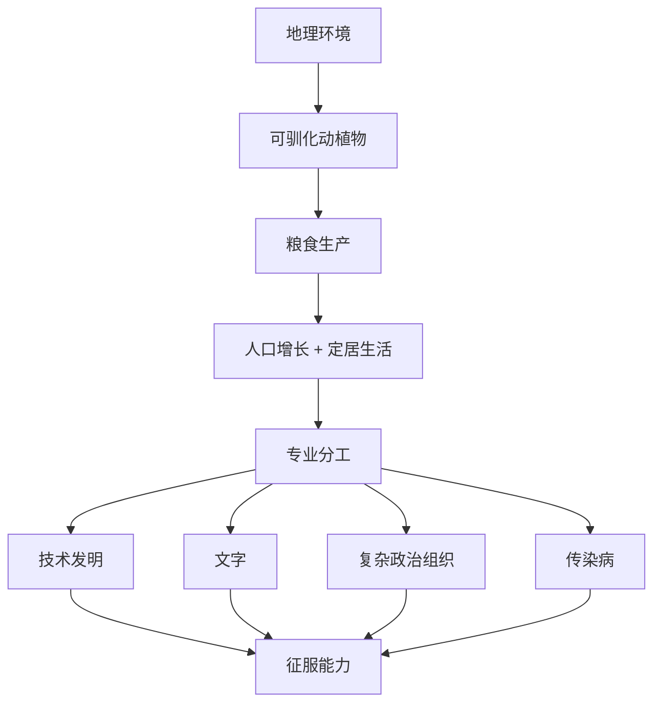

# 《枪炮、病菌与钢铁》深度读书笔记

> [!abstract] 全书速览
> 为什么是欧洲人征服了美洲、非洲和澳大利亚，而不是相反？戴蒙德用科学方法给出了一个彻底反种族主义的答案：不是人种的优劣，而是==地理的馈赠==。各大陆在可驯化动植物资源、大陆走向和面积上的差异，造成了农业起步时间的先后，进而导致技术、文字、政治组织和疾病免疫力的累积性差距。这条从地理到征服的因果链，重新定义了我们对人类历史不平等发展的理解。

## 历史坐标

《枪炮、病菌与钢铁》由美国进化生物学家、地理学家贾雷德·戴蒙德于1997年出版，获普利策奖。戴蒙德是加州大学洛杉矶分校教授，在新几内亚有长达数十年的田野研究经验。写作动机来自新几内亚朋友亚力的追问："为什么你们白人有那么多货物，我们黑人却几乎没有？"

亚力的问题直指人类历史中最大的谜题之一：公元1500年时，世界各地的社会发展水平已经出现了巨大的差距。如果你否定种族解释，就必须找到另一个答案——戴蒙德的答案是：地理环境。

> [!note] 知识谱系
> 这本书与[[《人类简史》]]形成有趣的对比：赫拉利侧重认知与文化建构，戴蒙德侧重地理与环境约束。它也与达隆·阿西莫格鲁和詹姆斯·罗宾逊的[[《国家为什么会失败》]]形成辩论关系——后者强调制度而非地理是决定性因素。戴蒙德实际上是在回应环境决定论传统，但翻转了其政治含义：正因为环境决定了一切，种族差异才是不相关的。

## 全书叙事线

全书的核心论证是一条因果链：

戴蒙德区分了历史的"终极因"和"近因"。枪炮、病菌、钢铁是近因；地理环境才是终极因。这个区分本身就是极有价值的思考工具——你在日常生活中经常犯"近因谬误"，用最表面的原因解释事情，而忽略更深层的结构性因素。

## 关键转折深度解读

### 第一个转折：粮食生产的地理彩票

全球只有几十种植物和十四种大型哺乳动物适合驯化，分布极不均匀。

> [!tip] 核心数据
> 14种被驯化的大型陆生哺乳动物分布：
> - 欧亚大陆：**13种**（牛、马、猪、羊、山羊、骆驼等）
> - 南美洲：**1种**（羊驼）
> - 北美、非洲、澳大利亚：**0种**

玉米的驯化难度远高于小麦——野生祖先大刍草看起来和玉米完全不像，穗极小，驯化需要数千年持续选择。美洲原住民并非不够聪明，他们面对的是一副烂牌。

戴蒙德提出**"安娜·卡列尼娜原则"**：成功驯化需同时满足食草、快速生长、圈养繁殖、温顺、不易受惊、有社会等级等条件。斑马太凶、猎豹不在圈养中繁殖、鹿一受惊就撞死。

> [!note] 连锁效应
> 缺乏驯化动物不仅意味着没有肉奶，更意味着没有畜力耕地和运输。欧亚农民用牛拉犁，一个人能耕种的面积是纯靠人力的好几倍。这意味着更多粮食剩余、更多人口、更快的社会分工。没有大型驯化动物的社会整个文明发展速度都被拖慢。

农业起步时间相差数千年：新月沃地约前8500年，中国约前7500年，中美洲约前3500年。五千年领先就像复利——差距呈指数级放大。

### 第二个转折：大陆轴线决定传播速度

> [!example] 东西轴线 vs 南北轴线
> - **欧亚大陆**（东西向）：爱尔兰到日本13000公里，纬度变化小。小麦3000-4000年覆盖整个大陆。
> - **美洲**（南北向）：阿拉斯加到智利15000公里，跨所有气候带。玉米从墨西哥到密西西比花了3000年，距离短得多。

纬度之所以关键，是因为植物生长周期主要受日照长度（光周期）控制。同纬度有相似日照周期，作物不需大的改变即可种植。南北传播则需要重新适应。

传播的不仅是作物，还有==轮子、文字、冶金术、思想==。文字只独立发明了极少几次，但"刺激性传播"让欧亚大部分书写系统可追溯到共同灵感来源。玛雅文字独自发明又独自消亡。欧亚文明站在彼此肩膀上，其他大陆独自摸索。

### 第三个转折：传染病——无声的征服者

> [!warning] 最被低估的征服因素
> 人类最致命的传染病几乎都来自驯化动物：
> - 天花 ← 牛痘
> - 麻疹 ← 牛瘟
> - 流感 ← 猪、鸭
> - 结核病 ← 牛

驯化意味着密切接触——人和动物住同一屋檐下，病原体发生跨物种跳跃。这些疾病需要大量人口维持传播链（麻疹需至少几十万人）。

欧亚人群与牲畜共处数千年获得免疫力。美洲原住民从未接触这些疾病——欧洲传入的疾病在一个世纪内杀死了美洲原住民人口的**90%-95%**。阿兹特克皇帝库伊特拉瓦克即位八十天就死于天花。想象你所在的城市突然只剩下二十分之一的人口。

### 第四个转折：皮萨罗征服印加

1532年，168名西班牙士兵俘虏了拥有8万大军的印加皇帝。每一个近因背后都有地理的终极因：

| 近因 | 终极因 |
|------|--------|
| 钢制武器 | 欧亚大陆数千年冶金积累 |
| 马匹 | 美洲的马约1万年前灭绝 |
| 枪炮 | 中国火药经丝绸之路传到欧洲 |
| 天花 | 美洲缺乏驯化动物带来的传染病历史 |
| 文字情报 | 皮萨罗照搬了科尔特斯的剧本，阿塔瓦尔帕没有"历史情报" |

### 第五个转折：波利尼西亚自然实验

同一祖先群体在不同岛屿建立截然不同的社会。毛利人与莫里奥里人同一血统，前者在新西兰发展农业和战争文化（人口约10万），后者在查塔姆群岛退回采集并发展和平主义（人口约2000）。1835年，毛利人几天内屠杀奴役了莫里奥里人。

> [!tip] 核心洞察
> 唯一变量是环境。环境决定了农业是否可能 → 农业决定人口规模 → 人口规模决定社会复杂度 → 社会复杂度决定军事能力。这是对种族优劣论最有力的科学反驳。

### 第六个转折：为什么是欧洲而非中国？

中国地理统一→一个皇帝叫停郑和远航就终止了大航海。欧洲碎片化→哥伦布被多国拒绝后仍找到资助。==早期统一有利传播，长期碎片化激发创新==。最优状态可能是某种中间状态——足够统一以传播创新，又足够碎片化以保持竞争活力。

## 历史的模式

**起步优势的复利效应。** 技术进步是复利式增长的，起步时间的差异会随时间推移指数级放大。

**传播比发明更重要。** 大多数社会获得技术是通过借鉴而非自己发明。地理连通性往往比自身创造力更能决定技术水平。今天硅谷的优势很大程度上不是因为那里的人更聪明，而是信息和人才流通密度最高。

**地理锁定效应。** 初始地理条件产生路径依赖效应，锁定长期发展轨迹。工业革命是一次重大的"解锁"事件。

**统一vs碎片化的悖论。** 中国地理统一→一个皇帝叫停郑和远航。欧洲碎片化→哥伦布被多国拒绝后仍找到资助。

**"必要条件"思维。** 没有可驯化动植物就不可能有农业→没有农业就不可能有大规模定居社会→没有定居社会就不可能有文字和复杂技术。必要条件不等于充分条件——满足所有必要条件的社会也不一定走同样的路。

## 作者的史学方法

跨学科综合方法，融合考古学、语言学、遗传学、生态学、流行病学。大量使用比较方法和"自然实验"。

> [!warning] 主要学术争议
> - **地理决定论过度简化**：韩国和朝鲜地理条件几乎完全相同，发展水平天壤之别——这不是地理能解释的
> - **对能动性的忽视**：美洲原住民驯化了玉米、番茄、辣椒、土豆，发展出精确天文历法，建造壮观金字塔
> - **时间尺度问题**：万年尺度有效，最近500年解释力有限
> - **证据选择性**：倾向于选择支持论点的证据

## 以史鉴今

> [!tip] 实用思考工具
> - **重新理解全球不平等**：贫穷的根源可能深植于地理条件，而非懒惰或制度落后
> - **学会区分"终极因"和"近因"**：始终追问"为什么的为什么"，直到碰到最底层因素
> - **科学反驳种族主义**：差异是环境产物，不是基因产物
> - **理解技术传播规律**：当今的传播障碍从山脉变成了语言、制度和政治壁垒
> - **警惕先发优势固化**：复利效应在技术、企业和个人层面同样适用

## 延伸阅读

- [[《崩溃》]] - 贾雷德·戴蒙德：探讨过去社会为什么会崩溃，复活节岛、玛雅、格陵兰维京人等案例
- [[《国家为什么会失败》]] - 阿西莫格鲁、罗宾逊：制度视角解释贫富差距，与地理决定论形成学术对话
- [[《人类简史》]] - 尤瓦尔·赫拉利：侧重认知和文化因素，为同一段历史提供另一个解释维度
- [[《全球通史》]] - 斯塔夫里阿诺斯：从传统编年史角度覆盖同样的全球视野
