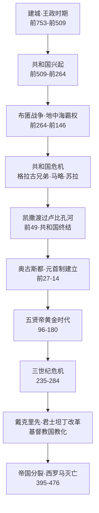

# 《罗马人的故事》深度读书笔记

> [!abstract] 全书速览
> 这是一个民族如何从台伯河畔的小城邦起步，用八百年建成横跨三大洲的帝国，又用几百年看着它一点点瓦解的完整故事。盐野七生用十五卷的篇幅讲述了这段历史，但她真正关心的不是"罗马为什么灭亡"，而是"罗马为什么能存在那么久"。在她看来，罗马之所以伟大，不在于天才将领或英明帝王，而在于它发展出了一套能让==不同民族、不同文化共存的制度体系==——而这套体系从萌芽到崩塌的全过程，对今天理解任何大型组织的兴衰都有镜鉴意义。

## 历史坐标

盐野七生（1937年生）是旅居意大利超过半个世纪的日本作家。从1992年以每年一卷的速度出版，2006年完成全部十五卷。覆盖从公元前753年罗马建城到公元476年西罗马帝国灭亡的一千二百余年历史。

> [!note] 作者的独特视角
> 盐野七生不是学院派历史学家，而是"历史叙事作家"。史料基础是塔西佗、普鲁塔克、李维、波利比乌斯等古典文献，加上数十年实地考察。一个东方人写罗马，提供了独特的外部视角——能看到西方学者习以为常而不再追问的东西。

她的叙事有两个鲜明特征：第一，对罗马人怀有深切同情和敬意，有时接近偏爱；第二，特别关注**领导力**——什么样的领导者能建设，什么样的领导者会毁灭，这条线索贯穿十五卷始终。

## 全书叙事线

核心问题：一个帝国如何从无到有、从盛到衰、从衰到亡——以及为什么它能持续如此之久？

## 关键转折深度解读

### 第一个转折：同盟战争与公民权扩展（前91-前88年）

意大利半岛上的同盟城市为罗马出兵出力近两百年，却没有罗马公民权。他们拿起武器反叛，要求平等政治地位。结果是罗马将公民权授予所有意大利人。

> [!tip] 核心洞察
> ==罗马强大不是因为军事力量最强，而是因为它能把不同的人编织进同一个制度网络。==希腊人不愿给外邦人公民权，波斯帝国靠压制维系统一，秦帝国靠绝对集权。罗马选择了一条不同的路：让被征服者参与到体制中来。公民权的扩展是这种能力最集中的体现。

### 第二个转折：凯撒渡过卢比孔河（前49年）

> [!warning] 制度的结构性失败
> 共和制度运转四百多年，设计之初适用于城邦，现在要管理横跨地中海的帝国。元老院充斥腐败寡头，行省沦为榨取工具，军队忠诚从国家转移到个人——==一个为城邦设计的操作系统已经无法驱动帝国级别的硬件。==

凯撒不是第一个利用这些裂痕的人——马略、苏拉都在他前面。但他是第一个看到共和制度结构性失败并试图用个人独裁替代它的人。他的改革切中要害，但致命错误是低估了共和传统的生命力。前44年3月15日，他在元老院被刺杀。

### 第三个转折：奥古斯都的制度设计（前27年-公元14年）

奥古斯都面对的问题极其棘手：凯撒证明公然废除共和制会招致杀身之祸；但回到旧制度又不可能。他的解决方案：形式上恢复共和国的一切，通过将多种权力集中于一身实际建立一人统治，只用"第一公民"的谦逊头衔。

> [!example] 政治艺术的巅峰
> 奥古斯都理解一个深刻的政治原理：人们反对的往往不是实质性的权力集中，而是对既有秩序的==公然践踏==。只要面子上给足，里子上的变化可以走得很远。凯撒的遗产是废墟和远景，奥古斯都的遗产是运转两百年的体制。

但这个体制有致命设计缺陷：**继承问题**。帝位传承既非纯粹世袭，也非完全择优，在血缘、收养、军队拥立和元老院认可之间摇摆不定。

### 第四个转折：五贤帝的黄金时代（96-180年）

> [!tip] "收养继承制"的启示
> 五位皇帝都通过前任收养继位。这创造了一种非正式的精英选拔机制——但它依赖一个偶然条件：在位皇帝恰好没有亲生儿子。马可·奥勒留有了儿子康茂德，打破收养传统，黄金时代戛然而止。==任何不能被制度化、仅靠偶然因素维持的好安排，都是脆弱的。==

### 第五个转折：三世纪危机（235-284年）

五十年内换二十多位皇帝，帝国同时面对日耳曼入侵、萨珊波斯崛起和内部经济崩溃。帝国一度分裂为三部分。

> [!warning] 规模的诅咒
> 帝国规模超出了治理技术所能支撑的范围。行政层级越来越多，信息传递越来越失真，中央指令到地方时面目全非。奥勒良重新统一帝国，戴克里先通过四帝共治续命——但代价是帝国性质根本改变：从相对松散的公民共同体变成高度集权、重度税收、军事化管理的国家机器。

### 第六个转折：基督教成为国教（313-380年）

> [!warning] 盐野七生的争议性观点
> 她认为罗马能建成多民族帝国的关键在于**宗教宽容**——罗马人不要求被征服者放弃自己的神，只要求同时尊重罗马的神。基督教的排他性从根本上摧毁了这种宽容基础。但主流学术界认为她过度简化了基督教与罗马衰亡之间的因果关系——东罗马帝国同样基督教化却延续了一千年。

她提出的问题本身有价值：一个帝国的凝聚力核心是什么？当这个核心被替换时，帝国是否还是同一个帝国？

### 第七个转折：西罗马帝国的终结（476年）

帝国不是在某一天灭亡的——像一座大厦在漫长岁月中一根柱子一根柱子地被抽走。军事上依赖蛮族雇佣兵，经济上税基萎缩军费膨胀，行政上中央权威流失，文化上公民认同消解。

> [!example] 盐野七生的结论
> ==真正杀死罗马的不是蛮族，而是罗马自己==：当它不再能吸引最优秀的人为公共事务服务，当它的公民不再相信这个共同体值得为之牺牲，当它的制度不再能回应新挑战时，帝国就已经死了，只不过躯壳还在。

## 历史的模式

**开放性决定生命力。** 早期罗马对公民权的开放、对被征服文化的包容、对外来人才的吸纳，是它从小城邦成长为帝国的关键。当帝国晚期开始排斥异教、歧视蛮族、固化阶层时，衰亡就开始了。这个模式在唐帝国的开放与明清的封闭中同样可见。

**制度老化不可避免，更新速度决定存亡。** 从王政到共和、共和到帝制、元首制到四帝共治——罗马经历了多次制度转型。每次转型伴随动荡也注入活力。到晚期，制度更新速度再也跟不上问题积累速度。

**军事力量与文明认同的关系。** 军团从公民兵到职业军队再到蛮族雇佣兵，不仅是军事史变迁，更是公民认同瓦解的缩影。当保卫帝国的人不再认同帝国价值，安全就建立在了流沙之上。

> [!tip] 偶然与必然
> 五贤帝黄金时代依赖"恰好没有亲生儿子"这个偶然因素。==真正稳健的制度应该能在各种条件下运转，而不是只在理想条件下才能工作。==

## 作者的史学方法

盐野七生的史料基础主要是古典文献，没有使用大量现代考古发现或量化数据。写作风格文学化——人物有心理活动，场景有画面感，对话有戏剧性。极具可读性，但有大量文学加工。

> [!warning] 局限
> - 对凯撒、哈德良等人物的描写过于理想化，接近英雄崇拜
> - 对基督教的批评过于简单化，忽视其在帝国后期社会秩序中的积极作用
> - "领导力史观"过度强调个人因素，对经济、人口、气候等结构性因素关注不足
> - 对女性在罗马历史中的角色着墨甚少

## 以史鉴今

> [!tip] 现实启发
> - **多元共存**：大型共同体的生命力取决于能否让不同群体感到自己是"我们"的一部分，纯靠压制的统一既昂贵又脆弱
> - **制度 vs 强人**：凯撒有天纵之才但不屑建制度，一死什么都没留下；奥古斯都建立的体制运转两百年——你的成就不应该依赖于你个人的存在
> - **规模的甜蜜点**：任何组织都有治理能力的规模上限，过度扩张不是荣耀而是负担
> - **衰落的缓慢性**：帝国不是某天灭亡的，每代人都觉得"还撑得住"，直到发现承重结构已经不在——温水煮青蛙式的衰落可能是罗马最重要的警告

## 延伸阅读

- [[《罗马帝国衰亡史》]] - 爱德华·吉本：经典中的经典，对衰亡原因的分析至今仍是学术讨论的起点
- [[《沉思录》]] - 马可·奥勒留：哲学家皇帝在战场帐篷中写下的私人笔记，从内部视角展现罗马统治者的精神世界
- [[《罗马革命》]] - 罗纳德·赛姆：从社会学视角分析共和国晚期到帝制初期的权力转移
