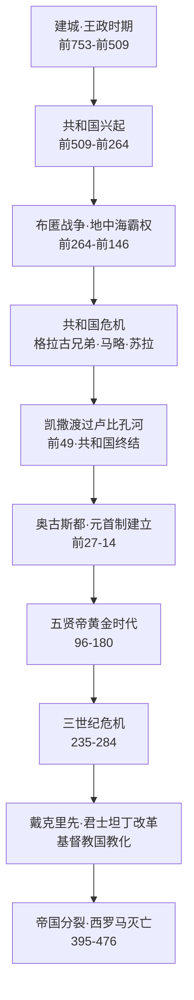

# 《罗马人的故事》深度读书笔记

> [!abstract] 全书速览
> 这是一个民族如何从台伯河畔的小城邦起步，用八百年建成横跨三大洲的帝国，又用几百年看着它一点点瓦解的完整故事。盐野七生用十五卷的篇幅讲述了这段历史，但她真正关心的不是"罗马为什么灭亡"，而是"罗马为什么能存在那么久"。在她看来，罗马之所以伟大，不在于天才将领或英明帝王，而在于它发展出了一套能让==不同民族、不同文化共存的制度体系==——而这套体系从萌芽到崩塌的全过程，对今天理解任何大型组织的兴衰都有镜鉴意义。这不是学术专著，而是用文学温度复活了历史人物的长篇叙事。

## 历史坐标

盐野七生（1937年生）是旅居意大利超过半个世纪的日本作家。1963年初赴意大利，从此再未长期离开。从1992年以每年一卷的速度出版，2006年完成全部十五卷。覆盖从公元前753年罗马建城到公元476年西罗马帝国灭亡的一千二百余年历史，叙事重心在共和国晚期到帝国初期。

> [!note] 作者的独特视角
> 盐野七生不是学院派历史学家，而是"历史叙事作家"。史料基础是塔西佗、普鲁塔克、李维、波利比乌斯等古典文献，加上数十年实地考察——她走遍了罗马帝国版图内几乎所有重要遗址，从罗马城的元老院遗迹到北非的迦太基废墟，从不列颠的哈德良长城到小亚细亚的古道。一个东方人写罗马，提供了独特的外部视角——她会追问西方学者习以为常的东西，比如为什么是务实的罗马人而非天才的希腊人发展出了系统的法律体系。

她的叙事有两个鲜明特征：第一，对罗马人怀有深切同情和敬意，有时接近偏爱；第二，特别关注**领导力**——什么样的领导者能建设，什么样的领导者会毁灭，这条线索贯穿十五卷始终。她笔下的历史从来不是抽象力量的博弈，而是具体的人在具体的处境中做出的具体选择。

## 全书叙事线

故事从传说中的罗穆路斯建城开始。早期罗马三面受敌，没有天然屏障，但展现出惊人的同化能力——不是消灭敌人，而是把敌人变成盟友甚至公民。王政推翻后建立共和制度，经历三次布匿战争确立地中海霸权。征服财富加剧贫富分化，格拉古兄弟改革失败标志制度丧失自我修复能力。经马略军事改革、苏拉独裁、前三头同盟，凯撒渡过卢比孔河终结共和。奥古斯都建立元首制，五贤帝达到巅峰。三世纪危机后帝国性质根本改变，395年永久分裂，476年西罗马灭亡。

核心问题：一个帝国如何从无到有、从盛到衰、从衰到亡——以及为什么它能持续如此之久？

## 关键转折深度解读

### 第一个转折：布匿战争与地中海霸权（前264-前146年）

第二次布匿战争是全书最精彩的篇章之一。汉尼拔翻越阿尔卑斯山，在坎尼以不到五万人歼灭罗马六万多人。但意大利中部的拉丁同盟城市几乎没有背叛罗马。

> [!tip] 核心洞察
> ==同盟体系的黏合力而非军事力量，才是罗马真正的核心竞争力。==汉尼拔期望同盟体系会在军事打击下瓦解，但罗马的同盟给予了盟邦实质性的自治权和利益共享。罗马最终没有在战场上击败汉尼拔——他们用费边战略避免决战、切断补给，最后西庇阿反攻北非在扎马之战中定胜负。

### 第二个转折：格拉古兄弟改革失败（前133-前121年）

提比略·格拉古提出限制个人占有公共土地面积的温和改革，却被元老率领暴徒打死——罗马共和国历史上第一次将政治暴力用于国内政争。弟弟盖乌斯更大刀阔斧推进改革，同样死于政治暴力。

> [!warning] 制度的两难
> 共和制度的核心是精英协商与妥协。但当社会矛盾尖锐到需要根本性改革时，既得利益集团可以利用制度规则阻挠任何实质变革。==改革者面临两难：遵守规则无法推动改革，打破规则则破坏制度根基。==格拉古兄弟选择了后者，开启了政治暴力的先例——此后一百年，共和制度在名存实亡中走向终结。

### 第三个转折：凯撒渡过卢比孔河（前49年）

> [!warning] 制度的结构性失败
> 共和制度运转四百多年，设计之初适用于城邦，现在要管理横跨地中海的帝国。元老院充斥腐败寡头，公民大会沦为被操纵的形式，军队忠诚从国家转移到将军——==一个为城邦设计的操作系统已经无法驱动帝国级别的硬件。==

凯撒是第一个不愿功成身退的人。苏拉独裁后退休归隐，但一切照旧——个人克制无法挽救制度崩溃。凯撒的改革方向正确，但致命错误是低估共和传统的生命力，且不屑于在形式上给共和制度留面子。前44年3月15日被刺杀。

盐野七生在写凯撒时倾注了最多的情感，坦承自己"爱上了"凯撒。读者需要意识到这种主观性。但她的核心问题是尖锐的：当制度烂到核心时，温和改革更好还是推倒重来更好？

### 第四个转折：奥古斯都的制度设计（前27年-公元14年）

奥古斯都的方案堪称政治艺术的巅峰：形式上恢复共和国的一切，通过同时担任多个已有的共和职位将权力集于一身，只用"第一公民"的谦逊头衔。

> [!example] "制度嫁接"的精妙
> 他没有创造任何新职位——只是同时担任保民官（否决权）、行省总督（军事权）、大祭司长（宗教权力）。每个权力单独看都符合共和传统，组合在一起就构成绝对权力。==人们反对的往往不是实质性的权力集中，而是对既有秩序的公然践踏。==凯撒有实力改变一切但不屑伪装；奥古斯都改变了同样多的东西，但包装得让人几乎感觉不到变化。

他还建立了帝国的基础设施——道路、邮政、行省行政、常备军和退伍安置制度。这些才是帝国持久运转的真正基石。但致命缺陷是**继承问题**：帝位传承在血缘、收养、军队拥立和元老院认可之间摇摆不定。

### 第五个转折：五贤帝的黄金时代（96-180年）

图拉真将版图推到极盛，哈德良明智收缩巩固边境，安东尼·庇护治下二十三年和平，马可·奥勒留在战场帐篷中写出《沉思录》。

> [!tip] "收养继承制"的启示
> 成功的关键机制是在位皇帝在精英中选择最合适者收养为继承人。但这依赖==偶然条件：在位皇帝恰好没有亲生儿子==。涅尔瓦、图拉真、哈德良、安东尼·庇护恰好都没有存活的亲生儿子。马可·奥勒留有了儿子康茂德，打破收养传统，暴君上台，黄金时代终结。**任何不能被制度化、仅靠偶然因素维持的好安排，都是脆弱的。**

### 第六个转折：三世纪危机（235-284年）

五十年内换二十多位皇帝，帝国同时面对日耳曼入侵、萨珊波斯崛起和内部经济崩溃，一度分裂为三部分。

> [!warning] 规模的诅咒
> 帝国规模超出了治理技术所能支撑的范围。行政层级越来越多，信息传递越来越失真，中央指令到地方时面目全非。奥勒良重新统一帝国，戴克里先通过四帝共治续命——但代价是帝国性质根本改变：从松散的公民共同体变成==高度集权、重度税收、军事化管理的国家机器==。为防叛乱军区与行政区分离；为增税收农民被绑定在土地上；皇帝从"第一公民"变成东方式的神圣君主。帝国活了下来，但已不是原来那个帝国。

### 第七个转折：基督教成为国教（313-380年）

> [!warning] 盐野七生的争议性观点
> 她认为罗马能建成多民族帝国的关键在于**宗教宽容**——罗马人不要求被征服者放弃自己的神，只要求同时尊重罗马的神。基督教的排他性摧毁了这种宽容基础，将人们注意力从公民责任转移到个人救赎，教会还分散了帝国人才和统治效能。但主流学术界认为她过度简化——东罗马帝国同样基督教化却延续了一千年，基督教在后期也提供了新的社会凝聚力。

她提出的问题本身有价值：一个帝国的凝聚力核心是什么？当这个核心被替换时，帝国是否还是同一个帝国？

### 第八个转折：西罗马帝国的终结（476年）

帝国不是在某一天灭亡的——像一座大厦在漫长岁月中一根柱子一根柱子地被抽走。军事上依赖蛮族雇佣兵，经济上税基萎缩军费膨胀，行政上中央权威流失，文化上公民认同消解——人们首先是基督徒，不再是罗马人。

> [!example] 盐野七生的结论
> ==真正杀死罗马的不是蛮族——蛮族只是推了最后一把的人。==当它不再能吸引最优秀的人为公共事务服务，当公民不再相信这个共同体值得为之牺牲，当制度不再能回应新挑战时，帝国就已经死了，只不过躯壳还在。

## 历史的模式

**开放性决定生命力。** 早期罗马对公民权的开放、对被征服文化的包容、对外来人才的吸纳，是它从小城邦成长为帝国的关键。罗马的神殿里供奉着来自埃及、希腊、波斯的神灵，元老院里坐着来自高卢、西班牙、北非的议员。当帝国晚期开始排斥异教、歧视蛮族、固化阶层时，衰亡就开始了。这个模式在唐帝国的开放与明清的封闭中同样可见。

**制度老化不可避免，更新速度决定存亡。** 从王政到共和、共和到帝制、元首制到四帝共治——罗马经历了多次制度转型。每次转型伴随动荡也注入活力。到晚期，制度更新速度再也跟不上问题积累速度。制度的老化有一个隐蔽特征：它不是突然失效的，而是在一次次"凑合着用"中逐渐丧失活力。

**军事力量与文明认同。** 军团从公民兵到职业军队再到蛮族雇佣兵，不仅是军事史变迁，更是公民认同瓦解的缩影。马略军事改革解决了兵源问题但制造了私人军队问题；帝国晚期使用蛮族雇佣兵解决了军费问题但制造了忠诚度问题。每一次"解决方案"都在不经意间制造新的、更深层的问题。

**规模的诅咒。** 帝国越大治理成本越高而边际收益递减。哈德良的收缩战略在当时被视为软弱，从长时段看可能是最明智的选择。

> [!tip] 偶然与必然
> 五贤帝黄金时代依赖"恰好没有亲生儿子"这个偶然因素。==真正稳健的制度应该能在各种条件下运转，而不是只在理想条件下才能工作。==制度设计者要假设最坏的条件，而不是最好的条件。

## 作者的史学方法

盐野七生的史料基础主要是古典文献，方法更接近文学式的史学——选择核心人物，重建其内心世界，以此带动对一个时代的理解。她会写凯撒渡过卢比孔河时内心的犹豫和决绝，写马可·奥勒留在多瑙河前线寒冷帐篷中提笔写哲学日记。极具可读性和感染力，但有大量文学加工。

> [!warning] 局限
> - 对凯撒、哈德良等人物的描写过于理想化，接近英雄崇拜
> - 对基督教的批评过于简单化，忽视其在帝国后期社会秩序中的积极作用
> - "领导力史观"过度强调个人因素，对经济、人口、气候等结构性因素关注不足——安东尼瘟疫对帝国人口的毁灭性打击着墨很少
> - 对女性在罗马历史中的角色着墨甚少

但她的贡献不可否认：用十五年为普通读者写出一部完整的、有温度的罗马通史，激发读者对罗马历史的兴趣和思考。

## 以史鉴今

> [!tip] 现实启发
> - **多元共存**：大型共同体的生命力取决于能否让不同群体感到自己是"我们"的一部分，纯靠压制的统一既昂贵又脆弱
> - **制度 vs 强人**：凯撒有天纵之才但不屑建制度，一死什么都没留下；奥古斯都建立的体制运转两百年——你的成就不应依赖于你个人的存在
> - **规模的甜蜜点**：任何组织都有治理能力的规模上限，过度扩张不是荣耀而是负担，知道极限并主动停下来比一味扩张更需要勇气
> - **衰落的缓慢性**：帝国不是某天灭亡的，每代人都觉得"还撑得住"——最危险的不是突然崩溃，而是缓慢的、几乎感觉不到的退化

## 延伸阅读

- [[《罗马帝国衰亡史》]] - 爱德华·吉本：经典中的经典，对衰亡原因的分析至今仍是学术讨论的起点，关于基督教角色的讨论与盐野七生形成有趣对照
- [[《沉思录》]] - 马可·奥勒留：哲学家皇帝在战场帐篷中写下的私人笔记，从内部视角展现罗马统治者的精神世界
- [[《罗马革命》]] - 罗纳德·赛姆：从社会学视角分析共和国到帝制的权力转移，弥补盐野七生在制度分析上的不足
