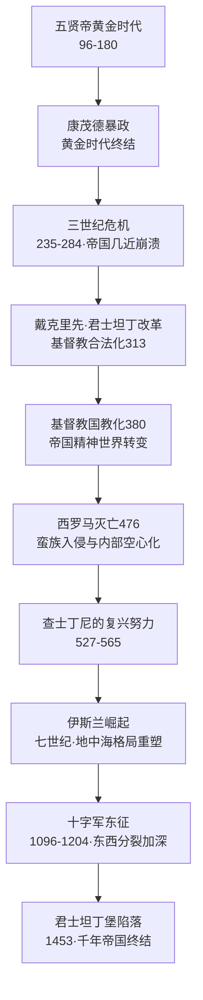

# 《罗马帝国衰亡史》深度读书笔记

> [!abstract] 全书速览
> 这部写于十八世纪的巨著，用六卷本覆盖了从公元180年五贤帝末期到1453年君士坦丁堡陷落的约一千三百年历史。吉本做了一件前无古人的事情：他把一个帝国从巅峰到崩溃的全过程当作一个完整的故事来讲。核心论断尖锐而持久——==罗马不是被蛮族打败的，而是从内部腐烂的；基督教的兴起不是文明的拯救，而是帝国衰亡的加速器==。这个判断在两百多年后依然是所有罗马衰亡研究的起点，即使你不同意他，你也绑不开他。吉本的文风优雅而讽刺，每一句话都经过精心打磨，读他的书不只是在读历史，也是在欣赏一位启蒙时代知识分子如何用理性之光审视人类最壮丽也最惨痛的一段过往。

## 历史坐标

爱德华·吉本（1737-1794）是英国启蒙时代最重要的历史学家之一。出身富裕乡绅家庭，少年时体弱多病，牛津短暂就读后被送往瑞士洛桑，在那里接受了法国启蒙思想的洗礼——伏尔泰、孟德斯鸠的理性主义深刻塑造了他此后的思维方式。1764年10月15日，二十七岁的吉本坐在罗马卡皮托利欧山的废墟上，听着赤脚修士在朱庇特神殿的遗址上唱晚祷歌——这个画面成了整部《衰亡史》的精神原点。

> [!note] 启蒙主义的历史书写
> 吉本的史学立场是典型的启蒙主义：相信理性、怀疑迷信、推崇古典公民美德、对宗教权威保持距离。他最著名的写作手法是反讽——表面上客客气气地叙述某件事，实际上无情地嘲讽。比如讨论早期基督教殉道者人数时，恭敬地引用教会史料，然后轻描淡写地指出这些数字在逻辑上的不可能。

从构思到完成花了二十年。第一卷1776年出版——恰好是美国独立宣言发表的同一年。前三卷覆盖从公元180年到西罗马灭亡（476年），后三卷追踪东罗马命运直到1453年君士坦丁堡陷落。时间跨度约一千三百年，空间从不列颠到美索不达米亚。

她的叙事有两个鲜明特征：第一，对罗马古典公民美德怀有深切的敬意；第二，对一切形式的迷信和教条保持启蒙理性的批判距离。在写凯撒的天才时，[[《罗马人的故事》]]的盐野七生是用感情在写，吉本则是用手术刀在写——同样精彩，但温度完全不同。

## 全书叙事线

吉本选择了精心设计的起点：公元180年，马可·奥勒留去世。在他看来，五贤帝时代是人类历史的巅峰——=="如果让一个人指出世界历史上人类过得最幸福、最繁荣的时期，他一定会毫不犹豫地选出从图密善之死到康茂德继位的那段时光。"==从巅峰开始讲衰落，你先看到文明能达到的最高处，然后目睹它一步步跌落。

前三卷最紧凑：康茂德暴政撕开黄金时代帷幕，三世纪危机帝国几近四分五裂，戴克里先和君士坦丁为帝国续命但改变了帝国性质，基督教从边缘教派到唯一国教，西罗马在蛮族渗透和内部空心化中灭亡。后三卷视野大幅展开：查士丁尼的恢复努力、伊斯兰教的横空出世、十字军的荒诞与血腥、蒙古人的冲击波、1453年君士坦丁堡陷落。吉本在最后一章回到卡皮托利欧山的废墟——像走完漫长旅程的旅人回到原点，目光已经完全不同。

## 关键转折深度解读

### 第一个转折：从黄金时代到恐怖统治——康茂德与三世纪危机

你可以把五贤帝时代想象成一栋精心建造的大厦的全盛期。然后马可·奥勒留去世，亲生儿子康茂德继位——黄金时代的最大讽刺：一位哲学家皇帝留给帝国的遗产竟是一个沉迷角斗场、自封赫拉克勒斯化身的暴君。

> [!warning] 帝制的结构性缺陷
> 五贤帝之所以贤明，不是因为制度选出了贤人，而是因为前四位皇帝==恰好没有亲生儿子==，只能在精英中收养继承人。这是偶然而非制度。一旦偶然条件消失，制度就暴露出真面目：皇位传承完全取决于上一任皇帝的个人判断，而没有任何制度约束能阻止一个父亲把帝国交给不成器的儿子。

三世纪危机（235-284年）把帝国推到崩溃边缘。五十年间二十多位皇帝走马灯般更替，北方日耳曼人和哥特人频频越境，东方萨珊波斯咄咄逼人，260年皇帝瓦勒良被萨珊国王生擒。帝国内部通货膨胀失控、瘟疫横行、城市萎缩、人口锐减。

戴克里先通过四帝共治和全面行政改革重新稳定了局面。但吉本冷静指出，这种"拯救"本身改变了被拯救的对象：帝国从相对宽松的公民共同体变成高度集权的行政机器。农民被绑在土地上不得迁移，手工业者被绑定行业世代不能更换。帝国活了下来，但已经不是你认识的那个帝国了。

### 第二个转折：基督教的胜利——吉本最著名也最危险的论断

> [!tip] 全书最核心的两章
> 第十五和第十六章分析基督教兴起原因，是全书最精彩也最引发争议的部分——出版后立刻引爆英国知识界论战。

吉本的方法是典型的启蒙主义路线：不讨论教义真假，而是追问历史问题——基督教为什么能从边缘小教派成长为统治宗教？他给出五个原因：基督徒的狂热执着（继承自犹太教的排他性一神论）、对来世的信仰、早期教会宣称的神迹、基督徒的道德纯洁、以及教会组织的严密高效。

表面上这些分析很客观。但讽刺藏在措辞之中——他每次提到"神迹"时用一种微妙的语气；赞扬道德纯洁时紧接着提到这种纯洁如何在获得权力后迅速腐蚀。更关键的是，他通过考察早期迫害的实际规模得出了让教会难以接受的结论：==基督教殉道者人数远没有教会传统宣称的那么多==。罗马对基督教的迫害虽然真实，但远不如后来基督徒对异教徒和异端的迫害那么系统和残忍。

> [!warning] "基督教腐蚀论"的核心逻辑
> 古典罗马的公民美德建立在"此世"基础上——修路、打仗、参政、纳税，因为世俗共同体值得为之付出。基督教把目光从此世转向来世——如果天堂才是归宿，尘世不过是临时考验，你为什么还要为修路或守边境拼命？当帝国最需要公民参与和牺牲时，基督教告诉人们：==你最重要的事业是拯救自己的灵魂。==

这个论断至今存在争议。支持者认为从公民宗教到个人救赎宗教的转型确实影响了帝国凝聚力。反对者指出东罗马同样基督教化却延续一千年；基督教在帝国后期还提供了新的社会秩序——国家行政崩溃的地方，是教会慈善网络在维持社会运转。但吉本的问题依然锋利：一个共同体的精神凝聚力从何而来？当旧的凝聚力被替代时，共同体是否还是同一个？

### 第三个转折：蛮族入侵与西罗马的灭亡

吉本笔下的蛮族入侵不是突然的洪水，而是持续几百年的渗透。日耳曼部落最初是罗马的邻居和交易伙伴，然后是边境雇佣兵，再后来是帝国内部定居者，最后是帝国掘墓人。每一步在当时看来都是合理的——帝国需要士兵，日耳曼人需要土地和财富——但每一步都在悄悄改变帝国的基因构成。

378年亚德里亚堡战役是标志性时刻。西哥特人受匈人挤压请求进入帝国避难，帝国同意后官员的腐败盘剥激起叛乱。皇帝瓦伦斯亲率大军镇压却被歼灭，瓦伦斯战死——一支蛮族军队在正面战场上击败了罗马主力。

410年西哥特首领阿拉里克洗劫罗马城。八百年来没有外敌踏入过"永恒之城"。圣奥古斯丁为此写出[[《上帝之城》]]，论证真正的永恒之城不在地上而在天上——在吉本看来恰恰印证了他的论断：基督教把精神能量从保卫此世转向追求彼岸。

> [!example] 476年——不是轰然倒塌，而是慢性死亡
> 奥多亚塞废黜最后一位西罗马皇帝罗慕路斯·奥古斯都卢斯——名字讽刺地回应建城者罗穆路斯和第一位皇帝奥古斯都。但这一天在当时几乎无人注意。==帝国不是在某一刻轰然倒塌的，而是像一个慢性病人在漫长岁月中一点点耗尽生机。==

吉本的分析是多层次的：军事上依赖蛮族雇佣兵，经济上税基萎缩而军费膨胀，政治上中央权威流失，文化上罗马公民认同消解——人们不再把自己当作"罗马人"，而是某个族群、某个教派、某个地方庄园的成员。

### 第四个转折：东罗马的延续与查士丁尼

吉本对东罗马的态度总体偏负面——他认为拜占庭是一个沉闷保守、充满宫廷阴谋和神学争吵的政权。这个判断在今天的拜占庭研究中被认为严重偏颇——现代学者更重视拜占庭在保存古典文化、发展法律体系、抵御伊斯兰扩张方面的贡献。

但吉本写查士丁尼时代（527-565年）展现了最好的一面。查士丁尼的三大功业：编纂《查士丁尼法典》成为西方法律传统基石；修建圣索菲亚大教堂近千年间世界最大室内空间；通过名将贝利撒留一度收复北非、意大利和西班牙南部。

> [!warning] 过度扩张的教训
> 吉本对查士丁尼的西方远征持批判态度——耗费大量资源，收复的领土大多几十年内又丧失。意大利在哥特战争中遭受的破坏甚至超过蛮族入侵本身。帝国真正威胁在东方，查士丁尼却把主力投入西方旧梦——==收复失地的荣光不能抵消资源的消耗和注意力的分散。==

### 第五个转折：伊斯兰的崛起

吉本对穆罕默德的态度比对基督教教父客气得多——他把穆罕默德描述为兼具宗教热忱和政治天才的非凡领袖。穆罕默德去世仅一百年后，阿拉伯帝国版图从西班牙延伸到中亚，比罗马鼎盛时期还辽阔。叙利亚、埃及、北非——曾是罗马最富庶的行省——几十年内全部沦陷。

> [!note] 征服成功的深层原因
> 伊斯兰教义的简洁有力（对比基督教复杂的三位一体神学，"万物非主唯有真主"是普通人一分钟就能理解的信条）、以及被征服地区对拜占庭繁重税收和宗教迫害的厌倦——很多基督徒和犹太人发现，在穆斯林统治下比在拜占庭统治下还好过。

### 第六个转折：十字军——以信仰之名的荒诞远征

吉本对十字军的描写是全书讽刺最辛辣的篇章。第四次十字军（1202-1204年）是对十字军理念的彻底嘲讽：原本要解放圣地的军队，在威尼斯商人操纵下转而洗劫基督教的君士坦丁堡。基督徒对基督徒的洗劫比任何穆斯林征服者造成的破坏都大——近九百年的艺术品、手稿和圣物被掠夺或焚毁。

> [!tip] 1204年的深远影响
> ==1204年的洗劫比1453年奥斯曼征服对文明造成的破坏更大。==东罗马帝国虽在1261年复国，但元气大伤。当1453年君士坦丁堡面临最后围攻时，拜占庭向西方求援的呼声几乎无人回应——两个半世纪前的伤痕仍在流血。

### 第七个转折：1453——千年帝国的最后一天

1453年5月29日，穆罕默德二世率军攻破君士坦丁堡。末代皇帝君士坦丁十一世据说在城墙上战死，尸体混在普通士兵中无法辨认。穆罕默德二世当时年仅二十一岁，他下令铸造了世界上最大的火炮——由匈牙利工程师乌尔班制造。讽刺的是，乌尔班最初向拜占庭提供服务，但拜占庭付不起他的报酬。一个帝国无力支付一位工程师薪水，比任何军事分析都更能说明帝国的真实状况。

吉本在全书最后完成了一个优美的闭环：罗马衰亡催生基督教胜利，基督教胜利催生拜占庭保守和十字军疯狂，十字军削弱拜占庭让它倒在奥斯曼炮火下，而拜占庭陷落又把古典文化种子播撒到西欧催生文艺复兴。历史画了一个巨大的圆。

## 历史的模式

帝国衰亡从来不是单一原因造成的，而是多重因素的共振。军事蛮族化削弱公民认同，公民认同削弱减少本土兵源，兵源不足又加深对蛮族雇佣兵的依赖——一个自我强化的下降螺旋。吉本的伟大之处在于展现了一张因果关系的网络，而不是简单指向某一个原因。在你自己的经验中也可能见过类似模式——一个组织的衰落往往不是因为某一个致命错误，而是多个看似不致命的问题同时发酵。

==规模本身就是一种负担。==维持从不列颠到美索不达米亚的防线需要几十万常备军，每个士兵都需要粮饷、装备和退休金。税基在三世纪后持续萎缩，收入减少支出增加——吉本用近乎会计师的目光审视帝国资产负债表，让你自己得出结论。

制度的僵化比外敌入侵更致命。蛮族入侵是压垮骆驼的最后一根稻草——稻草本身没什么力量，问题在于骆驼已经背负了太多。内部制度僵化、官僚腐败、阶层固化、社会活力丧失才是真正的杀手。对于今天任何组织而言：你最该担心的不是竞争对手变强了，而是你自己在变弱而不自知。

> [!tip] 文明交替的规律
> 罗马文明遗产没有消失——被基督教世界、伊斯兰世界和文艺复兴后的西欧分别继承和改造。吉本不是文明悲观主义者——衰亡废墟上长出了新东西。地中海从罗马的"内湖"变成两种文明的分界线，而古典文化的种子在各处开出不同的花。

## 作者的史学方法

吉本的史料工作在十八世纪是第一流的。广泛使用希腊和拉丁原始文献——从塔西佗、阿米安努斯·马尔凯利努斯到普罗柯比乌斯、米哈伊尔·普塞洛斯，还大量参考阿拉伯和拜占庭史料。注释系统在当时是开创性的——每个重要论断标注出处，让读者可以验证。这种"让证据说话"的做法是现代史学方法的先驱。

> [!warning] 局限与修正
> 以今天标准看有明显局限：几乎完全依赖文字史料，没有使用考古、钱币学、碑铭学等工具；对经济和社会结构分析相对薄弱；启蒙主义立场让他评价宗教时难以完全客观——对基督教有时过于苛刻，对古典异教则过于理想化。现代学者如彼得·布朗提出"古典晚期"概念，重新定义了三到七世纪为充满创造力的文化转型期；布莱恩·沃德-珀金斯则用考古证据证明西罗马灭亡确实伴随物质文明急剧下降。

但吉本的地位不可撼动。在他之前没有人以这种规模和方法写过历史。他确立了一种传统：历史写作既要有学术严谨也要有文学优雅，既要叙述事件也要分析原因。两百多年来，每一位罗马史学者都是在与吉本对话。

## 以史鉴今

> [!tip] 现实启发
> - 真正摧毁一个文明的力量从来不在外部，而在内部。外敌只是利用了内部的裂缝。当一个国家或组织把注意力过多放在外部威胁上而忽视内部制度退化时，应该想到吉本的警告
> - 当信仰取代了论证，当教条取代了经验，当来世的许诺消解了此世的责任，社会的自我修复能力就会受损——这适用于任何一种意识形态取代理性思考的场景
> - ==没有哪个文明是永恒的==。真正的智慧不是相信自己不会衰落，而是理解衰落的机制并努力延缓它
> - 当你所在的共同体出现公民精神衰退、制度创新停滞、精英封闭短视、用口号替代行动的倾向时，也许该重新翻开这部两百多年前的巨著

## 延伸阅读

- [[《罗马人的故事》]] - 盐野七生：覆盖从建城到476年的全部罗马史，与吉本形成互补——盐野七生重心在辉煌建设，吉本重心在衰落崩溃，一个像朋友讲故事，一个像医生做尸检
- [[《历史的教训》]] - 威尔·杜兰特：从整个人类历史中提炼规律的小书，关于文明兴衰周期的讨论与吉本核心关切高度吻合，视野更广篇幅更精练
- [[《罗马帝国的陨落》]] - 布莱恩·沃德-珀金斯：当代学者用考古证据重新论证西罗马衰亡的力作，用现代方法检验吉本两百年前的论断
