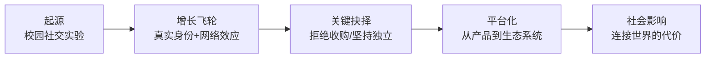

# 《Facebook效应》深度读书笔记

> [!abstract] 全书速览
> 2004年，一个19岁的哈佛大学生在宿舍里写出了一个网站，六年后这个网站拥有超过五亿用户，改变了人类的社交方式、政治运动和商业形态。大卫·柯克帕特里克作为《财富》杂志资深记者，获得了扎克伯格和Facebook核心团队的深度配合，从内部视角记录了这家公司从校园项目到全球现象的完整历程。这本书不是一部技术史，而是一部关于==年轻创始人如何在巨大压力下坚持愿景、拒绝短期诱惑、并最终重新定义一个行业==的决策史。柯克帕特里克深入挖掘了扎克伯格拒绝雅虎十亿美元收购、Facebook广告模式的曲折演变、隐私争议的反复爆发、开放平台策略的得失，以及社交网络如何成为一种==超越公司本身的社会基础设施==。

## 核心命题

这本书要回答的核心问题是：==Facebook为什么能从众多社交网络中胜出，成为连接全球十几亿人的基础设施？==

柯克帕特里克的回答不是技术决定论，也不是简单的先发优势。他的论证核心是：Facebook之所以走到今天，根本原因在于扎克伯格从第一天起就把这个项目当作一项使命而非一门生意。这个判断听起来像是公关话术，但柯克帕特里克用大量内部决策细节来支撑它——当雅虎开出十亿美元收购价时，扎克伯格问自己的问题不是"这个价格够不够高"，而是"拿到钱之后我会做什么？我会再建一个社交网络。那我为什么要卖？"

> [!tip] 核心主张
> Facebook的成功不是因为技术最好、功能最全或营销最强，而是因为它的创始人在每一个关键岔路口都选择了==长期价值而非短期收益==。这种选择在早期看起来像是幼稚和固执，回头看却是最重要的竞争壁垒。

这个命题的独特之处在于，它把Facebook的故事从"天才少年创业成功"的叙事模板中拉出来，放进了一个更深的问题框架：==当一个产品开始影响数亿人的生活方式时，创始人的个人价值观如何决定了这家公司的走向？== 柯克帕特里克没有回避这个问题中令人不安的部分——一个二十岁出头的年轻人，凭什么为全球数亿人的隐私和社交规则做决定？

## 框架全景

柯克帕特里克的叙事沿着一条清晰的时间线展开，但每个阶段都对应一个核心商业问题。第一阶段是**起源**——Facebook为什么能在Friendster和MySpace已经存在的情况下后来居上。答案不是技术，而是==真实身份==：Facebook从第一天起就要求用户使用真名，绑定大学邮箱，这在当时的互联网文化中几乎是反直觉的，但正是这个选择让Facebook上的社交关系具有了现实世界的重量。第二阶段是增长——Facebook的扩张策略极其克制，从哈佛到常春藤到所有大学到高中到公司到全社会，每一步都是主动选择的节奏控制，而非无序扩张。第三阶段是关键抉择——尤其是2006年拒绝雅虎收购，这个决定在当时被很多人视为愚蠢至极。第四阶段是平台化——2007年推出Facebook Platform，允许第三方开发者在平台上构建应用，这个策略彻底改变了Facebook的商业想象空间。第五阶段是社会影响——Facebook开始被用于政治运动、社会抗议、商业营销，它不再仅仅是一个公司的产品，而是变成了一种社会基础设施。这五个阶段合在一起，讲述的是一个产品如何超越创始人的初始意图，成长为一种改变人类行为方式的力量。

## 核心观点深度解读

### 真实身份是Facebook最深的护城河

> [!example] 案例：Friendster和MySpace的教训
> 在Facebook之前，Friendster是第一个爆发的社交网络，2003年用户量飞速增长，但很快被大量虚假账户和系统崩溃拖垮。MySpace随后崛起，允许用户高度自定义个人页面，吸引了大量年轻用户和音乐人，但平台上充斥着匿名账户、垃圾信息和恶意行为。扎克伯格看到了这些前辈的问题：==当你不知道屏幕对面是谁的时候，社交网络的价值会迅速贬值==。

Facebook从哈佛起步时做了一个在当时看起来很小、回头看却至关重要的决定：用户必须使用.edu邮箱注册，个人资料必须使用真实姓名。这意味着你在Facebook上看到的每一个人，都是你在现实中认识或可能认识的人。

> [!tip] 关键洞察
> 真实身份不仅是一个产品功能，它是整个商业模式的地基。当用户使用真实身份时，他们在平台上的行为——分享照片、发表评论、加入群组——==都变成了可信的社交信号==，这些信号对广告商来说价值远高于匿名用户的行为数据。

这个选择的代价是早期增长速度受到限制。任何人都可以注册MySpace，但你需要一个哈佛邮箱才能注册Facebook。柯克帕特里克记录了团队内部对此的争论——有人认为应该尽快开放注册以追赶MySpace的用户量，但扎克伯格坚持认为，一个由真实身份构成的社交网络，即使规模更小，长期价值也远高于一个充满匿名用户的更大平台。

事后来看，这个判断被证明是正确的。MySpace在2008年左右开始快速衰落，核心原因之一就是平台质量的恶化——垃圾信息、虚假账户、页面加载缓慢。而Facebook因为维持了相对高质量的用户环境，用户粘性和留存率远高于竞争对手。

### 拒绝雅虎十亿美元：创始人执念的代价与回报

> [!example] 案例：2006年雅虎收购谈判
> 2006年夏天，雅虎向Facebook开出了十亿美元的收购报价。当时Facebook的年收入不到5000万美元，用户约900万，公司刚从大学市场向全社会开放。十亿美元不仅是一个天文数字，而且远超公司当时的合理估值。Facebook董事会中多数人倾向于接受，几位早期投资人更是明确表示应该卖。==22岁的扎克伯格拒绝了==。

柯克帕特里克详细还原了那段时间的内部博弈。董事会成员吉姆·布雷耶（Accel Partners的合伙人）虽然私下也认为Facebook的长期价值可能超过十亿美元，但他无法忽视这个报价的确定性——一个还在烧钱的初创公司，拿到十亿美元的确定回报，这在任何理性的财务分析框架下都是应该接受的。彼得·蒂尔是另一个支持卖出的声音。

扎克伯格的拒绝理由不是"我们值更多钱"这种常见的创始人自负。他的逻辑是：Facebook正在做的事——让全世界的人通过真实身份连接起来——才刚刚开始，而且没有其他公司在做同样的事。如果他卖掉公司拿到钱，他会用这笔钱做什么？答案是再建一个社交网络。既然如此，为什么要多走这一步弯路？

> [!warning] 硬币的另一面
> 这个决定在事后被证明是天才之举——Facebook后来的市值达到数千亿美元。但柯克帕特里克也承认，==如果Facebook在2006年之后的增长放缓、或者一个更强的竞争对手出现，这个决定可能被评价为年轻人的狂妄==。雅虎在提出收购后不久自身陷入困境，后来将报价降到8.5亿美元，扎克伯格更加坚定了不卖的决心——但这个过程中，确实有核心团队成员因为担心错失套现机会而离开。

这个案例的价值不在于"坚持梦想就能成功"这种鸡汤，而在于它展示了创始人在面对巨大经济诱惑时如何思考。扎克伯格不是在赌博——他有一个清晰的逻辑：社交网络的价值与用户数量的平方成正比（梅特卡夫定律），而Facebook的用户增长曲线还在早期阶段。卖掉一个处于增长早期的网络效应型产品，几乎注定是亏的。

### 从封闭到开放：平台策略的惊险一跃

2007年5月，Facebook推出了Facebook Platform，允许任何第三方开发者在Facebook上构建应用程序。这个决定听起来稀松平常，但在当时是一次巨大的冒险——你把自己精心维护的用户环境开放给了数以千计的外部开发者，你无法完全控制他们会做什么。

柯克帕特里克记录了这个决策背后的关键推手——平台化策略的核心推动者是马特·科勒（Matt Cohler）等人，他们研究了微软如何通过Windows平台构建了庞大的软件生态。逻辑是：==如果Facebook只靠自己开发功能，它永远只是一个功能不断叠加的网站；如果它变成一个平台，外部开发者会在上面创造出Facebook团队自己永远想不到的应用==。

平台上线后的效果远超预期。Zynga的FarmVille等社交游戏迅速获得数千万用户，音乐分享、新闻阅读、约会等各种应用涌现，Facebook从一个社交网站变成了一个社交操作系统。但开放也带来了严重的问题——大量低质量的"病毒式"应用利用用户的社交图谱疯狂传播，用户开始被各种应用邀请和通知淹没。Facebook不得不在随后几年反复调整平台规则，收紧开发者的权限。

> [!warning] 平台悖论
> 柯克帕特里克在书中已经隐约预见到了后来的问题：==开放平台策略让Facebook获得了巨大的生态优势，但也埋下了隐私危机的种子==。第三方应用获取用户数据的方式在早期几乎没有限制，这直接导致了后来的剑桥分析（Cambridge Analytica）丑闻——虽然这发生在本书出版之后。

平台策略的另一个深远影响是它重新定义了Facebook的竞争壁垒。在平台化之前，Facebook的护城河主要是用户关系链和网络效应。平台化之后，护城河变成了==一个完整的生态系统==——即使另一个社交网络能复制Facebook的功能，它也无法复制数十万开发者和数百万应用构成的生态。这和微软通过Windows生态锁定用户的逻辑如出一辙。

### News Feed：强迫用户接受他们其实想要的东西

> [!example] 案例：2006年News Feed上线风波
> 2006年9月，Facebook推出了News Feed功能——用户登录后，首页不再是自己的个人资料，而是一个由算法生成的信息流，展示朋友们的最新动态。上线当天，用户群体爆发了大规模抗议。反对News Feed的Facebook群组在几天内聚集了上百万用户，扎克伯格被指控==监视用户、侵犯隐私==。

这件事的讽刺之处在于：用户用来抗议News Feed的工具，恰恰是News Feed本身。那些反对群组之所以能在几天内聚集上百万人，正是因为News Feed让信息传播的速度比以往快了几个数量级。

扎克伯格在抗议浪潮中做了两件事。第一，他公开道歉，承认产品推出时没有给用户足够的隐私控制选项，并迅速增加了隐私设置功能。第二，他没有撤回News Feed。他和团队分析了数据，发现虽然用户在口头上强烈反对，但他们的实际行为——在线时长、页面浏览量、互动频次——==全部大幅上升==。用户在说"我讨厌这个功能"的同时，比以前更频繁地使用Facebook了。

这个案例揭示了互联网产品设计中一个极为深刻的张力：用户表达的偏好和用户实际的行为之间，经常存在巨大的鸿沟。如果Facebook在抗议浪潮中撤回了News Feed，它可能永远不会成为后来的Facebook。News Feed后来成为Facebook最核心的产品——几乎所有的用户时间和广告收入都建立在这个功能之上。

但柯克帕特里克也指出了这种"我们比用户更懂用户"心态的危险性。Facebook后来在隐私问题上的一系列争议——Beacon广告系统、实名制政策、数据收集范围不断扩大——都与这种心态有关。当一家公司习惯了"用户抗议但数据在涨"这个模式，它很容易忽视那些数据无法捕捉的伤害。

### 广告模式的曲折探索

Facebook的商业化道路远不像外界想象的那样顺畅。柯克帕特里克记录了多次失败的广告实验。最著名的是2007年的Beacon项目——这个系统会自动将用户在合作网站上的购买行为发布到他们的Facebook页面上。比如你在某个购物网站买了一枚订婚戒指，你的Facebook朋友们就会看到这条消息——包括你打算给她一个惊喜的女朋友。

Beacon引发了比News Feed更严重的隐私危机。区别在于，News Feed展示的是用户主动在Facebook上分享的内容，而Beacon将用户在其他网站上的行为未经明确同意就公开了。MoveOn.org发起了一个反对Beacon的请愿运动，扎克伯格最终在一篇博客中公开承认"我们搞砸了"，Beacon被关闭。

> [!tip] 商业教训
> Beacon的失败教训是：==社交数据的商业化存在一条清晰但不容易判断的边界线——用户主动分享的信息和用户被动暴露的信息之间==。越过这条线不仅会引发公关危机，还会从根本上侵蚀用户信任。

广告模式最终找到出路是通过"社交广告"——利用用户的社交图谱来提高广告的精准度和可信度。当你的朋友"赞"了某个品牌时，这个信息出现在你的News Feed中，比传统的横幅广告有效得多。这个模式后来成为Facebook广告帝国的基石，但它的发现是一个反复试错的过程，而不是一开始就设计好的蓝图。

### 社交网络作为政治基础设施

> [!example] 案例：2008年奥巴马竞选
> 柯克帕特里克用了整整一章来讨论Facebook对政治的影响。2008年美国总统大选中，奥巴马的竞选团队将Facebook作为核心组织工具之一。克里斯·休斯——Facebook的联合创始人之一——直接加入了奥巴马的竞选团队，帮助构建了一套基于社交网络的选民动员体系。奥巴马的Facebook页面最终获得了超过300万支持者，==这些支持者不仅仅是被动的粉丝，而是主动的组织者==——他们在各自的社区发起线下活动、募集资金、动员选民。

这个案例展示了社交网络对政治的一种积极作用：降低了政治参与的门槛，让普通人更容易组织起来推动他们关心的议题。柯克帕特里克还讨论了Facebook在其他国家的政治影响——哥伦比亚的反FARC游行（通过Facebook组织了超过1000万人参与）、埃及的青年抗议运动等。

但柯克帕特里克在2010年写作时，对社交网络的政治影响总体持乐观态度。他看到了社交网络赋权普通人的一面，但未能充分预见后来出现的问题——假新闻传播、极端主义组织利用Facebook招募成员、外国势力通过社交媒体干预选举。这是本书最需要用事后视角来修正的部分。

### 扎克伯格的管理进化

柯克帕特里克笔下的扎克伯格不是一个天生的管理者。书中记录了他在公司早期的多次管理失误——沟通方式生硬、决策过程不透明、对不同意见缺乏耐心。2005年，Facebook聘请了前Napster创始人肖恩·帕克担任总裁，帕克的魅力和人脉帮助Facebook打入了硅谷的核心圈子，但帕克的生活方式和管理风格最终导致他被迫离开。

真正的转折点是谢丽尔·桑德伯格的加入。2008年，桑德伯格从Google跳槽到Facebook担任COO。她带来了扎克伯格最缺乏的东西：==成熟的管理经验、与广告客户打交道的能力、以及在华盛顿的政治关系==。桑德伯格建立了Facebook的广告销售体系，规范了公司的运营流程，让扎克伯格能够把更多精力放在产品和战略上。

> [!note] 创始人+职业经理人的互补模式
> Facebook的案例提供了一个与[[《创业维艰》]]中"创始人CEO vs. 职业经理人"讨论不同的答案：==不一定要二选一==。扎克伯格保留了CEO的角色和最终决策权，但通过桑德伯格补齐了自己在商业化和管理上的短板。这种互补关系比简单的"创始人退位"或"创始人独揽一切"都更有效。

## 这本书的保质期

《Facebook效应》出版于2010年，在Facebook 2012年IPO之前。从信息完整性的角度看，它缺少了Facebook后来最重要的几个章节：移动端转型（2012-2013年，Facebook险些在移动互联网浪潮中掉队，然后通过激进的移动优先策略成功翻盘）、Instagram和WhatsApp的收购（这两笔交易后来被证明是互联网历史上最精明的收购之一）、剑桥分析丑闻（2018年，第三方应用开发者未经用户同意获取了数千万用户的数据并用于政治广告投放）、以及Meta转型（2021年，公司更名为Meta并押注元宇宙）。

> [!warning] 需要事后修正的判断
> 柯克帕特里克在书中对Facebook的隐私立场总体上给予了善意的解读——他倾向于认为Facebook在隐私问题上犯的是"好心办坏事"的错误，而非系统性地漠视用户权益。后来的事实表明，==这个判断过于宽容了==。Facebook的商业模式本质上依赖于尽可能多地收集和利用用户数据，这与保护用户隐私之间存在结构性的矛盾，而非偶尔的"判断失误"。

尽管如此，这本书作为Facebook早期历史的第一手记录，仍然有不可替代的价值。后来出版的批评性著作——比如《监控资本主义时代》——提供了完全不同的视角，但它们无法取代柯克帕特里克在2008-2010年间对公司内部决策过程的近距离观察。两者结合起来读，才能形成对Facebook完整的理解。

## 行动工具箱

如果你正在创业或管理一个快速增长的产品，这本书提供了几个值得反复思考的决策框架。

关于增长节奏的控制：Facebook的扩张策略是==先在一个封闭市场中做到极致，再逐步扩大边界==。从哈佛到常春藤到所有大学到高中到公司到全社会——每一步都是确认了当前市场的渗透率足够高之后才迈出的。如果你的产品具有网络效应，考虑这种"圈层渗透"策略，而非一上来就追求全面覆盖。

关于收购报价的评估：扎克伯格拒绝雅虎的逻辑是——如果我拿到这笔钱，我会做什么？如果答案是"做和现在一样的事"，那卖掉就是多此一举。当你面对收购报价时，问自己同样的问题。当然，也要诚实地评估你是否真的能在独立发展的情况下实现更大的价值。

关于平台化的时机：Facebook在拥有了足够大的用户基础之后才开放平台，而不是在早期就试图构建生态。==平台的价值取决于它能吸引多少开发者，而开发者的兴趣取决于平台上有多少用户==。在用户基础不够大的时候开放平台，开发者不会来；在用户基础足够大之后再开放，开发者会蜂拥而至。

关于用户反馈的解读：News Feed的案例告诉你，==用户说什么和用户做什么可能完全矛盾==。不要仅凭用户的口头反馈就撤回一个你有数据支持的产品决策，但也不要因为数据好看就忽视用户表达的担忧——尤其是涉及隐私和信任的问题。

## 延伸阅读

[[《从0到1》]]讨论了如何构建垄断性的科技公司，Facebook的真实身份策略和网络效应正是蒂尔理论的一个完美注脚。[[《重新定义公司》]]提供了Google视角下的平台策略思考，可以与Facebook的路径做对比。如果你想了解Facebook后来的争议，[[《大败局》]]中对中国互联网公司的案例分析提供了一种有趣的参照——社交网络在不同文化和政治环境中的命运可能截然不同。对社交网络社会影响的更批判性视角，可以参考《监控资本主义时代》（肖莎娜·祖博夫著）。