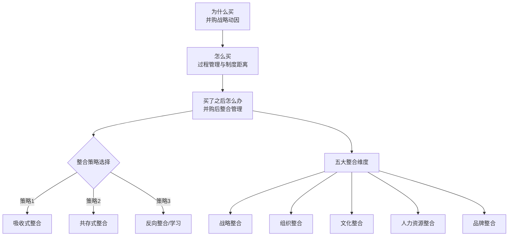
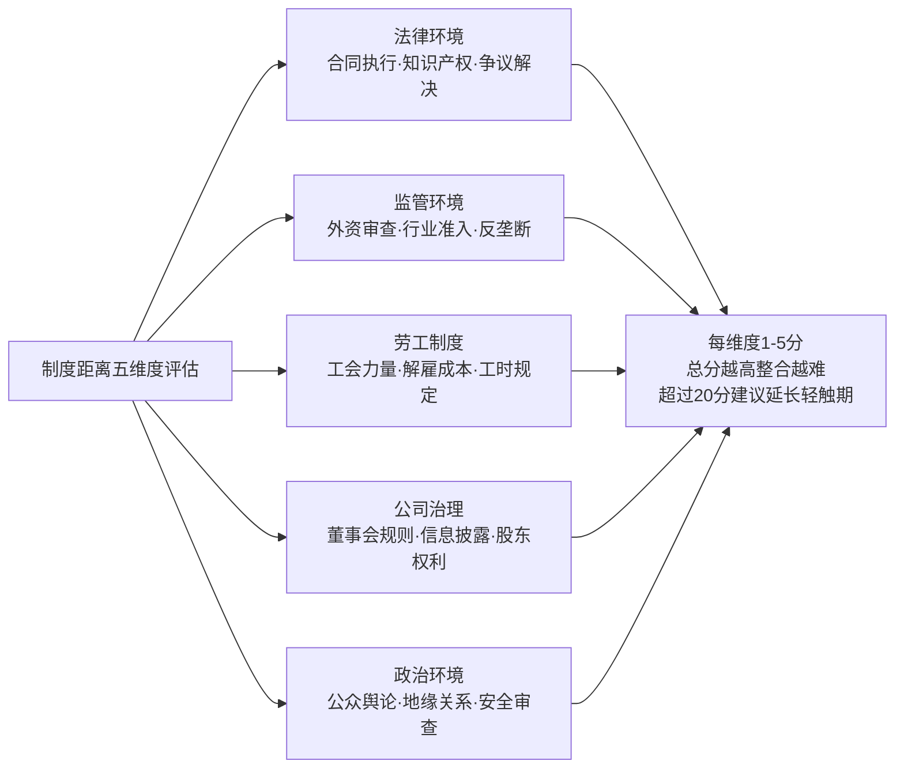

# 《全球化之路：中国企业跨国并购与整合》深度读书笔记

> [!abstract]
> 这本书是陈威如和黄嫚丽基于多年对中国企业跨国并购的跟踪研究写成的。它不是一本教你"怎么做交易"的并购操作手册，而是追问一个更根本的问题：中国企业走出去之后，为什么有的活了，有的死了？作者通过联想收购IBM PC业务、吉利收购沃尔沃、TCL收购汤姆逊等多个真实案例，提炼出一套关于跨国并购==从动因到整合==的系统框架。书中最有价值的部分不是并购前的尽职调查或估值技巧，而是并购之后那场更艰难的战役——文化整合、组织重构、品牌协同——这恰恰是大多数中国企业折戟沉沙的地方。

## 核心命题

中国企业的全球化不是一个"要不要"的问题，而是一个"怎么做才能活下来"的问题。陈威如在这本书中提出的核心命题可以归结为一句话：==跨国并购的成败不取决于你能不能买到好资产，而取决于你买到之后能不能让它跑起来==。

这个主张看起来朴素，但它挑战了当时中国商业界一个流行的思维惯性——"买买买"的全球化冲动。2000年代中期到2010年代，中国企业掀起了一波海外并购浪潮。很多企业家相信，只要买到了国外的品牌、技术、渠道，就能一步跨入全球竞争的前排。但陈威如通过大量案例告诉你，这种想法太天真了。并购只是故事的开头，整合才是真正的考试。而在这场考试中，中国企业面临的挑战比西方企业更大——因为你不仅要应对并购整合的一般性难题，还要跨越巨大的制度距离、文化距离和能力距离。

> [!tip]
> 书中一个关键洞察是：并购的成功率在全球范围内本来就不高（大约只有30%-40%的并购真正创造了价值），而中国企业的跨国并购成功率可能更低，因为叠加了"新兴市场企业"和"跨国经营"的双重困难。

陈威如不是要劝退中国企业，而是要帮你打一场有准备的仗。他反复强调一个观点：在全球化竞争中，中国企业不做跨国并购可能会错失战略机遇，但做了却不懂整合，付出的代价可能更大。关键是在出手之前想清楚——你为什么要买？你有能力整合吗？你有没有足够的耐心走完从"买到"到"用好"的漫长旅程？

## 框架全景

陈威如构建了一个==从并购动因到整合结果==的完整分析框架，可以理解为三个递进的层次。

第一层是**为什么买**——并购的战略动因。作者梳理了中国企业跨国并购的几大驱动力：获取战略资源（技术、品牌、渠道）、实现市场多元化、绕过贸易壁垒、获取管理知识和人才。不同的动因决定了你应该买什么样的标的，以及买完之后应该怎么整合。如果你是为了技术而买，那么技术团队的稳定就是生死线；如果你是为了品牌而买，那品牌定位的协调就是重中之重。很多并购失败，问题就出在最开始——动因不清晰，或者动因和标的不匹配。

> [!warning]
> 陈威如特别指出一个常见误区：很多中国企业在解释并购动因时，会列出一长串理由——既想要技术，又想要品牌，还想要市场和人才。看起来很全面，实际上很危险。每种动因对应不同的整合优先级，如果什么都想要，就意味着什么都无法聚焦。真正成功的并购通常有一个明确的主导动因，其他收益是附带的。

第二层是**怎么买**——并购的过程管理。包括标的筛选、尽职调查、估值谈判、交易结构设计。这部分作者提供了实操层面的框架，但更强调一个容易被忽视的维度：==制度距离==（institutional distance）。中国企业在海外并购中面临的监管审批、政治敏感性、公众舆论压力，往往比交易本身更复杂。

> [!warning]
> 作者特别指出，中国企业的"国有背景"在海外并购中是一把双刃剑——国内融资便利，但在海外审批中会遭遇更大的政治阻力。中海油竞购优尼科的失败就是典型案例。此外，中国企业往往在出价上过于激进——因为战略压力大、竞争者多，容易陷入"赢者诅咒"——赢了竞标但付出了过高的价格。

第三层是**买了之后怎么办**——并购后的整合管理。这是全书的重心。陈威如把整合分为几个关键维度：战略整合（两个业务怎么协同）、组织整合（谁向谁汇报、权力怎么分配）、文化整合（两种企业文化怎么融合）、人力资源整合（关键人才怎么留住）、品牌整合（品牌定位怎么协调）。每个维度都有对应的整合策略选择——吸收式、共存式、反向整合式。

> [!note] 三层递进逻辑
> 并购动因决定标的选择；标的特征和制度环境决定交易难度；并购动因加上双方的相对能力，决定整合策略。如果你在第一层就想错了，后面再怎么努力整合也挽救不了。

## 核心观点深度解读

### 一、"轻触式整合"的智慧与风险

> [!tip]
> 联想收购IBM PC业务和吉利收购沃尔沃，是书中反复出现的两个标杆案例。它们有一个共同点：在并购初期都选择了"轻触式整合"（light-touch integration）策略。

所谓轻触式整合，就是买了之后不急着大刀阔斧地改革，而是保持被并购企业的独立运营，让原有管理团队继续掌舵，中方更多扮演"财务投资者"的角色。联想收购IBM PC后，保留了IBM的管理团队和运营体系，甚至把总部搬到了纽约。吉利收购沃尔沃后，明确承诺沃尔沃的独立运营地位，不干预其产品开发和品牌定位，放话说"吉利是吉利，沃尔沃是沃尔沃"。

这种策略的逻辑在于：中国企业在国际化管理能力上和被并购的跨国公司有差距。如果你买了一家比你强的公司，然后急着用你的方式去改造它，反而会破坏它原有的价值。不如先学习，再整合。

> [!warning]
> 但陈威如也指出了轻触式整合的风险：如果"轻触"变成了"不触"，两个公司各自为政，那并购的协同效应就永远无法实现。你花了大价钱买了一家公司，结果只是当了一个安静的股东，那和直接做财务投资有什么区别？真正的挑战是在"保持稳定"和"推进整合"之间找到节奏。

陈威如提供了从轻触转向深入整合的三个判断标准：对被并购方业务逻辑有了足够理解、双方建立了基本信任关系、识别出了具体的协同机会并有能力执行。三个条件同时满足时，就是推进下一步的时机。

联想的轻触式整合大约持续了两到三年，之后进入"混合式管理"阶段——中方高管开始深入参与运营决策，供应链和采购开始整合以实现规模效应。吉利的轻触期更长也更彻底，沃尔沃几乎完全按自己的节奏运营，直到吉利逐步建立了自己的能力基础后，双方的技术合作才真正起步。

### 二、制度距离：被低估的隐形壁垒

在传统的并购理论中，文化差异被认为是整合的最大障碍。陈威如没有否认这一点，但他引入了一个更有解释力的概念——==制度距离==。制度距离不仅包括文化差异，还包括两个国家在法律制度、监管体系、商业惯例、劳工保护、公司治理等方面的差异。

> [!example]
> 书中举了一个很说明问题的例子：一家中国企业收购了德国的制造公司后，想按照中国的方式加班赶工。但在德国，劳工法规定了严格的工时限制，工会有强大的谈判权。你不能简单地把中国的管理节奏搬到德国。这不是文化差异的问题，这是制度差异的问题——同样的事情在中国是正常的管理行为，在德国可能违法。

制度距离的影响不仅体现在并购后的整合阶段，也体现在交易本身的推进过程中。中海油竞购优尼科的失败就是典型——出价比竞争对手雪佛龙高出约10亿美元，但交易败在了美国国会的政治审查上。华为在美国的一系列收购尝试——2008年竞购3Com、2010年竞购2Wire、2012年收购3Leaf Systems——每一次都因安全审查而受阻。这些案例说明，制度距离不只是整合时需要应对的管理挑战，它可以在交易还没完成时就杀死一笔并购。

制度距离还有动态维度。在中国企业海外并购的早期阶段（2000年代），很多国家对中国投资持欢迎态度。但随着中国经济实力增长和国际关系变化，美国的外国投资委员会（CFIUS）从低调的审查机构变成了中国企业海外并购的最大障碍之一。

制度距离越大，并购整合的难度就越高。这也解释了为什么中国企业在发展中国家的并购（比如在东南亚、非洲）往往比在发达国家的并购更容易整合——不是因为这些地方更好管理，而是因为制度距离更小。

### 三、反向学习：后来者的特殊路径

> [!tip]
> 这是书中最有原创性的观点之一。陈威如提出，中国企业的跨国并购和传统的西方跨国公司并购有一个根本区别：西方跨国公司并购通常是强者买弱者，把自己的管理体系输出到被并购企业；而中国企业的跨国并购往往是==弱者买强者==——买的是比自己管理能力更强、技术更先进的公司。

这种"弱买强"的格局在全球商业史上相当独特。日本和韩国企业的早期国际化也有类似特征，但程度没有中国企业这么极端。中国企业在很多情况下是"拿着钱但缺乏能力"——你有资金优势（得益于中国经济高速增长和人民币升值），但在国际化管理、技术深度、品牌运营上和被并购方存在明显差距。

这种格局意味着，中国企业不能照搬西方的并购整合教科书。你不能居高临下地输出管理模式，因为你的管理模式可能还不如对方。你需要做的是**反向学习**——通过并购来获取管理能力、技术知识和国际化经验。

联想就是一个典型的反向学习者。收购IBM PC后，联想从IBM的管理体系中学到了全球化运营的标准流程、绩效管理体系、客户关系管理方法。杨元庆自己也从中国式的管理者逐渐转型为国际化的CEO，把工作语言从中文切换到英文，把管理风格从命令式调整为协商式。

吉利也是如此。收购沃尔沃后，CMA架构成为吉利-沃尔沃技术合作的产物，领克品牌就是在CMA平台上诞生的，代表了吉利从低端自主品牌向中端品牌跃迁的关键一步。万向集团则通过多次小规模收购，逐步积累对美国制造业管理和市场运营的理解——一种更稳妥的"渐进式并购学习"路径。

> [!warning]
> 但反向学习也有陷阱。如果你一直处于"学习者"的位置，不敢对被并购方提出要求或推动变革，那你就永远无法真正整合。从"我向你学"到"我们一起干"的身份转换，是反向学习模式中最微妙也最关键的一步。

陈威如还观察到，反向学习有一个有趣的副作用——它改变了并购方自身的组织文化和管理风格。联想从一家典型的中国科技企业变成了全球化运营的跨国公司，吉利从低端车企变成了拥有多品牌矩阵的国际汽车集团。并购不仅改变了资产组合，也改变了企业的DNA。

### 四、品牌整合的两难困境

当你收购一个国际品牌时，你面临一个微妙的两难：如果把被收购品牌和中国母品牌紧密捆绑，可能损害被收购品牌在发达市场的高端形象；如果完全保持品牌独立，又无法实现品牌协同和背书效应。

> [!example]
> 吉利收购沃尔沃后，让沃尔沃品牌完全独立运营，不在沃尔沃车上贴任何吉利的标签。同时，吉利通过沃尔沃的技术反哺来提升自己的产品力，在中国市场做一个"沃尔沃技术加持的吉利"。这是一种"双品牌独立运营+技术协同"的策略。后来领克品牌的推出更是这种策略的精妙延伸——定位在吉利和沃尔沃之间的市场空白地带。

但TCL收购汤姆逊的电视业务就是反面案例。TCL急于推进品牌整合，但低估了三个关键变量：欧洲市场的技术转型速度（CRT向平板电视的转型让汤姆逊的产线变成不良资产）、管理混乱（语言障碍、决策流程不匹配、中方管理团队缺乏国际经验）、以及整合的财务成本远超预算。最终TCL不仅没有实现协同，反而陷入巨额亏损。

联想则走了中间路线——获得IBM品牌五年授权期，逐步从双品牌过渡到Lenovo单一品牌，给市场和客户足够的适应时间。太快会吓跑客户，太慢会浪费品牌授权费和错过建立新品牌认知的时机。

陈威如从这些案例中提炼出一个框架：品牌整合策略的选择取决于两个维度——==品牌价值差异==（被收购品牌是否明显优于母品牌）和==市场协同潜力==（两个品牌的目标市场是否有重叠和互补）。品牌价值差异越大，越应保持独立运营；市场越有互补性，越可以尝试深层协同。

### 五、文化整合不是"求同"，而是"管理差异"

很多管理书籍在讨论并购整合时会说"要融合两种文化"。陈威如的观点更务实：==文化整合的目标不是消除差异，而是建立一套管理差异的机制==。

> [!note]
> 中国企业和西方企业在管理文化上有几个系统性差异：决策方式（中国企业更集权，西方企业更分权）、沟通风格（中国企业更含蓄，西方企业更直接）、对"关系"的理解（中国企业更重视人际关系网络，讲"面子"和"人情"，西方企业更重视制度和流程）、时间观念（中国企业更灵活，西方企业更强调计划性和承诺）。

这些差异不会因为一两次团建或文化培训就消失。强行推行一种文化只会让另一方产生抵触。陈威如建议采取"文化桥梁"策略——找到两种文化的交叉点和共同利益，建立跨文化的沟通机制和冲突解决机制。联想的做法就很有参考价值：在公司内部推行英语作为工作语言（建立公平的沟通基础——如果开会用中文，外方高管会觉得被排除在决策之外），建立跨国界的高管团队，定期进行跨文化的管理工作坊（不是讲课，而是让两边的人一起解决实际问题），以及设置"文化联络员"角色专门负责识别和协调跨文化的冲突和误解。

陈威如还提到一个容易被忽视的文化冲突来源：**"胜利者"与"失败者"的心态**。被并购方的员工天然有一种"被征服"的屈辱感，尤其当并购方来自一个在他们看来"不那么先进"的国家时。并购方如果表现出居高临下的姿态会加剧抵触，相反，足够的尊重和学习态度能化解很多潜在冲突。

此外，组织文化差异（创业型vs官僚型）也是需要在尽职调查阶段就纳入评估的维度。陈威如建议增加"文化尽职调查"环节——不仅看财务数据和法律文件，还要通过访谈和观察了解对方的组织文化特征。

### 六、人才保留是整合的生命线

> [!warning]
> 并购中最脆弱的资产不是工厂和设备，而是人。特别是在技术驱动和品牌驱动的并购中，如果核心技术人员和管理团队在并购后流失，那你买到的就只是一个空壳。

陈威如在书中详细分析了人才流失的规律：并购后的前6-12个月是人才流失的高风险期。而且走的往往是最优秀的那批人——他们在市场上最抢手。这就形成了恶性循环——最好的人先走，中等的人看到最好的人走了也开始焦虑，团队士气螺旋式下降。在中国企业收购西方公司的场景中，这个问题更加尖锐——被收购方的员工可能对新东家的管理能力缺乏信心。

作者建议，在交易完成后的前100天内，并购方需要做三件事：第一，尽快明确组织架构和汇报关系，减少不确定性——不确定性是焦虑的最大来源，而焦虑是离职的最大推手；第二，识别并锁定关键人才，通过留任奖金和职业发展承诺来稳定军心——"关键人才"不仅是高管，还包括掌握核心技术或关键客户关系的中层骨干；第三，建立频繁的沟通机制——哪怕暂时没有确定答案，"我们正在考虑"也比沉默好一万倍，因为沉默会被解读为"他们不在乎我们"。

联想在收购IBM PC后，不仅保留了大部分核心团队，还从外部引入国际化高管人才。但代价是薪酬需要向IBM标准看齐，导致中国员工和原IBM员工之间出现了明显的薪酬差距。同时应建立"人才预警机制"——HR每两周评估关键人才状态，发现异常信号（频繁更新LinkedIn简历、请假增多、会议上变得沉默）立即由高层介入。

### 七、整合节奏的动态管理

整合的节奏取决于多个变量：并购动因的紧迫程度、制度距离的大小、双方能力差距、被并购方的配合程度、外部市场环境的变化。

> [!example]
> TCL收购汤姆逊的失败，很大程度上是整合节奏失当的结果——急于推进深度整合但低估了整合复杂性（CRT向平板的技术转型同时发生），也高估了自己的整合能力。相比之下，联想和吉利选择了"分阶段递进式整合"——先轻触、再学习、再逐步深入——牺牲了一些短期协同效率，但换来了更高的整合成功率。

> [!note] 速度与审慎的平衡
> 陈威如区分了两类整合动作：=="维稳"类动作==（明确组织架构、锁定核心人才、建立沟通机制）越快越好，需要在并购完成后第一个月内完成；=="变革"类动作==（统一管理流程、整合供应链、调整品牌策略）应循序渐进。对于"弱者买强者"的中国企业，审慎的节奏通常是更优的选择——因为你还在学习阶段，贸然加速只会增加犯错的概率。

## 这本书的保质期

这本书写于中国企业跨国并购的"高峰期"。书中的核心案例——联想收购IBM PC（2005年）、TCL收购汤姆逊（2004年）、吉利收购沃尔沃（2010年）——距今已经过去了十多年。那么，书中的框架和洞察在今天还适用吗？

> [!tip]
> **跨时代的部分**：关于整合策略的选择（轻触式vs吸收式vs反向整合）、制度距离的分析框架、文化整合的方法论、人才保留的策略——这些底层逻辑不会过时，因为它们触及的是组织管理和跨文化协作的普遍规律。

> [!warning]
> **需要更新的部分**：
> - 书中对"中国企业是弱者买强者"的定位在今天需要打折扣——华为、字节跳动、比亚迪、宁德时代等已是各自领域的全球领先者，它们的全球化路径（有机增长为主、并购为辅）和书中讨论的模式有很大不同
> - 2018年以后全球政治经济格局剧变——中美贸易摩擦、外国投资安全审查趋严、技术脱钩风险上升——使得制度距离比书中描述的更大、更复杂，并且有强烈的"政治化"维度
> - 数字化时代的跨国并购涉及数据、算法、平台等数字资产，整合逻辑与传统制造业或品牌并购有本质差异，涉及数据合规（GDPR等）、技术架构兼容性、用户生态迁移等新挑战
> - ESG因素在跨国并购中角色越来越重要，但在书中尚未涉及

尽管如此，这本书建立的分析框架足够扎实，足以作为思考当代并购问题的出发点——只是你需要在这个框架上叠加新的变量。

## 行动工具箱

**工具一：并购动因-整合策略匹配矩阵**。在考虑跨国并购之前，先明确你的核心动因：是为了技术？品牌？市场？人才？不同的动因对应不同的整合优先级。技术驱动的并购，整合的第一优先级是技术团队的稳定和知识转移；品牌驱动的并购，第一优先级是品牌定位的协调和客户关系的延续。你可以画一个简单的二维表格：横轴是并购动因，纵轴是整合维度（战略、组织、文化、人才、品牌），逐一评估每个交叉点的优先级。

**工具二：100天整合路线图**。并购交易关闭后的前100天是成败关键期。第一个月（稳定期）：宣布组织架构和关键人事安排，锁定核心人才（至少和前20名关键人才完成一对一沟通），建立整合管理办公室（IMO），明确整合优先事项。第二个月（启动期）：启动优先级最高的整合项目，建立跨团队沟通机制和定期会议节奏，开始进行文化诊断。第三个月（调整期）：评估整合进展，处理早期问题，根据实际情况调整整合节奏，形成整合进度报告。

**工具三：制度距离快速评估**。从五个维度评估目标国的制度距离——法律环境（合同执行力、知识产权保护、争议解决机制）、监管环境（外资审查、行业准入限制、反垄断规定）、劳工制度（工会力量、解雇成本、工时规定、集体谈判传统）、公司治理（董事会规则、信息披露要求、股东权利保护）、政治环境（对中国投资的态度、地缘政治风险、国家安全审查可能性）。每个维度用1-5分评估距离程度，总分越高整合难度越大。得分超过20分的目标国，强烈建议延长轻触式整合阶段。

**工具四：关键人才保留检查清单**。并购交易签约后，立即识别被并购方的前20%关键人才（不仅是高管，还有核心技术骨干、关键客户关系经理），评估每个人的流失风险（基于市场竞争力、对并购态度、个人职业期望），制定个性化的留任方案（留任奖金、股权激励、职业发展路径、角色升级）。在交易关闭后一周内，由并购方最高领导亲自和Top 10关键人才进行一对一沟通。建立人才预警机制——HR每两周评估一次关键人才状态，发现异常信号立即由高层介入。

## 延伸阅读

- [[《门口的野蛮人》]]：杠杆收购时代的经典案例，侧重金融操作，能让你理解并购背后的资本逻辑和利益博弈
- [[《竞争战略》]]：迈克尔·波特的经典之作，理解竞争战略是理解并购动因的基础——先搞清楚自己的竞争定位，才能判断并购是不是正确的战略选择
- [[《大败局》]]：吴晓波记录的中国企业失败案例，其中有企业国际化失败的反面教材，值得警醒
