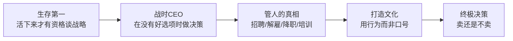

# 《创业维艰》深度读书笔记

> [!abstract] 全书速览
> 绝大多数创业书籍告诉你如何做正确的事，这本书告诉你当所有选项都是错误的时候该怎么办。本·霍洛维茨从Loudcloud/Opsware的亲身经历出发，把创业过程中最痛苦的决策时刻——==裁员、降职朋友、与巨头搏斗、在濒死边缘挣扎、最终卖掉公司==——逐一拆开给你看。这不是一本战略理论书，而是一本战场急救手册。霍洛维茨的核心信念是：创业没有秘诀，唯一可以教的是如何在没有答案的时候继续往前走。他把CEO的工作定义为==在不确定性中做出决策并承担后果==，然后用一个又一个真实案例告诉你，这件事到底有多难，以及他是怎么活下来的。

## 核心命题

霍洛维茨在这本书里要回答的核心问题是：==当创业公司遇到那些没有好选择的时刻，CEO应该怎么做？==

几乎所有管理学教材和商业畅销书都聚焦在如何制定战略、如何打造文化、如何招募人才——这些是"和平时期"的技能。但霍洛维茨说，创业公司的大部分时间其实都处在"战时状态"：现金快烧完了、核心员工要离职、产品方向可能是错的、竞争对手正在吞食你的市场。在这些时刻，教科书上的建议全部失效。

> [!tip] 核心主张
> 创业最难的部分不是拥有伟大的愿景，而是在愿景即将破碎的时刻坚持活下去。没有任何公式能告诉你该怎么做，但你可以从别人的挣扎中学到一件事：==你不是唯一一个觉得快要撑不下去的人==。

这个命题的独特价值在于它的诚实。[[《从0到1》]]告诉你如何发现垄断机会，[[《精益创业》]]教你如何验证产品假设，但它们都回避了一个问题：当一切都不管用的时候怎么办？霍洛维茨不回避。他坦言自己在Loudcloud时期几乎每天都想辞职，坦言他做过很多后来证明是错误的决定，坦言他在裁员的那天晚上根本无法入睡。这种赤裸裸的真实，反而比任何方法论都更有指导意义。

## 框架全景

霍洛维茨的框架不是理论推演出来的，而是从他在Loudcloud/Opsware的十年经历中生长出来的。第一层是**生存**——公司快死了怎么办。互联网泡沫破裂后，Loudcloud的客户大面积倒闭，公司现金几乎耗尽，霍洛维茨在这个阶段经历了IPO、大规模裁员、业务出售、艰难转型，每一步都踩在悬崖边上。第二层是**战时决策**——没有好选择时如何选择。裁员要不要亲自告诉每一个人？朋友表现不行要不要降职？竞争对手挖走了核心团队怎么办？第三层是**管人的真相**——招人、培训人、解雇人，这些事在现实中远比管理教材描述的复杂和痛苦。第四层是**企业文化**——不是挂在墙上的标语，而是在压力之下人们实际做出的选择。第五层是**终极选择**——什么时候应该卖掉公司，什么时候应该坚持。这五层合在一起，构成了一部创业CEO的实战生存手册。

## 核心观点深度解读

### 创业是一场挣扎，不是一次冒险

> [!example] 案例：Loudcloud的濒死体验
> 2001年互联网泡沫破裂，Loudcloud最大的客户之一、电商公司eToys在一夜之间破产。紧接着更多客户倒下。公司的现金按当时的消耗速度只够撑几个星期。霍洛维茨必须在极短时间内完成IPO——不是因为时机好，而是因为==这是唯一的活路==。他在路演期间的最大恐惧不是定价低，而是公司能不能撑到上市那一天。

霍洛维茨把创业比作"挣扎"（The Struggle），这个词贯穿全书。挣扎是你晚上3点醒来，满身冷汗，脑子里全是公司的问题。挣扎是你不得不解雇那些信任你、追随你的人。挣扎是你在所有人面前表现得信心十足，但内心知道公司可能撑不过这个季度。

这个观点的价值不在于提供解决方案——因为确实没有通用的解决方案——而在于让你知道，这种痛苦是正常的。几乎每一个成功的创业者都经历过类似的至暗时刻。霍洛维茨在Loudcloud最艰难的时候，曾认真考虑过辞去CEO职务。他没有辞，不是因为他找到了答案，而是因为他意识到==辞职只会把问题推给一个对公司了解更少的人==。

他给出的唯一"建议"是：不要把统计概率放在心上。当别人告诉你90%的创业公司会失败时，这个数字对你没有任何意义——你只需要关心自己这一家。把注意力从"我成功的概率有多大"转移到"下一步我能做什么"上。

### 和平时期CEO与战时CEO

> [!note] 两种CEO的本质差异
> 和平时期CEO——追求长期愿景，授权团队探索，鼓励创新试错，关注文化建设。代表人物是Google时代的埃里克·施密特。
> 战时CEO——集中决策权，限制讨论范围，要求严格执行，容忍某些短期的文化妥协。代表人物是在英特尔转型危机中的安迪·格鲁夫。

这是霍洛维茨最有影响力的概念之一。他认为绝大多数管理学著作和商学院课程教的都是和平时期的管理——如何激发创造力、如何建设开放文化、如何进行民主式决策。但当公司面临生存威胁时，这些做法全部需要反转。

战时CEO的特征是：不再寻求共识，而是==快速做出决定并要求执行==。和平时期你可以花三个月讨论产品方向，战时你可能只有三天。和平时期你鼓励团队质疑上级决策，战时你需要整个组织像一台精密机器一样运转。

霍洛维茨以安迪·格鲁夫为榜样。1985年英特尔面临日本存储芯片厂商的毁灭性竞争，格鲁夫问戈登·摩尔："如果董事会把我们赶走，新CEO会怎么做？"摩尔说："他会退出存储芯片业务。"格鲁夫说："那我们为什么不自己做这件事？"这个对话直接导致英特尔放弃了自己的核心业务（存储芯片），转向微处理器——一个当时看来风险巨大的决定，但事后证明拯救了公司。

需要警惕的是，这个框架容易被滥用。一些CEO把"战时模式"当作独断专行的借口，把正常的业务挑战包装成生存危机来压制不同声音。霍洛维茨自己也承认，判断公司是处于和平时期还是战争时期，本身就是CEO最难做的判断之一。

### 裁员的正确方式

> [!example] 案例：三次裁员
> 霍洛维茨在Loudcloud/Opsware期间经历了三次大规模裁员。第一次裁了约400人（当时全公司约600人），几乎砍掉了三分之二的员工。他从中总结出的最重要的教训不是"如何让裁员不那么痛苦"——因为这不可能——而是==如何让被裁的人保留尊严，让留下的人继续信任公司==。

霍洛维茨给出了一套具体的裁员操作流程，这是全书最实用的部分之一。

第一步：==不要拖延==。一旦决定裁员，必须尽快执行。霍洛维茨见过太多CEO因为不忍心而把裁员拖上几个月，结果消息泄露，公司上下人心惶惶，该走的人没走，不该走的人先跑了。拖延对任何人都没有好处。

第二步：==CEO必须亲自解释原因==。不能把这件事推给HR或者中层管理者。是你做了导致公司需要裁员的决策——不管是招人太激进、市场判断错误还是产品方向失误——你必须站出来承认这一点。霍洛维茨特别强调，裁员的原因是公司的失败，不是被裁员工的失败，CEO必须清楚地传达这个信息。

第三步：==培训管理者==。直属经理应该是通知被裁员工的人，而不是HR。但这意味着你必须在宣布裁员之前培训所有相关管理者，让他们知道该怎么说、不该怎么说、如何处理情绪反应。这个环节经常被忽略，结果是管理者自己也手足无措，让被裁的人更加愤怒和受伤。

第四步：==不要试图美化==。不要说"这对你也是好事""你会找到更好的机会"这类话。被裁的人不需要安慰，他们需要的是==尊重==——明确的离职方案、合理的遣散补偿、帮助他们找下一份工作的具体支持。

### 降职朋友、解雇高管

> [!warning] 最痛苦的决定
> 你最早期的创业伙伴——那个在车库里和你一起熬夜写代码的人——随着公司发展到200人、500人，他的能力可能跟不上了。你面前的选择是：让他继续担任一个他胜任不了的职位（对公司有害），还是降职或解雇他（对友谊可能是致命的打击）。

霍洛维茨说，这是CEO最孤独的时刻。你不能和董事会讨论（他们会直接说"换掉他"），不能和其他高管讨论（消息会泄露），不能和这个人的下属讨论（那会在他被降职之前就摧毁他的权威）。你只能一个人做出决定。

他的处理原则是：==从公司的需要出发，但用人的方式去执行==。具体而言，先确认这个人确实不适合当前的职位——不是因为你对他有偏见，不是因为别人的投诉，而是基于你对这个职位需要什么能力的客观判断。然后亲自告诉他，不要让他从别人嘴里听到。解释清楚公司需要什么样的人在这个位置上，以及他在公司里还有没有其他合适的角色。

霍洛维茨坦言，在他自己的经历中，这类对话很少有好结果。大多数被降职的高管最终还是会离开。但他认为，==做这件事的方式比结果更重要==——如果你处理得尊重、透明、迅速，即使对方离开了，其他员工看到的是一个公正的领导者；如果你拖延、回避、让当事人最后一个知道，你损害的不仅是那段关系，还有整个组织对你的信任。

### 关于企业文化的真相

> [!example] 案例：安德森·霍洛维茨基金的文化设计
> 霍洛维茨在创办a16z风投基金时，设定了一条简单但严格的规则：==合伙人如果对创业者不尊重，将被解雇==。这不是因为他们特别善良，而是因为他们的商业模式依赖于创业者的信任——如果创业者觉得在和你打交道时被居高临下地对待，他们下次融资时不会再来找你。这条规则不是写在墙上的价值观，而是一个有具体后果的行为准则。

霍洛维茨对"企业文化"的看法非常务实。他不相信那些写在PPT里的使命宣言和价值观——他认为文化是==人们在没有人看着的时候如何行事==。而塑造这种行为的不是宣言，而是具体的规则和制度。

他举了一个独特的例子：武士道。日本武士的文化不是靠几句口号建立的，而是靠一整套具体的行为规范——从如何持刀到如何面对死亡。每一条规则背后都有实际的原因。同样，公司文化的建立也应该从具体的行为规则开始，每条规则都要回答一个实际问题。

比如，霍洛维茨在Opsware有一条规则：==任何经理如果不定期与直接下属进行一对一沟通，将被视为管理失职==。这条规则背后的逻辑是：如果经理不知道下属在想什么、遇到什么问题，他实际上没有在管理——他只是在监督。一对一不是可有可无的"nice to have"，而是管理工作的核心。

文化还体现在你如何处理违规行为。如果有人违反了公司明确的准则但业绩很好，你怎么做？霍洛维茨的答案是：==必须处理==。因为如果你对明星员工的违规行为视而不见，其他所有人都会收到一个清晰的信号——"规则不是真的，业绩才是"。文化在那一刻就开始腐蚀了。

### 创始人CEO vs 职业经理人

霍洛维茨花了相当篇幅讨论一个长期争论：创业公司成长到一定阶段后，是应该让创始人继续做CEO，还是请一位经验丰富的职业经理人来接管？

传统的硅谷共识——也是大多数风投的偏好——是后者。逻辑很直观：创始人有愿景但缺乏大规模管理经验，职业经理人可能缺乏愿景但擅长运营复杂组织。

> [!tip] 霍洛维茨的立场
> 他明确站在创始人一边。他的论据不是感性的，而是基于对科技公司特殊性的判断：科技公司最重要的能力是==持续创新==，而职业经理人的核心技能是优化已有业务。当市场环境发生剧烈变化时——科技行业几乎总是如此——创始人的直觉和对产品的深度理解，是职业经理人很难复制的。

霍洛维茨引用了大量案例来支撑这个观点。乔布斯被赶出苹果后，苹果在职业经理人（斯卡利、阿梅里奥等人）手下持续衰落，直到乔布斯回归才重新崛起。Twitter在创始人和职业经理人之间反复交接，战略方向摇摆不定。相比之下，扎克伯格、贝佐斯、马斯克这些创始人CEO带领各自公司穿越了多个周期。

但这个观点也有明显的幸存者偏差。我们看到的是创始人CEO成功的案例，看不到那些创始人坚持不放手导致公司走向失败的案例——后者可能数量更多，只是没人写书讲述。霍洛维茨自己后来在a16z的投资实践中也并非一律支持创始人做CEO，而是根据具体情况判断。

### 如何做决策：没有好选择时怎么选

> [!example] 案例：出售Opsware
> 2007年，惠普出价约16亿美元收购Opsware。霍洛维茨面对一个极其复杂的选择：卖掉公司意味着创业故事结束，所有员工的命运将由一家大公司决定；不卖则意味着继续在一个竞争加剧的市场中独立战斗，而且可能永远不会再有这么好的出价。他最终选择了出售——这个决定让投资人和员工获得了丰厚回报，但霍洛维茨坦言，这并不是一个让他感到高兴的决定。

全书最深层的主题是：CEO的工作本质上是==在信息不完整的情况下做出不可逆的决策==。

霍洛维茨提出了一个重要的区分。有些决策是可以收集更多信息后再做的——这种情况下应该等待。但另一些决策有明确的时间窗口——晚做的代价比做错的代价更大。CEO的关键能力不是"总是做出正确的决定"（这不可能），而是==分辨哪些决定需要立即做、哪些可以等一等==。

他还有一个深刻的洞察：==大多数人在恐惧中会夸大最坏情况的可能性==。当你面对一个艰难决定时，你的大脑会自动放大所有可能出错的地方。霍洛维茨建议强迫自己写下最坏情况实际发生的概率，以及如果发生了你能采取什么补救措施。他发现绝大多数"不可承受的后果"，在冷静分析后要么发生的概率很低，要么有应对方案。

他用一个类比来总结CEO的心态：==要像看别人的问题一样看自己的问题==。当朋友向你描述他公司遇到的危机时，你通常能冷静分析、给出建议。但当同样的事情发生在你自己身上时，你就被恐惧和焦虑淹没了。好的CEO需要训练自己在面对自己的问题时，保持面对别人问题时的那种清醒。

## 这本书的保质期

**经受住检验的部分。** "和平时期CEO vs 战时CEO"的概念已经成为硅谷的通用语言。霍洛维茨关于裁员、降职、企业文化建设的实操建议至今是创业者最频繁引用的参考。创始人CEO的价值被后续十年的科技行业发展反复验证——那些由创始人持续领导的公司，在面对重大转型（比如移动互联网、云计算、AI浪潮）时的表现，整体上优于由职业经理人掌舵的公司。

**需要修正的部分。** 霍洛维茨的经验主要来自2000年代初期的企业软件行业，那个时代的融资环境、竞争格局和技术栈与今天有显著差异。当时融资极其困难（泡沫刚破裂），今天的创业者面对的可能是资本过剩的环境。他对"战时CEO"模式的推崇在过去几年也受到了质疑——一些硅谷公司的CEO以"战时模式"为名进行过于激进的决策，对员工造成了不必要的伤害。此外，霍洛维茨的视角几乎完全是CEO视角，对董事会、投资人、员工等其他利益相关方的讨论相对有限。

> [!warning] 幸存者偏差
> 霍洛维茨活下来了，Opsware以16亿美元被收购，他后来创办了硅谷最成功的风投基金之一。但在同一时期，有无数和Loudcloud处境相似的公司做了类似的决策却最终倒闭了。霍洛维茨的建议来自他的生存经验，但"他活下来了"这件事本身可能有相当大的运气成分——这一点他自己在书中也有暗示。

## 行动工具箱

**"挣扎"清单。** 当你作为创业者陷入至暗时刻时，做三件事：一、不要独自承受，找一个你信任的人倾诉（不是为了获取建议，而是为了减轻精神压力）；二、把恐惧分解为具体的问题清单——"公司要死了"这个念头让人瘫痪，但"我们的现金还够用X个月、最大的客户风险是Y、竞争对手可能在Z方面超越我们"这些具体问题是可以逐一解决的；三、问自己"如果是别人遇到这个问题，我会怎么建议他"。

**裁员操作手册。** 一旦决定裁员，48小时内执行。先确定裁员比例（宁可多裁一些、一次完成，也不要分批裁——多次小规模裁员对士气的伤害远大于一次大规模裁员）。然后培训所有需要进行裁员谈话的管理者。CEO亲自向全公司解释原因。为被裁的人提供具体的支持：推荐信、职业介绍、合理的遣散方案。

**一对一制度。** 要求所有经理每两周与每位直接下属进行至少30分钟的一对一沟通。议程由下属设定，不是上级。这是发现问题的最早预警系统——等到问题在全公司会议上被提出时，通常已经太晚了。

**"和平/战时"诊断。** 定期问自己一个问题：公司现在面临的最大威胁是什么？如果这个威胁有可能在12个月内让公司倒闭或严重受损，你处于战时——需要集中决策、快速执行、减少不必要的探索。如果最大威胁是长期的、可控的，你处于和平时期——可以授权更多、鼓励更多探索。

**决策速度校准。** 面对每个重要决策，先判断它的时间敏感度。如果拖延的代价高于做错的代价，立即做出决定——即使信息不完整。如果有充足的时间收集更多信息，就不要仓促行事。大多数CEO的错误是在需要快速决策时犹豫不决，在可以深思熟虑时草率行事。

## 延伸阅读

[[《从0到1》]]是霍洛维茨的好友和合作伙伴彼得·蒂尔的著作，两本书形成互补：蒂尔讲的是如何发现伟大的创业机会，霍洛维茨讲的是发现机会之后如何在无数困难中活下来。

[[《精益创业》]]和本书有一个有趣的共鸣：莱斯的核心理念是快速试错和迭代，而霍洛维茨在Loudcloud从云服务提供商转型为企业软件公司（Opsware）的过程，本身就是一次巨大的"方向转换"（pivot）。两本书对照阅读，你会发现创业既需要坚持愿景的勇气，也需要承认错误并调整方向的智慧。

[[《创业者的窘境》]]从学术角度分析了创始人在公司成长过程中面临的典型困境——控制权稀释、角色转换、团队冲突——可以作为霍洛维茨经验叙事的理论注脚。
