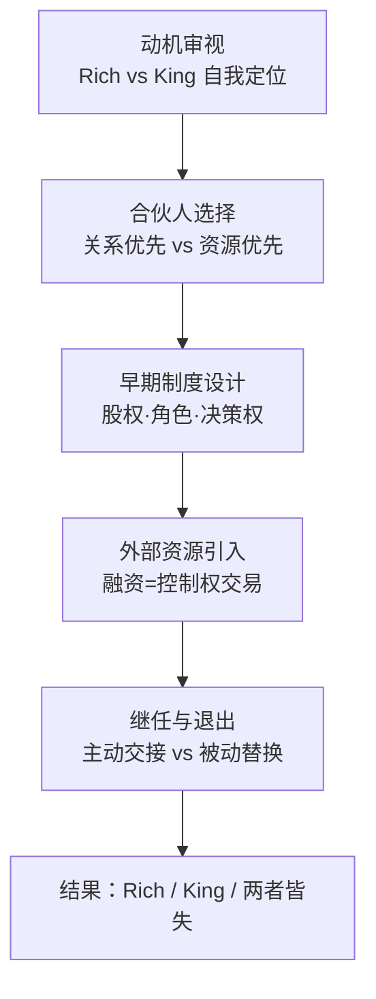

# 《创业者的窘境》深度读书笔记

> [!abstract] 全书速览
> 为什么那么多创业公司不是死于市场竞争、技术落后或资金断裂，而是死于创始团队自己人之间的撕裂？诺姆·沃瑟曼用近万名创始人的数据告诉你：创业者面临一个几乎无法回避的根本选择——你想当国王（保持控制），还是想变富（追求财务回报）？绝大多数人以为自己能两者兼得，但数据冷酷地表明，这两个目标在统计意义上是负相关的。从选择合伙人、分配股权，到引入投资、交出CEO权杖，创业之路上每一个关键节点都藏着一个两难困境。这本书不是教你怎么成功，而是教你在成功之路上不被自己绊倒。

## 核心命题

你大概听过无数种创业失败的原因——产品不好、市场太小、融资断裂、竞争激烈。但沃瑟曼的研究指向了一个被严重低估的方向：==创始人本身，才是公司最大的风险源==。

这个判断不是心灵鸡汤式的警示，而是基于真实数据的结论。沃瑟曼在哈佛商学院主导的CompStudy项目，跟踪了近一万名创始人和数千家初创公司，是迄今为止对创业者决策行为最大规模的系统性研究。他发现，超过一半的创业公司失败与创始团队内部冲突直接相关。不是外敌入侵，而是堡垒从内部崩塌。

这本书挑战的核心常识是什么？是"只要找到好市场、做出好产品，创业就能成功"这个信念。沃瑟曼说，不对，你还必须搞定一个更底层的问题：你自己到底想要什么？

> [!tip] 核心洞察
> 他提出了整本书的核心张力——==Rich vs King==。Rich指的是财务回报最大化，King指的是控制权最大化。大多数创始人下意识地觉得自己两个都要，但沃瑟曼的数据显示，这两者之间存在结构性矛盾。

公司要做大，就需要外部资源——钱、人才、专业管理能力。但每引入一份资源，你的控制权就被稀释一分。你越想把蛋糕做大，属于你的那一块占比就越小。你越想死守自己的那块蛋糕，蛋糕本身就越难变大。

这不是一个可以靠聪明或努力解决的问题，而是创业这种活动内嵌的结构性矛盾。沃瑟曼要你做的第一件事，就是在动手之前先面对这个矛盾，做出清醒的选择。

## 框架全景

沃瑟曼的分析框架沿着创业的时间线展开，从"起念"到"退出"，在每一个关键节点揭示隐藏的两难困境。这些困境不是孤立的，而是像多米诺骨牌一样环环相扣——早期的一个"无所谓"的决定，可能在两三年后变成一颗定时炸弹。

整个框架可以理解为一条五段式的决策链。

**第一段：动机审视。** 在你决定创业之前，先搞清楚驱动你的到底是什么。沃瑟曼把创业动机拆解为四个维度：财富、控制、自主和影响力。大多数人是这四种动机的混合体，但你必须排出优先级。因为后续每一个关键决策——选合伙人、分股权、要不要融资、要不要让出CEO——都取决于你在这四个维度上的排序。

**第二段：合伙人选择。** 和谁一起干？这是仅次于"干什么"的第二重要决策。沃瑟曼发现了一个令人不安的规律：创始人在选合伙人时存在严重的"亲缘偏好"——倾向于找朋友、家人、前同事。这种选择带来了短期的舒适感和信任基础，但同时埋下了技能同质化、角色模糊、冲突回避等长期隐患。

**第三段：早期制度设计。** 股权怎么分、角色怎么定、决策权归谁、有人想走怎么办。这些问题在创业初期最容易被忽视——大家正在激情四射的蜜月期，谁都不想"谈钱伤感情"。但恰恰是这些看似"免费"的决策，代价最为高昂。

**第四段：外部资源引入。** 融资本质上是一场控制权交易。每一轮融资都在重新划定创始人与投资人之间的权力边界。同样，引入职业经理人也意味着创始人的角色重新定义。

**第五段：继任与退出。** 创业者最终要面对的终极问题：什么时候该把方向盘交给别人？沃瑟曼的数据显示，主动规划交接的创始人，比被动被踢出局的创始人，财务回报平均高出30%。

> [!warning] 决策链的路径依赖
> 这五个环节构成了一条完整的"创始人决策链"。关键在于：==每个环节的选择都在缩窄下一个环节的选项空间==。股权分配方式决定了融资时的谈判筹码，融资条款决定了董事会的权力格局，董事会的格局决定了你最终能不能留在CEO的位置上。这就是为什么沃瑟曼反复强调"早期决策的不可逆性"。

## 核心观点深度解读

### Rich vs King：创业者的根本抉择

这是全书最核心的概念，值得展开讲透。

沃瑟曼用一个二维矩阵来描述创业者的可能结局。横轴是财富水平，纵轴是控制程度。四个象限分别是：King（高控制、低财富）、Rich（高财富、低控制）、Rich King（高财富、高控制）、以及两者皆失的"失败象限"。

直觉告诉你应该追求Rich King象限——又有钱又有权。但数据告诉你，这是四个象限里最罕见的结果。原因是结构性的：公司成长需要外部资源，而每一种外部资源的引入都在稀释创始人的控制权。

来看一组数据：接受风险投资的创始人，4年内失去CEO职位的概率高达50%。但接受风投的公司，平均估值远高于未接受风投的公司。换句话说，拿了别人的钱，你的蛋糕更大了，但你分到的比例小了。那最终你手里拿到的绝对值是大还是小？这取决于蛋糕做大的幅度是否超过了你占比缩小的幅度。

> [!example] Blogger案例
> 沃瑟曼用Evan Williams的故事来说明这一点。Williams创立Blogger时选择接受风投并引入专业CEO，最终公司被Google收购，他获得了丰厚的财务回报。他选择了Rich路线——放弃控制权，换取更大的财务回报。

更重要的是，沃瑟曼指出了一个心理陷阱：大多数创始人在自我评估时都会说"我两个都要"。这种自欺不仅无用，而且有害——因为你在Rich和King之间摇摆不定，就会在关键决策上前后矛盾，最终很可能掉进最糟糕的"两者皆失"象限。

对你来说，核心启示是：==在创业之前，强迫自己做一次诚实的动机排序==。如果你发现想象自己被替换CEO时感到愤怒大于释然——你大概率是King型。如果你觉得只要银行账户数字够大，谁当CEO无所谓——你是Rich型。知道自己是哪种人，然后做出一致性的选择，这比任何商业策略都重要。

### 合伙人选择：关系亲密度与能力互补性的负相关

谁是你的联合创始人？这个问题的重要性被严重低估。

沃瑟曼的研究揭示了一个反直觉的规律：==关系越亲密的人，在创业中越难形成互补==。这听起来有点违背常识，但逻辑清晰——你的朋友往往和你背景相似、经历相似、技能相似、思维方式相似。正因为"像"，你们才成了朋友。但创业需要的恰恰是差异化的能力组合。

沃瑟曼把创始团队的组建方式分为两类。**关系优先型**：先有关系，再有公司。和朋友、家人、前同事合伙。优势是信任成本低、沟通顺畅、早期凝聚力强。劣势是技能重叠、盲点重叠、人脉网络重叠，更致命的是——当需要进行艰难对话时，友谊关系反而成了障碍。**资源优先型**：先有需求，再找人。基于能力互补去寻找陌生或半陌生的合伙人。优势是技能互补、更容易建立职业化关系。劣势是需要时间建立信任。

> [!note] 关键数据
> 朋友型创始团队在后期发生严重冲突的概率，比陌生人型团队高出65%。

这个数字很惊人，但细想一下就能理解。友谊和商业关系遵循的是两套完全不同的逻辑。友谊基于无条件接纳、平等互惠、情感支持——你不会因为朋友今年赚得少就和他绝交。但商业关系基于绩效评估、等级分工、利益分配——当一个合伙人的贡献明显低于另一个，当需要有人做出最终决定，当利益分配必须反映真实价值差异时，友谊的逻辑就和商业的逻辑正面相撞了。

沃瑟曼还指出了一个更深层的陷阱：**社会相似性偏好**。人们本能地倾向于和"像自己"的人合作。这种偏好在日常生活中无害，但在组建创始团队时可能是致命的。两个都是技术背景的创始人，可能没人能做销售。两个都来自大公司的人，可能都不适应创业的混乱。两个都是乐观派的人，可能没人能冷静评估风险。

对你来说，实际操作建议是：在正式合伙前，做一次坦诚的"压力测试"对话。讨论三个场景——公司失败了怎么办？一方想退出怎么办？发生重大分歧谁说了算？如果这三个话题都能平静、深入地讨论完，这段合伙关系大概率经得起考验。如果有任何一个话题让双方回避或不快，这就是一个危险信号。

### 股权分配：最昂贵的"免费"决策

如果要从整本书中挑一个最有操作价值的洞察，很可能就是这一个。

沃瑟曼的数据显示：超过70%的创始团队采用平均分配或接近平均分配的股权结构。这通常发生在创业最初的几天或几周——大家都很兴奋，不想为钱的事伤感情，于是说"五五分吧"或者"三三三分吧"。这个决定看起来成本为零，实际上代价极其高昂。

为什么平均分配是危险的？三个原因。

第一，贡献差异必然出现。不管创业初期大家多么"平等"，随着时间推移，每个人的实际贡献必然分化。有人全职投入，有人还在兼职。有人带来了关键客户，有人带来的更多是情感支持。但股权一旦确定，很难再调。贡献多的人越来越觉得不公平，贡献少的人越来越心虚。

第二，决策僵局。50-50的股权意味着没有人能做最终决定。当两个人意见不一致时，没有一个内建的"打破僵局"机制。小分歧拖成大矛盾，大矛盾拖成致命危机。

第三，激励扭曲。当所有人拿的一样多，干得多的人会觉得自己在补贴别人，干得少的人没有额外的动力去追赶。

> [!warning] 关键数据
> 沃瑟曼追踪的数据显示：==采用快速平均分配的团队，三年内解散概率是经过充分协商团队的3倍==。

那正确的做法是什么？沃瑟曼建议采用基于多维度贡献的动态协商。核心贡献维度包括：谁最先想出这个点子（创意贡献）、谁投入了全职时间（时间贡献）、谁放弃了稳定收入或投入了种子资金（资金贡献）、谁拥有难以替代的关键技能（技能贡献）、谁带来了客户或投资人资源（人脉贡献）。

除了股权比例本身，还有两个制度安排至关重要。一是==明确CEO角色==。即使只有两个创始人，也必须有一个人是CEO。"联合CEO"的安排几乎总是以失败告终。二是==Vesting机制==。标准做法是4年授予期，1年cliff。意思是合伙人必须工作满一年才开始获得股权，四年才完全拿到约定份额。如果有人提前离开，未授予的部分留在公司。这个机制听起来"不信任"，但它保护的是留下来继续战斗的人。

核心原则是：**在所有人激情最高涨、最不想"谈钱伤感情"的时候，恰恰是最需要把丑话说清楚的时候。**

### 融资：一场控制权交易

很多创始人把融资理解为"拿到钱"，但沃瑟曼要你看到交易的另一面：你同时在交出控制权。

这场交易不只发生在股权层面。融资条款中藏着大量影响控制权的条款：董事会席位分配、反稀释条款、优先清算权、投票权安排、关键决策的否决权。很多首次创业者签协议时只看估值和融资金额，对这些控制权条款一带而过。但恰恰是这些条款，决定了你在未来几年里还能不能说了算。

更关键的是，这些条款有==叠加效应==。A轮给出的条款会成为B轮谈判的基准线。一旦某种控制权让出去，几乎不可能在下一轮拿回来。这就是为什么创业者需要把每一轮融资放在整个融资链条中来评估，而不是孤立地看一笔交易。

沃瑟曼给出了一个典型的控制权稀释路径作为参考：创始人从100%起步，天使轮后大约剩80%，A轮后60%，B轮后40%，C轮后25%，IPO后可能只剩15%。与此同时，董事会的权力格局也在变化——从创始人完全主导，到创始人与投资人共治，到投资人主导，最终加入独立董事。

不同类型的投资人对控制权的胃口不同。亲友的钱最便宜——控制要求低，但金额小、没有增值服务。天使投资人居中。风险投资（VC）最"贵"——资金规模大、增值服务强，但控制要求也最高。沃瑟曼的数据表明：接受风投的创始人在4年内失去CEO职位的概率高达50%。

> [!tip] 关键洞察
> ==失去CEO位置不一定是坏事==。如果你的目标是财务最大化（Rich路线），让一个更有经验的职业CEO来管理公司，可能让公司成长得更快，你持有的股份虽然比例小了，但绝对价值更高了。问题出在你以为自己能两全的时候——拿了VC的钱，又想紧握控制权，这才是最危险的位置。

### 人才引入的痛苦认知

随着公司从10人到50人到100人，创始人必须面对一个残酷的事实：早期的万能型选手，在公司成长期未必是最合适的人。

创业初期需要的是"什么都能干一点"的多面手——你可能上午写代码，下午谈客户，晚上做PPT。但当公司进入规模化阶段，每个职能领域都需要专业化的人才。一个全栈但每项都是70分的创始人，和一个在特定领域95分的专业管理者之间，差距是显而易见的。

沃瑟曼记录了一个典型困境。一位技术出身的创始人在公司达到50人时发现，自己在产品、技术、管理三个维度上都不再是团队里最强的。他面前有三条路：坚持控制，压制比自己更强的人才加入（公司发展受限）；引入强人，接受自己的角色被边缘化（个人痛苦但公司受益）；自己拼命学习成长，试图跟上公司的发展速度（需要大量时间且不保证成功）。

大多数King型创始人会选第一条路。大多数Rich型创始人会选第二条路。第三条路听起来最完美，但现实中成功率不高——公司成长的速度往往远快于个人成长的速度。

### 继任与退出：创业者的终极考验

如果说Rich vs King是本书的哲学起点，那么继任与退出就是这条逻辑链的终点。

沃瑟曼识别出三种创始人离开CEO位置的模式。**被动替换**：董事会认为你不行了，强制换人，你往往是最后一个知道的。**主动退出**：你自己意识到了局限，主动寻找和培养继任者。**角色转换**：从CEO转为CTO、董事长或其他角色，继续留在公司但不再是一把手。

数据显示，==主动退出型创始人的财务回报平均比被动替换型高出30%==。原因不难理解——主动退出的创始人保持了董事会的信任和尊重，在交接条款上有更大的谈判空间，而且往往能以更优雅的方式保留自己的影响力。

那为什么大多数创始人不愿意主动放手？沃瑟曼分析了几个关键的心理障碍。**身份认同融合**——当"创始人"和"CEO"已经成为你身份的一部分，放弃这个头衔就像放弃自己的一部分。**沉没成本谬误**——你投入了那么多年、那么多精力，怎么可能就这么交出去？**过度自信**——创始人几乎普遍高估自己的管理能力，尤其是在公司需要不同类型的领导力时。**损失厌恶**——失去控制权的痛苦感受，在心理上远大于获得更多财富的快乐。

> [!warning] 创始人综合症
> 最危险的状态是"创始人综合症"：深信只有自己才能带领公司，同时本能地抗拒任何关于能力不足的反馈。这种心态下，创始人既不会主动离开，也不会做出改变，最终等到的是最坏的结果——公司崩盘或被强制更换，钱和权都没了。

沃瑟曼给出的建议朴素但有力：定期做能力与角色的匹配评估；建立一个外部顾问网络，这些人不在公司利益链条上，能给你诚实的反馈；提前规划继任路径，把"成功交接"当作创始人成就的一部分而非失败。

### 早期决策的不可逆性

贯穿全书的一个底层洞察是：创业早期的决策具有极高的不可逆性，而大多数创始人在做这些决策时严重低估了它们的长期后果。

沃瑟曼画了一张决策时机图。股权分配的最佳窗口是创业第一天，延迟代价极高。角色定义的窗口是第一周。决策机制应在第一次分歧出现之前就建立好。融资策略至少要提前六个月开始规划。继任思考应该在公司站稳脚跟后就启动。

为什么早期决策如此重要？因为**路径依赖**。早期的股权结构决定了你融资时的谈判筹码。融资条款决定了董事会的权力格局。董事会的格局决定了谁在关键时刻有最终发言权。每一步都在为下一步设定边界条件。你在第一步留下的空间越小，后面的回旋余地就越小。

这解释了为什么沃瑟曼如此强调"在激情最高涨的时候谈丑话"。当所有人都在为创业兴奋不已、觉得前途一片光明的时候，恰恰是需要冷静下来、把各种"如果最糟糕的情况发生了怎么办"讨论清楚的时刻。不是因为你悲观，而是因为这是你讨论这些问题的最佳——也可能是唯一——窗口。

## 保质期

这本书出版于2012年，距今已超过十年。哪些东西经受住了时间的检验？哪些需要重新审视？

**跨时代的洞察。** Rich vs King这个核心框架依然极具解释力。只要创业活动存在，创始人在控制权和财务回报之间的张力就不会消失。关于合伙人选择、股权分配、制度化建设的建议同样不会过时——这些属于创业的"底层操作系统"，和技术浪潮、市场周期无关。关于人性弱点的分析——过度自信、损失厌恶、身份认同融合——更是超越时代的永恒主题。

**需要更新的部分。** 沃瑟曼的研究样本主要来自美国科技创业生态系统，这个系统以风投驱动的高增长模式为主。过去十年，全球创业形态发生了显著变化。独立创业者（solo founder）和自资金（bootstrapping）模式越来越被认可，不是所有公司都需要走VC→高增长→退出的路线。在这种新范式下，Rich vs King的框架仍然有效，但"Rich"的定义可能需要拓宽——不一定是通过退出实现的巨额回报，也可能是持续、稳定的现金流收入。

同时，远程工作和全球化协作改变了创始团队的组建方式。沃瑟曼讨论的很多合伙人关系问题默认了一个前提——联合创始人在同一个城市、同一个办公室。当团队分布式运作时，信任的建立方式、冲突的爆发和解决方式都有所不同。

> [!note] 文化适用性的局限
> 美国的创业生态有其独特性——成熟的风投行业、职业经理人传统、完善的法律契约环境、对失败的文化宽容。在家族企业传统更强的文化中，在法律环境不同的地区，创始人的决策逻辑和可选项可能大不相同。这不意味着沃瑟曼的分析无效，但你需要做一层"文化翻译"——把结构性矛盾的分析保留下来，把具体的制度建议做本地化调整。

## 行动工具箱

**工具一：动机优先级排序卡。** 拿一张纸，写下四个词：财富、控制、自主、影响力。强迫自己排出1-2-3-4的顺序。排完之后做一个思想实验：想象董事会告诉你"公司需要一个更有经验的CEO，你可以保留股份和董事会席位，但不再负责日常运营"。你的第一反应是什么？如果是愤怒或恐惧，你的真实排序可能和你写下的不一样。这个练习的目的不是给自己贴标签，而是在关键决策到来之前，让你对自己的真实倾向有一个清醒的认知。

**工具二：合伙人压力测试清单。** 在和任何人正式合伙之前，约一次严肃的对话，讨论以下问题：如果公司两年内做不起来，我们怎么收场？如果其中一个人想退出，股权怎么处理？如果我们在关键决策上意见相反，谁说了算？如果公司需要引入一个能力比我们任何人都强的CEO，我们接受吗？这四个问题没有标准答案，但如果你们无法坦诚讨论它们，这段合伙关系已经有了裂缝。

**工具三：股权协商模板。** 列出五个贡献维度——创意、时间、资金、技能、人脉。为每个维度设定一个权重（总计100%）。然后各自独立评估每个人在每个维度上的贡献比例。比较结果，讨论差异，直到达成一致。同时立即设计Vesting机制（建议4年期、1年cliff）和退出条款。把一切写进书面协议。

**工具四：年度"角色匹配度"自检。** 每年问自己三个问题：公司现阶段最需要的CEO能力是什么？我目前具备其中多少？差距是在缩小还是在扩大？如果诚实回答后发现差距在扩大，就该认真考虑继任规划了。同时建议你有2-3个不在公司利益链条上的外部顾问或导师，定期和他们交流——他们是你最可能获得诚实反馈的渠道。

**工具五：融资条款控制权清单。** 在任何融资谈判之前，明确你的"控制权底线"：哪些决策权你绝对不能让出去？董事会席位上你能接受的最低比例是多少？在什么条件下你可以接受被替换CEO？提前画好红线，比在谈判桌上临时做决定要理性得多。

## 延伸阅读

如果这本书帮你看清了创始人决策困境的全景，下一步可以分两个方向深入。

一个方向是创业CEO的实操智慧。本·霍洛维茨的[[《创业维艰》]]从"战壕视角"补充了沃瑟曼的"直升机视角"——当你已经做出了选择，在执行过程中会遇到什么具体的困难和心理折磨，霍洛维茨给出了来自亲身经历的坦诚建议。

另一个方向是创业战略思维。彼得·蒂尔的[[《从0到1》]]和沃瑟曼的视角形成了有趣的互补——蒂尔更关注"做什么"层面的战略选择，沃瑟曼更关注"谁来做"和"怎么分"层面的人事选择。两本合在一起，能帮你建立一个更完整的创业决策框架。
