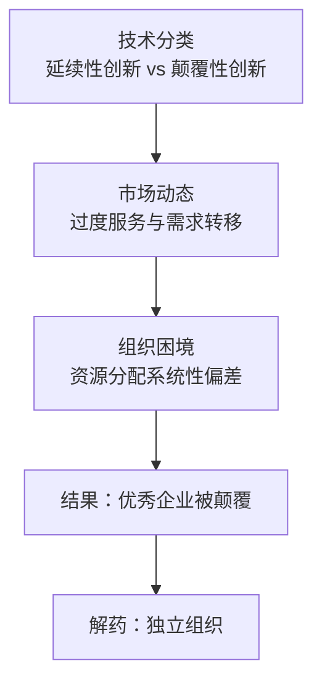

# 《创新者的窘境》深度读书笔记

> [!abstract] 全书速览
> 为什么管理最优秀、最认真倾听客户的企业，反而最容易被新兴小公司颠覆？克里斯坦森通过对硬盘驱动器、挖掘机、钢铁、摩托车等多个行业的纵深研究，揭示了一个令所有管理者不安的结构性困境：企业的失败不是因为做错了什么，恰恰是因为按照"正确"的方式在运营。这本书不是在指责谁的愚蠢，而是在解剖一种组织层面的==系统性失灵==。

## 核心命题

你可能以为企业失败是因为管理层无能、决策迟缓或者盲目自大。但克里斯坦森提出了一个更令人不安的发现：被颠覆的企业，往往恰好是那些管理最优秀的公司。它们认真做市场调研、积极投资研发、严格控制成本、深入倾听客户声音——在每一个商学院推崇的维度上都堪称模范。

问题恰恰出在这里。"做正确的事"本身成了陷阱。

当一种新技术出现时，如果它在传统性能指标上不如现有产品，利润率更低，市场更小，而且你最重要的客户明确告诉你"我不需要这个"——那么任何一套理性的决策系统都会得出同样的结论：放弃它。但如果这种新技术恰好属于==颠覆性创新==，那么这个理性决策就把你推上了通往衰亡的快车道。

> [!tip] 核心洞察
> 创新者的窘境不是能力问题，不是态度问题，而是你所依赖的那套决策逻辑——倾听客户、追求利润、理性配置资源——在特定情境下会系统性地指向错误的方向。

## 框架全景

克里斯坦森围绕这个核心困境构建了一套三层递进的解释框架。

第一层是==技术的分类==。他把创新分为两种截然不同的类型：延续性创新和颠覆性创新。延续性创新是沿着现有的性能轨道往前走，把产品做得更快、更强、更精密、更可靠，满足现有客户的升级需求。在这条赛道上，大公司几乎总是赢家。而颠覆性创新走的是另一条路——它提供一套全新的价值主张，通常更简单、更便宜、更方便，但在传统性能维度上反而更差。

第二层是==市场的动态==。技术进步的速度几乎总是超过市场需求的增长速度。企业不断改进产品，直到某一天产品性能超过了大多数客户的实际需求——这就是"过度服务"。一旦核心性能"够用了"，客户的选择标准就转移到价格、便利性、易用性。而颠覆性产品恰恰在这些新维度上有天然优势。

第三层是==组织的困境==。成熟企业的资源分配流程、激励机制、成本结构、客户关系网络，全部围绕现有市场和现有客户优化。当颠覆性技术出现时，这套机器会自动过滤掉它——市场调研部门说"客户不需要"，财务部门说"利润太低"，销售团队说"推不出去"。每个决策在局部都无可挑剔，但叠加起来的结果就是：企业系统性地拒绝了自己的未来。

## 核心观点深度解读

### 两类创新的本质区别

理解这本书的一切，都要从区分这两类创新开始。

延续性创新是在客户已知的需求轨道上做改进。大公司在这种竞赛中几乎永远获胜，因为它们有更多的研发投入、更深的技术积累、更成熟的供应链关系。

颠覆性创新则完全不同。它不是做得"更好"，而是做得"不同"。它引入了一套新的价值组合——可能更简单、更便宜、更方便——但在传统性能维度上明显更差。正是这种"更差"保护了颠覆者。因为"更差"意味着主流客户不感兴趣，大公司的雷达扫不到这个方向。颠覆者在一个被忽视的角落安静地生长，等到它的性能终于"够用"的时候，它在便利性和成本上已经建立了巨大的优势。

> [!note] 两种颠覆路径
> **低端颠覆**：从主流市场低端切入，服务被"过度服务"的客户。案例：小型钢铁厂从钢筋起步逐步上攻。
> **新市场颠覆**：创造全新市场，服务以前不消费的人。案例：个人电脑最初被视为"玩具"，找到了家庭用户和小企业。

### 价值网络：看不见的牢笼

==价值网络==是克里斯坦森提出的一个核心概念，它解释了为什么聪明人会集体性地看不见威胁。

每家企业都嵌入在一个由客户、供应商、竞争对手、成本结构、利润预期共同构成的网络中。这个网络不仅决定了你能做什么，更深层地决定了你能==看见==什么。一家大型硬盘厂商的价值网络——服务大型计算机制造商，毛利率40%以上——当一个小尺寸低容量的新型硬盘出现时，从这个价值网络看过去，它简直毫无价值。但从台式电脑制造商的价值网络来看，这个小硬盘恰恰是最缺的东西。

价值网络的可怕之处在于，它不是一堵你能看见的墙，而是一副你戴着却不自知的眼镜。

### 硬盘行业的连续颠覆

硬盘驱动器行业是克里斯坦森最核心的研究案例。同样的颠覆模式在二十年间反复上演了四五次。

> [!example] 颠覆的反复上演
> 14英寸 → 8英寸 → 5.25英寸 → 3.5英寸 → 2.5英寸。每一代新硬盘刚出现时容量都更小，主流客户不需要，但找到了自己的新市场。每一代在位者都在内部研发了新技术原型，但因为客户不需要、市场太小而放弃。**失败不是因为看不见未来，而是现有决策系统不允许走向那个未来。**

### 过度服务：颠覆的温床

想象两条曲线：产品性能曲线和客户需求曲线。当两条线交叉——产品性能超过客户实际需求——客户的选择标准就从"谁的性能更强"变成"谁更便宜""谁更方便"。而颠覆性产品在这些新维度上往往有天然优势。

> [!warning] 适用边界
> 颠覆往往发生在市场成熟期。如果你的行业还处于性能不足的阶段——客户仍然渴望更好的性能——那么颠覆性创新的威胁暂时不大。但一旦技术开始"够用"，你就需要开始警惕。

### 大公司的体量诅咒

一家年收入100亿美元的公司如果要维持10%的增长率，每年需要找到10亿美元的新收入来源。一个5000万的新兴市场即使100%占领也只够贡献0.5%的增长。所以理性的选择是等市场长大再进入——但等它长大时先行者已建立壁垒。最有资源的公司反而最没有动力进入小市场，而所有颠覆一开始都是小市场。

### 独立组织：成功转型者的共同药方

克里斯坦森研究了少数成功应对颠覆的案例，发现一个共同模式：它们都为颠覆性业务设立了==独立的组织==。真正的独立意味着：独立的损益表、独立的客户群、独立的成功指标、独立的成本结构。

> [!example] IBM的成功与教训
> IBM在佛罗里达设立独立团队开发PC，远离纽约总部，有权使用外部供应商——这在当时的IBM是异端邪说。正是这种独立性让PC团队摆脱了大型机业务的重力场，成功推出了IBM PC。

### 学会在不确定中行动

传统的商业计划建立在"我们能预测市场"的假设上。但在颠覆性市场中，这些参数全是未知的。正确的心态是：你的第一个计划几乎必然是错的，但通过执行它你会学到修正所需的知识。重点不是预测对，而是学得快。

## 这本书的保质期

《创新者的窘境》1997年出版，距今将近三十年。

**经受住检验的部分：** 颠覆的基本机制被后来的无数案例验证。智能手机对功能机、流媒体对DVD租赁、数码相机对胶片相机、电商对传统零售，都精确遵循了书中描述的路径。

**需要修正的部分：** 特斯拉等"高端切入"的案例表明颠覆路径比最初描述的更多样。数字化时代的平台效应大幅缩短了颠覆周期。理论的事前预测能力有限——克里斯坦森本人曾预测iPhone不会成功。

> [!warning] 概念被滥用
> "颠覆"这个词在商业世界已被严重滥用。克里斯坦森有非常严格的定义，他后来专门撰文澄清Uber不算严格意义上的颠覆性创新。使用这个概念时需要保持精确。

## 行动工具箱

**颠覆预警扫描。** 定期问自己四个问题：行业里有没有"性能更差但更便宜更方便"的替代品？有没有你不屑服务的低端客户？有没有非消费者在用简陋方案凑合？你的产品是否已经"过度服务"？

**资源分配审计。** 审查新项目审批流程：市场规模估算方法是否只适用于已有市场？利润率门槛是否一刀切？这些流程有没有在系统性地扼杀颠覆性机会？

**独立组织清单。** 为颠覆性方向设立真正独立的组织——独立的损益表、客户群、激励机制、成功标准。最重要的是物理距离。

**"过度服务"诊断。** 问客户实际使用了多少比例的功能。低于50%说明你可能已经在"过度服务"，需要关注下一个竞争维度。

**时间窗口估算。** 画出颠覆性技术的性能进步轨迹和主流客户的最低需求曲线。两线交叉时，颠覆从理论威胁变成现实危机。

## 延伸阅读

[[《创新者的解答》]]是克里斯坦森的续作，从"诊断问题"走向"开出药方"。如果《窘境》让你意识到了危险，《解答》告诉你如何主动利用颠覆性创新的机制去进攻。

[[《从0到1》]]提供了一个互补的视角。彼得·蒂尔关注如何通过创造全新品类来建立垄断，克里斯坦森关注如何从市场边缘找到突破口。两者的共同点是：最好的机会往往不在所有人都在看的地方。

[[《跨越鸿沟》]]讲的是颠覆性产品从早期采用者到主流市场的跨越——恰好是克里斯坦森故事的下一章。
