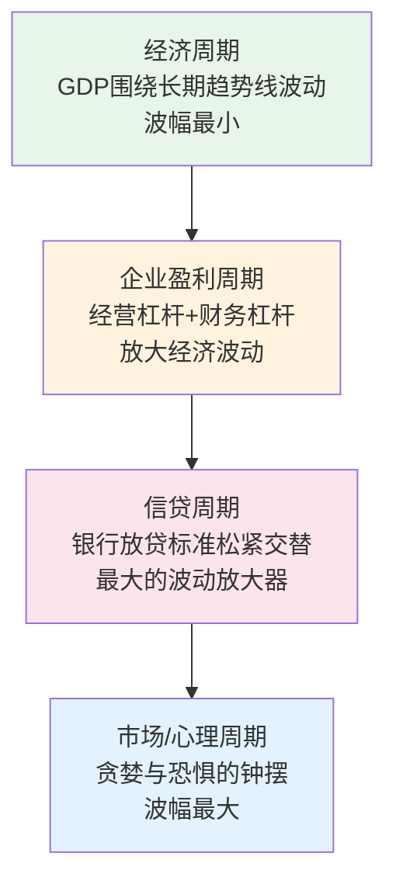

# 《周期》深度读书笔记

> [!abstract] 全书速览
> 市场不是一条平稳上升的直线，而是一个永远在过度乐观和过度悲观之间摇摆的钟摆。霍华德·马克斯用半个世纪的投资实战经验，系统性地拆解了经济周期、信贷周期、市场周期、心理周期等多重周期的运行规律，核心结论不是教你预测周期何时转折——没人能做到——而是教你识别==我们现在在周期的什么位置==，并据此调整自己的行为。这不是一本预测未来的水晶球手册，而是一套帮你在不确定性中做出更好决策的认知框架。

## 核心命题

马克斯在这本书里回答的根本问题是：如果市场和经济的未来不可预测，那投资者还能做什么？

他的核心主张是：==你不需要预测未来，你需要的是知道现在在哪里。==

这个主张挑战了投资世界——乃至整个商业世界——的两种主流思维。第一种是"预测派"：相信通过足够精密的模型、足够多的数据，可以预测经济走向、市场涨跌、行业兴衰。华尔街每年花费数十亿美元在经济预测和市场研判上，但马克斯的判断很直接——这些钱基本上是浪费的。没有人能持续准确地预测宏观经济的走势，如果有人声称可以，你应该对此保持高度怀疑。第二种是"躺平派"：既然预测不了，那就买入并持有，不做任何择时。马克斯认为这种态度放弃了投资者最有价值的能力——在极端环境中调整仓位。

> [!tip] 核心主张
> 虽然你无法预测周期何时转折，但你完全可以判断自己大致处于周期的什么位置。在极端乐观时更谨慎，在极端悲观时更积极——这就是你能做的、也应该做的事。

这个主张之所以重要，是因为它给了你一个可操作的框架。你不需要知道明天会发生什么，你只需要诚实地评估当前环境，然后做出相应的调整。这听起来简单，但实际操作中极其困难——因为当所有人都在狂欢时保持冷静，当所有人都在恐慌时保持勇气，需要的不仅仅是智力，更是心理韧性。

## 框架全景

马克斯的核心框架可以用"多重周期叠加"来概括。他不认为存在一个单一的"市场周期"，而是认为我们生活在多个周期的同时作用之下，这些周期彼此影响、相互放大。

最底层是**经济周期**——经济长期增长，短期围绕趋势线上下波动，波动幅度相对温和。在经济周期之上是**企业盈利周期**——由于经营杠杆和财务杠杆，企业盈利的波动幅度远大于经济本身。当收入增长10%时，利润可能增长30%；收入下降10%时，利润可能下降50%。再往上是==信贷周期==——马克斯认为这是所有周期中最重要的一个。信贷在好的时候自我放大（乐观→放贷宽松→更多资金→资产涨价→更乐观），在坏的时候自我收缩。最上层是**市场/心理周期**，波动幅度最大，投资者情绪在贪婪和恐惧之间摆荡。

关键在于：==每一层都在放大上一层的波动==。经济增长2%，企业盈利可能增长10%，信贷扩张可能推动资产价格上涨30%，而市场情绪可能让股票涨50%。这种层层放大的机制解释了为什么金融市场的波动如此剧烈——远远超出实体经济的变化幅度。

## 核心观点深度解读

### 钟摆效应：市场永远不在中点

马克斯用钟摆来比喻市场的运动模式，这是全书最有穿透力的意象之一。

钟摆的运动有一个反直觉的特征：它花在两端的时间极少，花在中间的时间也极少——它大部分时间都在从一端向另一端运动的途中。市场也是如此。市场理论上应该在"合理估值"附近运行，但实际上它几乎从不停留在那里——它总是从过度乐观摆向过度悲观，然后再摆回来。

> [!example] 案例：2007-2009年金融危机中的钟摆
> **极端乐观一端（2007年）**：银行向没有收入证明的人发放房贷（"忍者贷款"），投行把这些贷款打包成AAA级金融产品卖给全球投资者。所有人都在寻找理由来证明"这次不一样"。
>
> **极端悲观一端（2009年初）**：银行几乎完全停止放贷，即使信用极好的企业也难以获得贷款。优质公司债券收益率飙升到两位数——市场认为这些公司有很高的违约概率，而事实上大多数后来都安然无恙。

马克斯的洞见是：==钟摆的两端都是危险的，但也都是机会所在==。当钟摆在极端乐观一端时——风险最高；在极端悲观一端时——机会最大。能够识别钟摆的位置，并做出与人群相反的决策，是卓越投资者和平庸投资者之间最大的区别。

为什么钟摆不能停在中间？答案与人性有关。人类天生不擅长在"还可以"的状态中保持平静。当事情变好时，你会觉得会一直更好；当事情变糟时，你会觉得永远也好不了了。这种外推倾向确保了钟摆永远不会停在中间。

> [!warning] 钟摆比喻的局限
> 钟摆暗示了某种规律性——摆幅相同、周期固定。但现实中的市场周期既不规律也不对称。有时候乐观阶段持续十年，有时候只有两年；有时候崩盘是缓慢阴跌，有时候是断崖式暴跌。把钟摆比喻当成精确的预测工具会让你犯错——它的价值在于帮你理解市场运动的本质。

### 信贷周期：万恶之源

如果只能从这本书里带走一个观点，马克斯大概会选信贷周期。他认为信贷周期是所有金融危机的核心驱动力。

信贷周期的运行机制令人不安地简单。在好的时候：经济增长→违约率下降→银行放松贷款标准→更多资金入场→资产价格上涨→抵押品增值→银行进一步放松标准。这个循环持续运转，直到信贷扩张远远超出实体经济的承受能力。

然后反转来了。某些贷款开始违约→银行收紧标准→流动性收缩→企业无法续贷→破产或贱卖资产→资产价格下跌→更多抵押品缩水→更多坏账→更严格的收紧——向下的自我强化循环。

> [!tip] 关键洞见
> ==信贷周期的驱动力不是理性分析，而是情绪==。银行在扩张期放松标准不是因为精密的风险计算，而是因为所有人都乐观、竞争对手都在放贷、不放就失去市场份额。收缩期的过度紧缩同理——恐慌蔓延，宁可错杀一千不放过一个。

2007-2008年的金融危机是信贷周期教科书般的演绎。危机前，银行发明了各种复杂工具来扩大信贷规模——抵押贷款支持证券（MBS）、担保债务凭证（CDO）、信用违约互换（CDS）——让更多的钱流入房地产市场，推高房价，创造更多抵押品，再产生更多贷款。危机后，2008年底到2009年初，即使是投资级公司债也出现了惊人的收益率——隐含的违约概率远超历史实际水平。马克斯的橡树资本正是在这个时期大举投资，后来获得了丰厚回报。

> [!warning] 对企业经营者的警示
> 在信贷宽松期很容易获得贷款来扩张——但这恰恰是你应该最谨慎的时候。很多企业在繁荣期大举借债扩张，结果在信贷收缩期因为无法续借贷款而陷入困境——它们的业务可能没问题，但现金流撑不过信贷冬天。

### "这次不一样"：周期中最危险的五个字

马克斯反复强调，每一次泡沫的高潮阶段都会出现"这次不一样"的叙事。这不是因为人们愚蠢，而是因为每一次确实有真实变化在发生——只不过被过度外推了。

> [!example] 两次泡沫的"这次不一样"
> **1990年代末互联网泡沫**：互联网确实是革命性技术（正确），电子商务确实会改变零售业（正确），但这被直接等同于"任何.com公司都值得投资"（错误）。没有收入、没有商业模式的公司市值数十亿。
>
> **2000年代中期房地产泡沫**：房价在美国从未全国性下跌过（统计上正确），人口增长、土地有限、利率下降都支持房价上涨（单独看不荒谬），金融创新分散了风险（理论上成立）。但共同构建的结论"房价不会跌"是灾难性的。

马克斯指出这种思维模式的危险之处：==正确的大趋势判断加上错误的估值判断，结果照样是亏损==。你可能完全正确地判断了某个行业的未来方向，但如果买入价格已经把未来十年的增长都计入了，你仍然会亏钱。趋势判断和投资决策之间，还有一个至关重要的变量——价格。

识别"这次不一样"陷阱的方法不复杂：当你听到人们用一套完美的逻辑来解释为什么某个趋势会永远持续时，开始警惕。完美的逻辑在现实中极少存在——如果一个故事听起来太好了以至于没有任何风险，那大概率是你还没看到风险在哪里。

### 风险的真正含义：不确定性而非波动

马克斯对风险的理解与主流金融理论有根本性分歧。

学术界用"波动率"衡量风险——标准差越大，风险越高。马克斯认为这种定义有严重误导性。真正的风险是==永久性的资本损失==——你投进去的钱再也拿不回来。

更重要的是一个被广泛忽视的悖论：**风险在人们觉得最安全的时候最高，在人们觉得最危险的时候最低。**

逻辑是这样的：当大家都觉得安全时→降低警惕、增加杠杆、追逐收益、推高价格→这些行为本身在制造风险。当大家都觉得危险时→极度谨慎、减少杠杆、抛售资产、压低价格→这些行为本身在减少风险（价格已包含巨大安全边际）。

> [!example] 2006年底 vs 2009年初
> **2006年底**：VIX处于历史低位，信贷利差压缩到极低水平，所有风险指标都在说"一切安全"——但风险已经积累到爆发临界点。
>
> **2009年初**：VIX飙升，信贷利差扩大到历史极值，银行股暴跌90%以上，所有指标尖叫"极度危险"——但事后来看，那是过去二十年最好的买入时机之一。

> [!tip] 对抗直觉的纪律
> 当一切看起来很好的时候，问自己"什么可能出错"；当一切看起来很糟的时候，问自己"价格是否已经反映了所有坏消息"。

不过，这个观点也有边界。"在别人恐惧时贪婪"容易说，但你怎么区分"合理的恐惧"和"过度的恐惧"？2008年的恐惧最终被证明过度了，但1930年代大萧条持续十年，1930年的"逆势买入"意味着继续亏损好几年。马克斯的框架帮你识别极端状态，但不能告诉你精确的转折点。

### 投资者心理：贪婪、恐惧与遗忘

马克斯认为周期反复出现的根本原因不在经济结构，而在人性。

他描述了一个典型的投资者心理循环：下跌后极度谨慎→市场回暖、谨慎松动→别人赚钱、"错失恐惧"出现→所有人都在赚钱、风险意识被贪婪取代→"我为什么没参与"取代"我会不会亏钱"→周期接近顶部→崩盘→恐慌性抛售→发誓"再也不碰"→记忆淡去→下一个周期开始。

马克斯特别强调了==遗忘==在周期中的角色。人类有一种惊人的能力——忘记教训。每次泡沫破裂后人们都说"学到了教训"，但十年后同样的错误以不同面貌重新出现。马克·吐温说得好："历史不会重复，但会押韵。"2000年的互联网泡沫和2008年的房地产泡沫细节完全不同，但底层心理机制——贪婪、过度自信、忽视风险、"这次不一样"——完全一样。

这对你的决策启示是：当你发现自己在投资或商业决策中的情绪异常强烈时——无论是极度乐观还是极度悲观——都应该暂停一下。强烈的情绪本身就是一个信号，说明你可能正在受到周期性力量的影响，而不是在做独立的理性判断。

### 逆周期思维：知易行难的终极挑战

理解周期是一回事，逆周期行动是完全不同的另一回事。

逆周期行动意味着：当所有人都在买入时卖出或减仓；当所有人都在抛售时买入或加仓。逻辑上简单，心理上几乎是对人性的直接对抗。

首先是信息环境的压力——当市场在顶部时，所有新闻都是好消息，所有分析师都在上调目标价，所有朋友都在赚钱。说"我觉得风险太高了"，你对抗的不是一两个人而是整个信息环境。然后是业绩压力——基金经理在牛市减仓意味着短期业绩落后于同行，客户会质疑"别人30%你15%"。

> [!example] 马克斯的亲身经历
> 1990年代末互联网泡沫期间，橡树资本拒绝参与科技股狂欢。从1998年到2000年初，业绩显著落后——客户质疑、媒体批评、同行嘲笑。直到泡沫破裂才被证明正确。但在被"证明正确"之前，你可能要忍受一两年甚至更长时间的"看起来很傻"。
>
> 2007年底马克斯警告信贷市场风险过高，但承认警告早了约一年。他的态度是：==宁可早一步而不是晚一步==，因为晚一步的代价远大于早一步的机会成本。

对于普通投资者和商业管理者来说，逆周期思维不需要像专业投资者那样精确。你不需要在顶部卖出、底部买入。你只需要做到：在大多数人极度乐观时增加一些谨慎，在大多数人极度悲观时增加一些勇气。哪怕只是在边际上做出这种调整，长期累积下来的效果也是显著的。

## 这本书的保质期

**经受住检验的部分。** 关于周期本质的核心洞见——市场在贪婪和恐惧之间摇摆，信贷周期是波动的最大放大器，风险在感觉最安全时最高——建立在对人性的理解之上，而人性不会因技术进步或制度变迁而根本改变。从17世纪荷兰郁金香泡沫到2021年加密货币和SPAC狂潮，底层心理机制惊人一致。2021年在接近零利率环境下几乎所有资产飙升，2022年急剧调整，再次验证了马克斯的判断。

**需要修正的部分。** 马克斯的框架主要基于美国金融市场经验。在新兴市场、中国A股、或加密货币这样全新的资产类别中，周期可能受到政策干预、资本管制、地缘政治等因素的更大影响，这些在马克斯的框架中没有充分讨论。此外，量化交易和被动投资规模的急剧扩大，可能改变了传统心理周期的表达方式——但算法背后仍然是人，所以心理因素可能只是换了表现形式，而没有消失。

> [!warning] 幸存者偏差
> 马克斯在2008年底逆势投资并获得丰厚回报，但这并不意味着每一次"逆势"都会成功。1930年代大萧条中的逆势买入者可能等了十年才回本。框架帮你识别极端状态，但不能保证精确的时机判断。

## 行动工具箱

**周期温度计。** 每个季度花一个小时做环境评估。回答几个问题：当前媒体主流叙事是乐观还是悲观？信贷环境在变松还是变紧？你身边的人讨论投资时的语气是兴奋还是恐惧？IPO市场是火热还是冰冷？如果所有信号都指向同一方向，你大概率处于周期的某个极端。

**逆向情绪检查。** 在做重大决策前问自己："如果我把这个决策告诉十个人，他们会觉得我疯了还是觉得理所当然？"如果十个人都觉得理所当然——这个决策可能已经被共识充分定价了。如果七八个人觉得你疯了——你可能发现了逆周期机会，当然也可能你真的疯了，所以确保分析扎实。

**信贷周期监测清单。** 关注：银行是在主动推销贷款还是提高门槛？高收益债券发行量增减？信贷利差收窄还是扩大？杠杆收购交易倍数升降？信号同时指向"宽松"时提高警惕，同时指向"紧缩"时开始寻找机会。

**"这次不一样"探测器。** 听到关于趋势会持续的叙事时做两件事：把每个论据单独评估；去找历史上类似案例看当时的论据——你往往发现今天的论据和二十年前惊人相似。

**企业现金储备纪律。** 在信贷宽松期建立足够现金储备，确保不依赖外部融资能生存至少12-18个月。信贷周期转折往往来得比任何人预期的都快。

## 延伸阅读

[[《非理性繁荣》]]（罗伯特·席勒）是最值得对照阅读的一本。席勒从行为经济学和实证数据角度解释了市场泡沫的形成机制，包括叙事经济学的概念——故事如何驱动市场行为。马克斯给了你实践框架来识别周期位置，席勒给了你更深层的理论基础。

[[《投资最重要的事》]]是马克斯自己的前一本书，与《周期》形成姊妹篇。《投资最重要的事》侧重投资哲学全景——价值、风险、逆向思维等广泛主题；《周期》是对"周期"这一主题的深度展开。读了其中一本，另一本几乎是必读的补充。
