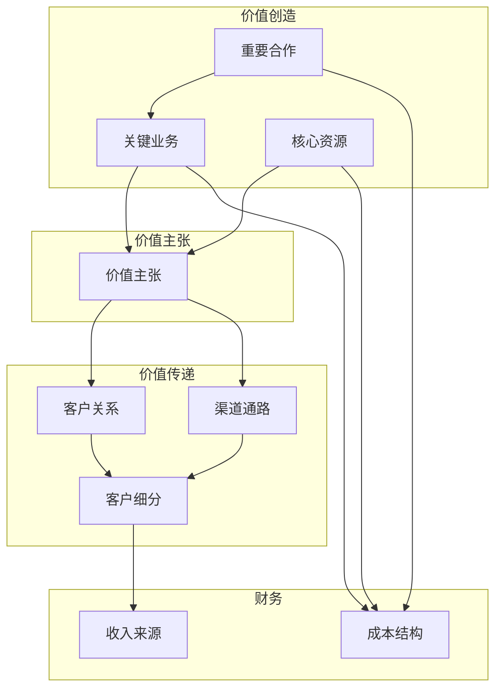

# 《商业模式新生代》深度读书笔记

> [!abstract] 全书速览
> 这本书做了一件看似简单却极其困难的事：把"商业模式"这个被滥用到几乎失去意义的词，变成了一张可以被看见、被讨论、被操作的画布。亚历山大·奥斯特瓦德和伊夫·皮尼厄提出的==商业模式画布==（Business Model Canvas），用九个模块将任何企业的运作逻辑拆解为一页纸的可视化图谱。这不是又一本讲战略理论的书，而是一本让你"动手画出来"的工具书——它改变了全球创业者、企业管理者和咨询顾问思考商业的方式。自2010年出版以来，这本书已被翻译成30多种语言，成为商学院和创业加速器的标配读物。

## 核心命题

这本书回答的根本问题是：**如何用一种简洁、直观、通用的语言来描述、分析和设计商业模式？**

在这本书出现之前，商业模式的讨论往往陷入两个困境。第一个困境是"人人都在说，没人说得清"。你在会议室里说"我们的商业模式需要调整"，然后发现CEO理解的商业模式是盈利方式，产品经理理解的是产品功能组合，销售总监理解的是渠道策略，投资人理解的又是估值逻辑。每个人都在用同一个词，但脑子里想的完全不是同一件事。这种语义混乱导致的沟通效率低下，在真实的商业场景中损耗巨大。第二个困境是"分析工具太重"。传统的商业计划书动辄几十页，涵盖市场分析、财务预测、组织架构等等，写完往往需要几个月。对于需要快速试错的创业团队来说，这种重型工具本身就是一种负担——当你花三个月写好一份完美的商业计划书时，市场可能已经变了。

> [!tip] 核心主张
> 奥斯特瓦德的核心主张可以概括为三句话。第一，商业模式不是商业计划书的附属品，不是财务预测表上的一行注释，它本身就是一个独立的、值得被严肃对待的战略概念。第二，任何商业模式——无论它属于什么行业、处于什么发展阶段——都可以用九个基本模块来描述，这九个模块覆盖了企业运作的四个核心维度：客户、价值主张、基础设施和财务健康。第三，也是最容易被忽略的一点——商业模式不是一成不变的蓝图，而是需要被持续设计、测试和迭代的动态作品。它更接近于一幅不断被修改的素描，而不是一份一经签署就不能改动的合同。

这个主张挑战了当时商业世界的一个隐含假设：好产品自然会带来好商业。奥斯特瓦德用大量案例证明，产品再好，如果商业模式不对，一样会失败。反过来，同样的技术或产品，放在不同的商业模式里，命运天差地别。iPod不是第一个MP3播放器——在它之前，市场上已经有了Rio、Creative等品牌的产品，功能上并不比iPod差。但苹果用iTunes音乐商店加硬件加内容生态的商业模式赢了整个市场。决定胜负的不是产品规格表上的参数，而是九个模块如何被编织成一个自洽的系统。

## 框架全景

整本书的核心就是那张著名的==商业模式画布==。你可以把它想象成一张企业的X光片——它不会告诉你这家企业有多漂亮，但它会让你清清楚楚地看到这家企业是怎么运作的，骨架结构是否健康，各个器官之间的连接是否通畅。

画布由九个模块组成，按逻辑关系可以分成四个区域。这四个区域不是随意划分的，而是对应了商业运作中四个最根本的问题。

右侧是"价值传递"区域，回答的是"你怎么把价值送到客户手中"的问题。它包含四个模块：**客户细分**（你为谁创造价值？你最重要的客户是谁？）、**价值主张**（你为客户解决什么问题或满足什么需求？你向每个客户群体提供什么样的价值组合？）、**渠道通路**（你通过什么途径触达客户？你的销售和交付渠道是什么？客户希望通过什么方式被触达？）、**客户关系**（你和客户之间是什么类型的互动？是人工服务、自助服务、社区，还是共同创造？）。

左侧是"价值创造"区域，回答的是"你需要什么来创造和交付价值"的问题。它包含三个模块：**核心资源**（你最重要的资产是什么？可能是实体资产、知识产权、人力资源或财务资源）、**关键业务**（你必须做好哪些事？是生产制造、问题解决，还是平台运营？）、**重要合作**（谁是你的关键合作伙伴？你从合作伙伴那里获取哪些核心资源？哪些关键业务由合作伙伴完成？）。

底部是"财务"区域，回答的是"这个模式在财务上能不能持续"的问题。它包含两个模块：**收入来源**（客户愿意为什么付钱？他们目前怎么付钱？他们更愿意怎么付钱？每个收入来源占总收入的比例是多少？）和**成本结构**（运营这个模式最大的成本是什么？哪些核心资源最贵？哪些关键业务最贵？你的模式是成本驱动还是价值驱动？）。

这九个模块不是孤立的清单，而是一个相互关联的系统。价值主张是整张画布的中心枢纽，它向右连接着客户世界——你的价值主张必须精准匹配客户细分的真实需求；它向左连接着运营世界——你的核心资源和关键业务必须有能力交付你承诺的价值主张。底部的财务结构则是整个系统能否持续运转的检验器——如果收入来源无法覆盖成本结构，这张画布无论画得多漂亮，都只是一张好看的图而已。当你修改其中任何一个模块时，其他模块几乎必然会受到影响。这就是画布最大的价值所在——它迫使你看到整体，而不是只盯着产品或只盯着营销。

> [!note] 五种商业模式式样
> 在九个模块的基础上，书中还提出了五种常见的商业模式式样（patterns）。这些式样是从大量真实案例中归纳出来的共性结构，包括非绑定模式、长尾模式、多边平台模式、免费模式和开放式商业模式。你可以把它们理解为建筑中的"风格"——哥特式、巴洛克式、现代主义——它们不是死板的分类，而是设计的参考框架。你可以混合使用，也可以在它们的基础上创造新的变体。了解这些式样的最大好处是：你不必每次都从零开始设计商业模式，而是可以站在前人的肩膀上，参照已经被验证过的结构来思考。

## 核心观点深度解读

### 1. 价值主张不等于产品——这是最容易犯的错

这是整本书最容易被忽视却最重要的区分。你走进任何一个创业路演现场，十个创业者里有八个会用"我们做了一个更好的产品"来开场。但奥斯特瓦德反复强调一个看似简单却深刻的道理：==客户买的不是你的产品，客户买的是问题的解决方案或者需求的满足==。产品只是承载解决方案的容器，而不是解决方案本身。

> [!example] Nespresso案例
> 书中用了Nespresso的案例来详细说明这一点。表面上看，Nespresso卖的是咖啡机和咖啡胶囊。但如果你认为它的价值主张是"一台咖啡机"，你就完全误读了它的商业模式。Nespresso真正卖的是"在家里也能轻松喝到一杯品质稳定的好咖啡"这个体验。注意这里面的关键词：轻松（操作极简，一键出咖啡）、品质稳定（每颗胶囊都是标准化的）、好咖啡（和速溶咖啡拉开明显差距）。围绕这个价值主张，Nespresso设计了一整套彼此咬合的商业模式：咖啡机低价甚至赔本卖（降低客户尝试的门槛），胶囊定价高但毛利极高（创造持续的、高利润的收入流），会员制和自营渠道（建立直接的客户关系，绕过零售中间商），精品店提供沉浸式体验（强化品牌调性，把买胶囊变成一种"仪式感"消费）。

这个案例的深层启发在于：价值主张是连接客户需求和你的商业模式的那座桥梁。如果你搞错了价值主张——比如以为自己在卖"一台更好的咖啡机"——那么后面的一切决策都会跟着跑偏。你会把钱花在提升机器性能上，而不是优化胶囊口味和购买体验上；你会通过电器卖场渠道销售，而不是建立自己的精品零售网络。一步走错，步步走偏。

不过这个框架也有需要注意的地方。它更适合描述已经相对清晰的价值主张。对于那些颠覆性创新——客户自己都不知道自己需要什么的领域，比如iPhone发布之前没有消费者会说"我需要一个触屏手机"——画布在描述这种"尚不存在的需求"时会有些力不从心。你可以回溯性地用画布来分析iPhone的成功，但很难用画布来预测下一个iPhone在哪里。

### 2. 客户细分：不只是分类，而是决定视角的起点

书中第一个被详细展开的模块就是客户细分，这个编排顺序不是偶然的。奥斯特瓦德认为，你对客户的理解深度，决定了你整张画布的质量。如果客户细分做得粗糙，后面所有的模块都会建立在一个模糊的地基上。

他区分了五种不同的客户细分策略，每一种对应完全不同的商业逻辑。**大众市场**不区分客户群体，用标准化的价值主张服务尽可能多的人，消费电子行业的早期通常采用这种策略。**利基市场**专注特定的小众群体，为他们提供高度定制化的服务，奢侈品和专业设备行业是典型代表。**区隔化市场**认识到不同的客户群有不同的需求，虽然这些需求有所关联，但需要差异化的价值主张来服务——银行对普通储户和高净值客户提供完全不同的服务就是这个道理。**多元化市场**同时服务完全不相关的客户群，亚马逊既做零售又做云计算（AWS），两个业务的客户群几乎没有重叠。**多边平台**是最复杂也最有趣的一种，它同时服务两个或以上相互依赖的客户群，一方的存在是另一方价值的前提。

> [!example] Google的多边平台
> 多边平台的例子最能说明客户细分为什么如此重要。Google的两个客户群是搜索用户和广告主。搜索用户免费使用，广告主付费。如果你只看到"搜索用户"这一个客户群，你会困惑于Google怎么赚钱；如果你只看到"广告主"这一个客户群，你会困惑于Google凭什么能卖广告。只有当你同时看到两个客户群以及它们之间的依赖关系时，Google的商业模式才真正可被理解。没有海量的搜索用户，广告主不会来；没有广告收入，Google无法提供免费搜索。这是一个自我强化的飞轮。

> [!warning] 幸存者偏差
> 这里有一个书中没有充分讨论的问题：幸存者偏差。书中引用的平台案例——Google、苹果、Facebook——都是赢家通吃的巨头。事实上，绝大多数尝试做平台的企业都在"先有鸡还是先有蛋"的冷启动阶段就死掉了。画布能帮你看清平台的结构，但不能帮你解决冷启动问题。这是画布的能力边界之一。

### 3. 收入来源：赚钱方式的多样性远超你的想象

很多人对"怎么赚钱"的理解停留在最朴素的层面——做个产品，定个价格，卖出去，收钱。但这本书列出了至少七种收入来源的类型，每一种都对应不同的商业逻辑和客户关系。

**资产销售**是最传统的方式，你卖出一件商品，客户获得所有权。**使用费**按使用量收费，酒店按住宿天数、电信公司按通话时长。**订阅费**按周期收取固定费用以获得持续的服务使用权，健身房会员卡和Netflix都是这个模式。**租赁**让客户在一段时间内获得使用权而不是所有权，Zipcar（共享汽车）把租赁的颗粒度从"天"压缩到了"小时"。**许可费**让客户获得受保护的知识产权的使用权，微软的Windows授权就是这个模式。**经纪佣金**从促成的交易中抽取费用，房产中介和信用卡清算网络都属于这一类。**广告**通过向广告主出售对特定受众的触达机会来获取收入。

每一种收入来源还可以配合不同的定价机制。固定定价包括目录价、按产品特征定价、按客户群定价和按量定价。动态定价则包括协商定价、收益管理（航空公司的浮动票价就是典型）和实时市场竞价（类似eBay的拍卖）。

这个模块的威力在于它迫使你思考一个根本问题：==客户到底在为什么付费？== 是为产品的所有权付费，还是为使用权付费？是一次性付费，还是持续付费？定价是固定的，还是可以随市场波动？不同的收入模式，对应完全不同的客户关系和成本结构。

> [!example] Xerox的收入模式转型
> Xerox的故事是收入模式创新的经典案例。早年Xerox卖复印机，客户一次性买断设备。后来Xerox转向按打印页数收费的"租赁加服务"模式——客户不再买机器，而是按实际使用量付费。产品完全没变，但赚钱方式变了，整个商业逻辑就跟着变了：客户获取成本下降了（不需要一次性掏大笔钱），客户生命周期价值上升了（持续付费），客户锁定效应增强了（换供应商意味着打断已经习惯的服务流程），Xerox自身的现金流也从一次性收入变成了可预测的持续收入。

Rolls-Royce在航空发动机领域做了类似的事情——从卖发动机变成"按飞行小时收费"。航空公司不再需要承担高昂的发动机购置成本和维护风险，Rolls-Royce则获得了和客户长期绑定的关系以及持续的收入流。

在今天的商业环境中，订阅模式已经从边缘走向主流，覆盖了从软件（SaaS）到消费品（Dollar Shave Club的剃须刀订阅、各种鲜花和食材订阅盒）到内容（流媒体平台）的几乎所有领域。这一趋势在书出版时已初见端倪，如今已经被充分验证。

### 4. 免费模式：谁在为"免费"买单

书中用了相当的篇幅讨论"免费"作为一种商业模式的可行性和内在逻辑。这在2010年是一个火热的话题——互联网公司大量采用"产品免费、靠广告或增值服务赚钱"的策略，但很多人只看到了"免费"的表象，并不真正理解背后的经济学。

奥斯特瓦德把免费模式拆解为三种变体，每种变体的经济逻辑完全不同。

**广告模式**：一边客户免费使用产品，另一边的广告主为触达这些用户付费。这本质上是一个多边平台——免费用户和广告主是两个不同的客户群，他们的需求不同，你为他们创造的价值不同，从他们那里获取的收入也不同。Metro（免费地铁报纸）就是一个非数字化的例子：读者免费看报，广告主为版面付费。这个模式成立的前提是：你能汇聚足够大规模的用户群体，并且能精准地向广告主描述这些用户的特征。

**免费增值（Freemium）**：大量用户免费使用基础功能，少量用户付费购买高级功能。这个模型的关键数字是转化率——典型的Freemium产品只有不到10%的用户会转为付费用户。这意味着什么？意味着你需要有一个巨大的免费用户基数，才能产生足够的付费收入来覆盖全部成本（包括服务那90%不付费用户的成本）。Skype是书中讨论的典型案例：大量用户免费使用Skype进行语音通话，少量用户付费购买SkypeOut（打普通电话）和其他高级功能。这个模式的数学很简单但很残酷：如果你每个免费用户的边际服务成本不够低，Freemium就不成立。

**诱饵模式**：产品本身低价甚至亏本出售，通过配套的消耗品或服务赚取利润。这是吉列发明的经典模式——剃须刀架便宜卖（甚至免费送），刀片高价卖。打印机和墨盒、游戏主机和游戏软件都是这个逻辑。诱饵模式的前提是消耗品必须有锁定效应——客户一旦买了你的刀架，就只能用你的刀片。如果通用替代品很容易获得，这个模式就会失效。

> [!tip] 免费的本质
> 这部分内容最有价值的地方在于，它揭示了"免费"背后的==成本转嫁逻辑==——世界上没有真正免费的东西，总有人在付费，问题只是"谁在付"以及"以什么形式付"。当你在画布上把免费模式画出来时，这种成本与收入的转嫁关系一目了然：一个客户群的成本被转嫁到了另一个客户群的收入上，或者当前的亏损被转嫁到了未来的利润上。

需要注意的是，免费增值模式在实践中比看起来困难得多。书中没有充分展开的一个现实问题是：当免费用户太多而付费转化率持续走低时，企业会面临严重的亏损压力。很多创业公司在"先用免费获取用户，再想办法变现"的逻辑下耗尽了融资，最终没能等到转化率爬升到盈亏平衡点。免费模式不是万能药，它需要非常精密的单位经济模型来支撑。

### 5. 五种商业模式式样：站在巨人的肩膀上设计

书中最有实战价值的部分之一，是对五种商业模式"式样"的深入分析。这些式样不是理论推演，而是从大量成功（和失败）的商业模式中归纳出来的共性结构。

**非绑定模式**揭示了一个反直觉的事实：任何企业本质上都在同时做三种截然不同的生意——产品创新、客户关系管理和基础设施管理。这三种生意各有各的经济逻辑和文化基因，硬塞在一个企业里会产生严重的内耗。产品创新追求速度和创意，客户关系管理追求范围和深度，基础设施管理追求规模和效率。移动通信运营商就是典型的"被绑定"企业——它们同时在做网络基础设施建设、用户服务和终端销售，每一块都做得不够极致。解绑并不意味着放弃，而是意味着选择你最擅长的部分深耕，把其他部分交给更合适的合作伙伴。

**长尾模式**的核心是"少量多品种"的聚合效应。传统零售靠的是二八法则——20%的畅销品贡献80%的收入。长尾模式颠覆了这个逻辑：它不靠几个爆款赚钱，而是提供海量的小众产品，每个产品可能只卖出几十件，但成千上万个小众产品加在一起，体量可能超过任何单个爆款。实现长尾的前提条件有两个：一是库存和分发成本极低（这就是为什么长尾模式在数字产品领域最为典型），二是有强大的搜索和推荐能力帮助客户在海量商品中找到他们想要的那一个。亚马逊的图书业务和Netflix的影视库都是长尾模式的经典实践。

**多边平台模式**创造的是一个让不同客户群互动的场所。它的关键挑战不是技术，而是"先有鸡还是先有蛋"的冷启动难题——没有足够的买家，卖家不愿意来；没有足够的卖家，买家也不愿意来。打破僵局的常见策略是补贴一边来吸引另一边。Visa和Mastercard在早期就大量发卡给消费者，免年费甚至给返利奖励，目的是让线下商户看到持卡人的数量，从而愿意安装刷卡终端接受信用卡支付。一旦双边达到临界规模，网络效应就开始自我强化，后来者几乎不可能追上。

**免费模式**和**开放式商业模式**在前面和后面的章节中已有涉及。开放式商业模式特别值得一提——它打破了"所有创新必须内部产生"的封闭思维，通过对外授权技术或对内引入外部创新来扩展价值创造和捕获的边界。宝洁的"联发创新"（Connect and Develop）策略就是一个案例：宝洁把内部的闲置专利授权给外部公司使用，同时主动从外部寻找创新成果引入自己的产品线。

这些式样的价值在于给你一个设计的起点。你不必每次都从白纸开始，而是可以参照已有的成功模式进行组合和变形。但书中也非常坦诚地指出，最伟大的商业模式创新往往不是套用某个式样，而是打破现有式样、创造全新组合的结果。所以这些式样是"起点"而不是"终点"，是"启发"而不是"答案"。

### 6. 商业模式设计是一个迭代过程，不是一次性的填表

这是整本书贯穿始终的一个核心理念，但恰恰是最多读者会忽略的部分。太多人拿到画布之后，认真地填完九个格子，然后把它贴在墙上或存进电脑，觉得"商业模式设计完毕"。这完全误解了画布的用途。画布不是一次性填写的表格，它是一个反复迭代的思考和沟通工具。

书中用了相当的篇幅介绍商业模式设计的完整流程，包含五个阶段：==动员 → 理解 → 设计 → 实施 → 管理==。

这五个阶段中，"设计"阶段最有意思。奥斯特瓦德明确借鉴了设计思维的核心方法——他建议团队用画布快速画出多个版本的商业模式"原型"，就像工业设计师做产品草模一样。关键词是"多个"：一次工作坊上画出20-30种商业模式变体是完全正常的，甚至是被鼓励的。先追求可能性的数量，再进行评估和筛选。这种"发散-收敛"的设计思路，和传统的"只做一个方案然后优化到底"的线性思维形成了鲜明对比。

苹果的案例是商业模式持续迭代的绝佳例证。苹果不是一开始就规划好了"硬件加软件加内容加服务"的完整生态系统。它是从iPod开始（一个优秀的硬件产品），然后发现需要iTunes来解决音乐获取的问题（增加了内容平台模块），接着推出iPhone（重新定义了核心产品），再推出App Store（让第三方开发者成为价值创造的一部分），逐步演化成今天的模样。每一步都是在上一步取得成功后，根据新的环境和新的能力，在画布上增加或修改模块的结果。

> [!warning] 迭代的现实约束
> 这个观点的边界也需要坦诚面对。持续迭代商业模式在小型创业团队中相对容易实现，但在大型成熟企业中面临巨大的阻力。大企业的组织惯性、既有投资的沉没成本、现有客户群的迁移风险、内部利益格局的固化——这些都是画布上画不出来的现实约束。柯达很早就发明了数码相机技术，但它的胶片业务利润太丰厚，组织太庞大，利益太盘根错节，以至于无法完成向数字化商业模式的转型。画布能帮你看清应该往哪里走，但走不走得动，取决于画布之外的很多东西。

### 7. 环境扫描：你的画布不存在于真空中

书中有一个容易被跳过但价值极高的章节——商业模式环境。很多人在使用画布时有一个隐含的假设：环境是稳定的，至少在可预见的将来不会发生剧烈变化。这个假设在今天看来尤其危险。

奥斯特瓦德提出了四个环境扫描维度，形成一个360度的外部视野。**市场力量**关注的是市场需求端的变化：客户的需求在如何演变？市场正在增长还是萎缩？客户的转换成本在上升还是下降？竞争格局正在集中还是分散？**行业力量**关注的是供给端和竞争结构：上下游供应商的议价能力如何？有没有新进入者在虎视眈眈？有没有替代品正在蚕食市场？行业的利益相关者格局是否在发生变化？**关键趋势**着眼于更长期的结构性变化：技术趋势（AI、区块链、物联网等正在改变什么？）、监管趋势（政策风向在往哪里吹？）、社会文化趋势（消费者价值观和生活方式在如何变化？）、以及社会经济趋势（人口结构、收入分配、城市化等）。**宏观经济力量**则关注最大尺度的经济环境：全球市场条件、资本市场的可用性和成本、大宗商品价格走势、经济基础设施的状况。

这四个维度的扫描不是学术练习。它们的核心启发是：同一个商业模式在不同环境中的生存能力可以天差地别。一个高度依赖低利率融资的商业模式，在零利率环境下可以高速增长，但利率一旦上升，资金成本的增加可能直接把利润吃掉。一个依靠用户数据变现的广告模式，在监管宽松时高歌猛进，但GDPR之类的隐私法规一出台，整个收入来源就可能受到严重冲击。一个依赖全球供应链的轻资产模式，在国际贸易顺畅时效率极高，但一旦遭遇地缘政治冲突或疫情封锁，脆弱性就暴露无遗。

书中建议在画布旁边同时维护一张"环境地图"，定期更新，以便提前发现需要调整商业模式的信号。这种将内部模式和外部环境关联起来的习惯，虽然听起来是常识，但在实际操作中极易被忽视。大多数团队一旦画好画布就沉浸在内部讨论中——优化产品功能、调整定价策略、拓展销售渠道——忘了隔一段时间抬头看看窗外，看看世界是否已经变了。

### 8. 画布作为沟通工具：让分歧可见

画布最容易被低估的功能不是"分析"，而是"沟通"。在没有画布之前，一家公司里不同角色的人对商业模式的理解往往是彼此不兼容的。CEO想的是战略布局和投资回报，产品经理想的是功能路线图和用户体验，销售总监想的是客户获取和渠道效率，财务总监想的是成本控制和现金流。他们以为在讨论同一件事，其实各说各话，像一群盲人在摸不同部位的大象。

画布提供了一种"共同语言"。当所有人面对同一张画布时，分歧不再是模糊的感觉，而是具体的、可见的、可讨论的。你不再是在抽象地争论"我们应不应该做平台"，而是在画布上具体地讨论"这个客户群的这个需求，用这个渠道和这个收入模式来满足，成本结构能不能打平"。当某个人提出修改建议时，所有人都能即时看到这个修改会如何影响其他模块。

书中特别强调了用便利贴在画布上工作的物理方法。每个假设、每个想法写一张便利贴，贴在对应的模块上。便利贴可以随时撕下来、移动到别的模块、或者直接扔掉。这种物理化、可视化、可操作的方式，比在PPT上修改文字要流畅得多。它把"头脑中模糊的假设"变成了"桌面上可以被指着讨论的物体"。当你指着一张便利贴说"我觉得这个渠道不对"时，讨论就有了具体的锚点，而不是在空中飘来飘去。

> [!note] 补充说明
> 这个方法的最佳使用场景是面对面的工作坊。一群人围着一张大画布，手持便利贴和马克笔，边讨论边贴边撕边重组。这种身体参与感和空间感是数字工具很难完全复制的。但如果你的团队分布在不同城市甚至不同国家，或者画布只是由一个人在笔记本电脑上独自填写，这种协作的魔力就会大打折扣。近年来奥斯特瓦德团队推出的Strategyzer在线协作平台，以及Miro、Mural等视觉协作工具的兴起，正在试图弥合这个差距，但面对面工作坊的效果至今仍然是最强的。

## 这本书的保质期

这本书出版于2010年，距今已经超过15年。在商业书籍普遍保质期只有三五年的世界里，它表现出了令人意外的持久力。但我们仍然需要诚实地评估它的不同部分在今天的适用程度。

**经久不衰的部分**是画布本身的九个模块框架。无论商业世界怎么变化，一家企业都需要回答"为谁创造价值""怎么创造和传递价值""怎么从中赚钱"这些根本问题。这个框架的抽象层次恰到好处——足够高以至于不会因为某个行业或技术的变迁而过时，又足够具体以至于能落地到真实的商业讨论中。事实上，画布在出版十多年后仍然是全球使用最广泛的商业模式工具，被超过500万人使用——这本身就是最好的时间验证。画布的核心价值——让商业模式可视化、可讨论、可迭代——在可预见的未来不会过时。

**需要升级的部分**是书中的一些案例分析和对特定模式的讨论。比如书中对"免费模式"的讨论虽然在经济逻辑上是准确的，但没有预见到后来围绕用户隐私的巨大争议。当你的商业模式建立在收集和变现用户数据的基础上时，GDPR等隐私法规的出台、苹果ATT隐私政策对广告追踪的限制、以及公众对数据隐私的日益觉醒，都在深刻改变免费模式的可行性和边界。再比如，书中对多边平台模式的讨论还停留在相对早期和乐观的阶段，没有涉及后来出现的平台垄断与反垄断博弈、算法推荐的伦理问题、平台劳动者权益保障等复杂议题。

> [!warning] 需要补充的维度
> 已经需要补充的部分至少有三个方向。第一是数字化转型带来的商业模式变革：订阅经济的全面崛起、API经济让企业能力变得可组合、"数据即服务"成为新的收入来源、AI正在重塑几乎每一个模块的可能性。第二是可持续发展对商业模式的刚性约束：ESG（环境、社会和治理）已经从可选的加分项变成了投资者和监管者的必选项，一个不考虑碳排放的商业模式在很多市场已经不可行。第三是生态系统竞争的新范式：商业竞争的单位已经从"企业对企业"升级为"生态对生态"，画布描述单个企业很有效，但在描述多企业协同的生态系统时就显得力不从心。奥斯特瓦德团队后来推出的[[《价值主张设计》]]以及Strategyzer平台上持续更新的新工具和新模板，在一定程度上弥补了这些缺口。

最后一个值得指出的结构性局限：画布天然更适合描述以营利为目的的商业组织。对于非营利机构、政府公共服务项目、社会企业等，虽然也可以借用画布的思考方式，但"客户细分""收入来源"和"客户关系"这几个模块需要重新定义——非营利机构的"客户"可能同时包括服务对象和捐赠者，"收入来源"可能主要是拨款和募捐而非交易性收入。直接套用画布的原始定义会导致削足适履。

## 行动工具箱

**工具一：30分钟商业模式体检。** 拿出一张白纸（越大越好，至少A3大小），画出九宫格，花30分钟把你当前的业务（或你正在考虑的创业想法）填进去。不要追求完美和精确，先把你能想到的全部写上。完成后审视这张画布，问自己三个问题：哪个模块你填得最吃力（说明你对这个方面了解不够）？哪两个模块之间的连接最不顺畅（说明这里可能存在商业逻辑的断裂）？如果你的竞争对手看到这张画布，他们会选择攻击哪个模块（说明那是你最薄弱的环节）？

**工具二：价值主张对齐测试。** 在画布的右侧单独做一个练习。左边一列，列出你的目标客户最在意的3到5个"要完成的任务"、最痛苦的3个"痛点"和最渴望的3个"收益"。右边一列，列出你的产品或服务提供的价值点。然后画线连接：每个客户需求都有对应的价值点吗？有没有你投入了大量资源来提供但客户其实不太在意的价值点？有没有客户急需但你完全没有覆盖的空白？这个练习常常能揭示你以为的"核心优势"和客户真正在意的东西之间的错位。

**工具三：商业模式压力测试。** 选择一个可能发生的外部变量（比如"你的获客成本在两年内翻倍""你目前最大的销售渠道被关闭或收费大幅上涨""市场上出现了一个免费的替代品""关键原材料价格暴涨50%"），在画布上逐个模块标记出会受到冲击的部分，然后设计应对方案。每个季度选一个不同的变量做一次这样的压力测试，比等到危机真正来临时手忙脚乱要从容得多。

**工具四：竞争对手画布比较。** 选取你最重要的一个竞争对手和一个正在快速崛起的新进入者，分别用画布描述它们的商业模式。然后把三张画布——你的、老对手的、新玩家的——并排放在一起比较。差异会一目了然。你很可能会发现，真正的竞争不在产品层面（大家的产品可能没有根本性差异），而在商业模式层面——谁的渠道效率更高、谁的客户锁定更强、谁的成本结构更有优势、谁的收入模式更可持续。

**工具五：约束条件下的创新工作坊。** 召集你的团队（最好是跨职能的4到6人），用两个小时做一次工作坊。先花30分钟用画布描述当前的商业模式。然后提出一个刻意刁难的约束条件，比如"如果完全不能向最终用户收费怎么办""如果我们的核心技术明天就被开源了怎么办""如果法规禁止了我们目前的核心渠道怎么办"。在这个约束下重新设计画布，每个人画出至少两个方案，然后分享讨论。这种"限制条件下的创新"往往能逼出意想不到的新可能性——因为当旧路被堵死时，你才会真正认真地去探索新路。

## 延伸阅读

如果这本书让你建立了商业模式思考的框架，下面两本书可以帮你走得更深。

[[《价值主张设计》]]是奥斯特瓦德团队的续作，专门深挖画布中"价值主张"和"客户细分"之间的匹配关系。它提供了"价值主张画布"这个子工具，帮你更精细地理解客户的痛点、收益和要完成的任务，然后设计出真正打动客户的价值主张。如果说《商业模式新生代》给了你全景视角，[[《价值主张设计》]]就是把镜头推到了特写。对于那些发现自己的画布"价值主张"模块总是填得很空泛的人来说，这本续作几乎是必读的。

[[《精益创业》]]（埃里克·莱斯）和画布是天然的搭档。画布帮你设计商业模式的假设——"我认为这群客户有这个需求，我可以用这种方式满足他们，他们愿意为此付这么多钱"。但假设终究只是假设，它需要被验证。[[《精益创业》]]提供的"构建-测量-学习"循环，就是用最低成本、最快速度去验证画布上每一个假设的方法。两本书结合使用，构成了一套从"设想商业模式"到"验证商业模式"的完整闭环。
