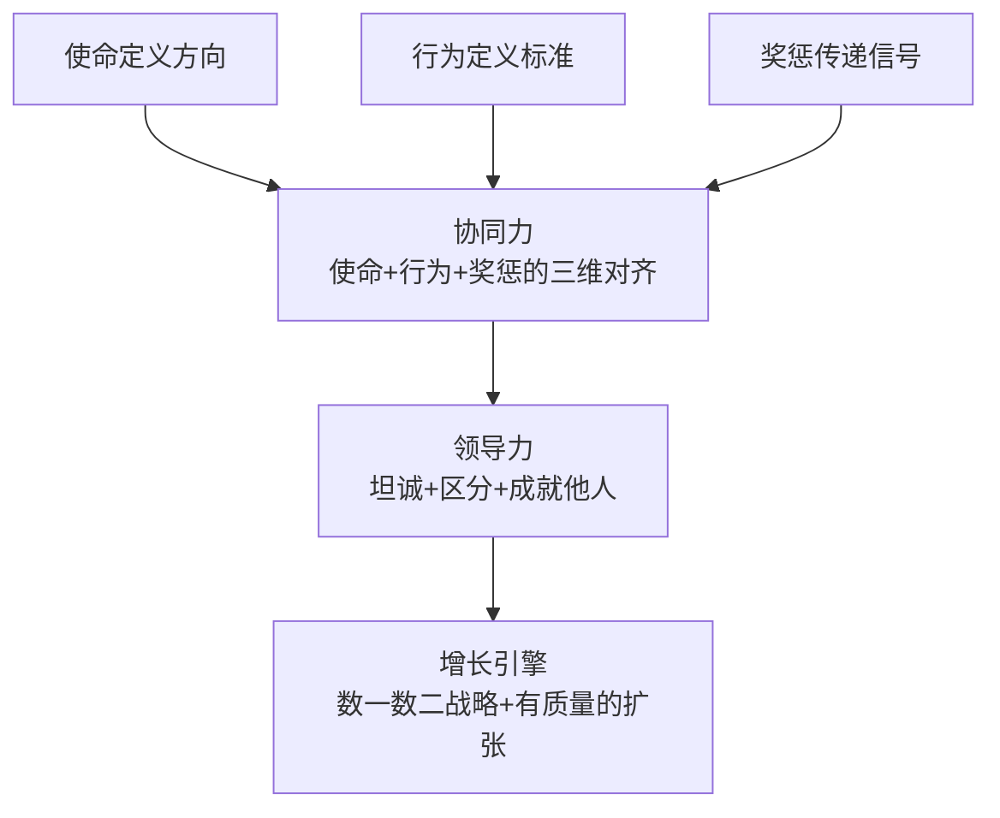

# 《商业的本质》深度读书笔记

> [!abstract] 全书速览
> 商业世界里没有什么魔法公式，但确实有一些底层的东西被反复验证——协同力、坦诚、区分、领导力、增长。杰克·韦尔奇执掌通用电气（GE）二十年，将这家公司的市值从130亿美元推升至超过4000亿美元。2015年，已退休多年的他与妻子苏茜合著了这本《商业的本质》，不是为了讲理论，而是为了回答他收到的成千上万个来自世界各地管理者的真实困惑：团队带不动怎么办？增长停滞怎么破？危机来了怎么活？韦尔奇的回答一如他的风格——直接、尖锐、不留情面。他说，商业的本质不复杂，复杂的是你有没有勇气把最基本的事情做对。这本书覆盖了从组织对齐到人才区分、从创新增长到危机管理的完整图景，读完你会发现，它不是在教你新招式，而是在追问你：那些你早就知道但一直在逃避的事情，你到底打算什么时候做？

---

## 核心命题

韦尔奇要回答的根本问题是：**为什么有些公司能持续获胜，而有些公司慢慢衰败？什么是决定胜负的关键因素？**

他的答案出人意料地简单：不是因为战略有多高明，而是因为执行。==战略只占成功的10%，剩下的90%是执行。==而执行的前提，是整个组织在同一个方向上发力——韦尔奇称之为"协同力"。

这个判断挑战了商业世界的几个常见假设。

第一，它挑战了"战略最重要"的迷思。商学院会花大量时间讨论波特五力、BCG矩阵、蓝海战略这些框架，但韦尔奇认为，再好的战略如果没有被组织上下真正理解和执行，就是废纸一张。战略的制定可能只需要几天，但让一个万人组织真正认同并执行这个战略，需要数年。

第二，它挑战了"好人做好事"的管理幻觉。很多管理者觉得，只要对员工好，团队自然会有产出。韦尔奇说这是逃避——真正的领导力是敢于区分优劣、做出艰难决定，而不是做"老好人"。一个不敢给你真实反馈的管理者，表面上是善良，实际上是在浪费你的职业时光。

第三，它挑战了"和谐就是好"的组织文化误区。很多公司追求表面的和谐，避免冲突。韦尔奇认为这恰恰是最大的问题——缺乏坦诚的组织无法发现问题、无法快速决策。真正的团队精神不是和气一团，而是敢于在会议上激烈辩论、走出会议室后坚决执行。

> [!note] 管理思想谱系中的位置
> 在管理思想的谱系中，韦尔奇代表了一种强硬的绩效导向主义。他之前有泰勒的科学管理、德鲁克的目标管理、彼得斯和沃特曼的卓越文化。韦尔奇的独特贡献在于，他把使命、文化、人才和绩效整合到一个以"区分"为核心的体系中，并在一家巨型企业中亲手验证了二十年。他之后的管理思想——柯林斯的"第五级领导力"、麦考德的"奈飞文化"、达利欧的"极度透明"——几乎都是在和韦尔奇的遗产对话。

---

## 框架全景

全书的核心框架围绕三个相互支撑、层层递进的模型展开。如果你把它想象成一栋建筑，协同力是地基，领导力是结构，增长是目的。

**第一层是协同力——使命、行为与奖惩的三维对齐。** 韦尔奇观察到，几乎每家公司都有使命宣言，但绝大多数使命宣言只是墙上的装饰。真正的协同力要求三件事完全一致：使命定义方向（公司要去哪里）、行为定义标准（什么样的行动被鼓励和禁止）、奖惩传递信号（做了正确的事会得到什么，做了错误的事会付出什么代价）。这三者中任何一个与另外两个脱节，协同力就会崩溃。如果你的使命说"鼓励创新"但犯错就被惩罚，员工会迅速学到"真正的规则"和"宣传的规则"之间的差距——然后按真正的规则行事。

**第二层是领导力——坦诚、区分与成就他人。** 韦尔奇的领导力不关于魅力或愿景，而是关于三个具体实践。坦诚是基础——一个不敢说真话的组织无法发现问题。区分是手段——敢于识别优劣，把最好的资源投入最优秀的人和最有前途的业务。成就他人是目的——领导者的工作不是展示自己有多聪明，而是让团队中的每个人都变得更好。

**第三层是增长引擎——数一数二战略与有质量的扩张。** 韦尔奇认为增长不是锦上添花，而是企业生存的前提。停止增长的企业会陷入存量博弈——为有限资源内斗，士气下滑，人才流失。他的"数一数二战略"要求每个业务要么做到市场第一或第二，要么就出售或关闭。

> [!tip] 核心洞察
> 这三层不是平行的，而是层层递进的：协同力是地基（如果组织不对齐，一切努力都白费），领导力是杠杆（有了对齐的组织，还需要有人去激发和做艰难决定），增长是目的（协同力和领导力最终要服务于让公司持续变得更强更大）。如果你只看到"区分"和"淘汰10%"而忽略了协同力和领导力发展，你就会把韦尔奇简化为一个冷血的绩效杀手——实际上他的体系远比这个标签复杂得多。

---

## 核心观点深度解读

### 一、协同力：使命不是挂在墙上的口号

韦尔奇在全书开篇就讨论协同力，这不是偶然的。在他看来，大多数组织问题的根源不是资源不够、战略不好或人才不行，而是组织根本没有对齐。每个部门在按照自己的理解行事，每个人在按照自己的判断优先级做事，结果整个组织看起来很忙，但力量相互抵消。

协同力要解决的就是这个问题：**让组织中的每个人都理解使命、知道自己如何为使命做贡献、并在行为和奖惩层面感受到使命是真实的。**

这听起来是常识，但问题出在三个环节。

首先，使命往往太抽象。"成为行业领导者""为客户创造价值"——这类使命宣言说了等于没说，因为你无法根据它做出日常决策。韦尔奇在GE提出的使命是==成为每个业务领域的第一或第二==——这句话清晰到每个业务单元的负责人都能立刻判断自己是否达标。好的使命应该有两个特征：任何员工都能用自己的话解释它；它能帮助你判断"这件事该不该做"。

其次，使命没有转化为可观察、可评估的行为。使命再清晰，如果不被分解为具体的行为准则，也只是抽象的方向。韦尔奇在GE推行"4E+1P"——Energy（你自己是否充满干劲？）、Energize（你能否激励他人？）、Edge（你能否做出艰难决定？）、Execute（你能否把事情做到？）、Passion（你对工作是否发自内心地热爱？）——这不是虚泛的价值观宣言，而是可以具体评估的行为标准。在GE的人才评估中，一个业绩出色但缺乏"激励他人"能力的人，不会被视为领导者候选人。

第三，也是最致命的，使命和奖惩机制脱节。如果你的公司使命说"鼓励创新"，但实际上犯错的人会被边缘化或惩罚，那员工很快就会学到真正的规则是"别出风头"。韦尔奇强调：==奖励什么、惩罚什么，比任何口号都更能传达组织的真实使命。==他在GE的做法是将使命和行为标准直接嵌入绩效考核和薪酬体系——你的晋升和奖金不仅取决于业绩数字，也取决于你是否体现了组织要求的行为方式。

> [!example] GE的实践
> 韦尔奇上任后砍掉了大量无法成为行业前两名的业务——包括一些仍然盈利的业务。这传达了一个无比清晰的信号：使命不是口号，而是真的会决定业务的生死。
>
> 不过后续也出现了教训：继任者们发现，管理层为了让自己的业务看起来是"第一或第二"，开始把市场定义得越来越窄。只要把市场定义得足够小，任何业务都可以是"行业领导者"。这说明再好的使命也需要持续校准和迭代。

---

### 二、坦诚：你以为的效率损耗来自流程，实际来自不敢说真话

坦诚是韦尔奇管理哲学的基石，他对这个概念的重视远超大多数管理者的理解。他认为，组织中最大的效率损耗不是来自流程冗余或资源浪费，而是来自一个看不见的成本：人们不敢说真话。

你一定经历过这种场景：会议上没人说真话，大家客客气气地讨论，真正的想法留到会后在走廊里和"自己人"交流；绩效评估成了"皆大欢喜"的仪式，管理者给所有人都打了不错的分数，因为说真话太不舒服了；领导者收到的信息经过层层过滤，坏消息被弱化，问题被包装，等到高层发现真实情况时往往已经为时已晚。韦尔奇估计，缺乏坦诚让大多数组织损失了至少30%的效率。

他推动坦诚文化的方法不是发表演讲，而是建立具体的制度。

> [!tip] 三大坦诚机制
> **群策群力会议（Work-Out）**：来自不同层级的员工聚在一起讨论业务问题。管理者在讨论阶段不在场——这样你才敢说真话。但在最后阶段管理者必须回来，当场对每条建议做出明确回应——"同意""不同意""需要更多信息"。不能含糊其辞。
>
> **"没有惊喜"原则**：年终评估不应有任何意外。如果你在年终才知道自己表现不好，那不是你的问题，而是管理者失职。绩效反馈应该是持续的、及时的。
>
> **奖励直言者**：公开表扬敢于挑战现状的人——即使意见最终没被采纳。如果说真话的人没有得到保护，坦诚文化就是空话。

韦尔奇还强调要奖励直言者、保护异见。他在GE公开表扬那些敢于挑战现状的人。他要求自己的高管团队在会议上公开辩论，允许甚至鼓励下属挑战他的观点。有一个著名的例子：一位年轻的GE经理在会议上公开质疑韦尔奇的某个决策，韦尔奇不仅没有报复，还在之后提拔了他——这个信号比任何备忘录都有力。

> [!warning] 边界条件
> 坦诚不等于粗鲁。"你的方案有三个漏洞"是坦诚，"你怎么这么蠢"是粗鲁。坦诚的目的是解决问题，不是人身攻击。而且坦诚文化的建立需要时间——你不能今天宣布"我们要坦诚"，明天就期待员工开始说真话。员工需要看到反复的证据——说真话的人不会被惩罚、好的建议真的会被执行——才会慢慢相信这不是又一场管理层的"运动"。

---

### 三、区分：20-70-10法则——最具争议也最值得你思考的人才机制

区分是韦尔奇最著名也最具争议的管理实践。核心思想是：对员工进行区分，把最好的资源投入最优秀的人和最有前途的业务。

在人员层面，这体现为著名的"活力曲线"：每年把员工分为三类——前20%是明星员工，给予最多的资源和发展机会；中间70%是骨干，给予培训和帮助他们进步；后10%需要离开——坦诚反馈后请他们另谋出路。

韦尔奇为这个制度提供了一套完整的辩护逻辑。他认为这是最"仁慈"的做法：如果你在一个不适合的岗位上挣扎多年，绩效评估永远是"需要改进"，既不被解雇也不被提升，就这样浪费了最宝贵的职业年华——这才是真正的残酷。坦诚告诉你"你不适合这里"，虽然短期痛苦，但给了你重新开始的机会。

他还认为，对低绩效者的"容忍"是对高绩效者的不公。前20%的人在拼命创造价值，但他们看到表现最差的人也能安稳待着——如果努力和不努力的结果一样，优秀的人要么降低标准要么离开。=="没有什么比让一个低绩效者安然无恙地待在团队里更快地毁掉团队士气了。"==

> [!warning] 活力曲线的重大局限
> **可能扼杀合作**：如果你知道排名是相对的，帮助同事就意味着降低自己的排名，最理性的策略是把同事当竞争对手而非队友。微软在使用强制排名的那些年里，工程师们不愿意加入优秀的团队，也不愿意分享知识。
>
> **制造短期主义**：年度评估自然倾向于衡量年度内可见的成果，那些做长期研究、建设基础设施的工作往往被忽视。
>
> **催生恐惧文化**：当每年都有10%的人被淘汰，冒险和创新就变得危险。
>
> **后续发展**：微软2013年废除了强制排名，随后内部合作文化显著改善。Adobe转向了持续反馈模式。甚至GE自身在2016年也宣布废除了强制排名。趋势很明确：保留"区分"的精神，但放弃"强制淘汰"的具体形式。

对你而言，最值得带走的不是那个比例，而是韦尔奇反复强调的一个底层原则：==坦诚是对人最大的尊重，假装所有人表现一样好不是善良而是懦弱。==

---

### 四、领导力：从"我"到"我们"的身份转变

韦尔奇对领导力的定义是管理文献中最清晰的之一：**在你成为领导者之前，成功是关于你自己——让自己变得更好；在你成为领导者之后，成功是关于别人——让你的团队成员变得更好。**

这个定义的深层含义是：成为领导者需要一次根本性的身份转变。很多新任管理者失败，恰恰是因为还在用个人贡献者的思维模式做事——自己忙得不可开交，但没有花足够的时间在发展团队上。韦尔奇认为，领导者应该把至少50%的时间花在"人"的问题上——评估人、发展人、激励人、选拔人。

他列出了领导者的五项核心任务。第一，不断提升团队，把每次互动都当作评估和指导的机会。韦尔奇每年花大量时间在GE的"Session C"人才评估会议上——亲自参与对数百名高级管理者的评估和讨论。这不是走过场，而是他认为自己最重要的工作之一。第二，让员工看到愿景，用故事和画面感反复讲述——不是发一份文件就完事。第三，深入员工中间，传递积极的能量。第四，建立信任——通过说到做到、承认错误和认可他人。第五，做出不受欢迎但必要的决定。韦尔奇说："领导力不是赢得人气竞赛。很多时候你必须做的决定会让人不高兴。但如果你总是选择让人高兴的选项，你最终会让所有人都不高兴。"

韦尔奇还提出了"无边界组织"的概念——打破部门之间的墙、层级之间的墙、公司与外部之间的墙，让信息和想法自由流动。Work-Out会议就是实现"无边界"的具体机制之一。

> [!tip] 领导力的终极检验
> 你离开之后，团队比你在时更强还是更弱？如果你在时团队出色、你走后团队崩溃，那你不是领导者——你只是一个控制者。不过这个标准按韦尔奇自己的情况来衡量，结果令人深思——他退休后GE的长期表现远不如在任时辉煌。这究竟说明继任者不够好，还是体系过于依赖他个人的能力？这个问题没有简单的答案，但它确实提醒你：==真正的领导力遗产是可以脱离个人运转的组织能力。==

---

### 五、增长：不是目标，而是生存的前提

韦尔奇对增长有一个不留余地的判断：**不增长的公司正在死亡，只是速度不同。**

这不是夸张。增长带来机会——新项目、新职位、新发展空间。增长吸引人才——优秀的人想去一个上升的平台。增长提供资源——有增量才能投资未来。反过来，停止增长的公司会陷入存量博弈：部门之间为有限的预算争吵，员工之间为有限的晋升机会竞争，士气持续下滑，人才不断流失——这是一个负反馈螺旋，一旦开始就很难逆转。

韦尔奇的增长策略建立在"数一数二"原则之上：GE的每一个业务部门都必须在自己的市场中做到第一或第二。做不到的业务要么被修复，要么被出售或关闭。背后的经济学逻辑很清晰：在成熟市场中，通常只有市场领导者能获得超额利润——他们有规模优势、品牌优势和网络优势。第三、第四名只能打价格战，利润微薄。把资源分散在大量"还行"的业务上，等于用中等资源做中等事，结果是所有业务都不出众。

韦尔奇还区分了有机增长和并购增长两条路径。有机增长来自深耕现有业务——创新、效率提升、市场份额扩大——更扎实但速度慢。并购可以快速获得新能力或新市场，但整合风险大。他估计有三分之二的并购最终未能创造预期价值，因为文化冲突、人才流失和执行失误的概率很高。他主张两条腿走路，但强调并购必须服务于战略，而不是为了规模而规模。

> [!warning] GE Capital的教训
> 韦尔奇在任期间大力发展GE Capital，使金融业务一度贡献了公司超过一半的利润。这在当时被视为天才之举。但2008年金融危机暴露了这种模式的脆弱性：GE Capital持有大量高风险资产，危机中差点拖垮整个GE。更深层的问题是，金融的高利润可能掩盖了制造业务的竞争力下滑——当利润轻松来自金融杠杆时，谁还有动力去啃制造业升级的硬骨头？==增长的质量和增长的速度一样重要。如果增长建立在脆弱的基础上，看起来的繁荣可能只是为未来的危机积累能量。==

---

### 六、危机管理：假设最坏，但相信你会变得更强

韦尔奇用专门的章节讨论危机管理，因为他认为：危机时刻最能体现领导者的真实水平，也是建立信任的最好机会。

他的危机管理框架建立在五个"悲观假设"之上：假设问题比你知道的更严重——坏消息总是滞后，每层汇报者都有动机淡化；假设世界上没有秘密——你试图隐瞒的事迟早会被发现；假设你的处理会被最恶意地解读；假设会有人因此受损；但最重要的一条是——假设你会从危机中变得更强。

基于这些假设，韦尔奇提出了三条核心的危机处理原则。

第一，面对现实。很多管理者面对危机的本能反应是淡化问题、拖延处理、寄希望于问题自己消失。韦尔奇说这是最糟糕的做法——问题只会越拖越大。他主张在危机初期就全面了解情况、制定应对方案、开始行动。速度比完美重要——一个"80分但快速"的方案远好于一个"100分但姗姗来迟"的方案。

第二，过度沟通。危机时刻信息混乱，各种谣言和猜测会填补信息真空。你必须主动、频繁、透明地沟通——即使你不知道所有答案，也要让利益相关方知道你在关注、你在行动。沉默会被解读为隐瞒或不作为。韦尔奇建议在危机中"过度沟通"——你认为已经沟通够了的时候，再多沟通一倍。因为在焦虑和恐惧中，人们对信息的接收能力大幅下降。

第三，承担责任。不要找替罪羊，不要推卸责任。你勇于承担责任——"这是我的团队的问题，我来负责解决"——反而更容易获得尊重和信任。公众和员工对诚实的领导者有很高的容忍度——你承认了问题，他们愿意给你时间去修复；但如果你试图隐瞒然后被揭穿，信任就彻底崩塌了。

> [!note] 从危机中学习
> 危机管理还有一个经常被忽略的步骤：从危机中学习。危机暴露了什么系统性的弱点？哪些流程需要改进？哪些人在危机中表现出了领导力？如果你不从每次危机中提取教训并建立防止复发的机制，同样的问题会再次发生。韦尔奇的态度是：浪费一次危机是不可原谅的——每次危机都应该让你和组织变得更强。

---

## 这本书的保质期

《商业的本质》出版于2015年，韦尔奇的核心管理经验来自1981—2001年执掌GE的时期。距今二十多年，哪些经受住了时间检验，哪些需要打折扣？

**跨时代的智慧：**

协同力的重要性没有过时。让组织上下一心在任何时代都是核心挑战——远程工作和混合办公的普及可能让这个挑战更加严峻。坦诚文化的价值也被反复验证——Netflix、桥水等公司用不同方式印证了韦尔奇的判断。领导力是成就他人而非展示个人英雄主义——无论在工业时代还是知识经济时代，这一点从未改变。危机管理的三条原则（面对现实、过度沟通、承担责任）在每一次公共危机中都被证明是对的——而每次有人违反这些原则，代价都很惨重。

**需要更新的部分：**

强制排名/淘汰10%是韦尔奇遗产中最先"过时"的部分。越来越多的研究和实践表明，在知识经济时代，合作比内部竞争更能驱动创新和价值创造。微软在废除强制排名后内部协作和创新显著改善。趋势很明确：保留"区分"的精神，但放弃"强制淘汰"的具体形式。

"数一数二"战略在行业边界清晰的年代非常有效。但今天行业边界日益模糊——你的竞争对手可能来自完全不同的行业。Uber不是出租车公司，Airbnb不是酒店公司。在这种跨界竞争的环境中，"在什么市场做第一第二"这个问题本身变得难以回答。

> [!warning] GE的后续表现
> GE在韦尔奇离任后的表现引发了最根本的质疑。2018年GE被踢出道琼斯指数，金融业务成为重大拖累，2021年宣布拆分为三家独立公司。这不意味着韦尔奇所有做法都是错的——书中讨论的是底层原则而非GE的具体策略——但你在读的时候需要保持这个背景意识：==一套管理体系的可传承性，比它在创建者手中的辉煌更重要。==

---

## 行动工具箱

> [!note] 工具一：协同力诊断三问
> 随机问你团队中的三个人：(1) 我们的核心目标是什么？(2) 你的工作如何支持这个目标？(3) 如果你做了一件和目标一致的事，会得到什么？如果做了一件冲突的事，会怎样？如果三个人的答案不一致，你有协同力问题。重点关注第三个问题——它揭示的是组织的真实激励机制。

> [!note] 工具二：坦诚文化启动器
> 本周找你团队中一个表现好的和一个需要改进的成员，分别进行一次15分钟的一对一对话。核心句式："我观察到你在XX方面做得很好/需要提升，我想听听你的看法。"不需要打分，不需要正式评估，就是一次坦诚的交流。如果你觉得这很难开口，想想韦尔奇的话：你的沉默不是善良，而是在剥夺对方改进的机会。

> [!note] 工具三：领导力自检清单
> 每周问自己五个问题：这周我帮助了哪个团队成员成长？我是否给出了坦诚的反馈，还是为了"和谐"回避了难题？我是否做了一个艰难但正确的决定，还是推迟了？我的团队是否清楚知道优先级？我是否在传递积极能量，还是在传播焦虑？如果连续三周某一项都打不了勾，这就是你需要重点改进的领导力短板。

> [!note] 工具四：业务组合审计
> 审视你负责的业务或项目：哪些值得加大投入（有竞争优势且市场在增长）？哪些应该果断放弃（不是行业前列且市场在萎缩）？资源是否分散在太多"还行"的方向上？韦尔奇的原则是：放弃不是失败，是为了赢在更重要的地方。做这个审计时问自己一个最关键的问题：如果今天从零开始，我还会进入这个业务吗？如果答案是否定的，你就需要认真考虑退出了。

> [!note] 工具五：危机预演
> 即使你的组织现在运转良好，也值得每季度花一个小时想想：如果最重要的客户明天离开怎么办？如果核心员工被竞争对手挖走，谁能接替？如果出现一条负面新闻，你的沟通方案是什么？提前想过的危机，真正发生时不会那么措手不及。你无法预防所有危机，但你可以确保面对危机时有预案而非手足无措。

---

## 延伸阅读

[[《赢》]]是韦尔奇的另一本管理著作，比《商业的本质》更系统。如果你只读一本韦尔奇，应该读《赢》。两本书核心思想一脉相承，但《赢》在每个主题上展开得更深。

[[《从优秀到卓越》]]（吉姆·柯林斯）是研究持续卓越企业的经典。柯林斯的"第五级领导力"描绘了一种谦逊、坚定的领导风格，和韦尔奇的外向直接形成了有趣对照——两种模式都能成功，关键是什么环境适合什么风格。两本书放在一起读，你会发现他们在"领导力是成就他人"这个核心判断上殊途同归。
