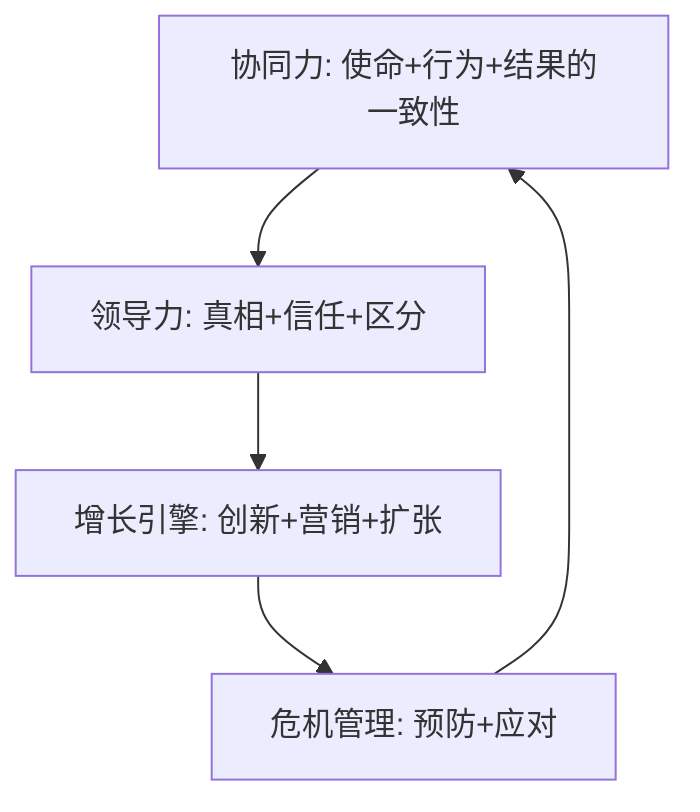

# 《商业的本质》深度读书笔记

> [!abstract] 全书速览
> 杰克·韦尔奇被誉为"世界第一CEO"，执掌通用电气（GE）20年间将其市值从130亿美元提升至4000亿美元。2015年，他与妻子苏茜合著《商业的本质》（The Real-Life MBA），试图回答一个根本问题：**在真实的商业世界中，什么才是决定成败的关键？** 这不是一本学院派的管理理论著作，而是一位经历过无数商战的老将，把数十年实战经验蒸馏成的精华。全书围绕三个核心展开：如何让组织上下一心（协同力）、如何成为有效的领导者（领导力）、如何在竞争中持续获胜（增长与危机管理）。韦尔奇的管理哲学以"坦诚"和"区分"著称——直面现实、淘汰落后、奖励优秀，这种风格在商业史上影响深远，同时也引发了持续的争议。

---

## 核心命题

你有没有发现，很多公司墙上挂着漂亮的使命宣言，但问员工"公司的使命是什么"，十个人能给出十一种答案？韦尔奇认为，这就是大多数公司平庸的根源——==不是战略不对，而是组织根本没有对齐。==

《商业的本质》要回答的根本问题是：**为什么有些公司能持续获胜，而有些公司慢慢衰败？** 韦尔奇的答案出人意料地简单：不是因为战略有多高明，而是因为执行、执行、再执行。而执行的前提，是整个组织在同一个方向上发力。

这本书挑战了商业世界的几个常见假设：

**第一，"好人做好事"的管理幻觉。** 很多管理者认为，只要对员工好，团队自然会有产出。韦尔奇说这是逃避——真正的领导力是敢于区分优劣、做出艰难决定，而不是做"老好人"。

**第二，"战略最重要"的迷思。** 商学院教授会花大量时间讨论战略，但韦尔奇认为，战略只占成功的10%，剩下的90%是执行。再好的战略，如果没有被组织上下真正理解和执行，就是废纸一张。

**第三，"和谐就是好"的组织文化误区。** 很多公司追求表面的和谐，避免冲突。韦尔奇认为这恰恰是最大的问题——缺乏坦诚的组织无法发现问题、无法快速决策、最终会被竞争对手打败。

> [!tip] 核心洞察
> 商业成功的本质不是聪明的战略，而是让组织中的每个人都朝同一个方向、以最高的标准执行。

---

## 框架全景

韦尔奇的管理体系可以用一个简单的公式概括：

**持续获胜 = 协同力 × 领导力 × 增长引擎**

这三个要素不是并列的，而是层层递进的：

**协同力是地基。** 如果组织上下不在同一个方向上，再好的领导也是白费力气。协同力的核心是让使命不再是墙上的口号，而是每个人每天做决策的依据。

**领导力是杠杆。** 有了方向一致的组织，还需要有人去激发、去推动、去做艰难的决定。韦尔奇的领导力观点直接而实用：领导者的工作是帮助团队成员成长并取得成果，而不是显示自己有多聪明。

**增长是目的。** 协同力和领导力最终要服务于一个目标：让公司持续增长。不增长的公司本质上是在衰亡，只是速度有快有慢。

这个体系的独特之处在于它的整合性。很多管理书会单独讨论战略、领导力、文化，但韦尔奇把它们编织成一个有机的整体。他认为，单独优化任何一个要素都没有意义——一个有魅力的领导者如果带领一个方向混乱的组织，也只能是白忙活。

---

## 核心观点深度解读

### 观点一：协同力——让使命从墙上走进每个人心里

> [!note] 背景
> 韦尔奇发现，几乎每家公司都有使命宣言，但绝大多数使命宣言只是墙上的装饰品。员工不知道、不理解、也不关心。

协同力是韦尔奇管理体系的第一块基石。他对协同力的定义很具体：**让组织中的每个人都理解公司的使命、知道自己如何为使命做贡献、并愿意为之努力。**

这听起来是常识，但韦尔奇指出，真正做到的公司凤毛麟角。问题出在哪里？

**使命往往太抽象。** "成为行业领导者""为客户创造价值"——这类使命宣言说了等于没说，员工无法根据它做出日常决策。韦尔奇主张使命要具体到可以指导行为的程度。他在GE提出的使命是"成为每个业务领域的第一或第二"——这句话清晰到每个业务单元都知道自己是否达标。

**使命没有转化为行为。** 使命只有变成可观察、可评估的行为，才有意义。如果使命说"以客户为中心"，那么什么样的行为算是"以客户为中心"？韦尔奇要求把使命分解为具体的行为准则，并把它纳入绩效考核。

**使命和奖惩脱节。** 如果一个公司的使命说"鼓励创新"，但实际上犯错会被惩罚，那么员工很快就会学到真正的规则是"别出风头"。韦尔奇强调，奖励什么、惩罚什么，比任何口号都更能传达真实的使命。

> [!example] GE的实践
> 韦尔奇上任后，砍掉了大量无法成为行业前两名的业务，包括一些盈利的业务。这在当时引发巨大争议，但它传达了一个清晰的信号：使命不是口号，而是真的会决定业务的生死。员工很快明白了"第一或第二"不是说说而已。

**幸存者偏差警示**：协同力的确重要，但韦尔奇的"第一或第二"策略也有其局限。后来GE的继任者发现，这个策略导致管理层把市场定义得越来越窄（只要把市场定义得足够小，任何业务都能成为"第一"），反而限制了增长空间。

---

### 观点二：坦诚——组织效率的最大乘数

> [!tip] 核心洞察
> 坦诚是韦尔奇管理哲学的基石。他认为，组织中最大的效率损耗不是来自流程，而是来自人们不敢说真话。

韦尔奇对组织中的"虚假和谐"深恶痛绝。他观察到，在很多公司里：

- 会议上没人说真话，真正的讨论发生在会后的走廊里
- 员工有问题不敢提，怕被贴上"不合群"的标签
- 领导者收到的都是过滤过的好消息，等问题暴露时已经无法挽回
- 绩效评估成了"皆大欢喜"的游戏，真正的问题从不被讨论

这种缺乏坦诚的文化造成的损失是巨大的：决策速度变慢、问题被掩盖、人才被埋没、创新被扼杀。

韦尔奇推动坦诚文化的方法很直接：

**群策群力会议（Work-Out）**。这是韦尔奇在GE推行的标志性制度。员工可以直接向高管提出问题和建议，高管必须当场给出回应——"同意""不同意"或"需要更多信息"，不能含糊其辞或事后再说。这个制度迫使信息直接流动，绕过了层层过滤。

**"没有惊喜"原则**。韦尔奇要求绩效问题必须及时沟通，年终评估不应该有任何意外。如果一个员工在年终评估时才知道自己表现不好，那是管理者的失败，不是员工的问题。

**奖励直言者**。韦尔奇会公开表扬那些敢于挑战现状、提出不同意见的人。他知道，如果说真话的人得不到保护，坦诚文化就是空话。

> [!warning] 边界条件
> 坦诚不等于粗鲁。韦尔奇强调，坦诚要有建设性，目的是解决问题而不是人身攻击。而且坦诚文化的建立需要时间——你不能今天宣布"我们要坦诚"，明天就期待员工开始说真话。员工需要看到说真话的人确实得到了保护，才会慢慢相信这是真的。

---

### 观点三：区分——20-70-10法则的逻辑与争议

区分是韦尔奇最具争议也最具影响力的管理理念。他主张把员工分为三类：

- **前20%**：明星员工，给予最多的资源、奖励和发展机会
- **中间70%**：骨干员工，给予培训和发展机会，帮助他们进步
- **后10%**：需要离开的员工，及时让他们走人

这个制度在GE每年都会淘汰绩效最差的10%员工，被媒体称为"残酷排名"（rank and yank）。

韦尔奇为什么坚持这么做？

**他认为这其实是最"仁慈"的做法。** 他的逻辑是：如果一个员工在你的公司表现不好，与其让他在一个不适合的岗位上挣扎多年、浪费他最宝贵的职业时光，不如及早告诉他真相，让他有机会找到更适合的地方。对表现差的人"仁慈"，其实是对表现好的人残忍——前20%的人会觉得"既然混日子也能留下，我为什么要努力？"

**他认为这能保持组织的活力。** 组织需要新陈代谢。如果没有淘汰机制，团队就会慢慢积累平庸者，最终拖垮整个组织。

> [!warning] 这个制度的重大局限
>
> 区分制度在实践中遇到了很多问题：
>
> **可能扼杀合作**。如果大家都想进前20%，可能不愿意帮助同事，甚至会互相拆台。
>
> **数字游戏**。管理者可能操纵评估以保护自己人，或者为了凑够10%的"淘汰名额"而牺牲还不错的员工。
>
> **短期主义**。员工可能追求短期业绩而忽视长期价值，因为短期业绩更容易被衡量。
>
> **文化伤害**。可能创造恐惧而非信任的文化，员工不敢冒险、不敢创新。
>
> **后续发展**：很多尝试过强制排名的公司后来都放弃了，包括微软、Adobe、通用电气自己。这并不意味着"区分"的理念是错的，但"强制淘汰10%"这个具体做法确实有严重的副作用。

---

### 观点四：领导力——不是关于你，而是关于他们

韦尔奇对领导力的定义很朴素：**领导力不是权力，而是帮助团队成员成长并取得成果的能力。**

他列出了领导者的五项核心任务：

**1. 不断提升团队，把每次互动都当作评估和指导的机会。** 领导者最重要的工作是发展人。每一次和员工的对话——无论是正式的还是走廊里的闲聊——都是观察和辅导的机会。

**2. 让员工看到愿景，并生动地描绘它。** 愿景不能停留在PPT里。领导者需要反复讲述愿景，用故事、用例子、用画面感，让每个人都能看到那个未来。

**3. 深入员工中间，传递积极的能量和乐观精神。** 领导者是组织能量的来源。如果领导者整天愁眉苦脸，团队不可能有战斗力。

**4. 建立信任——通过坦诚、透明和给予认可。** 信任不是宣传出来的，而是一点一点积累的。说到做到、承认错误、公开认可他人的贡献——这些具体行为才能建立真正的信任。

**5. 做出不受欢迎但必要的决定。** 这是最难的一项。很多决定没有"好"选项，只有"不那么坏"的选项。领导者的责任是在信息不完整的情况下做出决定，并承担后果。

> [!example] 韦尔奇的具体做法
>
> | 领导行为 | 韦尔奇怎么做 | 效果 |
> |----------|--------------|------|
> | 沟通愿景 | 提出"无边界组织"概念 | 打破部门墙，促进信息流动 |
> | 建立信任 | 定期与基层员工直接对话 | 获得未经过滤的真实反馈 |
> | 艰难决定 | 上任初期大规模裁员、剥离业务 | 短期痛苦，但让组织更健康 |

==领导力的本质，是让你周围的人变得更好、更成功。如果你离开后团队变得更差，说明你不是领导者，只是在占着位置。==

---

### 观点五：增长——不是目标，而是生存的前提

韦尔奇对增长有一个冷酷的判断：**不增长的公司正在死亡，只是速度不同。**

他认为增长只有三个来源：

1. **新客户**：扩大市场份额
2. **新产品/服务**：创新
3. **新地理市场**：国际化

这看起来是常识，但韦尔奇指出，很多公司实际上是在"维持"而非"增长"——它们的增长只是跟上了行业大势，并没有真正夺取新的空间。

**有机增长和并购是两条互补的路径。** 有机增长更扎实，但速度慢；并购可以快速获得新能力或新市场，但整合风险大。韦尔奇主张两条腿走路，但强调并购必须服务于战略，而不是为了并购而并购。

> [!warning] GE的教训
> 韦尔奇在任期间大力发展GE金融（GE Capital），一度贡献了公司一半的利润。这在当时被视为成功的多元化，但在2008年金融危机中，GE金融成为公司的巨大拖累。这提醒我们：增长的质量和增长的速度同样重要。追求增长的同时，要警惕过度金融化带来的风险。

---

### 观点六：危机管理——假设最坏，但相信能更强

韦尔奇的危机管理原则建立在几个"悲观假设"之上：

1. **假设问题比你知道的更严重。** 危机中信息总是不完整的，而且坏消息往往滞后。
2. **假设世界上没有秘密。** 你试图隐瞒的事情迟早会被发现，而被发现时的伤害会更大。
3. **假设你的危机处理会被最恶意地解读。** 不要指望公众会理解你的苦衷。
4. **假设会有人因此流血。** 危机总会有代价，关键是把代价控制在可承受范围内。
5. **假设你会从危机中变得更强。** 这是最重要的——危机也是机会。

> [!tip] 危机处理的核心
>
> | 错误做法 | 正确做法 |
> |----------|----------|
> | 隐瞒、挤牙膏式披露 | 一次性全部公开 |
> | 推卸责任、辩解 | 承认错误、道歉 |
> | 拖延、观望 | 迅速、果断行动 |

韦尔奇强调，危机中最致命的错误是试图隐瞒或淡化。这会让你失去控制叙事的机会，也会彻底摧毁信任。

---

## 这本书的保质期

《商业的本质》写于2015年，而韦尔奇的核心管理经验来自1981-2001年执掌GE的时期。十多年过去了，哪些观点经受住了时间检验，哪些需要打折扣？

**跨时代的智慧：**

- **协同力的重要性**。无论商业环境如何变化，让组织上下一心的重要性从未减弱。
- **坦诚文化**。在信息流动更快的今天，建立坦诚文化反而更重要——隐瞒的空间越来越小。
- **领导力的本质是成就他人**。这一点在任何时代都成立。

**需要调整的观点：**

- **强制排名/淘汰10%**。越来越多的公司放弃了这种做法，因为它的副作用（扼杀合作、制造恐惧）在知识经济时代更加明显。"区分"的理念可以保留，但具体方法需要更灵活。
- **"第一或第二"战略**。在边界模糊、跨界竞争频繁的今天，"市场"的定义本身就在不断变化。这个战略可能限制了对新机会的想象力。
- **对金融化的态度**。韦尔奇大力发展GE金融的做法后来被证明是GE长期衰落的重要原因之一。

> [!warning] GE的后续表现
> 韦尔奇离开后，GE的表现令人担忧：2018年被踢出道琼斯指数，金融业务成为重大负担，市值大幅缩水。这不意味着韦尔奇的所有做法都是错的，但它确实提醒我们：没有一套管理方法是永恒有效的，而且短期的成功可能掩盖长期的问题。

---

## 行动工具箱

### 工具1：使命检验三问

周一回到办公室，随机问三个员工：
1. 公司的使命是什么？
2. 你的工作如何支持这个使命？
3. 如果你做了一件和使命冲突的事，会发生什么？

如果答案不一致，你有协同力问题。

### 工具2：领导力自检清单

每周问自己：
- [ ] 这周我帮助了哪个团队成员成长？具体怎么帮的？
- [ ] 我是否给出了坦诚的反馈？还是为了"和谐"回避了难题？
- [ ] 我是否做了一个艰难但正确的决定？还是推迟了？
- [ ] 我的团队是否清楚知道我们的优先级是什么？

### 工具3：区分人才九宫格

| | 业绩低 | 业绩中 | 业绩高 |
|---|--------|--------|--------|
| **潜力高** | 发展 | 发展 | 重用 |
| **潜力中** | 改进 | 保持 | 发展 |
| **潜力低** | 淘汰 | 淘汰或改进 | 保持 |

对你的团队成员做一次诚实的定位。对于落在"淘汰"区域的人，问问自己：我是否给过他们明确的反馈？我是否尽到了帮助他们的责任？

### 工具4：业务组合评估

| | 市场领先 | 市场落后 |
|---|----------|----------|
| **增长市场** | 加大投资 | 修复或退出 |
| **成熟市场** | 保持/收割 | 退出 |

把你负责的业务或项目放进这个矩阵，看看资源分配是否合理。

### 工具5：危机预演

每季度花一小时做一次"假如"练习：
- 假如我们最重要的客户明天离开，会怎样？
- 假如我们的核心员工被竞争对手挖走，会怎样？
- 假如明天出现一条关于我们的负面新闻，我们怎么应对？

提前想过的危机，真正发生时不会那么措手不及。

---

## 延伸阅读

- [[《赢》]]：韦尔奇的另一本管理经典，比《商业的本质》更系统地阐述了他的管理哲学。如果只读一本韦尔奇，建议读这本。

- [[《奈飞文化手册》]]：奈飞用不同的方式实践了"坦诚文化"——没有强制排名，但有极度透明和"充分放权"。可以对照看看坦诚文化的另一种可能。

- [[《从优秀到卓越》]]：柯林斯研究了为什么有些公司能从优秀跨越到卓越，他的发现和韦尔奇的一些观点有呼应，也有差异，值得对照阅读。

- [[《原则》]]：达利欧版的"坦诚与区分"——桥水的管理方式比GE更极端，也更有争议，但思路一脉相承。
