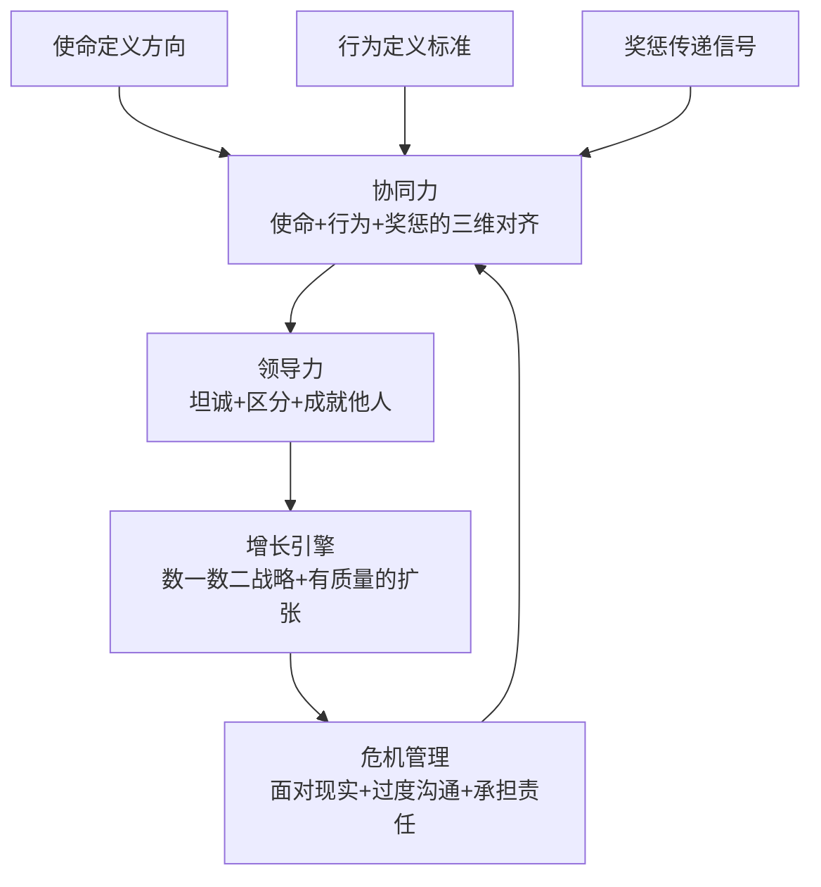
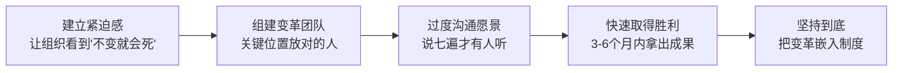

# 《商业的本质》深度读书笔记

> [!abstract] 全书速览
> 杰克·韦尔奇（1935-2020）被誉为"世界第一CEO"，执掌通用电气（GE）20年间将其市值从130亿美元推升至4000亿美元。2015年，他与妻子苏茜合著《商业的本质》（The Real-Life MBA），试图回答一个根本问题：**在真实的商业世界中，什么才是决定成败的关键？** 这不是一本学院派著作，而是一位经历过无数商战的老将把数十年实战经验蒸馏成的精华。全书围绕三个递进的核心展开：如何让组织上下一心（协同力）、如何成为有效的领导者（领导力与坦诚）、如何在竞争中持续获胜（增长与危机管理）。韦尔奇的管理哲学以"坦诚"和"区分"著称——直面现实、淘汰落后、奖励优秀，这种风格在商业史上影响深远，同时也引发了持续的争议。

---

## 核心命题

韦尔奇写这本书的背景，是他退休十余年后观察到的一个现象：商学院花大量时间教授战略分析和财务建模，但很多MBA毕业生走进真实企业后手足无措——真实世界中最难的不是制定战略，而是让战略落地；不是设计组织架构，而是让每个人都朝同一个方向发力。

> [!tip] 核心问题
> ==为什么有些公司能持续获胜，而有些公司慢慢衰败？== 韦尔奇的答案出人意料地简单：不是因为战略有多高明，而是因为执行。战略只占成功的10%，执行占90%。而执行的前提，是整个组织在同一个方向上发力——他称之为"协同力"。

这本书挑战了管理世界的几个常见假设：

**第一，"好人做好事"的管理幻觉。** 很多管理者认为只要对员工好，团队自然会有产出。韦尔奇说这是逃避——真正的领导力是敢于区分优劣、做出艰难决定，而不是做"老好人"。一个不敢给下属真实反馈的管理者，表面上是善良，实际上是在浪费对方的职业时光。

**第二，"战略最重要"的迷思。** 商学院教授花大量时间讨论战略框架——波特五力、BCG矩阵、蓝海战略——但再好的战略如果没有被组织上下真正理解和执行，就是废纸一张。战略制定可能只需几天，但让一个万人组织真正理解、认同并执行这个战略，需要数年。

**第三，"和谐就是好"的组织文化误区。** 很多公司追求表面和谐，避免冲突，鼓励所谓的"团队精神"。韦尔奇认为这恰恰是最大的问题——缺乏坦诚的组织无法发现问题、无法快速决策、最终被竞争对手打败。真正的团队精神不是和气一团，而是敢于在会议上激烈辩论、走出会议室后坚决执行。表面的和谐实际上是组织最昂贵的奢侈品——它让问题被掩盖、决策被拖延、平庸被默许，直到某天危机爆发时才发现一切都已无法挽回。

---

## 框架全景

韦尔奇的管理体系建立在三个相互支撑、层层递进的核心模型之上：

**持续获胜 = 协同力（地基） x 领导力（杠杆） x 增长引擎（目的）**

- **协同力是地基**。如果组织上下不在同一个方向上，再好的领导也是白费力气。协同力的核心是让使命不再是墙上口号，而是每个人每天做决策的依据
- **领导力是杠杆**。有了方向一致的组织，还需要有人去激发、推动和做艰难决定。韦尔奇的领导力不关于魅力或愿景，而关于三个实践：坦诚、区分、成就他人
- **增长是目的**。协同力和领导力最终服务于一个目标——让公司持续增长。不增长的公司本质上在衰亡，只是速度有快有慢

> [!note] 体系结构
> 如果你只看到"区分"和"淘汰10%"而忽略了协同力和领导力发展，就会把韦尔奇简化为一个冷血的绩效杀手。实际上他的体系远比这个标签复杂——它是一个使命、文化、人才和增长相互咬合的完整操作系统。

---

## 核心观点深度解读

### 观点一：协同力——让使命从墙上走进每个人心里

> [!note] 背景
> 韦尔奇发现，几乎每家公司都有使命宣言，但绝大多数只是墙上的装饰品。员工不知道、不理解、也不关心。真正的协同力要求使命、行为和奖惩三者完全一致——任何一个环节脱节，组织就会在"宣传的规则"和"真实的规则"之间产生裂缝。

协同力是韦尔奇管理体系的第一块基石。他对协同力的定义很具体：**让组织中的每个人都理解公司的使命、知道自己如何为使命做贡献、并在行为和奖惩层面感受到使命是真实的。**

问题出在三个环节：

**使命往往太抽象。** "成为行业领导者""为客户创造价值"——这类宣言说了等于没说。韦尔奇在GE提出的使命是"成为每个业务领域的第一或第二"——清晰到每个业务单元都能判断自己是否达标。好的使命有两个特征：任何员工都能用自己的话解释它；它能帮助员工判断"这件事该不该做"。

**使命没有转化为可观察、可评估的行为。** 使命再清晰，如果不被分解为具体的行为准则，也只是一个抽象的方向。韦尔奇在GE推行"4E+1P"——Energy（能量：你自己是否充满干劲？）、Energize（激励：你能否激励他人？）、Edge（魄力：你能否做出艰难决定？）、Execute（执行：你能否把事情做到？）、Passion（激情：你对工作是否发自内心地热爱？）——这不是虚泛的价值观宣言，而是可以具体评估的行为标准。在GE的人才评估中，业绩出色但缺乏"激励他人"能力的人不会被视为领导者候选人。他将使命（数一数二）和行为标准（4E+1P）直接嵌入绩效考核和薪酬体系——晋升和奖金不仅取决于业绩数字，也取决于是否体现了组织要求的行为方式。

**使命和奖惩脱节。** 如果使命说"鼓励创新"但犯错就被惩罚，员工很快会学到真正的规则是"别出风头"。韦尔奇强调：==奖励什么、惩罚什么，比任何口号都更能传达组织的真实使命。==

> [!example] GE的实践
> 韦尔奇上任后砍掉了大量无法成为行业前两名的业务——包括一些仍然盈利的业务。这传达了一个清晰信号：使命不是口号，而是真的会决定业务的生死。员工很快明白了"第一或第二"不是说说而已。
>
> 但后续也出现了问题：继任者们发现管理层把市场定义得越来越窄来满足"数一数二"要求——只要市场定义得够小，任何业务都是"第一"。这说明再好的使命也需要持续校准和迭代。

---

### 观点二：坦诚——组织效率的最大乘数

> [!tip] 核心洞察
> 坦诚是韦尔奇管理哲学的基石。他认为组织中最大的效率损耗不是来自流程冗余或资源浪费，而是来自一个看不见的成本：人们不敢说真话。

韦尔奇描述了大多数组织中的真实情况：

- 会议上没人说真话，真正的讨论发生在会后的走廊里
- 绩效评估成了"皆大欢喜"的仪式，真正的问题从不被讨论
- 领导者收到的都是过滤过的好消息，等问题暴露时为时已晚
- 员工有改进建议不敢提，因为"枪打出头鸟"

这种缺乏坦诚的文化造成的损失是巨大的：决策速度变慢（因为没人提供真实信息），问题被掩盖（因为没人敢指出问题），人才被埋没（因为没有真实的绩效反馈），创新被扼杀（因为没人敢挑战现状）。韦尔奇估计，缺乏坦诚让大多数组织损失了至少30%的效率。

韦尔奇推动坦诚文化的三个核心机制：

**群策群力会议（Work-Out）**。这是GE的标志性制度。来自不同层级的员工聚在一起，花两到三天讨论具体的业务问题。关键规则是：管理者在讨论阶段不在场（员工才敢说真话），但在最后阶段必须回来，当场对每一条建议做出明确回应——"同意，我们去做""不同意，原因是什么""需要更多信息，一个月内回复"。不能含糊其辞，不能说"让我回去想想"然后就没了下文。这个制度用结构化方式打破了层级对信息流动的阻碍，让基层声音直接到达决策者耳中。

**"没有惊喜"原则**。年终评估不应有任何意外。绩效反馈必须是持续的——每周一对一沟通、每月进展回顾、每季度正式评估。如果一个员工在年终才知道自己表现不好，那是管理者失职，不是员工问题。这个原则的深层含义是：管理者不能为了避免不舒服的对话而回避反馈，因为延迟反馈实际上是在剥夺员工改进的机会。

**奖励直言者，保护异见**。公开表扬那些敢于挑战现状、提出不同意见的人——即使意见最终没被采纳。韦尔奇要求高管团队在会议上公开辩论，鼓励下属挑战他的观点。如果说真话的人没有得到保护，坦诚文化就是空话。员工需要看到反复的证据——说真话不会被惩罚、管理者真的会听取不同意见——才会慢慢相信坦诚不是口号。

> [!warning] 边界条件
> 坦诚不等于粗鲁。"你的方案有三个漏洞"是坦诚，"你怎么这么蠢"是粗鲁。坦诚应该是建设性的——指出问题的同时提供改进方向。而且坦诚文化的建立需要时间——员工需要看到反复的证据（说真话不会被惩罚、好建议真的会被执行），才会慢慢相信这不是又一场管理层的"运动"。

---

### 观点三：区分——20-70-10法则的逻辑与争议

区分是韦尔奇最具争议也最具影响力的管理理念。他主张把员工分为三类：

- **前20%**：明星员工，给予最多的资源、奖励和发展机会
- **中间70%**：骨干员工，给予培训和发展机会，帮助他们进步
- **后10%**：需要离开的员工，坦诚反馈后请他们离开

韦尔奇为这个制度提供了一套完整的辩护逻辑：

**他认为这是最"仁慈"的做法。** 如果一个员工在你的公司表现持续不佳，与其让他在不适合的岗位上挣扎多年——绩效评估永远是"需要改进"，既不被解雇也不被提升——不如坦诚告诉他真相，让他有机会找到更适合的地方重新开始。虽然短期痛苦，但长期对那个人更好。

**他认为对低绩效者的"容忍"是对高绩效者的不公。** 前20%的人在拼命工作、创造价值，但他们看到表现最差的人也能安稳待着——如果努力和不努力的结果一样，优秀的人要么降低标准要么离开。韦尔奇说："没有什么比让一个低绩效者安然无恙地待在团队里更快地毁掉团队士气了。"

**他认为组织需要持续新陈代谢。** 每年淘汰10%意味着每年有10%的新鲜血液注入，带来新的想法、新的能量、新的视角。没有淘汰机制，团队会慢慢积累平庸者，最终拖垮整个组织。

> [!example] 实施前提
>
> | 维度 | 要求 | 说明 |
> |------|------|------|
> | 评估维度 | 多维度 | 业绩结果 + 行为表现 + 价值观契合 |
> | 评估透明度 | 全程透明 | 员工应知标准、获得及时反馈、有改进机会 |
> | 对后10%的态度 | 帮助而非惩罚 | 不等于"坏人"，可能只是位置不对 |

> [!warning] 这个制度的重大局限
>
> **可能扼杀合作**。排名是相对的，帮助同事意味着降低自己的排名。微软在使用强制排名期间（2000年代），工程师不愿加入优秀团队、不愿分享知识。
>
> **数字游戏**。如果团队整体优秀怎么办？管理者被迫在优秀的人中选出"最差的"。管理者可能操纵评估或跨团队"交易"名额。
>
> **短期主义**。员工理性地选择短期可见的项目，回避长期重要但不容易衡量的工作。
>
> **恐惧文化**。失败可能直接跌入后10%，不利于冒险和创新。韦尔奇一方面鼓励创新，另一方面用淘汰制度制造恐惧，两者存在内在张力。
>
> **后续发展**：微软2013年、Adobe同期、GE自身2016年都废除了强制排名。趋势是保留区分精神但采用更灵活的方式——持续反馈、个性化发展计划、更多维度评估。

---

### 观点四：领导力——不是关于你，而是关于他们

韦尔奇对领导力的定义：**在你成为领导者之前，成功是让自己变得更好；在你成为领导者之后，成功是让别人变得更好。**

他列出了领导者的五项核心任务：

1. **不断提升团队，把每次互动都当作评估和指导机会**。领导者最重要的工作是发展人才。每一次和员工的对话——无论是正式的一对一还是走廊里的闲聊——都是观察、反馈和辅导的机会。韦尔奇每年花大量时间在GE的"Session C"人才评估会议上——亲自参与对数百名高级管理者的评估和讨论。这不是走过场，而是他认为自己最重要的工作之一

2. **让员工看到愿景，并生动地描绘它**。愿景不能停留在PPT和备忘录里。领导者需要用故事、用例子、用画面感反复讲述——让每个人都能看到那个未来的样子并感受到吸引力。韦尔奇推广"无边界组织"概念时，不是发一份文件就完事，而是在每一次演讲、每一次会议、每一次与员工的互动中反复传达——直到它成为组织文化的一部分

3. **深入员工中间，传递积极能量和乐观精神**。领导者是组织能量的来源。如果领导者整天愁眉苦脸、充满焦虑，团队不可能有战斗力。韦尔奇以其充沛的能量和感染力闻名——但他强调这不是假装，你必须真正相信团队能赢，信心才能传递给他人

4. **建立信任——通过坦诚、透明和给予认可**。信任不是宣传出来的，而是一点一滴积累的。说到做到（不要承诺做不到的事）、承认错误（不要假装永远正确）、公开认可他人贡献（不要把功劳据为己有）。韦尔奇定期与基层员工直接对话，绕过层层汇报线，获得未经过滤的真实反馈——这既是获取信息的方式，也是建立信任的方式

5. **做出不受欢迎但必要的决定，并承担后果**。关闭亏损业务、解雇受欢迎但绩效不佳的管理者、否决团队全力推动但方向错误的项目——这些决定都不会让你受欢迎，但它们是领导者必须做的。韦尔奇说："领导力不是人气竞赛。总选让人高兴的选项，最终会让所有人不高兴"

> [!example] 韦尔奇的领导力实践
>
> | 领导行为 | 具体做法 | 效果 |
> |----------|----------|------|
> | 沟通愿景 | 提出"无边界组织"概念并反复传达 | 打破部门墙，促进信息流动 |
> | 建立信任 | 定期与基层员工直接对话 | 获得未经过滤的真实反馈 |
> | 艰难决定 | 上任初期大规模剥离非核心业务 | 短期痛苦，但组织更聚焦更健康 |
> | 发展人才 | 亲自参与Session C人才评估 | 确保最好的人在最重要的位置 |

==领导力的终极检验：你离开后团队比你在时更强还是更弱？如果你在时出色、走后崩溃，你不是领导者，只是控制者。== 但按此标准衡量韦尔奇自己——他退休后GE长期表现远不如在任时——这究竟说明继任者不够好，还是体系过于依赖他个人能力？

---

### 观点五：增长——不是目标，而是生存的前提

韦尔奇对增长有一个冷酷判断：**不增长的公司正在死亡，只是速度不同。**

这不是夸张。增长带来机会——新项目、新职位、新发展空间。增长吸引人才——优秀的人想去一个上升的平台，不想去一个停滞的组织。增长提供资源——有增量才能投资未来。增长创造动力——胜利的感觉本身就是最好的激励。反过来，停止增长的公司陷入存量博弈——部门为有限预算争吵、员工为有限晋升机会竞争、士气持续下滑、人才不断流失——这是一个负反馈螺旋，一旦开始就很难逆转。

他的增长框架包含两个层面：

**"数一数二"战略**。每个业务必须做到市场第一或第二，否则修复、出售或关闭。经济学逻辑：成熟市场中只有领导者能获得超额利润——他们有规模优势（成本更低）、品牌优势（定价能力更强）和网络优势（吸引最好的供应商和客户）。第三第四名只能打价格战，利润微薄。把资源分散在大量"还行"的业务上，等于用中等资源做中等事，结果是所有业务都不出众。执行这个战略需要极大的魄力——韦尔奇在任期间出售了大量看似赚钱但不是市场领导者的业务，换取的资源被投入到更有前途的领域。

**两条增长路径**。有机增长（创新、效率提升、市场份额扩大）更扎实但速度慢；并购增长可快速获取新能力或新市场但整合风险大——韦尔奇估计三分之二的并购未能创造预期价值。他主张两条腿走路，但强调并购必须服务于战略（获取现有能力无法快速建设的东西），而非为了规模而规模。

> [!warning] GE的教训
> 韦尔奇大力发展GE Capital（GE金融），一度贡献公司一半以上利润。当时被视为天才之举，但2008年金融危机中GE Capital差点拖垮整个公司。更深层问题是：金融高利润可能掩盖了制造业竞争力的下滑——当利润轻松来自金融杠杆，谁还有动力去啃制造业升级的硬骨头？==增长的质量和速度同样重要。建立在脆弱基础上的增长，可能只是为未来的危机积累能量。==

---

### 观点六：危机管理——假设最坏，但相信能更强

韦尔奇的危机管理框架建立在五个"悲观假设"之上：

1. **假设问题比你知道的更严重**——坏消息总是滞后，每层汇报者都有动机淡化
2. **假设世界上没有秘密**——隐瞒的事迟早被发现，而且通常在最糟时机
3. **假设你的处理会被最恶意地解读**——不要指望公众理解你的苦衷
4. **假设会有人因此流血**——危机总有代价，关键是控制在可承受范围内
5. **假设你会从危机中变得更强**——危机也是机会，暴露弱点、推动改革

> [!tip] 危机处理的核心
>
> | 错误做法 | 正确做法 |
> |----------|----------|
> | 淡化问题、拖延处理 | 面对现实、快速行动 |
> | 隐瞒、挤牙膏式披露 | 过度沟通、主动透明 |
> | 推卸责任、找替罪羊 | 承担责任、赢得信任 |
> | 寄望问题自行消失 | 从危机中学习、建立防复发机制 |

韦尔奇强调，公众和员工对诚实的领导者有很高的容忍度——你承认了问题，他们愿意给你时间修复；但如果你试图隐瞒然后被揭穿，信任就彻底崩塌了。

危机管理的最后一步是"从危机中学习"。危机暴露了什么系统性弱点？哪些流程需要改进？哪些人在危机中表现出了领导力，哪些人暴露了不足？如果不从每次危机中提取教训并建立防止复发的机制，同样的问题会再次发生。韦尔奇的态度是：浪费一次危机是不可原谅的——每次危机都应该让组织变得更强。

---

### 观点七：变革管理——为什么大多数变革都失败了

韦尔奇的经验是，大多数变革之所以失败，不是方向错了，而是推动方式有问题。变革失败的根本原因是人的抵抗——人类天生厌恶不确定性，现状虽不完美但可预测，变革意味着未知和恐惧。

他推动变革的五步法：

> [!example] GE的实践
> 韦尔奇在推动"六西格玛"质量管理变革时，将其与晋升和奖金直接挂钩——没有接受过六西格玛培训的人不能被提拔为高级管理者。这种"把变革嵌入制度"的做法确保了变革不会随着最初的热情消退而消亡。在推动全球化时，他带高管团队实地考察海外市场，让他们亲眼看到竞争对手已在海外攻城略地——用事实而非口号建立紧迫感。

> [!warning] 变革中的人员问题
> 韦尔奇对变革中的人事决策非常果断：对于经过充分沟通后仍明确反对变革的高管，他会请他们离开——因为一个反对变革的高管比十个支持变革的高管造成的破坏更大。抵抗变革的人通常不会公开反对，他们会用更隐蔽的方式对抗：拖延执行、选择性遵守新规则、在私下散布消极情绪。

---

### 观点八：人才选拔——如何识别真正的A类人才

韦尔奇认为人才选拔是领导者最重要也最容易犯错的决策领域。大多数招聘失败不是因为候选人能力不够，而是因为"匹配"出了问题——一个在A公司出色的人放到B公司可能完全失败。

他的评估框架（4E+1P）之外，还强调了两个最难评估的维度：

- **真实性**：面试中展现的是真实自己还是包装形象？多做背景调查，通过非正式渠道获得坦诚评估，"看人做事"比听人说话更可靠
- **成长潜力**：未来更大舞台上还能出色吗？关键看好奇心、学习能力和韧性——这些底层素质很难后天培养

> [!warning] 两种常见选人错误
> **光环效应**：一个人在某方面出色，就假设他在所有方面都出色。一个销售冠军不等于好的销售经理——个人贡献能力和团队领导能力是完全不同的技能。
>
> **舒适度偏差**：选择和你相似的人让你感觉舒服，但会让团队缺乏多样性。韦尔奇主张有意识地建设多样化团队——不同背景、不同思维方式的人组合在一起，虽然管理更费力，但创造力和决策质量更高。

---

## 这本书的保质期

《商业的本质》写于2015年，韦尔奇的核心管理经验来自1981-2001年执掌GE的时期。二十多年过去了，哪些观点经受住了时间检验，哪些需要调整？

**跨时代的智慧：**

- **协同力的重要性**。让组织上下一心在任何时代都成立，远程工作时代可能更甚
- **坦诚文化**。信息流动更快的今天，隐瞒空间越来越小。Netflix、桥水等公司用不同方式印证了这一理念
- **领导力是成就他人**。无论在工业时代还是知识经济时代，这一点从未改变

**需要调整的观点：**

- **强制排名/淘汰10%**。知识经济时代副作用更明显——扼杀合作、制造恐惧。趋势是保留区分精神但采用持续反馈、个性化发展等更灵活方式
- **"数一数二"战略**。行业边界模糊、跨界竞争频繁的今天，"市场"定义本身在不断变化，这个策略可能限制对新机会的想象力
- **对金融化的态度**。GE Capital的后续发展证明过度金融化的风险。2018年GE被踢出道琼斯指数，2021年宣布拆分

> [!warning] GE的后续表现
> 韦尔奇离开后，GE表现持续下滑——金融业务成为重大负担，市值大幅缩水，最终宣布拆分为三家公司。这不意味着韦尔奇所有做法都是错的，但它确实提出了一个根本问题：这套管理体系是可以制度化传承的，还是必须依赖一个"超级CEO"才能运作？如果是后者，其可推广性就大打折扣。

---

## 不同观点怎么说

- **德鲁克**强调"做正确的事"（effectiveness），韦尔奇更强调"把事做正确"（efficiency+execution）。两者并不矛盾，但韦尔奇的判断是大多数公司的瓶颈不在战略而在执行。德鲁克可能会回应：如果方向错了，执行越好可能走得越远越偏
- **柯林斯**（[[《从优秀到卓越》]]）描绘了"第五级领导力"——谦逊、坚定、成就团队。韦尔奇的风格更为外向和直接。但两者有共同核心：伟大的领导者不是英雄式个人表演者，而是让整个组织发挥最大潜力的催化剂
- **麦考德和Netflix文化**代表了"后韦尔奇"时代的人才管理。Netflix也强调坦诚和高绩效标准——"只留住你会拼命挽留的人"——但没有强制排名，用"充足遣散费"代替"每年淘汰10%"，保留区分精神但减少恐惧文化副作用
- **明茨伯格**一贯批评MBA教育过于关注分析而忽视实践智慧。韦尔奇呼应了这一批评——他反复强调实战经验比理论模型更重要。但讽刺的是，他自己的一些理念（如20-70-10法则）也被后来的管理者当作教条执行
- **达利欧**（[[《原则》]]）把韦尔奇的"坦诚"推向更极端方向——"极度透明"和"极度开放"。桥水几乎所有会议被录音，分歧通过"可信度加权投票"解决。这是韦尔奇理念的逻辑延伸，但也暴露了极度透明可能创造无处不在的监控感而非真正开放氛围的风险

---

## 行动工具箱

### 工具1：协同力诊断三问

随机问三个团队成员：
1. 我们的核心目标是什么？
2. 你的工作如何支持这个目标？
3. 如果你做了一件和目标一致/冲突的事，分别会发生什么？

如果答案不一致，你有协同力问题。重点关注第三个问题——它揭示的是组织的真实激励机制，而非宣传的使命。韦尔奇的标准是：如果员工不能用自己的话解释组织的核心目标，目标就不够清晰；如果目标不能帮助员工判断"这件事该不该做"，目标就不够具体。

### 工具2：领导力自检清单

每周问自己：
- [ ] 这周我帮助了哪个团队成员成长？具体怎么帮的？
- [ ] 我是否给出了坦诚的反馈？还是为了"和谐"回避了难题？
- [ ] 我是否做了一个艰难但正确的决定？还是推迟了？
- [ ] 我的团队是否清楚知道优先级是什么？
- [ ] 我是否在传递积极能量，还是在传播焦虑？

### 工具3：人才区分矩阵

| | 业绩低 | 业绩中 | 业绩高 |
|---|--------|--------|--------|
| **潜力高** | 投资发展 | 重点培养 | 加速提拔 |
| **潜力中** | 辅导改进 | 稳定保持 | 拓展发展 |
| **潜力低** | 坦诚对话 | 观察调整 | 持续激励 |

对团队成员做一次诚实定位。对于需要"坦诚对话"的人，问自己：我是否给过明确反馈？我是否尽到了帮助他们的责任？注意：这个矩阵的目的不是机械地给人贴标签，而是帮助你有意识地为不同情况的团队成员制定不同的发展计划。韦尔奇的核心观点是：对所有人一视同仁不是公平，而是对优秀者的不公——真正的公平是根据每个人的表现和潜力给予相应的关注和资源。

### 工具4：业务组合评估

| | 市场领先 | 市场落后 |
|---|----------|----------|
| **增长市场** | 加大投资，巩固领先 | 评估修复成本，决定投入或退出 |
| **成熟市场** | 保持/收割，优化利润 | 果断退出，释放资源 |

审视你负责的业务或项目：资源是否分散在太多"还行"的方向上？有没有应该果断放弃的业务？韦尔奇的原则是：把资源集中在少数能赢的领域做到极致，远好于用中等资源做中等的事。放弃不是失败，是为了赢在更重要的地方。

### 工具5：危机预演

每季度花一小时做"假如"练习：
- 假如最重要的客户明天离开，我们怎么办？
- 假如核心员工被竞争对手挖走，谁能接替？
- 假如明天出现一条关于我们的负面新闻，沟通方案是什么？
- 假如主要供应商突然断供，替代方案在哪里？

提前想过的危机，真正发生时不会那么措手不及。韦尔奇的原则是：你无法预防所有危机，但你可以确保组织面对危机时有肌肉记忆而非手足无措。

---

## 延伸阅读

- [[《赢》]]：韦尔奇的另一本管理经典，比《商业的本质》更系统。如果只读一本韦尔奇，读这本
- [[《从优秀到卓越》]]：柯林斯研究了持续卓越的企业，他的"第五级领导力"和韦尔奇的领导风格形成有趣对照——谦逊低调型 vs 魅力外向型，两种模式都能成功
- [[《奈飞文化手册》]]：坦诚文化的另一种实现方式——没有强制排名，但有极度透明和"只留住成年人"的高标准
- [[《原则》]]：达利欧版的"坦诚与区分"——桥水的"极度透明"是韦尔奇理念的逻辑延伸，但也暴露了推到极端时的问题
- [[《卓有成效的管理者》]]：德鲁克强调"做正确的事"，韦尔奇更强调"把事做正确"。两者互补阅读可以看到管理的完整图景
- [[《基业长青》]]：柯林斯早期作品，研究了历经百年仍然卓越的企业。他的"利润之上的目标"和韦尔奇的"增长是生存前提"形成有趣张力——两者都对，但侧重点不同。对照阅读有助于思考短期绩效和长期愿景之间的平衡
