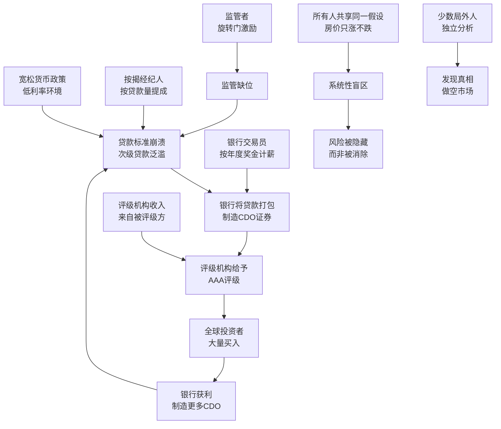
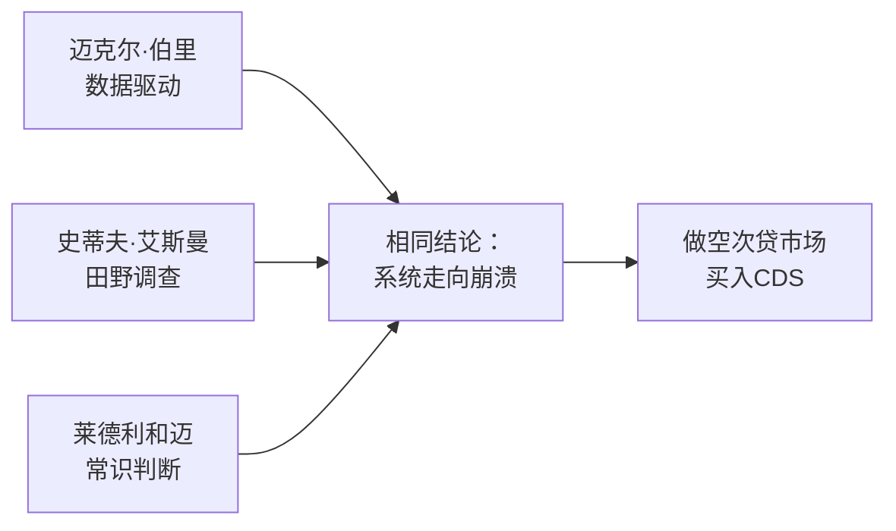

# 深度读书笔记

> [!abstract] 全书速览
> 2010年出版的《大空头》是迈克尔·刘易斯对2007-2008年美国次贷危机最具洞察力的非虚构叙事。刘易斯追踪的不是监管者和银行CEO，而是另一群人：在整个金融体系走向崩溃时提前看到灾难、敢于与整个市场对赌的少数局外人。通过迈克尔·伯里、史蒂夫·艾斯曼、格雷格·李普曼、查理·莱德利和杰米·迈的视角，刘易斯揭示了一个核心真相：==次贷危机不是一场意外，而是激励扭曲、认知失明和结构性脆弱共同作用的必然产物。每个个体都在理性地追求自身利益，但这些理性的总和是集体的疯狂。==这本书不仅是一部金融史的杰作，更是一份关于制度性失明和系统性风险的深度诊断报告。

## 核心命题

刘易斯要回答的根本问题是：==为什么整个金融系统都看不到少数局外人看到的东西？这个"系统性失明"是怎么发生的？==

> [!tip] 核心判断
> 当一个系统中所有参与者的激励都指向同一个方向时，系统就丧失了纠错能力。看穿骗局的人不是因为更聪明，而是因为他们更少受到系统激励的约束——因性格、因立场、因经历——从而保留了独立判断的能力。

这不是一个纯粹的金融问题。它触及了更根本的议题：在高度复杂、高度专业化的现代社会中，认知如何被制度、激励和群体动力学所塑造——甚至扭曲。美联储主席伯南克在2007年初还公开声称次贷问题"不太可能蔓延"，华尔街最精密的风险模型没有预见自家资产负债表上酝酿的灾难。而几个性格古怪的局外人——通过阅读公开文档和运用常识——早在两三年前就看到了崩溃的必然性。

刘易斯本人有理解这个问题的独特视角。他在1980年代曾在所罗门兄弟公司做债券销售员——正是所罗门兄弟在1970年代末率先将住房抵押贷款打包成证券出售，开创了整个抵押贷款证券化市场。二十多年后，他亲眼见证诞生的金融工具引发了人类历史上最严重的经济灾难之一。他追问的方式不是去采访那些"犯了错的人"，而是去找到那些"看对了的人"——因为理解少数人如何超越系统的蒙蔽看到真相，比分析系统的失败本身更有价值。

## 核心框架

> [!note] 三层因果结构
> 次贷危机的因果链分三个层次：
> 1. **产品层面的复杂性陷阱**：CDO打包技术让风险被重新包装成看似安全的产品，==复杂性不是解决了风险，而是隐藏了风险==
> 2. **激励层面的系统性扭曲**：从贷款经纪人到银行到评级机构到监管者，每个人的激励都指向"继续制造更多CDO"，没有人的激励指向"停下来检查风险"
> 3. **认知层面的群体锁定**：所有人共享"房价不会跌"的假设，当共识足够强大时，它从可检验的假说变成了不容置疑的信条
>
> 三个层次相互强化：复杂性让风险难以被看到，激励让人们不愿去看，共识让人们认为没必要去看。

## 核心观点深度解读

### 一、次级贷款的源头腐烂

> [!example] 贷款标准的崩溃历程
> - **2003年前**：正常贷款标准，信用不好的人被拒贷——风险管理在发挥作用
> - **2003-2004年**："低文档贷款"出现——借款人不需要完整收入证明
> - **2004-2005年**："无文档贷款"泛滥——完全不需要证明有收入
> - **2005-2006年**：出现"NINJA贷款"（No Income, No Job, No Assets）——没收入、没工作、没资产的人也能拿到几十万美元住房贷款
> - 大量贷款采用"可调利率"——前两三年利率极低（引诱利率），之后大幅跳升。借款人在引诱利率下就已勉强度日

迈克尔·伯里是第一个系统性地钻进这些贷款文档里的人。他是自学成才的投资者，之前是神经外科住院医师，一只眼睛在儿时因癌症被摘除，患有阿斯伯格综合征。从2004年开始，他花数月时间逐笔阅读次级抵押贷款原始文档——每一份贷款的借款人信息、收入状况、还款条件。

> [!warning] 常识是华尔街最稀缺的东西
> 伯里不需要任何复杂的数学模型。他需要的只是基本的阅读能力和常识：这些人还得起钱吗？答案显然是否定的。但整个华尔街没有第二个人愿意做这件枯燥的"脏活"。==所有信息都是公开的——真正稀缺的不是信息，而是独立处理和判断信息的意愿。==

银行之所以疯狂放贷，是因为它们发现了一个暴利模式：把贷款发放后立即打包卖给投资银行，自己不承担任何长期风险。既然风险可以转嫁，为什么不多放点？这种"发起-分销"模式彻底切断了贷款发放者和贷款风险之间的联系。

> [!note] "发起-分销"模式的深层问题
> 传统银行模式下，银行自己持有贷款，因此有强烈动力审核借款人的还款能力——坏账直接影响自己的利润。但在"发起-分销"模式下，银行只是贷款的"流水线"：放贷、打包、卖出——越快越好、越多越好。质量控制从利润的保障变成了利润的障碍。这个模式的扭曲之处在于：==它让风险的制造者和风险的承担者完全分离==。放贷机构不承担违约风险，投资银行把贷款打包后也不持有，评级机构只出评级不承担后果——最终的风险落在了购买CDO的机构投资者身上，而这些投资者往往是管理退休金和养老金的机构，最终损失由普通储户承担。

### 二、CDO炼金术：复杂性如何掩盖风险

CDO（担保债务凭证）是次贷危机的核心金融工具。它的原理是把成百上千份次级贷款打包成资产池，然后将现金流切分成不同档次按风险分层出售。

> [!tip] 评级的致命假设
> 评级机构的模型建立在一个核心假设之上：==不同地区的房价走势是不相关的==。如果加州房价跌了，佛罗里达不一定跌。所以只要贷款在地域上足够分散，优先级部分确实安全，值得AAA评级。
>
> 这个假设在过去几十年大致成立——因为房价上涨由真实经济基本面驱动。但到2003年以后，房价上涨的驱动力变了：不再是收入增长和人口迁移，而是贷款标准的全面崩溃。当全国贷款标准同时崩溃，全国违约也会同时发生——地域分散根本起不到保护作用。

更荒谬的是"CDO的CDO"（CDO-squared）：当CDO中最难卖的夹层级卖不出去时，银行把这些夹层级再次打包成新的CDO，再次拿到AAA评级。每一层包装都在远离真实风险，每一层评级都在制造安全的幻觉。

还有一种更极端的产物："合成CDO"。传统CDO至少持有真实贷款——合成CDO里面连真实贷款都没有，完全由CDS合约构成，本质上就是一群人对另一群人下注。这意味着理论上可以对同一批贷款创造出无限多的合成CDO——实际损失可能只涉及1000亿美元的贷款，但围绕这些贷款的合成CDO可能价值数万亿美元。==杠杆通过合成CDO被无限放大，这就是为什么最终的损失远远超过了次级贷款本身的规模。==

> [!warning] 没有人审视全局
> 理解CDO的运作方式，你就理解了为什么这场危机不是某个人的错误，而是系统性的错误。没有人的职责是审视全局——按揭经纪人负责拉客户，银行负责打包，评级机构负责评级，投资者负责买入。每一环在隔离状态下看都有其"合理性"，但把整条链串起来，合理性就变成了荒谬。

### 三、激励决定认知：系统性自愿失明

> [!warning] 产业链上每个人的激励都指向同一方向
> - **按揭经纪人**按贷款数量提成——工作是让人签字，不关心能否还钱
> - **银行**将贷款打包卖出后不承担风险——发放越多越好
> - **评级机构**收入来自被评级方——给差评就失去客户
> - **银行交易员**按年度奖金计薪——今年有利润就够了，三年后爆雷与己无关
> - **监管者**走"旋转门"——退休后去华尔街工作，对未来雇主太严厉没好处
>
> ==当系统中每个人的激励都指向"让泡沫继续"时，系统就丧失了纠错能力。==

艾斯曼的愤怒正是源于此：不是人们看不到问题，而是人们不愿意看到——因为看到问题没有好处。这不是个人道德的失败，而是制度设计的失败。整条产业链上每个人都在做对自己理性的事情，但理性行为的总和是一场正在慢慢展开的灾难。

### 四、评级机构：信任链条上最脆弱的环节

没有穆迪、标普和惠誉的AAA评级，CDO就无法卖给养老基金、保险公司和外国央行——这些机构通常被法规要求只能投资于"投资级"证券。评级机构是整个信任链条的核心节点。

> [!example] 评级机构的制度性缺陷
> - 收入来自被评级方——如同让学生给考试出钱
> - 银行可以在三家评级机构之间选择——穆迪拒绝给AAA，就把业务给标普
> - 分析师薪资远低于华尔街，最优秀的人跳槽到投行——去评级自己之前评过的产品
> - ==评级模型从未更新以反映贷款标准的急剧恶化==——更新意味着降级，降级意味着失去业务

这是"激励决定认知"的最纯粹体现。这些分析师不是笨人——他们有数学和金融的高级学位。他们的失败不是智力上的，而是制度性的。当你的收入取决于给出某个特定结论，你就很难给出相反的结论。

> [!note] 评级机构的准官方地位
> 评级机构的问题有更深的制度根源。SEC将穆迪、标普和惠誉认定为"国家认可的统计评级组织"（NRSRO），大量金融法规要求机构投资者只能持有被NRSRO评为"投资级"的证券。==评级不仅是一种意见，更是一种监管许可证==——没有AAA评级，CDO无法进入最大的资本池。这种制度安排把评级机构推上了一个它们实际上无法胜任的位置：既是市场的"守门人"，又是市场参与者的付费服务商。
>
> 危机后的调查揭示：穆迪内部邮件显示分析师私下清楚CDO评级的问题——有人写道"即使被奶牛结构化，我们也能给它评级"——但管理层压制了这些担忧。结构化金融评级在穆迪收入中的占比从2000年的不到30%增长到2006年的超过50%，利润率远高于传统企业债券评级。没有哪个管理层会主动放弃这块业务，即使它意味着给垃圾打上黄金标签。

### 五、做空者的三条路径

**伯里的路径**：逐笔阅读原始贷款文档，从数据层面发现借款人根本无力偿还。他的阿斯伯格综合征让他对社会共识天然免疫，能够长时间沉浸在枯燥的文档分析中。

**艾斯曼的路径**：通过实地调查和面对面交谈，理解产业链上每个环节的激励结构如何扭曲。他在拉斯维加斯证券化论坛上亲眼看到——保姆拿到多套房贷款、脱衣舞娘名下五套房——放贷机构完全不关心还款能力。

**莱德利和迈的路径**：在伯克利车库里用30万美元运营小基金，投资哲学极其简单——寻找市场严重低估极端事件发生概率的机会。他们的常识判断是：==当任何人都可以毫无门槛地获得贷款时，大量违约只是时间问题。==

> [!note] 局外人的共同特征
> 这些人的共同点不是更高的智商，而是==更少的束缚==。伯里因阿斯伯格综合征对社会共识免疫；艾斯曼性格尖锐，从不在意别人看法；莱德利和迈没有金融背景，没被行业集体认知塑造。看到真相需要的不是特殊信息，而是独立分析信息的意愿和能力。

### 六、漫长的等待：正确但过早的痛苦

伯里从2005年开始买入CDS，但市场崩溃直到2007年下半年才开始。两年多的时间里，他每月支付巨额保费，基金账面持续下降，投资者纷纷要求赎回。他动用投资协议中的"门"条款强制留住资金，导致与投资者全面交恶。

> [!example] 伯里的煎熬时间线
> - **2005年**：开始大量买入CDS，华尔街嘲笑他"疯了"
> - **2006年**：房价仍在上涨，基金因CDS保费支出持续亏损，投资者开始焦虑
> - **2006年底-2007年初**：多名投资者要求赎回，伯里动用"门"条款阻止赎回，引发投资者的法律威胁和公开抗议
> - **2007年中**：次贷违约开始上升，但CDO价格仍异常坚挺——华尔街做市商在人为维持报价
> - **2007年下半年-2008年**：市场终于崩溃，伯里基金获得超过700%的回报，为投资者赚取超过7.5亿美元

伯里的经历揭示了对冲基金的一个深层悖论：最需要长期视角的投资策略，往往最难获得长期资金的支持。他用一种结构上对他不利的工具（开放式基金）去执行一种需要极长时间跨度的策略（做空尚未崩溃的泡沫）。他最终成功了，但代价是彻底毁掉了和投资者的关系。

> [!warning] "正确"和"赚钱"之间的鸿沟
> 你对基本面的判断可能完全正确，但市场不按基本面运行——至少短期内不会。即使次贷违约率已在上升，CDO价格仍异常坚挺——评级机构迟迟不下调，交易所估值依赖银行自我报告，做市商有动力维持高报价以避免自身减值。
>
> ==凯恩斯的警告在此得到最生动的演绎："市场保持非理性的时间可能比你保持偿付能力的时间更长。"==

### 七、崩溃与余波

2007年春天次贷违约率快速上升。6月贝尔斯登旗下两只对冲基金崩溃，8月法国巴黎银行冻结三只次贷基金。随后一年灾难以多米诺骨牌方式展开：贝尔斯登倒闭、雷曼破产、AIG需要850亿美元政府救助、全球信贷市场冻结。

伯里的基金最终获得超过700%的回报。莱德利和迈的30万美元变成超过1.3亿美元。艾斯曼的基金也获得了巨额收益。但获利后的情绪不是欢庆——艾斯曼感到的是"空虚"，伯里几乎完全退出公众视野，对华尔街彻底失望。

这场危机的最终代价是惊人的：美国约900万个家庭失去住房或面临止赎，失业率从4.4%飙升至10%，全球经济损失估计超过22万亿美元。而制造危机的华尔街银行，在获得纳税人数千亿美元救助后，不到两年就恢复了利润和奖金。==没有一个华尔街高管因此入狱。==这种不对称——风险由全社会承担，利润由少数人享有——正是全书最令人愤怒的主题。

> [!example] 做空利润的来源
> 做空者赚到的钱从何而来？直接来源是卖出CDS的金融机构——主要是华尔街投行和AIG。AIG的金融产品部门卖出了面值超过5000亿美元的CDS，因为他们认为次贷违约概率极低——把保费视为"白赚"的钱。当违约真的发生时，AIG无力赔付，美国政府出手850亿美元救助——做空者的利润有很大一部分最终来自纳税人的钱。

### 八、做空的道德困境

> [!note] 一个无法回避的问题
> 做空者的利润直接对应着数百万普通人的破产、失业和流离失所。从市场逻辑看，做空是纠错机制的一部分——没有做空可能，泡沫会更大，崩溃更惨。但从人文角度看，==从他人的灾难中获利——即使你不是灾难的制造者——仍然是一个真实的道德困境==。
>
> 更深层的问题是：一个需要灾难才能被纠正的系统本身就是有病的。做空者的巨额利润，本身就是系统失败的度量衡——如果常规纠错机制（监管、审计、评级）正常运作，泡沫不会膨胀到需要崩溃来纠正的程度。

### 九、格雷格·李普曼：系统内部的套利者

格雷格·李普曼是德意志银行的CDO交易员，他不是局外人——他是华尔街的内部人士，看到了做空次贷的机会并在华尔街四处推销这个策略。

> [!note] 两种不同的做空动机
> 李普曼代表了一种完全不同的参与者类型：他不关心系统是对是错，只关心定价是否正确。在他看来，CDS保费相对于次贷违约的真实概率来说太便宜了——这是一个定价错误，而定价错误就是利润机会。他不是在做道德判断，他是在做套利。

李普曼的故事揭示了华尔街内部的荒谬：他在德意志银行推动做空次贷的同时，银行其他部门还在疯狂制造和销售CDO。左手做空，右手做多——同一家银行对同一种资产持有完全相反的头寸。这种状况存在的原因是大型投行内部结构高度割裂，不同部门之间的信息和利益不互通。

> [!warning] 内部分裂的致命后果
> 当市场崩溃时，银行发现自己的净头寸远比以为的更不利——不同部门之间的对冲远没有想象中完美。一个交易员的清醒不能拯救一家银行的集体昏睡。李普曼最终获得了据报道超过4700万美元的年度奖金，但德意志银行整体在次贷危机中遭受了巨额损失。

### 十、CDS：做空工具与定价不对称

信用违约掉期（CDS）是整个做空策略的基础工具。它本质上是一种保险合同——买方定期支付保费，如果标的债券违约，卖方赔偿损失。关键特性是：你不需要持有标的债券就可以购买CDS，这意味着可以纯粹出于投机目的做空。

> [!tip] 做空的不对称结构
> CDS对做空者来说有一个关键的不对称性：
> - **损失是有限的**：每年支付的保费（通常是标的面值的1-2%）
> - **收益是巨大的**：如果CDO违约，可以获得面值与市值之差的全部赔偿
>
> 这种"有限损失、潜在巨大收益"的结构吸引了莱德利和迈这样的小资金玩家——他们用30万美元通过CDS撬动了远超自身规模的押注。市场对次贷违约的概率几乎定价为零，因此CDS保费极其便宜——==这相当于花几分钱买到了几百元面值的灾难保险。==

## 叙事技巧

刘易斯把一个极其复杂的金融事件讲成引人入胜的故事，关键在三个叙事选择：

1. **以人物驱动叙事**：CDO、CDS这些抽象术语通过伯里阅读文档、艾斯曼在论坛上对质、莱德利在车库里计算回报等场景获得了肉身
2. **善用类比和幽默**：CDO是"掺了毒药的香肠"，CDO-squared是"用狗屎做的狗屎"——粗糙但有效的比喻让最复杂的金融工程一目了然
3. **保持新闻记者的节制**：不把做空者简单英雄化，不把银行家简单妖魔化，呈现灰色世界——每个人都在激励驱动下做出"理性"选择，理性选择的总和是灾难

## 与其他著作的对话

- [[《黑天鹅》]]（塔勒布）：从认识论和概率论角度解释为什么极端事件被系统性低估。伯里和莱德利本质上就是塔勒布所说的"反脆弱"投资者——承受小的确定性损失来押注大的不确定性收益
- [[《大而不倒》]]（索尔金）：聚焦雷曼倒闭后的紧急救市，视角自上而下。《大空头》讲的是"灾难前为什么没人灭火"，两者互补构成最完整的叙事
- 明斯基"金融不稳定假说"：==稳定内生地产生不稳定==——长期平稳让参与者放松警惕、加大杠杆，从对冲型融资转向投机型再转向庞氏型。次贷危机是明斯基理论的教科书级验证
- [[《疯狂、恐慌与崩溃》]]（金德尔伯格）：梳理几百年金融泡沫的共同模式——次贷危机完美重复了信用扩张、投机狂潮、恐慌崩溃的古老循环

## 对你意味着什么

> [!tip] 对投资者
> 1. ==独立验证是最被低估的投资能力==——伯里读的所有文档都是公开的，他的优势在于愿意做"脏活"。在信息过剩的时代，真正稀缺的不是信息本身，而是独立处理和判断信息的意愿
> 2. 当你无法解释一个投资产品的风险来源时，你正在承担你无法量化的风险。复杂性服务于透明度时是好的，掩盖透明度时是危险的。CDO的复杂性很大程度上是刻意制造的——让买方无法独立评估
> 3. "历史上从未发生过"不是安全的证据——它可能只说明你的样本太短或者驱动过去趋势的条件已改变。过去二十年房价没跌，不是因为有什么魔法，而是因为贷款标准没有崩溃
> 4. 对模型保持怀疑——拥有最精密风险模型的机构（高盛、花旗）遭受了最大损失，而伯里的"模型"只是阅读文档加基本算术。==真正危险的不是没有模型，而是对模型的盲目信任==
> 5. 理解"正确"和"赚钱"之间可能隔着漫长的痛苦等待。伯里从2005年做空到2007年才获利，期间承受了巨大压力。即使你的判断完全正确，市场短期内也不一定按基本面运行

> [!tip] 对管理者
> 1. 审计你组织的激励结构——如果销售团队只按销量提成而不承担长期后果，你就在复制次贷产业链的激励结构。真正有效的激励设计应该让每个人分担他们行为的长期后果
> 2. 每增加一层复杂性都会增加信息损失——当产品或流程复杂到你自己都无法理解时，你不是在展示精密，而是在制造看不见的风险
> 3. 制度性地保护异见者——不是口头鼓励"挑战权威"，而是在制度上保障提出不同意见的人不受惩罚。考虑设立"红队"制度——专门指定一组人来挑战组织的主流判断
> 4. 警惕"发起-分销"模式的变体——当一个人或部门可以把自己行为的后果完全转嫁给其他人时，问题就在酝酿。检查你的业务中是否存在类似的"责任链断裂"
> 5. 不要被行业共识催眠。==当所有人都说某件事不可能发生时，恰恰是最需要质疑的时候。==真正应该关心的不是"过去发生了什么"，而是"导致过去结果的条件是否仍然成立"

## 批判性反思

> [!warning] 这本书的边界
> 1. **幸存者偏差**：书中做空者都成功了，但多少人做出类似判断却在等待中破产？伯里2005-2007年的煎熬只因最终成功才显得壮烈
> 2. **制度分析不足**：倾向于把问题归因于个人贪婪和愚蠢，对制度深层原因讨论不够——为什么金融监管碎片化？为什么评级机构有准垄断地位？这些比"银行家太贪"更根本
> 3. **去监管化背景缺失**：1999年《格拉斯-斯蒂格尔法案》废除和2000年《商品期货现代化法案》为危机创造了制度条件，但书中分析不足
> 4. **叙事倾斜**：虽非简单英雄化，但同情心明显偏向做空者。这些人没有试图阻止危机——他们选择了从中获利

## 延伸阅读

- [[《黑天鹅》]]：从理论层面解释为什么人类系统性低估极端事件，与《大空头》的案例形成理论-实践互补
- [[《大而不倒》]]：从权力高层视角补全《大空头》的叙事，聚焦危机后的紧急救市
- [[《说谎者的扑克牌》]]：刘易斯成名作，讲述80年代华尔街债券交易文化，次贷危机的种子在几十年前就已播下
- [[《疯狂、恐慌与崩溃》]]：几百年金融泡沫的共同模式，人类在金融领域犯的错误有惊人的重复性
- [[《非理性繁荣》]]：席勒从行为经济学角度分析资产泡沫的形成机制，提供理解群体狂热的理论框架
- [[《这次不一样》]]：八百年金融危机史的数据证明，每次危机前人们都认为"这次不一样"
