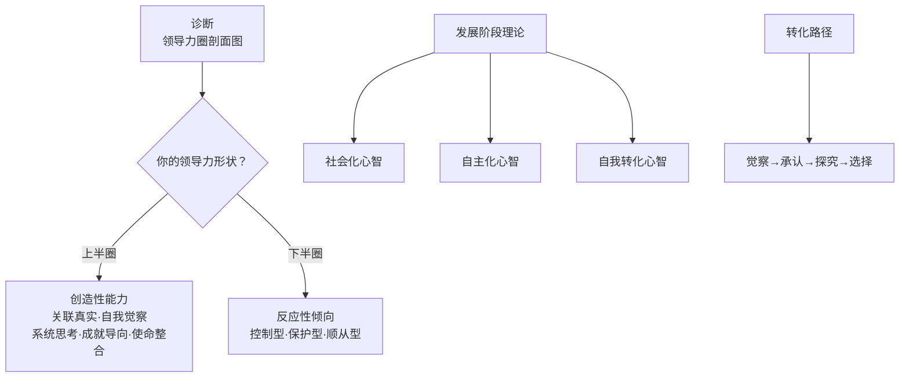

# 《孕育青涩领导力》深度读书笔记

> [!abstract] 全书速览
> 大多数领导者面临的真正瓶颈不是缺少技能，而是内在的=="操作系统"==版本太低。安德森和亚当斯用超过两百万份360度评估数据证明了一件事：领导力效能的天花板，不是由你学了多少管理工具决定的，而是由你内在的==心智发展水平==决定的。从"反应性"到"创造性"的跃迁，才是领导力发展的真正战役。

## 核心命题

这本书回答的根本问题是：为什么大量的领导力培训投入没有带来相应的领导力效能提升？

> [!tip] 核心洞见
> 技能是"应用程序"，心智结构是"操作系统"。一台跑着过时操作系统的电脑，装再多新软件也发挥不出来。大部分企业的领导力培训预算可能花在了错误的方向上——升级的是应用程序而非操作系统。

传统领导力培训的逻辑是"技能堆叠"：沟通技巧不好学沟通，决策能力不足学决策。隐含假设是领导力等于技能的总和。安德森和亚当斯说：一个内在被恐惧驱动的领导者，学再多技巧也不会变成真正有影响力的领导者——因为他的操作系统会把每个学到的技能都扭曲成服务于自我保护的工具。

## 框架全景

三个层次环环相扣：先用剖面图看清现状，再用发展阶段模型理解自己处于什么位置，最后用转化路径推动升级。==诊断是起点，发展理论是地图，转化实践是路径。==

## 核心观点深度解读

### 反应性领导vs创造性领导

安德森和亚当斯把领导力行为分成两大类。一类是"反应性"的——行为看起来像在做领导，但驱动力是恐惧。另一类是"创造性"的——由内在愿景和价值观驱动，关注可能性而非威胁。

> [!warning] 压力下的暴露
> 反应性领导在压力不大时可能看不出问题。但当压力升高——业务危机、组织变革、团队冲突——反应性模式就会被激活，恰恰在最需要创造性领导的时刻，你却退回到自我保护的模式里。

**三种反应性模式：**

- **控制型**：核心恐惧是失控。微观管理、完美主义、独断专行。短期能推动结果，但压制团队创新，形成过度依赖
- **保护型**：核心恐惧是被攻击。防御、批评、傲慢。组织信任走低，政治博弈取代坦诚合作
- **顺从型**：核心恐惧是被拒绝。讨好、过度承诺、回避冲突。人缘好但缺乏方向和影响力

**五个创造性维度：**

1. ==关联真实==：真诚沟通、表达脆弱、建立深度信任
2. ==自我觉察==：了解优势、盲点和触发模式
3. ==系统思考==：看到长期影响和非预期后果
4. ==成就导向==：挑战性目标+信任团队
5. ==使命整合==：个人使命与组织愿景深度连接

### 成人发展三阶段

> [!note] 凯根的建构性发展理论
> 发展不是知识的增加或技能的提升，而是心智结构本身的转变——你组织经验、构建意义的方式发生了质的变化。每一次阶段跃迁，本质上是把原来控制你的东西变成你能够审视和管理的东西。

**社会化心智：** 身份认同来自外部认可。优秀的执行者，但在需要独立判断时犹豫。效能评分约第40-50百分位，反应性占65%。

**自主化心智：** 建立了独立的价值观和内在罗盘。能推动变革、做艰难决策。效能评分约第60-70百分位，反应性降到45%。但可能过于坚持己见，难以吸收不一致的信息。

**自我转化心智：** 能审视自己的价值体系本身，拥抱矛盾和复杂性。效能评分约第80-90百分位，反应性仅25%。但只有不到5%的成年人达到这一阶段。

### 转化路径：四步法

1. **觉察**：注意什么情境让你紧张、进入自动化反应。不评判
2. **承认**：承认反应性模式的存在，理解它曾是保护你的生存策略
3. **探究**：追问这个模式在保护什么？背后的假设真的成立吗？
4. **选择**：在觉察创造的空间里，尝试不同于自动化反应的选择

> [!example] 反应性的转化方向
> 每种反应性模式背后都蕴含着力量，只是被恐惧扭曲了：
> - 控制型 → ==成就导向+系统思考==：从"紧握控制"变为"创造条件让结果涌现"
> - 保护型 → ==自我觉察+关联真实==：从"竖起防御"变为"坦诚建立信任"
> - 顺从型 → ==使命整合+真实关联==：从"取悦获得认可"变为"追随内在使命"

### 组织层面的支撑

领导力发展不能仅靠个人努力。一个充满政治博弈和恐惧的组织文化，会把最有觉察力的领导者拉回反应性模式。

组织支撑的四个要素：==心理安全的文化==（允许脆弱和坦诚）、==发展性绩效管理==（不只看业绩还看成长）、==高管示范效应==（CEO公开自己的发展旅程）、==系统化发展项目==（360评估+高管教练+行动学习）。

> [!tip] 关键发现
> 高管团队的发展水平是整个组织领导力发展的天花板。

## 这本书的保质期

**依然有力：** VUCA时代对领导者内在素质的要求——自我觉察、情绪稳定、拥抱不确定性——和创造性领导力高度吻合。凯根的成人发展理论在学界得到广泛验证，理论根基扎实。

**需要修正：** 发展阶段模型有明显的西方个人主义色彩，跨文化适用性是问号。阶段论隐含线性进步叙事，但心智发展是否真的是单行道？此外，对制度结构和权力动态的影响关注不足——有时组织的激励结构本身就在系统性地奖励反应性行为。

> [!warning] 评估工具的局限
> 领导力圈剖面图虽有两百万份数据支撑，但作为自评与他评的结合，不可避免地受到评估者认知偏差和文化预期的影响。

## 行动工具箱

**反应性模式自诊。** 回想过去三个月里压力最大的三个场景，观察自己的自动化反应：倾向于紧抓控制？变得防御攻击性？还是回避冲突妥协？

**一周觉察实验。** 每次重要会议前花30秒问自己：被愿景驱动还是被恐惧驱动？会后花一分钟回顾反应性时刻和触发器。

**发展性反馈邀请。** 选择两三个信任的人，问："你觉得我在压力下最明显的行为模式是什么？"不解释、不辩护，只听。

**假设检验练习。** 对某人不满时，写下你的解读和假设，问自己：有没有其他可能的解释？带着开放性去对话。

**最小发展实践。** 控制倾向者：选一个低风险项目只给方向不管过程。顺从倾向者：选一件想说没敢说的事，找安全场合说出来。

## 延伸阅读

[[《心智的发展》]]（凯根）是本书成人发展理论的学术源头，提供了完整的阶段跃迁框架和大量案例分析。

[[《第五项修炼》]]（彼得·圣吉）从组织学习角度补充了关于组织系统支撑的论述。领导力发展和学习型组织建设是一枚硬币的两面。

[[《变革为何这么难》]]（凯根与莱希）提供了"免疫X光片"技术，将心智结构可视化为可操作的发展工具，和反应性分析形成很好的互补。
