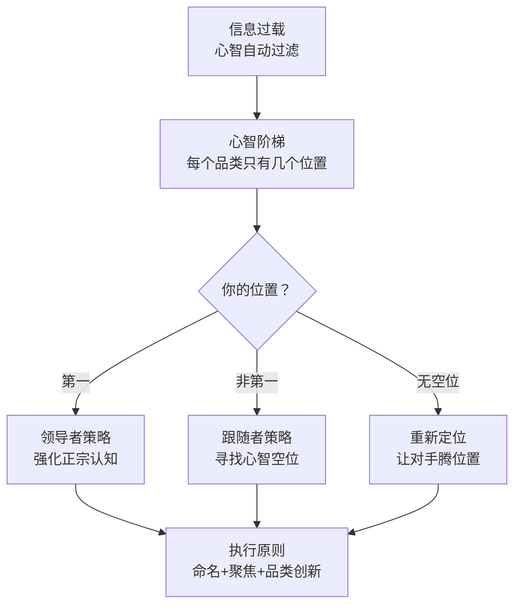

# 《定位》深度读书笔记

> [!abstract] 全书速览
> 营销的真正战场不在工厂、不在货架、不在广告版面，而在消费者的心智中。里斯和特劳特在1981年提出了一个重新定义整个营销学科的洞察：==定位不是你对产品做什么，而是你对潜在客户的心智做什么。==消费者的大脑面对信息洪流，会自动为每个品类建立一个只有几个位置的"阶梯"，绝大多数品牌根本挤不上去。如果你不能成为第一个进入消费者心智的品牌，那就创建一个你能做第一的新品类。全书从信息过载的时代判断出发，揭示了心智的运作规律，然后给出领导者、跟随者和挑战者三种截然不同的战略路径，最终落到命名、聚焦、品类创新等可执行的层面。这本书开创了"定位"理论，四十多年来深刻影响了全球营销实践。

## 核心命题

里斯和特劳特回答的根本问题是：在一个传播过度的社会里，品牌如何才能被消费者记住？

> [!tip] 视角转换
> 这本书最深刻的贡献是将营销的视角从内部转向外部：从"我们的产品有什么特点"转向"我们在消费者心智中是什么"。做个测试：想想运动鞋品类你能列出几个品牌？大多数人只有三到五个，但全球有数百个——那些不在你脑子里的品牌，在你的购买决策中根本不存在。

在《定位》之前，营销的核心假设是"更好的产品自然会赢"——只要你的产品质量更优、广告创意更强、嗓门喊得更大，消费者就会选择你。里斯和特劳特说：这是幻觉。

消费者每天面对成千上万条信息轰炸，心智无法处理，会自动建立防御机制过滤掉绝大部分。你争夺的不是货架空间，是消费者心智中极其有限的存储空间。定位的核心定义就此诞生：==定位不是你对产品做什么，而是你对潜在客户的心智做什么。==这句话的重量在于视角的转换——过去的营销人盯着产品特点和技术优势，里斯和特劳特让你把目光移到消费者的脑子里。

## 框架全景

全书逻辑分五层递进。

第一层是==环境判断==：我们生活在一个传播过度的社会，信息量远超人类心智的处理能力。1981年美国人每天接触数百条广告信息，今天这个数字飙升到数千条。传统的"大声喊叫"式营销已经失效——你喊得再大声，也只是在噪音中添加噪音。

第二层是==心智机制==：面对信息过载，消费者心智会自动做两件事——简化和分类。它为每个产品品类建立一个"心智阶梯"，阶梯上只有有限的几个位置。第一个进入心智的品牌占据阶梯顶端，排名一旦形成极难改变。

第三层是==战略选择==：根据你在心智阶梯上的位置，有三种策略——领导者强化"正宗"认知，跟随者寻找心智空位，无空位时通过重新定义对手创造空间。

第四层是==执行原则==：名字是品牌与心智之间最重要的接触点，一个好名字事半功倍；品牌延伸是最常见也最致命的战略错误。

第五层是==延伸应用==：定位思维不仅适用于产品，也适用于企业战略、个人职业发展，甚至国家竞争力。

## 核心观点深度解读

### 心智阶梯：消费者如何组织品牌信息

==心智阶梯==是全书最重要的概念。消费者会在脑子里为每个产品品类建立一个"阶梯"，阶梯上只有有限的台阶——通常不超过七个，与认知心理学家乔治·米勒的"7加减2"发现一致。在大多数品类中，消费者能脱口而出的品牌只有两三个。

> [!example] "第一"的力量
> 第一个登月的人？阿姆斯特朗。第二个？大部分人答不上来（奥尔德林）。中国矿泉水市场有超过3000个品牌注册，但你能想到的可能只有四五个。"第一"不是指第一个上市的产品，而是第一个进入消费者心智的品牌——施乐不是第一个发明复印机的，但第一个把品牌和"复印"焊在一起。

心智阶梯有三个关键特征。

**容量有限。** 你的脑子不是百度百科，每个品类只能分到几个名额。中国矿泉水市场上超过3000个注册品牌，你能想到的可能只有农夫山泉、怡宝、百岁山等少数几个。剩下的在你心智中根本不存在——即使它们的水质可能更好。

**排序固化。** 一旦某个品牌在你心智中占据了某个位置，这个位置就像用水泥浇注了一样难以撬动。如果你心智中"最安全的汽车"是沃尔沃，即使另一个品牌拿出更好的安全测试数据，你也不太愿意改变认知。心智会自动抵制与已有认知不一致的信息——确认偏误让人倾向于接受与已有信念一致的信息，过滤掉不一致的。

**第一法则。** 第一个进入心智的品牌拥有巨大优势。但需要精确理解"第一"的含义：不是"第一个上市的产品"，而是"第一个在消费者心智中建立清晰认知的品牌"。施乐不是第一个发明复印机的公司，但它是第一个让"复印"与品牌挂钩的公司。

用一个类比来理解整个模型：消费者的大脑是一栋公寓楼，每个品类是一套公寓，每套只有几个房间。先搬进去的住户占据了最好的房间，住得越久越难被赶走。你作为新品牌，不是在空旷的草原上建房子，而是在一栋已经住满人的公寓楼里找空房间。

### 领导者策略：守住心智中的第一

如果你已经是品类中的第一名，里斯和特劳特的建议是：强化并保护这个位置，而不是去追逐新概念或模仿竞争对手。

可口可乐的"正宗货"（The Real Thing）定位之所以有效，不是因为口感真的比百事好多少，而是因为在消费者心智中，第一个出现的就是"原版"，后来的都是"模仿者"。领导者不需要说"我比竞争对手好"，只需要反复强调"我是正宗的、原创的、第一个"。

> [!warning] 领导者最大的错误
> 回应竞争对手。可口可乐1985年推出"新可口可乐"迎合百事的口味挑战，结果惹怒忠实消费者，79天后恢复原配方。领导者改变自己去回应挑战者，只会损害自己的定位。如果对手推出有威胁的新概念，用多品牌拦截——宝洁就是典范：汰渍代表"去渍能力"，碧浪代表"温和护衣"。

不过这个原则有一个重要的边界：如果对手不是在同品类内挑战你，而是在==开辟全新品类==，忽视就变成了坐以待毙。诺基亚是功能手机时代的王者，但智能手机是一个全新品类，在这个新品类中诺基亚的领导者地位毫无价值。微软在PC操作系统领域的统治让它忽视了移动操作系统的崛起，iPhone和Android不是在和Windows竞争，而是在创建新品类。

### 跟随者策略：寻找心智中的空位

正面进攻领导者几乎必败——你不仅要击败更强的对手，还要击败消费者心智中根深蒂固的认知。更聪明的做法是：寻找心智中尚未被占据的"空位"，第一个站上去。

> [!example] 大众甲壳虫
> 1960年代的美国汽车市场被大车统治。大众没有和底特律巨头正面竞争，而是反其道而行之，推出小巧的甲壳虫，广告语是"Think Small"。它在消费者心智中开辟了"小型车"这个新阶梯，并第一个站上去。

红牛是当代空位策略的经典。在红牛之前，饮料市场的阶梯按口味分类：可乐、果汁、茶、水。红牛没有做"更好喝的汽水"，而是开创了"功能饮料"这个全新品类。它的口味其实并不好——很多人第一次喝都难以接受——但它在"困了累了需要来一罐"这个场景中第一个抢占了心智位置。

空位可以是很多维度：尺寸、价格、性别、使用场景、渠道、地理、年龄。关键是找到一个消费者心智中存在但尚未被清晰占据的维度。

> [!warning] 伪空位陷阱
> 工厂空位不等于心智空位。"无酒精威士忌"在工厂能生产，但在消费者心智中"威士忌"和"不含酒精"是矛盾的。"便宜的劳力士""大众化的爱马仕"都是伪空位——与品牌在心智中的已有认知直接冲突。空位是否"真实"取决于消费者心智的接受度，而不是实验室能不能做出来。

### 重新定位竞争对手：让对手腾出位置

当心智中的空位看起来都被占满了，还有一条路：通过重新定义竞争对手来创造空间。

> [!example] 泰诺 vs 阿司匹林
> 泰诺没说"我是更好的止痛药"，而是说"如果你的胃容易不舒服，阿司匹林可能不适合你"。它在消费者心智中把阿司匹林重新定义为"可能伤胃的止痛药"，为"不伤胃的止痛药"腾出了位置。最终泰诺超越阿司匹林成为美国最畅销止痛药。

Scope漱口水对李施德林的进攻是同样的逻辑。李施德林以"杀菌"为核心定位，口味极其刺激。Scope把它重新定义为"药味漱口水"，推出自己为"好味道漱口水"——在消费者心智中创造了一个新的分类维度。

重新定位的关键在于：弱点必须真实，消费者能感知到。阿司匹林确实可能刺激胃黏膜——这是医学事实，不是泰诺编造的。同时，你在重新定位对手的同时必须提供替代选择——否则消费者只记住了问题，却不知道该选什么。

### 品牌延伸陷阱：一个品牌只能代表一个品类

品牌延伸——用已有品牌进入新品类——是里斯和特劳特最猛烈抨击的商业行为。

诱惑是显而易见的：你已经花了几十亿建立起"施乐"这个品牌，为什么不用它来卖电脑？但在消费者心智中，==施乐=复印机==已经焊死。他们提出了"跷跷板原则"：一个名字不可能同时代表两个产品，一端上去另一端就下来。每一次品牌延伸都在稀释原有品牌的清晰定位。

更好的做法是为新品类创建新品牌。丰田进入豪华车市场创建了雷克萨斯，本田推出讴歌，日产推出英菲尼迪。这些日本车企深谙定位之道：要进入新品类，就用新品牌。

海尔是反面案例。从冰箱延伸到几乎所有家电品类，心智定位变得模糊，不如"格力=空调"锐利。

> [!note] 重要反例
> 苹果从电脑延伸到播放器、手机、平板、手表，每次都成功。可能的解释：苹果的核心定位不是"电脑公司"而是"极致设计与用户体验的科技美学"（足够抽象可以延伸），且每次进入新品类都有碾压级创新。但这种成功条件极其苛刻——对绝大多数品牌来说，里斯和特劳特的警告仍然成立。

### 命名的战略意义

名字是品牌与消费者心智之间最重要的接触点。好名字的标准：简短、好记、暗示利益、有差异化、==可视化==（听到"苹果"脑子里能浮现画面）。Federal Express简化为FedEx——更短、更有辨识度。

坏名字的典型特征：首字母缩写（不知名品牌用缩写是自杀）、过于通用（"National""General"在心智中没有区分度）、试图包含太多。IBM、GE之所以可以用缩写，是因为它们先用全名成了名。初创公司叫"JTK Solutions"是主动放弃进入心智的机会。

### 品类思维：从争夺位置到创造品类

里斯在后续著作中推进了理论：最强大的定位不是在已有品类中抢位置，而是创造全新品类并成为代名词。能量饮料=红牛，即时通讯=微信，电商=亚马逊/淘宝。这些品牌不是在已有品类中击败了竞争对手，而是通过创造新品类来获得了第一的地位。

这和彼得·蒂尔在[[《从0到1》]]中的思路有异曲同工之妙：与其在已有市场中竞争，不如创造全新市场。不同之处在于，蒂尔关注商业模式和技术层面的创新，里斯关注心智层面的品类创新——你可以用相同的技术，只要在消费者心智中建立新品类认知，就能获得品类第一的地位。

## 这本书的保质期

**变得更强的部分。** 信息过载的程度是1981年的百倍，心智防御机制更强，定位更加重要。短视频时代一个品牌如果不能用一句话说清楚自己是什么，就根本不会被记住。心智阶梯的核心逻辑——人脑的分类和排序机制——是认知的底层结构，并没有因为技术进步而改变。

**需要修正的部分。** 品牌延伸的绝对禁令需放宽——苹果、亚马逊等平台型品牌证明了例外。搜索引擎和推荐算法在一定程度上"外包"了心智排序，削弱了心智阶梯在低频品类中的重要性。但在高频、低参与度的日常决策中（买什么饮料、用什么App叫车），心智阶梯仍然是主导力量。书中案例主要来自美国消费品市场，对B2B市场和复杂决策场景，定位理论的适用性需要打折——但在客户做初步筛选时，"这个公司是做什么的"这个心智认知仍然起着关键过滤作用。

## 行动工具箱

**定位诊断六问。** 你在消费者心智中代表什么？（做调研，不要自己猜。）你想代表什么？谁是必须超越的对手？有足够资源吗？能坚持吗？传播是否与定位一致？

**战略选择矩阵。** 品类第一→强化正宗认知，多品牌拦截。第二第三→找空位成为某维度第一。新进入者→创建新品类新品牌。

**命名检查。** 简短好记？暗示利益？有差异？容易发音？陌生人能理解？听到名字脑海能浮现画面吗？

**个人定位。** 在客户和同行心智中你代表什么？你在什么领域可以成为"第一"？如果你在所有方面都"还不错"但没有一个领域是公认的顶尖，你就没有定位。选择一个足够窄的领域，建立专家声誉，抵制"什么都想做"的诱惑。

**聚焦检查。** 你的核心信息能浓缩成一个词吗？沃尔沃=安全，联邦快递=隔夜到达，宝马=驾驶乐趣。你等于什么？如果你回答不了这个问题，你的消费者更回答不了。

## 延伸阅读

[[《22条商规》]]将定位理论浓缩为22条可操作法则，是《定位》的速查手册。

[[《品牌的起源》]]深化了"品类创新"概念，系统回应数字时代品牌延伸成功案例对原始理论的挑战。

[[《思考，快与慢》]]从认知心理学角度解释定位理论为什么有效——大部分购买决策由快速自动化的"系统一"驱动，依赖心智中已有的简化认知。
