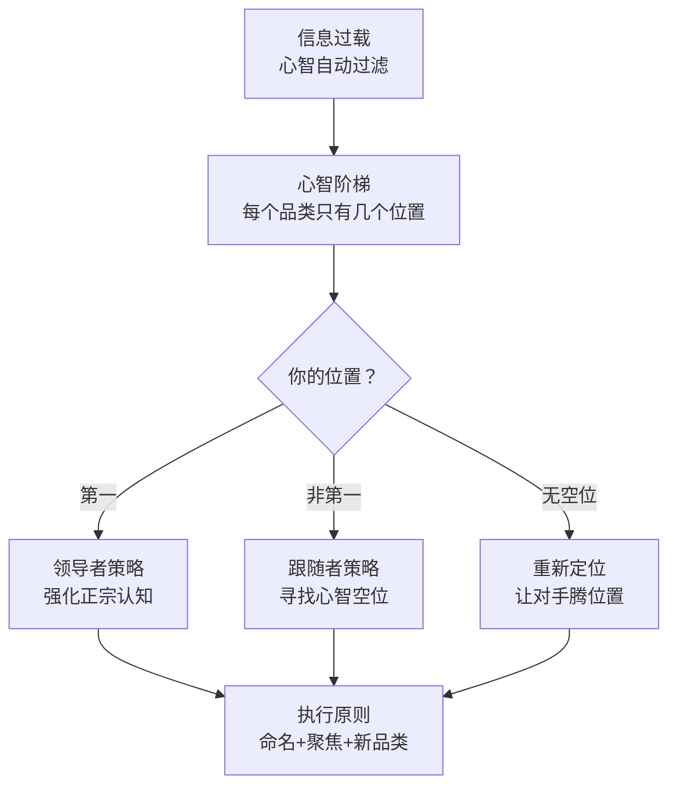

# 《定位》深度读书笔记

> [!abstract] 全书速览
> 营销的真正战场不在工厂、不在货架、不在广告版面，而在消费者的心智中。里斯和特劳特提出了一个重新定义整个营销学科的洞察：你要做的不是改变产品，而是在消费者极其有限的心智空间里抢占一个清晰、独特、有价值的位置。==定位不是你对产品做什么，而是你对潜在客户的心智做什么。==如果你不能成为第一个进入消费者心智的品牌，那就创建一个你能做第一的新品类。

## 核心命题

里斯和特劳特回答的根本问题是：在一个传播过度的社会里，品牌如何才能被消费者记住？

> [!tip] 视角转换
> 这本书最深刻的贡献是将营销的视角从内部转向外部：从"我们的产品有什么特点"转向"我们在消费者心智中是什么"。你可以做个测试：想想运动鞋品类你能列出几个品牌？大多数人只有三到五个，但全球有数百个——那些不在你脑子里的品牌，在你的购买决策中根本不存在。

消费者每天面对成千上万条信息轰炸（1981年每天数百条，今天飙升到数千乃至上万条），心智无法处理，会自动建立防御机制过滤掉绝大部分。你争夺的不是货架空间，是消费者心智中极其有限的存储空间。

## 框架全景

全书逻辑分五层：信息过载的环境判断 → 心智阶梯的运作机制 → 三种战略选择 → 命名和品牌延伸的执行原则 → 延伸到企业、个人和国家的应用。每一层都由上一层的结论推导而来。

## 核心观点深度解读

### 心智阶梯：消费者如何组织品牌

消费者会在脑中为每个品类建立一个==心智阶梯==，只有有限的台阶——通常不超过七个。第一个进入心智的品牌占据顶端，排名一旦形成极难改变（确认偏误让人自动抵制与已有认知不一致的信息）。

> [!example] "第一"的力量
> 第一个登月的人？阿姆斯特朗。第二个？大部分人答不上来（奥尔德林）。中国矿泉水市场有==3000多个==品牌注册，但你能想到的可能只有四五个。"第一"不是指第一个上市的产品，而是第一个进入消费者心智的品牌——施乐不是第一个发明复印机的，但第一个把品牌和"复印"焊在一起。

### 领导者策略：守住第一

领导者最强武器是"第一"本身。可口可乐的"正宗货"（The Real Thing）定位利用的是"第一个=原版"的心智规律。

> [!warning] 领导者最大的错误
> 回应竞争对手。可口可乐1985年推出"新可口可乐"迎合百事的口味挑战，结果惹怒忠实消费者，79天后恢复原配方。如果对手推出有威胁的新概念，用多品牌拦截（宝洁：汰渍="去渍"，碧浪="温和护衣"）。但如果对手在==开辟全新品类==而非同品类竞争，忽视就变成了坐以待毙——诺基亚忽视智能手机、微软忽视移动操作系统都是教训。

### 跟随者策略：寻找空位

正面进攻领导者几乎必败。大众甲壳虫在所有车比谁更大时说"Think Small"，开辟了"小型车"新阶梯。红牛没有做"更好喝的汽水"而是开创"功能饮料"品类。

> [!warning] 伪空位陷阱
> 工厂空位不等于心智空位。"无酒精威士忌"在工厂能生产，但在消费者心智中"威士忌"和"不含酒精"是矛盾的。空位是否"真实"取决于消费者心智的接受度，而不是实验室能不能做出来。

### 重新定位竞争对手

> [!example] 泰诺 vs 阿司匹林
> 泰诺没说"我是更好的止痛药"，而是说"如果你的胃容易不舒服，阿司匹林可能不适合你"。它在消费者心智中把阿司匹林重新定义为"可能伤胃的止痛药"，为"不伤胃的止痛药"腾出了位置。最终泰诺超越阿司匹林成为美国最畅销止痛药。Scope把李施德林重新定义为"药味漱口水"也是同样逻辑。关键：弱点必须真实，且同时提供替代。

### 品牌延伸陷阱

用已有品牌进入新品类——短期省广告费，长期稀释品牌清晰度。==施乐=复印机==在心智中已经焊死。"跷跷板原则"：一个名字不可能同时代表两个产品。

更好做法是为新品类创建新品牌。丰田 → 雷克萨斯，本田 → 讴歌，日产 → 英菲尼迪。反面案例：海尔从冰箱延伸到几乎所有家电，心智定位变得模糊，不如"格力=空调"锐利。

> [!note] 重要反例
> 苹果从电脑延伸到播放器、手机、平板、手表，每次都成功。可能的解释：苹果的核心定位不是"电脑公司"而是"极致设计与用户体验的科技美学"（足够抽象可以延伸），且每次进入新品类都有碾压级创新。但这种成功条件极其苛刻。

### 命名的战略意义

好名字：简短、好记、暗示利益、有差异化、==可视化==（听到"苹果"脑子里能浮现画面）。Federal Express → FedEx。
坏名字：首字母缩写（不知名品牌用缩写是自杀）、过于通用、试图包含太多。初创公司叫"JTK Solutions"是主动放弃进入心智的机会。

### 品类思维

里斯在后续著作中推进了理论：最强大的定位不是在已有品类中抢位置，而是创造全新品类并成为代名词。能量饮料=红牛，即时通讯=微信。这和蒂尔的"从0到1"有异曲同工之妙。

## 这本书的保质期

**变得更强的：** 信息过载的程度是1981年的百倍，心智防御机制更强，定位更重要。短视频时代一个品牌如果不能用一句话说清楚自己是什么，就根本不会被记住。

**需要修正的：** 品牌延伸的绝对禁令需放宽——苹果、亚马逊等平台型品牌证明了例外。搜索引擎和推荐算法在一定程度上"外包"了心智排序。B2B市场和复杂决策场景中，心智阶梯模型可能过于简化，但在客户做初步筛选时"这个公司是做什么的"仍然起关键过滤作用。

## 行动工具箱

**定位诊断六问：** 你在消费者心智中代表什么？（做调研，不要自己猜）你想代表什么？谁是必须超越的对手？有足够资源吗？能坚持吗？传播是否与定位一致？

**战略选择矩阵：** 品类第一→强化正宗认知，多品牌拦截。第二第三→找空位成为某维度第一。新进入者→创建新品类新品牌。

**命名检查：** 简短好记？暗示利益？有差异？容易发音？陌生人能理解？可视化？

**个人定位：** 在客户和同行心智中你代表什么？你在什么领域可以成为"第一"？

**聚焦检查：** 你的核心信息能浓缩成一个词吗？沃尔沃=安全，联邦快递=隔夜到达。你等于什么？

## 延伸阅读

[[《22条商规》]]将定位理论浓缩为22条可操作法则，是《定位》的速查手册。

[[《品牌的起源》]]深化了"品类创新"概念，回应数字时代品牌延伸成功案例对原始理论的挑战。

[[《思考，快与慢》]]从认知心理学角度解释定位理论为什么有效——大部分购买决策由快速自动化的"系统一"驱动，依赖心智中已有的简化认知。
