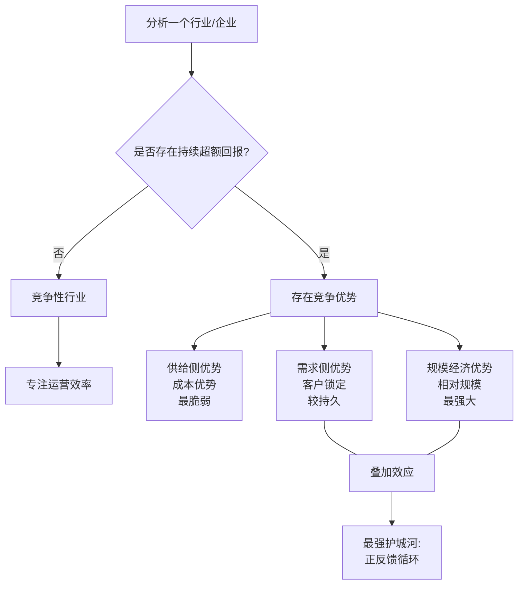

# 《竞争优势：透视企业护城河》深度读书笔记

> [!abstract] 全书速览
> 商业世界里最昂贵的幻觉，是相信自己拥有竞争优势。布鲁斯·格林沃尔德用一套冷峻的分析框架告诉你：真正的竞争优势远比大多数人以为的稀少，而且只有三种来源。这本书不是教你如何"打造护城河"的鸡汤，而是一把手术刀——帮你看清哪些公司真的拥有优势，哪些只是在自欺欺人。

## 核心命题

格林沃尔德要回答的问题其实非常尖锐：为什么绝大多数企业的"竞争战略"都是无效的？

这个问题的背景是，自从迈克尔·波特在1980年代构建了竞争战略的经典理论之后，几乎每一位MBA学生都会学习五力分析、三大通用战略、价值链分析。这些工具被无数企业的战略规划部门采纳，被无数咨询公司写进提案。但格林沃尔德作为哥伦比亚大学商学院的教授，同时也是一位深谙价值投资的学者，他在长期观察企业实际表现的过程中发现了一个令人不安的事实：大多数行业其实不存在可持续的竞争优势，大多数企业对自身"优势"的判断是错误的，而波特的理论虽然框架宏大，但在实际应用中往往缺乏操作精度——它告诉你要分析五种力量，但没有告诉你怎么判断哪种力量才是真正决定性的。

> [!tip] 核心主张
> 格林沃尔德的核心主张可以浓缩为三句话：
> 1. ==竞争优势是稀缺的==，只存在于少数行业的少数企业中
> 2. 竞争优势只有==三种来源==——供给侧优势（成本优势）、需求侧优势（客户锁定）和规模经济优势
> 3. 没有竞争优势的企业应该停止幻想，转而专注于提高运营效率——这不是退而求其次，而是最理性的选择

这个主张之所以重要，是因为它直接挑战了商业世界中一个根深蒂固的信念：每个企业都可以通过"差异化战略"建立竞争优势。格林沃尔德说，不是的，大多数市场是竞争性的，在竞争性市场中，差异化不等于竞争优势，因为对手可以迅速模仿你的差异化举措。你推出一个新功能，竞争对手三个月后就复制了；你改善了服务体验，同行很快就跟进了。除非你的差异化背后有结构性的壁垒保护，否则它只是暂时的领先，而不是持久的优势。

## 框架全景

格林沃尔德的分析框架可以用一个决策树来理解。当你面对任何一个企业或行业时，第一步永远是问：这里存在竞争优势吗？

他给出了一个极其实用的判断标准：看行业的==盈利稳定性==。如果一个行业中长期有企业能够持续获得高于资本成本的回报，而且这种回报不是随机波动的——不是今年这家公司赚钱明年换另一家——那就说明存在结构性的竞争优势。反过来，如果行业中没有企业能持续获得超额回报，或者盈利能力在企业之间频繁易手，那这个行业就是竞争性的，不存在真正的壁垒。这个判断标准的好处是它基于可观测的数据，而不是主观推断。你不需要去猜测一个行业"应该"有什么壁垒，只需要看真实的财务表现就够了。

判断完"是否存在优势"之后，框架分成两条路径。

**第一条路径是"无优势行业"。** 在这类行业中，企业唯一能做的就是运营效率——把同样的事情做得更好、更快、更省。格林沃尔德反复强调，这并不是一个丢人的结论，恰恰相反，它是一种智识上的诚实。大多数行业都属于这一类，而在这类行业中，优秀的运营管理本身就是巨大的价值来源。丰田的精益生产就是在一个没有竞争优势的行业里通过极致运营效率创造价值的经典案例。问题在于，很多企业不愿意接受这个现实，非要去追求"战略差异化"，把大量时间和金钱花在品牌重塑、市场重新定位、新产品线开拓上，结果把资源浪费在了注定无法持续的方向上——因为你做的任何事情，竞争对手都可以跟进。

**第二条路径是"有优势行业"。** 在这里，格林沃尔德引入了他最核心的分析工具：竞争优势的三大来源。这三个来源之间有明确的层次关系。供给侧优势（成本优势）是最不持久的，因为技术和流程最终都会被竞争对手学会或者绕过。需求侧优势（客户锁定）更加持久，因为它根植于客户的习惯、转换成本和信息不对称——这些是人性层面的惯性，改变起来很慢。而规模经济优势是最强大的，但它必须与需求侧优势结合才能发挥最大效力——单纯的规模大并不构成优势，"在特定市场中的相对规模大"才是关键。

这个框架的精妙之处在于它的递进逻辑：先筛选（有没有优势？），再分类（什么类型的优势？），最后在每一类中给出具体的策略建议。它不是一个大而全的理论体系，而是一个精确的诊断工具——就像医生不会给每个病人做全身检查，而是先通过几个关键指标判断问题在哪里，然后有针对性地深入。

## 核心观点深度解读

### 观点一：竞争优势的"三源泉"模型

格林沃尔德把所有可能的竞争优势浓缩为三种来源，这是全书最核心的理论贡献，也是他与波特最根本的分歧所在。

> [!note] 供给侧优势
> 指企业在成本端拥有竞争对手无法复制的优势，可能来自于专有技术、独特的自然资源获取权、或者长期积累的学习曲线效应。在矿业中，拥有品位更高矿藏的企业天然就有成本优势；在早期半导体行业，率先掌握制程工艺的企业能享受良率优势——同样的设备投入，良率从60%提升到90%，单位成本就降了三分之一。

> [!warning] 关键警告
> 纯粹的成本优势往往是==最脆弱的竞争壁垒==。技术会扩散（工程师会跳槽，专利会过期，竞争对手的研发团队会找到替代方案），学习曲线效应也会被对手追赶。除非这种成本优势有某种不可复制的基础（如独一无二的地理位置或不可再生的资源），否则它的半衰期可能比你想象的短得多。

**需求侧优势**是格林沃尔德更看重的第二种来源。它的本质是==客户锁定==——消费者出于习惯、转换成本、或者搜索成本等原因，不愿意轻易更换供应商。这种优势的力量在于，它不依赖于企业自身的能力优越性，而是根植于客户的行为惯性——改变人的行为是世界上最难的事情之一。

> [!example] 搜索成本如何创造优势
> 想象你搬到一个新城市，需要找一个牙医。你可能会问朋友推荐，或者在网上搜索评价，最终选择一个看起来不错的。但一旦你去过两三次，觉得还行——技术过关、态度尚可——你就很难再花时间去找另一个牙医来比较。即使可能存在更好的选择，重新搜索、重新建立信任关系的时间和精力成本会让你倾向于"将就"。
>
> 把这个逻辑放大到企业级市场——一家企业已经用了某个ERP系统五年，所有的数据、流程、员工培训都围绕这个系统构建，你觉得他们会仅仅因为另一个系统"略好一点"就更换吗？几乎不会。

格林沃尔德还特别讨论了品牌在客户锁定中的角色。他认为品牌本身不是竞争优势——品牌的价值在于它降低了客户的搜索成本和感知风险。当你在货架上面对二十种洗衣液时，选择一个你认识的品牌，本质上是在节省你的决策成本。但这意味着品牌优势的强度取决于产品类别的特性：在搜索成本高、购买频率低、质量难以事先判断的品类中，品牌的锁定效应很强；在搜索成本低、产品标准化程度高的品类中，品牌的保护力就很弱。

**规模经济优势**是第三种来源，也是格林沃尔德着墨最多的。他反复强调一个容易被误解的关键点：==规模经济优势不是"大公司打败小公司"那么简单。重要的不是绝对规模，而是在特定市场中的相对规模。==

他用了一个清晰的逻辑来解释。假设A公司和B公司竞争同一个市场，A的市场份额是B的三倍。如果这个行业有大量的固定成本（比如研发投入、品牌广告、分销网络建设），那么A公司可以把这些固定成本分摊到三倍的销量上，单位固定成本就是B的三分之一。这种数学关系是残酷的——它不取决于谁更聪明、谁更努力，纯粹是规模带来的结构性优势。

但格林沃尔德最有洞察力的贡献在于他进一步追问：规模经济优势在什么条件下才能形成真正的壁垒？答案是：当规模优势是"局部性的"而非"全球性的"时候。如果固定成本是"区域性的"——配送网络、销售团队、本地品牌广告——那么一家企业在特定区域的规模密度就成为了最重要的竞争武器。你在全球总收入排第一没有用，关键是你在堪萨斯城、在成都、在慕尼黑这些具体市场中的相对份额是多少。

### 观点二：规模经济与客户锁定的"叠加效应"

格林沃尔德提出了一个极其重要的观察：==真正强大的竞争优势几乎从不单独出现，它们是叠加的。==

单纯的规模经济优势有一个致命弱点：如果客户没有忠诚度，那么一旦有竞争者愿意接受更低的利润率进入市场，以低价吸引客户，现有企业的规模优势就会被逐步蚕食——市场份额下降，固定成本分摊增加，利润率下滑，形成恶性循环。反过来，单纯的客户锁定如果没有规模经济的支撑，也存在脆弱性——竞争者可以通过大规模的补贴、促销、或技术创新来"购买"客户。

但当规模经济和客户锁定结合在一起时，就形成了一种"正反馈循环"：客户的习惯性购买维护了企业的市场份额，市场份额维护了规模经济优势，规模经济优势又让企业有更多资源强化客户关系。外部竞争者要打破它就需要同时在两个维度上进攻，难度呈几何级数增长。

> [!example] 可口可乐与百事可乐
> 可口可乐在全球许多地区市场同时拥有品牌认知度带来的客户习惯性购买（你渴了的时候脑子里第一个蹦出来的名字）和区域装瓶及分销网络带来的规模经济优势（更密集的铺货意味着更低的单位配送成本）。这两种优势相互加强，使得几十年来几乎没有第三家企业能够真正撼动这个双寡头格局。即便像维珍可乐这样有强大品牌背书的新进入者，也在短短几年内就败退了——因为它需要同时突破客户惯性和分销规模两道防线。

> [!tip] 判断标准
> 当你看到一家企业同时拥有客户锁定和规模经济优势时，你面对的是一条极深的护城河。这种企业在遭遇经济衰退、技术变革或管理失误时，往往都能恢复过来，因为它的竞争优势是结构性的，不依赖于某个天才CEO或某次幸运的决策。

### 观点三：大多数行业没有竞争优势——这是好消息

这可能是全书中最反直觉的观点。格林沃尔德估计，大多数行业实际上是竞争性的——即不存在可持续的竞争优势。当你审视大多数制造业、大多数服务业、大多数零售业，你会发现没有哪家企业能够持续获得远高于资本成本的回报。

很多企业家和管理者听到这个结论会感到沮丧，但格林沃尔德说这恰恰是一个==解放性的认知==。如果你所在的行业确实不存在竞争优势，那么你应该停止在"战略"上浪费时间和金钱——那些昂贵的战略咨询项目、那些雄心勃勃的品牌重塑计划、那些试图"颠覆行业"的新产品线——转而把全部精力放在运营效率上。

> [!example] 航空业：伪战略 vs 真运营
> 几十年来，无数航空公司试图通过品牌定位、服务差异化、常旅客计划、联盟合作等方式建立竞争优势，投入了数十亿美元。结果呢？航空业是全球盈利能力最差的行业之一，从莱特兄弟到今天，整个行业的累计净利润接近于零。因为行业结构——标准化的产品、极低的客户转换成本、高固定成本但无法形成局部规模优势——决定了这是一个天然竞争性的行业。
>
> 相比之下，西南航空的成功恰恰不是因为战略差异化，而是因为==卓越的运营效率==——更高的飞机利用率、更快的地面周转（25分钟vs行业平均45分钟）、更简单的机队配置（只用一种机型）。这是"运营效率战胜伪战略"的经典案例。

### 观点四：局部市场统治力比全球规模更重要

格林沃尔德对"规模"的重新定义是他对战略思维的一大贡献。他明确指出：在评估一个企业的竞争地位时，你应该关注的不是它的总收入排名、全球员工数量或者财富500强的名次，而是==它在其所服务的特定市场中的相对份额==。

这个观点解释了很多看似矛盾的现象。为什么沃尔玛在美国如此强大，但在德国和韩国却惨遭失败？因为沃尔玛的竞争优势来自于它在美国本土市场——更准确地说，是在美国中南部地区——的区域配送网络密度。在阿肯色州周边地区，沃尔玛的门店密度极高，一个配送中心可以同时服务几十家门店，配送效率远高于任何竞争对手。但当它进入德国或韩国时，这个优势完全不存在了——它反而是那个处于规模劣势的外来者。

> [!tip] 扩张的正确方式
> 企业扩张应该=="从中心向外辐射"==，而不是跳跃式地进入遥远的新市场。先在核心市场建立统治性的密度和规模优势，然后向相邻的地理区域或相邻的产品品类渐次扩展。每一步扩张都应该能够利用现有的规模经济基础，而不是从零开始。
>
> 沃尔玛早期从阿肯色州周围小城镇起步、逐步向外扩展配送半径的策略，就是这个原则的教科书案例。这对今天急于"全球化"的互联网企业同样适用。

### 观点五：在位者与进入者的不对称博弈

格林沃尔德花了大量篇幅分析一个关键的竞争场景：当一个新玩家试图进入一个由在位者主导的市场时，双方的博弈动态是什么？

核心洞察是：==在位者和进入者之间存在根本性的信息和资源不对称==，这种不对称使得竞争并非在公平的起跑线上展开。

在位者拥有已建立的客户关系、已摊销的固定成本、以及对市场的深度了解。进入者的这些成本全部都是增量的。这意味着即使进入者的"稳态效率"和在位者一样高，进入过程本身的成本也可能让进入变得无利可图。

格林沃尔德把这个问题量化了：进入者的"进入成本"等于建立与在位者同等竞争能力所需的全部投入，减去未来可预期收益的现值。如果这个差值是正数，那么理性的进入者就不应该进入。

> [!warning] 在位者的常见致命错误
> **过度反应**。当在位者面对一个小规模的进入者时，本能反应往往是发动价格战。但这通常是错误的——你为了打击一个只占3%市场份额的进入者，把自己100%市场份额上的利润率都砍了一刀，这笔账怎么算都是亏的。更理性的策略往往是"让出一小块市场份额"——容忍进入者在市场的边缘生存，但确保他们无法触及你最有价值的核心客户群。

格林沃尔德还讨论了面对风险资本支持的"非理性进入者"时的最优策略：等待。非理性的补贴终究不可持续，当资金耗尽时，这些进入者要么退出，要么被迫回归理性定价。在位者只需保持运营效率和客户关系，暴风雨过后你仍然站在那里就是胜利。

### 观点六：对波特五力的精确手术

格林沃尔德对迈克尔·波特理论的态度不是颠覆，而是精确化。他承认波特的五力分析是一个有用的思维框架，但问题在于框架太宽泛——五种力量，每种力量下面又有若干子因素，排列组合下来可以得出几乎任何结论。一个工具如果能解释一切，那它实际上什么也没解释。

格林沃尔德的第一刀：砍掉四种力量，只保留一种。他认为五力中真正决定性的力量只有一个：==进入壁垒==。如果一个行业没有进入壁垒，无论其他四个力量如何组合，超额利润最终都会被竞争侵蚀。其他四个力量影响的是利润的短期分配方式，但只有进入壁垒决定了长期超额回报是否可能存在。

格林沃尔德的第二刀：对"进入壁垒"进行更精确的解剖。波特列举了多种进入壁垒，格林沃尔德把所有壁垒归结为三种本源：供给侧优势、需求侧优势、规模经济优势。波特的其他壁垒要么可以被归入这三类（比如"品牌"是需求侧优势的一个表现形式），要么根本不构成持久的壁垒。

> [!tip] 实用简化
> 面对一个具体行业时，你不需要逐一分析波特的五种力量再对子因素打分。只需要回答三个清晰的问题：有没有不可复制的成本优势？有没有真实的客户锁定？在关键市场中有没有相对规模优势？三个答案就足以判断这个行业的竞争格局。

## 这本书的保质期

格林沃尔德的框架写于2005年。将近二十年过去了，它的哪些部分经受住了时间考验，哪些需要更新？

**依然强劲的部分。** 三源泉模型的基本逻辑依然稳固。过去二十年最成功的企业——苹果、谷歌、亚马逊、微软——它们的护城河无一例外可以用格林沃尔德的框架来解释。苹果有强大的客户锁定（iOS生态系统的转换成本极高）；谷歌有规模经济优势加客户习惯的叠加；亚马逊是规模经济和客户习惯的典型叠加案例（更多的卖家带来更全的品类，Prime会员制度创造了强大的客户锁定效应）。

"大多数行业没有竞争优势"的判断也仍然成立。共享出行、在线教育、社区团购、生鲜电商等行业的惨烈竞争和大面积亏损，都印证了格林沃尔德的警告。

> [!warning] 需要更新的部分
> - **网络效应**：平台经济中网络效应的速度、烈度和可逆性远超传统行业。一个社交网络可以在几年内从零到垄断，又在几年内被新平台取代（MySpace → Facebook → TikTok），这种动态变化是静态框架没有充分捕捉的。
> - **数据壁垒**：在人工智能时代，训练数据的规模和独特性正在成为新型竞争优势来源，同时具有供给侧和需求侧特征。三源泉模型可以容纳这种新现象，但需要有意识地更新。
> - **案例时效**：书中一些传统零售企业案例在电商崛起后已面目全非。但框架本身依然有效——你只需要把同样的分析逻辑应用到新的竞争格局上。

## 行动工具箱

**工具一：竞争优势快速诊断法**

下次你评估一个行业或企业时，先按这个顺序提问。第一，过去十年，这个行业中有没有企业持续获得高于资本成本的回报？查看长期ROIC数据。如果没有持续超额回报，直接判定为竞争性行业——优势如果存在，早就应该体现在财务数据中了。如果有，逐一排查三个来源——成本端有没有不可复制的低成本来源？客户转换成本有多高、习惯惯性有多强？在关键市场中的固定成本分摊优势有多大？

**工具二：市场边界的重新界定**

先问一个看似简单但极为关键的问题：这家企业的真正市场是什么？不是招股书上声称的市场，不是投资者演示文稿中画出的"万亿级赛道"，而是它实际上在和谁争夺同一批客户的钱包。一家自称"全球性消费品企业"的公司，可能在每一个国家市场都只有3%的份额。正确界定市场，往往比后续所有分析加起来都重要。

**工具三：扩张决策检查清单**

在考虑进入新市场之前，逐一回答：新市场是否与现有市场在地理上或客户群上相邻？在新市场中你的相对规模地位如何？你是作为在位者还是挑战者的身份进入？如果答案不令人鼓舞，在现有市场深耕可能是更理性的选择。

**工具四：竞争回应矩阵**

面对竞争威胁时，先评估进入者的实际威胁程度——瞄准的是核心客户还是边缘客户？进入规模有多大？资金来源是否可持续？如果威胁有限，容忍小规模份额损失可能比全面价格战更明智。如果威胁重大，把防御资源集中在最有价值的客户群上。

**工具五：投资分析的"优势优先"原则**

核心原则：不要被短期业绩迷惑，先判断有没有真正的竞争优势。没有优势意味着高利润率不可持续；有真正的优势意味着即使当前业绩平平，只要结构基础还在，长期回报就值得期待。这和沃伦·巴菲特的"护城河"投资理念一脉相承，但格林沃尔德提供了更系统、更可操作的分析方法。

## 延伸阅读

如果你想更全面地理解竞争战略这个主题，有两本书值得和本书对照阅读。

[[《竞争战略》]]是格林沃尔德对话和"修正"的原始文本。读完格林沃尔德再回头看波特，你会发现波特的宏观框架依然有其价值——它提供了一种全面扫描竞争环境的方式——但你已经有了更精确的判断工具来锁定真正重要的变量。两者不是替代关系，而是互补关系：波特帮你画全景图，格林沃尔德帮你在图中找到那几个真正决定胜负的关键节点。

[[《巴菲特的护城河》]]把格林沃尔德的学术分析翻译成了投资语言。如果你对竞争优势的兴趣主要来自投资角度，多尔西的书提供了更多可直接应用于投资决策的案例和评估标准。但在理论深度和分析精度上，它不如格林沃尔德。最理想的阅读顺序是先读格林沃尔德建立分析框架，再读多尔西学习投资应用。
