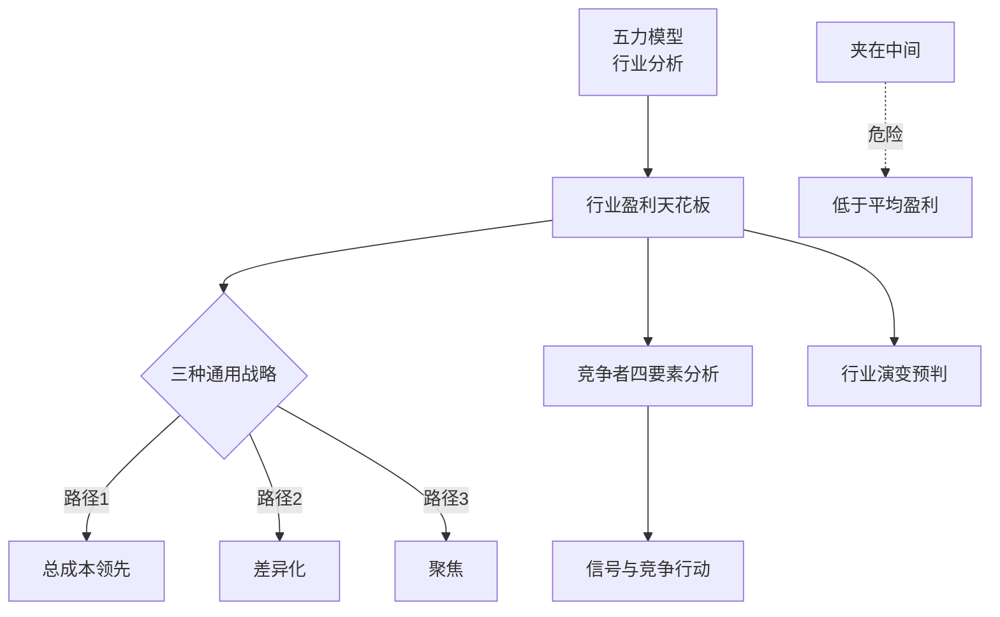

# 《竞争战略》深度读书笔记

> [!abstract] 全书速览
> 企业的盈利能力不是由它有多努力决定的，而是由它所处==行业的结构==和它在行业中的==竞争定位==决定的。五力模型解释了为什么有些行业天生比别的行业赚钱，三种通用战略告诉你在任何行业中只有三条路可以走。选择比努力更重要。

## 核心命题

波特要回答的根本问题是：为什么有些公司比同行更赚钱？

> [!tip] 核心洞见
> 公司的盈利能力首先取决于行业结构，其次取决于战略定位。做得好当然重要，但选择在哪里竞争和用什么方式竞争更重要。你可以想想餐饮业——无数勤劳的老板每天工作十四五个小时，但整个行业利润率长期在3%-5%徘徊。不是他们不努力，是行业结构决定了利润的天花板。

波特把"竞争"这个概念拓宽了。在他之前，大部分人理解的竞争就是"跟同行抢客户"。波特说不是——你的客户、你的供应商、潜在的替代品、可能进入你行业的新玩家，都在跟你争夺价值。一个行业里所有参与者创造的总价值是有限的，五种力量决定了你能拿到多大的份额。

## 框架全景

两个核心模块：==五力模型==回答"这个行业值不值得进入"，==三种通用战略==回答"在这个行业里如何竞争"。先看清棋盘，再决定落子——很多企业的战略失败不是因为执行不力，而是因为没有看清棋盘就急于落子。辅助工具包括竞争者分析四要素框架和行业演变生命周期分析。

## 核心观点深度解读

### 五力模型

五种力量共同决定行业平均盈利水平：

1. **现有竞争者的竞争强度**：对手多且实力相当、增长缓慢、固定成本高、差异化低、退出壁垒高→竞争激烈
2. **新进入者的威胁**：进入壁垒越高现有企业越安全。壁垒包括规模经济、品牌忠诚、资本需求、转换成本、渠道控制、政策限制、预期反击
3. **替代品的威胁**：限制定价空间。特别关注性价比正在快速改善的替代品和来自高利润行业的替代品
4. **买方的议价能力**：购买量大、转换成本低、信息充分、有后向整合能力→压低你的价格
5. **供应商的议价能力**：供应商集中、没有替代、你不是重要客户、有前向整合威胁→抬高你的成本

> [!example] 行业对比
> 航空业五力俱强→从1900年到2012年美国航空业累计利润总额==为零==。中国钢铁业同样：数百家企业、产品同质化、产能过剩、固定成本高、退出壁垒高→吨钢利润一度跌到不够买一瓶矿泉水。制药业进入壁垒极高（专利、FDA审批平均==10-15年==花费超==10亿美元==）→利润率丰厚。不是航空公司管理差，是行业结构决定了利润天花板。

> [!tip] 价值分配分析
> 一个真正有洞察力的五力分析应该告诉你：这个行业里的价值主要被谁拿走了？被供应商拿走了（英特尔 vs PC厂商——卖电脑的不如做芯片的赚钱），被买方拿走了（沃尔玛占宝洁总收入约15%，拥有巨大议价筹码），还是在竞争中被消耗掉了？这个问题的答案直接指向你的战略重点。

### 三种通用战略

**总成本领先：** 成为行业中成本最低的生产者。不是低价销售（谁都会），而是低成本运营（拼的是效率、规模和学习曲线）。沃尔玛通过极致供应链效率、规模采购、精益运营（总部在阿肯色州小城）和信息技术投入把成本压到对手无法匹敌。中国家电行业同理：美的和格力通过大规模制造和垂直整合建立了成本优势，在价格战中反而扩大了市场份额。

**差异化：** 提供客户认为独特的东西。核心不是"好一点"而是"好到客户愿意多付钱"。差异化必须满足三个条件：==客户真正在乎、竞争对手难以模仿、成本不能高到吃掉溢价利润==。星巴克是经典案例——一杯咖啡原材料几毛钱，消费者愿意支付5-10倍购买"第三空间"体验，而这种系统级差异化极难复制。

**聚焦：** 选择狭窄的细分市场，在其中追求成本领先或差异化。西南航空聚焦短途低价（只飞短途、只用737、不提供餐食——这套取舍让全服务航空公司很难模仿），IKEA聚焦"价格敏感但追求设计感的年轻消费者"。

> [!warning] 夹在中间
> 既不是成本最低、也没有差异化、也没有聚焦的企业——在每个维度都输给有清晰定位的对手。中国手机市场：华为靠技术差异化、小米走性价比、vivo/OPPO聚焦线下——而锤子、乐视、金立这些定位模糊的品牌全部消失。美国零售业：Sears和JCPenney"夹在中间"持续衰落直至破产。波特后来澄清：运营效率是"做同样的事做得更好"，战略是"选择做不同的事"——前者会被追赶，后者才是持久优势。

### 竞争者分析四要素

1. **目标**：它追求份额还是利润？（亚马逊早期长期亏损仍激进扩张——只有理解贝佐斯追求市场份额才说得通）
2. **当前战略**：它怎么竞争？
3. **假设**：它对自己和行业怎么看？（常常是==盲区==）
4. **能力**：它能做什么、不能做什么？

> [!example] 假设盲区：诺基亚 vs iPhone
> 诺基亚假设手机的核心竞争力是通话质量、信号强度和耐用性——这些确实是它领先的维度。基于这个假设，它无法理解为什么一个通话质量一般、电池续航糟糕的设备会构成致命威胁。它的假设让它看不到"手机"正在被重新定义——从通讯工具变成移动计算平台。如果你能发现对手有一个根深蒂固但不再正确的假设，那就是你最好的战略机会。

### 行业演变与战略选择

行业按照可预测模式演变：导入期（技术不确定、竞争者少、增长快）→成长期（利润丰厚、新进入者多）→成熟期（增长放缓、存量竞争、价格战、行业整合）→衰退期（投资维持、收割还是退出）。

> [!warning] 战略与阶段匹配
> 很多企业的困境在于用错了与行业阶段不匹配的战略——在行业已经成熟时仍然大量扩产能，或在行业已经衰退时出于"情怀"不愿退出。柯达在数码化趋势不可逆转之后仍大量投资胶卷，错过转型窗口。而富士胶片更果断地将资源转向医疗影像和化妆品，成功完成了转型。

### 信号与竞争行动

竞争信号是企业通过公开声明、战略行动或市场行为向对手传递的信息。有些是真实意图，有些是虚张声势。预先宣布降价可以阻止对手发动价格战，公开承诺投入可以阻止新进入者。识别对手信号的关键：分析其动机和能力——它有能力兑现承诺吗？它过去的信号兑现率如何？

## 这本书的保质期

**依然强大：** 五力模型至今是行业分析的标准框架。三种通用战略的"你必须做出选择"逻辑依然成立。波特建立的"结构决定行为，行为决定绩效"的==SCP范式==思维方式已经植入了现代商业思维的DNA。

**需要修正：** 数字时代行业边界模糊（亚马逊是什么行业？），五力模型需要重新定义"行业"。框架本质上是静态的，互联网平台的网络效应创造了赢家通吃的新竞争形态——竞争在极短时间内从激烈变为垄断。"夹在中间"的警告在某些行业过于绝对。

> [!note] 竞争 vs 合作
> 波特主要关注"竞争"（分蛋糕），对"合作"讨论很少。今天很多商业成功是通过构建多方共赢的生态系统实现的（苹果App Store、微信小程序、亚马逊第三方卖家平台）。这种"做大蛋糕"的思维和波特"分蛋糕"的框架形成了互补。波特在《什么是战略》中区分了"运营效率"和"战略定位"：运营效率提升让企业在多个维度同时进步，但这不是战略——因为对手也能做到。战略是选择一套独特的活动组合。

## 行动工具箱

**五力快速诊断。** 对你的行业逐一评估五种力量强弱，特别回答：这个行业的价值主要被谁拿走了？答案指向你最应该关注的战略方向。

**战略定位审计。** 你是成本最低的？有客户愿意付溢价的差异化？聚焦于做到最好的细分市场？三个都不确定→"夹在中间"警报。进一步检查：你的优势是建立在"做同样的事做得更好"还是"做不同的事"？

**竞争者四要素分析。** 分析最重要的两三个对手：目标、战略、假设、能力。特别关注假设中的盲区——对手有什么根深蒂固但不再正确的假设？

**行业演变预判。** 判断行业处于生命周期哪个阶段：成长期→扩张；成熟期→成本控制和差异化；衰退期→收割还是退出？确保战略与阶段匹配。

**信号策略。** 适时发出信号影响对手行为，同时学会识别对手信号的真伪。

## 延伸阅读

[[《竞争优势》]]是波特续作，从行业分析深入到企业价值链——如果《竞争战略》告诉你"在哪里竞争"，《竞争优势》告诉你"怎么赢"。

[[《好战略坏战略》]]提供了对战略更底层的理解：好战略的核心是诊断、指导方针和协调一致的行动。特别推荐对"坏战略"的剖析——大量企业所谓的"战略"其实只是目标清单和口号。

[[《创新者的窘境》]]从另一个角度解释了五力模型没有充分覆盖的现象——颠覆性创新从行业外部进入时，现有竞争结构分析可能失效。波特擅长分析稳态竞争，克里斯坦森解释竞争结构如何被彻底打破。
