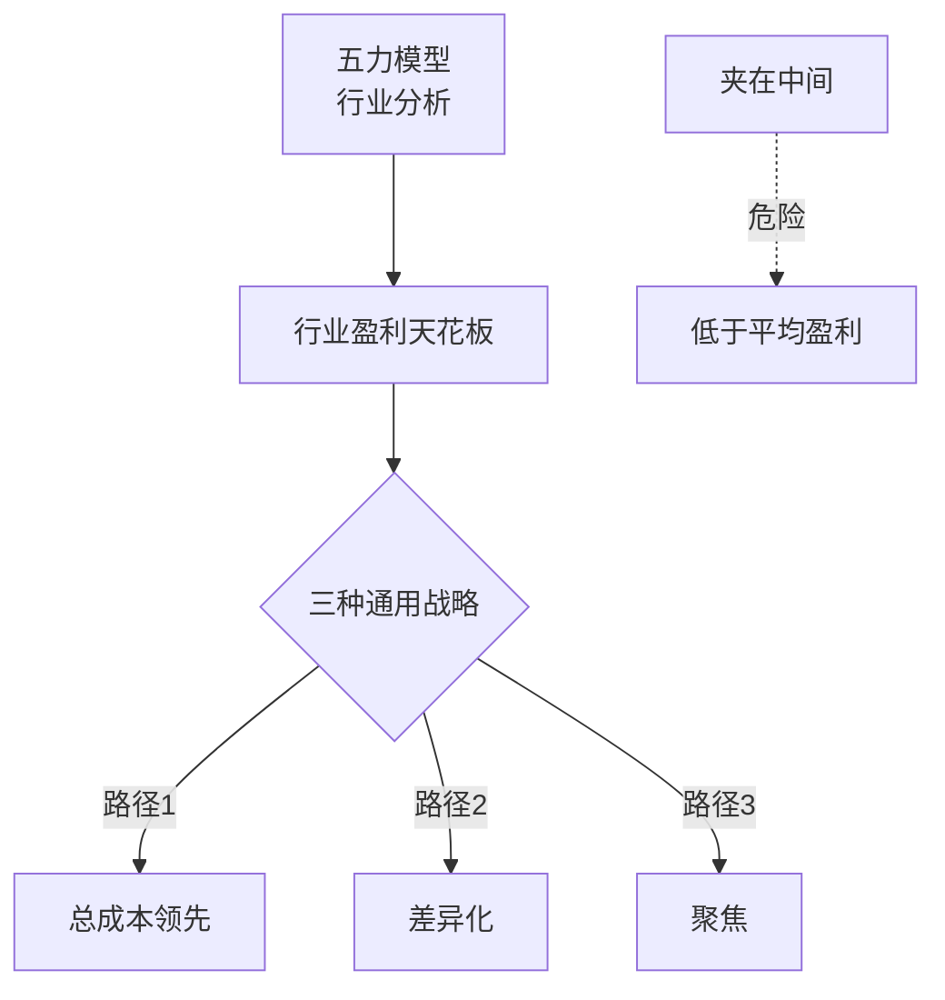

# 《竞争战略》深度读书笔记

> [!abstract] 全书速览
> 企业的盈利能力不是由它有多努力决定的，而是由它所处==行业的结构==和它在行业中的==竞争定位==决定的。五力模型解释了为什么有些行业天生比别的行业赚钱，三种通用战略告诉你在任何行业中只有三条路可以走。选择比努力更重要。

## 核心命题

波特要回答的根本问题是：为什么有些公司比同行更赚钱？

> [!tip] 核心洞见
> 公司的盈利能力首先取决于行业结构，其次取决于战略定位。做得好当然重要，但选择在哪里竞争和用什么方式竞争更重要。

## 框架全景

两个核心模块：==五力模型==回答"这个行业值不值得进入"，==三种通用战略==回答"在这个行业里如何竞争"。先看清棋盘，再决定落子。

## 核心观点深度解读

### 五力模型

五种力量共同决定行业平均盈利水平：

1. **现有竞争者的竞争强度**：对手多且实力相当、增长缓慢、固定成本高、差异化低、退出壁垒高→竞争激烈
2. **新进入者的威胁**：进入壁垒越高现有企业越安全。壁垒包括规模经济、品牌忠诚、资本需求、转换成本、渠道控制、政策限制
3. **替代品的威胁**：限制定价空间。取决于替代品性价比和转换成本
4. **买方的议价能力**：购买量大、转换成本低、信息充分→压低你的价格
5. **供应商的议价能力**：供应商集中、没有替代→抬高你的成本

> [!example] 行业对比
> 航空业五力俱强→长期利润率极低（0.2%）。制药业进入壁垒极高（专利、FDA审批、巨额研发）→利润率丰厚。不是航空公司管理差，是行业结构决定了利润天花板。

### 三种通用战略

**总成本领先：** 成为行业中成本最低的生产者。沃尔玛通过极致供应链效率把成本压到对手无法匹敌。低成本意味着价格战中你是最后被挤出去的。

**差异化：** 提供客户认为独特的东西。核心不是"好一点"而是"好到客户愿意多付钱"。差异化必须是客户真正在乎的。

**聚焦：** 选择狭窄的细分市场，在其中追求成本领先或差异化。劳力士聚焦高端手表，西南航空聚焦短途低价。

> [!warning] 夹在中间
> 既不是成本最低、也没有差异化、也没有聚焦的企业——在每个维度都输给有清晰定位的对手。波特认为这几乎注定了低于平均的盈利。

### 竞争者分析四要素

1. **目标**：它追求份额还是利润？
2. **当前战略**：它怎么竞争？
3. **假设**：它对自己和行业怎么看？（常常是==盲区==）
4. **能力**：它能做什么、不能做什么？

## 这本书的保质期

**依然强大：** 五力模型至今是行业分析的标准框架。三种通用战略的"你必须做出选择"逻辑依然成立。

**需要修正：** 数字时代行业边界模糊（亚马逊是什么行业？），五力模型需要重新定义"行业"。框架本质上是静态的，互联网平台的网络效应创造了赢家通吃的新竞争形态。"夹在中间"的警告在某些行业过于绝对。

> [!note] 波特的后续澄清
> 波特在《什么是战略》中区分了"运营效率"和"战略定位"：运营效率提升让企业在多个维度同时进步，但这不是战略——因为对手也能做到。战略是选择一套独特的活动组合。

## 行动工具箱

**五力快速诊断。** 对你的行业逐一评估五种力量强弱，判断行业利润天花板。

**战略定位审计。** 你是成本最低的？有客户愿意付溢价的差异化？聚焦于做到最好的细分市场？三个都不确定→"夹在中间"警报。

**竞争者四要素分析。** 分析最重要的两三个对手：目标、战略、假设、能力。特别关注它们假设中的盲区。

**行业演变预判。** 判断行业处于生命周期哪个阶段：成长期→扩张；成熟期→成本控制和差异化；衰退期→收割还是退出？

## 延伸阅读

[[《竞争优势》]]是波特续作，从行业分析深入到企业价值链——如果《竞争战略》告诉你"在哪里竞争"，《竞争优势》告诉你"怎么赢"。

[[《好战略坏战略》]]提供了对战略更底层的理解：好战略的核心是诊断、指导方针和协调一致的行动。

[[《创新者的窘境》]]从另一个角度解释了五力模型没有充分覆盖的现象——颠覆性创新从行业外部进入时，现有竞争结构分析可能失效。
