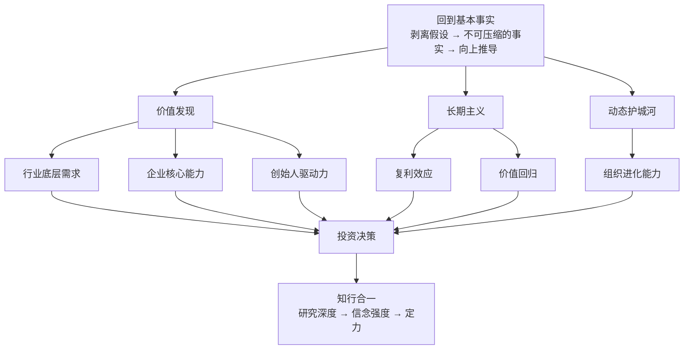

# 《第一性原理》深度读书笔记

> [!abstract] 全书速览
> 高瓴资本创始人张磊在这本书里做了一件极少有投资人愿意做的事：==把自己的底层思考操作系统完整拆开给你看==。他不是在教你怎么选股票或判断市场走势，而是在回答一个更根本的问题——面对一个充满不确定性的世界，你应该用什么样的思维方式去做判断？全书从一个源自亚里士多德的古老概念出发，经由对类比思维的深刻批判，进入投资实战中的价值发现、长期主义和动态护城河，最后延伸到人生选择与知行合一。张磊把自己在高瓴十几年投资实践中积累的判断力，提炼成了一套关于"怎么想问题"的认知框架。这不是一本操作手册，而是一本关于如何穿透表象回到本质的商业哲学书。

## 核心命题

张磊这本书要回答的根本问题是：**大多数人是怎么做决策的？有没有一种更可靠的方式？**

> [!tip] 核心主张
> 绝大多数人的决策建立在"类比"之上——别人怎么做，我也怎么做；行业惯例如此，我也照搬。这种方式安全但平庸。张磊给出的替代方案是：==把所有既有假设全部扔掉，回到最基本的事实——用户到底需要什么？物理和经济的底线在哪里？——从这些不可压缩的事实出发，重新构建自己的判断。==

这个概念最早来自亚里士多德：每个系统都有一个最基本的命题，它不能被违背，也不能从其他命题推导出来。但张磊的贡献在于，他把这个哲学工具拉进了商业实战——不是空谈，而是用高瓴数十年的投资案例来验证。

这本书挑战的核心常识是：**模仿领先者是安全的**。张磊说，模仿最多让你成为第二名，而且一旦游戏规则改变，模仿者是最脆弱的。他们不理解自己在模仿什么，也不知道什么条件的变化会让模仿失效。==只有从根本出发思考的人，才能在变化中找到新的机会。==

在投资哲学的谱系中，张磊深受巴菲特和芒格影响，但做了两个关键修正。第一，巴菲特时代的护城河相对静态，而中国互联网行业变化极快，需要一种"动态护城河"的概念。第二，巴菲特强调"能力圈"，张磊主张能力圈本身应该持续扩展——在快速变化的环境中，固守既有能力圈可能意味着错过最大的机会。

## 框架全景

全书的核心框架是一个==四层递进结构==。

第一层是**概念层**——两种截然不同的思维方式的区分。类比思维的逻辑是"这件事和那件事相似，那件事这么做成功了，所以这件事也这么做"。张磊主张的思维方式完全不同：不关心别人怎么做，只关心最底层的事实是什么。

第二层是**方法层**——如何实际操作。首先列出所有假设，然后逐一质疑每个假设，剥离到最底层不可压缩的事实，再从事实向上重新推导。听起来简单，做到很难，因为人的大脑天生偏好走类比的捷径。

第三层是**应用层**——在投资和商业中的具体运用。这里引入了三个关键概念：长期主义（用时间验证价值的真伪）、价值发现（穿透市场噪音找到真正的价值）、动态护城河（竞争优势不是静态的，而是持续创造价值的能力）。

第四层是**人生层**——从投资延伸到职业选择和人生决策。最好的选择不是"别人觉得好的"，而是从你自己的底层特质出发推导出来的。张磊在最后强调，==最难的不是理解，而是"在压力下坚持"——市场恐慌时、众人狂热时、三年看不到回报时，你还能不能坚持从基本事实出发。==

## 核心观点深度解读

### 类比思维的三重陷阱

张磊对两种思维方式的区分是全书的逻辑起点。

类比思维的运作方式是：看到A和B相似，A的结果是X，所以B的结果也可能是X。别人做电商赚钱了，我也做电商。行业平均利润率是15%，我们的目标也是15%。这种思维的好处是速度快、认知负荷低。但张磊指出它有三个根本缺陷。

第一个缺陷是==原创性为零==。你的判断完全依赖于你模仿的对象是否正确。在投资中，跟随共识只能获得平均回报——因为共识已经被定价了。超额回报只存在于共识还没有到达的地方。

第二个缺陷是==看不到变化==。类比思维的基础是"过去和未来相似"，但当环境发生根本性变化时，这个假设就失效了。柯达在胶片时代的所有成功经验在数码时代都变成了包袱。诺基亚在功能机时代的规模优势在智能机时代毫无意义。模仿者是最脆弱的，因为他们复制了行为但不理解底层逻辑。

> [!example] 马斯克造火箭
> 传统做法是和现有供应商讨价还价——"火箭就是很贵"是行业常识。马斯克做了一件不同的事：火箭由铝、钛、铜、碳纤维组成，这些材料在大宗商品市场上值多少钱？答案是火箭总成本的2%。那98%的溢价来自一次性使用设计和供应链低效。从这个分析出发，SpaceX把火箭成本降低了一个数量级。

第三个缺陷是==把惯性当成真理==。行业"常识"往往只是历史惯性的积累，而非物理定律。马斯克的案例揭示了一个规律：敢于回到基本事实重新推导的人，能看到别人看不到的空间。

> [!warning] 关键前提
> 这里有一个高门槛需要注意。马斯克能质疑火箭成本，是因为他真的懂材料科学、制造工艺和供应链管理。不懂的人去"质疑"行业常识，大概率是把无知包装成独立思考。这种思维方式不是"不听专家的话"，而是"自己也成为专家之后，从基本事实出发形成判断"。

### 长期主义：不是"买了不卖"的傻等

"长期主义"是这本书中出现频率最高的词之一，但张磊对它的定义远比市面上流行的理解深刻得多。

在张磊的框架里，长期主义不是一个模糊的人生信条，而是上述思维方式在时间维度上的延伸。它的逻辑链条是：如果你通过深度分析得出了一个独立于市场共识的判断，那么短期内市场可能不认同你（因为市场还在跟着共识走），但长期来看，如果你的分析是正确的，==价格终将回归价值==。所以，长期主义的核心不是"买了不卖"，而是"基于深度分析做出判断后，有耐心等待判断被验证"。

张磊为长期主义提供了三个底层支撑。

> [!tip] 支撑一：复利效应
> 10%的年化收益，20年后是6.7倍。但张磊把复利扩展到了多个维度——不只是资金复利，还有==知识复利、信任复利、品牌复利==。所有复利曲线都有一个共同特征：前期增长极慢，后期指数爆发。竹子前四年几乎不长——地面上只有几厘米，但它在地下建立庞大的根系。第五年，它在六周内长到30米高。大多数人在前四年就放弃了。

**支撑二：价值回归。** 格雷厄姆的名言——短期市场是投票机，长期市场是称重机。短期内，股价受情绪、热点、资金流驱动，可以和真实价值严重偏离。但长期来看，这些偏离都会被修正。如果你能准确判断价值，时间就是你最强大的同盟。

**支撑三：护城河需要时间。** 品牌认知、网络效应、规模经济——所有真正有价值的竞争壁垒都不是一夜建成的。京东自建物流花了十年和巨额资金，但一旦建成，它就成了其他电商平台无法复制的优势。==快钱往往没有护城河，有护城河的钱往往来得慢。==

> [!warning] 适用边界
> "做时间的朋友"的前提是你有时间。高瓴管理的LP锁定期很长，所以他们能等。但如果你三年后需要这笔钱来买房，你就没有资格"做时间的朋友"。长期主义对资金属性有明确要求，不加区分地鼓吹长期主义是不负责任的。

### 价值发现：穿透噪音找到被误定价的价值

张磊的投资方法论本质上是：用深度分析找到被市场误定价的价值。

市场为什么会误定价？因为大多数人在用类比思维——看股价走势、比较市盈率、听分析师报告。这些都是"二阶信息"，别人加工过的信息。二阶信息已经被市场消化了，基于二阶信息做判断不可能跑赢市场。要发现市场还没有定价的机会，你必须直接触达"一阶事实"。

张磊从三个维度展开价值分析：

**行业的底层需求：这个行业存在的根本原因是什么？** 零售业的底层需求是"让消费者以最低的交易成本获得想要的商品"。形式可以变——从百货商店到超市到电商——但底层需求不变。投资零售业，不应该关注今天谁的GMV高，而应该关注==谁在朝着"更低交易成本"的方向进化最快==。

> [!example] 高瓴投资京东
> 当时京东不赚钱、自建物流烧钱、被很多人看衰。类比思维会说："电商应该轻资产，京东这么重，不对——看看eBay和淘宝。"但从底层需求出发分析：中国电商的核心痛点是假货和物流体验差。用户最不可压缩的需求是正品保障和快速配送。自建物流虽然短期烧钱，但它直接解决了这两个核心痛点——==这是用短期的"错"换长期的"对"。==

**企业的核心能力：剥离品牌光环、行业红利和运气，这家企业真正做对了什么？** 很多企业的成功表面上看是品牌强大、营销到位，但如果你剥离这些表层因素，真正的驱动力往往是某种组织能力或结构性优势。

**人的底层驱动力：创始人为什么在做这件事？** 张磊认为，在长期投资的语境下，创始人的内在驱动力是比商业模式更重要的变量。追求财富的人在赚到足够多的钱后会懈怠。追求权力的人会被内部政治消耗精力。==只有被使命驱动的人——"这件事不做睡不着觉"——才能支撑十年、二十年尺度上的持续投入和进化。==

张磊评估创始人时关注的不是"他说了什么"，而是"他在关键时刻做了什么"。危机中是选择保护短期利润还是坚持长期正确的事？有退路时是选择安逸还是继续冒险？

### 动态护城河：唯一持久的优势是进化能力

张磊继承了巴菲特的"护城河"概念，但做了一个关键升级。

巴菲特时代的护城河是相对静态的：可口可乐的品牌、铁路的特许经营权、信用卡的网络效应。这些优势一旦建立，就能持续很多年。但张磊观察到，在技术变革加速的时代，==静态护城河正在被快速填平==。柯达有品牌和专利，数码相机一来就崩了。诺基亚有规模经济和销售网络，智能手机一来就垮了。

> [!tip] 核心洞察
> 静态护城河的逻辑是"我有什么别人没有"——我有专利、我有品牌、我有规模。动态护城河的逻辑是"我能持续做到什么别人做不到"——不是我现在比你强，而是我有==持续变强的能力==。

> [!example] 亚马逊的护城河
> 亚马逊的护城河不是电商业务本身（这个中国的阿里巴巴和京东都能做），而是不断发现新增长点并快速执行的组织能力——从电商到云计算（AWS）到智能音箱到流媒体，每次进入新赛道都能建立领先地位。这种"持续开辟新战场并获胜"的能力，才是真正无法被复制的。

动态护城河的核心要素有三个：**持续创新的能力**——不只是研发投入，更是组织文化对试错的包容。**组织学习的速度**——面对新信息，能多快把新知识转化为行动。**适应变化的弹性**——当行业发生根本性变化时，能不能快速调整方向。

> [!warning] 识别陷阱
> 很多企业会把"研发投入高"等同于"有动态护城河"。但研发投入是输入，能不能转化为有效的产品和商业模式才是输出。==关注输出（新产品、新市场、新收入来源），而非输入（研发费用绝对值或占比）。==

### 研究深度决定信念强度

张磊反复强调，上述思维方式不是空想，它需要极致的研究深度来支撑。

高瓴的研究方法论包括四个层面：

**全景式研究**——不只研究一家公司，而是研究整个产业链：上游供应商、下游客户、直接竞争对手、潜在替代品、互补品。只有理解了整个生态，才能判断一家公司在生态中的位置和价值。

**跨时间维度研究**——追溯历史理解"为什么走到了今天"，向前推演"未来可能的格局"。很多投资者只看当下数据，但当下只是历史趋势线上的一个点——你需要理解这条线的方向和斜率。

**一手信息获取**——书面材料是二手信息，一手信息来自与行业专家、创始人、一线员工的深度对话。真正重要的洞察——"接下来会发生什么"——往往不会写在财报里。

**逆向思维验证**——每个结论都要问"在什么情况下会错？"这个习惯不是为了否定自己，而是为了识别真正的风险点。如果你无法说出自己的判断在什么情况下会失败，你就还不够理解这个判断。

> [!note] 研究与信念的关系
> 研究深度为什么至关重要？因为==它直接决定了你的信念强度==。投资中最难的不是买入，而是持有——当股价跌了50%、所有分析师都看空时，你还能不能坚持？浅层的了解撑不起深层的信念。只有通过深度研究真正理解了价值创造机制和竞争壁垒，你才能在别人恐惧时保持清醒。

### 人生选择的底层推导

张磊把上述思维方式从投资延伸到人生。核心主张是：==不要因为别人在做而做，不要因为看起来赚钱而做，而是回到你自己最底层的特质、热情和能力，从那里向上推导。==

> [!example] 职业选择的两种思路
> 你站在岔路口，一条路是高薪但你不喜欢的金融分析师，一条路是收入不确定但你热爱的产品设计。类比思维说选金融——因为"大家都觉得金融好"。从底层出发的思维问三个问题：10年后你更可能在哪个领域做到顶尖？哪个方向你愿意周末也研究？哪个领域你的天赋最能发挥？答案往往指向热爱。

张磊还强调了"知行合一"的三个层次：**知道**（理解概念——最容易的）、**相信**（通过实践建立信念——需要时间积累）、**做到**（在最困难的时刻仍然坚持——最稀缺的）。就像你知道锻炼有益健康（知道），你读了医学文献理解了运动的生理机制（相信），但你在下雨天、加班后、情绪低落时仍然坚持去跑步（做到）。==价值不在于你能在舒适的环境里谈论正确的事，而在于你能在困难中践行正确的事。==

## 这本书的保质期

> [!warning] 时效性评估

**跨时代的部分：** 从基本事实出发去思考的习惯，在任何时代、任何领域都不会过时。复利效应的底层数学不会变。长期来看价值终将回归，这在市场经济中持续有效。动态护城河的概念在技术变革加速的时代反而更加重要。知行合一的挑战是人性层面的，不会随时代改变。

**需要打折扣的部分：** 书中的核心投资案例——京东、腾讯、百度——属于中国互联网发展的特定历史阶段，其成功很大程度上受益于==人口红利和移动互联网浪潮==。2020年之后中国商业环境发生了显著变化（平台监管、地缘政治、经济增速放缓），书中对某些行业的乐观判断需要重新评估。高瓴近年在消费品和教育领域的投资面临挑战，说明即使是顶尖机构也无法完全规避宏观环境和政策变化的风险。

**幸存者偏差问题：** 张磊是一个成功的投资人，他的方法论看起来很有说服力。但也许还有很多同样从基本事实出发思考的投资者，他们失败了但没有写书的机会。书中的案例大多是成功投资，用某种思维方式解释已经成功的投资是容易的，但在决策时点上识别正确答案是困难的。

**概念模糊性：** "回到最基本的事实"是一个有力但也容易被滥用的概念。什么算最基本的事实？谁来判定？两个同样声称从基本事实出发的人，可能得出完全相反的结论——那谁对？这个概念没有提供足够的判定标准来区分真正的底层分析和包装成底层分析的臆断。

## 行动工具箱

> [!tip] 可直接应用的框架

**工具一：假设剥离清单。** 每次做重要决策之前，列出四项：(1) 我这个判断依赖了哪些假设？(2) 这些假设哪些是"别人也这么说"的？(3) 剥离掉别人的说法，还剩下什么我自己验证过的事实？(4) 从这些事实出发，我应该得出什么结论？

**工具二：价值评估五维框架。** 评估任何商业机会时用五个维度：需求基础（用户的底层需求是否真实且持久？）、价值创造（企业解决了什么别人解决不了的问题？）、竞争壁垒（这个优势能不能被轻易复制？）、动态进化（企业有没有持续创新和自我更新的能力？）、人的因素（创始人/团队的驱动力和学习能力如何？）。

**工具三：逆向思维验证。** 每个重要判断都过一遍：(1) 这个结论在什么情况下会错？(2) 我是不是在做类比而非真正的底层分析？(3) 有没有幸存者偏差——我只看到了成功案例？(4) 如果市场条件发生根本变化，这个判断还成立吗？

**工具四：时间透镜。** 做每个重要选择时，把时间拉长到不同尺度来看：1年后怎样？5年后怎样？10年后呢？如果一个选择短期有利但长期有害，谨慎对待；如果短期痛苦但长期有巨大价值，认真考虑。

**工具五：本周可以开始的一件事。** 选择一个你正在纠结的决策，花30分钟做"假设剥离"练习——把所有你"听说"的观点列出来，然后逐一追问"这是我验证过的，还是别人说的？"你会惊讶地发现，大部分判断建立在二手信息上。

## 延伸阅读

[[《价值》]]是张磊另一本著作，更侧重投资案例和方法论的具体实践。如果说《第一性原理》是"道"，《价值》更接近"术"，两本合在一起才能完整理解张磊的投资体系。[[《穷查理宝典》]]中芒格关于多元思维模型的论述与张磊的底层分析形成互补——张磊强调纵向的深度（剥离到最底层），芒格更强调横向的广度（用多个学科的框架交叉验证）。[[《从0到1》]]中蒂尔的核心理念高度一致——"竞争是失败者的游戏，真正的创新是从0到1"。[[《创新者的窘境》]]中克里斯坦森的"颠覆性创新"理论可以被视为"为什么静态护城河会失效"的系统性解释。
