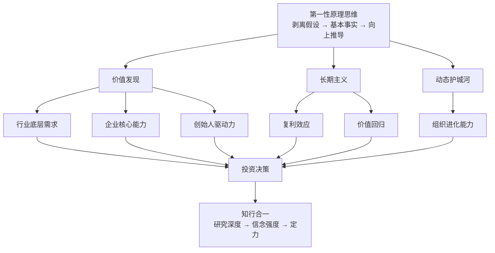

# 《第一性原理》深度读书笔记

> [!abstract] 全书速览
> 高瓴资本创始人张磊将一个源自亚里士多德的哲学概念带入投资实战，回答一个核心问题：==在充满不确定性的世界里，如何找到决策的基石？== 答案是：剥离所有类比、惯例和他人的做法，回到最基本的事实，从那里向上重新推导。全书从概念定义出发，经由方法论（剥洋葱式的假设剥离）、投资应用（长期主义、价值发现、动态护城河）、到人生决策的迁移，构成一个四层递进结构。最终指向一个难以回避的问题：知道正确的做法是一回事，在压力下坚持正确的做法是完全另一回事。

## 核心命题

张磊这本书要回答的根本问题是：**大多数人是怎么做决策的？有没有更好的方式？**

他的观察是：绝大多数人的决策建立在"类比思维"之上——别人这么做了、行业惯例是这样、专家建议是那样——于是我也那样做。这种方式安全但平庸，因为你永远在别人画好的框架里思考。

张磊给出的替代方案是"第一性原理思维"：==把所有既有假设全部扔掉，回到最基本的事实——用户到底需要什么？物理和经济的底线在哪里？——从这些不可压缩的事实出发，重新构建自己的判断。==

这个概念最早来自亚里士多德：每个系统都有一个最基本的命题，它不能被违背，也不能从其他命题推导出来。但张磊的贡献在于，他把这个哲学工具拉进了商业实战——不是空谈，而是用高瓴数十年的投资实践来验证。

这本书挑战的常识是：**模仿领先者是安全的**。张磊说，模仿最多让你成为第二名，而且一旦游戏规则变化，模仿者是最脆弱的——他们不知道自己模仿的是什么，也不知道什么条件变化会使模仿失效。只有从根本出发思考的人，才能在变化中找到新的机会。

## 框架全景

全书的核心框架是一个==四层递进结构==：

第一层是**概念层**：什么是第一性原理？它和类比思维有什么区别？张磊用大量案例（尤其是马斯克造火箭的故事）来建立直觉理解。

第二层是**方法层**：如何找到第一性原理？这不是玄学，而是有具体步骤——首先剥离所有假设，然后回到基本事实，最后从事实向上推导。听起来简单，做到很难，因为我们的大脑天生偏好类比。

第三层是**应用层**：第一性原理在投资和商业中怎么用？这里引入了几个关键概念：长期主义（时间是最好的验证者）、价值发现（穿透市场噪音找到真正的价值）、动态护城河（竞争优势不是静态的，而是持续创造价值的能力）。

第四层是**人生层**：这套思维不只适用于投资，也适用于职业选择、学习策略、人生决策。==最好的选择不是"别人觉得好的"，而是"从你自己的底层特质出发推导出来的"==。

四层之间有清晰的递进关系：理解概念→掌握方法→商业应用→人生延伸。但张磊强调，最难的不是理解，而是"在压力下坚持"——市场恐慌时、众人狂热时、三年看不到回报时，你还能不能坚持从第一性原理出发？这就是全书最后强调的"知行合一"。

---

## 核心观点深度解读

### 观点一：类比思维的陷阱

> [!tip] 核心洞察
> 类比是大脑的省力模式，但它让你永远在别人的框架里思考，而且一旦游戏规则改变，模仿者是最脆弱的。

张磊区分了两种截然不同的思维方式。

**类比思维**的逻辑是：这件事和那件事相似，那件事这么做成功了，所以这件事也这么做。别人做电商赚钱了，我也做电商。行业平均利润率是15%，所以我们的目标也是15%。这种思维的好处是低风险、容易执行、不需要太多深度思考。坏处是你永远跟在别人后面，而且一旦游戏规则改变，你会发现自己建立在沙子上。

**第一性原理思维**的逻辑是：用户真正需要的是什么？满足这个需求的物理/经济底线在哪里？达到这个底线的最佳路径是什么？——不管别人怎么做，从最基本的事实出发重新推导。

> [!example] 马斯克造火箭
> 传统思维是"火箭就是很贵的"——因为历史上所有火箭都很贵。马斯克的思路是：火箭的原材料（铝、碳纤维、钛）成本只占售价的2%，那98%贵在哪里？答案是一次性使用设计和供应链低效。如果火箭能回收、零件自己造，成本能降低一个数量级。

这个案例揭示的规律是：==行业"常识"往往只是历史惯性的积累，而非物理定律==。敢于回到基本事实重新推导的人，能看到别人看不到的空间。

但这里有一个重要陷阱需要注意：第一性原理思维需要极深的行业理解。马斯克能质疑火箭成本，是因为他真的懂材料科学、制造工艺、供应链管理。不懂的人去"质疑"行业常识，大概率是把无知包装成独立思考。

> [!warning] 适用前提
> 第一性原理不是"不听专家的话"，而是"自己也成为专家之后，从基本事实出发形成判断"。没有深厚的行业知识做基础，所谓的"从第一性原理出发"只是换了一种说法的空想。

---

### 观点二：长期主义——时间是最好的验证者

> [!tip] 核心洞察
> 长期主义不是"买了不卖"的傻等，而是基于对复利、价值回归、护城河构建规律的深刻理解，有耐心等待正确的判断被时间验证。

张磊认为，第一性原理在投资和商业中最重要的应用就是**长期主义**。当你回到最基本的事实——用户需求、技术趋势、人性规律——你会发现，真正有价值的东西都需要时间来积累，而短期波动只是噪音。

长期主义的底层支撑有三根柱子：

**第一根柱子是复利效应。** 10%的年化收益，20年后是6.7倍。但张磊把复利扩展到了多个维度——不只是资金复利，还有==知识复利、信任复利、品牌复利==。所有这些复利曲线都有一个共同特征：前期增长极慢，后期指数爆发。只有熬过前期，才能享受后期。

> [!example] 竹子的生长
> 竹子前四年几乎不长——地面上只有几厘米。但它在地下建立庞大的根系。第五年，它在六周内长到30米高。大多数人在前四年就放弃了，因为他们看不到地下的根。长期主义就是理解"根"的人。

**第二根柱子是价值回归。** 格雷厄姆的名言：短期市场是投票机，长期市场是称重机。短期内，市场受情绪、热点、资金流驱动，价格和价值可以严重偏离。但长期来看，价格终将回归价值。所以，如果你能准确判断价值，时间就是你的朋友。

**第三根柱子是护城河需要时间。** 品牌认知、网络效应、规模经济、转换成本——所有持久的竞争优势都不是一夜建成的。==快钱往往没有护城河，有护城河的钱往往来得慢==。京东自建物流花了十年和巨额资金，但一旦建成就成了其他电商平台无法复制的优势。

> [!warning] 适用边界
> "做时间的朋友"的前提是你有时间。高瓴管理的LP锁定期很长，所以他们能等。但如果你三年后需要这笔钱来买房，那你就没有资格"做时间的朋友"。==长期主义对资金属性有明确要求，不加区分地鼓吹长期主义是不负责任的。==

---

### 观点三：价值发现——穿透市场噪音

张磊的投资方法论本质上是：==用第一性原理找到被市场误定价的价值==。

市场为什么会误定价？因为大多数人在用类比思维——他们看的是股价走势、市盈率对比、分析师预测——这些都是"二阶信息"，别人加工过的信息。第一性原理要求你穿透这些，直接看"一阶事实"：这家企业到底在为用户创造什么价值？这个价值能不能持续？

张磊从三个维度分析价值：

**行业的第一性原理**：这个行业存在的根本原因是什么？用户的底层需求是什么？零售业的底层需求是"让消费者以最低的交易成本获得想要的商品"。形式可以变——从百货商店到超市到电商——但底层需求不变。投资零售业，要看的不是今天谁的GMV高，而是谁在朝着"更低交易成本"的方向进化。

**企业的第一性原理**：剥离掉品牌光环、行业红利、运气成分，这家企业真正做对了什么？能不能持续做对？

> [!example] 高瓴投资京东
> 当时京东不赚钱、自建物流烧钱、被很多人看衰。类比思维会说："电商应该轻资产，京东这么重，不对。"但第一性原理分析：用户最核心的需求是正品+快速配送+好的服务体验。自建物流虽然短期烧钱，但长期构建了不可复制的竞争壁垒——==这是用短期的"错"换长期的"对"==。

**人的第一性原理**：创始人的底层驱动力是什么？是追求财富、权力，还是被使命驱动？张磊认为，==只有被使命驱动的人才能支撑十年、二十年尺度上的持续进化==。追求财富的人在赚到足够多的钱后会懈怠，追求权力的人会被内部政治消耗精力。只有"这件事不做睡不着觉"的人，才能在漫长的时间尺度上持续投入。

张磊评估创始人时关注的不是"他说了什么"，而是"他在关键时刻做了什么"——危机中是选择保护短期利润还是坚持长期正确的事？有退路时是选择安逸还是继续冒险？

---

### 观点四：动态护城河——唯一持久的优势是进化能力

> [!tip] 核心洞察
> 静态护城河会被时代填平，只有"持续创造价值的能力"才是真正的护城河。

张磊继承了巴菲特的"护城河"概念，但做了重要升级。

巴菲特时代的护城河是相对静态的：品牌（可口可乐）、特许经营权（铁路）、网络效应（信用卡）、规模经济（零售商）。这些优势一旦建立，就能持续很多年。

但张磊指出，在技术变革加速的时代，==静态护城河正在被快速填平==。柯达有品牌和专利，但数码相机一来就崩了。诺基亚有网络效应和规模经济，但智能手机一来就垮了。

所以张磊提出了"动态护城河"：真正的护城河不是你今天拥有什么，而是你持续创造价值的能力。

> [!example] 亚马逊的护城河
> 亚马逊的护城河不是电商业务本身（这个可以被模仿），而是不断发现新增长点并快速执行的组织能力——从电商到云计算（AWS）到智能音箱（Alexa）到流媒体（Prime Video），每次都能在新赛道建立领先地位。这种"持续开辟新战场并获胜"的能力，才是真正无法被复制的。

动态护城河的核心要素包括：

- **持续创新的能力**：不只是研发投入，更是组织文化对试错的包容
- **组织学习的速度**：能不能比竞争对手更快地把新知识转化为行动
- **适应变化的弹性**：面对行业剧变，能不能快速调整方向

> [!warning] 识别陷阱
> 很多企业会把"研发投入高"等同于"有动态护城河"。但==研发投入是输入，能不能转化为有效的产品和商业模式才是输出==。关注输出（新产品、新市场、新收入来源），而非输入（研发费用绝对值或占比）。

---

### 观点五：研究深度决定信念强度

张磊反复强调，第一性原理思维不是空想，它需要极致的研究深度来支撑。

高瓴的研究方法论包括四个层面：

**全景式研究**——不只研究一家公司，而是研究整个产业链：上游供应商、下游客户、直接竞争对手、潜在替代品、互补品。只有理解了整个生态，才能判断一家公司在生态中的位置和价值。

**跨时间维度研究**——追溯历史理解"为什么走到了今天"，向前推演"未来可能的格局"。历史告诉你规律，推演帮你预判变化。

**一手信息获取**——书面材料是二手信息，一手信息来自与行业专家、创始人、一线员工的深度对话。真正重要的洞察往往不会写在财报里。

**逆向思维验证**——每个结论都要问"在什么情况下会错？"这个习惯不是为了否定自己，而是为了识别真正的风险点。

> [!example] 研究深度的日常类比
> 普通做法是看看周边房价、问问中介。第一性原理研究法是：查城市规划、研究交通网络变化、了解学校医院规划、分析人口流入趋势、和住在那里的人聊真实居住体验。做完这些，你的判断力和那些只看价格的人完全不在一个层次。

研究深度为什么重要？因为==它直接决定了你的信念强度==。投资中最难的不是买入，而是持有——当股价跌了50%、所有分析师都看空时，你还能不能坚持？浅层的了解撑不起深层的信念。只有真正通过深度研究理解了价值创造机制和竞争壁垒，你才能在别人恐惧时保持清醒。

---

### 观点六：人生选择的底层逻辑

张磊将第一性原理从投资延伸到人生：==不要因为别人在做而做，不要因为看起来赚钱而做，而是回到你自己最底层的特质、热情和能力，从那里向上推导。==

人生选择的三个原则：

**选择做自己热爱的事。** 热爱是持久努力的燃料。那些"为了赚钱而做的事"，在赚到钱之后往往会停滞；那些"睡觉都在想的事"，才能支撑你度过看不到回报的岁月。

**选择和优秀的人在一起。** "与谁同行比去向何方更重要"。你周围人的平均水平，很大程度上决定了你的天花板。优秀的同伴能拉高你的标准、拓展你的认知。

**选择做有长期积累的事。** 避免"每天从零开始"的工作。优先选择知识、技能、声誉、关系能复利积累的方向。今天做的事，应该让明天的你比今天更强。

> [!example] 职业选择的两种思维
> 你站在岔路口，一条路是高薪但你不喜欢的金融分析师，一条路是收入不确定但你热爱的产品设计。类比思维说选金融——因为"大家都觉得金融好"。第一性原理问三个问题：10年后你更可能在哪个领域做到顶尖？哪个方向你愿意周末也研究？哪个领域你的天赋最能发挥？——答案往往指向热爱。

张磊还强调了"知行合一"的三个层次：

1. **知道**：理解概念——这是最容易的
2. **相信**：通过实践建立信念——需要时间积累
3. **做到**：在最困难的时刻仍然坚持——这是最稀缺的

> [!example] 知行合一的日常体现
> 你知道每天锻炼有益健康——这是"知道"。你读了医学文献、理解了运动对心血管和大脑的机制——这是"相信"。你在下雨天、加班后、情绪低落时仍然坚持去跑步——这是"做到"。第一性原理的价值不在于你能在舒适的环境里谈论它，而在于你能在困难中践行它。

---

## 这本书的保质期

> [!warning] 时效性评估

**永恒适用的部分：**

- 第一性原理的思维方法本身是哲学工具，不受时代限制
- 复利效应的底层数学规律不会变
- 长期主义的核心逻辑（价值终将回归）在市场经济环境中持续有效
- 动态护城河的概念在技术变革加速的时代反而更加重要
- 知行合一的挑战是人性层面的，不会随时代改变

**需要注意时代背景的部分：**

- 书中的具体投资案例（京东、腾讯等）属于中国互联网发展的特定历史阶段，==其成功很大程度上受益于中国市场的人口红利和移动互联网浪潮==
- 2020年之后，中国商业环境发生了显著变化（平台监管、地缘政治、经济增速放缓），书中对某些行业的乐观判断需要重新评估
- "长期主义"策略在高通胀、地缘冲突频繁的宏观环境下，面临比书中描述更大的挑战

**被验证的部分：**

- 高瓴早期投资的几家企业确实实现了长期价值增长
- "动态护城河"的判断被很多传统企业的衰落所证实（柯达、诺基亚等）
- 研究深度与投资信念强度之间的正相关关系被广泛认可

**需要重新审视的部分：**

- 高瓴近年在某些消费品和教育领域的投资面临挑战，说明即使是顶尖机构也无法完全规避宏观环境和政策变化的风险
- "做时间的朋友"在利率上升、流动性收紧的环境下，机会成本更高了
- 书中对中国市场持续高增长的隐含假设需要根据新的经济现实进行调整

---

## 行动工具箱

从书中提炼出可直接应用的框架：

**工具一：决策前的"假设剥离清单"**

每次做重要决策之前，列出：
1. 我这个判断依赖了哪些假设？
2. 这些假设哪些是"别人也这么说"的？
3. 剥离掉别人的说法，还剩下什么我自己验证过的事实？
4. 从这些事实出发，我应该得出什么结论？

**工具二：价值评估的五维框架**

| 维度 | 核心问题 |
|------|---------|
| 需求基础 | 用户的底层需求是否真实且持久？ |
| 价值创造 | 企业解决了什么别人解决不了的问题？ |
| 竞争壁垒 | 这个优势能不能被轻易复制？为什么？ |
| 动态进化 | 企业有没有持续创新和自我更新的能力？ |
| 人的因素 | 创始人/团队的驱动力和学习能力如何？ |

**工具三：逆向思维验证清单**

每个重要判断都要过一遍：
1. 这个结论在什么情况下会错？
2. 我是不是在做类比而非真正的底层分析？
3. 有没有幸存者偏差——我只看到了成功案例？
4. 如果市场条件发生根本性变化，这个判断还成立吗？
5. 有没有我忽略的反面证据？

**工具四：职业选择的三问法**

面对重大职业决策时问自己：
1. 10年后，我更可能在哪个方向做到顶尖？
2. 哪个方向我愿意周末也花时间研究？
3. 哪个方向我的独特优势最能发挥？

**工具五：本周可以开始做的一件事**

选择一个你正在纠结的决策，花30分钟做"假设剥离"练习：把所有你"听说"的观点列出来，然后逐一追问"这是我验证过的，还是别人说的？"——你会惊讶地发现，大部分判断建立在二手信息上。

---

## 延伸阅读

- [[《价值》]]：张磊另一本著作，更侧重投资案例，和本书形成互补。如果说《第一性原理》是"道"，《价值》更接近"术"
- [[《穷查理宝典》]]：芒格的思想集，强调"多元思维模型"——从多个学科借用框架来避免单一视角的盲区，与张磊的底层分析形成互补
- [[《从0到1》]]：彼得·蒂尔的核心理念与第一性原理高度一致——"竞争是失败者的游戏，真正的创新是从0到1"
- [[《反脆弱》]]：塔勒布从另一个角度讨论不确定性——不是预测未来，而是构建一个能从不确定性中获益的系统，与张磊的长期主义可以互补
- [[《创新者的窘境》]]：克里斯坦森的"颠覆性创新"理论是理解"为什么静态护城河会失效"的系统性解释
- [[《思考，快与慢》]]：卡尼曼对认知偏差的系统性研究，帮助理解为什么"知行合一"如此困难
